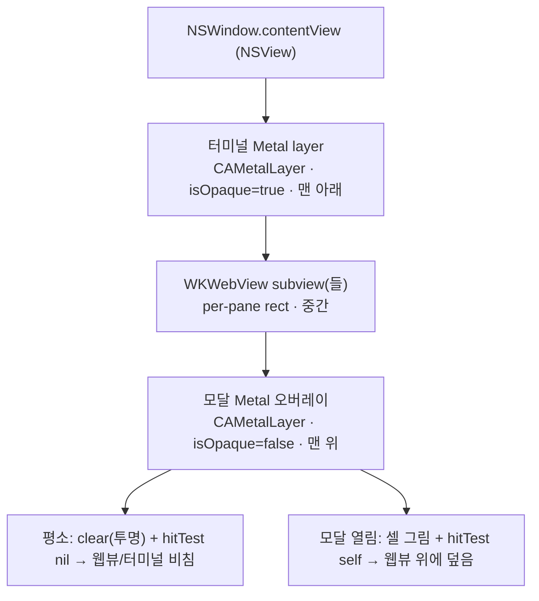

# 웹 패널 인프라 (WKWebView 합성·z-order·임베드)

이 문서는 Maru에 리치 웹 패널(마크다운 WYSIWYG 편집·인앱 브라우저)을 WKWebView로 임베드하는 **표시·합성·입력**의 단일 출처다. 패널을 통한 세션 제어·브리지 *계약*은 [세션 컨트롤 플레인](control-plane.md)이 소유하고, 이 문서는 "WKWebView를 maru 창에 어떻게 올리고 합성하는가"에 집중한다.

레이어 경계는 [레이어링과 이식성](layering-and-portability.md), 네이티브 뷰 비사용 예외(리치 웹 패널)는 [구현 계획](implementation-plan.md) UI 렌더 전략·[macOS 앱 호스트 경계](macos-app-host-boundary.md), 탭/split 모델은 [탭·split·레이아웃](tabs-splits-layout.md)을 단일 출처로 둔다.

> 핵심 가정은 구현 전 spike로 실측했다(2026-06): ① 투명 Metal 오버레이가 WKWebView 위에 합성(z-order) — GUI 확인, ② isolated `WKContentWorld` 브리지 격리 — headless `evaluateJavaScript` 확인. 본문의 "실측 확정"은 이 spike 결과를 가리킨다.

## 1. 확정 결정

- **웹 패널 = WKWebView subview, 모달 = 별도 Metal 오버레이 레이어.** 둘 다 단일 contentView의 NSView/CALayer 합성으로 쌓는다. (네이티브 뷰 비사용의 닫힌-열거 예외 — 마크다운 WYSIWYG·인앱 브라우저. diff는 GPU 셀. [control-plane.md] §1.)
- **z-order = 3겹 합성** (실측 확정): 터미널 Metal layer(아래) < WKWebView(중간) < 투명 Metal 오버레이(모달, 위). 투명 `CAMetalLayer`(`isOpaque=false`)가 WKWebView 위에 합성돼 모달이 웹뷰 위에 비친다.
- **모달은 NSView가 아니라 Metal 오버레이 레이어.** NSView 모달은 OS별(Win32/GTK) 재작성이라 이식성을 깬다. Metal 오버레이는 기존 셀 렌더 로직을 재사용하고 이식 시 GPU 백엔드만 교체된다(터미널 렌더와 동일).
- **브리지 보안 = isolated `WKContentWorld`** (실측 확정): 브리지를 isolated world에만 등록하면 임의 웹페이지의 page-world JS는 `window.maru`에 닿지 못하고, maru 신뢰 코드(isolated world)만 닿는다. `browser` 패널엔 미주입. 신뢰 콘텐츠는 `maru-app://` 커스텀 스킴으로 서빙한다.
- **per-pane rect ABI = 신규.** 현재 Swift는 사이드바 폭·셀 origin만 받는다. 각 web surface의 pane 사각형(x,y,w,h 포인트)을 Swift에 push하는 ABI를 추가한다.
- **콘텐츠 빌드 = zntc** (dev-only 빌드 도구 — [control-plane.md] §1).

## 2. 합성 위상

subview 순서가 z-order다. 맨 위 오버레이는 평소 투명이라 아래 웹뷰·터미널이 비치고, 모달이 열릴 때만 그린다.

## 3. NSView 합성 계층

현재 `contentView`는 단일 `MaruMetalTerminalView`(CAMetalLayer) 하나다. 웹 패널을 위해 세 겹으로 쌓는다:

1. **터미널 Metal layer** (맨 아래): 기존 셀·사이드바·탭바·pane chrome. `isOpaque=true`.
2. **WKWebView subview** (중간): web surface마다 하나, per-pane rect에 `frame`. split이면 여러 개.
3. **모달 Metal 오버레이** (맨 위): command palette·find·confirm. `isOpaque=false`, 평소 clear(투명), 모달 열림 시에만 셀을 그린다.

**모달 레이어 분리(선행 리팩터):** 현재 모달은 터미널과 같은 render pass에서 `modal_cells_start` 분할점으로 그려진다. 이를 별도 최상위 CAMetalLayer로 옮긴다. 모달의 셀 렌더 로직·테마는 그대로 재사용하고 **대상 layer만** 분리하므로 GPU chrome 전략(네이티브 뷰 비사용)을 깨지 않는다.

## 4. per-pane rect ABI (신규)

- 현재: `terminal_origin_x_px`(사이드바 폭) + 셀별 origin만 Swift로 흐른다. per-pane 사각형은 없다.
- 신규: 각 web surface의 pane rect(x,y,w,h 포인트)를 Swift에 push. 레이아웃 변경(resize·split·사이드바 폭·탭 스크롤) 시 갱신한다.
- Swift는 그 rect로 해당 WKWebView의 `frame`을 맞춘다. 좌표 계산(셀↔px, pane 기하)은 Zig가 소유한다([macos-app-host-boundary.md] 정책 — Swift는 OS 호출만).

## 5. frame 동기화

- 레이아웃 변경마다 per-pane rect → WKWebView `frame`.
- 탭 전환: 활성 web surface만 보이게(`isHidden=false`), 비활성은 `isHidden=true`(WKWebView가 살아 있어 스크롤·로그인·재생 상태 유지).
- split: leaf마다 WKWebView를 각 rect에 둔다.

## 6. 입력·포커스·hitTest

- WKWebView가 포커스를 가지면 키 입력은 웹뷰로 간다. maru 앱 키바인딩(⌘T·⌘W 등)은 먼저 가로채고 나머지는 웹뷰로 보낸다.
- 모달 오버레이의 입력 라우팅: 평소 `hitTest`가 `nil`을 반환해 이벤트가 아래 웹뷰로 통과하고, 모달 열림 시 `self`를 반환해 이벤트를 잡는다(실측 spike의 `OverlayView.hitTest` 패턴).

## 7. 신뢰 게이트·브리지 (실측 확정)

- 브리지(`window.maru.*`)는 **isolated `WKContentWorld`에만** 등록한다 — 페이지의 page-world JS(임의 웹사이트·광고 iframe 포함)는 브리지를 보지 못한다.
- 신뢰 콘텐츠(마크다운 UI 등)는 maru가 빌드해 **`maru-app://` 커스텀 스킴**으로 서빙한다. maru의 기능 주입은 isolated world에서 `evaluateJavaScript`로 한다.
- `browser` 패널(임의 URL)은 `trust=untrusted`로 브리지를 **주입하지 않는다**.
- 실측: 임의 페이지(page-world)에서 `window.webkit.messageHandlers.maru`가 `undefined`, isolated world에서만 접근·호출 가능함을 확인했다.

## 8. 생명주기

- 탭 전환: 활성 show / 비활성 hide(상태 유지).
- 세션 종료: 해당 WKWebView teardown.
- 멀티윈도우: 각 AppSession(창)이 자기 web surface·오버레이를 가진다. quick terminal은 별도 NSPanel이라 자기 합성 스택을 갖는다.

## 9. 베이스와 결정 (clean-room)

- WKWebView 임베드·isolated `WKContentWorld`·`WKURLSchemeHandler`(커스텀 스킴)는 WebKit 표준 API.
- 모달 오버레이 z-order는 CALayer 합성 표준(네이티브 오버레이가 웹뷰 위로 그려지는 일반 패턴) + `hitTest` 라우팅.
- maru 독립 설계: 모달을 NSView가 아닌 **Metal 오버레이 레이어**로(이식성), per-pane rect ABI, 신뢰 게이트.

## 10. 구현 ([control-plane.md] Phase 4~5와 연계)

- **Phase 4(껍데기)**: NSView 3겹 합성 + per-pane rect ABI + 모달 레이어 분리 + 빈 WKWebView가 탭/split 추종.
- **Phase 5(브리지)**: isolated world 브리지 + `maru-app://` 스킴 + [control-plane.md] `browser.*` 연결.

## 11. 테스트·검증

- **자동(headless)**: 브리지 격리(`evaluateJavaScript`로 page-world `window.maru === undefined` 단언), per-pane rect 계산(셀↔px) 단위, WKWebView `frame`·NSView 계층(z-order 순서) 값 단언.
- **수동/시각**: z-order 픽셀 합성(모달이 웹뷰 위에 비침 — spike로 확인), frame 추종은 GUI에서 눈 확인.
- 합성 스크린샷은 `CGWindowListCreateImage`가 macOS 15+에서 제거됐으므로 ScreenCaptureKit 또는 GUI 수동 확인을 쓴다(headless 환경은 시각 캡처 불가).

## 12. 리스크

- 모달 레이어 분리 리팩터(현재 단일 render pass) — Phase 4 선행.
- 이식: WebKitGTK(Linux)·WebView2(Windows) 위에 GPU 오버레이를 합성하는 건 OS별 컴포지터(DirectComposition·GTK) 검증이 필요(미래).
- per-pane rect ABI 신규 배선.
- 투명 `CAMetalLayer` 오버레이는 maru 렌더러가 `isOpaque=true` 가정이라 오버레이용 별도 설정이 필요(spike로 가능 확인, 통합 시 재확인).

## 13. 코드 위치 (구현 시 채움)

- 합성·WKWebView·브리지: `platform/macos/web_panel.{zig,swift}`
- per-pane rect ABI: `platform/macos/app_host_abi.{zig,h}`
- 모달 레이어 분리: `platform/macos/maru_metal_renderer.{h,m}`(별도 오버레이 layer), `renderer/metal_frame.zig`
