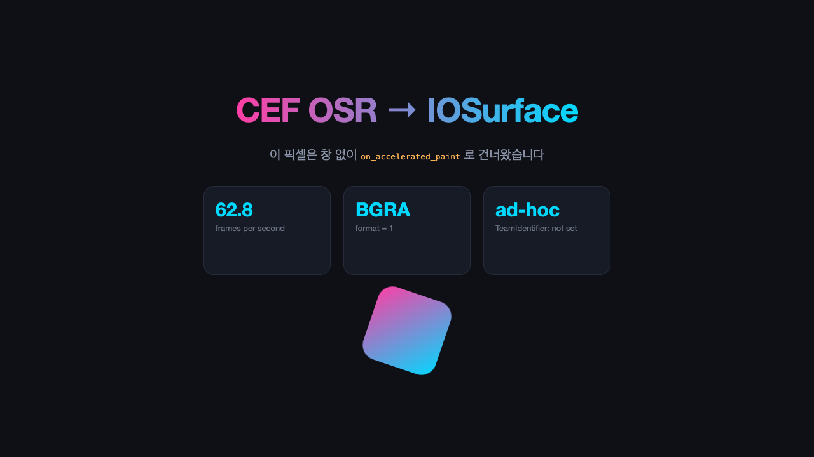
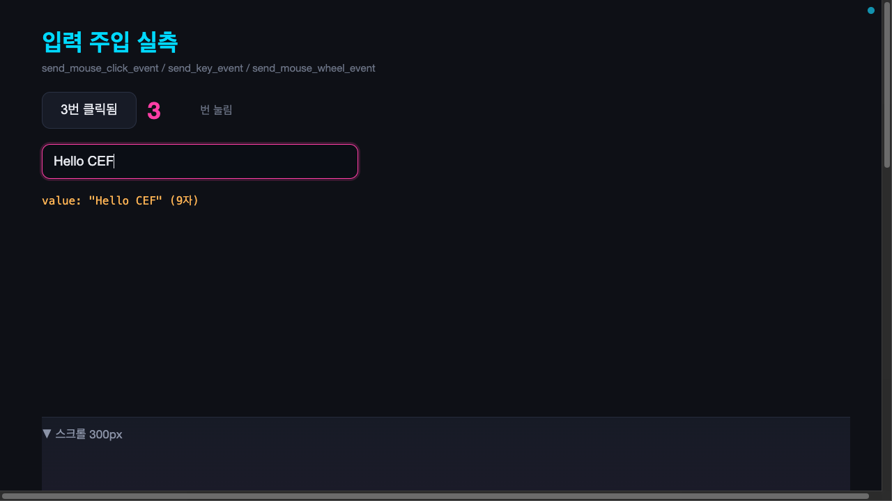

# 웹 패널 인프라 (WKWebView 합성·입력·임베드)

이 문서는 Maru에 리치 웹 패널(마크다운 WYSIWYG 편집·인앱 브라우저)을 WKWebView로 임베드하는 **합성·입력·web 특유 보안**의 단일 출처다. **세션 제어·브리지 신뢰 게이트 계약은 [세션 컨트롤 플레인](control-plane-security.md) §8이 소유**하고, 이 문서는 "WKWebView를 maru 창에 어떻게 올리고·입력을 라우팅하고·web 특유 위협을 막는가"에 집중한다(브리지 게이트를 여기서 재서술하지 않는다).

레이어 경계는 [레이어링과 이식성](layering-and-portability.md), 네이티브 뷰 비사용 예외(리치 웹 패널)는 [메뉴바와 커맨드 팝업 구현 계획](plans/menu-and-command-palette.md) UI 렌더 전략·[macOS 앱 호스트 경계](macos-app-host-boundary.md), 탭/split 모델은 [탭·split·레이아웃](tabs-splits-layout.md), 윈도우 간 detach/reattach와 WKWebView reparent 선행은 [윈도우와 Surface 이동성](window-surface-mobility.md)을 단일 출처로 둔다.

> **spike로 실측한 범위(2026-06)**: ① 투명 Metal 오버레이가 WKWebView 위에 합성되는 **z-order 순서**(GUI), ② isolated `WKContentWorld`에서 임의 page-world JS가 브리지에 못 닿음(headless). **그 둘만** 확인했다. 입력/firstResponder 라우팅·실제 셀 모달 합성·드래그 인터랙션·per-pane 좌표계는 **미검증 리스크**(§12)다.

## 계약 문서 구성

웹 패널 계약은 아래 문서가 나눠 소유한다. **절 번호는 파일을 넘어 이어진다** — 다른 문서와 코드 주석이
`web-panel.md §7.1`처럼 절 번호로 가리키므로 재번호하지 않는다.

| 절 | 문서 | 소유 |
|---|---|---|
| §1~§7 · §9 · §11~§13 | 이 문서 | 확정 결정, 합성 계층, 좌표계, 입력·키 라우팅, chrome 인터랙션 제약, surface ABI, 보안, 베이스와 결정, 검증, 리스크, CEF 백엔드(범위 밖) |
| §8 | [빠진 기능](web-panel-features.md) | 제품으로 서기 위해 채워야 하는 기능의 계약 |
| §10 · §14 | [구현 계획](plans/web-panel.md) | Phase 순서·코드 위치·기능별 슬라이스 이력 |

## 1. 확정 결정

- **웹 패널 = WKWebView subview, 모달 = 별도 Metal 오버레이 레이어.** 단일 contentView를 컨테이너로 바꾸고 3겹으로 합성한다(§2).
- **z-order(WKWebView subview 모델 전용)**: 터미널 Metal layer(아래) < WKWebView(중간) < 투명 Metal 오버레이(모달, 위). **spike로 순서 합성만 확인**. 실제 셀 모달(텍스트·둥근 모서리·그림자·테마)을 투명 layer에 그린 합성은 Phase 4 종료 게이트에서 GUI 골든으로 1회 확정한다(§11). 이 골든은 렌더러의 자연폭/2-quad/role 기반 글리프 계약도 함께 확인한다.
- **모달은 NSView가 아니라 Metal 오버레이 레이어** — GPU chrome 철학(셀 렌더 재사용) 일관성 때문이다. **"이식성" 때문이 아니다**: "네이티브 웹뷰 위 GPU surface 합성"은 OS별 컴포지터 문제(macOS=CALayer subview, Windows WebView2=별도 HWND, Linux=Wayland subsurface)라 다른 OS에선 합성 모델을 타깃 시점에 재결정한다([layering-and-portability.md] §4 "호스트는 타깃별 신규").
- **입력 라우팅은 합성과 별개의 1급 문제다**(§4) — "layer만 분리"가 아니다. 모달이 그려지는 것과 키 입력이 모달에 가는 것은 다르다.
- **web 특유 보안**(§7): `maru-app://` 콘텐츠에 엄격 CSP + 스킴 핸들러 경로 샌드박스, `.md`는 "신뢰 렌더러가 그리는 **비신뢰 데이터**"(새니타이즈), untrusted 패널은 데이터스토어·프로세스 격리. **브리지 신뢰 게이트 자체는 [control-plane-security.md] §8.1 단일 출처.**
- **프론트엔드 개발환경 = zntc** (dev server/preview/build/bundle, dev-only, 확정). `web/` 하위 Bun workspace는 패키지 설치·락파일·script 실행·프론트엔드 단위 테스트(`bun test`)를 맡는다. JS/TS 품질 게이트는 VoidZero/Oxc 계열의 `oxlint`·`oxfmt`를 쓴다. Vite+에는 모노레포 config·task runner가 있지만, 전체 도입은 zntc 개발환경과 Bun test runner와 역할이 겹치므로 기본값에서 제외하고 필요 시 Vite Task만 별도 검토한다. **CEF는 미래 native webview-backend plugin 후보**(일반 Wasm/action plugin 아님 — §13).
- **미래 콘텐츠 소비처: 관측성 trace inspector**(후속). 캡처한 세션을 스텝별로 넘겨보는 **관전형 HTML 뷰어**를 이 패널에 띄운다(네이티브 패널을 새로 만들지 않고 재사용 — 자기완결 HTML이라 패널 완성 전엔 외부 브라우저로도 열림). replay 엔진 재사용·단일 출처. 상세: [trace-replay.md](trace-replay.md) "GUI inspector 설계 방향".
- **웹 패널 전에 필요한 이동성 foundation만 먼저 잡는다.** Maru-owned browser/markdown surface는 별도 창으로 detach된 뒤 다시 합쳐질 수 있어야 한다. 따라서 Phase 1 live collector 전에는 `SurfaceIdAllocator`/`WindowMembershipSnapshot`을 확정하고, Phase 4 WKWebView hosting 전에는 그 M0 완료를 확인한 뒤 `WindowGraph`/`LiveSurfaceRegistry`를 확정한다([window-surface-mobility.md](window-surface-mobility.md)). command 이동/drag/reparent UX는 Phase 4 이후에 따라와도 된다. 합쳐지지 않는 브라우저는 Maru surface가 아니라 `Open in External Browser` 경로다.

## 2. 합성 계층

현재 `contentView`는 단일 `MaruMetalTerminalView`(CAMetalLayer)이고, 이 뷰가 firstResponder로 keyDown·IME·마우스·DnD·hover를 전부 받는다. 웹 패널을 위해 **contentView를 컨테이너 NSView로 바꾸고** 세 겹을 쌓는다:

1. **터미널 Metal layer**(맨 아래): 기존 셀·사이드바·탭바·pane chrome. `isOpaque`는 무조건 true가 아니다 — `window.opacity<1`이면 현재 코드가 metalLayer·window의 `isOpaque`를 모두 false로 내리고 chrome 배경(`chromeCellBg`/`chromeQuadBg`)까지 반투명이다. WKWebView와의 정합은 §8.
2. **WKWebView subview(들)**(중간): web Term마다 하나, **본문 rect**에만(§5). split이면 여러 개:
   활성 워크스페이스 탭의 pane 트리를 walk해 **web Term마다** WKWebView(`MaruWebPanelView` 래퍼) 하나를 붙이고, 각 웹뷰를
   **자기 pane 본문 rect에 고정**한다(4c의 활성 pane 추종을 완전 제거 — 사용자 관찰 해소). 같은 pane의 활성 Term만 show·
   비활성 탭 web Term과 비활성 워크스페이스 탭의 web Term은 zero rect + hidden으로 보존한다. Swift는 `webPanels[surface_id]`
   dict로 batch 전이(create/destroy/reframe/hide/show)를 적용한다. Term 이동 시 재부모화는 후속(4e-4·§6).
   dict로 batch 전이(create/destroy/reframe/hide/show)를 적용한다. 이 보존 계약은 파일 패널의 미저장 편집과 브라우저의 페이지·폼 상태를 워크스페이스 전환에서 잃지 않게 하고, 집합을 떠나지 않은 surface에 `browser.closed`를 발행하지 않게 한다. Term 이동의 재부모화 계약은 §6을 따른다.
3. **모달 Metal 오버레이**(맨 위): command palette·find·confirm. `isOpaque=false`, 평소 clear(투명), 모달 열림 시에만 셀을 그린다.

**모달 레이어 분리는 두 개의 선행 리팩터다**(Phase 4 선행, 가벼운 작업이 아님):
- **(a) 렌더러 분할**: 현재 모달은 터미널과 같은 cells 배열·같은 draw pass에서 `modal_cells_start` 인덱스로만 갈린다. same-pass 전제는 over-quad(`layer=1`)·그림자·셀 clip scissor(`clip_index`, ABI v169)에 더해 **커서 blink 페이드 pass(ABI v95, v146에서 구간 명시화)**까지다 — caret은 단일 cells 버퍼 + 단일 fragment opacity uniform 전제이고 draw 위치가 모달 유무로 갈리므로(모달 열림 시 모달 텍스트 뒤), 분리 시 caret pass를 소유 레이어로 재배선한다. 셀당 2-quad(×12 vertex) 오프셋 규약(`modal_cells_start*12`·`cursor_start*12`의 기반)도 두 패스에 그대로 이관한다. **v146 정정**: caret은 더 이상 "버퍼 맨 끝 suffix"가 아니다 — caret 없는 오버레이 셀(포커스 테두리·drop 하이라이트·드래그 고스트)이 커서 뒤에 붙으면 그 가정이 깨져 옛 코드가 `cursor_cells=0`으로 접었고, 그 결과 커서가 본문과 함께 불투명하게 그려져 **blink가 죽었다**(`appendFocusOwnerBorder`가 상시 흘러 사실상 항상 재현). 이제 `cursor_start`를 ABI로 명시해 커서가 버퍼 어디에 있든 구간을 특정하고, 렌더러가 본문을 커서 앞/뒤 두 구간으로 나눠 그린다. 이를 `drawTerminal(layer, cellSubset[, caret])` / `drawOverlay(layer, modalCells+quads+shadow[, caret])` 두 패스로 재분할한다. **caret은 조건부 이중 소유**다 — 모달이 닫힌 평시 caret은 터미널 콘텐츠라 `drawTerminal` 소유, 모달 열림 시에만 모달 텍스트 위 `drawOverlay` 소유로 이관한다(현재 `has_modal` 분기가 draw 위치를 가르는 그 지점). 두 CAMetalLayer의 drawable·redraw·**generation 게이팅을 독립 추적**한다(현 `lastSeenMetalGeneration` 단일 가정 변경). 셀 clip 재배선 대상 — 주의: `MTLScissorRect`는 **좌상단 원점**이다(활성 scissor·per-quad clip과 같은 규약).
  - **present 원자성 불변식(tearing 방지)**: 두 레이어의 generation이 독립이면, 모달 열림/닫힘 **전이 프레임**은 두 레이어를 원자적으로 함께 바꿔야 하는 프레임인데(터미널 레이어에서 caret 제거 + 오버레이에 모달+caret 그림) 서로 다른 vsync에 커밋되면 tearing(모달만 새 프레임·배경은 옛것, 또는 caret 0개/2개)이 난다. 전이 프레임은 **두 레이어를 같은 `CATransaction`에서 커밋**(또는 both-ready까지 both-hold)하고, caret 소유권 이관은 그 단일 커밋 경계에서만 일어난다. 검증 artifact: 전이 프레임에서 caret이 정확히 1개.
  - **b2 구현 present 계약(단일 command buffer + 조건부 오버레이 present)**: 원자성은 `CATransaction`이 아니라 **두 drawable을 한 `MTLCommandBuffer`에 present + 단일 commit**으로 얻는다(`maru_metal_renderer_draw`). command buffer는 **drawable 획득 전에** 잡아, 큐 고갈 시 잡힌 drawable이 없게 하고(누수 0), 인코더 생성이 실패해도 이미 잡은 drawable을 present+commit으로 pool에 되돌린다. **오버레이는 매 프레임 present하지 않는다** — 그릴 내용이 있거나(`has_modal || shadow`) **직전 present가 content였는데 이번엔 비었을 때(clear 전이)**만 present한다(`overlay_needs_present = overlay_has_content || impl.overlayHadContent`). 빈→빈이면 오버레이 present를 통째로 건너뛰어(모달 없는 평상시 이중 present·컴포지터 낭비 제거) CAMetalLayer가 마지막에 present한 투명 clear를 유지한다. content→빈 전이 프레임엔 clear를 present해 **닫힌 모달 잔상**을 지운 뒤 `overlayHadContent`를 갱신한다. **drop-retry**: present가 필요한데 오버레이 drawable을 못 잡으면(pool starvation) `overlay_content_dropped=true` → `maru_metal_renderer_draw`가 false를 반환하고, Swift `drawMetalFrame`이 **`metalNeedsRedraw=true`로 세워 다음 tick에 재시도**한다(정적 모달·닫힘 clear 유실 방지). 재시도 트리거가 `lastDrawnGeneration`이 **아니라** `metalNeedsRedraw`인 이유: tick 게이트가 `lastSeenMetalGeneration`을 무조건 전진시켜 generation 불일치 재시도는 무력이기 때문이다.
- **(b) 호스트 재편**: contentView를 컨테이너로, 입력 responder를 명시 위임(§4). 오버레이용 `isOpaque=false` + transparent clear 분기(터미널 전용 `terminal_bg`/opacity clear와 별도).

## 3. 좌표계와 frame 동기화

- **기하는 이미 Zig에 있다.** 셀별 `origin_x/origin_y`·`terminal_origin_x_px`로 split pane별 픽셀 origin을 export하고, pane rect(w,h)는 `paneTermRect`가 내부 보유. per-pane rect는 새 수학이 아니라 **기존 내부값 노출 + surface 생애주기**다(§6).
- **좌표계**: 모든 ABI 좌표는 **backing-px·좌상단 원점**이고 WKWebView `frame`은 **포인트·좌하단 원점**이다. ABI는 px로 export하고, **Swift가 `firstRect` 선례대로 px→pt + y-flip**을 한다(기존 관행). backing-scale 변경 시 rect + drawable을 원자적으로 갱신.
- **frame 동기화 트리거**: resize·split·사이드바 폭·탭 스크롤뿐 아니라 **divider 드래그 live-resize·pane zoom·pane/Term 드래그·워크스페이스 전환**까지. 매 변경 시 본문 rect → WKWebView frame.
- **async desync와 사용자 피드백 반영(2026-07-18)**: 터미널 Metal은 tick(기본 60Hz·30~120 config — [io-render-threading.md] §10, "30Hz"로 굳히지 않는다)에 동기 repaint하고 WKWebView frame은 AppKit/WebKit 비동기 재레이아웃을 거치므로 한 프레임 jitter 가능성은 있다. 그러나 실제 제품 피드백에서 drag 전체 동안 문서가 사라지는 비용이 훨씬 컸으므로 **가림 대신 live reframe**을 정식 정책으로 택한다. `surfaceDiff`가 rect 변화가 있을 때만 `reframe`을 내고 `visible`은 유지한다.
- **입력 안전성과 정확한 anchor**: outer/group divider mouse-down은 WebView seam이 통과시킨 뒤 Metal view가 받으며, AppKit은 그 responder에 후속 drag/up을 계속 전달하므로 이동 중 WKWebView가 보여도 gesture 소유가 바뀌지 않는다. 확장 grab band 안에서 실제 divider 선이 아닌 곳을 눌렀다면 down 시 `divider - pointer` signed offset을 저장하고 모든 drag 좌표에 더한다. 따라서 첫 이동에서 경계가 포인터로 점프하지 않고 `pointer delta == divider delta`가 유지된다. snapshot 가림은 live reframe 성능이 실제 계측 예산을 넘을 때만 후속 옵션으로 재검토한다.

## 4. 입력·firstResponder·키 라우팅 (BLOCKER 해소)

합성만으로는 부족하다 — WKWebView가 포커스를 쥐면 `keyDown`/`performKeyEquivalent`가 WKWebView로 가고 Metal 뷰로 오지 않는다. 그러면 모달이 오버레이에 그려져도 키가 안 간다. 다음을 정한다:

- **모달 firstResponder 전이**: 모달(palette/find/confirm/rename) 열림 시 입력 responder를 **오버레이(또는 Metal 뷰)로 makeFirstResponder**, 닫힘 시 직전 WKWebView로 복원. 모달 입력·IME preedit가 이 경로로 흐른다.
- **maru 키바인딩 가로채기**: ⌘T·⌘W·⌘1.. 등 앱 액션은 WKWebView 포커스 중에도 먼저 잡아야 한다. WKWebView 서브클래스의 `performKeyEquivalent` override 또는 local event monitor로 — 메커니즘을 하나 택해 명시(현 코드는 오버레이 중 메뉴 keyEquivalent를 일부러 우회하므로 그 경로와 정합 필요). **(4d 확정: `performKeyEquivalent` override — 근거는 아래 spike 결과.)**
- **`anyOverlayOpen` 게이트**: 웹 패널 포커스 시 "활성 세션"이 무엇인지 정의해 게이트가 올바른 surface를 읽게 한다.
- **마우스(hitTest)**: 모달 오버레이는 평소 `hitTest=nil`(아래로 통과), 모달 열림 시 `self`(잡음). **(4d 실제: 오버레이는 `nil` 유지하고, 대신 웹 패널 래퍼가 모달 열림 시 `nil`을 반환해 클릭을 아래 터미널로 통과시킨다 — 오버레이가 `self`면 클릭이 dead-end라 모달 바깥-클릭 dismiss가 깨지므로, 통과가 더 안전하고 최소다.)**
- **Phase 4 코딩 전 입력 responder spike 선행**(가장 깨지기 쉬운 IME 코드를 건드리므로): WKWebView 포커스 중 모달 열림 → responder 전이 → IME preedit → 복귀를 실측해 메커니즘(`performKeyEquivalent` override vs local event monitor)을 **착수 전에 확정**한다. 자동 테스트가 어려워 spike+수동이 유일 안전망이다.

**spike 확정 결과(4d, 코드 실측 근거)**: 메커니즘을 **`performKeyEquivalent` override**로 확정한다(local event monitor 기각). 근거:
  1. **모든 maru 앱 키바인딩은 Zig `default_app_bindings`(config/keybinding.zig)가 단일 출처**다. 초기 4d spike는 keyDown 재진입으로 이 가설을 검증했지만, FP10/ABI v132의 제품 계약은 typed `maru_macos_app_session_web_key_route` → `maru_macos_app_session_dispatch_web_app_action`이다. 후자는 같은 `KeyBindingResolver.resolveWebDetailed`을 다시 평가해 현재 `Action`만 직접 실행하므로 terminal copy/paste·scroll·macro 전처리와 PTY write를 우회한다. 메뉴 keyEquivalent는 발견성용 병렬 경로이고, WebKit 소유/explicit consume/app action 판정은 Zig resolver가 자기완결한다.
  2. **터미널 IME 무회귀**: 웹 래퍼(`MaruWebPanelView`)의 override는 **웹이 포커스일 때만** 동작하고(그 외엔 `false`만 반환) 터미널 뷰의 keyDown/`NSTextInputClient`/`performKeyEquivalent`를 **한 줄도 건드리지 않는다**. local event monitor는 매 keystroke(한글 조합 포함)를 앱 전역에서 가로채는 병렬 경로라 터미널 IME 폭발반경이 크고, 현행 performKeyEquivalent+`anyOverlayOpen` 패턴과도 이질적이라 기각.
  3. **모달 responder 전이**: 웹 포커스 중 모달이 열리면(`anyOverlayOpen` false→true 엣지) `makeFirstResponder(터미널 뷰)`로 전이해 모달 입력·IME preedit가 터미널 `NSTextInputClient`로 흐르고, 닫히면(true→false) 직전 웹뷰로 복원한다. 전이는 **기존** `becomeFirstResponder`(imeFocus true)/`resignFirstResponder`(commitComposition)를 그대로 태운다 — 새 IME 로직 없음. 엣지는 매 tick + 모달 여는 조합 직후 동기로 조정한다(조합 직후 타이핑이 웹뷰로 새지 않게).
  - **자동으로 못 잡는 부분(수동 필수)**: 실제 포커스 전이·한글 preedit 라우팅·복원·기존 터미널 IME 무회귀는 GUI 손 테스트만 확정한다(§11). smoke는 `web_panel_focused`(시작 시 웹이 firstResponder를 안 훔침 = false)만 결정적으로 단언한다.
  - **포커스 기준 분기(웹 소유 키 → WebKit 양보)**: **클립보드 키 `⌘C`/`⌘V`/`⌘A`는 WebKit이 받는다** — 웹 패널 포커스 시 메뉴바 편집 항목이 표준 셀렉터를 WebKit responder chain으로 넘긴다(§4.2 단일 출처). `⌘F` 페이지 내 find는 **[빠진 기능](web-panel-features.md) §8이 계약을 소유**한다(라우팅 기준은 포커스가 아니라 `activeWebSurfaceIdAnyKind` — §8이 그 이유를 적는다). 초기 4d 최소 spike는 빈 about:blank라 Cmd-조합을 전부 maru로 라우팅했고(⌘C/⌘V가 웹이 아니라 터미널에 작용하지만 빈 페이지라 무해), 실콘텐츠에서 이 분기 정책은 Zig/config와 §4.2가 소유한다.

### 4.1 웹↔터미널 포커스 동기 불변식 (4g — 흩어진 포커스 패치 통합)

이 불변식은 4g-0(ABI v112 `active_web_surface_id_any_kind`)·4g-1(v113 `addr_edit_surface` → 14차 리뷰 후 v114 `terminal_owns_input`으로 단일화)로 배선돼 있다 — Swift `reconcileWebFocus()`가 매 tick 돌며 옛 `reconcileWebModalFocus` 등 흩어진 패치를 대체한다.

**문제(관측 — 이 절이 해결한 것)**: Phase 7 손 테스트에서 포커스 버그가 **반복** 나왔다 — ⑴ 브라우저 보던 중 ⌘Q 종료 모달이 Enter로 안 닫힘 ⑵ 주소창 편집→터미널 클릭 시 포커스가 브라우저로 튐 ⑶ 터미널→브라우저 web 클릭 후 ⌘R 무동작 ⑷ 브라우저 탭을 활성화해도 webview에 포커스가 안 가 ⌘R 게이트가 stale ⑸ 키보드 pane 전환(⌘⌥→)이 webview 포커스를 안 옮김. 근본 원인은 WKWebView 네이티브 `firstResponder` 관측을 사용자 intent와 동일시하거나 Zig 활성 모델과 병렬 권위로 둔 데 있다. programmatic/accessibility focus도 같은 관측을 만들므로 passive reconcile은 정책을 바꿀 수 없다.

**불변식(단일 출처)**: **명시적 primary-down/typed completion → Zig owner → `firstResponder`**.
- 활성 pane의 활성 term이 **web term** → 그 **webview**가 firstResponder.
- 활성 pane의 활성 term이 **terminal** → **터미널 뷰**가 firstResponder.
- **override(우선순위)**: **모달 열림**(notice 제외) 또는 **터미널-라우팅 텍스트 입력**(주소창 편집·rename·사이드바 검색) → **터미널 뷰**(그 입력은 Zig `handleKeyEvent` 경로라 터미널 뷰가 소유). 이 판정은 Zig `terminalOwnsInput`(=`anyModalOverlayOpen ∪ addr_edit ∪ rename ∪ sidebar_search`) **단일 출처**다(4g-3 통합, ABI `terminal_owns_input`). 모달/편집이 끝나면 불변식이 복원한다(별도 focus-restore pending 불요). 비-모달 notice(토스트)는 제외 — 지나가는 토스트가 입력 responder를 뺏으면 안 되고, Zig 키 intercept(rename/addr_edit/sidebar_search)도 같은 `anyModalOverlayOpen` 게이트를 쓴다.

**입력·reconcile 순서**:
1. **명시적 입력 → Zig 활성**: `MaruWebPanelView.hitTest`가 overlay/seam을 제외한 실제 primary-down에서만 `webPanelPrimaryDown`을 호출한다. file panel은 `focus_file_panel_surface`, workspace browser는 `activate_surface` 뒤 `focus_workspace_input`을 호출한다. 이미 firstResponder인 같은 WebView 재클릭도 새 intent로 전달된다. programmatic/accessibility focus와 매 tick 관측은 이 권한이 없다.
   - **"실제"의 기준은 `super.hitTest`가 non-nil인 것**이다. `hitTest`는 이벤트 수신이 아니라 **조회** 함수라, AppKit이 목적지를 찾는 동안 이 패널의 frame **밖** 좌표로도, 숨긴 패널에도 호출한다. 이벤트 타입만 보고 통지하면 **탭 바 클릭이 web surface를 활성화해 터미널 탭을 눌러도 브라우저로 되튄다**(Phase 7 손 테스트 재발 → `MARU_DEBUG` 로그에서 클릭마다 `activate_surface`가 찍혀 확정). 결과가 nil이면 이 패널도 그 자손도 그 클릭을 받지 않으므로 통지하지 않는다 — drop-zone 드래그 중 `isHidden` 패널도 이 기준으로 함께 걸러진다.
2. **typed dock completion → Zig 활성**: surface publish를 기다리는 파일 Term은 `.dock_pending`(FP16 — 옛 `.dock_group`)에서 text/paste를 fail-close하고, `PendingDockFocus`의 EntryId/surface/epoch/revision 검증과 native firstResponder 성공 뒤에만 `.dock_surface`로 승격한다.
3. **Zig 활성 → firstResponder**: 매 tick `reconcileWebFocus`는 `focused_dock_surface`와 `active_web_surface_id_any_kind`만 읽어 해당 webview 또는 터미널 뷰로 맞춘다. firstResponder 관측으로 `activate_surface`, `focus_workspace_input`, Swift file-focus 상태를 갱신하지 않는다.

**이 하나가 흩어진 것을 대체(subsume)한다**:
- `reconcileWebModalFocus`(모달→터미널) = override 규칙.
- `reconcileWebFocusActivation`(클릭→활성) = explicit `webPanelPrimaryDown`.
- `cancelAddrEdit`의 `addr_focus_restore_pending`(편집 종료 시 webview 복원) = addr_edit override 해제 후 Direction 1이 복원(pending 불요·단순화).
- ⌘R `activeWebSurfaceId` 게이트 = Direction 1이 브라우저 탭 활성 시 webview를 포커스하므로 `isWebPanelFocused`가 신뢰 가능해져 원 게이트로 회귀 가능(belt-and-suspenders로 유지 가능).

**필요 표면**: `activate_surface`(v78, 있음). **활성 web surface getter 확장** — 현 `activeWebSurfaceId`는 browser 전용(0=아님)이라, Direction 1이 활성 pane이 **어떤 web kind든**(browser·markdown) 그 webview를 포커스하려면 "활성 pane 활성 term이 web이면 surface_id + kind, 아니면 0"이 필요하다(신규 getter 또는 확장, Zig 순수·헤드리스 테스트). Swift는 surface_id→webPanels로 webview 조회.

슬라이스와 완료 이력은 [웹 패널 구현 계획](plans/web-panel.md)이 소유한다.
- **4g-3 (14차 리뷰 후속 — 완료)**: override 판정을 `anyOverlayOpen ∪ addr_edit`에서 **`terminalOwnsInput` 단일 출처**로 교체(ABI `addr_edit_surface`→`terminal_owns_input`, v113→v114). 옛 override는 ⑴ **rename·사이드바 검색을 빠뜨려** web pane 활성 중 그 편집 키가 웹뷰로 샜고(리뷰 [0]) ⑵ **notice까지 세어** 비-모달 토스트가 편집 responder를 뺏었다(리뷰 [3]). 겸사로 Zig 키 intercept 3개(rename/addr_edit/sidebar_search)도 `anyOverlayOpen`→`anyModalOverlayOpen`으로 일치, 주소창 편집 chord 처리는 **⌘A/C/V/X/Z를 제외**해 ⌘V가 편집을 통째 날리던 회귀 수정([1], 소비 no-op으로 편집 보존·실 붙여넣기는 후속), 잘못된 주소 무효 시 편집 유지 docstring 정정([5]), `focusTerminalView` 재downcast→바인딩된 `tv` 재사용([8]). **헤드리스**: 브라우저 web term 닫기 확인([4]) + `terminal_owns_input(null)=0` ABI 테스트. **GUI 손 테스트 필요**: web pane 위 rename/사이드바 검색이 웹뷰로 안 새는지, 주소창서 ⌘V가 편집을 안 지우는지, 모달 Enter·키보드 pane 전환 무회귀.
- **4g-4 (파일 도크 교차 영역 입력 회귀 — 완료, 2026-07-18)**: 도크가 열린 mouse-down 경로의 `dockGroupAtPoint(...) orelse return`이 도크 밖 클릭까지 함수 전체에서 종료해, workspace browser는 보이지만 주소창·탭·터미널을 조작할 수 없었다. group hit는 조건부로 처리하고 **실제 dock rect 안** Metal 클릭만 소비하도록 바꿔 바깥 클릭은 workspace hit-test로 흐른다. 도크를 연 browser 주소창 클릭→`addr_edit_surface`/`terminalOwnsInput`→문자 입력까지 red→green 통합 테스트로 고정했다.

**리스크·검증**: 코어 포커스라 회귀 시 **모달·타이핑·IME가 깨진다** → firstResponder는 AppKit이라 헤드리스 불가, **GUI 손 테스트가 유일 안전망**(§11). 특히 `reconcileWebModalFocus`(검증된 모달 Enter 동작)를 대체하므로 그 무회귀를 재확인한다. Zig getter(4g-0)만 헤드리스. 기존 터미널 IME/keyDown은 **한 줄도 안 건드림**(4d 규율 유지 — override는 makeFirstResponder만).

### 4.2 메뉴바 편집 키(Copy·Paste·Select All) 포커스 인지 분기 — 클립보드 복붙 단일 출처

`performKeyEquivalent`의 `WebKeyRoute`가 `web_editor`/`pass_through`에서 이벤트를 소비하지 않고 넘겨도(§4 spike), **앱 메뉴바의 편집 항목이 자체 keyEquivalent로 그 키를 먼저 가져간다**. `Edit▸Copy(⌘C)`·`Paste(⌘V)`는 컨트롤러 셀렉터 `menuCopy`/`menuPaste`(각각 터미널 선택 복사·PTY 붙여넣기), `Select All(⌘A)`은 카탈로그 `select_all`(터미널 전체 선택)에 배선돼 **first responder와 무관하게 발화**한다. 그래서 이 세 키만은 `WebKeyRoute`가 "WebKit에 양보"해도 실제로는 터미널로 갔고, 이것이 도크·브라우저에서 웹 선택 복사/붙여넣기가 안 되던 근본 원인이다(`⌘X`/`⌘Z`/`⌘S`/`⌘F`는 충돌 메뉴 항목이 없어 이미 `WebKeyRoute`로 CM6/WebKit에 도달하므로 저장 smoke는 통과하고 복붙만 깨진 관측과 정합).

**계약(단일 출처)**: 이 세 메뉴 항목은 **key window의 first responder가 웹 패널(도크 파일 뷰 `filePanelKind∈{1,2}` 또는 워크스페이스 브라우저 `filePanelKind==0`) 안쪽이면 표준 편집 셀렉터를 responder chain으로 넘긴다** — `Copy→copy:`, `Paste→paste:`, `Select All→selectAll:`. 그러면 first responder인 WKWebView(WKContentView)가 WebKit 네이티브 복사/붙여넣기/전체 선택을 수행한다. first responder가 웹 패널이 아니면(터미널·모달·`.dock_group` publish 대기 등 `terminalOwnsInput` 상태 포함) 기존 터미널 경로 그대로다. 판정 소스는 Swift `firstResponderWebPanel()`(key window firstResponder의 superview 사슬에서 `MaruWebPanelView` 탐색) 하나이며, 세 진입점(`menuCopy`·`menuPaste`·`runCatalogAction`의 `select_all`)이 이를 공유한다.

**모드별 결과**: `live`·`source` 마크다운은 CM6가 복사·붙여넣기·전체 선택을 모두 처리한다. `read` 마크다운·`html`은 편집기가 아니므로 **선택 텍스트 복사(⌘C)와 전체 선택(⌘A)만** WebKit이 수행하고 붙여넣기(⌘V)는 삽입 대상이 없어 no-op이다. 이는 [key-input-and-shortcuts.md](key-input-and-shortcuts.md)의 `web_editor`/`pass_through` "WebKit에 양보" 계약을 **메뉴바 축에서 실제로 성립**시키는 보완이다.

**베이스·결정**: responder chain 표준 셀렉터 dispatch(macOS 관용 — WKWebView는 `copy:`/`paste:`/`selectAll:`을 이미 지원). 대안인 "터미널 Metal 뷰에 `copy:`/`paste:`/`selectAll:` NSResponder 구현 + 메뉴 `target=nil` 표준 체인 전환"은 가장 관용적이나 **가장 민감한 터미널 입력·IME 경로**를 건드려 블라스트 반경이 커 기각(사용자 결정 2026-07-21). `⌘F` 페이지 내 find는 §8이 소유한다(포커스가 아니라 `activeWebSurfaceIdAnyKind` 기준).

**검증**: firstResponder는 AppKit이라 헤드리스 불가 — **GUI 손 테스트가 유일 안전망**(§11). ⑴ 도크 `read` `.md`·`.html`에서 텍스트 선택 후 `⌘C`→외부 앱 붙여넣기로 확인, ⑵ `live`/`source`에서 `⌘C`/`⌘V`/`⌘A`가 CM6에 작용, ⑶ 터미널 포커스에서 `⌘C`/`⌘V`/`⌘A`가 기존대로 터미널에 동작(무회귀), ⑷ 모달 열림·`.dock_group` publish 대기 중에는 터미널 경로.

## 5. WKWebView가 막는 터미널-chrome 인터랙션

z-order상 모달(최상위)을 제외한 모든 터미널 마우스 인터랙션이 웹 pane 위에서 WKWebView에 가로채인다. 다음을 정한다:

- **WKWebView frame을 padding된 본문 rect로 한정**한다 — pane 탭바·divider seam·pane grip을 Metal 노출 영역으로 남긴 뒤, terminal grid와 동일한 `window.padding-{top,right,bottom,left}`를 본문 안쪽에 적용한다. workspace web Term과 파일 도크 WebView가 `layout_math.insetRect`를 공유하며, tab/header/divider 기하는 padding 소비자가 아니다.
- **drop-zone split 생성**(Term 탭을 본문 4분할에 드롭)은 드래그 중 대상 WKWebView를 `isHidden`/`hitTest nil`로 임시 통과시키고, drop-zone 하이라이트는 **모달 오버레이(최상위)**에 그린다(터미널 Metal 레이어에 그리면 WKWebView에 가림).
  - **구현(렌더러 슬라이스 — 완료)**: 탭/pane 드래그 시각물 두 가지 — drop-target 반투명 하이라이트(bg-only 셀)와 floating 고스트(끌리는 대상 라벨 박스)를 **터미널 레이어(`pane_overlay`/`pane_frames`) → 최상위 오버레이 레이어**로 옮겼다. `MetalFrameBuffer.replace`에 `drag_overlay_frame`(고스트 PaneFrame — raster는 `buildMergedUploadsN` `drag_raster`로 머지)·`drag_overlay_cells`(하이라이트 bg 셀) 두 채널을 추가하고, 이들이 있으면 `modal_cells_start`를 오버레이 영역 시작으로 세워 렌더러 `has_modal`(실은 "오버레이 영역 존재") 경로로 **WKWebView 위** 오버레이 CAMetalLayer에 그린다. ABI·`MetalFrame` 구조체·렌더러 `.m` draw 로직 **무변경**(modal_cells_start가 이미 구동). 드래그가 없으면 두 채널이 비어 옛 경로와 byte-identical(무회귀). **오버레이 영역 순서 = [하이라이트(아래)] [드래그 고스트(중간)] [모달(위)]** — 모달을 맨 뒤에 둬 그 caret이 버퍼 suffix(blink chop 대상)로 유지된다(15차 리뷰 [0]: 드래그 중 ⌘F로 caret 모달을 열면 modal·drag가 키보드 모달로는 배타가 아니라 공존 → 고스트를 모달 뒤에 두면 blink가 고스트에 얹혔던 것 정정). 헤드리스 테스트=셀 조립(오버레이 영역·`cursor_cells`), 실제 web 위 가시성·드래그+모달 caret=손 테스트. **알려진 한계(15차 [7], 후속)**: `modal_cells_start` sentinel 0이 "오버레이 없음"과 "인덱스 0 시작"을 겸해, rich 테마+접힌 사이드바+단일 web pane(오버레이 앞 셀 0)에서 드래그 시각물이 터미널 레이어로 새 WKWebView에 가릴 수 있다(실무 흔한 config는 탭 바/헤더 셀이 있어 무영향). 견고 수정은 렌더러 게이트·assert를 건드려 손 테스트 필요.
- **divider 드래그·hover 커서**(↔/grip)도 본문 한정 + 드래그 중 통과로 처리.
  - **구현(좌표·padding 정합 보강 2026-07-20, ABI v136)**: Zig가 각 web 본문 rect를 divider에서 작은 seam inset(`dt + 1pt`)만큼 들이고, divider 맞닿는 가장자리 비트마스크(`seam_edges`: left=1·right=2·bottom=4)를 만든다. `AppSession.collectWebSurfaces`는 window padding까지 적용한 **최종** `content_rect`와 실제 Zig resize target의 연속 교집합만 `divider_grab_left/right/bottom_pt`로 투영한다. resize target은 두 갈래다 — pane 사이 seam은 `pane.paneDividerTarget`(경계선 ± `chrome.components.divider.hitHalfExtentPx`), 도크 경계는 `dock_layout.outerDividerHitRect`다. **left에는 도크 갈래가 없다** — `dock_panel.Side`가 `right`·`bottom` 둘뿐이라 왼쪽 seam은 언제나 형제 pane과의 경계다(비대칭이 아니라 도크 배치의 결과다). 교집합 폭 계산 자체는 **L2** `session/web_panel_layout.dividerPassThroughBandPx`가 소유하고 — target이 그 edge를 **연속으로 덮지 않으면 0**으로 fail-close한다 — `pane.dividerBandPt`는 그 px 값을 pt로 바꾸는 래퍼다. 비대칭 padding 때문에 edge별 교집합이 다르므로 단일 전역 폭을 쓰지 않으며, padding/seam이 hit target을 이미 전부 노출한 edge는 0으로 fail-close한다. `surfaceDiff`는 이 세 값도 equality에 포함해 보이는 surface의 변경만 `reframed`하고 숨은 surface는 다음 `shown`에 최신 값을 싣는다.
  - `MaruWebPanelView.hitTest`는 AppKit 입력과 같은 **superview 좌표**의 `frame`과 위 edge별 폭만 `WebPanelHitTestGeometry`에 넘긴다. `bounds`와 섞으면 origin이 0이 아닌 오른쪽/아래 도크에서 본문 전체를 seam으로 오판해 클릭·휠이 Metal view로 새고, 최종 frame에서 다시 고정 10pt를 떼면 padding만큼 resize target 밖 dead strip이 생긴다. native helper는 frame 밖과 band 경계를 half-open으로 거부하므로 **통과한 모든 점은 Zig resize target**이다. 일반 본문은 WebKit 클릭·휠을 유지하고, 실제 divider target 안의 edge band만 Metal의 기존 hover/down/drag/up·`PointerGestureOwner` 경로로 들어간다. `split.divider-thickness=0`이면 세 폭이 모두 0이다. resize 동안 WebView는 재생성/숨김 없이 기존 surface의 bounded `reframe`만 적용한다.

## 6. surface 식별·생애주기 ABI (신규)

현 ABI는 활성 surface 1개(`FrameSummary.surface_id`)만 노출한다. 여러 WKWebView를 관리하려면 신규가 필요하다:

- 매 tick **surface diff**: "어느 surface_id ↔ 어느 NSView, url/panel_kind/trust, 생성/숨김/파괴" — [control-plane.md] §3 엔티티·`panel.open` 생애주기와 직접 커플링.
- web surface는 **Term**이다(leaf=Pane이 아니라 Pane 안 Term). 한 Pane이 terminal Term + web Term을 가로 탭으로 섞을 수 있고, per-pane 탭바가 둘을 같이 보인다. **web Term마다 WKWebView**(한 leaf에 N개 가능, 활성만 show, 비활성 hidden으로 상태 유지). **모델 토대**: `session_model.Term.kind`(terminal|web) + `LiveSurface` `union(SurfaceKind)`(web arm=sentinel surface)로 web Term을 트리에 담고, `createWebTerm`이 PTY 없이 생성한다. **per-Term WKWebView 호스팅**: `computeWebSurfaceTransitions`가 활성 워크스페이스 탭 pane 트리를 walk해 web Term 집합(각 `{surface_id, panel_kind, 자기 pane 본문 rect, visible=자기 pane 활성 탭인가}`)을 만들고 직전 tick 집합과 `surfaceDiff`한 **batch 전이**(count+at ABI, v101)를 낸다. Swift가 `webPanels[surface_id]` dict에 create/destroy/reframe/hide/show를 적용해 web Term마다 WKWebView를 자기 pane 본문 rect에 고정한다(활성 pane 추종 완전 제거). Term 이동 시 **재부모화**는 4e-4(§10).
- Term 탭을 다른 pane으로 이동하면 WKWebView **재부모화·재프레임**.
- **터미널 링크의 착지점**(v147): 터미널에서 Cmd+클릭한 http(s) 링크는 `input.link-open-target`이 `auto`(기본)·`in-app`일 때 이 브라우저 패널로 들어온다 — 활성 탭에서 **보이는** browser Term을 재사용하고, 없으면 `auto`는 시스템 브라우저·`in-app`은 새 browser Term을 연다. 정책은 Zig(`openTerminalWebLink`)가 소유하고, 인앱 대상은 파일 패널 외부 링크와 **같은 pending action**으로 실려 Swift가 매 tick surface 전이 batch를 적용한 **뒤** drain해 `BrowserControl.navigate`한다(새 패널의 WKWebView가 준비된 다음에 load되도록 하는 순서 계약). 단일 출처는 [링크 감지](link-detection.md) §링크를 어디에 여는가.

## 7. web 특유 보안 (브리지 게이트는 control §8.1)

브리지 신뢰 게이트(isolated world·per-surface capability·forMainFrameOnly)는 **[control-plane-security.md] §8.1이 단일 출처**다. 여기서는 web 레이어에서만 발생하는 위협을 다룬다:

- **`.md`는 신뢰 콘텐츠가 아니라 "신뢰 렌더러가 그리는 비신뢰 데이터"**다. raw HTML/script 비활성 새니타이즈(`<script>`·`on*`·`javascript:` 제거)가 기본. maru가 빌드해 번들하는 렌더러 JS는 해시 핀(SRI)·락파일로 공급망 고정.
- **`maru-app://` 스킴**(이름 문법·등록 가능성 근거는 §9): 엄격 CSP 응답 헤더로 외부 네트워크·`<base>`·form-action exfil을 차단하고, frame은 번들 renderer origin `maru-app://render` 하나만 허용한다. FP10의 문자열 단일 출처는 Zig의 host-role별 `app_csp_header`/`render_csp_header`다. app role만 exact `live-preview-worker.js`를 `worker-src 'self'`로 허용·서빙하고 render role은 `worker-src 'none'`이며 worker asset 요청도 거부한다(§7.1 ③). 스킴 핸들러는 `..`·비허용 문자를 먼저 거부하고 flat bundle allowlist만 root-relative `follow_symlinks=false`로 연다. Zig가 open fd를 `fstat`해 정규 파일·worker hardlink alias·4 MiB cap을 확인하고 **같은 fd**에서 응답 bytes를 읽으므로 검증 뒤 Swift pathname 재-open은 없다. FP10b부터 물리 queued+running job은 취소를 포함해 completion까지 앱 전역 32 slot을 점유하는 serial asset queue에서만 수행하고, AppSession과 분리된 Zig I/O instance를 쓴다. MainActor는 admission과 `WKURLSchemeTask` 응답/취소만 처리해 frame tick FS I/O를 0으로 유지한다.
- **브리지 origin 격리(sanitizer 단독 의존 금지, FP4 실구현, renderer capability 승격)**: 브리지는 신뢰 viewer shell `maru-app://app` main frame에만 붙이고, md-derived 문서는 `sandbox="allow-scripts allow-same-origin"`인 `maru-app://render/render.html` iframe에서 처리한다. 읽기 모드의 document iframe뿐 아니라 라이브 프리뷰의 CM6 widget도 이 bridge-free renderer iframe이어야 하며 Markdown 파생 HTML/SVG를 shell DOM에 삽입하지 않는다. app/render의 host가 달라 서로 same-origin이 아니며 renderer page world에는 user script/message handler를 주입하지 않는다. shell은 load마다 비재사용 `renderer_instance`와 새 `MessageChannel`을 발급하고 FP11a 현재 공용 alias `RendererCapability { editor_epoch, document_revision, projection_generation, widget_id, widget_generation, renderer_instance }`가 맞는 port message만 수용한다. navigation/detach/crash/mode 전환은 port와 registry를 먼저 revoke한다. renderer page world는 asset/link action을 보낼 수 없고 trusted `AssetGrant` prefetch와 isolated-world trusted-click handler만 그 효과를 낸다. 모든 renderer navigation은 종류와 무관하게 취소하며 `anchor.click()`·synthetic event·redirect·직접 navigation은 action 0이다. actual WKWebView smoke가 document와 fragment renderer 모두 `window.maru`/`window.webkit.messageHandlers.maru`가 `undefined`, `parent.document` 접근 실패, 외부 요청 0, 물리 click/keyboard trusted activation만 action 1임을 단언한다. `allow-same-origin`은 custom-scheme ESM+SRI 실행에 필요하지만 host 분리와 이 런타임 gate 없이는 허용하지 않는다.
- **브리지 호출부 프레임 검증**: 메시지 핸들러 등록은 world-scope(frame 무관)라, 핸들러 진입에서 `frameInfo.isMainFrame` + `securityOrigin`이 **scheme=`maru-app`, host=`app`, 명시 port 없음**과 일치하는지 검사한다. 같은 Zig `appOriginAllowed` 정책을 scheme handler(assets=app|render)·navigation(main=app/subframe=render)·bridge(main=app)가 역할별로 소비한다. `browser` config에는 scheme/message handler를 등록하지 않고 `maru-app://` 네비게이션을 차단한다.
- **untrusted 패널 격리**: `browser` 패널은 신뢰 콘텐츠와 데이터스토어를 분리한다 — **실구현(7e-0·2026-07-17 정정)**: browser 탭들은 **공유 ephemeral `browserDataStore`**(탭 간 공유 = 로그인 연속성·팝업 OAuth 근거, §7e-0)이고 신뢰 persistent store와 격리된다. 초판의 "별도 WKProcessPool + per-surface ephemeral"은 stale — WKProcessPool은 최신 WebKit 자동 관리(deprecated)라 명시하지 않고, per-surface 격리는 안 하기로 결정됐다([control-plane-browser.md] §9 동일 정정). 파일 도크의 로컬 html은 FP5에서 별도 ephemeral `filePanelDataStore`로 구현됐고 browser credential을 공유하지 않는다([file-panel-kinds.md](file-panel-kinds.md) §2).
- **링크 라우팅**: browser/HTML 패널은 기존 `decidePolicyForNavigationAction` 정책을 쓴다. Markdown renderer는 모든 navigation을 취소하고, render-origin subframe에 document-start로 설치한 isolated-world capture listener가 `event.isTrusted`를 확인해 current `renderer_instance`에 묶은 one-shot link action만 Zig의 존재검증·스킴 화이트리스트로 전달한다. page-world `link-activate`, `.linkActivated` 단독 권한, 합성 click/redirect는 허용하지 않는다.
- **Mermaid 실행 격리(FP10)**: `WKProcessPool`은 macOS 12+에서 여러 인스턴스의 격리 효과가 없으므로 Mermaid timeout 경계로 쓰지 않는다. 앱은 번들된 별도 `maru-mermaid-renderer` helper process와 bounded stdin/stdout frame으로만 통신하고, helper 내부 WKWebView에는 앱 bridge/message handler·파일 경로·asset grant를 제공하지 않는다. parent의 Zig coordinator가 고르는 cold 5초/warm 2초 response deadline은 job capability revoke와 helper terminate/restart를 보장하지만 WebKit service CPU의 정확한 종료 시각은 보장한다고 주장하지 않는다. helper의 protocol·queue·서명·검증 계약은 [file-panel-dock-ui.md] §3과 [macos-app-host-boundary.md]를 따른다.

### 7.1 5c — `maru-app://` 스킴 + 엄격 CSP + 경로 샌드박스 설계

Phase 5 세 번째 슬라이스(신뢰 UI 경로)는 `maru-app://`를 안정적 origin으로 확립했고, FP4가 실제 file-panel shell/renderer asset과 제한된 iframe 정책을 연결했다.

**의존성**: 소켓 write-경로·capability 발급(1e)·1g와 **무관**(자족적 — 스킴은 in-WKWebView 콘텐츠 서빙이라 컨트롤 소켓 경로를 안 탄다). 안정적으로 독립 진전.

**① 경로 샌드박스(신규 코드 — 보안 코어)**: `sanitizeDropFilename`(cli/ssh.zig, basename+문자 필터만)은 realpath/symlink 거부를 안 하므로 **신규**다. 두 층:
- **L2 순수(헤드리스, `src/session/`)**: 요청 경로 문자열 검증 — `..`(및 인코딩 `%2e%2e`·중복 슬래시·backslash)·절대경로 탈출 거부 + 정규화 후 **허용 asset root prefix 아래인지** 확인. adversarial 단위 test(`../`·`....//`·`%2e%2e%2f`·절대·null byte·`.`만·빈 경로)로 탄탄히. 문자열 레벨이라 순수·이식성.
- **platform(macOS, 실 FS)**: 정규화된 경로를 **realpath**한 결과가 여전히 asset root 아래인지 + **symlink 탈출 거부**(realpath가 root 밖을 가리키면 거부). 실 FS I/O라 platform. macos smoke로 검증(symlink→거부).

**② 스킴 핸들러(`WKURLSchemeHandler`, platform)**: 신뢰 config에만 `setURLSchemeHandler(_, forURLScheme:"maru-app")` 등록. 요청 → ① 샌드박스 검증 → 통과면 **maru 번들 asset root**의 바이트를 읽어 **엄격 CSP 헤더**와 함께 응답, 거부면 차단(404). **뷰되는 파일 자신의 디렉터리는 안 서빙**(§7 — `script-src 'self'` 아래 공격자 디렉터리 스크립트 same-origin 로드 차단). 스킴 이름 근거=§9(RFC 3986, `WKURLSchemeHandler` 커스텀 스킴 등록 가능·소문자 고정).

**③ CSP(응답 헤더)**: 엄격 CSP를 응답에 항상 부착 — 외부 네트워크(`connect-src 'none'`)·임의 frame/worker·`<base>` 하이재킹·form-action exfil 차단. 문자열 단일 출처는 Zig의 host-role별 `app_csp_header`와 `render_csp_header`다. app은 exact same-origin worker를 위해 `worker-src 'self'`, render는 `worker-src 'none'`이고 scheme asset resolver도 `live-preview-worker.js`를 app host에만 제공한다. `script-src 'self'`, `frame-src maru-app://render`, `connect-src 'none'`, `base-uri 'none'`, `form-action 'none'`은 양쪽 다 유지한다. build integrity manifest가 shell/worker 두 bundle digest를 검증하고 HTML에는 shell SRI만 삽입한다. Swift는 Zig가 role별로 반환한 CSP를 붙일 뿐 host policy를 재판정하지 않는다. **script-src에는 어느 role도 `unsafe-inline`을 허용하지 않는다.**

**③-1 style-src의 role 분기(FP12b, 사용자 결정 2026-07-22)**: **app origin만 `style-src 'self' 'unsafe-inline'`**, render origin은 strict `style-src 'self' 'sha256-…'`(critical style hash 핀 유지). 근거: CodeMirror 6는 `syntaxHighlighting`·base theme를 style-mod StyleModule의 **런타임 `<style>` 주입**으로 넣는데, 그 내용은 URL도 고정 hash도 아니라 `'self'`/hash로 허용할 수 없어 WebKit이 *"Refused to apply a stylesheet"*로 차단한다(text/code 소스 에디터 하이라이트가 전부 기본색이 되던 근본원인 — 헤드리스 Playwright WebKit로 재현·확정). app origin은 **우리 번들만** 실행하고 파일 내용은 CM6 `Text` 문서로만 들어가 shell DOM에 HTML/CSS로 삽입되지 않으므로(§7 md-파생 격리) CSS 주입 벡터가 없어 `'unsafe-inline'`이 안전하다. render origin은 md 파생·비신뢰 HTML을 materialize하므로 strict style-src를 유지해 sanitizer 우회 시 style 주입을 막는다. CSP 규약상 hash가 있으면 `'unsafe-inline'`이 무시되므로 app에서는 hash를 제거한다. critical-background 무백색 계약(§1 file-panel)은 app에선 `'unsafe-inline'`으로, render에선 hash로 각각 인라인 허용된다.

**④ 트러스트 분기**: `markdown`(신뢰) config만 스킴 핸들러·브리지를 등록한다. `browser`(untrusted) config엔 **미등록** + `maru-app://` 네비 차단. FP4부터 markdown config는 `web/dist`의 실 shell/renderer를 로드한다.

**⑤ 자동 검증**: 경로 샌드박스 adversarial(헤드리스 Zig) + role-aware ABI raw 값(C/Zig/Swift) + 실제 scheme handler macos smoke를 required gate로 둔다. smoke는 app host의 정상 asset과 `live-preview-worker.js`가 200이고 응답 CSP가 `worker-src 'self'`인지, render host의 정상 renderer asset은 200이지만 같은 worker 경로는 거부되고 CSP가 `worker-src 'none'`인지 확인한다. 기존 `maru-app://…/../etc/passwd`·symlink 거부와 browser 패널의 `maru-app://` navigation 차단도 함께 유지한다. 문자열 상수·mock resolver만 검사하고 실제 `WKURLSchemeHandler` 응답을 통과하지 않으면 이 gate는 성공이 아니다.

**⑥ 슬라이스 경계** — 5c=스킴·경로 샌드박스, 5b=exact app-origin bridge, FP2=실 UI build, FP4=제품 asset·read bridge·격리 renderer 결합.

슬라이스와 완료 이력은 [웹 패널 구현 계획](plans/web-panel.md)이 소유한다.

## 9. 베이스와 결정 (clean-room)

- WKWebView 임베드·isolated `WKContentWorld`·`WKURLSchemeHandler`는 WebKit 표준 API. CSP·새니타이즈는 웹 보안 표준.
- 모달 오버레이 z-order는 CALayer 합성 + `hitTest` 라우팅 표준.
- **`maru-app://` 스킴 이름 확정 (근거)**: 베이스는 URI 문법 표준 [RFC 3986](https://www.rfc-editor.org/rfc/rfc3986#section-3.1) §3.1로, `scheme = ALPHA *( ALPHA / DIGIT / "+" / "-" / "." )`이다. 즉 하이픈(`-`)은 스킴 이름의 유효 문자이고(첫 글자만 `ALPHA` 강제), `maru-app`은 이 문법을 만족한다. `WKURLSchemeHandler`(`WKWebViewConfiguration.setURLSchemeHandler(_:forURLScheme:)`)는 built-in/특수 스킴(`http`·`https`·`file`·`about`·`data`·`blob`·`ws`·`wss` 등)에 대한 커스텀 핸들러 등록만 예외로 거부하므로, 커스텀 스킴 `maru-app`은 등록 가능하다. 스킴은 대소문자를 구분하지 않고 WebKit이 소문자로 정규화하므로 코드·CSP·핸들러 문자열은 전부 소문자 `maru-app`으로 고정한다(하이픈은 CSP source expression `maru-app:`에서도 유효). 결정: `maruapp`(하이픈 제거)이나 역-DNS(`app.maru`)로 바꾸지 않고 `maru-app://` 그대로 확정한다 — 사람이 읽을 때 maru 앱 내부 스킴임이 분명하고, 단일 라벨 커스텀 스킴이라 충돌 위험도 없다.
- maru 독립 설계: 모달을 Metal 오버레이로(GPU chrome 일관성), surface 생애주기 ABI, web 특유 보안 게이트.

## 11. 테스트·검증

- **자동(headless/TDD)**: 브리지 격리(`evaluateJavaScript`로 page-world `window.maru === undefined`), per-pane rect 계산(px↔pt·y-flip) 단위, surface diff 로직, WKWebView frame·NSView 계층 값 단언, CSP·경로 정규화(traversal 거부) 단위를 먼저 실패시키고 구현한다. Phase 7 웹 콘텐츠의 순수 JS/TS 로직은 Bun 내장 test runner(`bun test`, `web:test`)로 검증한다. Phase 6 WebDriver 어댑터가 아직 없으면 WKWebView 통합 E2E는 `evaluateJavaScript` 하니스로 먼저 검증하고, WebDriver가 붙은 뒤 같은 subset을 표준 WebDriver smoke로 반복한다.
- **에디터 WebKit gate**: 에디터는 markdown 라우트로 권한을 공유하지 않고 전용 `PanelKind.editor`·asset/CSP·bridge/grant를 권장한다([editor-surface.md](editor-surface.md)). 2026-07-16 PoC에서 custom scheme module/worker/diff 계산은 됐지만 현행 `style-src 'self'`가 Monaco inline style을 차단했고, 완화 뒤에도 text layout·caret·편집·한글 IME는 통과하지 못했다. 따라서 worker 성공이나 Chrome pixel parity를 제품 가능성으로 간주하지 않는다. 실제 Maru WKWebView에서 text/caret/ASCII edit/undo/한글 preedit·NFD·backspace/CSP·cleanup gate를 먼저 green으로 만들고, editor 한정 style CSP 완화는 별도 사용자 결정으로 둔다.
- **Phase 4 렌더 사전 gate**: 모달 레이어 분리·overlay layer를 건드리기 전 현재 렌더러 계약이 green인지 먼저 확인한다. 최소 자동 명령은 `mise run test`, `mise run check-boundaries`, `mise run test-macos-coretext-smoke`, `mise run test-macos-metal-smoke`다. display가 있는 macOS에서는 `mise run macos-coretext-smoke`와 `mise run macos-metal-smoke`도 실행해 CoreText draw-list shaper/raster 준비(`renderer_frame_prepared=true`, `drawlist_frame_prepared=true`, `drawlist_glyph_raster_ready=true`)와 제품 Metal atlas path(`product_atlas_uploaded=true`, `product_atlas_sampled=true`, `atlas_sample_missing_cells=0`, `atlas_readback_mismatched_bytes=0`, `screenshot_artifact=true`)를 확인한다. 이 preflight는 자연폭/2-quad/role 기반 cover-fit/atlas sampling의 기존 green 상태를 확인하는 것이고, WKWebView 위 실제 합성·입력은 아래 수동/시각 gate가 별도로 닫는다.
- **Phase 7 markdown sanitizer adversarial fixture**: `.md` 입력은 비신뢰 데이터이므로 raw HTML/script 제거를 단위+웹 콘텐츠 테스트로 고정한다. 최소 red fixture: `<script>`, `onerror`/`onclick`, `javascript:` URL, `<iframe>`/`srcdoc`, 외부 `http(s)` 리소스. 기대값은 "DOM에 실행 가능한 sink가 남지 않고, CSP 위반 없이 안전한 텍스트/허용 태그만 렌더"다.
- **수동/시각**: z-order 픽셀 합성(실제 셀 모달 × 투명 오버레이 × 실콘텐츠 WKWebView)은 **CI 자동 불가**(`CGWindowListCreateImage` macOS 15+ 제거, ScreenCaptureKit은 TCC 권한·GUI 필요) → **GUI 골든 1 frame을 Phase 4 종료 게이트**로 둔다. 골든 시나리오는 WKWebView 본문 위에 모달 오버레이를 띄운 상태에서 Hack `workspace` baseline(텍스트는 fit/center 금지), `①②③` cover-fit, 음수 자간, SGR48/선택/블록 커서 밑 자연폭 글리프, split divider 경계 bleed를 함께 담는다. 골든 캡처 config는 `theme.min-contrast` 값을 명시 고정한다(팔레트 자동 대비 보정이 baseline 색을 드리프트시키지 않게). 이 항목은 [glyph-role-render-model.md](glyph-role-render-model.md)와 [font-strategy.md](font-strategy.md)의 렌더 계약을 Phase 4 합성 리팩터가 깨지지 않았는지 보는 수동 gate다.
- **입력 라우팅**(§4)·**드래그 통과**(§5)는 실기 수동 검증(자동 어려움).

## 12. 리스크

- **입력/firstResponder 재편**(§4)이 가장 깨지기 쉬운 코드(IME 조합)를 건드린다 — Phase 4 선행, 단독 PR.
- 모달 레이어 분리(§2) 두 리팩터의 규모·generation 게이팅.
- 합성 z-order 시각은 CI 자동검증 불가, GUI 골든 수동(§11).
- 이식: WebView2(별도 HWND)·Wayland에서 모달 오버레이 합성 모델이 macOS와 달라 재결정 필요.
- async resize jitter(§3).

## 13. Chromium 백엔드 (OSR sidecar — 실측 2026-09-23, 도입 미확정)

WKWebView(WebKit)는 시스템 프레임워크라 의존성이 없지만 Chromium 호환·CDP 생태계 검증이 제약된다. Chromium을 대안 백엔드로 둘 수 있으나, 기본 maru는 WKWebView만 써 의존성 0을 유지한다.

> **이 절은 두 층으로 읽는다.** §13.1 은 **OSR(off-screen rendering) + sidecar** 축이고 PoC 로 실측한 것이다. §13.2 이후(옛 서술)는 **on-screen CEF**(child NSWindow / 앱에 링크하는 plugin ABI)를 전제로 쓰였고, 그 전제에서만 유효한 제약이 섞여 있다. **둘을 섞어 읽으면 막힌 길로 읽힌다** — §13.1 이 뒤집은 것을 그 절이 명시한다. 엔진 중립 계약(`browser.*` wire·불투명 `ref`·host-mediated MCP 분기)은 두 축 모두에서 그대로다.

### 13.1 OSR + sidecar — PoC 실측

**동기 — 「빚 갚기」가 아니다(2026-09-23 정정).** 이 절의 초안은 §4 firstResponder 전쟁·§5 chrome 가로채기·§3 divider seam 을 「갚아야 할 빚」으로 앞세웠다. **그 전제는 실측으로 흔들렸다** — 최근 커밋 200 개에서 web-panel·firstResponder·포커스·seam 관련 수정이 **0 건**이다. 4g-0~4g-4 가 흩어진 패치를 통합한 뒤 그 축은 **수렴했다**. 빚이 계속 쌓인다는 관찰은 사실이 아니므로 그것을 근거로 삼지 않는다.

**실제 동기는 하나다: Chromium 을 pane «안에» 넣는 길.** WKWebView 는 OSR 을 제공하지 않고(SDK 전수 검색 — §13.1 「분업」), windowed CEF 는 child NSWindow 라 모달을 가리고 좌표·space 추종이 따라붙는다(§13.2, suji 17-A→17-B 후퇴). **픽셀로 받는 것 말고 길이 없다.** 그래서 판단 질문은 「빚을 갚을까」가 아니라 **「Chromium 인앱 surface 가 필요한가」**이고, 필요 없다면 지금 WKWebView 가 맞다(의존성 0·IME·접근성이 공짜다).

경계 문제가 **덤으로** 사라지는 것은 사실이다 — NSView 가 없으면 responder chain 에 참가하지 않고, 마우스가 우리 Metal 뷰에 **먼저** 오므로 「통과시킨다」는 개념 자체가 없다. 다만 그것은 이 축의 **근거가 아니라 부수 효과**다.

**핵심 구분 — 소속은 안 바뀐다.** 바뀌는 것은 **매체**다.

| | 소속(논리) | 매체(물리) |
|---|---|---|
| 현행 | web Term = pane 트리 슬롯 | **WKWebView = NSView** |
| (A) 기각 | 터미널 Term | kitty 이미지 |
| **(B) 이 축** | web Term = pane 슬롯 **(그대로)** | **OSR 픽셀 = GPU quad** |

(A)는 웹을 터미널 코어에 밀어넣어 스크롤백·터미널 선택·kitty 저장소 320MB 한도·세션호스트 투영을 타게 되므로 **하지 않는다**. (B)가 성립하는 근거는 구조가 이미 그렇게 돼 있다는 것이다 — `live_pty.zig` 의 `LiveSurface` 는 `.terminal`/`.web`/`.editor` union 이고 **web arm 은 PTY 도 reader 도 없다**. OSR 로 바꿔도 이 관계는 한 줄도 안 바뀐다.

> **함정**: 같은 자리 주석이 *"arm 태그로 `Term.kind` 를 파생하지 말 것"* 이라고 경고한다(§7 종료 묘비가 `.web` arm 을 쓰면서 `kind` 는 `.terminal`). OSR 분기를 arm 으로 가르면 묘비가 웹으로 샌다.

**kitty 프로토콜은 경유하지 않는다.** kitty graphics 는 PTY 라는 바이트 파이프를 건너기 위한 인코딩(base64·청킹·image_id 수명)이다. 내부 웹뷰는 같은 프로세스 안이라 그 세금을 낼 이유가 없다. 쓰는 것은 프로토콜이 아니라 **도착지** — `metal_frame.zig` 의 `GpuImage` / `image_backdrop`(layer 5) 경로다. 실측 근거: 터미널 브라우저(kitty 로 웹을 그리는 TUI)를 손님으로 받았을 때 프레임당 5.6MB·초당 25~40MB 가 코어→렌더를 지났고([io-render-present.md] §10.6), 그 비용을 깎느라 수정 넷을 넣었다. OSR 경로에서는 **PTY·base64·코어→렌더 업로드가 0** 이 된다. **복사가 0 인 것은 아니다** — CEF 계약상 프레임을 콜백 안에서 우리 소유 버퍼로 한 번 옮겨야 한다(아래 「버퍼 소유권」). 제품 경로는 프레임당 GPU blit 1 회다.

#### PoC 결과 (`scratchpad/cef-osr-poc`, CEF 146 / Chromium 146)

> **최신 안정판 재확인(2026-09-23)**: 아래 수치는 suji 가 받아 둔 146 으로 쟀다. 제품은 최신 안정판(154.0.23 / Chromium 154)으로 가므로 같은 PoC 를 154 minimal 배포본(sha1 검증)으로 다시 빌드해 창 없는 실행·IOSurface 가속 paint·입력 주입·`<select>`(⑧)를 재확인했다. API 버전은 `15400` 이다. **⑧ 은 154 에서 결과가 달랐다**(아래 「남은 미해결」 8). OSR 관련 헤더(렌더·접근성 핸들러, macOS 타입)는 146 과 차이가 없고 브라우저 헤더는 문장부호 한 곳만 다르다 — 이 절이 인용한 헤더 계약은 154 에서도 그대로다. 154 는 프레임워크의 `libEGL`·`libGLESv2` 가 빠지고 `libvulkan` 이 들어와 146 PoC 의 라이브러리 링크 목록은 그대로 못 쓴다. 아래 수치 표는 146 값이고, **154 로 다시 잰 값**은 다음과 같다(모두 같은 결론):

> | 측정 | CEF 146 | **CEF 154** |
> |---|---|---|
> | CEF 가 그리는 빈도(`windowless_frame_rate=60`) | 62.8 fps | **62.7 fps** |
> | **maru pane 에 보이는 빈도** | — | **초당 2~8 회** → seed 확인 훅으로 **~53 회**(아래 「남은 미해결」 10) |
> | surface / 포맷 | 1280x720 stride 5120, BGRA | **같음** |
> | 버퍼 풀 | 고유 IOSurface 16+ | **16** |
> | damage | 변경 영역만 | **변경 영역만**(10x10·54x89 …, 첫 프레임만 전체) |
> | ad-hoc 서명으로 렌더러까지 | 동작 | **동작**(`Signature=adhoc`, `TeamIdentifier=not set`) |
> | 입력 주입(클릭 ×3·포커스·타이핑·휠) | 화면 반영 | **화면 반영**(「3번 클릭됨」·「Hello CEF」 9 자·스크롤) |
> | 같은 캐시 경로 두 번째 인스턴스 | exit 21/24 | **exit 24**(「Opening in existing browser session」) |
> | 기본 `<select>` | 안 열림 | **열림**(⑧) |
> | pane 안 입력 계약(아래) | 11 시나리오 통과 | **23 항목 통과** — IME·hover 커서 포함 |



위 그림은 **창 없이** `on_accelerated_paint` 로 건너온 IOSurface 의 픽셀을 그대로 꺼낸 것이다(보여주려고 `IOSurfaceLock` → PPM 덤프했다. 이 덤프용 복사는 표시 경로에 없다 — 표시 경로에 남는 복사 1 회는 아래 「버퍼 소유권」). 그라디언트 텍스트·둥근 카드·그림자·**한글 폰트 폴백**까지 Chromium 합성 품질이 그대로다.

| 측정 | 값 |
|---|---|
| 프레임률 | **62.8 fps** (`windowless_frame_rate=60` 설정대로) |
| surface | **1280x720, stride 5120** (`get_view_rect` 가 준 크기, 패딩 없음) |
| 포맷 | `format=1` = **BGRA** — Metal 텍스처로 바로 감쌀 수 있다 |
| damage | 전체가 아니라 **실제 변경 영역만**(324x324·440x440 …) |
| 버퍼 | 프레임마다 다른 IOSurface(고유 16+ 관측) — CEF **내부 풀**이다. 이것이 안전의 근거는 **아니다**(아래 「버퍼 소유권」) |
| 서명 | **`Signature=adhoc`, `TeamIdentifier=not set`** 로 렌더러까지 전부 동작 |

**가정 ⑴ 은 참, ⑵ 는 절반만 참이었다**: ⑴ ad-hoc + non-hardened 로 CEF 가 (렌더러 포함) 돈다. ⑵ `on_accelerated_paint` 가 IOSurface 를 주는 것은 맞지만, 「멀티버퍼라 동기화 문제가 없다」는 **틀렸다** — 그 버퍼들은 CEF 풀 소유라 콜백 밖에서 잡고 있으면 계약 위반이다(적대적 검증이 잡았다, 아래).

#### PoC 가 넘은 함정 여섯 (구현에서 똑같이 만난다)

| # | 증상 | 원인·해법 |
|---|---|---|
| 1 | `uchar.h not found` | Zig translate-c 가 `__has_include(<uchar.h>)` 를 참으로 보고 파일은 못 찾는다 → `char16_t`/`char32_t` 만 담은 shim 헤더를 include path 앞에 둔다 |
| 2 | `CefClient_0_CToCpp called with invalid version -1` | **`cef_api_hash(CEF_API_VERSION, 0)` 을 다른 어떤 CEF 함수보다 먼저** 부른다(`cef_api_hash.h`: 첫 호출 이후 값 변경은 무시). `999999`(실험)가 아니라 그 빌드의 정식 버전(146 → `14600`)으로 고정한다 |
| 3 | `... is not an absolute path. Defaulting to empty` | CEF 는 `framework_dir_path`·`main_bundle_path`·`browser_subprocess_path` 가 모두 **절대경로**여야 받는다 |
| 4 | **렌더러만 조용히 안 뜬다** | `resources_dir_path`·`locales_dir_path` 미설정. gpu·network·storage helper 는 뜨는데 renderer 만 안 떠서 `ERR_ABORTED` 로 보인다 — **가장 오래 헤맨 자리** |
| 5 | `install_name_tool: larger updated load commands do not fit` | 빌드에 `headerpad_max_install_names = true` 가 필요하다(suji `build.zig` 가 같은 이유로 같은 일을 한다) |
| 6 | `.app` 번들에서 렌더러가 안 뜸 | `browser_subprocess_path` 를 **자기 자신**으로 둔 비-번들 구조에서는 즉시 떴다. 번들 layout 배선은 **미해결**(아래) |

#### 버퍼 소유권 — 콜백 안에서 복사한다 (적대적 검증으로 정정, 2026-09-23)

**CEF 계약**(`cef_render_handler_capi.h`): `on_accelerated_paint` 의 surface 는 **CEF 풀 소유**이고 콜백 밖에서 접근하면 안 된다 — 클라이언트 소유 텍스처로 복사하라고 적혀 있다. PoC 초판은 받은 surface 를 캐시해 두고 maru 가 나중에 샘플링했다. 화면은 나왔지만 **계약 위반**이었고, 풀이 그 버퍼를 다음 프레임에 재사용하면 읽는 도중 덮인다. 「프레임마다 다른 IOSurface 가 온다」는 관측은 그 위험을 가리지 못한다 — 풀 크기는 CEF 사정이고 우리가 쥔 동안 돌아오지 않는다는 보장이 없다.

| | 옛 서술 | 정정 |
|---|---|---|
| 복사 | 0 | PTY·인코딩·CPU 업로드는 0. **콜백 안 복사 1 회/프레임**은 남는다(PoC 는 CPU `memcpy`, 제품은 GPU blit). **PoC 는 지금 2 회다** — ⑧ 팝업 합성 때문에 바뀐 영역을 본 화면 사본에도 한 번 더 복사한다(7 차 적대적 검증). 합성을 maru 렌더러로 옮기면 1 회로 돌아간다 |
| tearing 안전의 근거 | 멀티버퍼 | **콜백 안에서 복사한다는 것** + 우리 버퍼의 생산·소비 순서 규약 |
| 프로세스 경계 | IOSurface global id | **`IOSurfaceLookup(global id)` 는 다른 프로세스에서 NULL**(실측). `IOSurfaceCreateMachPort` → mach port 로 넘겨 `IOSurfaceLookupFromMachPort` 해야 건너간다(실측, PoC 는 `bootstrap_register`/`bootstrap_look_up`) |

**제품 설계(미구현)**: sidecar 가 **자기 소유 IOSurface 링**(N 슬롯)을 만들어 **시작 때 한 번** mach port 로 넘기고, 이후에는 「슬롯 k 준비됨」 신호만 보낸다. maru 는 그 슬롯을 샘플링한 GPU 작업이 끝나면 **반납**을 알리고, sidecar 는 반납된 슬롯에만 쓴다. PoC 는 소유 surface **하나**에 콜백 안에서 복사할 뿐이라 계약 위반은 고쳤지만 **tearing 은 여전히 가능하다**(maru 가 읽는 중에 다음 프레임이 쓸 수 있다). **port 를 넘기는 길 — PoC 방식은 보안 구멍이다(2 차 적대적 검증).** PoC 는 sidecar 가 bootstrap 에 이름을 등록하고 maru 가 그 이름으로 찾는다. 그러면 **이름만 알면 같은 사용자의 아무 프로세스나** 브라우저 픽셀을 읽는다 — 화면 기록 권한(TCC) 없이. 실측: 이 절의 독립 검증기(`verify.c`)가 maru 와 무관한 프로세스로 정확히 그렇게 읽었다. 또 **IOSurface port 를 등록하면 등록한 프로세스가 죽어도 이름과 surface 가 남는다** — 그 port 의 receive right 는 프로세스가 아니라 커널(IOSurface 객체)이 쥐기 때문이다(대조 실측: 프로세스가 receive right 를 쥔 일반 port 는 등록자와 함께 사라진다). 그래서 제3자가 **죽은 sidecar 의 마지막 픽셀**을 계속 받고, 그 IOSurface 메모리도 풀리지 않는다. 같은 이름의 재등록은 `1100`(Permission denied)으로 실패한다 — PoC 는 그 반환값을 로그에 안 찍어 조용해 보였고, 이 때문에 ⑧ 조사의 초기 덤프 판정이 전부 무효였다. 그렇다고 「spawn 때 상속한 socketpair 로 넘긴다」(이 절 초안)도 **안 된다** — Unix 소켓(`SCM_RIGHTS`)은 fd 만 나르고 mach port 는 못 나른다. 제품은 **방향을 뒤집는다**: maru 가 받는 쪽 port 를 열고, 들어온 mach 메시지의 audit token(보낸 pid)이 **자기가 spawn 한 sidecar** 인지 확인한 뒤에만 IOSurface port 를 받는다. 받는 쪽 port 를 sidecar 에 알리는 경로(bootstrap 이름 rendezvous 등)와 그 이름이 노출돼도 되는지는 spike 에서 확정한다.

#### 입력 주입 — 실측 (PoC, 2026-09-23)

「우리 → CEF」 방향도 PoC 로 확인했다. 버튼·입력창·긴 스크롤이 있는 페이지를 띄우고 주입한 뒤 **렌더된 프레임을 덤프해 눈으로 판정**했다.



| 주입 | 호출 | 프레임에서 확인된 것 |
|---|---|---|
| 클릭 ×3 | `send_mouse_click_event(ev, MBT_LEFT, down/up, count)` | 버튼 라벨 「3번 클릭됨」, 카운터 **3** |
| 포커스 | 입력창 좌표 클릭 | 분홍 **포커스 링 + box-shadow** 렌더 |
| 타이핑 | `send_key_event` ×3 단(`RAWKEYDOWN`→`CHAR`→`KEYUP`) × 9 자 | 입력창 「Hello CEF」, 캐럿, JS 가 `value: "Hello CEF" (9자)` |
| 휠 | `send_mouse_wheel_event(ev, 0, -400)` | 스크롤 이동(300px·600px 마커 상승, 스크롤바 위치 변화) |

**CEF 만으로 전부 됐다 — CDP 를 섞을 필요가 없었다.** terminal-browser 가 Enter·붙여넣기를 CDP 로 우회한 것(`input.ts` 의 `Input.dispatchKeyEvent`)은 **Electron API 사정**이지 OSR 의 제약이 아니다.

**실측이 추론 하나를 잡았다**: 첫 시도에서 클릭이 카운터 0 이었다. 좌표를 (140,196) 으로 찍었는데 버튼은 y=132~184 — 빗나갔고 **아무 일도 일어나지 않았다(오류도 로그도 없다)**. 렌더된 프레임에서 실제 위치를 읽어 (128,158) 로 고치니 즉시 동작했다. 좌표계 자체는 단순하다(**view 좌표 그대로**, `deviceScaleFactor=1` 기준 변환 불요) — 위험한 것은 변환이 아니라 **틀려도 조용하다는 것**이다.

#### pane 안 실측 — 터미널 프로토콜 없이 직접 라우팅 (2026-09-23)

위 「입력 주입」은 PoC 가 스스로 주입한 것이다. 이어서 **실제 maru pane 안에** 띄우고 사용자 입력을 넣었다(처음엔 CEF 146 으로 쟀고, **154 로 전부 다시 쟀다** — 아래 시험기 절). 실험 배선은 **제품 모양이 아니다** — 브라우저 픽셀을 pane 에 올리는 기하만 빌리려고 터미널 surface 에 kitty placement(1x1 더미, 로컬 id 7000~7999)를 두고, 렌더러가 그 id 의 텍스처를 sidecar IOSurface 로 바꿔 끼웠다(위 표의 (A) 모양을 **측정 장치로만** 썼다). 입력은 PTY 를 거치지 않는다 — Swift 가 NSEvent 를 그 이미지 rect 로 hit-test 해 sidecar 로 직접 보낸다.

| 항목 | 결과 |
|---|---|
| pane 100% 채움(레티나 scale 2) | 동작. 픽셀은 PTY 를 한 바이트도 지나지 않는다 |
| 클릭·더블클릭·스크롤·드래그 | 동작(`clickCount`·픽셀 delta 그대로) |
| 키 | 동작. 특수키·수식자 chord 는 raw 키 이벤트, 글자는 `interpretKeyEvents` 경유 |
| **한글 IME** | 동작 — `setMarkedText` → `ime_set_composition`, `insertText` → `ime_commit_text`. 조합 중 글자가 **웹 입력창 안에** 보인다(사용자 확인) |
| hover 커서 | 동작 — `on_cursor_change` → `NSCursor`(손가락·I-beam) |
| split 으로 함께 보이는 두 pane | 둘 다 그려진다(K2e 로 비활성 pane 이미지 렌더를 먼저 고쳤다 — [terminal-input-and-protocols.md](plans/terminal-input-and-protocols.md) K2e) |

**호스트가 라우팅을 든다.** WKWebView 에서는 AppKit 의 first responder 가 「이 키·클릭은 웹 것」을 대신 갈라 줬다. pane 안에 네이티브 view 를 두지 않으면 **그 일을 우리가 한다** — 새 예외를 만드는 것이 아니라 WKWebView 가 이미 가진 계약(§3·§4.1)을 같은 자리에서 우리가 수행하는 것이다. **한 곳은 실험이 WKWebView 와 다르다**: `app_action` 을 WKWebView 는 performKeyEquivalent 에서 `dispatch_web_app_action`(웹 surface 가 지금 활성인지 다시 증명하는 `webAppActionSource` 포함)으로 실행하는데, 실험은 false 로 넘겨 메뉴·**터미널 경로**가 실행한다(OSR 이 터미널 surface 에 붙어 있어서 web dispatch 가 거절한다). 제품에서는 WKWebView 와 같은 dispatch 로 맞춘다. 실험에서 옮긴 것:

| 계약 | OSR 에서의 형태 |
|---|---|
| 마우스 게이트 | 오버레이가 열리면 down 을 Zig 로 — **토스트 포함**(`anyOverlayOpen`, WKWebView `hitTest` 와 같은 집합). notice 는 자동으로 안 닫히고 「다음 입력이 닫는다」가 계약이라, 토스트를 빼면 웹을 누르는 동안 토스트가 영영 남는다 |
| 제스처 주인(§3) | down 에서 한 번 정하고 drag·up 은 주인을 따른다(rect 밖에서도 클램프 없이). 웹 밖(탭 바 등)에서 시작한 드래그는 웹 위를 지나가도 가로채지 않는다. 새 primary down 은 옛 제스처를 취소한다(up 유실 대비 — Zig `mouse` 와 같은 규칙). 우클릭·가운데 클릭도 같은 규칙 |
| 포커스 주인(§4.1) | Swift 가 「웹에 포커스」를 따로 들지 않는다. 웹 클릭은 Zig 에 pane 활성화를 요청하고, 키 대상은 **Zig 활성 pane** 이 답한다. 키 대상 표는 tick 의 kitty 수집이 이미 쥔 surface 락 안에서 적어 두고 질의는 락 없이 읽는다 |
| 키 라우트 | `web_key_route`(같은 resolver) — `consume_unbound` 만 삼키고 pass-through 는 **메뉴에 먼저** 넘긴다. 메뉴 편집 액션(잘라내기·복사·붙여넣기·전체 선택)은 WKWebView 의 `firstResponderWebPanel()` 특례 자리에 OSR 갈래를 둔다. 메뉴가 안 받은 키만 CEF 로 |
| 모달 에지 | 키 대상이 바뀌면(모달 열림·다른 pane) 옛 대상에 `send_capture_lost_event` + `ime_finish_composing_text` + `set_focus(0)`, 새 대상에 `set_focus(1)` |
| 창 | hit-test rect 는 렌더러(창)마다, 세션도 그 view 의 창 것 |

`terminalOwnsInput` 이 `find` 를 포함하는 것(`modalInputRole` 의 `routes_text`)도 그대로 따른다. 반대로 `fileContentMenuHoldsWebFocus` 예외는 **WKWebView 전용**이다 — WebKit 이 포커스 없는 문서의 선택을 안 그리는 것을 피하려는 것이고, 그 메뉴는 파일 패널(`.markdown`, 아래 「분업」에서 WKWebView 로 남는 쪽)에만 뜬다. OSR 대상(`.browser`)과 겹치지 않으므로 옮기지 않는다. blur 된 CEF 페이지가 선택을 어떻게 그리는지는 **재지 않았다**.

**적대적 시험기로 확인한 것.** 이 셸은 **화면 기록 권한이 없어** 화면 캡처를 못 했다. 접근성·이벤트 합성 권한은 **있었다**(`AXIsProcessTrusted`·`CGPreflightPostEventAccess` 참 — 4 차 적대적 검증에서 확인. 초안의 「CGEvent 를 합성할 수 없다」는 시도하지 않은 추론이었다). CGEvent 대신 앱 안에서 NSEvent 를 만들어 `NSApp.sendEvent` 로 넣는 시험기를 택했다(AppKit 의 실제 경로 — 창 hitTest·performKeyEquivalent·메뉴·keyDown). 판정은 세 곳의 교차다: maru 가 보낸 것, CEF 가 받은 것, **페이지가 받은 DOM 이벤트**(페이지가 `document.title` 로 흘린 관측점).

| 시나리오 | 결과 |
|---|---|
| 웹 클릭 → 그 pane 활성화, 입력 → 입력창 `"ab"` | 통과 |
| ⌘A / ⌘C | 통과 — 입력창 선택 `0-2`, `copy` 도달 |
| Ctrl+E | 통과 — 페이지가 `key=e ctrl=true` |
| 우클릭 / 가운데 클릭 | 통과 — `contextmenu`·`auxclick` 도달, 터미널 메뉴 안 뜸 |
| 웹에서 시작한 드래그가 pane 밖까지 | 통과 — 페이지가 pane 밖 좌표를 받는다 |
| 키보드로 pane 전환 → 타이핑 | 통과 — 터미널로 가고 페이지는 `blur` |
| 웹 밖(탭 바 자리)에서 시작한 드래그가 웹 위를 지나감 | 통과 — 웹으로 0 건. 그 드래그가 실제로 탭 끌기를 시작했는지는 판정하지 않았다 |
| ⌘W 확인창 중 클릭·스크롤·타이핑 / Esc 뒤 | 통과 — 전부 Zig, 웹 0 건 / 포커스 복귀 |
| 토스트 중 첫 클릭 / 둘째 클릭 | 통과 — 토스트만 닫힘 / 웹 도달 |
| mouseUp 유실 뒤 새 클릭 | 통과 — 옛 제스처 취소 후 정상 |
| 새 창에서 같은 좌표 클릭·타이핑 | 통과 — 적중 없음, 웹 0 건 |

**시험기가 잡은 결함 셋**(실험 배선에서 고쳤다): ⑴ pass-through 를 performKeyEquivalent 에서 삼켜 **⌘N 같은 메뉴 전용 키가 죽었다** — WKWebView 처럼 false 로 메뉴에 넘겨야 한다. ⑵ **⌘A 가 터미널 전체 선택**으로 갔다 — 메뉴 `select_all` 특례에 OSR 갈래가 필요하다. ⑶ Ctrl chord 에 `character` 를 0 으로 실어 페이지가 **`Unidentified`** 를 받았다 — `character`(제어 문자)와 `unmodified_character`(원 글자)를 함께 실어야 한다.

**함께 드러난 기존 문제(OSR 고유 아님, 코드로만 확인)**: 브라우저 웹은 편집 가능 문맥이 아니라(`webContextIsEditable` 은 파일 패널 편집기만 참) `resolveWeb` 이 ⌘Z 를 `editor_undo` 앱 액션으로 판정하고, 그 액션은 활성 Term 이 편집기일 때만 일한다 — 웹 입력창의 ⌘Z 가 먹힌다. WKWebView 브라우저도 같은 경로다(실기 미확인).

**154 로 다시 잰 결과(2026-09-23)** — 위 11 시나리오에 IME·hover 를 더해 **23 항목 전부 통과**했다. 팝업 합성을 넣은 뒤에는 maru 입력 경로로 `<select>` 를 열고 항목을 고르는 2 항목을 더해 다시 돌렸다(처음엔 25 항목 중 23 통과 — 둘은 다른 세션이 앱을 띄워 포커스를 가져간 간섭 탓이었다). **11 차 검증에서 시험 페이지의 오염을 발견했다** — 카운트 버튼에 ⑧ 조사용 `showPicker()` 가 남아 버튼을 누를 때마다 select 팝업이 열렸다. 그 코드를 빼고 깨끗한 페이지로 다시 돌려 **25 항목 전부 통과**(포커스 간섭 0, 팝업은 select 단계에서만 1 번)했으므로 앞선 판정은 오염의 영향을 받지 않았다. 새로 판정한 것:
- **한글 IME** — 조합 중 글자가 `ㅇ → 아 → 안` 으로 **웹 입력창 안에** 보이고(`ime_set_composition`), space 로 확정되면 `compositionend "안 "` 이 온다. **조합 중 다른 pane 을 누르면 웹에 확정된다**(`compositionend "아"`) — 확정은 키 대상이 바뀔 때 보내는 `ime_finish_composing_text` 가 맡고, 마우스 경로의 `commitMarkedTextIfComposing` 은 터미널 preedit 가 비어 있어 PTY 로 새는 글자가 없다(코드 확인).
- **hover 커서** — 입력창 위에서 I-beam(`CT_IBEAM`), 밖으로 나가면 mouse leave 와 기본 커서.
- 한 번 실패로 보였던 「토스트 뒤 클릭」은 **시험 순서 탓**이었다 — 앞 단계의 스크롤로 버튼이 40px 올라가 빈 곳을 눌렀다(덤프로 확인). 스크롤을 원위치하는 단계를 넣자 통과했다.

**시험기 한계와 방법**: 입력기(IMK)는 앱 안에서 만든 합성 NSEvent 를 **조합하지 않는다**(실측 — 입력 문맥의 입력기를 한국어로 바꿔도 `d`·`k`·`s` 가 그대로 들어갔다). IME 는 진짜 키 이벤트(`CGEvent`)를 **maru 프로세스에만**(`postToPid` — 다른 앱으로 새지 않는다) 보내고, 입력기는 시스템이 아니라 **그 view 의 입력 문맥에서만**(`inputContext.selectedKeyboardInputSource`) 바꿔 판정했다. AppKit 이 합성 이벤트를 view 로 보내지 않은 단계(up 없는 down 뒤의 새 down·mouseMoved·스크롤)는 view 메서드를 직접 불러 판정했다. `<select>` 팝업은 이 시험 뒤 합성을 넣어 pane 안에서도 보이게 됐다(⑧).

#### terminal-browser 에서 가를 것 — 판별자 하나

> **스냅샷(4 차 적대적 검증에서 고정)**: 아래 파일·함수 인용은 **`b16b857`(2026-09-08, #104 직전)** 기준이다. upstream `179d87e`「Terminal electron port (#104)」(2026-09-14)가 렌더·입력·`terminals/` 코드(약 4.3 만 줄)를 지우고 외부 패키지 `@zenbu-labs/pixel` 로 옮겨서, **지금 `references/terminal-browser` 클론(`ff8f170`)에는 `page/paint.ts`·`input.ts`·`offscreen.ts`·`terminals/` 가 없다.** 「키를 PTY 로 받아 스스로 디코드」 행만 #104 이후(`ff8f170`)를 읽었다.
>
> **clean-room**: 아래는 [references.md] 의 `terminal-browser` 를 **착상·계약 수준**에서 읽은 결과다. 코드 표현을 가져오지 않으며, 파일명은 판단 근거의 출처 표시다.

**판별자**: 그 코드가 ⑴ **웹을 픽셀로 다루는 데 본질적**인가, ⑵ **터미널 「밖」에 있어서 낸 세금**인가. maru 는 터미널이므로 ⑵ 를 따라 내면 손해다.

**따라할 것 (⑴ — 본질적)**

| 착상 | 출처 | 왜 우리도 필요한가 |
|---|---|---|
| **OSR 3 단 폴백** | `page/offscreen.ts`·`paint.ts` (`presentTexture`→`presentShmFrame`→`presentBitmap`) | GPU 경로가 실패해도 그림이 나와야 한다. 우리도 `on_accelerated_paint` 가 안 오면 `on_paint`(CPU) 로 떨어지는 길이 필요하다 |
| **damage rect 부분 갱신** | 같은 파일의 `damageOf(info)` | PoC 실측에서 실제로 전체(1280x720)가 아니라 **변경 영역만** 왔다(324x324·440x440 …). 텍스처를 매 프레임 통째로 올리지 않는 규율이고, [io-render-present.md] §10.6 이 깎으려던 비용과 같은 자리다 |
| **프레임 coalescing** | `BitmapPresenter`(`unionRect` 로 damage 합치고 지연 드레인) | maru tick(60Hz, config 30~120)과 CEF 프레임률이 어긋날 때 프레임을 버리지 않고 합쳐 그린다 |
| **버퍼 반납 규율** | `presentTexture` 의 `finally { texture.release() }`, shm 의 `released` 콜백 | 빌린 버퍼를 안 돌려주면 CEF 풀이 마른다 |

**버릴 것 (⑵ — 터미널 밖에 있어서 낸 세금)**

| 저쪽 코드 | 저쪽이 만든 이유 | 우리가 안 만드는 근거(실측) |
|---|---|---|
| `nextClickCount()` | 터미널 마우스 프로토콜에 클릭 횟수가 없다 | **`send_mouse_click_event` 가 `int clickCount` 를 직접 받는다**(헤더 확인 + 주입 동작 확인). `NSEvent.clickCount` 를 그대로 넘긴다 |
| `wheelRemainderX/Y` + `/40` tick 변환 | Electron `sendInputEvent` 가 tick 단위다 | **`send_mouse_wheel_event(ev, deltaX, deltaY)` 는 tick 이 아니라 delta 다**(헤더 확인 + `dy=-400` 으로 스크롤 확인). `scrollingDeltaY` 를 그대로 준다 |
| `superHeld` modifier 추적 | escape 시퀀스에서 modifier 가 유실된다 | `NSEvent.modifierFlags` 가 그대로 있다 |
| `pinchScale > 1 ? 1 : -1` | 핀치를 wheel tick 으로 뭉개야 했다 | 우리는 `magnification` 실수를 갖는다(**단 CEF 쪽 대응은 미검증 — 아래 「남은 미해결」**) |
| Enter·붙여넣기를 CDP 로 | Electron `sendInputEvent` 가 그 경우를 못 다룬다 | **CEF `send_key_event` 3 단으로 충분했다**(실측). 먼저 CEF 로 시도하고 막히는 것만 CDP 로 간다 — 처음부터 두 채널을 섞으면 어디서 새는지 모른다 |
| **키를 PTY 로 받아 스스로 디코드**(`session/session.tsx` 의 `handleKey`) | 터미널 안의 **손님 앱**이라 호스트가 먼저 먹은 키만 남는다. kitty 키보드가 없으면 Cmd 를 구분할 수 없어 기본 단축키에서 Cmd 를 뺀다(`setNoSuper` → `withoutSuper`) | 우리는 호스트다. 같은 방식을 따르면 ⌘C/⌘V/⌘A 가 웹에 안 가고, 한글 조합이 웹 입력창이 아니라 터미널 커서 자리에 그려진다 — 위 「pane 안 실측」의 라우팅이 그 값을 되찾는다 |
| `a=q` 능력 감지, `CSI 14t` pane 픽셀 조회 | 남의 터미널에게 물어야 한다 | **우리가 그 터미널이다.** pane rect 는 내부 값이다 |
| kitty 인코딩 전체 | PTY 를 건너야 한다 | 같은 기계의 IOSurface 직결. [io-render-present.md] §10.6 의 5.6MB/frame·25~40MB/s 가 그 세금의 실측치다 |
| `pixel-react` (React reconciler 로 TUI 렌더) | TUI 를 직접 그려야 한다 | **Zig + Metal 이 이미 있다** |
| Electron 런타임 | TypeScript 프로젝트라서 | Node 런타임은 우리에게 순수 부채. CEF 는 C API 라 `@cImport` 직결(suji 선례) |
| `terminals/*.ts` 의 AppleScript 조작(#104 에서 upstream 도 지웠다) | 남의 터미널 창을 열어야 한다 | [terminal-compatibility-policy.md] 가 이미 **위험으로 기록**했다(`TERM_PROGRAM` 위장이 남의 앱 자동화 표면을 빌리는 문제) |

**판단 보류 (결정에 실측이 더 필요)**

| 항목 | 무엇을 확인해야 정해지나 |
|---|---|
| GPU 경로 실패 시 **거부할지 폴백할지** | 저쪽은 macOS 에서 shared texture 가 없으면 `throw` 로 **실행을 거부**한다(`initOffscreenMode`). 우리는 초기 불안정을 감안해 폴백이 맞아 보이나, CPU 경로의 실제 프레임 비용을 재봐야 한다 |
| 컨텍스트 메뉴를 **chrome 으로 그릴지 NSMenu 로 띄울지** | 저쪽은 TUI 라 직접 그렸다(`ui/context-menu.tsx`). 우리는 chrome 컴포넌트가 있어 재사용하면 일관되지만, 네이티브 메뉴 관용과 어긋나는 비용을 재야 한다 |
| 제스처(핀치·스와이프·관성) 근사 품질 | maru 에 `magnify:`·`swipe:`·`momentumPhase` 코드가 **0 줄**이다(실측). CEF 쪽 수용 형태(`send_touch_event` vs ctrl+wheel)와 질감 손실을 함께 재야 한다 |

#### 이 축이 뒤집은 것 (§13.2 이후 옛 서술 대비)

| 옛 서술 | 실측 |
|---|---|
| **z-order 역전** — CEF child NSWindow 가 모달을 가린다 | **소멸.** OSR 픽셀은 우리 Metal 레이어 *안*에 들어온다. `seam_edges`(ABI v103)·`divider_grab_*_pt`(v136)·`WebPanelHitTestGeometry`·drop-zone 임시 통과·하이라이트 최상위 이관·`modal_cells_start` sentinel 한계까지 **함께 불필요**해진다 |
| **native backend plugin ABI 가 필요** | **불필요.** sidecar 프로세스 경계가 곧 ABI 다. renderer/platform/window 를 직접 만지지 않으므로 특별 권한 plugin 을 설계할 이유가 없다 |
| **공증이 blocker** | **아니다.** ad-hoc 서명으로 렌더러까지 동작하고, Homebrew **formula** 로 받은 산출물과 `curl` 로 받은 GitHub Release asset 에는 `com.apple.quarantine` 이 **안 붙는다**(cask 는 붙는다 — 실측으로 갈렸다). Developer ID($99/년)는 dmg/cask 채널을 열 때 필요한 것이지 이 축의 전제가 아니다 |
| **Library Validation 이 기본 사용자 보안까지 약화** | sidecar 는 별도 실행 파일이라 메인 바이너리에 dylib 를 링크하지 않는다 |
| **JIT entitlement 를 메인/helper 중 어디에?** | sidecar 에만. hardened runtime 을 켜지 않으면 요구 자체가 없다 |
| **CEF prebuilt ~120~150MB** | **실측 146: 301MB / 154: 323MB** (프레임워크 전체, `du` MiB — 바이너리 200/225 + Resources 79/82 + Libraries 23/17). arm64 단일, 이미 스트립됨, `__text` 만 168/186 MiB 라 더 줄일 여지가 없다(초안의 「176MB」는 146 값의 10 진 표기였다). locale(`.lproj` 220 개, ~49MB — 쓰는 몇 개만 남긴다) + swiftshader(16MB) 제거로 **146 ~235MB / 154 ~258MB**. 참고(같은 기준): terminal-browser 가 받은 Electron Framework 는 바이너리 182MB·전체 272MB — 초안은 Electron **바이너리**를 CEF **전체**와 나란히 놓아 기준이 어긋났다(5 차 적대적 검증). `Google Chrome.app` 1.4GB |

#### 구조와 배포

```
Maru.app (190MB, Chromium 0 바이트)
  └─ spawn (링크 아님)
       maru-web-host  ── CEF browser process + helper 4, 브라우저 N 개
         제어 : spawn 시 상속한 socketpair (control plane 공개 표면과 분리)
         픽셀 : 브라우저마다 소유 IOSurface 링 — 시작 때 mach 메시지로 한 번 공유(socketpair 로는 못 넘김),
                이후 「슬롯 준비」 신호·반납만 → MTLDevice.makeTexture(descriptor:iosurface:plane:)
                → GpuImage / image_backdrop
```

- **sidecar 는 하나, 브라우저는 N 개다(8 차 적대적 검증에서 실측).** 한 PoC 프로세스에 브라우저 2 개를 만들었더니 둘 다 따로 그려졌고(각자 `on_accelerated_paint`), 입력 대상을 바꿔 가며 보낸 클릭·타이핑이 **그 브라우저에만** 닿았다(b1 에만 클릭, b0 에만 포커스·입력). 브라우저 하나를 더할 때 렌더러 프로세스 +1 이고, 3 개까지 늘려 보니 **선형**이었다 — 실제 메모리(`footprint` 의 phys_footprint 합) 393 → 461 → 525MB 로 **브라우저당 약 +66MB**(RSS 합으로는 420 → 517 → 610MB 인데 공유 페이지가 중복으로 잡힌 값이다 — 8 차에 적은 「+100MB」는 이 RSS 기준이었다, 9 차 정정). CEF 는 `root_cache_path` 단위 process singleton 이라 같은 경로로 두 번째 인스턴스를 띄우면 즉시 끝난다(exit 21/24 실측). 경로를 pane 마다 달리하면 뜨기는 하지만(헤더 계약상 singleton 은 그 경로 기준이다) **프로필이 갈라져 쿠키·로그인·저장소가 pane 끼리 공유되지 않는다** — 브라우저로서 틀린 동작이라 택하지 않는다.

- **기본 앱은 190MB 그대로**, 웹 백엔드를 켠 사용자만 ~258MB(154 기준, 146 은 ~235MB)를 받는다. §13.2 가 *"기본 앱에 CEF 를 넣지 않고 필요할 때 받는 선택 백엔드"* 라고 적고도 plugin ABI 로 표현 못 해 막혔던 그 형태가, 프로세스 경계로는 그냥 성립한다.
- 배포는 **GitHub Releases + 매니페스트 한 겹**(`cef_version`·`chromium_version`·`maru_backend_abi`·`platform`·`arch`·`sha256`). maru 는 이미 거기서 dmg 를 주므로 새 인프라가 0 이고, 나중에 R2 로 옮겨도 앱 업데이트가 필요 없다. CEF 조달 파이프라인(Spotify CDN → 빌드)은 suji `release.yml` 에 검증된 선례가 있다.
- **Homebrew 는 formula 로**(cask 아님). 앱은 `~/Library/Application Support/Maru/backends/…` 와 brew prefix **두 자리를 찾기만** 하고, 누가 설치했는지 모르게 둔다.
- 최신 CEF 는 **154.0.23 / Chromium 154** (공식 빌드 인덱스 stable 채널 기준, 2026-09-23 재확인). suji 가 받아둔 것은 146 이고, **제품은 최신 안정판으로 간다** — ⑧ 이 버전에 따라 갈렸다.

#### 분업 — WKWebView 는 남는다

WKWebView 는 **OSR 을 제공하지 않는다**. macOS SDK 의 WebKit 공개 헤더 전체에 `IOSurface`·`offscreen rendering`·`windowless` 매치가 **0 건**이고, 렌더 결과를 꺼내는 공개 API 는 비동기 `takeSnapshotWithConfiguration` 하나뿐이다(WebContent 프로세스가 remote layer tree 로 넘기므로 `layer.render(in:)` 도 빈 화면). 따라서 **두 합성 모델의 공존은 선택이 아니라 구조상 강제**다.

- `.markdown`(신뢰 — `maru-app://`, 파일 패널, CM6) → **WKWebView 유지**. 네이티브 IME 가 실제로 중요하고, firstResponder 계약(§4.1 4g-0~4g-4)이 이미 완성돼 있으며, 시스템 프레임워크라 배포 비용이 0 이다.
- `.browser`(비신뢰 — 워크스페이스 브라우저·팝업, `trust=.untrusted`) → **OSR 후보**. §4.1 이 기록한 포커스 버그 5 개가 전부 이 자리에서 났다. OSR term 은 AppKit firstResponder 게임에는 참가하지 않지만, **그 계약 자체는 우리 라우팅으로 옮겨 온다**(위 「pane 안 실측」).
- ~~침습은 한 군데다: `terminalOwnsInput` 에 한 항을 더한다~~ — **실험으로 틀렸다.** 게이트 한 줄이 아니라 위 「호스트가 라우팅을 든다」 표의 여섯 축(마우스 게이트·제스처 주인·포커스 주인·키 라우트와 메뉴 편집 특례·모달 에지·창별 hit-test)이 필요했다. 다만 **새 예외는 없다** — 전부 WKWebView 가 이미 가진 분기와 같은 자리다(`app_action` dispatch 한 곳은 실험이 달랐고 제품에서 맞춘다 — 위 「호스트가 라우팅을 든다」). 실험에서 분기가 둘씩 생긴 것은 OSR 을 터미널 surface 에 붙였기 때문이고, 제품에서는 OSR 을 `.web` Term 의 **백엔드**로 두어 「웹이 포커스인가」 판정 하나에 백엔드(WKWebView responder / CEF sidecar)만 갈리게 한다.
- 그리기: 화면에 보이는 web Term 은 **전부** 그린다(활성 pane 만이 아니다 — split 에서 비활성 pane 이 비어 보였던 것을 K2e 로 먼저 고쳤다). hit-test 는 그 pane rect 로 하고, rect 는 **이번 프레임에 그린 것만** 유효하다(매 프레임 비운다 — 안 그려진 pane 의 옛 rect 로 클릭이 새지 않게).

#### 남은 미해결 (도입 전 필수) — 막는 것은 없다

**불가능하다고 판정된 항목은 없다.** 물리적으로 넘을 수 없는 것은 「기계를 건너 GPU 메모리를 공유하는 것」 하나이고, 그것은 ②의 결정으로 피한다. 나머지는 연결 작업, 선례가 있는 공사, 결정, 품질 손실을 감수하는 근사 중 하나다 — ⑧ 은 146 에서만 막혔고 **최신 안정판(154)에서는 연결 작업**이다(4 차 적대적 검증). 아래 분류는 **적대적으로 한 번 공격한 뒤** 남긴 것이다 — 처음 분류에서 「연결만」이라 했던 ⑥, 「손실은 핀치뿐」이라 했던 ④⑴, 「원격은 결정 하나로 사라진다」고 했던 ②가 과장이었고, ⑧⑨는 목록에서 빠져 있었다.

| # | 항목 | 부류 | 크기 |
|---|---|---|---|
| ① | `.app` 번들 배선 | 선례 있는 공사 | 중 |
| ② | 원격 세션호스트 | **결정** + 새 기능 하나 | 결정 후 중 |
| ③ | 프로세스 회계 | 선례 있는 공사 + 실측 | 중 |
| ④ | 입력 합성 잔여 | 연결 / 결정 / 근사 | 소~중 |
| ⑤ | 접근성(VoiceOver) | 공사 | **대** |
| ⑥ | 크기 전파 | ⑦과 묶인 공사 | 중 |
| ⑦ | 소유 버퍼 링과 반납 | 공사 | 중 |
| ⑧ | `<select>` 팝업 합성 | **PoC 로 해결 확인**(154). 146 에서는 안 열림 — 알려진 문제 | 소 |
| ⑨ | JS 대화상자·파일 선택 | **필수 구현** — 핸들러 없으면 `alert`·`confirm` 에서 페이지가 멈춘다(실측). 파일 선택은 **조용히 안 열린다**(원인 미확인) | 소 + spike |
| ⑩ | **새 프레임 신호 → maru 다시 그리기** | 연결 — **PoC 로 해결 확인**(seed 확인, 초당 ~53 회) | 소 |

1. **`.app` 번들 배선** — 비-번들에서는 떴지만 번들 layout 에서는 렌더러가 안 떴다(함정 6). CEF 는 macOS 번들에서 helper 앱을 정해진 이름으로 요구한다. suji `bundle_macos.zig` 가 `{name} Helper`·`Helper (GPU)`·`Helper (Renderer)`·`Helper (Plugin)` 네 번들을 만들고 helper 바이너리를 메인 바이너리의 **hardlink** 로 둔다(codesign 이 symlink 는 거부한다) — 확인한 선례다. sidecar 가 `.app` 이어야 하는지는 여전히 설계 선택이다.
2. **원격 세션호스트** — IOSurface mach port 는 같은 기계 안에서만 유효하다. 다만 **웹 pane 은 PTY 가 없는 pane 슬롯**이라 브라우저를 원격 host 에서 돌릴 이유가 없다. **결정안: 브라우저 sidecar 는 항상 maru 앱이 도는 기계에서 돈다.** 그러면 터미널 세션이 SSH 너머에 있어도 제로카피가 유지된다. 이 결정으로 남는 것:
   - 원격의 `localhost:3000` 같은 개발 서버를 보려면 **포트 전달**이 필요한데, maru SSH 클라이언트는 그것을 **「안 하는 것」으로 못박아 두었다**([ssh-client.md] §3 — `direct-tcpip` 채널을 안 연다). 그래서 이것은 새 기능이면서 **문서화된 지원 집합을 넓히는 결정**이다. 원격 세션 안에서 연 `localhost` 가 어느 기계를 뜻하는지의 정책도 함께 정해야 한다.
   - 다른 기계에서 세션에 다시 붙으면 **살아 있는 페이지가 아니라 URL 만** 복원된다. 이것은 지금과 같다 — workspace 는 이미 `browser-term="<insert-after>:<len>:<url>"` 로 URL 만 저장한다(`session/workspace.zig`).
   - 화면을 그리는 쪽이 브라우저와 **다른 기기**(모바일 클라이언트 등)라면 픽셀을 보내야 하고 그때는 terminal-browser 가 낸 비용이 돌아온다. 모바일 문서에는 웹 pane 서술이 없다 — 지원 범위부터 정해야 한다.
3. **프로세스 회계** — 탭 20 개 워크스페이스를 복원해도 **URL 만 복원하고, 처음 보일 때 브라우저를 만든다.** 안 보이는 탭은 `was_hidden(1)` 로 멈춘다 — **실측(154)**: 숨기면 그리기가 멈추고(2.8 초 동안 프레임 0) `was_hidden(0)` 이면 다시 돈다. **JS 타이머는 멈추지 않는다**(10 차 실측 — 0.5 초 간격 타이머가 숨긴 3 초 동안 6 번이 아니라 2~3 번 돌았다: 느려질 뿐 계속 돈다). 그래서 숨긴 탭도 CPU 가 0 이 아니고, 오래 안 본 탭은 닫는 쪽(아래)이 필요하다. **함정**: PoC 는 입력 FIFO 를 그리기 콜백 안에서만 읽어서, 숨긴 뒤 「다시 보여라」 명령조차 못 읽었다 — **제어 채널은 그리기와 독립이어야 한다**(PoC 는 UI 스레드 타이머 `cef_post_delayed_task` 로 고쳤다). 오래 안 본 탭은 브라우저를 닫는다(Chrome 탭 폐기와 같은 방식). **대가**: 닫은 탭은 다시 열 때 폼 입력·스크롤 위치를 잃는다. 브라우저 N 개의 비용은 위 「구조와 배포」에 실측했다(같은 페이지 기준 브라우저당 렌더러 +1·약 +66MB — 다른 사이트가 섞일 때는 별도로 잰다).
4. **입력 합성 잔여** — 클릭·키·휠·드래그·우클릭·hover 커서·한글 IME 는 pane 안에서 동작을 확인했다(위 「pane 안 실측」).
   - ⑴ **제스처(근사)** — 관성 스크롤은 macOS 가 관성 구간도 스크롤 이벤트로 계속 보내므로 지금처럼 넘기면 스크롤은 된다. 다만 `send_mouse_wheel_event` 에는 **phase 인자가 없어** 고무줄 효과(overscroll)와 스크롤 대상 고정(latching) 정보가 빠진다 — 중첩 스크롤러에서 관성 도중 대상이 바뀌는 질감 손실이 있을 수 있다. 스와이프 뒤로/앞으로는 maru 가 네비게이션으로 받는다(maru 에 스와이프 코드가 아직 0 줄이라 새로 쓴다). 핀치는 CEF 에 1:1 API 가 없어 Ctrl+휠, `set_zoom_level`(레이아웃 줌), `send_touch_event` 두 손가락 중 하나로 흉내 내야 하고, **어느 쪽이 Chrome 의 부드러운 핀치 확대에 가까운지 실측 전**이다.
   - ⑵ **연결** — `on_tooltip` 문자열을 보여 준다(**실측**: hover 하면 `title` 문구가, 벗어나면 빈 문자열이 온다). 웹에서 시작하는 드래그는 `start_dragging` 을 받아(**실측**: 페이지 `dragstart` 뒤 드래그 위치와 텍스트 조각 정보를 담아 불린다 — 0 을 돌려주면 CEF 가 드래그를 취소한다) Metal 뷰에서 macOS 드래그 세션을 시작하고, 들어오는 드롭은 `drag_target_*` 로 넘긴다.
   - ⑶ **연결** — IME 후보창 위치. `on_ime_composition_range_changed` 의 글자 사각형(**실측**: 조합 중 `x=77 y=221 16x20` DIP 가 온다)을 pane 좌표로 바꿔 `firstRect(forCharacterRange:)` 에서 돌려준다. maru 는 터미널 조합에 그 메서드를 이미 구현해 두었다.
   - ⑷ **결정** — 우클릭 메뉴. 페이지의 `contextmenu` 는 도달한다. CEF 기본 메뉴는 `run_context_menu` 를 구현해야 뜨고, NSMenu 로 띄울지 chrome 메뉴로 그릴지는 위 「판단 보류」의 결정이다.
5. **접근성(VoiceOver) — 가장 큰 공사.** 옛 서술 「CDP `getFullAXTree` 로 온다, 함께 풀린다」는 **에이전트가 읽는 트리**에만 맞다([control-plane-browser-session.md] §9.5.4 의 우회는 이 축에서 풀린다). **스크린리더에는 반대다** — WKWebView 는 접근성을 공짜로 주지만 OSR 픽셀에는 접근성 정보가 없다. 헤더(`set_accessibility_state`)가 명시한다: 창 없는 브라우저는 접근성이 **트리만(TreeOnly)** 켜지고 **플랫폼 접근성 객체를 만들지 않으며**, 클라이언트가 `on_accessibility_tree_change`·`on_accessibility_location_change` 로 직접 만들 수 있다. 즉 Chromium 접근성 트리를 받아 **NSAccessibility 요소 계층을 우리가 지어 붙여야** 한다. 헤더는 클라이언트가 스크린리더를 감지해 이 함수를 부르라고 하고, macOS 의 감지 예로 `AXEnhancedUserStructure` 속성을 든다(그 예는 창 있는 모드 문단에 있다). 트리 계산은 비용이 들므로 VoiceOver 가 켜졌을 때만 켠다. **실측(154)**: `set_accessibility_state(ENABLED)` 직후 `on_accessibility_tree_change` 가 사전(dictionary) 값으로 오고 위치 변경도 온다 — 재료는 확실히 온다. 빈도는 **페이지가 바뀌는 만큼**이다(10 차 대조 — 정적 페이지 10 초에 1 번, 0.5 초마다 제목을 바꾸는 페이지 10 초에 62 번). 받아서 NSAccessibility 계층에 반영하는 쪽이 변경분만 다루도록 짜야 한다.
6. **크기 전파 — ⑦과 묶인다.** pane 크기가 바뀌면 `was_resized()`, 레티나 배율이 바뀌면 `notify_screen_info_changed()` 를 부르는 것 자체는 한 줄이다(**실측**: `was_resized` 직후 surface 가 1520x972 → 1000x600 으로 바뀌고 원복도 된다). 그러나 ⑦의 **소유 링은 view 크기에 묶여** 있어 크기가 바뀌면 링을 다시 만들어 다시 공유해야 하고, 드래그 리사이즈 중에는 그것이 초당 수십 번이 된다. 링을 넉넉한 크기로 잡고 부분 사각형만 쓰거나, 세대(generation)를 붙여 재할당을 늦추고 그동안은 옛 프레임을 늘여 보이는 방식(§3 의 async resize jitter 와 같은 자리)이 필요하다. 실험 배선은 이 경로가 없어 split 뒤 이미지가 옛 크기로 **잘려** 보였다(뷰포트 crop 덕에 옆 pane 은 안 덮었다).
7. **소유 버퍼 링과 반납** — 위 「버퍼 소유권」. PoC 는 단일 버퍼라 tearing 이 가능하다. 3 슬롯이면 되지만 **GPU 완료 시점**을 지켜야 한다 — sidecar 는 blit 이 GPU 에서 끝난 뒤에 「준비」를 보내고, maru 는 그 슬롯을 샘플링한 command buffer 가 **완료된 뒤**(`addCompletedHandler`)에 「반납」을 보낸다. 인코딩 시점에 반납하면 GPU 가 아직 읽는 슬롯을 덮는다.
8. **`<select>` 팝업 — 154 에서는 합성만 남고, 146 에서는 안 열린다(버전 의존)**
   - **154(최신 안정판, 제품 대상)**: 기본 `<select>` 를 누르면 `on_popup_show(1)` 과 위치(`on_popup_size` — select 바로 아래 53x91 DIP), `PET_POPUP` 프레임(106x182 px, 레티나 2 배)이 온다. 열린 팝업에서 키보드로 항목을 고르면 값이 바뀌고(`change`) 팝업이 닫힌다(`show=0`). `showPicker()` 로도 열린다(실측). **합성을 PoC 에 넣어 화면에 나오는 것까지 확인했다(2026-09-23)** — sidecar 가 본 화면 사본을 따로 들고, 팝업이 떠 있으면 공유 surface 의 팝업 자리(`on_popup_size` 의 DIP × scale)에 `PET_POPUP` 픽셀을 덧그리며, 본 화면이 바뀔 때마다 다시 덧그리고, 닫히면(`show=0`) 그 자리를 본 화면 사본으로 되돌린다. 실측: 목록(첫째·둘째·셋째)이 select 바로 아래 그려지고, 마우스로 항목을 누르면 값이 바뀌며(CEF 가 view 좌표 클릭을 팝업으로 넘긴다 — 우리 쪽 hit-test 변경 없음), Esc 로 닫으면 그 자리가 복원된다. maru pane 이 쓰는 공유 surface 에서도 같게 그려진다. 합성을 sidecar 에 둔 것은 렌더러 ABI 를 안 바꾸려는 PoC 선택이다 — 제품에서는 maru 렌더러가 팝업을 별도 quad 로 올리는 쪽(복사 1 회 절약)과 비교해 정한다. 팝업 안 휠 스크롤에는 `get_screen_point` 도 필요하다(휠 API 헤더 주석, PoC 는 구현했다).
   - **146(suji 가 받아 둔 것) — 알려진 문제**: 클릭·Space·Alt+↓·`showPicker()` 모두 안 열린다(올바른 덤프로 확인, 덤프 최신성은 같은 덤프의 버튼 카운터로 보장). 팝업 콜백·`PET_POPUP` 은 0 건이고, select 클릭 뒤에만 Blink 가 **네이티브 NSMenu 경로(external popup)** 를 띄울 때 보내는 합성 mouseup 이 찍힌다(`external_popup_menu.cc` 의 macOS 분기) — 창이 없어 메뉴가 못 뜬 것이다. 우회로 `appearance: base-select` 는 146 에서도 열리고 선택까지 된다.
   - **원인은 확정하지 못했다.** CEF 는 창 없는 브라우저에서 renderer 가 external popup 을 끄는데(`chrome_content_renderer_client_cef.cc`), Chromium 은 웹 설정을 보낼 때마다 그 값을 `should_disable_external_popups` 로 덮어쓰고(`web_view_impl.cc`) 그 설정은 `ForbidExternalPopupMenus()` 로만 켜진다 — CEF 는 146(`3ca6a87` 트리 전체)·154(`062ebe4`)·master 모두 이 함수를 부르지 않는다. 그래서 3 차 검증까지는 이 덮어쓰기를 146 의 원인으로 적었는데, **154 도 CEF·Blink 해당 코드가 같은데 내부 팝업 경로를 탄다** — 이 가설은 버전 차이를 설명하지 못한다. 확인된 것은 관측(146 은 네이티브 경로, 154 는 내부 경로)뿐이다.
9. **JS 대화상자·파일 선택 — 필수 구현(9 차 적대적 검증에서 실측)** — 대화상자 핸들러 없이 창 없는 브라우저에서 `alert` 를 부르면 **페이지가 멈춘다**: 「alert 전」 뒤로 「alert 반환」이 오지 않고, 그리기가 정지하며(프레임 수 고정), 이후 클릭에도 반응이 없다. 기본 대화상자가 뜨지 못한 채 페이지를 붙잡는 것이다. 그래서 `on_jsdialog`(`alert`/`confirm`/`prompt`)·`on_before_unload_dialog` 를 구현해 maru chrome 모달로 받고 콜백을 불러 줘야 한다 — 모달 게이트(위 「호스트가 라우팅을 든다」)와도 맞는다. `confirm` 도 똑같이 멈췄다(10 차 실측). **파일 선택은 다르다(10 차 실측)**: `<input type=file>` 을 누르면 페이지의 `click` 은 발생하는데 `on_file_dialog` 가 **불리지 않고**, 열기 창도 뜨지 않으며, 페이지는 멈추지 않는다(타이머 계속) — 조용히 안 열린다. 원인은 **좁혔지만 확정하지 못했다(11 차 적대적 검증)**:
   - 배제한 것 — `file://` 문맥(`http://` 에서도 같음), 클릭 경로·사용자 활성화(`showPicker()` 가 예외 없이 호출되는데도 같음), 페이지 가시성·포커스(클릭 순간 `visibilityState=visible`, `hasFocus()=true`), Blink 쪽 거절(콘솔 경고 없음 — 콘솔 핸들러가 동작함을 먼저 확인했다), CEF 파일 대화상자 관리자·팩토리의 경고(로그 0).
   - 확인한 것 — Chromium 추적으로 보면 요청은 브라우저의 `WebContentsImpl::RunFileChooser` 까지 **도달**하고, 그 안의 가시성·활성 탭·중복 선택기 검사를 지나 `ForSecurityDropFullscreen` 까지 간다. 그 뒤(`FileSelectHelper` → `SelectFileDialog::SelectFile` 의 정책 확인 → CEF 팩토리 → `on_file_dialog`) 어딘가에서 로그 없이 사라진다.
   - 남은 후보와 다음 실험 — `SelectFileDialog` 의 파일 대화상자 허용 정책 확인, 창 없는 브라우저에 부모 view(`parent_view`)가 없는 것. 헤더는 창 없는 모드에서 `parent_view` 가 「대화상자의 부모 view」로 쓰인다고 적고 있고 PoC 는 그것을 주지 않았다. sidecar 에 숨은 창 하나를 두고 `parent_view` 로 넘겨 보는 것이 다음 실험이고, 그래도 안 되면 CEF 디버그 빌드가 필요하다.
10. **새 프레임이 와도 maru 가 다시 그리지 않는다(6 차 적대적 검증에서 발견)** — maru 는 **자기 프레임이 바뀌거나 다시 그리기 요청이 있을 때만** 그린다. 웹 픽셀은 PTY 를 지나지 않으므로 maru 는 새 웹 프레임이 온 것을 모른다. 실측(154, 데모 pane): CEF 는 초당 약 60 프레임을 그리는데(페이지 애니메이션) **maru 의 그리기는 유휴 때 초당 2~8 회, 시험 중에도 1~8 회**였다 — pane 에 보이는 웹은 사실상 그 빈도로만 바뀌고, 클릭·타이핑 결과도 다음 다시 그리기까지 늦게 보인다. 표의 「62.7 fps」는 CEF 가 그리는 빈도이지 **보이는 빈도가 아니었다.** 해법은 ⑦ 의 「슬롯 k 준비됨」 신호를 maru 가 받으면 그 창에 다시 그리기를 요청하는 것이다(보이는 web Term 이 있을 때만 — 가려진 탭은 ③ 대로 CEF 쪽 렌더를 멈춘다). **신호 채널 없는 더 작은 형태를 실측했다(7 차 적대적 검증)**: maru 가 매 tick OSR 텍스처의 IOSurface seed(쓰기 잠금을 풀 때마다 커진다)를 확인해 바뀌었으면 다시 그린다. 같은 데모 pane·입력 없음·애니메이션 페이지로 12 초씩 쟀더니 **그리기 초당 1.7 → 52.6 회**, maru CPU **약 1.5 → 3.7 %** 였다. 링을 도입하면 그 「준비」 신호가 이 확인을 대신한다. **정적 페이지에서는 부담이 없다(8 차 검증)** — 애니메이션 없는 페이지는 CEF 가 첫 프레임 1 장만 그려 seed 가 안 바뀌고, 훅을 켜든 끄든 그리기 초당 1~1.5 회·maru CPU 12 초간 0.13 초로 같았다. 비용은 웹이 실제로 움직일 때만 생긴다.

### 13.2 이하 — on-screen CEF 전제의 옛 서술 (보존)

> 아래는 **CEF 를 child NSWindow 로 붙이고 앱에 링크하는** 전제에서 쓰였다. z-order·plugin ABI·공증·Library Validation·JIT·용량 항목은 §13.1 표가 정정한다. **엔진 중립 계약과 host-mediated MCP 분기**(다른 문서들이 `§13` 으로 가리키는 것)는 두 축 모두에서 그대로 유효하다.

**plugin이라는 말의 경계**: 사용자가 원하는 제품 형태는 "기본 앱에 CEF를 넣지 않고 필요할 때 받는 선택 백엔드"다. 이 방향은 맞다. 다만 현재 maru의 일반 plugin/Wasm 경계는 domain event + action facade만 허용하고 renderer/platform/window를 직접 만지지 못하므로 CEF를 표현할 수 없다. CEF는 모달 Metal 오버레이 z-order 조율(renderer)·NSWindow/CefWindow 마운트(platform)·per-pane 좌표(레이아웃)를 요구한다. 따라서 이름은 plugin이어도 **일반 Wasm/action plugin이 아니라 별도 권한의 native webview-backend plugin ABI**가 필요하다.

**백엔드 추상화는 leaky하다(정직).** 인터페이스(`mount`/`navigate`/`eval`/`snapshot`/`frameSync`/`bridge`)가 WKWebView와 CEF의 차이를 다 흡수하지 못한다:
- **z-order가 역전된다.** WKWebView는 contentView subview라 모달 Metal 오버레이가 위로 가지만, CEF는 child NSWindow(CEF Views)라 **모달 위로 떠서 모달을 가린다**. suji가 NSView 직접 합성(17-A)에서 멀티뷰 강종으로 child-window(17-B)로 후퇴한 게 이를 증명한다 — §1의 3겹 z-order는 **WKWebView 전용**이다.
- `frameSync`: subview 좌표(pt) vs **스크린 좌표 + 부모 창 이동/space 추종**. `bridge`: WKContentWorld(동기·격리 프레임워크 강제) vs CEF 렌더 서브프로세스 V8(비동기·격리 수동 구현). `snapshot`: `takeSnapshot` vs 등가 없음. 제어면: in-band vs out-of-band CDP 소켓.

**의존성·배포(suji 선례 기준)**: CEF prebuilt ~120~150MB + helper **4개**, Spotify CDN. 제어는 `remote_debugging_port`(CDP 소켓). suji는 100% **build-time link**(`linkFramework`·`@cImport` comptime, dlopen 없음)이고 CEF 헬퍼는 main entry에서 `cef_execute_process`를 호출하는 구조다.

**다운로드형 전략**: 가능하면 기본 방향이다. 단, 런타임에 upstream CEF zip을 그대로 내려받아 앱 안에 끼워 넣는 방식은 macOS 코드서명·공증·entitlement 때문에 기본값으로 두지 않는다. Maru가 배포하는 **버전별 native backend bundle**이 필요하다: CEF framework, helper app bundle들, Maru adapter dylib/launcher, entitlements, manifest(`cef_version`, `chromium_version`, `maru_backend_abi`, `platform`, `arch`, `sha256`, signature)를 한 단위로 서명·공증한다. 앱은 사용자 opt-in 후 이 번들을 다운로드/검증/캐시/rollback하고, 로드 전 manifest ABI와 코드서명을 확인한다.

**agent-browser/CEF 호환성**: CEF는 `remote_debugging_port`로 Chrome DevTools Protocol endpoint를 열 수 있으므로, 원칙적으로 `agent-browser`의 CDP 계열 backend가 붙을 수 있다. 하지만 "Chrome과 동일하게 전부 호환"이라고 간주하지 않는다. `agent-browser`는 Runtime/Page/DOM/Accessibility/Input/Network/Target/Browser 계열 명령과 screenshot·element query·download·cookie/state 동작을 쓴다. CEF 버전·remote-debugging origin 정책·Target domain 초기화·Accessibility tree·download behavior가 Chrome for Testing과 다를 수 있으므로, CEF native backend plugin을 확정하려면 **agent-browser 명령 subset 호환 spike**를 먼저 통과해야 한다: navigate/evaluate/screenshot/snapshot/find_element/click/send_keys/cookies/download/target lifecycle.

**선택 기준**: 인앱 브라우저 surface가 목표면 Chrome/CDP가 아니라 CEF native backend plugin이 맞다. Maru 창 안의 z-order·pane rect·input focus·modal overlay·lifecycle을 제어해야 하기 때문이다. 반대로 목표가 agent-browser 호환 자동화라면, CEF보다 별도 Chrome for Testing/Chrome 프로세스를 CDP로 띄우는 외부 자동화 경로가 더 단순하고 검증하기 쉽다. 즉 **제품 UI = WKWebView 우선, Chromium 인앱 필요 시 CEF plugin 후보, 외부 자동화 = Chrome for Testing/CDP**로 나눈다.

**사용자 Chrome/CDP 전략**: 인앱 웹 패널 백엔드가 아니라 **외부 브라우저 자동화 어댑터**다. 이 경로의 동작 베이스는 [references.md]의 `agent-browser`다: `agent-browser`는 CDP=Chrome, WebDriver=Safari/iOS 식의 백엔드 추상화와 navigate/evaluate/screenshot/click/find_element 등 명령 표면을 제공한다. 따라서 Maru가 agent-browser 호환을 하려면 (1) WKWebView 패널을 WebDriver 어댑터로 노출하거나([control-plane-browser.md] §9), (2) 별도 Chrome/Chrome for Testing 프로세스를 CDP로 붙이는 외부 자동화 경로를 둔다. 하지만 Google Chrome은 Maru NSView 안에 임베드할 안정 API를 제공하지 않는다. 실행은 별도 Chrome window/headless이고, Maru 패널에는 screenshot/상태를 표시할 수 있을 뿐 실제 WKWebView/CEF 같은 in-app surface가 아니다. 또한 Chrome 136+는 보안상 기본 프로필에 `--remote-debugging-port`/`--remote-debugging-pipe`를 적용하지 않고 별도 `--user-data-dir`을 요구한다. 자동화 목적이면 사용자 일상 Chrome이 아니라 Chrome for Testing 또는 별도 프로필 Chrome을 opt-in으로 띄우는 쪽이 맞다.

**Safari MCP / host-mediated 브라우저 MCP (에이전트 제어 — WKWebView 유지)**: Apple이 Safari MCP 서버(WebKit, [webkit.org/blog/18136](https://webkit.org/blog/18136/introducing-the-safari-mcp-server-for-web-developers/), Safari Technology Preview 247)를 출시했다 — `safaridriver --mcp`로 뜨고 `navigate_to_url`/`evaluate_javascript`/`get_page_content`/`browser_console_messages`/`list_network_requests`/`screenshot`/`browser_dialogs`/`create_tab`·`switch_tab` 등 도구 표면을 준다(§238 agent-browser의 "WebDriver=Safari" 경로에 대응하는 Apple 공식 표면). **단 이건 `safaridriver`(WebDriver) 기반이라 Safari.app 창/탭을 몰지, 서드파티 앱 임베드 WKWebView는 안 잡는다**(임베드 WKWebView 원격 제어는 `isInspectable`+Web Inspector 원격 프로토콜이라는 **다른 채널**). 따라서 maru의 **인앱 브라우저 에이전트 제어**는 Safari MCP를 *쓰는* 게 아니라, **그 tool 표면을 미러링한 자체 host-mediated "브라우저 MCP"** 를 [control-plane.md]에 노출한다: 각 web surface(**7f 팝업 adopt 포함**)를 `surface_id`로 주소지정하고, `evaluateJavaScript`(DOM·click·type·eval·snapshot)·`takeSnapshot`(screenshot)·`WKHTTPCookieStore`(cookies)·주입 JS(console 후킹)·KVO(nav 모니터)·`WKUIDelegate`(dialogs)로 구현한다. network까지 CDP급 깊이가 필요하면 maru WKWebView를 `isInspectable`로 켜고 Web Inspector 원격 프로토콜로 구동한다(**설계 분기**: 얕게=host-mediated JS[network 얕음] vs 깊게=Web Inspector[network 포함, 복잡] — Safari MCP의 존재가 후자가 WKWebView에서 가능함을 방증한다). **default-deny 신뢰 게이트 필수**: 팝업·탭은 임의 untrusted 콘텐츠라, 에이전트 제어는 사용자 브라우징(로그인 세션·OAuth 토큰·폼)을 **읽고 대신 조작**할 수 있어 세션 목록 조회와 차원이 다른 신뢰 표면이다 → 명시 opt-in([control-plane.md] auth 위에). 이 경로는 §236의 "외부 자동화=Chrome for Testing/CDP"와 **별개**다 — **인앱 WKWebView surface를 직접 제어**하며, 엔진 피벗(CEF) 없이 WKWebView에서 성립한다(CEF는 아래 천장에 부딪힐 때만). 라이브 E2E 배선 계약은 [control-plane-browser-wiring.md](control-plane-browser-wiring.md) §9.2~§9.5를 따르고, 현재 검증 범위와 남은 gate는 [검증 매트릭스](verification-matrix.md)가 소유한다. 이 문단은 위협과 얕은 host-mediated 대 깊은 Web Inspector 설계 분기만 소유한다.

**CEF 도입 시점 절차**: CEF는 이 PR에서 확정하지 않는다. Chromium 인앱 surface가 실제 제품 요구로 올라오는 PR에서 아래 순서를 먼저 수행한다.

1. **목표 재확인**: 필요한 것이 인앱 Chromium UI인지, agent-browser 외부 자동화인지 분리한다. 외부 자동화만 필요하면 CEF를 넣지 않고 Chrome for Testing/CDP 경로를 우선한다.
2. **native backend plugin ABI 설계**: 일반 Wasm/action plugin과 별도로 `mount`/`unmount`/`frameSync`/`navigate`/`eval`/`snapshot`/`bridge`/`remoteDebuggingEndpoint`/lifecycle 계약을 정의한다. ABI version mismatch와 unload/rollback 동작도 같이 정한다.
3. **배포 spike**: CEF framework + helper app bundle들 + adapter dylib/launcher를 versioned bundle로 묶고, signed+notarized artifact가 Gatekeeper를 통과하는지 확인한다. manifest(`cef_version`, `chromium_version`, `maru_backend_abi`, `platform`, `arch`, `sha256`, signature), download/cache/rollback/삭제 UX를 함께 검증한다.
4. **합성·입력 spike**: 실제 CEF view/window를 pane rect에 붙이고, 모달 Metal 오버레이 z-order, live resize, pane 이동, firstResponder/IME, drag pass-through가 WKWebView 경로와 같은 UX 수준인지 확인한다.
5. **보안 spike**: bridge 격리(page-world 노출 금지), CDP random port/token/lifecycle 묶음, Origin/Host 제한, Library Validation/JIT entitlement 영향, helper process 권한을 검증한다.
6. **agent-browser subset smoke**: CDP endpoint 존재만으로 통과 처리하지 않고 navigate/evaluate/screenshot/snapshot/find_element/click/send_keys/cookies/download/target lifecycle을 `agent-browser` 명령 subset으로 실제 실행한다.
7. **채택 결정**: 위 gate를 통과하면 CEF native backend plugin을 별도 PR로 채택한다. 실패하면 WKWebView를 유지하고 agent-browser 호환은 Chrome for Testing/CDP 외부 자동화 경로로 둔다.

**도입 전 검증할 blocker(미해결)**:
- **공증/업데이트**: 다운로드 번들이 별도 signed+notarized artifact로 Gatekeeper를 통과하는지, helper app bundle 4종과 adapter dylib를 어떤 bundle layout으로 둘지 spike가 필요하다.
- **Library Validation**: backend dylib 로드가 메인 바이너리에 `disable-library-validation` entitlement를 강제하는지 확인해야 한다. 강제된다면 **CEF 안 쓰는 기본 사용자 보안까지 약화**된다.
- **JIT entitlement**(`allow-jit`)도 메인 또는 helper 중 어디에 필요한지 확인해야 한다. CDP `remote_debugging_port`는 localhost 제어면 노출(§7 게이트 무력화)이므로 인증·랜덤 포트·lifecycle 묶음이 필요하다. Chromium ffmpeg 코덱 특허·App Sandbox 비호환·자동업데이트 ABI 불일치도 별도 검증한다.
- CEF 기본 브리지는 page-world 주입이라(WKWebView와 정반대) "임의 페이지가 브리지에 못 닿음"을 CEF에서 **WKWebView와 동일 강도로 재검증**해야 한다. agent-browser 호환도 CDP endpoint 존재만으로 통과 처리하지 말고 위 subset smoke로 증명한다.

**결정 미정**: 위 blocker(특히 공증)를 spike로 검증하기 전엔 도입을 확정하지 않는다.
