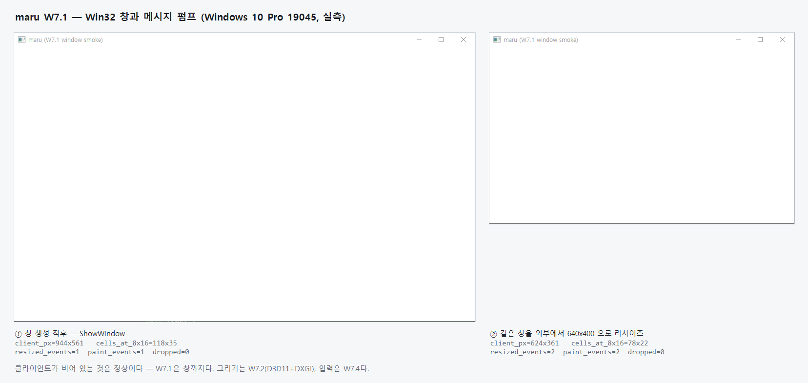
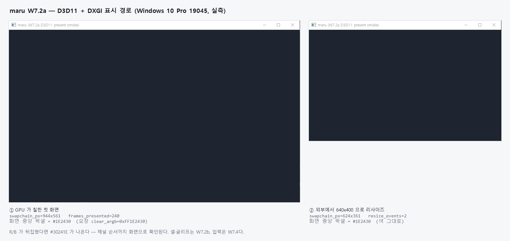
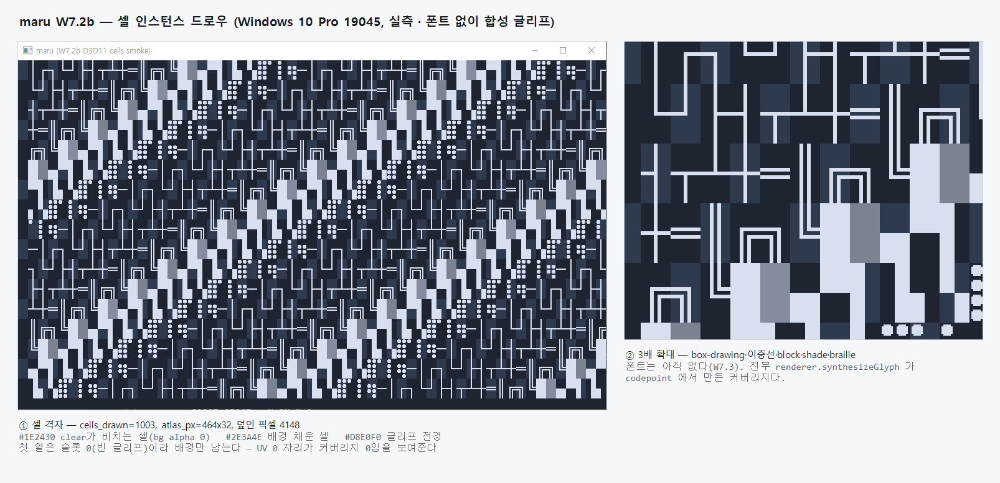
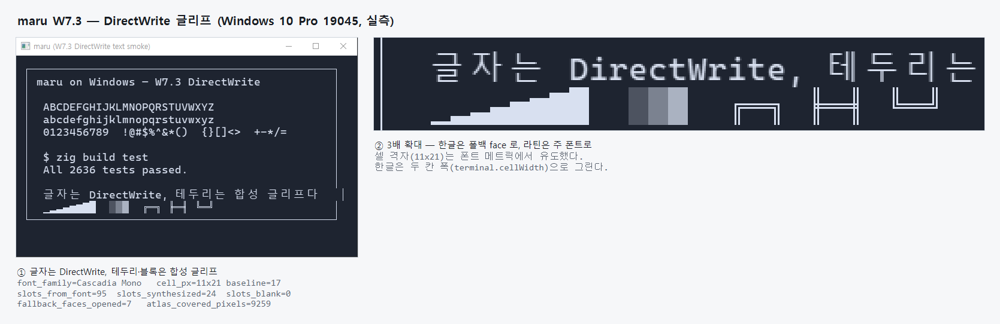
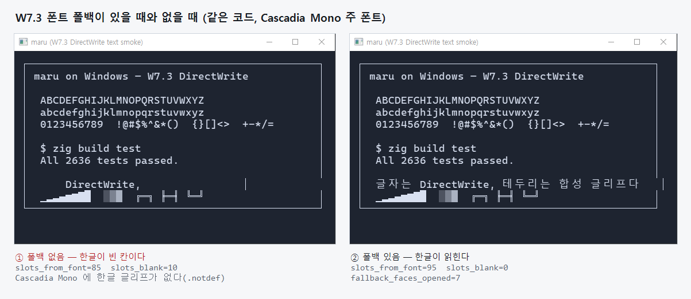
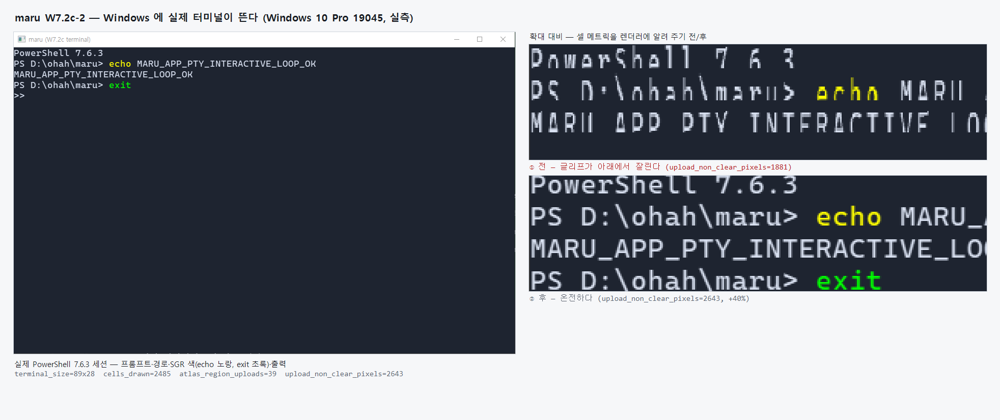
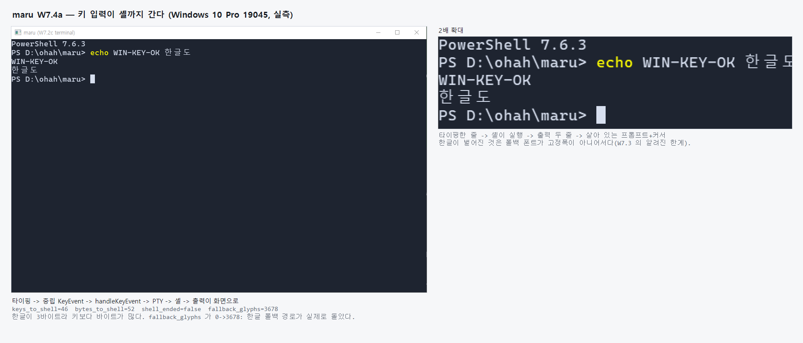

# Windows 플랫폼

Windows에서 maru를 띄우기 위한 계약의 단일 출처다. 레이어 경계는 [레이어링과 이식성](layering-and-portability.md),
PTY 계약은 [PTY 운영 모델](pty-operating-model.md), 셸 설정 키는 [셸과 환경](configuration-shell.md),
cwd 축의 2단 모델은 [소스 컨트롤 도크](editor-surface-dock.md) §3.5를 단일 출처로 둔다. 단계 진행은
[구현 계획](plans/windows-platform.md)이 소유한다(이 문서는 상태를 쓰지 않는다).

## 1. 확정 결정

- **Windows는 지원 대상이다.** macOS가 여전히 주 타깃이고, Windows는 그 다음이다.
- **어디서 작업하는지는 슬라이스에 따라 다르다.** 중립 레이어를 정리하는 앞 슬라이스(`SpawnRequest` 중립화,
  `main.zig` 컴파일)는 **`main`에서** 한다 — 이미 Windows 호스트에서 중립 테스트가 초록이라
  ([layering-and-portability.md](layering-and-portability.md) §4.1) 회귀가 보이고, 그 정리는 **Windows와
  무관하게 가치가 있다**(예: `zdotdir` 일반화는 zsh 전용 형태 때문에 막혀 있던 **fish** 통합을 푼다 —
  [configuration.md](configuration.md)가 "fish는 vendor `conf.d`로 깔끔히 주입할 수 있으나"라고 진단해 뒀다.
  **bash는 별개다** — 거기서 막힌 것은 필드 모양이 아니라 `login=true`로 띄워 `--rcfile`이 무시되는 것이라
  `login` 쪽 결정이 필요하다). L4를 통째로 새로 만드는 뒤 슬라이스(ConPTY·
  Win32 host)를 브랜치로 뺄지는 **그 시점에 판단한다.** [모바일](mobile-platform.md)이 선례다 — 장수 브랜치에서
  spike한 뒤 `main`으로 합류했다. 같은 L4 신규 타깃이라 같은 모양이 될 수 있다.
- **네이티브 Windows 셸이 1급이다.** WSL만 지원하는 것은 답이 아니다. PowerShell과 cmd에서도 동작해야 한다.
- **셸 통합은 비공개 API 없이 한다.** 자식 프로세스 환경에 통합을 주입하는 방식이며, 레지스트리·`AutoRun`·
  관리자 권한을 쓰지 않는다(§3).
- **GPU 백엔드는 이 문서가 정하지 않는다.** 4단계(창·렌더)에 가서 웹뷰 합성 모델과 **함께** 정한다 —
  둘이 사실상 같은 결정이기 때문이다([layering-and-portability.md](layering-and-portability.md) §4).
- **영속 세션 호스트는 범위 밖이다.** unix domain socket·fd 상속·동일 PID exec migration에 직결돼 있어
  Windows에서는 named pipe 기반 재설계가 선행이다. 별도 이니셔티브로 둔다.

## 2. 폴더 구조

```text
src/pty/
  windows.zig          ConPTY 백엔드 — session.zig의 PtySession 계약을 구현
src/platform/windows/
  (4단계에서) Win32 host — 창·입력·IME·클립보드
```

`src/pty/session.zig`가 이미 자리를 비워 두고 있다 — `PtySession`은 `builtin.os.tag` switch이고,
`UnsupportedPtySession`이 백엔드가 지켜야 할 표면을 시그니처로 들고 있다. Windows 백엔드는 그 switch에
`.windows` 갈래를 더한다.

**호스트에 제2 언어를 두지 않는다.** macOS가 Swift를 쓰는 이유는 AppKit이 Objective-C/Swift 전용이기
때문이고, 그래서 `app_host_abi.zig`(212개 `export fn`)라는 C ABI 경계가 필요했다. Windows에는 그 강제가
없으므로 **Zig 한 언어로 간다** — 언어 경계도, 그 경계를 넘기는 marshaling 레이어도 필요 없다. 두 L4의
모양이 달라지지만 L4는 정의상 타깃별 신규다. **ABI는 이식 이음매가 아니다** — 이음매는 renderer 중립 계약이다.

> **다만 "Win32는 다 C API"는 아니다.** 창·입력·IME(`user32`·`imm32`)는 평범한 C지만, **DirectWrite·
> D3D11/DXGI·DirectComposition은 COM**이다. Zig에서 COM은 vtable을 `extern struct`로 직접 놓으면 되지만
> 편의 계층이 없어 평범한 C 호출보다 손이 더 간다. **제2 언어가 필요하다는 뜻은 아니고**(C++ 불필요),
> W7의 비용을 "C 함수만 부르면 된다"로 과소평가하지 않기 위한 단서다.

**`platform/macos/` 안에 있는데 Windows 에서도 도는 파일들이 있다.** `main.zig` 의 `// 이름과 달리…`
주석 다섯 줄이 그것이다(`file_tree_backend`·`git_backend`·`coretext_frame_builder`·
`chrome_draw_lowering`·`system_text`). **공용 폴더(`src/common/`)를 새로 만들지 않는다** — 자리는 이미
있고, 그 둘 중 진짜로 옮길 수 있는 것과 시점은
[layering-and-portability.md](layering-and-portability.md) §3.4 가 단일 출처다(요지: 다섯 중 둘만
네이티브 참조 0 이라 `src/app/` 으로 옮길 수 있고, **W8 이 끝난 뒤 독립 PR** 로 한다).


### 2a. GPU 백엔드 — D3D11 + DXGI (결정)

Metal의 대응물은 **D3D11**이고 표시·프레임 페이싱은 **DXGI**가 맡는다. W7의 선행 결정 둘 중 하나였고, 이제
남은 것은 웹뷰 합성 모델뿐이다(§8).

**왜 D3D11인가.** ⑴ 이 렌더러가 필요로 하는 것이 그 세대에 다 있다 — 텍스처 아틀라스·인스턴스 드로우·상수
버퍼가 전부다. D3D12가 주는 것(명시적 동기화·커맨드 리스트 재사용·번들)은 이 워크로드가 쓰지 않을 능력인데
대신 리소스 수명·펜스 관리를 전부 앱이 지게 된다. ⑵ 드라이버 요구가 가장 낮다 — Windows 10/11에서 사실상
어디서나 돈다. ⑶ 프레임 페이싱이 같은 스택에 있다(`io-render-present.md`가 이미 "Win=DXGI/WaitForVBlank"로
적어 둔 것) — 백엔드와 present를 다른 API 가문으로 나누지 않는다. ⑷ WebView2 합성이 DirectComposition으로
가면 D3D11 스왑체인과 그대로 맞물린다.

**Vulkan은 왜 아닌가.** 모바일(Android)이 이미 Vulkan을 쓰므로 "하나로 합치자"가 후보였다. 그러나 Windows
데스크톱에서 Vulkan은 드라이버 편차와 설치 의존이 붙고, 위 ⑶·⑷의 이음매를 잃는다. L4는 정의상 타깃별
신규이므로(§2) 백엔드를 공유해서 얻을 것이 크지 않다 — 이음매는 renderer 중립 계약이지 GPU API가 아니다.

**대가**: COM vtable을 직접 놓아야 한다(위 단서). 그리고 `renderer`의 중립 계약이 Metal 한 구현에만 맞춰져
있지 않은지는 W7에서 실제로 두 번째 구현을 붙여 봐야 드러난다 — 그것이 이 슬라이스가 이식성 주장을 검증하는
방식이다.

### 2b. Win32 창과 메시지 펌프 — 이벤트를 잃지 않는 규율 (W7.1 결정, 실측 2026-08-17)

창은 `src/platform/windows/win32_window.zig` 하나가 소유한다. **호스트에 제2 언어를 두지 않는다**(§2) — macOS가
`app_host_abi.zig`라는 C ABI 경계를 둔 것은 AppKit이 Objective-C/Swift 전용이기 때문인데, Win32에는 그 강제가
없어 Zig에서 직접 부른다. 창이 하는 일은 셋뿐이다: 만들고, 펌프하고, OS 메시지를 **중립 이벤트**(`resized`·
`paint`·`close_requested`)로 바꿔 호출자에게 준다. 그리기·입력 해석·앱 정책은 여기 없다.

**표시 대상은 주입받는다.** `PresentTarget`이 그 자리이고 W7.2가 채운다. 웹뷰 합성 모델(§8)이 닿는 곳은
창 스타일과 스왑체인 생성 **두 지점뿐**이라, 창이 표시 대상을 만들지 않고 받는 모양만 지키면 전환 비용이
거기 머문다.

**`PeekMessage`는 메시지의 절반만 준다.** Win32 메시지에는 두 갈래가 있다. `PostMessage` 계열은 스레드 큐에
쌓여 `PeekMessageW`가 꺼내지만, `SendMessage` 계열은 **큐를 거치지 않고 `WndProc`을 곧장 부른다**.
`ShowWindow`·`SetWindowPos`·`DestroyWindow`가 `WM_SIZE`를 그렇게 보낸다. 즉 **우리가 `poll` 안에 있지 않을 때도
이벤트가 들어온다.** 그래서 `poll` 진입에서 큐를 통째로 비우면 그 이벤트가 사라진다 — 실측으로 겪었다:
`show()`가 만든 `WM_SIZE`가 첫 `poll`에 지워져 스모크가 `resized_events=0`을 냈다.

**규칙: 버퍼를 둘 두고 맞바꾼다.** `WndProc`은 언제나 `incoming`에 넣고, `poll`은 펌프를 끝낸 뒤 두 버퍼를
맞바꿔 `outgoing`을 돌려준다. 넘긴 버퍼에는 다음 `poll`까지 아무도 쓰지 않으므로, 호출자가 슬라이스를 순회하는
도중 `WndProc`이 이벤트를 더 올려도(순회 중 `requestClose`를 부르면 `DestroyWindow`가 `WM_SIZE`를 동기 전송한다)
재할당으로 무효화되지 않는다. 한 버퍼를 빌려주면 그 use-after-free를 API가 **초대한다** — 대조군에서 실제로
segfault가 났다.

**창 포인터는 `lpParam`으로 넘겨 `WM_NCCREATE`에서 붙인다.** `CreateWindowExW`는 반환하기 **전에**
`WM_NCCREATE`·`WM_CREATE`를 동기로 보낸다. 반환 뒤에 `GWLP_USERDATA`를 붙이면 그 구간의 `WndProc`이 창을
못 찾아 이벤트가 `dropped`에도 안 잡히고 사라진다 — 계약이 생성 구간에서만 조용히 깨진다. 이 스타일
(`WS_OVERLAPPEDWINDOW`, 비표시)에서는 반환 전 `WM_SIZE`가 오지 않아 지금은 드러나지 않지만, 구멍을 열어 둘
이유가 없다.

**창이 여럿이 되면 폴링 규약이 하나 더 필요하다.** `PeekMessageW(hwnd=null)`은 그 **스레드의** 메시지를 전부
꺼내 각자의 `WndProc`으로 보낸다 — 창 A의 `poll`이 창 B의 큐를 채운다. 동작은 맞지만 B를 아무도 `poll`하지
않으면 B의 이벤트가 무한히 쌓인다. 펌프를 창 밖으로 빼거나 모든 창을 매 프레임 `poll`하는 규약을 **W8에서**
정한다. 지금은 창이 하나다.

`WM_CLOSE`에서 **창을 닫지 않는다**. 호출자가 정책(세션 종료 확인 등)을 처리한 뒤 `requestClose`를 부른다 —
macOS의 `windowShouldClose` 분담과 같다. `WM_PAINT`에서도 **그리지 않는다**(`BeginPaint`/`EndPaint`조차 하지
않는다) — W7.2가 스왑체인으로 present하면 GDI 페인트 사이클과 섞이면 안 되고, 무효 영역 정리는
`DefWindowProcW`에 맡긴다. 배경 브러시도 주지 않는다(OS가 먼저 칠하면 매 프레임 전체를 그리는 W7.2와 깜빡인다).

**`user32`·`gdi32`는 명시적으로 링크해야 한다**(`build.zig`). 안 하면 `RegisterClassExW`가 0을 돌려주고
`GetLastError`도 0이라 원인이 안 보인다 — atom이 0에서 49824로 바뀌는 것으로 확인했다.

**실기 캡처** (Windows 10 Pro 19045, `maru win32-window-smoke`):



창이 뜬 뒤 **외부에서** 960×600 → 640×400으로 줄이자 `resized_events` 1→2, `client_px` 944×561→624×361,
`cells_at_8x16` 118×35→78×22가 따라왔다 — 메시지 펌프부터 셀 격자 변환까지가 한 줄로 이어진다는 증거다.
클라이언트가 비어 있는 것은 정상이다(위 "배경 브러시를 주지 않는다").

**`ERROR_NOT_ENOUGH_MEMORY`(8)는 메모리가 아니라 데스크톱 힙이다.** 창 생성이 8로 실패하면 그 세션 전체가
창을 못 만드는 상태다(실측: 고아 프로세스 8,606개가 `SharedSection` 20MB를 채워 notepad조차 뜨지 않았다).
앱 버그로 오진하기 쉬워 스모크가 이 코드를 따로 안내한다.

**Zig의 게으른 분석이 테스트를 통째로 삼킨다.** `win32_window.zig`는 `main.zig`(root)만 import하는데, 테스트
빌드에는 `main()`이 없어 그 import를 아무도 참조하지 않고 **파일 안의 테스트가 수집조차 되지 않는다**(실측:
2,614개가 통과하는 동안 이 파일 테스트는 0개 돌았다). `main.zig`의 `test { _ = win32_window; }` 한 줄이 그
구멍을 막는다 — `check-targets`가 `main.zig`를 놓쳤던 것과 같은 부류다.

### 2c. D3D11 표시 경로와 COM 규약 (W7.2a 결정, 실측 2026-08-17)

표시 경로는 `src/platform/windows/d3d11_present.zig`가 소유하고 **"화면에 내보내는 것"만** 안다 — 디바이스를
만들고, 스왑체인을 잡고, 백버퍼를 지우고, present한다. 무엇을 그릴지(셀·아틀라스·셰이더)는 W7.2b가 이 위에
얹는다. 창(§2b)과 같은 이유로 갈랐다: 실패가 어느 층에서 났는지 한 층씩 확인할 수 있어야 한다.

**스왑체인은 HWND에 붙인다 — 그리고 합성 모델은 아직 정하지 않는다.** §8의 웹뷰 합성 결정은 열어 두고
`CreateSwapChainForHwnd`로 간다. W7.1이 그 결정을 두 지점(창 `dwExStyle`·스왑체인 생성)에 가둬 뒀으므로
전환이 설계대로 싸다. 다만 **W8이 다시 발견하지 않도록 결론을 적어 둔다**: HWND 오버레이로 웹뷰를 붙이면
WebView2가 자식 HWND가 되고 그 영역 위에는 우리 스왑체인이 그릴 수 없다(airspace). 그러면 macOS의
`터미널 < 웹뷰 < 오버레이` z-order가 뒤집혀 모달이 웹뷰 뒤로 숨는다. 그 순서를 지키려면 DirectComposition +
WebView2 visual hosting이어야 한다 — **W8의 선택지는 사실상 하나다.**

**COM을 Zig로 쓰는 규약** (이 저장소의 첫 COM 소비자다 — 이전엔 `IUnknown`도 `QueryInterface`도 없었다).
COM 객체는 첫 워드가 vtable 포인터인 구조체이고, vtable은 함수 포인터가 **정해진 순서로** 늘어선 것이다.
그 순서가 곧 ABI라 슬롯 하나를 빠뜨려도 **컴파일은 되고** 런타임에 엉뚱한 함수를 부른다. 그래서 둘을 지킨다:

| | 규칙 | 왜 |
|---|---|---|
| ⑴ | 부르지 않는 슬롯도 **자리를 채운다**(`*const anyopaque`) | 타입이 없으니 실수로 못 부른다 |
| ⑵ | 슬롯 번호를 **`@offsetOf`로 comptime에 못 박는다** | 위에 슬롯을 끼워 넣으면 그 자리에서 컴파일이 멈춘다. comptime이라 **Windows 러너 없이 세 타깃 전부** 이 게이트를 통과해야 한다 |

**실측으로 정해진 값 셋.**

- `AlphaMode`는 `UNSPECIFIED`여야 한다. `IGNORE`는 합성 스왑체인용이고, HWND에 주면
  `CreateSwapChainForHwnd`가 `DXGI_ERROR_INVALID_CALL`(0x887A0001)로 거절한다.
- **`MakeWindowAssociation(DXGI_MWA_NO_ALT_ENTER)`은 터미널에 필수다.** 스왑체인을 만들면 DXGI가 그 창의
  Alt+Enter를 후킹해 독점 전체화면을 토글한다 — Alt+Enter는 앱 키바인딩이라 그대로 두면 W7.4의 입력이 그
  키를 영영 못 받는다. 스왑체인을 만든 **뒤에** 불러야 연결이 잡힌다.
- 형식은 `B8G8R8A8_UNORM`, 스왑 효과는 `FLIP_DISCARD`, 버퍼 2장. BGRA인 이유는 합성기 기본 형식이라 present에
  변환이 끼지 않고, `NativeMetalCell`의 색이 이미 `0xAARRGGBB`(= BGRA 바이트 순서)라 W7.2b가 그대로 쓴다.

**하드웨어가 없으면 WARP로 선다.** 계획 문서가 "Windows는 WARP가 있어 GPU 없는 러너에서도 렌더 스모크를
돌릴 여지가 있다"고 적어 둔 그 여지를 코드가 실제로 연다. 어느 쪽으로 섰는지는 숨기지 않고 보고한다
(`driver=hardware|warp`) — WARP로 떨어진 줄 모르면 성능을 잘못 판정한다.

**창 투명도는 여기서 정해지지 않는다.** `AlphaMode`가 `UNSPECIFIED`라 합성기가 알파를 무시하고 창은
불투명하다. macOS의 `window_opacity_milli`에 해당하는 것은 스왑체인이 아니라 **합성 모델**(DirectComposition
또는 레이어드 윈도)이 정하므로, §8의 웹뷰 결정과 같은 자리에서 함께 열린다.

**실기 캡처** (Windows 10 Pro 19045, `maru d3d11-present-smoke`):



화면 중앙 픽셀이 요청한 `0xFF1E2430`과 정확히 같다. R/B가 뒤집혔다면 `#30241E`가 나왔을 것이므로 **채널
순서까지 화면으로 확인된다** — 이것이 이 슬라이스의 판정식이다(present가 "성공을 반환했다"만으로는 부족하다).

### 2d. 셀 인스턴스 드로우 (W7.2b 결정, 실측 2026-08-17)

셀을 그리는 것은 `src/platform/windows/d3d11_cells.zig`가 소유하고 **"셀 하나를 어떻게 화면에 그리는가"만**
안다 — 무엇이 셀인지(터미널 화면·사이드바·chrome)는 호출자가 정한다. 디바이스·스왑체인은 §2c가 만든 것을
**빌려 쓴다**(놓아 주지 않는다).

COM 타입·상수는 `d3d11.zig`(바인딩 층)가 소유한다. 표시 경로와 셀 파이프라인이 같은 인터페이스를 쓰므로
한쪽에 두면 다른 쪽이 그 파일을 통째로 import해야 하고, 그러면 경계가 이름만 남는다.

**블렌드 규약은 macOS와 같다 — 여기서 다시 정하지 않는다.** `renderer/metal_frame.zig`의
`NativeMetalCell`이 이미 못 박았다: 배경 알파가 `0xFF`면 셀을 그 색으로 채우고 글리프를 위에 섞고
(`mix(bg, fg, coverage)`), `0`이면 배경 없이 커버리지만 그려 테마 기본 배경(clear color)이 비친다. 두 백엔드가
같은 화면을 내야 하므로 이것이 픽셀 셰이더의 유일한 분기다.

**아틀라스는 `R8G8B8A8_UNORM`이고 커버리지는 알파에 있다.** `renderer/glyph_pixels.zig`의 `setPixel`이
픽셀당 **4바이트**를 쓰고 RGB를 흰색으로 채운다 — 덮임 정도는 알파다(`setPixelAlpha`가 부분 커버리지를 그렇게
넣는다). 처음에 `R8_UNORM`으로 잡았다가 그 픽셀 계약을 읽고 고쳤다. 색은 셀이 들고 오므로 아틀라스의 RGB는
쓰지 않는다.

**정점 버퍼가 없다.** 사각형 네 꼭짓점은 `SV_VertexID`에서 만든다(`vid & 1`이 x, `vid >> 1`이 y → triangle
strip 4개). 셀은 전부 축 정렬 사각형이라 정점을 올릴 이유가 없고, 슬롯 0에는 **인스턴스 데이터만** 간다.
첫 삼각형이 NDC에서 시계 방향이라 기본 컬링에 걸리지 않아 rasterizer state도 만들지 않는다.

**셰이더는 런타임에 컴파일한다.** `d3dcompiler_47.dll`을 `LoadLibraryA`로 **동적으로** 찾는다. 이유가 둘이다 —
⑴ 빌드가 Windows SDK(`fxc`)를 전제하지 않는다(이 저장소는 mise가 준 Zig 하나로 빌드된다), ⑵ DLL이 없을 때
로더 단계에서 조용히 죽는 대신 사람이 읽을 수 있게 실패한다. 그 DLL은 Windows 8.1부터 **OS 구성요소**다
(실측: `System32`에 10.0.19041.3636).

**실패는 반드시 코드를 남긴다.** 컴파일 오류는 컴파일러 메시지까지 그대로 보여 준다 — 대조군으로 확인했다:

```text
maru d3d11-cells-smoke: 셀 파이프라인을 세우지 못했습니다(ShaderCompileFailed, HRESULT 0x80004005)
  셰이더 컴파일러: maru_cells.hlsl(39,17-44): error X3088: Texture2D<float4> object does not have method 'NopeSample'
```

**`synthesizeGlyph`에 오프셋한 슬라이스를 넘기면 안 된다.** 그 함수는 `len >= height * bytes_per_row`를
요구하고, 위반하면 **빈 글리프로 조용히 degrade한다**. 넓은 아틀라스 중간을 가리키는 슬라이스는 꼬리가
모자라 전부 이 경로로 빠진다 — 실측으로 겪었다: 슬롯 28개가 "채워졌다"고 나오면서 덮인 픽셀은 0이었다.
슬롯마다 따로 그린 뒤 행 단위로 옮겨 붙인다. **그래서 스모크가 덮인 픽셀 수를 따로 세어 보고한다** — 안
세면 성공처럼 보인다.

**실기 캡처** (Windows 10 Pro 19045, `maru d3d11-cells-smoke`):



판정은 화면에서 세 색이 **각각** 나오는지다: `#1E2430`(배경 알파 0 → clear가 비친다)·`#2E3A4E`(배경 채운
셀)·`#D8E0F0`(글리프 전경), 그리고 그 사이 부분 커버리지 블렌드. 하나라도 빠지면 규약의 한 갈래가 죽은
것이다. 첫 열은 슬롯 0(빈 글리프)이라 배경만 남아, UV 0 자리가 커버리지 0임을 함께 보여 준다.

### 2e. DirectWrite 글리프 래스터라이저와 폰트 티어 (W7.3 결정, 실측 2026-08-17)

`src/platform/windows/dwrite_font.zig`가 **"코드포인트 하나를 픽셀로 만드는 것"만** 안다. 아틀라스 슬롯
배치·캐시·eviction은 `renderer/glyph_atlas.zig`가, 픽셀을 GPU에 올리는 것은 §2d가 한다. 채우는 것은 중립
계약이 요구하는 **RGBA8 버퍼 하나**다 — RGB는 흰색, 커버리지는 알파(`renderer/glyph_pixels.zig`와 같은 규약).

**합성 글리프는 여기까지 오지 않는다.** box-drawing·block·braille·powerline은 `renderer.synthesizeGlyph`가
코드포인트에서 직접 만든다(폰트로 그리면 셀에 안 맞아 이음매가 생긴다). 호출자가 `synthesizeGlyph(...) orelse
<DirectWrite>` 순서를 지키므로, 이 파일은 **그 집합에 없는 글자만** 받는다.

**셀 격자는 폰트가 정한다.** 주 폰트의 `GetMetrics`(ascent·descent·lineGap)와 `'M'`의 advance에서 셀
픽셀 크기와 베이스라인을 유도하고 **올림**한다 — 내림하면 글리프가 반 픽셀 새어 옆 칸을 침범한다.
음수 `line_gap`인 폰트가 실제로 있어 최소 1을 함께 보장한다(0이면 아틀라스 슬롯이 0바이트가 된다).

유도 규칙은 **순수 함수**(`cellMetricsFrom`)가 소유하므로 DirectWrite 없이 모든 타깃에서 테스트된다. 그
테스트가 흉내 내는 값은 추측이 아니라 실측이다 — 스모크가 `design_units`로 그 값을 보고한다:

| Cascadia Mono | upem | ascent | descent | line_gap | `'M'` advance | → 18px에서 |
|---|---|---|---|---|---|---|
| 실측 | 2048 | 1900 | 480 | 0 | 1200 | 셀 **11×21**, 베이스라인 **17** |

**회색 안티앨리어싱은 ClearType 텍스처를 평균해서 얻는다.** `IDWriteGlyphRunAnalysis`가 주는 알파 텍스처는
`ALIASED_1x1`(안티앨리어싱 없음)과 `CLEARTYPE_3x1`(RGB 서브픽셀) 둘뿐이다. 터미널에 계단은 쓸 수 없고 우리
아틀라스는 채널 하나만 쓰므로, 3바이트를 평균해 회색 커버리지로 만든다. 대가: ClearType 분석은 RGB
스트라이프를 가정해 튜닝돼 있어 평균값이 "진짜 회색 AA"와 완전히 같지는 않다(화면으로 판정했다).

#### 폰트 티어 — §3.1a의 셸 티어와 같은 모양

**주 폰트**: config `font.family` → `Cascadia Mono` → `Consolas` → `Courier New`. Cascadia는 Windows
Terminal의 기본이고 터미널용으로 설계됐다. Consolas는 Vista부터 어디나 있고, Courier New는 **없을 수가 없다**.
config의 OS 접미 메커니즘(W2.5)이 일반적이라 `font.family.windows`는 이미 동작한다 — 여기서 정한 것은
**아무것도 설정하지 않았을 때의 내장 기본값**뿐이다.

**폴백**: config `font.fallback`(쉼표 구분) → `Malgun Gothic` → `Noto Sans KR` → `Microsoft YaHei` →
`Microsoft JhengHei` → `Yu Gothic` → `Segoe UI Emoji` → `Segoe UI Symbol`. 없는 폰트는 조용히 건너뛴다
(configuration.md가 정한 best-effort와 같은 규칙).

**폴백이 필수인 이유는 실측이다.** 고정폭 라틴 폰트에는 한글이 없다 — Cascadia Mono에서 한글 10자가 전부
`.notdef`였고 화면에 빈 칸으로 나왔다. macOS는 `kCTFontCascadeListAttribute`로 CoreText에 맡기지만
DirectWrite의 자동 cascade는 `IDWriteFactory2` 이후에만 있어 **목록을 우리가 든다.** 폴백을 켜자
`slots_blank`이 10에서 0으로 떨어졌다.

**글리프가 없으면 다음 face로 내려간다.** `GetGlyphIndices`가 0(`.notdef`)을 주면 다음 폴백에 묻고, 전부
없으면 0을 돌려준다 — 그것이 "그릴 수 없다"의 정직한 답이고 호출자가 빈 칸으로 둔다. face는
`max_faces`까지만 연다(무한히 열지 않는다).

**두 칸 글자는 두 칸 폭으로 그린다.** 한글·CJK는 `terminal.cellWidth`가 2를 주므로 아틀라스 슬롯도 두 칸
폭으로 잡고 화면에서도 셀 하나를 두 칸 폭으로 그린다. 한 칸에 밀어 넣으면 글자가 반으로 잘리고, 셀 둘로
쪼개면 UV를 반씩 잘라야 해 규약이 복잡해진다(`NativeMetalCell.width`도 폭을 셀이 드는 방식이다).

**실기 캡처** (Windows 10 Pro 19045, `maru dwrite-text-smoke`):



폴백이 있을 때와 없을 때(같은 코드, 주 폰트도 같다):



판정은 **셋을 갈라 세는 것**이다 — `slots_from_font`·`slots_synthesized`·`slots_blank`. 합쳐 세면 폰트 경로가
죽어도 합성 글리프가 수를 채워 성공처럼 보인다.

### 2f. 중립 프레임 계약을 Windows 백엔드가 만족시킨다 (W7.2c-1, 실측 2026-08-17)

렌더러가 요구하는 duck-typed 계약은 **둘**이다. 그 둘을 채우는 얇은 층이 `src/platform/windows/win32_text.zig`다:

| 계약 | 메서드 | 구현 |
|---|---|---|
| 셰이퍼 | `shape(DrawCell) ShapeResult` | `Shaper` — 코드포인트를 face·글리프로 고른다 |
| 래스터라이저 | `rasterize(GlyphRasterRequest) GlyphRasterResult` | `NeutralRasterizer` — 그 결정으로 픽셀을 만든다 |

DirectWrite 자체는 §2e(`dwrite_font.zig`)가 안다. 그렇게 갈라 두면 그 파일이 렌더러를 모르고(픽셀만 안다),
이 파일이 DirectWrite를 모른다(계약만 안다).

**`font_id` 매핑을 한 곳이 소유한다.** 셰이퍼가 `font_id`·`glyph_id`를 정하고 래스터라이저가 그 값을 받는다.
래스터라이저가 코드포인트로 **다시 풀면** 두 결정이 갈릴 수 있고, 증상은 "글자가 이상한 폰트로 나온다"로만
보인다. 그래서 `fontIdForFace`/`faceIndexFromFontId`가 같은 파일에 있고 순수 함수라 두 방향이 맞물리는지
테스트된다. 합성 글리프는 face가 아니라 코드포인트가 정체이므로 **겹치지 않는 번호**(1)를 받고, face는 2부터
센다 — 아틀라스 캐시 키가 둘을 갈라야 한다.

**합성이 먼저라는 순서를 두 곳이 똑같이 지킨다.** 셰이퍼도 래스터라이저도 `isSynthesizedCodepoint` /
`synthesizeGlyph`를 먼저 본다. 한쪽만 지키면 "셰이퍼는 합성이라 했는데 래스터라이저는 폰트로 그린다"가 된다.

#### 조립 코드를 복사하지 않는다 — 중립 이음매를 한 줄 늘렸다

플랫폼 호스트가 자기 래스터라이저를 쓰려면 `host.buildFrameAfterDrain`에 그 값을 넘길 자리가 필요했다.
그 함수 본문에는 **코어 락 규율**(`io-render-threading.md` — 코어 읽기는 락 아래, shaping은 락 밖)이 있어,
복사하면 규율이 두 곳으로 갈리고 한쪽만 고쳐지는 순간 조용히 깨진다. 그래서 W7.2c는 중립 레이어에
`host.buildFrameAfterDrainWithRasterizer`를 추가했고, 기존 함수는 그것을 `FakeGlyphRasterizer`로 부른다
(동작 무변). 프레임 조립은 여전히 `host.zig` 한 곳이 소유한다.

Windows 프레임 빌더(`win32_terminal.zig`)는 중립 `FrameLoop.tickWithFrameBuilder`에 꽂히는 값일 뿐이다 —
macOS `AppSession`이 CoreText 빌더를 꽂는 것과 같은 분담이다.

#### 판정은 셋을 갈라 세는 것이다

`maru win32-frame-smoke`는 **창을 띄우지 않는다.** §2a가 걸어 둔 질문("중립 렌더러 계약이 Metal 한 구현에만
맞춰져 있지 않은가")의 답은 그림이 아니라 **계약이 받아들이는가**로 나온다. 실측:

```text
maru.win32-frame-smoke.v1
font_family=Cascadia Mono
cell_px=11x21
frames_built=45
glyph_quads=86400
atlas_uploads=39
upload_non_clear_pixels=1881
fallback_glyphs=0  replacement_glyphs=0  raster_skipped=0
atlas_entries=39
```

`upload_non_clear_pixels`가 판정이다 — 슬롯을 39개 올렸는데 덮인 픽셀이 0이면 글자가 하나도 안 그려진
것이고, 슬롯 수만 세면 그것을 못 잡는다. W7.2b·W7.3에서 같은 함정을 두 번 겪었다.

**그래서 §2a의 답은 예다.** 중립 계약은 Metal 한 구현에 맞춰져 있지 않았다 — 셰이퍼·래스터라이저 계약을
Windows 값으로 채우자 프레임이 그대로 섰고, 고쳐야 했던 것은 계약이 아니라 이음매 한 줄(래스터라이저를
넘길 자리)이었다.

### 2g. 실제 터미널 화면 — 프레임을 픽셀로 (W7.2c-2, 실측 2026-08-17)

§2f가 세운 프레임(실제 PTY → Windows 셰이퍼 → DirectWrite)을 §2c·§2d가 세운 표시 경로에 흘려 넣는다.
그 사이를 잇는 것이 둘뿐이다.

**⑴ 아틀라스 부분 업로드.** 프레임마다 새 글리프만 `UpdateSubresource`로 그 사각형에 올린다(전체를 다시
올리지 않는다). `UpdateSubresource`는 범위를 검사하지 않아 넘치면 조용히 다른 자리를 덮으므로 —
아틀라스에서는 그것이 **"글자가 다른 글자로 나온다"** 로 보인다 — 텍스처 밖을 가리키면 그리지 않고 알린다.

**아틀라스가 커지면 텍스처를 다시 만든다.** 이전 글리프가 사라지는 것이 맞다: 중립 아틀라스는 텍스처를
키울 때 `atlas_full`로 **전체를 무효화하고 (0,0)부터 재배치**하므로(`renderer/glyph_atlas.zig`) 그 프레임의
글리프가 전부 새 업로드로 다시 온다. 즉 오래된 UV가 남아 엉뚱한 픽셀을 샘플하는 일이 없다. macOS 렌더러
doc은 이 자리를 "growable atlas를 지원하려면 producer가 전체 업로드를 다시 보내야 한다"고 보수적으로 적어
뒀는데, 무효화 규약을 보면 그럴 필요가 없다.

**⑵ 셀 투영.** `metal_frame`의 `NativeMetalCell`을 `d3d11_cells.Cell`로 옮긴다. **정책은 중립 쪽에서
받는다** — 커서 오버레이·패널 origin·배경 없는 셀 같은 것을 다시 만들면 두 백엔드가 같은 화면을 못 낸다.
여기서 바꾸는 것은 좌표계(`(origin, row, col)` → 픽셀 사각형)와 색 표현(픽셀 → 0~1 UV, `0xAARRGGBB` → RGBA)
뿐이다.

`foreground`는 `0x00RRGGBB`로 **알파가 없다.** 그대로 풀면 알파 0이 되고 셰이더의 `cov * fg.a`가 커버리지를
죽여 **글자가 아예 안 나온다.** 불투명으로 채워야 한다(순수 테스트가 이 회귀를 고정한다).

**창 크기가 바뀌면 터미널 격자도 바꾼다**(`resizeActiveSurface`). 스왑체인만 맞추면 셸이 옛 크기로 계속
출력해 줄이 어긋난다.

#### 셀 메트릭을 렌더러에 알려 주지 않으면 글리프가 잘린다 (실측)

`RendererState.init`의 `TextLayoutConfig`를 기본값(`.{}` — 전부 0)으로 두면 아틀라스가 슬롯 크기를 다른 값으로
추정한다. 그러면 베이스라인이 슬롯 아래로 내려가 **글리프가 아래에서 잘린다.** 폰트가 정한 값을 넘겨야 한다:

```zig
.text = .{
    .font_size_px = 18,
    .device_scale = 1,
    .cell_width_px = cell_w,        // grid advance(자간 반영)
    .glyph_cell_width_px = cell_w,  // 폰트 글리프 자연폭(자간 무관)
    .cell_height_px = cell_h,
},
```

**화면을 보고 잡았고, 숫자가 확인해 줬다** — `upload_non_clear_pixels`가 1881에서 **2643(+40%)** 으로 늘었다.
잘려 있던 부분이 그만큼이었다.

**실기 캡처** (Windows 10 Pro 19045, `maru win32-terminal-smoke`):



실제 PowerShell 7.6.3 세션이 창에 그려진다 — 프롬프트·경로·SGR 색(`echo` 노랑, `exit` 초록)·출력·계속
프롬프트·블록 커서.

**커서를 켜야 커서 경로가 돈다.** `CellColors.cursor`의 기본값은 `null`이고 그 뜻은 "커서를 투영하지
않는다"다(아틀라스 픽셀을 그대로 검증하는 골든 스모크가 커서 블록에 흔들리지 않게 하려는 기본값이다).
터미널 화면에는 커서가 있어야 하므로 켠다 — 안 켜면 화면이 그럴듯해 보여도 **커서 오버레이 투영 경로가
한 번도 안 돈다.** 켠 순간 `cells_drawn`이 2485에서 2486으로, 정확히 셀 하나 늘었다.

```text
maru.win32-terminal-smoke.v1
font_family=Cascadia Mono   cell_px=11x21   terminal_size=89x28
frames_presented=220        cells_drawn_last=2486
atlas_px=1024x1024 resizes=0   atlas_region_uploads=39
upload_non_clear_pixels=2643
fallback_glyphs=0 replacement_glyphs=0 raster_skipped=0
swapchain_px=984x601 driver=hardware
```

### 2h. 키 입력과 ⌘ 매핑 (W7.4a 결정, 실측 2026-08-18)

창이 `WM_KEYDOWN`/`WM_CHAR`를 받아 **중립 `KeyEvent`**로 바꿔 올리고, 앱 동작이냐 셸 입력이냐는
`FrameLoop.handleKeyEvent`(중립 정책)가 정한다 — 창은 키바인딩을 알지 않는다. 변환 규칙은
`src/platform/windows/win32_keys.zig`가 **순수 함수로** 소유하므로 Windows 러너 없이 세 타깃 전부에서
테스트된다.

**문자는 `WM_CHAR`가, 그 밖은 `WM_KEYDOWN`이 준다.** VK 코드는 물리 키이지 문자가 아니므로 거기서 문자를
짐작하면 비영문 레이아웃(한글 두벌식·QWERTZ)이 깨진다 — 레이아웃·데드키 해석은 OS가 한다.
`keyFromVirtualKey`가 문자 키에 `null`을 주는 것이 그 규칙이다.

**Ctrl·Alt 조합만 `WM_KEYDOWN`에서 문자를 복원한다.** `WM_CHAR`는 그때 제어 바이트를 주는데
(`Ctrl+A` → 0x01) 우리는 "문자 `a` + control"이 필요하다 — 인코딩은 중립 `encodeKey`가 해야 한다.
복원은 `MapVirtualKeyW(vk, MAPVK_VK_TO_CHAR)`로 한다(OEM 키 `,` `=` `[`는 VK 값이 문자와 달라, 표를
직접 만들면 레이아웃마다 틀린다). 그리고 `WM_CHAR`는 Ctrl·Alt가 눌린 동안 **무시한다** — 안 그러면 같은
키가 두 번 입력된다.

**UTF-16 서로게이트 쌍을 합친다.** BMP 밖 문자(이모지)는 `WM_CHAR`가 **두 번** 온다. 합치지 않으면 중립
`charKeyFromCodepoint`가 lone surrogate를 거부해 글자가 조용히 사라진다.

**`WM_SYSKEYDOWN`을 `DefWindowProcW`에 넘기지 않는다**(Alt+F4는 예외). 넘기면 Alt 조합이 시스템 메뉴를
열고 삼켜진다.

#### ⌘ 를 무엇에 매핑하는가 — 판정은 `controlByte`다

macOS의 `Cmd`가 maru 바인딩의 주 모디파이어인데 Windows엔 그 키가 없다. **`Ctrl`을 그대로 주면 셸 키를
빼앗는다** — 실측: plain `Cmd+<글자>` 바인딩이 쓰는 12글자(`[ ] A D E F G K O S T W`)가 전부 C0 제어
바이트를 갖는 문자라, `Ctrl+D`(EOF)·`Ctrl+W`(단어 삭제)·`Ctrl+A`(줄 시작)를 잃는다. 그 열 개 없이는 셸에서
일을 할 수 없다.

그래서 규칙을 **중립 `terminal.input.controlByte`로 판정한다** — "셸이 이 문자를 Ctrl로 가져가는가"의
단일 출처이고, 우리가 목록을 만들지 않는다.

| Windows 물리 조합 | 중립 모디파이어 | 예 |
|---|---|---|
| `Ctrl+<c>`, `controlByte` 실패 | `command` | `Ctrl+,`(설정)·`Ctrl+0`~`9`(탭)·`Ctrl+=`(폰트) |
| `Ctrl+<c>`, `controlByte` 성공 | `control` | **셸로** — `Ctrl+C`·`Ctrl+D`·`Ctrl+W` |
| `Ctrl+Shift+<c>`, c가 밀려온 글자 | `command`(plain) | `Ctrl+Shift+T`=새 탭 — Windows Terminal 철자 |
| `Ctrl+Shift+<c>`, 그 밖 | `command`+`shift` | `Ctrl+Shift+P`=커맨드 팔레트 — VS Code 철자 |
| `Ctrl+Alt+<c>` | `command`+`shift` | 밀린 `Cmd+Shift+<c>`(새 워크스페이스·수직분할) |
| `Alt+<c>` | `option` | meta — `Alt+b`가 ESC b(단어 왼쪽) |
| 문자가 아닌 키 + `Ctrl` | `control` | `Ctrl+←`는 셸이 쓴다(`CSI 1;5D`) |

**어느 쪽에 `Ctrl+Shift`를 주는지는 Windows 관례를 따랐다**(사용자 결정). plain `Cmd+X`가 가져가므로
`Ctrl+Shift+T`가 새 탭, `Ctrl+Shift+D`가 분할이 되어 Windows Terminal과 **같은 철자가 같은 동작**을 한다.
밀린 `Cmd+Shift+X` 여섯(`[ ] D E G T`)은 `Ctrl+Alt+X`로 간다.

**밀려온 글자 집합을 손으로 박지 않는다.** `config.keybinding.default_app_bindings`·
`default_terminal_bindings`를 **comptime에 훑어** 유도한다 — 손으로 적은 목록은 바인딩이 늘거나 줄 때
반드시 어긋나고, 어긋나도 컴파일은 된다. 테스트가 그 유도를 검증한다("유도된 문자는 정의상 셸 충돌
문자여야 한다", "비어 있으면 유도가 깨진 것이다").

핵심 단언은 이것이다 — `Ctrl+<셸 문자>`는 반드시 `control`이어야 한다:

```zig
for ("acdefgkostw[]") |ch| {
    const m = translateModifiers(true, false, false, .{ .char = ch });
    try testing.expect(m.control);
    try testing.expect(!m.command);
}
```

`command`가 되면 앱 바인딩이 가로채 셸이 SIGINT·EOF·단어 삭제를 못 받는다.

**실기 캡처** (Windows 10 Pro 19045, `maru win32-terminal-smoke`):



`echo WIN-KEY-OK 한글도`를 타이핑하자 셸이 실행해 출력이 화면에 돌아왔다. `keys_to_shell=46`·
`bytes_to_shell=52`(한글이 3바이트라 키보다 바이트가 많다)·`shell_ended=false`(셸이 살아 있다)·
`fallback_glyphs`가 0에서 3678로(한글 폴백 경로가 실제로 돌았다).

**중복 입력이 없다는 것은 통제 측정으로 확인했다** — 3글자를 보내면 `keys_to_shell=3`이다. 그 측정을 하기
전에 두 번 헛짚었다: `MainWindowHandle`이 아직 0일 때 `PostMessage`가 조용히 실패했고(반환값을 버렸다),
터미널 스모크가 fixture 각본(`exit`으로 끝난다)을 보내 **셸이 죽은 뒤** 키가 도착했다. 후자는 스모크에서
각본을 없애 고쳤다 — 터미널 스모크는 사람이 타이핑하는 자리이고, 각본으로 끝내는 검증은
`win32-frame-smoke`(§2f)가 한다.

### 2i. IME 조합 미리보기 (W7.4c 결정, 실측 2026-08-18)

중립 계약이 이미 다 갖고 있다 — `surface.setPreeditLocked(bytes)`를 넣으면 `renderSnapshot()`이 조합
미리보기를 화면에 합성한다(`terminal/preedit.zig`의 `Overlay.compose`). 그래서 Windows가 미리보기 렌더를
따로 만들지 않는다.

**조합 미리보기만 가로채고 확정 문자는 `DefWindowProcW`에 맡긴다.** `WM_IME_COMPOSITION`에서 `GCS_COMPSTR`
(조합 중)만 읽고, `GCS_RESULTSTR`(확정)은 기본 처리가 `WM_CHAR`로 만들게 둔다 — 그러면 §2h의 문자 경로
하나가 확정을 받고, 확정 처리가 두 곳에 생기지 않는다.

**조합이 비어도 이벤트를 낸다.** 사용자가 조합을 지우면(`한`→`하`→빈 값) 화면의 미리보기가 사라져야 하고,
그것을 알리는 신호가 그 이벤트뿐이다.

**바이트를 이벤트에 싣지 않는다.** `preedit_changed`는 payload가 없고 호출자가 `window.preeditText()`를
읽는다. 조합은 **가장 최근 상태만** 뜻이 있고(중간 단계를 큐에 쌓아 재생할 이유가 없다), 슬라이스를 실으면
다음 조합이 그 버퍼를 덮어 이미 넘긴 이벤트가 무효화된다.

**변환·잘림 규칙은 순수 함수가 소유한다**(`win32_keys.compositionTextFromUtf16`). `ImmGetCompositionStringW`가
**문자 수가 아니라 바이트 수**를 돌려주는 것(UTF-16이라 2배)과 서로게이트 처리, 그리고 버퍼가 모자랄 때의
잘림이 실제로 틀리기 쉬운 자리다. 그래서 OS 호출만 남기고 규칙을 갈라 **모든 타깃에서** 테스트한다:

- `std.unicode.utf16LeToUtf8`을 그대로 쓰지 않는다 — 버퍼가 모자라면 **오류**를 내는데, 조합 문자열은
  사용자가 계속 늘릴 수 있어 **잘라서라도 보여 주는** 편이 맞다(미리보기가 짧아질 뿐 확정 문자는 온전하다).
  오류로 접으면 긴 조합에서 미리보기가 통째로 사라진다.
- 반쪽 글자를 쓰지 않는다 — 한 글자를 다 담을 수 없으면 그 글자를 안 쓴다(쓰면 UTF-8이 깨져 아래 계층이
  거부한다).
- 짝 없는 서로게이트는 **버린다** — 중립 계약이 lone surrogate를 거부하므로 흘려보내면 뒤에서 조용히 사라진다.

**실기 검증의 한계와 그 이유.** IME 메시지 배관은 확인됐다 — 합성 `WM_IME_COMPOSITION` 4개를 보내면
`preedit_updates=4`·`failures=0`이고, 아무것도 안 보낸 대조군은 `0/0`이다. 그러나 **실제 한글 조합을
프로그램적으로 만들 수 없다**: 이 창은 포그라운드를 잡지 못하고(Windows가 비-포그라운드 프로세스의 포커스
탈취를 막는다 — 실측으로 확인했다), 합성 메시지는 **실제 IME 컨텍스트**를 읽으므로 조합이 없으면 빈 값이다.
그래서 조합 문자열 읽기(`ImmGetCompositionStringW` 호출 자체)는 **사람이 창에 직접 타이핑해야** 검증된다.

**후보창 위치는 §2k(W7.4d)에서 붙었다.** 셀 좌표를 IME에 넘기는 일이라 픽셀↔셀 변환과 같은 계층이었다.

### 2j. 클립보드 — 플랫폼이 소유한다 (W7.4b 결정, 실측 2026-08-18)

**중립 레이어에 복사·붙여넣기 `Action`이 없다.** `config/action.zig`가 그 경계를 이미 그어 뒀다 —
"clipboard 쓰기(copy)는 NSPasteboard(OS) 소유라 Action이 아니다 — 경계: Zig는 selection, Swift는
clipboard". Windows도 같은 선을 지킨다: `win32_clipboard.zig`는 OS 클립보드만 알고, **무엇을** 복사할지
(선택 영역)는 중립 코어가 안다. macOS에서 Swift가 하던 자리를 Windows에서는 이 파일이 맡는다.

**중립 계층이 요청하는 것은 OSC 52다.** 셸이 `OSC 52`로 클립보드 읽기·쓰기를 요청하면 코어가 그것을
pending으로 들고 있고(`pendingClipboardWrite`·`clipboardReadPending`), 플랫폼이 정책을 확인한 뒤 배수한다.
코어가 OS를 직접 만지지 않는 것이 그 설계다.

**읽기 정책은 `osc52.read`이고 기본값이 `deny`다** — 원격/내부 프로그램의 로컬 클립보드 탈취를 막는
사용자 결정이다(`config/theme.zig`의 `Osc52Config`, 2026-06-20). 쓰기는 하드코딩 allow다. pending은
**정책과 무관하게 소비한다** — 안 그러면 매 tick 재트리거된다(macOS와 같은 규율).

**읽기 응답은 아직 안 만든다 — 그 인코더가 중립이 아니기 때문이다.** `ESC ] 52 ; <Pc> ; <base64> ST`를
만드는 `formatOsc52ReadResponse`가 **macOS `app_session.zig` 안에** 있다. Windows가 `allow`를 지원하려면
그것을 중립으로 들어올려야 하는데(`terminal/input_report.zig`의 `encodePasteWith` 옆이 제자리다), 그것은
이 슬라이스 밖의 설계 결정이라 사용자에게 보고하고 정한다. 기본값이 `deny`라 지금 기능 손실은 없다.

**`CF_UNICODETEXT` 하나만 쓴다.** `CF_TEXT`는 ANSI 코드페이지이고 이 기계의 ACP가 949라, UTF-8 바이트를
그대로 넣으면 비영문이 깨진다(§5.3에서 `_access`가 같은 함정을 밟았다). `CF_UNICODETEXT`는 UTF-16이고,
Windows가 필요하면 다른 형식으로 자동 합성해 준다.

**줄바꿈 규칙이 방향마다 다르다 — 왕복이 항등이 아니다.** 그것이 맞는 동작이다:

- **쓸 때 `\n`→`\r\n`.** Windows 클립보드 관례가 CRLF이고, `\n`만 넣으면 메모장 등에서 한 줄로 붙는다.
  이미 CRLF인 것을 두 번 바꾸지 않고(`\r\r\n`이 되면 빈 줄이 생긴다), 홀로 있는 CR에는 LF를 붙인다.
- **읽을 때 `\r\n`→`\r`.** 터미널에 CRLF를 그대로 보내면 셸이 **두 줄을 실행한 것으로** 본다 — 붙여넣기가
  의도치 않게 명령을 실행하는 고전적 사고다. 콘솔 입력의 Enter는 CR 하나다. 홀로 있는 LF도 CR로 바꾼다.

**성공한 `SetClipboardData` 뒤에 `GlobalFree`를 부르지 않는다.** 성공하면 그 메모리의 소유권이 시스템으로
넘어간다 — 해제하면 다른 앱이 붙여넣을 때 해제된 메모리를 읽는다. 실패했으면 소유권이 아직 우리에게 있으니
**우리가** 해제한다. 두 갈래가 모두 필요하다.

**길이는 NUL까지 세서 잰다.** `GlobalSize`는 할당 크기라 실제 문자열보다 클 수 있고, 그대로 쓰면 뒤쪽
쓰레기가 붙는다. `CF_UNICODETEXT`는 NUL 종단이 규약이다. 종단이 없는 잘못된 데이터에서 무한히 읽지 않도록
상한(8Mi 유닛)을 두되, **거기 닿으면 잘라서 주지 않고 `Unterminated`로 실패한다** — 명령의 앞부분만 셸에
붙는 것이 붙여넣기를 거절하는 것보다 위험하다(아래 `InvalidUtf16`과 같은 판단이다).

**깨진 UTF-16을 `OutOfMemory`로 부르지 않는다.** 다른 앱이 UTF-16을 쌍 중간에서 자르면 짝 없는
서로게이트가 실제로 온다. 그것을 메모리 부족이라고 보고하면 진단이 원인을 숨긴다(대조군에서 형식 문제가
`OutOfMemory` 세 개로 보였다). `InvalidUtf16`으로 올리고, **U+FFFD로 갈음하지 않는다** — 셸 명령줄에 깨진
문자를 절반만 밀어 넣는 것이 붙여넣기를 거절하는 것보다 위험하다.

**락 안에서 OS를 부르지 않는다.** 클립보드 호출은 다른 프로세스를 기다릴 수 있다(소유자가 지연 렌더링을
하면 블록된다). 그 사이 코어 락을 잡고 있으면 PTY 리더가 막힌다. pending 바이트를 락 안에서 복사해 두고,
OS 호출은 락 밖에서 한다.

**raw 클립보드 바이트를 셸에 보내지 않는다 — `encodePasteWith`를 반드시 거친다.** 중립 코어가 붙여넣기
규칙을 이미 갖고 있다: bracketed paste(DECSET 2004) 래핑, 개행 정규화, 그리고 **본문의 ESC·제어 바이트를
공백으로 치환**하는 것이다. 마지막 것이 보안 규칙이다 — 클립보드에 `\x1b[201~`이 들어 있으면 래핑 괄호를
일찍 닫고 뒤따르는 `\r` 종료 바이트가 "타이핑"으로 **실행된다**. macOS `term.submitPaste`와 같은 순서로
부른다: 판정과 `bracketedPasteEnabled()`만 락 안에서 읽고, 인코딩(할당·복사)은 락 밖에서 한다.

**보호 게이트를 통과하지 못하면 붙여넣지 않는다.** `pasteNeedsConfirmation`이 참이면 macOS는 확인 모달을
띄우는데 Windows엔 chrome이 아직 없다(W8). **모달이 없다고 보호를 건너뛰면 위험한 붙여넣기가 조용히
실행되므로**, 거절하고 `pastes_blocked`로 센다. 지금 스모크는 config 파일을 읽지 않아 스키마 기본값
(`paste_protection=true`, `bracketed_paste_is_safe=true`)을 쓴다 — 사용자 config 배선은 W7.5다.

**붙여넣기 화음은 두 개를 받는다** — `Ctrl+Shift+V`(Windows Terminal 관례)와 `Shift+Insert`(고전 관례).
평범한 `Ctrl+V`와 `Ctrl+C`는 **가로채지 않는다**: `Ctrl+C`는 SIGINT여야 하고, `Ctrl+V`는 셸이 쓴다(§2h의
`shellTakesControl`이 판정하는 것과 같은 이유).

**실측과 그 한계.** `win32-clipboard-smoke`가 창 없이 OS 왕복을 잰다 — 5개 경우(ascii·한글·이모지·개행·
이미 CRLF) 전부 통과, 300 KiB가 정확히 왕복(`big_roundtrip=307200`). 외부 작성자(.NET `Set-Clipboard`)가
넣은 값도 정확히 읽는다(한글 28바이트, CRLF→CR 13바이트). OSC 52 쓰기는 셸이 요청하게 만들어 실제 Windows
클립보드까지 확인했다 — 사전값 `SENTINEL-BEFORE`가 `CLIP-OSC-OK-한글`로 바뀌고 `clipboard_errors=0`이다.

두 가지는 이 스모크가 **판정하지 못한다**:

- **NUL 종단 규칙.** 우리가 쓰고 우리가 읽으면 `GlobalAlloc`이 요청한 크기를 정확히 돌려줘서 `GlobalSize`로
  길이를 재도 답이 같다 — 대조군으로 확인했다(바꿔도 5/5 통과). 그 규칙은 다른 앱이 패딩된 할당에 넣었을
  때만 의미가 있어, 외부 작성자 모드(`win32-clipboard-smoke <기대값>`)가 그 자리를 대신 지킨다.
- **붙여넣기 규칙은 화음 없이 잰다.** `win32-clipboard-smoke --paste-encode`가 지금 클립보드에 있는 것을
  `encodePasteWith`에 태워 본다. 악의적 클립보드(`safe\x1b[201~rm -rf ~\x1b[200~`, 24바이트)를 넣으면
  `wrapped=true`·`body_has_esc=false`로 나온다 — ESC가 공백으로 치환돼 인젝션이 죽었고, 바이트 수가
  24로 그대로인 것이 **제거가 아니라 치환**임을 보여 준다. 보호 게이트도 같이 잰다: 평범한 여러 줄은
  bracketed면 `needs=false`(래핑이 안전하게 만든다)인데, 인젝션이 들어 있으면 bracketed여도 `needs=true`다.
- **붙여넣기 화음의 실기 경로.** 합성 메시지로는 모디파이어를 실을 수 없다 — `PostMessageW`가 스레드 키
  상태 테이블을 갱신하지 않아 `GetKeyState(VK_SHIFT)`가 눌림을 못 본다(실측: `Shift+Insert`를 보내면
  평범한 Insert로 `\x1b[2~` 4바이트가 셸에 간다). 화음 판정은 순수 함수(`isPasteChord`)로 테스트하고,
  읽기 경로는 외부 작성자 모드로 따로 잰다. 둘을 잇는 한 줄은 사람이 창에 직접 눌러야 검증된다(§2i의
  실제 한글 조합과 같은 한계, 같은 이유).

**계수는 성공만 센다.** `osc52_writes`·`pastes`는 OS 호출과 셸 전송이 **실제로 성공했을 때만** 오른다.
실패를 세지 않으면 `osc52_writes=1`이 실패한 쓰기를 성공처럼 보고하고, 붙여넣기 전송이 실패했는데
`pastes`가 오르면 화면에 아무것도 안 붙었는데 성공으로 읽힌다. pending 바이트 복사(dupe)가 실패했을
때도 `clipboard_errors`를 올린다 — 안 그러면 요청이 **아무 흔적 없이** 사라진다(코어에서 이미 비운
뒤다). 이 이식이 §2c 이후로 계속 지켜 온 규율과 같은 것이다.

**클립보드 경합에 재시도를 넣지 않았다 — 재현되지 않는다.** `OpenClipboard`가 다른 프로세스에 밀려
실패할 수 있다는 것이 통념이라 재 봤는데, 다른 프로세스가 `OpenClipboard(NULL)`로 실제로 잡은 상태
(`OpenClipboard=True` 확인)에서도 우리 쓰기가 5/5 성공했다. 재현되지 않는 문제에 재시도 루프를 넣으면
검증되지 않은 코드가 남으므로 넣지 않고 여기 적어 둔다.

**복사(선택 영역 → 클립보드)는 §2k에서 붙었다.** 무엇을 복사할지가 선택 영역이라 마우스와 같은 계층이었다.

### 2k. 마우스 — 선택·스크롤·리포팅 (W7.4d 결정)

**중립 명령이 이미 다 있다.** `session/core_command.zig`가 `select_start`·`select_extend`·
`select_extend_or_collapse`·`select_word`·`select_line`·`select_clear`·`scroll`·`scroll_and_extend`·
`report_mouse`를 갖고 있고, **PTY 리더 스레드가 락 아래 원자적으로 적용한다**. 그래서 Windows가 하는 일은
Win32 메시지를 그 명령으로 **번역하는 것뿐**이고, 메인 스레드는 코어를 만지지 않는다.

이것이 §2h·§2i·§2j와 같은 결론이다 — 중립 계약은 이미 서 있고 플랫폼은 어댑터다.

**규칙을 새로 만들지 않는다 — macOS가 쓰는 관례를 그대로 읽어 왔다.** 아래 표의 근거는 전부
`platform/macos/app_session.zig`의 기존 판정이다. 마우스 관례를 두 플랫폼이 다르게 가지면 같은 코어가
다르게 반응한다.

| Win32 메시지 | 중립 `kind` | 명령 |
|---|---|---|
| `WM_LBUTTONDOWN` | 1 (down) | `select_start{row, col, block}` |
| `WM_MOUSEMOVE`(버튼 눌림) | 2 (drag) | `select_extend{row, col}` |
| `WM_LBUTTONUP` | 3 (up) | `select_extend_or_collapse{row, col}` |
| 같은 자리 2연타(`ClickTracker`) | 4 | `select_word{row, col, separators}` |
| 같은 자리 3연타(`ClickTracker`) | 5 | `select_line{row}` |
| `WM_RBUTTONDOWN`/`UP` | — | `input.right-click` 이 정한다(기본 `paste`. `menu` 는 미구현이라 세기만 한다) |
| `WM_MBUTTONDOWN`/`UP` | — | 리포팅 중일 때만 — **로컬 선택은 좌버튼뿐이다** |
| `WM_MOUSEWHEEL` | — | `scroll{lines}` 또는 alt 화면이면 화살표 키 |
| `WM_MOUSEHWHEEL` | — | 편집기 가로 스크롤(`first_col`). 터미널에는 가로 축이 없어 버린다 |

**연타는 `WM_LBUTTONDBLCLK` 로 안 받는다**(2026-08-29 정정 — 표가 그 메시지를 적고 있었는데 창은
그것을 **처리하지 않는다**). Win32 는 **트리플을 알려 주지 않는데** 터미널에는 줄 선택이 있어서,
단·더블·트리플을 한 규칙으로 세는 쪽이 맞다 — 창은 평범한 `WM_LBUTTONDOWN` 만 올리고 판정은 순수
`ClickTracker.classify`(시간·거리 임계)가 한다.

**모디파이어 비트는 중립 규약을 따른다** — 4=shift, 8=meta(alt), 16=ctrl, 32=command.

**⑴ shift·alt가 마우스 리포팅을 누른다.** 셸이 마우스를 잡고 있어도(`mouse_tracking != .none`) shift나
alt를 누르면 리포트하지 않고 **로컬 선택**을 한다. macOS의 판정이 그대로다:

```zig
if ((mods & 4) != 0 or (mods & 8) != 0) return; // shift·option은 셀렉션 override — 리포트 안 함
```

TUI가 마우스를 다 먹으면 사용자가 화면의 글자를 복사할 방법이 없어진다 — 그 탈출구다.

**⑵ alt는 동시에 블록 선택이다.** `select_start{.block = (mods & 8) != 0}`. 리포팅을 누르는 것과 같은 키가
사각 선택을 켠다.

**⑶ command(32) 비트를 리포트에서 마스킹한다.** `reportMouse`의 `cb = button + mods + motion`에서 32가
**SGR motion 비트와 겹친다** — 그대로 실으면 press가 motion으로 오인되거나 `cb`가 부풀어 리포트가 오염된다
(macOS가 회귀 가드로 막아 둔 자리다). Windows엔 command 키가 없어 지금은 32가 설 일이 없지만, §2h가
`Ctrl`을 `command`로 번역하므로 **마우스 경로에도 같은 위험이 있다** — 마스킹을 그대로 가져온다.

**⑷ 이동 리포트는 셀이 바뀔 때만 보낸다 — 드래그도 마찬가지다.** 버튼 없는 이동(hover)은 `any`
(DECSET 1003)일 때만, 드래그 중 이동은 `button`(1002)·`any`일 때만 받는다. 그리고 **어느 쪽이든 같은 셀로의
반복은 버린다** — `WM_MOUSEMOVE`는 픽셀마다 오는데 셀은 안 바뀐다. 드래그를 예외로 두면 창을 가로질러
끄는 동안 같은 리포트가 PTY에 쏟아진다(실측: 같은 셀 근처에서 이동 9번에 리포트 11 → 4).

**휠 좌표만 화면 기준으로 온다.** 다른 마우스 메시지는 클라이언트 기준인데 `WM_MOUSEWHEEL`만 화면
기준이다 — 창 쪽에서 `ScreenToClient`로 바꿔 **같은 규약으로** 올린다. 좌표를 버리고 (0,0)을 싣는 것은
답이 아니다: xterm 규약에서 휠 리포트도 셀 좌표를 싣고 앱이 그것으로 **어느 pane을 굴릴지** 정한다
(실측 대조군: 변환을 끄면 클라이언트 (55,105)가 셀 5,5 대신 8,10으로 — 창 원점만큼 밀린다).

**격자는 스왑체인이 아니라 코어에게 묻는다.** 픽셀 크기에서 유도하면 리사이즈 도중 코어가 아직 옛
크기일 때 **없는 셀로 clamp**된다. 트래킹 모드와 함께 한 번의 락에서 `core.size`를 읽는다.

**캡처를 뺏기면 드래그만 끝내고 선택은 건드리지 않는다.** `WM_CAPTURECHANGED`(Alt+Tab 등)에는 **버튼을
뗀 좌표가 없다.** 그것을 `left_up`으로 올리면 좌표 0,0이 실려 `select_extend_or_collapse{0,0}`이 되고
**선택이 좌상단까지 끌려간다** — 실측 대조군에서 짧은 8바이트 선택이 **381바이트**(화면 열 줄)로 불었다.
그래서 좌표 없는 `capture_lost`를 따로 둔다. 우리가 `ReleaseCapture`로 놓는 경우는 `capturing` 표시로
갈라 **up이 두 번 올라가지 않게** 한다(실측: 드래그 하나에 이벤트가 11이 아니라 12였다).

**⑸ alt 화면 + `alternate_scroll`(DECSET 1007)이면 휠이 화살표 키가 된다.** 그리고 그때 **선택을 해제한다**
— 프로그램이 화면을 다시 그리므로 남은 선택은 좌표가 어긋난 유령이다. 화살표는 **한 버퍼에 묶어** 보낸다:
줄마다 쓰면 빠른 플릭에서 PTY 버퍼가 차 나머지가 드랍된다.

**픽셀→셀은 격자 안으로 clamp한다.** 드래그 중 포인터가 창 밖으로 나가도 선택이 끊기면 안 되므로
(`SetCapture`로 창 밖 좌표가 계속 온다) 음수·초과 좌표를 가장자리 셀로 접는다. 순수 함수라 모든 타깃에서
테스트한다.

**휠 눈금 수를 OS에 묻되 규칙은 순수 함수가 갖는다.** `WM_MOUSEWHEEL`은 `WHEEL_DELTA`(120)의 배수를
주고 정밀 터치패드는 그보다 작은 값을 보낸다 — 나머지를 누적하지 않으면 **작은 스크롤이 통째로 버려진다**.
한 눈금이 몇 줄인지는 `SystemParametersInfoW(SPI_GETWHEELSCROLLLINES)`가 사용자 설정으로 답하고, 그 값과
누적기는 순수 함수의 **인자**다(OS-as-parameter — §2h·§2i와 같은 규율).

**누적기는 표면·축마다 따로다**(2026-08-29 — §2m.82·§2m.84). 나머지를 다음 메시지로 넘기는 성질 때문에
하나를 나눠 쓰면 **한 곳에서 조금 민 것이 다른 곳에서 한 줄로 튄다**: 가로로 민 나머지가 세로를 굴리고,
사이드바에 남은 나머지가 도크의 첫 눈금을 먹는다. 지금은 사이드바·도크·편집기(세로)·편집기(가로)·터미널이
각자 갖는다. **가로 축은 `WM_MOUSEHWHEEL` 과 Shift+휠 둘 다로 들어온다**(터미널이 이미 쓰는 관례) —
부호 규약이 서로 반대라(가로는 양수가 오른쪽, 세로는 양수가 위) 한 부호로 뭉치면 한쪽이 거꾸로 간다.

**눈금과 줄 수는 다른 것이다 — 섞으면 TUI가 배수만큼 튄다.** 마우스 리포팅은 xterm 규약상 **눈금당 한 번**
이고, `SPI_GETWHEELSCROLLLINES`는 **로컬 스크롤백**이 한 눈금에 몇 줄을 갈지 정하는 값이다. 누적기가 줄 수를
돌려주게 만들면 리포팅 쪽이 그 배수로 부푼다 — 실측 대조군에서 **한 눈금에 리포트 10건**이 큐에 들어갔다
(이 기계 설정이 10이다). 그러면 vim에서 한 번 굴릴 때 열 칸이 지나간다. 그래서 `feed`는 **눈금**을 돌려주고,
줄 수가 필요한 자리(로컬 스크롤·alt 화면 화살표)만 `linesForNotches`로 곱한다.

그리고 그 차이를 **계수가 구분할 수 있어야 한다.** 이벤트마다 1씩 올리는 `mouse_reports`로는 안쪽 루프가
한 번 돌든 열 번 돌든 같은 값이라, 큐에 실제로 들어간 수(`report_commands`)를 따로 센다 — 이 이식이 계속
경계해 온 "구분 못 하는 계수"다.

**더블·트리플 판정도 순수 함수다.** `GetDoubleClickTime()`(사용자 설정)과 `SM_CXDOUBLECLK` 슬롭을 인자로
받아 시간·거리로 가른다. 트리플 뒤에는 카운터를 되돌린다 — 안 하면 네 번째 클릭이 4연타가 되어 무엇도
아니게 된다.

**복사가 여기서 붙는다.** §2j가 남겨 둔 `isCopyChord`에 드디어 호출자가 생긴다 — `extractSelection`으로
선택 영역을 UTF-8로 꺼내 `win32_clipboard.write`에 넘긴다. 경계는 §2j 그대로다: **무엇을 복사할지는 중립
코어가, 클립보드는 플랫폼이** 안다.

**IME 후보창 위치도 여기다.** §2i가 미뤄 둔 자리다 — 커서 셀을 픽셀로 바꿔 IME에 주는 일이라
픽셀↔셀 변환과 같은 계층이다.

**`ImmSetCompositionWindow`와 `ImmSetCandidateWindow`를 둘 다 부른다.** IME마다 무엇을 보는지가 다르다 —
어떤 IME는 조합창 위치를 기준으로 후보를 배치하고, 어떤 IME는 `CANDIDATEFORM`을 직접 읽는다. 하나만
부르면 그쪽을 안 보는 IME에서 후보창이 **창 좌상단에 남는다**. 조합창은 **글자 자리**에(거기 조합 중인
글자가 그려진다), 후보창은 `CFS_EXCLUDE`로 **그 셀을 가리지 말라고** 준다 — 후보 목록이 지금 치는 글자를
덮으면 무엇을 고르는지 안 보인다.

**조합이 시작될 때가 아니라 커서가 움직일 때마다 갱신한다.** IME는 조합을 시작하는 **그 순간의** 위치를
쓰므로, 그 전에 최신값이 들어 있어야 한다. 조합 시작 이벤트에서 세팅하면 이미 늦다. 대신 **셀이 바뀔
때만** 부른다 — 매 프레임 IMM 컨텍스트를 여는 비용을 뺀다(실측: 600프레임에 13회).

`CANDIDATEFORM`(32B)·`COMPOSITIONFORM`(28B)은 크기와 오프셋을 comptime에 못 박는다 — §2c의 COM 규약과
같은 이유다. 어긋나도 **컴파일은 되고** 런타임에 후보창이 엉뚱한 자리에 뜬다(조용히 틀린다).

#### 마우스 리포팅이 안 오는 이유는 **인박스 conhost가 낡아서**다 (실측 2026-08-18)

**셸이 `DECSET 1000`을 켜도 우리 코어는 그것을 못 본다.** 측정이 그것을 정확히 갈랐다 — 같은 방법으로
보낸 세 개 중 **`1007`(alternate scroll)만 도착하고 `1000`(마우스 트래킹)·`1006`(SGR 형식)은 사라졌다**:

```text
core_modes: mouse_tracking=none mouse_format=x10 alt_active=false alternate_scroll=true
```

전달 경로가 멀쩡하다는 것을 `1007`이 증명하므로, 남은 설명은 하나다: **ConPTY가 마우스 모드를 삼킨다.**
이것은 알려진 한계이고 설계상 그렇다 — ConPTY는 `ReadConsoleInput`으로 `MOUSE_EVENT`를 받는 고전 콘솔
앱도 호스팅해야 해서 마우스를 **그냥 통과시킬 수 없고 번역해야** 한다. 그래서 모드를 자기가 먹는다
([microsoft/terminal#376](https://github.com/microsoft/terminal/issues/376), Terminal v1.9에서 ConPTY
쪽 마우스 지원 자체는 들어갔다).

**그런데 트리거는 DECSET이 아니다.** ConPTY가 터미널에 마우스 모드를 알려 주는 기능은 이미 있다 —
[microsoft/terminal#9970](https://github.com/microsoft/terminal/pull/9970)이 그것이고, 조건은 클라이언트가
**`SetConsoleMode(stdin, ENABLE_MOUSE_INPUT)`**을 부르는 것이다(VT를 stdout에 쓰는 것이 아니다). 그러면
ConPTY가 터미널에 `CSI ? 1002 h` + `CSI ? 1006 h`를 보낸다. 2021년 5월에 머지돼 Windows Terminal v1.9에
들어갔다.

**그 트리거로도 이 기계에서는 안 온다 — conhost 버전 때문이다.** 스크립트로 `ENABLE_MOUSE_INPUT`을
실제로 켜고(반환 `after=0x98 ok=True`) 측정했는데 `mouse_tracking=none` 그대로였다. 이 기계의 인박스
conhost는 **10.0.19041.4522**(Windows 10 19045)로, #9970(2021)보다 오래된 코드다.

**우리 파서 탓이 아니다.** `terminal/parser.zig`가 `1000`·`1002`·`1003`·`1006`을 모두 처리한다 — ConPTY가
보냈다면 받았을 것이다.

**`PSEUDOCONSOLE_PASSTHROUGH_MODE`(0x8)로도 안 된다.** flags를 `0`→`0x8`로 바꿔 같은 측정을 돌렸는데
그대로였다(실험 후 되돌렸다). 그 플래그는 §4의 EOF·쓰기 의미론 실측을 뒤흔들 수 있는 PTY 전역 변경이라
어차피 함부로 켤 자리가 아니다.

##### 해결책은 있다 — **새 ConPTY를 함께 배포한다**

`CreatePseudoConsole`을 kernel32에서 부르면 **`%SystemRoot%\System32\conhost.exe`**가 pty 호스트가 된다.
그래서 OS가 낡으면 방법이 없어 보이지만, Microsoft가 그 자리를 위해 **재배포 가능한 쌍**을 낸다 —
`Microsoft.Windows.Console.ConPTY` 패키지의 **`conpty.dll` + `OpenConsole.exe`**(MIT). 인박스 대신
`conpty.dll!CreatePseudoConsole`을 부르면 원하는 버전을 **핀으로 고정**할 수 있다. Windows Terminal이
자기 `OpenConsole.exe`를 들고 다니는 이유가 그것이고, WezTerm도 같은 쌍을 번들한다
([wezterm#7774](https://github.com/wezterm/wezterm/issues/7774)).

**둘을 반드시 쌍으로 올려야 한다** — `OpenConsole.exe`만 바꾸면 안 맞는다. 그리고 알려진 함정 하나:
`conpty.dll` 경로가 길면 `CreatePseudoConsole`이 죽는다
([#16860](https://github.com/microsoft/terminal/issues/16860)).

**Microsoft가 그렇게 하라고 말한다.** 인박스 conhost에 개별 수정을 백포트하는 대신 NuGet으로 배포하겠다는
것이 공식 방침이다([discussion #17608](https://github.com/microsoft/terminal/discussions/17608)) —
"terminal emulator authors ... to lock to specific versions and fully vet compatibility with them".
한계도 같이 적혀 있다: 사용자가 `cmd.exe`·`wsl.exe`를 **직접** 띄우면 그쪽은 여전히 시스템 conhost다.

**그리고 실제로 다들 그렇게 한다** — 이 개발 기계에서 확인한 것만:

| 제품 | 번들 위치 | 버전 |
|---|---|---|
| Warp | `Warp\conpty.dll` + `Warp\x64\OpenConsole.exe` | — |
| Zed | `Zed\conpty.dll` + `Zed\{arm64,x64}\OpenConsole.exe` | 1.22.250314001 |
| Android Studio(pty4j) | `lib\pty4j\win\x86-64\` 에 쌍 | — |

WezTerm도 `assets/windows/conhost`에 쌍을 둔다([wezterm#7774](https://github.com/wezterm/wezterm/issues/7774)).
`conpty.dll`을 루트에, `OpenConsole.exe`를 아키텍처 하위 폴더에 두는 배치가 공통이다.

##### 실측: 새 ConPTY 를 물리면 **고쳐진다** (2026-08-18)

권고를 믿지 않고 재 봤다. Zed 가 번들한 `conpty.dll`(1.22.250314001)을 동적 로드해
`CreatePseudoConsole`만 그쪽 것으로 바꾸고, 나머지는 전부 그대로 둔 A/B다:

| | `mouse_tracking` | `mouse_format` | 클릭이 간 곳 |
|---|---|---|---|
| 인박스 conhost 10.0.19041.4522 | `none` | `x10` | 로컬 선택(`reports=0 selections=1`) |
| 번들 `conpty.dll` 1.22.250314001 | **`any`** | **`sgr`** | **셸 리포트**(`reports=2 selections=0`) |

ConPTY 가 `CSI?1003h`(any-event — #9970 리뷰에서 1002 대신 이것을 쓰기로 한 그대로)와 `CSI?1006h`를
보냈고, **우리 코드는 한 줄도 안 바뀌었는데 라우팅이 바뀌었다.** §2k 의 리포팅 경로가 옳다는 것과, 남은
것이 배포 결정뿐이라는 것을 동시에 보인다.

##### 마지막 판정은 계수가 아니라 **반대편 앱이 받은 값**이다

우리 쪽 카운터는 "보냈다"만 말한다. 그래서 셸에서 `SetConsoleMode(ENABLE_MOUSE_INPUT)`을 켜고
`ReadConsoleInput`으로 **실제로 도착한 레코드**를 찍었다. 클라이언트 좌표 (66,105), 셀 11×21이므로
기대는 열 6·행 5다:

```text
MOUSE x=6 y=5  buttons=0x1         flags=0x0    ← 좌버튼 누름
MOUSE x=6 y=5  buttons=0x0         flags=0x0    ← 뗌
MOUSE x=0 y=0  buttons=0xFF800000  flags=0x4    ← MOUSE_WHEELED, 상위 워드 음수 = 아래로
```

셀이 정확하고 버튼·휠 방향이 맞는다. **vim·htop이 마우스를 받는다**는 뜻이고, 이 슬라이스에서 가장
강한 검증이다. (휠 레코드의 x·y가 0인 것은 ConPTY 의 변환이지 우리 계층이 아니다 — 우리는 셀을 실어
보냈다.)

**이것은 배포 결정이라 사용자에게 보고하고 정한다**(AGENTS.md 핵심 원칙) — 산출물에 Microsoft 바이너리
둘이 늘어난다. 넣는다면 모양은 정해져 있다: `conpty.dll`을 **동적 로드**해 있으면 쓰고 없으면 kernel32로
접는다(소스 빌드가 계속 돌아야 한다). §4의 spawn 절차·EOF 규약은 그대로다 — 같은 API의 새 구현이다.

**그때까지 리포팅 경로는 옳게 두되 잠들어 있다.** `report_mouse` 명령을 보내는 코드는 그대로 있고
`mouse_tracking != .none`에서만 깨어난다 — 지금 Windows에서는 그 조건이 안 서므로 마우스는 언제나 로컬
선택으로 간다(선택·스크롤은 늘 먹는다). 잃는 것은 vim·htop 같은 TUI의 마우스이고, **새 ConPTY를 얹으면
코드 변경 없이 켜진다**.

이 자리가 W7 전체에서 처음으로 **플랫폼 아래(PTY)가 중립 계약을 못 채운** 사례다 — §2h·§2i·§2j는 전부
"중립 계약은 이미 서 있고 플랫폼은 어댑터"였다.

### 2l. 사용자 config 를 실제로 읽는다 (W7.5 결정, 실측 2026-08-18)

W7.4a~W7.4d가 값을 **하드코딩**해 두고 "W7.5에서 진짜 설정에서 온다"고 적어 둔 자리 넷을 닫는다 —
`input.paste-protection`·`input.bracketed-paste-is-safe`·`input.right-click`·`input.word-separators`,
그리고 `osc52.read`와 키바인딩이다. 진입점은 `config.loader.loadDefault` 하나다.

**`Parsed`(arena)를 세션 내내 들고 있어야 한다.** 리졸버가 바인딩 슬라이스를, 코어가 문자열 값을 그
arena에서 **빌린다** — 먼저 해제하면 dangling이다. 이것이 `loadDefault`의 계약이고 macOS도 같다.

**검증에 실패하면 사용자 바인딩을 안 쓴다.** `KeyBindingResolver.validate()`가 중복·앱/터미널 충돌을
거부하면 빌트인으로 접고 그 사실을 알린다(`rejected=true`). 모호한 바인딩을 그대로 쓰면 **어떤 키가
어디로 갈지 매번 달라진다** — 조용히 하나를 고르는 것보다 접는 편이 낫다.

**"값이 도착했다"와 "동작이 바뀐다"는 다르다.** 스모크가 읽은 값을 찍되(`config_input`·`config_osc52_read`·
`config_bindings`), 판정은 **행동**으로 한다. 값만 찍으면 기본값과 같을 때 "읽었는데 기본값"과 "아예 안
읽었다"를 구분할 수 없다. 실측 A/B 둘:

| config | 우클릭 결과 |
|---|---|
| 없음(기본 `paste`) | `pastes=1 paste_bytes=21` |
| `input.right-click = menu` | `pastes=0`, `right_click_menus_todo=1` |

| config | 여러 줄 붙여넣기(개행 = 즉시 실행 트리거) |
|---|---|
| 없음(보호 켜짐) | `blocked=1 pastes=0` — "paste held: the content is risky" |
| `input.paste-protection = false` | `pastes=1 paste_bytes=17` |

두 번째가 **보안 설정이 실제로 게이트를 여닫는다**는 증거다. 값만 보고 넘어갔으면 못 봤을 자리다.

**바인딩도 개수가 아니라 발화로 잰다.** 모디파이어 없는 키(F5)를 골라 합성으로 눌렀다 — §2h의 한계
(합성 메시지에 모디파이어가 안 실린다)를 우회하는 자리다:

| config | F5 ×3 |
|---|---|
| 없음 | `keys_to_shell=3 bytes_to_shell=15` (F5 시퀀스가 셸로), `app_actions=0` |
| `keybind = f5 = new_tab` | `keys_to_shell=0`, **`app_actions=3`** |

**리졸버 조립은 `Parsed.keyBindingResolver()`가 소유한다** — 손으로 세 필드를 옮겨 담으면 바인딩 종류가
늘 때 그 자리만 빠진다(적대적 검증 4라운드가 잡았다: 같은 헬퍼가 이미 있는데 다시 조립하고 있었다).

`validate()`는 **불변식 확인이지 활성 폴백이 아니다.** 로더가 app·terminal·unbind를 같은 dedup 풀에서
만들어 chord가 구조적으로 충돌하지 않으므로(`loader.Parsed.terminal_bindings` doc) 지금 config 경로로는
안 밟힌다 — 그래도 부르는 이유는 그 불변식이 깨졌을 때 조용히 이상해지지 않게 하기 위해서고,
`rejected`가 0이 아니면 그것이 드러난다.

**잘못된 config에 죽지 않는다.** 범위 밖 `font.size`, 없는 enum 값, 모르는 키, 중복 바인딩을 한꺼번에
넣어도 `exit=0`·`diagnostics=5`이고 전부 기본값으로 접힌다.

**폰트도 config에서 온다 — config를 읽어 놓고 안 쓰던 자리였다.** 적대적 검증 1라운드가 잡았다:
래스터라이저를 여전히 `create(allocator, "", "", 18.0)`으로 만들고 있었다. `font.family`·`font.fallback`·
`font.size`를 넘기도록 고쳤고, **그래서 config 로드가 폰트 생성보다 앞에 온다.**

| config | 결과(이 기계) |
|---|---|
| 없음 | `font_family=Cascadia Mono` `cell_px=9x17` |
| `font.family = Consolas` + `font.size = 22` | `font_family=Consolas` `cell_px=13x26`, 격자 75×23 |

**"없음" 줄을 오해하면 안 된다 — 기본값은 빈 값이 아니다.** `config/theme.zig`가 `family = "JetBrains
Mono"`, `fallback = "Jetendard"`를 주고 `fontCandidates`는 **설정값을 맨 앞에** 놓는다. 그래서 config
파일이 없어도 JetBrains Mono를 먼저 찾고, 그 폰트가 이 기계에 없어서 티어의 Cascadia Mono로 내려간
것이다. "빈 값이라 티어가 골랐다"가 아니다 — JetBrains Mono가 설치된 기계에서는 그 줄이 달라진다.
`Jetendard`는 그때 Windows에서 열리지 않아 폴백 사슬 앞에 무해하게 남았다. **§2m.14가 그것을
뒤집었다** — 이제 번들 폰트를 파일에서 직접 열므로 위 "없음" 줄은 `font_family=JetBrains Mono`·
`cell_px=9x19`가 된다(폭은 그대로, **높이가 17 → 19로 는다**). 표는 그때의 측정이라 남겨 둔다.

**아직 안 배선한 것**(정직하게 적는다): 테마 색·팔레트·`max_scrollback` 같은 앱 수준 값은 이 스모크가
하드코딩한다. `shell.command`·`shell.windows-shell`도 소비자가 없다 — 스모크는
`resolveInteractiveShell()`(config를 안 읽는 진입점)로 셸을 고르므로, 정규화한 `shell.command`가
`CreateProcessW`까지 가지 않는다. `font.line-height`·`font.letter-spacing`도 §2e의 래스터라이저가
em 크기만 받아 소비자가 없다. 그것들의 소비자는 chrome·app 계층이라 W8과 함께 온다.
`dwrite-text-smoke`는 **일부러** 빈 이름을 넘긴다 — 티어가 실제로 고르는지 보는 스모크라 config가
끼면 그 판정이 흐려진다.


### 2m. ADE 표면 — 무엇이 이미 Windows 로 컴파일되고 무엇이 남았나 (W8 착수 실측, 2026-08-19)

**W8 을 "60k 줄 포팅" 으로 잡으면 틀린다.** 착수 전에 무엇이 실제로 플랫폼에 묶여 있는지 쟀고, 답이
계획을 크게 바꿨다.

| 층 | 어디 | Windows 상태 | 근거 |
|---|---|---|---|
| **chrome**(사이드바·탭·모달·팔레트·설정 GUI·파일 패널 뷰) | `src/chrome/` 77 파일 | **컴파일된다 — 그러나 게이트가 ADE 표면을 안 본다** | 아래 |
| **session**(파일 트리·에디터·git 명령·에이전트 관측) | `src/session/` | 같음 | 같음 |
| **파일 트리 읽기 백엔드** | `src/platform/macos/file_tree_backend.zig` | **안 된다** — `openat` 플래그 | 아래 |
| **파일 트리 변경 백엔드** | `src/platform/macos/file_tree_mutation_backend.zig` | **컴파일된다**(런타임 미검증) | 아래 |
| **git 백엔드** | `src/platform/macos/git_backend.zig` | **안 된다** — `std.c.pipe` 부터 | 아래 |
| **오케스트레이터** | `src/platform/macos/app_session.zig` (60,273 줄) | **모듈 자체가 macOS 전용** | `maru.zig` 에 없다 |

**백엔드 셋은 macOS 프레임워크를 하나도 안 쓴다.** `objc`·`Foundation`·`AppKit` 참조가 **0** 이다 —
순수 Zig + std 이고, 묶여 있는 것은 **POSIX 시스템 호출**뿐이다:

```text
file_tree_backend            14곳  fstatat·fstat·openat·fcntl (+ Stat·S·AT 상수)
file_tree_mutation_backend   12곳  renameat·fstatat·fstat
git_backend                  69곳  fork·execve·pipe·dup·environ·getcwd·nanosleep·open·close
```

`identityAt`·`identityOfFile` 은 이미 `if (comptime builtin.os.tag != .macos)` 갈래로
`std.Io.Dir.statFile`·`file.stat` 을 쓴다. 그래서 **변경 백엔드는 통과한다.** 읽기 백엔드가 걸리는
자리는 하나다 — `openValidatedFileTreeRow` 의 `std.posix.openat(…, .{ .ACCMODE = .RDONLY,
.NONBLOCK = true, .NOFOLLOW = true, .CLOEXEC = true }, 0)` 인데 Windows 에서 그 플래그 타입이
`void` 다(`error: type 'void' does not support struct initialization syntax`). git 백엔드는
`std.c.pipe(&pipe_fds)` 부터 걸린다(`*[2]c_int` vs `*[2]*anyopaque`).

### 2m.1 이 측정을 세 번 틀렸다 — 프로브를 먼저 검증한다

**세 번 다 "0 오류" 를 봤고, 세 번 다 공허했다.** 적대적 검증 5 회차가 그것을 잡았다.

| 프로브 | 결과 | 대조군(`std.c.fork()` 심기)이 잡았나 |
|---|---|---|
| `build-exe` + `comptime { refAllDecls(m) }` | 0 오류 | **못 잡음** — `refAllDecls` 는 **비재귀**라 최상위 이름만 닿는다 |
| `zig test --test-no-exec` (그 파일 자체 테스트) | 0 오류 | **못 잡음** — 테스트가 `openValidatedFileTreeRow` 를 안 부른다 |
| `zig test --test-no-exec` + **공개 표면을 `_ = &fn;` 로 명시 참조** | 오류 잡음 | **잡음** |

**그래서 규칙은 하나다 — 프로브에 고의로 깨지는 호출을 심어 그것이 잡히는 것을 본 뒤에만 그 프로브의
"0 오류" 를 믿는다.** `std.c.fork` 가 Windows 에서 `void` 라 호출이 **반드시** 컴파일 오류인 것이
이 대조군의 성질이다.

### 2m.3 파일 트리 백엔드 — 컴파일이 아니라 **세 자리**가 막고 있었다 (W8.1, 실측 2026-08-19)

"컴파일되는가" 만 봤을 때는 `openat` 하나로 보였다. 실제로 **돌려 보니** 막는 것이 셋이었고, 셋 다
성격이 다르다.

| # | 자리 | 증상 | 고친 것 |
|---|---|---|---|
| ⑴ | `openValidatedFileTreeRow` 의 `std.posix.openat` | Windows 에서 플래그 타입이 `void` — **컴파일 불가** | `openLeafNoFollow` 로 갈라, macOS 는 그대로 두고 그 외는 `Io.Dir.openFile(.follow_symlinks = false, .allow_directory = false)` |
| ⑵ | `openCanonicalDirectoryNoFollow` | `openDirAbsolute("/")` + `path[1..]` + `/` 로만 자르기 — Windows 에 그런 루트가 없고 `realPath` 는 native 를 준다. **`validateRootSnapshot` 이 늘 null** | `path_shape.rootPrefixLenFor(os_tag, …)`(신규·순수)로 루트 접두를 고르고 두 구분자로 자른다 |
| ⑶ | `validateRootSnapshotImpl` 의 `owned_path` | `realPath` 의 native 값을 그대로 들고 있어 중립 `/` 경로와의 비교가 어긋남. **정상 파일에도 null** | 입구 정규화(§5 규칙 1, 입구 Ⓑ = OS API) |

⑶ 이 특히 계약이 예고한 자리다 — §5 의 입구 Ⓑ("OS API")를 이 백엔드가 안 걸고 있었다.

> **적대적 검증이 ⑵ 를 고치다 낸 회귀를 잡았다.** 세그먼트를 `"/" ++ 역슬래시` 로 자르게 썼는데,
> **POSIX 에서 역슬래시는 파일 이름 글자**라 그런 이름이 든 디렉터리 하나가 두 칸으로 갈린다.
> W1.5 가 `pathWithin` 에서 낸 것과 **같은 부류를 또 낸 것**이다. 판정을
> `path_shape.separatorsFor(os_tag)` 하나로 모으고, "POSIX 에서 역슬래시 이름은 한 칸" 을 테스트가
> 못 박는다.
>
> **유출이 없다는 것도 따로 쟀다.** "링크로 바꿔치기하면 null" 만으로는 그 null 이 링크를 막아서인지
> 앞 단계에서 이미 걸려서인지 안 갈린다. 그래서 **루트 밖 파일의 identity 를 그대로 요구**해 본다 —
> 링크가 따라가지면 그 identity 와 일치해 capability 가 서고, 그것이 곧 유출이다. 서지 않는다.
> 같은 루트의 평범한 파일이 정상적으로 서는 것을 대조군으로 함께 본다.
>
> **identity 비교가 유일한 방벽이라는 것도 실측했다** — 그 한 줄을 지우면 두 테스트 중 하나가 즉시
> FAIL 한다. Windows 에서 `NOFOLLOW` 가 링크를 거부하지 않으므로, 그 비교를 "중복" 으로 보고 지우면
> 그 순간 루트 밖이 열린다.
>
> **링크를 못 만드는 기기에서는 이 검증이 없다 — 그 사실을 찍는다.** Windows 는 심볼릭 링크 생성에
> 개발자 모드나 관리자 권한이 필요하다. 그때 조용히 `SkipZigTest` 를 내면 "검증했다" 와 "검증할 수
> 없었다" 가 똑같이 초록이라, `[skip] symLink failed (<이유>) - symlink guard unverified on this host`
> 를 찍고 나간다(대조군으로 확인). SSH 스모크 스크립트가 세운 "SKIP 은 조용한 통과라 위험하다" 와
> 같은 규율이다.
>
> **핸들 누수도 Windows 쪽 대칭을 만들었다.** macOS 에는 `std.c.fcntl(F.GETFD)` 로 fd 를 세는 테스트가
> 있는데 Windows 에 그 축이 없어 같은 성질이 **한 번도 검증되지 않고 있었다**. `GetProcessHandleCount`
> 가 이 기기에서 흔들리지 않는 것을 먼저 재고(무작업 drift 0), 실패·성공 세 갈래를 200 회씩 돈다.
>
> **처음 쓴 판은 공허했다** — 존재하지 않는 경로로만 돌렸는데 그것은 `realPath` 에서 먼저 끝나
> **핸들을 열지도 않는다**. 실패 경로에서 안 닫도록 고의로 망가뜨려도 통과했다. macOS 대칭 테스트가
> 쓰는 두 갈래(`openCanonicalDirectoryNoFollow` 직접 호출 · `force_identity_failure`)로 바꾸고 나서야
> **두 갈래가 각각 독립적으로 FAIL** 하는 것을 확인했다. 5 회 연속 돌려 흔들리지 않는 것도 봤다
> (백엔드가 워커 스레드를 띄우므로 프로세스 전역 카운트가 튈 수 있어 따로 쟀다).
>
> **리프가 디렉터리인 경우는 두 호스트에서 이유가 다르다.** macOS 는 `openat(O_RDONLY)` 가 디렉터리를
> **열고** 그 뒤 identity 비교가 거른다. 그 외에는 `allow_directory = false` 가 **여는 단계에서**
> 끝낸다. 결과가 같으므로 호출자는 차이를 몰라도 되지만 한쪽만 바뀌면 갈리므로 테스트로 묶었다 —
> 대조군으로 `allow_directory` 를 되돌려도 identity 비교가 받고, **둘 다 지우면 뚫리는 것**을 봤다.
>
> **UNC 루트도 끝까지 돈다**(실측): `//localhost/D$/…/root` 에서 접두 14 를 고르고 그 아래를 한 칸씩
> 내려가 검증이 성공하며, 반환 경로도 정규화 형태다. `C:/`·`D:/`·`//localhost/C$` 를 실제로 여는 것도
> 따로 확인했다.

**`NOFOLLOW` 의 의미가 OS 마다 다르다 — 실측했다.** POSIX 는 링크를 만나면 open 자체가 실패하는데,
Windows 의 `openFile(.follow_symlinks = false)` 는 **링크 자신을 연다**(거부하지 않는다). 그래도 가드가
서는 이유는 그 핸들의 identity 가 기대값과 다르기 때문이다 — 실측: 링크 핸들 inode
`3377699722174903` vs 루트 밖 파일 `3940649675596210`. **그래서 identity 비교를 "NOFOLLOW 가 있으니
없어도 된다" 고 지우면 안 된다.** Windows 에서는 그 비교가 유일한 방벽이다.

**`std.fs.path.join` 을 중립 경로에 쓰면 안 된다.** Windows 에서 그것은 **native 구분자**로 잇는다 —
정규화한 `D:/…/tmp` 에 붙이면 역슬래시가 섞인 경로가 나오고, `pathWithinRoot` 가 그것을 루트 밖으로
본다(실측). 저장소에 `std.fs.path.join` 이 **107 곳** 있고 대부분은 테스트지만
`agent_session_archive_backend`·`app_session/file_panel` 처럼 **제품 자리도 있다.** 지금은 그 파일들이
macOS 전용이라 잠복이고, **W8 이 그것들을 배선할 때 함께 봐야 한다.**

**테스트가 macOS 호스트에서만 돌고 있었다.** 이 백엔드의 테스트는 `app_session` 모듈에 실려 있어
Windows 에서는 **하나도 안 돌았다** — 그 상태로 Windows 갈래를 고쳐 봐야 아무도 안 밟는다. 그래서
이 파일만 도는 테스트 산출물을 `build.zig` 가 **모든 호스트**에 매단다. 파일 위치가
`platform/macos/` 인 것은 이제 이름과 안 맞는다 — 옮기는 것은 소비자가 생기는 W8.2 와 함께 볼 일이다.

### 2m.4 파일 트리 데이터 경로가 Windows 에서 끝까지 흐른다 (W8.2 ⒜, 실측 2026-08-20)

W8.1 이 백엔드 한 겹(루트 검증·리프 열기)을 열었다. 그 위의 **중립 로직 전체**가 도는지는 별개 질문이라
`maru win32-file-tree-smoke` 로 잰다 — 루트 등록(`replaceExplicitRoots`) → 백엔드 스캔 →
`applySnapshotWithIdentity` → `buildRows`.

**그림보다 계약이 먼저다**(§2a 가 프레임으로 물었던 것과 같은 순서). 화면에 붙이기 전에 데이터가
끝까지 가는지를 본다.

```text
maru.win32-file-tree-smoke.v1
root=D:/ohah/maru/zig-out/maru-file-tree-smoke
scan_entries=4 rows=6 dirs=1 files=3
found: alpha=true beta=true hangul=true sub=true
```

**판정은 행 수가 아니라 내용이다.** 행이 몇 개인지만 세면 스캔이 빈 결과를 내도 초록으로 보인다 —
이 저장소가 여러 번 밟은 부류다. 그래서 fixture 이름이 실제로 행에 있는지를 본다. 대조군으로
확인했다: 스캔 결과를 트리에 안 넣으면 `rc=1`.

**fixture 에 비-ASCII 이름을 하나 섞는다.** 백엔드가 WTF-8 경로를 끝까지 나르는지가 이 슬라이스의
숨은 판정이고, 그것이 깨지면 한글 사용자 이름을 가진 기기에서 파일 패널이 통째로 빈다.

**적대적 검증이 이 슬라이스에서 결함 둘을 더 찾았다 — 스모크가 제품 흐름을 안 밟고 있었다.**
처음엔 평범한 `submit` 으로 짰는데, 제품(`file_panel.zig`)은 루트를 세울 때 `validateRootSnapshot`
으로 검증하고 그때 열린 **no-follow 디렉터리 능력을 첫 스캔에 넘긴다**(`submitValidatedRootScan`).
`submit` 은 하위 디렉터리를 펼칠 때 쓰는 **다른 길**이라 W8.1 이 고친 자리를 하나도 안 밟았다.
제품 흐름으로 다시 짜자 둘이 드러났다.

| # | 증상 | 원인 |
|---|---|---|
| ⑴ | 넘겨받은 디렉터리를 **순회할 수 없다**(`ScanFailed`) | `openCanonicalDirectoryNoFollow` 가 `.iterate` 없이 열어 Windows 에서 `FILE_LIST_DIRECTORY` 가 빠진다 — 실측: 없는 쪽은 **0 개에서 `AccessDenied`**, 켠 쪽은 정상. **마지막 칸만** 켠다(중간 칸에 list 까지 요구하면 traverse 만 허용된 상위에서 걷기가 막힌다) |
| ⑵ | `IdentityMismatch` 로 트리가 안 선다 | **Windows 의 디렉터리 순회는 inode 를 안 준다** — 실측: 모든 항목이 `entry.inode = 0`, `stat` 은 진짜 값. 스캔이 기록한 identity 가 전부 0 이라 나중에 잰 값과 반드시 어긋난다. identity 축은 TOCTOU 가드라 0 으로 채우면 가드가 무의미해진다 |

**⑵ 의 첫 수정은 맞지만 145 배 느렸다 — 적대적 검증이 그것을 잡았다.** 항목마다 `stat` 을 부르게
했는데, 1,000 항목 디렉터리에서 재 보니:

```text
순회만                    0.4 ms
순회 + 항목마다 stat     58.2 ms   ← 항목당 57.8 us
배치 file id             0.4 ms   ← 순회와 같다
```

디렉터리 상한이 4,096 이라 최악 **~237 ms** 다 — 펼치기가 눈에 보이게 멈춘다. Windows 는
`GetFileInformationByHandleEx(FileIdBothDirectoryInfo)` 가 **열거하면서 ID 를 함께** 주므로 그 비용이
사라진다. 스캔이 디렉터리마다 `이름 → 파일 ID` 표를 한 번 만들고 기존 순회가 조회한다.
**끝단 실측: 1,000 항목 스캔이 6.6 ms.**

**판정을 OS 가 아니라 값으로 한다.** `entry.inode != 0` 이면 그대로 쓰고(POSIX 는 여기서 끝난다),
표에 있으면 표를, 둘 다 없으면 그 항목만 `stat` 으로 채운다 — 표가 실패해도 **느릴 뿐 틀리지 않는다**
(대조군: 표를 강제로 비워도 스모크가 통과한다. identity 를 0 으로 만들면 rc=1).

둘 다 POSIX 에서는 원리적으로 안 드러난다(디렉터리 fd 하나, readdir 이 inode 를 준다).

**수정마다 지키는 것이 다르다 — 되돌림 대조군(돌연변이)으로 확인했다.** 오른쪽 두 칸이 이 표의 요점이다.

| 수정 | 되돌리면 빨개지는 것 | macOS·Linux CI 가 잡나 |
|---|---|---|
| W8.1 ⑴ 리프 열기 갈래 | 단위 테스트 | 예 |
| W8.1 ⑵ 루트 접두 **규칙**(`rootPrefixLenFor`) | 단위 테스트 (두 OS 갈래 모두) | **예** |
| W8.1 ⑵ 루트 접두 **배선**(백엔드가 그 규칙을 부르는가) | 단위 테스트 5 개 + 스모크 | **아니오** |
| W8.1 ⑶ 입구 정규화 | 단위 테스트 | 예 |
| W8.2 ⑴ `.iterate` | 스모크 (`ScanFailed`) | **아니오** |
| W8.2 ⑵ inode 채우기 | 스모크 (`IdentityMismatch`) + 단위 테스트 | **아니오** |

**"단위 테스트가 잡는다" 와 "CI 가 잡는다" 는 다른 말이다.** 이 저장소에는 Windows CI 러너가 없다(방침).
Windows 전용 결함을 되돌리면 **Windows 기기에서는** 빨개지지만 macOS·Linux 러너에서는 초록이다 —
그 돌연변이가 POSIX 에서는 무해하기 때문이다. 실측: 배선을 끊었더니 Windows 에서 단위 테스트 5 개가
빨개졌는데, 그 돌연변이(`경로[0] == '/'` 면 1)는 macOS 에서 `rootPrefixLenFor(.macos)` 와 **정확히 같은
값**이라 macOS 에서는 아무것도 안 잡힌다.

**그래서 규칙을 OS 파라미터로 빼는 규율이 값을 낸다**(§5 가 정한 것). 위 표에서 CI 가 잡는 칸은
전부 `os_tag` 를 인자로 받는 순수 규칙이다 — 두 갈래가 **macOS 러너에서 함께 돈다**. 반대로 CI 가 못
잡는 칸은 전부 "그 규칙을 실제로 부르는가"·"핸들을 어떤 권한으로 여는가" 처럼 **OS API 를 직접 밟는
자리**다. 이 경계가 곧 "무엇을 순수 함수로 뽑아야 하는가" 의 판정 기준이다.

남는 위험은 사라지지 않고 **자리만 옮겨진다** — 배선과 OS API 자리는 사람이 Windows 에서
`zig build win32-file-tree-smoke` 와 `zig build test` 를 돌려야 지켜진다. 이 문서가 그것을 적는 이유다.
스모크는 이 저장소의 다른 스모크와 같이 **build step 으로** 세웠다(처음엔 CLI 하위 명령으로만 뒀는데,
그러면 혼자만 안 도는 것을 발견할 방법이 없다 — 적대적 검증에서 `no step named` 로 직접 걸렸다).
Windows 아닌 호스트에서는 시끄럽게 건너뛴다.

> **대조군을 여섯 번 헛돌린 뒤에야 위 표가 나왔다.** 치환 패턴이 안 맞아 편집이 아예 안 됐거나,
> 빌드가 실패했는데 `>/dev/null 2>&1` 로 그것을 가리고 **낡은 바이너리를 읽었다**. 지금은 대조군마다
> **편집 반영(grep)·빌드 rc·바이너리 해시 변화** 셋을 확인하고, 하나라도 어긋나면 그 측정을 버린다.
> "대조군을 돌렸다" 는 그 셋을 본 뒤에만 할 수 있는 말이다.

**⒝ 그리기는 배선이 아니다 — 앞 문장이 틀렸었다.** 여기 "chrome 이 Windows 로 컴파일되므로 행을 프레임으로
낮추는 배선만 남았다" 고 적었는데, 재 보니 아니다. **컴파일되는 것과 그릴 호스트가 있는 것은 다른
이야기**였다(W8.0 이 세운 것은 앞쪽뿐이다). 두 가지가 통째로 없다.

| 빠진 것 | 실측 |
|---|---|
| **Windows 의 `ChromeDraw` 낮추기** | macOS 는 `chrome/chrome_draw_lowering.zig`(1,012 줄)+`metal_lowering.zig`(300 줄), 모바일은 `mobile_bridge.zig`(4,818 줄). **Windows 는 없다** — D3D11 은 터미널 셀만 그리고, 공용 `buildFrameAfterDrainWithRasterizer` 도 `renderSnapshot()` 하나만 조립한다 |
| **탐색기의 중립 뷰** | ADE 표면 넷 중 셋(`session_dock`·`scm_dock`·`archive_detail`)은 `ViewError!draw.ChromeDraw` 를 내는데 **파일 트리만 없다.** `app_session.zig`(60,814 줄, macOS 전용)가 `file_tree_rows` 를 직접 훑어 Metal 셀·쿼드를 찍는다 — 관련 참조 166 곳 |

Windows 렌더러가 그것을 이미 적어 두었다 — `d3d11_cells.zig` 가 "파이프라인이 하나뿐이라 문제가 없고,
둘이 되는 시점(**chrome quad**·kitty 이미지)에는 각자가 자기…" 라고 쓴다. 추론이 아니라 기록이다.

**선례는 계약 안에 있다.** W7.2c 가 터미널에서 "공용 조립기 + 꽂는 래스터라이저" 로 분담을 정했고
(`buildFrameAfterDrainWithRasterizer`), `win32_terminal.zig` 머리말이 거울 코드를 경고한다 —
*"한쪽만 고쳐지는 순간 조용히 깨진다."* ADE 에 같은 분담을 적용하면 위 표의 두 칸이 곧 두 슬라이스다.

**⒝-0(경로 조립)은 끝났다**(§2m.5). 남은 둘은 서로 독립이고, 어느 쪽을 먼저 할지는 결정 사항이라
여기 적어 두고 진행하지 않는다(AGENTS.md 핵심 원칙).


### 2m.5 이름 바꾸기가 만든 경로가 중립 층에서 "루트 밖" 으로 답한다 (W8.2 ⒝-0, 실측 2026-08-20)

⒜ 가 데이터 경로를 열었다. 그리기로 가기 전에 **경로를 조립하는 제품 자리**를 먼저 본다 — 섞인 구분자
위에 UI 를 얹으면 나중에 나오는 버그가 **그리기 문제로 보인다.**

`std.fs.path.join` 은 호스트 native 구분자를 넣는다. Windows 실측:

```text
join("D:/proj", "lib")  ->  "D:/proj\lib"      ← 한 문자열에 구분자가 둘
```

파일 트리에서 폴더 이름을 바꾸면 그 값이 `remapPath` 의 새 접두가 되어, 열려 있던 탭의 경로가 된다.
그 끝단을 재면:

```text
열린 탭의 새 경로       join(native)              '/'로 이음(대조군)
                        "D:/proj\lib/main.zig"    "D:/proj/lib/main.zig"
바뀐 폴더 안인가?       false                     true
프로젝트 루트 안인가?   false                     true
```

**크래시가 아니라 조용한 오답이다.** `pathWithin` 의 경계 판정이 `/` 만 세기 때문인데, 그 자리는 POSIX 에서
`p\q` 가 합법 파일명이라 `\` 를 경계로 셀 수 없다(W1.5 회귀가 그것이었다). 방향은 fail-closed 라 **보안
구멍은 아니고**, 이름 바꾸기가 망가진다.

**경로 주입은 아니다 — 확인했다.** `file_tree_mutation.validateName` 이 `/`·`\`·NUL·`.`·`..`·빈 값·비 UTF-8 을
이미 막으므로 이어 붙는 이름은 검증된 한 칸이다. 결함은 순수하게 잇는 방식 하나다.

**규칙으로 뽑는다 — `path_shape.joinNeutral`.** `os_tag` 를 안 받는다: 중립 층은 어느 호스트에서든 `/` 라
이 규칙에는 갈래가 없고, 그래서 macOS·Linux CI 가 이것을 **전부** 지킨다. 드라이브 루트(`C:/`)와 POSIX
루트(`/`)에서 이중 슬래시가 안 나오는지, 빈 부모를 거부하는지를 함께 못 박았다.

**그런데 규칙만으로는 부족하다 — 배선은 CI 에 안 보인다.** §2m.4 의 표가 가른 그대로다: "제품이 그 규칙을
실제로 부르는가" 는 되돌려도 POSIX 에서 초록이다(같은 코드가 macOS 에서는 `/` 를 낸다). 이번에는 그것을
**소스 스캔으로 CI 에 끌어왔다** — `tests/boundary/neutral_path_join.zig` 가 중립 층으로 가는 경로를
조립하는 파일에 `std.fs.path.join` 이 없는지 본다. 동작이 아니라 소스를 보므로 **호스트와 무관하다.**

| | Windows | macOS·Linux CI |
|---|---|---|
| 동작 테스트로 배선 잡기 | 잡는다 | **못 잡는다** |
| 소스 스캔으로 배선 잡기 | 잡는다 | **잡는다** |

이것이 이 포팅에서 Windows 전용 배선 결함이 CI 에 잡히는 첫 자리다. 다만 **소스 스캔은 만능이 아니다** —
`0 이면 통과` 라 스캐너가 아무것도 안 읽어도 초록이다(경로 오타·파일 이동). 그래서 같은 스캐너로 **반드시
있어야 하는 것**(`joinNeutral` 호출)을 함께 확인하는 대조군을 붙였고, 되돌림 대조군으로 게이트가 실제로
빨개지는 것을 확인했다.

**대상 목록을 무턱대고 넓히지 않는다.** OS API 에만 넘기는 경로는 native 여도 맞다 — 오히려 `cmd.exe` 는
native 를 요구한다(§4.2). 판정 근거는 "그 파일이 만든 경로가 중립 층 판정에 닿는가" 다.

**남은 자리는 원장에 적었다.** `agent_session_archive_backend.zig`·`agent_session_archive_scope_backend.zig`
가 같은 방식으로 `~/.claude/projects`·`~/.codex/sessions` 를 잇고 그 값이 에이전트 도크 목록으로 간다.
같은 결함이지만 그 표면은 **W8.5b** 몫이라 이번에 안 건드렸고, 경계 파일 주석이 그것을 원장으로 남긴다.

### 2m.6 파일 트리가 Windows 화면에 뜬다 (W8.2 ⒝, 실측 2026-08-20)

`maru win32-file-tree-draw-smoke` 가 **저장소 자신**을 훑어 그 행을 D3D11 창에 그린다. fixture 를 안
만드는 이유는 화면에 뜨는 것이 진짜 파일 이름이라야 "그럴듯한 그림" 과 "실제로 도는 것" 이 갈리기
때문이다.

```text
root=D:/ohah/maru
rows=20 drawn_rows=20
renderer_frame_prepared=true
renderer_glyph_count=306
```

**⒝ 가 두 슬라이스가 아니라 하나였다 — §2m.4 의 표가 과대평가였다.** 거기 "Windows 에는 `ChromeDraw`
를 낮추는 층이 없다" 고 적었는데, 탐색기 행의 **텍스트 투영은 이미 중립**이었다.
`coretext_frame_builder.buildFileTreeDrawList` 가 이름과 달리 CoreText 를 한 번도 안 부르고
`renderer.DrawList` 를 낸다. 그래서 남은 것은 Windows 가 이미 가진 셀 파이프라인에 그것을 먹이는
일뿐이었다. 렌더 경로는 터미널과 **같은 네 단계**를 그대로 쓴다 — 다른 길을 내면 한쪽만 고쳐지는
순간 조용히 갈린다(`win32_terminal.zig` 머리말).

**"컴파일된다" 로 결론 내지 않았다 — 네 단계로 재고 나서야 그렇게 적었다.**

| 단계 | 결과 |
|---|---|
| 함수 본문의 `coretext_*` 참조 | 0 회 |
| OS 가드 | 없음 |
| Windows 컴파일·링크 | 통과(편집·rc·바이너리 해시 확인) |
| **런타임 호출** | `"vproj>src README.md"` |

앞의 셋만으로는 부족하다는 **반례가 같은 저장소에 있다**: `system_text.zig` 는 Windows 로 컴파일되지만
`shapeUnresolvedRun` 첫 줄이 `if (builtin.os.tag != .macos) return error.UnsupportedSystemText` 다.
그 한 줄을 못 봤으면 "낮추기는 거의 공짜" 라고 적을 뻔했다. **컴파일 표면과 런타임 배선은 다른 축이고,
이 문서가 그것을 양방향으로 한 번씩 틀렸다**(§2m.4 는 과소, 그 직후 가설은 과대).

**아직 배경 띠(hover·선택·활성)는 없다.** 쿼드라서 D3D11 에 두 번째 파이프라인이 필요하고
(`d3d11_cells` 가 "둘이 되는 시점(chrome quad·kitty 이미지)" 으로 예고해 둔 자리다) 이 슬라이스 밖이다.
글자가 먼저인 것이 순서다 — 띠만 있고 글자가 없으면 아무것도 못 읽는다.

**적대적 검증이 셋을 찾았다.**

| # | 무엇 | 왜 안 보였나 |
|---|---|---|
| ⑴ | **double free** — `RenderFrame.deinit` 이 `draw_list` 를 소유하는데 우리가 또 해제했다 | 스크린샷을 찍고 **프로세스를 죽여서** teardown 이 한 번도 안 돌았다. 빈 디렉터리(행 2 개)가 900 프레임을 빨리 지나 거기까지 갔다 |
| ⑵ | 보고가 **글리프 대체를 숨겼다** | 손으로 몇 줄만 골라 찍었다. 이모지 이름이 두부(□)로 그려지는데 출력에 **한 줄도 없었다** |
| ⑶ | 스모크가 **build step 이 아니었다** | #2457 이 세운 관례를 이 슬라이스에서 다시 어겼다 |

⑵ 는 `renderer.frame_probe` 로 고쳤다 — 그 모듈 머리말이 정확히 이 결함을 예고한다("**한 smoke만
fallback_count 를 빼먹는 식**"). 판정도 손으로 짠 `cells.len != 0` 에서 `stats.prepared()` 로 올렸다.
그것은 내부 일관성에 더해 **글리프가 실제로 잡혔고 아틀라스가 채워졌는지**까지 본다.

**적대적 디렉터리로도 쟀다** — 66 항목(창 34 행보다 많다), 한글 폴더, 일본어·러시아어 파일, 이모지,
124 자 이름.

```text
rows=68 drawn_rows=34            ← 창을 넘겨 그리지 않는다
renderer_glyph_fallback_count=3  ← 한글 2 자 + 이모지
renderer_glyph_replacement_count=0
```

`rows=68` 은 66 항목 + 루트 + `Recent files` 머리다. **`.git` 이 빠진 것은 결함이 아니다**
(`Tree.shouldExcludeName`). 124 자 이름이 화면에 없어 누락을 의심했는데, 정렬이 대소문자를 무시해
`f031` 뒤로 간 것이었다 — 잘린 것이지 빠진 것이 아니다.

**이모지가 두부로 그려지는 것은 이 경로의 결함이 아니라 폰트 커버리지다.** `replacement_count=0` 이
그것을 가른다 — 대체 문자(U+FFFD)로 바뀐 것이 아니라 폴백 사슬이 글리프를 못 찾은 것이다. 터미널과
같은 사슬을 쓰므로 여기만의 문제가 아니고, 고치려면 이모지 폰트를 사슬에 넣어야 한다(별건).

**적대적 검증 3 회를 더 돌려 둘을 더 찾았다.**

| # | 무엇 | 어떻게 드러났나 |
|---|---|---|
| ⑷ | **판정이 내용을 안 봤다** — `prepared()` 는 "글리프가 잡혔다" 까지만 본다. 엉뚱한 행을 그려도 참이다 | ⒜ 가 "행 수가 아니라 이름을 본다" 로 못 박은 자리를 이 스모크가 어겼다 |
| ⑸ | **창 크기 변경을 무시했다** — 형제 스모크 셋은 모두 `present.resize` 를 부르는데 이것만 빠졌다 | 이벤트 처리를 나란히 놓고 비교했다 |

⑷ 를 메우며 **그림이 아니라 내 판정이 틀린 것**을 한 번 겪었다. 그려진 셀에서 글자를 도로 읽어 라벨과
맞춰 봤더니 `labels_matched=1/19` 이었는데, 스크린샷은 정확했다. `cells` 는 **격자가 아니라 그려진 셀만
담은 목록**이라 `row * cols + col` 로 훑으면 안 되고 각 셀의 `row`·`col` 을 봐야 했다. 고친 뒤 19/19.
**되돌림 대조군**: 스크롤을 한 행 밀면(현실적인 오프바이원) `1/19` 로 rc=1 이다 — 판정이 하중을 받는다.

⑸ 는 스왑체인만 맞춘다. 셀은 다시 안 만든다 — `cellFromNative` 가 놓는 자리는 행·열 × 셀 크기라 **창
크기와 무관**해서 글자는 제자리에 남는다. 다만 창을 키워도 행이 더 보이지는 않는다(그리기 창은 시작
크기로 한 번 정해진다). 스모크의 한계이지 잘못 그리는 것이 아니다.

**가드 분포는 이번 슬라이스가 유리하다.**

| 무엇 | macOS·Linux CI 가 지키나 |
|---|---|
| 행 → `DrawList` 투영(`buildFileTreeDrawList`) | **예** — 단위 테스트 63 개가 `test_step` 에 **조건 없이** 걸려 모든 호스트에서 돈다 |
| `DrawList` → D3D11 배선 | 아니오 — Windows 러너가 없다(방침). 사람이 `zig build win32-file-tree-draw-smoke` 를 돌려야 한다 |

§2m.4 의 표가 가르는 그대로다. 이번에는 **무거운 쪽(투영)이 CI 안에** 있고 CI 밖은 배선 몇십 줄이다.

**적대적 검증을 더 돌려 셋을 더 찾았다 — 둘은 증거를 만드는 도구 쪽이었다.**

| # | 무엇 | 실측 |
|---|---|---|
| ⑹ | 스모크가 **27 초** 동안 창을 차지했다 | ⒜ 스모크가 67 ms 인 것에 견주면 400 배. build step 은 반복해서 도는데 그때마다 27 초다 |
| ⑺ | 캡처가 **엉뚱한 창**을 찍을 수 있었다 | 콘솔 창을 잡아 검은 그림을 냈다 |
| ⑻ | 캡처가 **빈 화면**을 성공으로 보고했다 | 창은 맞는데 스캔 전이라 흰 화면이었고, 창틀 색 덕에 "단색" 경고도 안 걸렸다 |

⑹ **프레임 수에 근거를 뒀다.** 900 은 아무 근거가 없었다. **판정은 루프 전에 이미 끝나 있다** — 행·라벨·
프레임 준비는 한 번 재고, 루프가 더하는 것은 "반복 표현과 크기 변경이 견디는가" 뿐이다. 120 프레임
(약 3.9 초)이면 그 둘에 족하고 스크린샷을 잡기에도 충분하다.

⑺·⑻ 은 **스크린샷을 증거로 쓰는 이 문서에 직접 걸린다.** 캡처가 창을 `MainWindowHandle` 로 골랐는데,
콘솔 서브시스템 앱은 최상위 창을 **둘**(콘솔 + D3D11) 가지고 콘솔이 **먼저** 생긴다. 그래서 한 번은
검은 콘솔을 찍고 "CAPTURE-OK" 를 냈다. 지금은 프로세스가 가진 창을 전부 훑어 **클래스가
`MaruWindowClass` 인 것**만 고르고, 무엇을 골랐는지 출력에 찍는다.

⑻ 은 더 조용했다. 창이 뜨는 시점은 스캔보다 **앞서므로** 첫눈에 찍으면 흰 화면이다. "단색이면 경고" 를
두었는데 **창틀과 제목 표시줄이 색을 여섯 개 만들어** 그 문턱을 넘어 버렸다. 지금은 **안쪽만 표본으로
삼고**(제목 표시줄·테두리를 뺀다) 내용이 생길 때까지 다시 찍는다. 고친 뒤 같은 창에서
`distinct_colors` 가 6 → 37 로 올랐다.

하네스를 `tools/windows/capture-window.ps1` 로 옮겼다 — 스크래치에만 두면 이 문서가 인용하는 증거를
**재현할 수 없고**, 위 두 함정도 다음 사람에게 남지 않는다.

### 2m.7 행 배경 띠에는 새 쿼드 파이프라인이 필요 없었다 (W8.2 ⒞, 실측 2026-08-20)

§2m.6 이 "배경 띠는 쿼드라서 D3D11 에 두 번째 파이프라인이 필요하다" 로 다음 슬라이스를 열어 뒀다.
`d3d11_cells` 자신도 "둘이 되는 시점(**chrome quad**·kitty 이미지)" 이라고 적어 두었으니 그 자리를 밟을
차례라고 봤다. **실험해 보니 아니었다.**

**띠는 곧 "배경이 있는 셀"이다.** `d3d11_cells.Cell` 이 이미 `bg` 를 들고("알파가 판정이다") 셰이더가
그린다. 전 경로가 이미 있었다:

```text
style.background → resolveColor → NativeMetalCell.background → colorFromArgb → Cell.bg → 셰이더
```

그래서 행 전폭에 **배경만 있는 셀**을 깔면 띠가 그려진다. 실측: `selected_row=3 band_cells=98`,
화면에 파란 띠가 뜨고 그 위에 `> assets` 가 남는다.

**쿼드가 필요한 것은 셀 격자에 안 맞는 것**이다 — 둥근 모서리(`Quad.corner_radii`), 부분 테두리
(`Border.sides`), 셀 사이에 걸친 선(`Rule`). 행 띠는 그중 하나가 아니다. 즉 §2m.6 의 예고는 **범위가
너무 넓었고**, 쿼드 파이프라인은 여전히 필요하지만 **이 슬라이스에는 아니다.**

**순서가 곧 z 순서다.** 처음에 띠를 글리프 **뒤에** 넣었더니 그 행 글자를 통째로 덮었다(실측 —
스크린샷에서 `> assets` 가 사라졌다). 앞에 넣으면 글자가 띠 위에 남는다.

**선택 계약을 실제로 태운다.** `FileTreeSelectionPaint` 는 **전경만** 나르고 배경은 렌더가 그린다는
계약이다(그 doc: "the background renderer resolves the same transient selection index"). 그 둘이 **같은
인덱스**를 봐야 글자와 띠가 안 어긋나므로, 스모크가 인덱스를 한 번 정해 양쪽에 넘긴다 — 두 번
계산하면 그 순간 갈린다.

**판정에 띠 폭을 넣었다.** 몇 칸만 깔려도 화면은 그럴듯한데 행 끝이 비어 선택이 어디서 끝나는지 안
보인다. 되돌림 대조군: 폭을 절반으로 줄이면 `band_cells=49` 로 rc=1.

**이 문서가 ⒝ 를 세 번 다시 쟀다** — §2m.4 는 과소(낮추기가 없다), 그 직후 가설은 과대(컴파일되니 공짜),
§2m.6 은 다시 과대(쿼드가 필요하다). 공통 원인은 **코드를 읽고 결론을 냈다**는 것이다. 세 번 다
**돌려 보고 나서야** 답이 나왔다.

### 2m.8 Windows 캡처 러너 — git 을 부르는 길 (W8.4 준비, 실측 2026-08-20)

git 백엔드는 POSIX `fork+exec+pipe` 로 자식을 띄운다. Windows 에는 그것이 없고, **`std.process.Child` 는
이 저장소가 의도적으로 피한다** — 0.16 에서 io 기반으로 개편되어 `ssh_upload.zig`·`update_check.zig`·
`app_session.zig` 셋이 명시적으로 그렇게 적는다(0.16 의 `Child` 에 `run` 이 없는 것을 확인했다).

**결정: `pty/windows.zig` 가 이미 검증한 결을 따른다** — `CreateProcessW` + 익명 파이프.
`src/platform/windows/win32_process.zig` 가 그 하나뿐인 자리다. 명령줄 조립은 PTY 와 **같은 단일
출처**(`pty/windows_spawn.buildCommandLine` — 조립→재파싱 왕복 테스트를 갖고 있다)를 쓴다.

**세 가지를 정확히 해야 하고, 어느 하나만 틀려도 증상이 같다 — 읽기가 영원히 안 끝난다.**

| # | 무엇 | 빠뜨리면 |
|---|---|---|
| ⑴ | 파이프를 **상속 가능**하게 만든다 | 자식이 쓰기 핸들을 못 받아 출력이 안 온다 |
| ⑵ | **읽는 쪽은 상속시키지 않는다**(`SetHandleInformation`) | 자식이 읽기 사본을 쥐어 자식이 끝나도 **EOF 가 안 온다** |
| ⑶ | 스폰 직후 **우리 쪽 쓰기 핸들을 놓는다** | 쓰는 쪽이 살아 있어 `ReadFile` 이 EOF 를 못 본다 |

셋 다 오류가 아니라 **교착**이라 조용하다. POSIX 에서는 `fork` 뒤 부모가 자기 쓰기 fd 를 닫는 한 줄로
끝나는 자리가 Windows 에서는 셋으로 갈린다.

**어느 스트림을 받을지 호출자가 고른다**(`stdout_only`·`stderr_only`·`merged`). 버리는 쪽은 **`NUL` 로
보낸다**(POSIX 의 `/dev/null` 자리) — 빈 핸들로 두면 자식이 그 스트림에 쓸 때 실패하는데, git 은 진단을
못 쓰면 다르게 굴 수 있다. **버리되 쓸 수는 있게** 한다.

**처음엔 둘을 합쳤다가 고쳤다.** 갈아 끼우려고 `git_backend.spawnCapture` 를 열어 보니 그것이 이미 이
축을 인자로 받는다 — 읽기 명령은 stdout 을 파싱하고, 쓰기 명령은 실패했을 때 보여 줄 stderr 를
받는다(§5 "가공해서 보여 준다"). 두 갈래가 각각 6 곳에서 쓰인다. 합친 채로 갈아 끼웠으면 git 의 진단이
porcelain 출력에 섞여 **파서가 잡음을 데이터로 읽었다** — 크래시가 아니라 조용한 오답이다.
**러너를 세우는 것과 갈아 끼우는 것을 갈라 둔 덕에 갈아 끼우기 전에 드러났다.**

**한 번에 파이프는 하나다.** 두 파이프를 한 스레드로 각자 읽으면 한쪽이 가득 차 자식이 막히는 동안
다른 쪽을 읽고 있을 수 있다 — 또 교착이다. git 백엔드가 한 번에 한쪽만 쓰므로 고르는 축으로 족하다.

**상한을 넘겨도 읽기를 멈추지 않는다.** 멈추면 파이프가 차서 자식이 쓰다 막히고, 우리는 그 자식을
기다린다. 그래서 상한 뒤로는 **읽되 버린다**. 테스트가 그것을 직접 잰다 — 상한 256 바이트에 자식은
파이프 기본 버퍼(약 4 KiB)를 훨씬 넘겨 쓰게 해 두었고, `truncated=true` 로 끝나야 통과다.


**환경도 갈아 끼우려다 드러났다 — 러너에 env 인자가 없었다.** `runArgvWithEnv` 는 환경을 **상속한 뒤
덮어쓴다**. 무엇을 덮는지가 중요하다:

| 변수 | 왜 |
|---|---|
| `GIT_TERMINAL_PROMPT=0` | **"어떤 경우에도 입력을 기다리지 않는다"** |
| `GIT_ASKPASS=""` | 자격 증명 대화상자 금지 |
| `GIT_CONFIG_NOSYSTEM=1` | 시스템 설정의 외부 프로그램 배제 |
| `GIT_OPTIONAL_LOCKS=0` | 읽기가 쓰기를 방해하지 않게 |
| `GIT_LFS_SKIP_SMUDGE=1` | smudge 필터 프로세스 금지 |

**Windows 에서는 이게 더 무겁다.** 앞의 둘이 빠지면 자격 증명 관리자 창이 떠서 **캡처가 영원히
멈춘다** — 우리는 그 자식을 기다리고 있다.

`GetEnvironmentStringsW` 로 현재 블록을 복사하되 덮어쓸 이름은 건너뛰고 우리 값을 붙인다. 상속을
통째로 버리지 않는 이유는 사용자의 git 설정 경로(`HOME`·`USERPROFILE`·`PATH`)가 달라지면 셸에서 보는
것과 다른 답이 나오기 때문이다.

**이름 비교는 대소문자를 안 가려야 한다.** Windows 환경 변수가 그렇게 동작하므로 POSIX 쪽의 정확
비교를 그대로 옮기면 `Git_Terminal_Prompt` 로 상속된 변수가 우리 `GIT_TERMINAL_PROMPT` 를 **가린다**.
테스트가 그 상황을 실제로 만든다(다른 대소문자로 상속시킨 뒤 덮어쓰기가 이기는지 본다). 되돌림
대조군: 정확 비교로 바꾸면 그 테스트 하나가 빨개진다.

**유니코드 블록에는 `CREATE_UNICODE_ENVIRONMENT` 가 반드시 있어야 한다** — 없으면 Windows 가 그
블록을 ANSI 로 읽어 첫 항목에서 끊긴다.

`env_drop` 은 값을 주지 않고 **통째로 없앤다**. git 의 `GIT_INDEX_FILE` 이 그 자리다 — 사용자 환경에
남아 있으면 우리 명령이 **남의 index 에 쓴다**.
**끝단 실측 — 사슬이 통한다.** 캡처 러너 → git → 중립 파서 → 모델 → 투영:


**stdin 도 `NUL` 이어야 한다 — `null` 핸들은 EOF 가 아니다.** POSIX 갈래가 stdin 을 `/dev/null` 로
돌리는 이유가 있다: `GIT_TERMINAL_PROMPT=0` 은 git **자신의** 프롬프트만 막고, 저장소가 심어 둔 hook
스크립트가 입력을 읽는 것은 못 막는다. Windows 에서 `hStdInput = null` 로 두면 그것은 "EOF" 가 아니라
**무효 핸들**이라 자식이 EOF 대신 오류를 본다.

**이 테스트를 두 번 짰다.** 처음엔 `set /p` 로 재려 했는데 그것이 무효 핸들에서도 즉시 실패해
**돌연변이가 통과했다** — 아무것도 안 가르는 테스트였다. `sort` 로 바꿨다: stdin 을 EOF 까지 읽으므로
유효한 빈 입력이면 조용히 exit 0, 무효 핸들이면 읽기에 실패한다. 실측으로 갈린다:

```text
stdin = NUL   → exit 0, 출력 0 바이트
stdin = null  → exit 2, 오류 42 바이트
```
```text
branch=[feat/w8.4-win32-capture-runner]   model rows=4
drawn="feat/w8.4-…0 0vChanges3build.zig+18 -0Mgitchain.zigsrc/Uwin32_process.zigsrc/plat"
```

브랜치·변경 수·파일 경로·numstat·상태 문자가 전부 나온다. **중립 층은 하나도 안 고쳤다** —
`git_status.parseHead`·`scm_view.build`·`buildDockScmDrawList` 를 그대로 썼다.

**러너는 아직 아무도 안 부른다.** git 백엔드를 이 러너로 갈아 끼우는 것은 다음 슬라이스다 — 그 파일은
`std.c.*` 를 69 곳에서 쓰고 실행 자리가 둘(`spawnCapture`·`runQuiet`)이라, 러너를 세우는 것과 갈아
끼우는 것을 한 PR 에 섞으면 무엇이 깨졌는지 못 가른다.

### 2m.9 git 백엔드가 Windows 에서 돈다 (W8.4, 실측 2026-08-20)

`maru win32-git-smoke` 가 임시 저장소를 만들어 **제품 진입점**으로 상태를 읽는다 —
`Backend.submitRepoStatus` → 백그라운드 스레드 → `takeRepoStatusResult`.

```text
repo=D:/ohah/maru/zig-out/maru-git-smoke
ok=true text_bytes=69  branch=master  entries=2
found: alpha=true hangul=true
```

**POSIX 갈래는 한 줄도 안 건드렸다.** `runArgvWithEnv` 맨 앞에 `comptime` 분기 한 줄을 넣고 Windows 만
캡처 러너로 보낸다. 처음엔 실행 코드를 배럴(`src/process_capture/`)로 뽑아 양쪽을 대등하게 두려 했는데,
그것은 **돌아가는 검증된 macOS 코드를 한 번도 못 돌려 본 코드로 교체하는 일**이었다(Windows 호스트에서는
POSIX 테스트를 못 돌린다). 실제로 그 교체본에서 결함 하나를 찾았고 — 상한 처리를 근거 없이 바꿔 둔 것 —
한 번 읽어 하나가 나왔다면 못 찾은 것이 더 있다고 보는 쪽이 맞다. 배럴은 버렸다.

**`comptime` 분기가 성립하는 근거**는 고른 쪽만 분석된다는 것이다. POSIX 갈래의 `std.c.fork` 는 Windows
타깃에서 `void` 라 분석되는 순간 컴파일이 깨진다.

**그런데 그 성질이 함정이기도 하다.** Windows 갈래를 아무도 안 부르면 **그것도 분석되지 않는다** —
실제로 없는 함수(`ok()`)를 부르는 채로 `zig build` 가 통과했고, 모든 공개 선언을 강제 참조하고 나서야
드러났다. 그래서 이 스모크가 필요하다. 단위 테스트로는 못 메운다: `git_backend.zig` 를 테스트 루트로
세우면 그 파일의 **POSIX 전용 테스트 본문**까지 분석돼 Windows 에서 깨진다(런타임 `SkipZigTest` 는
컴파일을 막지 못한다).

**적대적 검증이 셋을 찾았다.**

| # | 무엇 | 어떻게 |
|---|---|---|
| ⑴ | Windows 갈래가 **분석조차 안 됨** — 없는 함수를 부르는 채로 빌드 통과 | 공개 선언 강제 참조 |
| ⑵ | `git_backend.zig` 테스트가 **한 개도 안 돌고 있었다**(`build.zig` 에 등록 없음) | 새 테스트가 출력에 안 나타남 |
| ⑶ | 결과를 **잘못된 할당기로 해제** — "Invalid free" 패닉 | 스모크를 끝까지 돌림 |


**`git_backend.zig` 테스트가 한 개도 안 돈다 — 등록해 봤다가 되돌렸다.** `build.zig` 에 이 파일의 테스트
아티팩트가 없어서, 2,900 줄짜리 파일의 테스트가 **어느 호스트에서도** 안 돈다. Windows 갈래를 넣으며
새 테스트가 출력에 안 나타나서 알았다.

등록해 봤더니 **macOS CI 가 깨졌다** — 그 파일을 테스트 루트로 삼으면 모듈 루트가
`src/platform/macos/` 가 되어 `../windows/win32_process.zig` 가 **모듈 밖**이 된다. Windows 에서는 그
파일의 POSIX 전용 테스트 본문이 분석돼 깨지고(런타임 `SkipZigTest` 는 컴파일을 막지 못한다), macOS
에서는 이 import 가 깨진다 — **양쪽 다 안 된다.**

되돌렸다. 고치려면 `src/` 에 얇은 래퍼 루트를 두고 그것이 이 파일을 `@import` 하게 해야 한다(그러면
모듈 루트가 `src/` 라 상대 경로가 안 벗어난다). 다만 그 순간 **한 번도 안 돌던 테스트 2,900 줄이 처음
돌기 시작하므로** 별건으로 다룬다 — 무엇이 깨지는지 모른 채 이 슬라이스에 섞을 일이 아니다.


**캡처 러너는 `maru.zig` 배럴을 통해 온다.** 상대 경로(`../windows/…`)로 가져오면 **모듈 루트가
`platform/macos` 안인 아티팩트**(`macos-chrome-lab-smoke` 등)에서 모듈 밖이 되어 macOS 빌드가 깨진다.

**이것을 두 번 잘못 짚었다.** 처음엔 테스트 등록이 원인인 줄 알고 되돌렸는데 같은 오류가 그대로 났고,
다음엔 import 를 함수 안으로 옮기면 될 줄 알았는데 그것도 안 됐다 — **`@import` 는 파일 단위로 먼저
해석되므로** 분석되지 않는 함수 안에 있어도 경로가 풀린다.

배럴에 걸 때 걸림돌이 하나 있었다. `cross_target_surface` 워커가 공개 선언을 comptime 에 훑는데
`pub var last_error` 를 그 자리에서 못 읽어 `check-targets` 가 깨진다 — **`pub var` 를 접근자
(`lastError()`)로 바꿔** 풀었다.

**재현은 `zig build -Dtarget=aarch64-macos` 로 부족하다.** 그 명령은 기본 아티팩트만 세우고, 깨진 것은
별도 스모크 아티팩트였다. **CI 가 도는 step 이름을 그대로 붙여야** 재현된다
(`zig build -Dtarget=aarch64-macos macos-chrome-lab-smoke`).

`zig build -Dtarget=aarch64-macos` 만으로는 못 잡았다 — 그 명령은 기본 아티팩트만 세우고, 깨진 것은
**별도 스모크 아티팩트**였다. CI 가 도는 step 을 그대로 불러야 재현된다.
**캡처 러너를 `maru.zig` 로 내보내면 안 된다.** 잠깐 그렇게 했더니 `check-targets` 가 깨졌다 — 중립
배럴이 Windows 어댑터를 품는 순간 그것이 macOS·Linux 로 컴파일된다. 게이트 말이 맞아서 되돌렸고,
`git_backend` 가 상대 경로로 가져온다.


**쓰기도 붙였다.** `runWriteSync` 에 같은 모양의 `comptime` 갈래를 넣는다. **읽기와 갈리는 것은 어느
스트림을 받느냐다** — 쓰기는 stderr 를 받는다(git 이 왜 거부했는지 못 보여 주면 쓸 수 없는 기능이다).
argv 조립은 그 전에 끝나므로 두 갈래가 **같은 argv** 를 쓴다.

**읽기와 달리 실패를 오류로 올리지 않는다.** 0 이 아닌 종료 코드는 "git 이 거부했다" 는 **사실**이고
화면이 그것을 보여 줘야 한다 — 여기서 `error.GitFailed` 로 바꾸면 그 이유가 사라진다.

**판정은 종료 코드가 아니라 상태다.** `add` 가 아무것도 안 해도 exit 0 이다. 스테이지한 뒤 다시 읽어
그 파일이 **index 축으로 옮겨졌는지** 본다:

```text
write: exit=0 stderr_bytes=0
after: staged_alpha=true untracked=1
```

`alpha.txt` 가 index 로 갔고 한글 이름 파일은 추적되지 않은 채 남았다(1). 되돌림 대조군: 쓰기 갈래가
아무것도 안 하고 성공만 보고하게 하면 `staged_alpha=false untracked=2` 로 rc=1 이다.

### 2m.10 죽은 경로를 그려 놓고 "화면이 뜬다" 고 적었다 — 되돌림 (실측 2026-08-21)

`win32-scm-draw-smoke` 를 넣어 "소스 컨트롤이 Windows 화면에 뜬다" 고 적었다가 **되돌렸다.** 그 스모크가
쓴 `buildDockScmDrawList` 는 **제품이 안 쓰는 경로**다.

**계획서에 이미 적혀 있었다.** `plans/scm-dock.md` 의 첫 표가 렌더 기반을
`터미널 셀 그리드(buildDockScmDrawList)` → `chrome/ui typed tree` 로 바꾼다고 적고, P1 항목이
**"셀 그리드 경로(`buildDockScmDrawList`·`scmRowAt`)를 제거한다"** 로 **함수 이름까지** 적는다.
커밋 `2b05369e`("소스 컨트롤 도크를 컴포넌트 렌더로 배선하고 셀 그리드를 제거한다")가 그 이관이다.

**"중립이다" 와 "제품이 쓴다" 는 다른 축이다.** §2m.6 에서 투영 15 개가 전부 중립임을 실측하고, 거기서
"다른 표면도 같은 방식이 통할 것" 으로 이었다. **제품 호출자를 안 셌다.** 세어 보니:

| 투영 | 제품 호출자 |
|---|---|
| `buildSidebarDrawList` | 23 |
| `buildPaneTabBarDrawList` | 11 |
| `buildFileTreeDrawList` | **4** — 파일 트리 슬라이스(§2m.6·2m.7)는 이것이라 그 주장은 선다 |
| `buildFloatingTabDrawList`·`buildPaneAddressBarDrawList` | 4 |
| `buildDockViewBarDrawList` | 3 |
| `buildPaneLabelDrawList`·`buildPaneGripDrawList` | 2 |
| `buildFilePanelHeaderDrawList`·`buildDockNoticeDrawList`·`buildStatusBarItemDrawList`·`buildFileDockToggleDrawList`·`buildStickyCommandDrawList` | 1 |
| **`buildDockScmDrawList`** | **0** |
| **`buildDockSessionListDrawList`** | **0** |

죽은 둘은 **컴포넌트로 옮긴 표면**(소스 컨트롤·세션 도크)의 옛 셀 그리드 경로다. 하필 그중 하나를
골랐다. 제거 여부는 그 표면들의 판단이라 여기서 정하지 않는다 — 테스트가 붙어 있다.

**돌려 봤는데도 못 걸렀다.** 화면에 진짜 git 상태가 떴고 `fallback_count=0` 이었다 — **죽은 경로도
돌아가는 데는 아무 문제가 없다.** "실행해서 확인했다" 가 "제품이 그렇게 한다" 를 뜻하지 않는다.

**그래서 규칙 하나를 더 둔다: 표면을 고르기 전에 그 표면의 계획서를 먼저 읽는다.**
`plans/<표면>.md` 가 렌더 기반과 걷어낸 경로를 적는다. 이번엔 그것을 안 읽어 세 가지 확인
(이름·중립성·런타임)을 통과했는데도 틀린 것을 골랐다.

**Windows 소스 컨트롤 화면의 진짜 관문**은 chrome 컴포넌트(`components/scm_dock/view.zig`) →
`ChromeDraw` → lowering 이고, 그 길은 `system_text.shapeUnresolvedRun` 이
`builtin.os.tag != .macos` 에서 곧장 에러다(§2m.6). **DirectWrite 셰이핑 다리**가 그 관문이다.

데이터 절반(읽기 #2496 · 쓰기 #2501)은 제품 경로라 그대로 남는다.

### 2m.11 이름값 정리는 슬라이스가 아니다 (실측 2026-08-21)

`file_tree_backend.zig`·`coretext_frame_builder.zig`·`git_backend.zig` 는 `platform/macos/` 에 있으면서
두 OS 를 탄다. 옮기자는 제안이 반복해 나오므로 **왜 간단한 이동이 아닌지**를 적는다.

**`src/platform/macos/` 를 모듈 루트로 삼는 아티팩트가 171 개다.** 그 아티팩트가 임포트하는 파일은 그
디렉터리 안에 있거나 **모듈로 와야** 한다. 예를 들어 `chrome_lab_smoke.zig`(CI 가 도는 스모크)는
`coretext_frame_builder.zig` 를 직접 임포트한다 — 파일을 밖으로 옮기면 그 순간 모듈 밖이 된다.

| 방법 | 왜 안 되나 |
|---|---|
| 파일만 옮기기 | 171 개 아티팩트 루트가 못 따라온다 |
| `maru.zig` 배럴 경유 | 그 파일들이 `maru` 를 임포트하므로 **순환** |
| 각각을 build 모듈로 | 171 곳에 의존성 추가 — 하나만 빠뜨려도 CI 에서 발견 |

`win32_process.zig` 는 배럴로 풀렸다(§2m.9). 그건 그 파일이 **`maru` 를 안 쓰기 때문**이고, 같은 수를
위 셋에는 못 쓴다.

즉 이 정리는 **171 개 아티팩트의 모듈 루트를 옮기는 일**이고 별도 프로젝트다. 참조 수만 보면 싸 보인다 —
`git_backend` 는 참조 230 곳 중 실제 `@import` 가 3 개뿐이라 "import 만 바꾸면 된다" 로 읽힌다. **모듈
경계를 같이 보지 않으면 그렇게 잘못 읽는다.**

### 2m.12 크롬 텍스트 셰이핑 다리 — 실측과 결정 (2026-08-21)

> **층은 §2m.13 이 정정했다.** 이 절이 고른 **A**(스크립트 분석·폰트 폴백을 OS 에 맡긴다)는 그대로
> 유효하지만, 이 절이 잰 **저수준**(`IDWriteTextAnalyzer` + `IDWriteFontFallback`)이 아니라
> 고수준(`IDWriteTextLayout`)으로 간다. 여기 적힌 측정값은 전부 유효하다.

에디터를 뺀 ADE 표면(사이드바·pane·소스 컨트롤·에이전트 도크)이 Windows 에서 안 그려지는 관문은
**하나**다: `system_text.shapeUnresolvedRun` 이 `builtin.os.tag != .macos` 에서 곧장 에러다(§2m.6).
그 함수의 Windows 짝을 세우는 일을 **셰이핑 다리**라 부른다.

**셰이핑이 필요한 표면은 넷뿐이다.** `prepareRequest` 호출자를 세어 확인했다 — `agent_dock`·`pane`·
`scm_dock`·`sidebar`. **에디터는 없다**(호출 0 회). 에디터 본문은 셀 그리드 텍스트라 셰이핑을 안 탄다.
한때 "에디터도 같은 벽" 이라고 적었는데, `chrome_draw_lowering.buildTextDrawList` 를 보고
"`ChromeDraw` 를 타니 셰이핑도 타겠지" 로 이은 것이었다 — 그 함수는 **셀 격자로 낮추는** 쪽이고
셰이핑과 별개다.

**macOS 에는 이 문제가 없다.** CoreText 의 `CTLine` 하나가 스크립트 분석·폰트 폴백·합자·커닝을 전부
내부에서 한다 — `CFAttributedStringCreate` → `CTLineCreateWithAttributedString` 세 줄이다. DirectWrite 는
그 층이 고수준(`IDWriteTextLayout`)과 저수준(`IDWriteTextAnalyzer`)으로 **갈라져** 있어, 어느 쪽을 써도
COM 콜백을 하나는 구현해야 한다. **API 설계 차이지 Windows 가 더 어려운 문제를 푸는 것이 아니다.**

**다른 터미널이 무엇을 하는지 확인했다**(코드는 안 봤다 — 접근 방식만).

| | 방식 |
|---|---|
| Windows Terminal(AtlasEngine) | DirectWrite — `IDWriteTextAnalyzer` 로 셰이핑, **`IDWriteFontFallback` 으로 폰트 매핑** |
| WezTerm·kitty | **HarfBuzz** 를 모든 플랫폼에서 — OS 간 결과가 같아지는 대신 외부 의존 |
| Alacritty | 셰이핑을 안 한다(합자 미지원) |

maru 는 이미 첫 줄이다(macOS 에서 CoreText). 그래서 Windows 에서 DirectWrite 를 쓰는 것이 **일관된
선택**이고, HarfBuzz 로 갈아타는 것은 macOS 까지 바꾸는 일이라 이 슬라이스 밖이며 외부 의존 방침에도
어긋난다.

**두 길을 놓고 골랐다.**

| | COM 콜백 | 스크립트 구간·폰트 폴백 |
|---|---|---|
| **A** — DirectWrite 에 맡김 | **구현해야 함** | **DirectWrite 가 함** |
| B — `GetGlyphs` 만 직접 | 불필요 | **우리가 짜야 함** |

처음엔 B 를 권했다 — "COM 구현은 이 저장소에 선례가 없어 위험하다". **그 근거는 난이도였고, 일관성
관점에서 틀렸다.** macOS 는 OS 에 전부 맡기는데 B 는 Windows 에만 유니코드 판정 책임을 얹는다. 그
비대칭이 곧 불일치다. **A 를 골랐다.**

B 가 위험하다는 것도 실측으로 나왔다. 스크립트 값을 틀리면 **조용히 깨진다**(`hr=0` 인 채로):

```text
"한글" script=25(라틴) face=0(Cascadia Code) → ids 861,861   ← 엉뚱한 글리프
"한글" script=18(한글)  face=0               → ids 0,0        ← .notdef
"한글" script=18(한글)  face=1(Malgun Gothic) → ids 2846,788  ← 진짜 글리프
```

**스크립트 값만 맞춰선 안 되고 그 구간에 맞는 face 까지 바꿔 줘야 한다.** B 는 그 둘을 다 우리가 진다.

**A 가 실제로 되는지 재 봤다.** `IDWriteTextAnalysisSource` 를 Zig 로 구현해 넘기고
`IDWriteFontFallback.MapCharacters` 를 불렀다:

```text
MapCharacters hr=0x00000000  mapped_len=2  font=있음  scale=1.00
우리 콜백 호출 횟수 = 202        (QueryInterface 2 + 텍스트 조회 2)
```

**`mapped_len=2` 가 결정적이다** — `"한글abc"` 에서 한글 2 글자만 잘라 폰트를 골랐다. 스크립트 경계
판정과 폰트 폴백을 DirectWrite 가 해 줬다는 뜻이고, B 였다면 우리가 짜야 했던 바로 그 일이다.

**합자도 확인했다.** 같은 폰트(Cascadia Code)에서 따로 셰이핑한 것과 비교했다:

```text
'-' → id 765     '>' → id 909     '->' → ids 842,1437
```

글리프 id 가 완전히 다르다 — `calt`/`liga` 가 적용됐다. 글리프 수가 2 로 유지되는 것은 **코딩 폰트의
정상 동작**이다(등폭 정렬을 지키려고 빈 글리프 + 화살표로 만든다). `GetGlyphs` 는 콜백 없이도 이만큼은
한다.

**vtable 슬롯을 세 번 틀렸다.** `GetSystemFontFallback` 의 자리를 27 → 25 → **26** 으로 갔고 앞의 둘은
**크래시**다. 그중 한 번은 엉뚱한 함수가 `hr=0` 과 포인터까지 돌려줘 **성공처럼 보였고**, 다음 호출이
`E_INVALIDARG` 를 낸 뒤에야 드러났다.

정답은 손으로 세는 대신 **이 파일의 기존 assert** 에서 나왔다:

```zig
std.debug.assert(slot.at(IDWriteFactory.VTable, "CreateGlyphRunAnalysis") == 23);
```

즉 `IDWriteFactory` 는 24 슬롯이고, Factory1 이 둘을 더해 Factory2 의 첫 메서드가 26 이다.
**새 COM 인터페이스마다 이 assert 를 붙인다** — 슬롯 실수는 크래시거나 조용한 오답이라 런타임 신호가
나쁘다.

**아직 안 정한 것: 참조 계수.** probe 는 `AddRef`/`Release` 가 그냥 1 을 돌려준다. 객체가 스택에 있고
`MapCharacters` 호출 동안만 살아서 통했는데, DirectWrite 가 그 객체를 **호출 밖으로 안 들고 간다**는
가정에 기댄 것이다. 제품 코드에서는 그 가정을 검증하거나 계수를 제대로 세야 한다.

**설계는 여기 안 적는다.** 이 문서가 앞으로 할 일을 적었을 때 세 번 다 고쳐야 했고(§2m.4·그 직후 가설·
§2m.10), 잰 것을 적었을 때는 고칠 게 없었다. 다리의 모양은 구현이 정하고, 끝난 뒤 실제 모양을 적는다.

### 2m.13 셰이핑 다리는 **한 층 위**다 (실측 2026-08-21)

§2m.12 는 DirectWrite 의 저수준(`IDWriteTextAnalyzer` + `IDWriteFontFallback`)을 재고 A 를 골랐다.
그 결정의 **근거는 그대로 유효하다** — 스크립트 구간 판정과 폰트 폴백은 OS 가 한다. **틀린 것은 층이다.**

§2m.12 가 저수준을 고른 이유는 하나였다: *"COM 구현은 이 저장소에 선례가 없어 위험하다"*. 그런데 같은
문서가 그 전제를 스스로 무너뜨렸다 — `IDWriteTextAnalysisSource` 를 구현해 DirectWrite 가 우리를 되불렀다.
**COM 구현이 되는 순간, 저수준을 고를 이유가 남지 않는다.** 그래서 고수준(`IDWriteTextLayout` +
`IDWriteTextRenderer`)을 재 봤다. 그쪽이 CoreText `CTLine` 의 **대칭 자리**다.

**출력 여섯을 전부 한 길에서 받았다.** `"Wi->l 한글 😀 tail"` 하나를 `CreateTextLayout` → `Draw` 로 흘렸다:

```text
Draw hr=0  runs=6  glyphs=15
런별 문자범위(pos,len) = (0,6) (6,2) (8,1) (9,2) (11,1) (12,4)
런별 폰트 = Cascadia Code / Malgun Gothic / Cascadia Code / Segoe UI Emoji(컬러) / Cascadia Code / Cascadia Code
첫 런 ids = 194 299 842 1437 323 861     advances = 9.4 ×6
```

| 출력 | 어디서 오는가 |
|---|---|
| ① advance | `DWRITE_GLYPH_RUN.glyphAdvances` — 9.4 등폭 유지 |
| ② 글리프↔문자 | `DWRITE_GLYPH_RUN_DESCRIPTION` 의 `clusterMap`·`textPosition`·`stringLength` |
| ③ left overhang | `GetDesignGlyphMetrics(run.fontFace)` — 저수준과 동일 |
| ④ font_name | `GetSystemFontCollection` → `GetFontFromFontFace` → 가족 이름 — **시스템 컬렉션에 있는 폰트만**(아래). §2m.14 이후 번들 face 는 여기 없다 |
| ⑤ 말줄임 | `SetWordWrapping(NO_WRAP)` + `CreateEllipsisTrimmingSign` + `SetTrimming` |
| ⑥ 컬러 글리프 | `run.fontFace` 에 `COLR`/`sbix` 테이블이 있는가 |

**`ids 842,1437` 이 저수준에서 잰 `->` 합자와 같은 값이다.** 두 길이 같은 셰이퍼를 탄다는 뜻이고, 고수준을
써도 합자·커닝을 잃지 않는다는 확인이다.

**⑤ 가 갈림길이다.** 저수준에는 말줄임이 없어 우리가 손으로 짜야 했다 — 어디서 자를지, 무엇을 붙일지,
자른 뒤 advance 를 어떻게 다시 맞출지가 전부 우리 몫이다. 고수준은 세 번의 호출로 끝난다:

```text
폭 60px, NO_WRAP + EllipsisTrimmingSign → runs=1 glyphs=5 말줄임기호=1     (자르기 전 15 글리프)
```

**첫 시도는 15 → 15 로 안 줄었다.** 줄바꿈이 켜져 있으면 DirectWrite 는 자르지 않고 **다음 줄로 넘긴다**.
말줄임은 `NO_WRAP` 일 때만 일어난다. `hr=0` 이 세 번 다 나왔으므로 **HRESULT 로는 못 잡는 조건**이고,
글리프 수를 세야만 드러난다.

**⑥ 은 macOS 와 같은 판정을 쓴다.** `maru_font_is_color` 는 `sbix`/`COLR` 테이블 유무로 **런 폰트 단위**
판정한다(글리프 단위가 아니다). Windows 짝은 `IDWriteFontFace.TryGetFontTable` 이고, 태그가
**리틀엔디언 4CC** 라 CoreText 와 바이트 순서가 반대다. 이모지 런에서 `Segoe UI Emoji` + `COLR` 로 확인했다.

**⑤ 를 자르는 것은 `SetTrimming` 이지 `NO_WRAP` 이 아니다.** 처음 잰 두 점만으로는 둘을 못 가른다 —
`NO_WRAP` 이 폭을 넘은 글리프를 그냥 버렸을 수도 있다. 2×2 로 다시 쟀다(`"Wi->l TAIL"`, 10 글리프):

```text
줄바꿈 켬 + 자르기 없음   폭 60   → runs=3 glyphs=10 기호=0    (세 줄로 넘긴다)
NO_WRAP  + 자르기 없음   폭 60   → runs=1 glyphs=10 기호=0    ← 안 자른다. 넘칠 뿐이다
NO_WRAP  + SetTrimming   폭 60   → runs=1 glyphs=5  기호=1    ← 자르는 것은 SetTrimming
줄바꿈 켬 + SetTrimming   폭 60   → runs=3 glyphs=10 기호=0    (NO_WRAP 이 없으면 안 잘린다)
NO_WRAP  + SetTrimming   폭 9999 → runs=1 glyphs=10 기호=0    (필요할 때만 자른다)
```

**둘 다 있어야 하고, 둘 중 어느 것도 혼자서는 안 한다.**

**② 는 다대일이 실제로 나온다.** 처음엔 `clusterMap[0]` 만 봤는데 그 값은 **어느 런에서나 0** 이라 아무것도
증명하지 않는다. 이모지로 다시 쟀다(`"A😀B"`, UTF-16 4 칸):

```text
런0: 문자 1칸  글리프 1개  clusterMap = 0
런1: 문자 2칸  글리프 1개  clusterMap = 0 0     ← 서러게이트 쌍 두 칸이 한 글리프로
런2: 문자 1칸  글리프 1개  clusterMap = 0
```

**④ 는 조건부다 — 시스템 컬렉션에 있는 폰트에서만 통한다.** 번들 폰트를
`CreateFontFileReference` → `CreateFontFace` 로 만들어 쳐 봤다:

```text
CreateFontFileReference(assets/fonts/Jetendard/Jetendard-Regular.ttf)  hr=0
CreateFontFace                                                          hr=0  face=있음
GetFontFromFontFace(시스템 컬렉션, 그 face)                              hr=0x88985002  (DWRITE_E_NOFONT)
```

**저수준은 이 문제가 없었다** — `MapCharacters` 가 `IDWriteFont` 를 직접 돌려주므로 컬렉션을 되짚을 일이
없다. 층을 올린 대가다. 번들 폰트의 이름은 **우리가 만든 face 를 우리가 이름과 함께 들고 있는 것**으로
풀어야 하고, 시스템 컬렉션 조회로는 안 된다.

**폴백 목록은 우리가 지정해야 한다 — macOS 도 OS 에 "그냥 맡기지" 않는다.** 이 절이 처음에
"macOS 가 `CTLine` 하나에 맡기는 것을 Windows 도 `IDWriteTextLayout` 하나에 맡긴다" 고 적었는데
**그 대칭 서술이 한쪽을 잘못 그렸다**. macOS 셰이퍼는 주 폰트에 `kCTFontCascadeListAttribute` 로
`font.fallback` 목록을 박고 시스템 cascade 를 그 뒤에 잇는다.

**Windows 도 이미 목록을 갖고 있다.** W7.3 이 그 자리를 정해 뒀다 — `dwrite_font.fallbackCandidates`
(사용자 CSV 가 앞, `windows_fallback_tier` 가 뒤)가 **Windows 폴백 순서의 단일 출처**이고, 그 함수의
doc 이 "DirectWrite 에는 자동 cascade 가 `IDWriteFactory2` 이후에만 있어 **목록을 우리가 갖는다**" 를
이미 적어 두었다.

**그런데 이 절의 실측은 그 목록을 안 준 상태였다:**

```text
"한글" 런의 폰트 = Malgun Gothic        ← DirectWrite 가 시스템에서 고른 것
```

**결과 자체는 계약대로다.** §2e 가 `Jetendard` 는 "Windows 에서는 열리지 않고 폴백 사슬 앞에 무해하게
남는다" 고 적었고, `windows_fallback_tier` 의 첫 항목이 `Malgun Gothic` 이다. 즉 **이 글자가 Malgun
Gothic 으로 간 것은 결함이 아니다.**

**문제는 누가 골랐느냐다.** 위 실측에서는 `fallbackCandidates` 가 아니라 **DirectWrite 가** 골랐다.
둘이 우연히 같은 답을 냈을 뿐이고, 사용자가 `font.fallback = D2Coding` 을 주면 갈린다 — 터미널은
그 폰트를 쓰고 크롬은 무시한다. **한 Windows 안에서 터미널과 크롬이 다른 폰트를 쓰게 된다.**

**우회로는 실재한다.** 둘 다 실기에서 확인했다:

```text
CreateFontFallbackBuilder (IDWriteFactory2 슬롯 27)   hr=0  ptr=있음
layout → IDWriteTextLayout2 QueryInterface            hr=0  ptr=있음   (SetFontFallback 을 가진 층)
```

`IDWriteFontFallbackBuilder` 가 `kCTFontCascadeListAttribute` 의 짝이고, `IDWriteTextLayout2.SetFontFallback`
으로 layout 에 건다. **다리는 `fallbackCandidates` 의 답을 이 둘로 layout 에 박는다** — 그래야 터미널과
크롬이 같은 목록을 본다.

**④ 의 번들 폰트 문제는 이제 실재한다.** 이 절은 "Windows 는 번들 폰트를 아예 안 여니 런의 face 는
항상 시스템 컬렉션에서 온다" 고 적었는데, **§2m.14 가 바로 그 계약을 바꿨다.** 기본 config 의 주 폰트
(`JetBrains Mono`)와 폴백(`Jetendard`)이 둘 다 번들이므로, 다리가 만나는 런의 face 는 **대개 시스템
컬렉션 밖**이고 `GetFontFromFontFace` 는 `DWRITE_E_NOFONT` 를 낸다.

**그래서 다리는 face → 이름을 시스템 컬렉션에 묻지 않는다.** 우리가 연 face 는 우리가 이름과 함께
들고 있다(`Rasterizer.faces` 와 그 이름). 시스템 조회는 그 표에 없는 face(DirectWrite 가 스스로 고른
폴백)에만 쓴다.

> **사용자 판단이 필요한 것 하나(문서에 없다).** `Malgun Gothic` 은 한글 advance 가 등폭 격자와 안 맞는다.
> 이 절의 실측(em 28px): 라틴 advance 16.41px, 한글 advance **28.00px**, 격자 2 칸 32.81px → 글자마다
> **4.81px 이 빈다**. 이것은 `config/theme.zig` `FontConfig.fallback` doc 이 macOS 기본값을 번들
> `Jetendard` 로 정한 바로 그 이유다. §2e 는 Jetendard 가 Windows 에서 안 열리는 것을 "무해하다" 고
> 적었는데 **advance 관점은 안 봤다.** 번들 폰트를 Windows 에서 여는 것은 별개 슬라이스이고
> (파일 → `CreateFontFileReference` → `CreateFontFace` 는 실기에서 되는 것을 확인했다), **할지 말지는
> 결정된 바 없다.**

**그래서 다리는 고수준으로 간다.** `IDWriteTextLayout` 이 셰이핑·구간 분할·말줄임을 하고, **폴백 목록은
`fallbackCandidates` 가 준다.** macOS 가 CoreText 에 대해 하는 것과 같은 모양이다 — §2m.12 가 "일관성" 을
근거로 A 를 고른 논리를 끝까지 민 결과다.

**구현할 COM 객체가 바뀐다.** `IDWriteTextAnalysisSource`(8 슬롯) 대신 `IDWriteTextRenderer`(10 슬롯 —
IUnknown 3 + `IDWritePixelSnapping` 3 + 자기 것 4)다. 부담은 비슷하고, 대신 스크립트 분석 호출과 런별 face
교체가 통째로 사라진다.

**`QueryInterface` 를 아무 IID 에나 통과시키면 안 된다.** probe 에서 그렇게 두었더니 `Draw` 가 크래시했다.
DirectWrite 가 다른 인터페이스를 묻고, 우리가 준 포인터를 그 인터페이스로 알고 **엉뚱한 vtable 슬롯**으로
뛴다. 이건 슬롯을 잘못 센 것과 증상이 같아서 한참 그쪽을 뒤졌다 — `IUnknown`·`IDWritePixelSnapping`·
`IDWriteTextRenderer` 셋만 받고 나머지는 `E_NOINTERFACE` 로 막으니 바로 돌았다.
**§2m.12 의 "새 인터페이스마다 슬롯 assert" 옆에 이것을 나란히 둔다** — 우리가 구현하는 COM 객체는
슬롯과 IID 를 **둘 다** 틀릴 수 있고, 증상이 구분되지 않는다.


### 2m.14 번들 폰트를 Windows 에서도 연다 (사용자 결정, 실측 2026-08-21)

**§2l 이 "Windows 에서는 열리지 않는다" 고 적은 것을 뒤집는다.** 사용자 결정이다("맥이랑 동일하게").
근거는 한글 자간이고, macOS 가 번들 `Jetendard` 를 기본 폴백으로 삼은 것과 같은 이유다
([font-strategy.md](font-strategy.md) "번들 폰트"; 값의 소유자는 `config/theme.zig` `FontConfig.fallback`).

**무엇이 문제였나.** config 기본값은 `font.family = JetBrains Mono`, `font.fallback = Jetendard` 이고
**둘 다 번들 폰트**다. macOS 는 앱 번들이 `ATSApplicationFontsPath` 로 프로세스에 등록해 줘서 이름만으로
열린다. Windows 에는 그 장치가 없고 `resolveFace` 가 **시스템 컬렉션만** 봤다 — 그래서 두 기본값이 전부
조용히 건너뛰어지고 티어의 `Cascadia Mono` + 시스템 `Malgun Gothic` 으로 내려갔다.

**컬렉션도 COM 구현도 필요 없다.** 파일 경로 하나로 face 가 나온다:

```text
CreateFontFileReference(assets/fonts/Jetendard/Jetendard-Regular.ttf)   슬롯 7
CreateFontFace(TRUETYPE, 1, [file], 0, NONE)                            슬롯 9
```

`IDWriteFontSetBuilder`(Factory5)나 커스텀 컬렉션 로더는 **안 쓴다** — 저 둘로 충분하고, 슬롯이 깊을수록
틀릴 자리만 는다(§2m.12 가 슬롯을 네 번 틀린 이력을 갖고 있다). 두 슬롯에는 assert 를 붙였다.

**`CreateFontFileReference` 로 성공을 판정하면 안 된다.** 그것은 경로를 받아 두기만 하고 파일을 열지
않아 **없는 경로에도 `hr=0`** 을 준다. 실제로 여는 것은 `CreateFontFace` 다. 테스트가 없는 파일로 그
자리를 지킨다.

**`DWRITE_FONT_FACE_TYPE_TRUETYPE` 은 1 이다**(0 은 CFF). 처음에 0 으로 적었다가 잡았다 — 틀리면
`CreateFontFace` 가 실패하고 **번들 폰트가 조용히 안 열린다**(예전 동작과 구분되지 않는다).

**시스템이 먼저, 번들이 나중이다.** 사용자가 직접 설치한 폰트가 이긴다 — 같은 이름의 번들본으로 조용히
바꿔치기하면 "내가 깐 폰트가 안 먹는다" 가 된다. 번들은 **없을 때의 바닥**이다.

**`assets/` 를 어디서 찾는가 — 편의가 아니라 신뢰의 문제다.** 폰트는 DirectWrite 가 **프로세스 안에서**
파싱한다. 그래서 "어디까지 뒤질 것인가" 는 곧 "누가 고른 파일을 파싱할 것인가" 다. 적대적 검증이 이 자리를
잡았다 — 처음에는 세 형태를 다 덮으려고 **exe 옆 → 위로 두 단계 → 작업 디렉터리**를 항상 뒤졌는데,
뒤의 둘이 공격자가 고를 수 있는 자리다:

| 후보 | 누가 정하나 |
|---|---|
| exe 옆 | 설치한 사람 |
| 위로 두 단계 | 배포 묶음이 `C:/Program Files/maru` 면 **`C:` 드라이브 루트**다 — 기본 Windows 에서 일반 사용자도 쓸 수 있다 |
| 작업 디렉터리 | **아무 저장소**나 `assets/fonts/<Family>/<Family>-Regular.ttf` 를 담아 둘 수 있다. 터미널 사용자는 낯선 저장소로 `cd` 하는 일이 잦다 |

**그래서 제품은 exe 옆만 본다.** 나머지 둘은 `Debug`·테스트 빌드에서만 켠다 — `zig-out/bin/maru.exe` 는
위로 두 단계가 저장소 루트이고, 테스트 바이너리는 `.zig-cache` 안에 있어 작업 디렉터리로만 닿는다.
**개발 실행은 이 좁히기로 아무것도 잃지 않는다**(위로 두 단계가 저장소 루트다).

순서는 **좁은 곳부터**다 — 넓힌 빌드에서도 exe 옆이 이겨야 우연한 작업 디렉터리가 폰트를 바꾸지 않는다.
규칙(`path_shape.assetSearchRoots`)은 **주어진 입력에 대한 순서만** 정하고 `os_tag` 를 안 받아
**macOS·Linux CI 가 전부 지킨다**(§2m.4). **정책(무엇을 넘길 것인가)은 호출부 한 곳**
(`dwrite_font.resolveBundledFace`)에 있다.

**`GetModuleFileNameW` 의 잘림을 실패로 접는다.** 버퍼가 모자라면 잘라 넣고 크기를 그대로 돌려준다
(에러가 아니다). 그 값으로 파일을 열면 다른 파일을 열거나 조용히 못 연다.

**얼마나 좋아지는가 — 실측(이 기계, 기본 config, 크기 14).**

```text
전       주 폰트 = Cascadia Mono   셀 9x17   한글 = Malgun Gothic 14.00px, 2칸 18px → 여백 4.00px
후       주 폰트 = JetBrains Mono  셀 9x17   한글 = Jetendard     16.80px, 2칸 18px → 여백 1.20px
```

**셀 폭은 안 바뀌고 높이는 바뀐다.** 폭은 `ceil(0.5875×14)` 와 `ceil(0.6×14)` 가 둘 다 9 다. 높이는
`ascent + descent + line_gap` 에서 나오는데 그 값이 폰트마다 달라 **17 → 19** 가 된다. 처음에 "셀 크기는
안 바뀐다" 고 적었는데 **폭만 보고 쓴 것**이었다 — 제품 바이너리를 실제로 돌려서야 드러났다
(`win32-terminal-smoke` 가 `font_family=JetBrains Mono` `cell_px=9x19` 를 찍는다).

**높이 2px 는 한 화면의 줄 수를 줄인다** — 같은 창에서 행이 약 10% 줄어든다. 폰트를 바꾸면 따라오는
정상적인 결과지만, "아무것도 안 바뀐다" 로 적어 두면 사용자가 회귀로 읽는다.

**"정확히 2 배" 는 기본 조합의 성질이다 — Jetendard 단독의 보장이 아니다.** Jetendard 안에서
`M`=600, `한`=1200(upem 1000)이고, 격자는 **주 폰트**의 advance 로 만들어진다. 기본 주 폰트
(`JetBrains Mono`)가 마침 같은 0.6000 em 이라 둘이 정확히 맞는다. 번들 다섯을 다 재 보면 갈린다:

| 주 폰트 | `M`(em) | 여백 최대(px) | 여백 최소(px) | 한글이 2 칸보다 넓어지는 크기 |
|---|---|---|---|---|
| **JetBrains Mono**(기본) | 0.6000 | 1.60(em27) | 0.00(em10) | 없음 |
| Jetendard | 0.6000 | 1.60(em27) | 0.00(em10) | 없음 |
| Fira Code | 0.6154 | 2.40(em23) | 0.40(em13) | 없음 |
| Cascadia Code | 0.5859 | 1.60(em12) | **−0.80**(em29) | 17·22·27·29 |
| Hack | 0.6021 | 2.00(em30) | 0.40(em28) | 없음 |

크기 10~30 을 훑은 값이다(한글 advance 는 폴백 Jetendard 것이라 주 폰트와 무관하게 1.2 em).
**음수라도 글자가 겹치지는 않는다** — 잉크는 advance 보다 좁다(§2m.14 의 잉크 측정과 같은 이유).
테스트는 Jetendard 안의 `M`:`한` = 1:2 를 못 박는다. 그 성질이 깨지면 어떤 조합에서도 안 맞기 때문이다.

**남는 여백 1.20px 은 격자가 정수라서다.** 그리고 그 반올림 규칙이 두 OS 가 다르다:

| | 규칙 | 크기 14 의 셀 |
|---|---|---|
| Windows | `ceil` (`dwrite_font.cellMetricsFrom`) | 9px |
| macOS | `lround` (`coretext_smoke.m`) | 8px |

**`ceil` 을 유지하기로 했다**(사용자 결정). 두 규칙으로 실제 픽셀을 래스터해 견줬다:

```text
                 ASCII 94 자        한글 401 자
ceil   9px       칸 넘침 0          칸 넘침 0
lround 8px       칸 넘침 12(1px)    칸 넘침 0
```

`lround` 로 가면 ASCII 의 13% 가 오른쪽으로 1px 넘고, 아틀라스 슬롯이 칸 크기라 그만큼 **잘린다**.
한글 간격은 `lround` 쪽이 자연스럽지만(1:1 에서도 보인다) 터미널 내용의 대부분이 ASCII 다. 그리고
**여백의 대부분(4.00 → 1.20)은 폰트를 바꾸는 것만으로 얻어진다** — `ceil`↔`lround` 는 그 뒤 1.20 ↔ 0 의
차이다.

**번들 다섯을 전부 열어 봤다**(적대적 검증 2 라운드). `JetBrains Mono`·`Jetendard`·`Fira Code`·
`Cascadia Code`·`Hack` 이 모두 열리고 `upem`·글리프 인덱스·디자인 메트릭이 나온다.

**아직 안 한 것.** 번들에서 **Regular 만** 연다. Windows 래스터라이저는 원래도 굵게/기울임 face 를 안
열었으므로(`GetFirstMatchingFont` 에 `font_weight_normal` 고정) 회귀는 아니지만, macOS 는 번들이
R/B/I/BI 넷을 등록한다. SGR 1/3 을 Windows 에서 제대로 하려면 그 자리가 따로 필요하다.

### 2m.15 번들 폰트를 **컬렉션**에 담는다 — 다리가 이름으로만 찾기 때문이다 (실측 2026-08-21)

**§2m.14 가 연 것으로는 다리가 못 쓴다.** 그 절은 래스터라이저를 위해 파일 → face 를 열었다. 그런데
셰이핑 다리(§2m.13)가 쓰는 `IDWriteTextLayout` 은 폰트를 **이름으로 컬렉션에서** 찾는다. 번들 폰트는
시스템 컬렉션 밖이므로, 컬렉션이 없으면 layout 이 번들 폰트를 **아예 못 본다** — `font.family` 기본값과
`font.fallback` 기본값이 둘 다 번들이라 크롬 텍스트 전체가 시스템 폰트로 내려간다.

**구현할 COM 객체가 없다.** 커스텀 컬렉션의 고전적인 길은 `IDWriteFontCollectionLoader` +
`IDWriteFontFileEnumerator` 를 **우리가 구현**하는 것이다. `IDWriteFontSetBuilder`(Factory3)로 가면
그럴 일이 없다 — 파일을 넣고 세트를 컬렉션으로 바꾸기만 한다. 실기에서 끝까지 확인했다:

```text
Factory3 QI                                  hr=0
CreateFontSetBuilder            (슬롯 36)     hr=0
QI IDWriteFontSetBuilder1                    hr=0
AddFontFile × 2                              hr=0
CreateFontSet                                hr=0
CreateFontCollectionFromFontSet (슬롯 37)     hr=0
→ "Jetendard" 찾음 · "JetBrains Mono" 찾음 · "Malgun Gothic" 없음
```

마지막 줄이 판정이다. **`Malgun Gothic` 이 없는 것이 맞다** — 이 컬렉션에는 우리가 넣은 것만 있다. 거기서
시스템 폰트가 나왔다면 컬렉션이 아니라 시스템을 보고 있다는 뜻이라 앞의 성공이 아무것도 증명하지 못한다.
테스트가 이 대조군을 갖는다.

**슬롯 36·37 은 손으로 세고 실측으로 확인했다.** 유도는 §2m.12 의 방식 그대로다 — `IDWriteFactory` 24
(`CreateGlyphRunAnalysis == 23` 이 소유) + Factory1 2 + Factory2 5(`GetSystemFontFallback == 26` 은 실측)
→ Factory3 의 첫 메서드가 31, 그 뒤 여섯 번째가 `CreateFontSetBuilder`(36)다. assert 를 붙였다.

**`AddFontFile` 은 `IDWriteFontSetBuilder1` 것이다**(Win10 1703+). `QueryInterface` 로 올린 포인터에서만
부른다 — 안 올리고 그 자리를 부르면 `CreateFontSet` 을 부르게 된다.

**파일 경로 탐색이 이름마다 도는 것을 없앴다.** §2m.14 는 이름 하나를 열 때마다 루트 후보를 훑었다. 이제
컬렉션을 **`Rasterizer.create` 에서 한 번** 만들고, 그 뒤로는 시스템 컬렉션과 **같은 방식으로**
(`FindFamilyName`) 찾는다. 폴백 후보가 여럿이면 그만큼 디스크를 덜 친다.

**순서는 그대로다 — 시스템이 먼저, 번들이 나중.** 사용자가 직접 설치한 폰트가 이긴다(§2m.14).

**컬렉션에서 온 face 도 쓸 수 있는지 본다.** `resolveFace` 는 `hr` 만 보는데, §2m.14 의 적대적 검증이
"`hr=0` 인데 못 쓰는 face" 가 실재함을 보였다. 컬렉션 경로에도 같은 확인을 건다.

**하나도 못 찾으면 `null` 이고 시스템 폰트로만 간다** — 오류가 아니다. `assets/` 가 없는 배포 형태가 실제로
있고(§2m.14 의 한계), 그때 조용히 내려가는 것이 맞다. 실측으로 확인했다(번들 경로를 막고 돌렸다):

```text
번들 없이도 섰다: family=Cascadia Mono  셀=9x17  face 8개  bundled=없음
```

즉 §2m.14 이전과 정확히 같은 화면이 된다.

**비용은 무시할 수준이다.** `createBundledCollection` 이 **2ms**, `Rasterizer.create` 전체가 2ms 다
(폰트 5 개를 확인하고 넣는다). 두 번째 호출도 같다.

**`shared` 팩토리는 같은 객체다.** `createBundledCollection` 은 호출자의 `IDWriteFactory` 로 파일 참조를
만들고 자기 `IDWriteFactory3` 로 세트를 만든다 — 섞어 쓰는 것처럼 보이지만 `DWriteCreateFactory` 를
`shared` 로 두 번 부르면 **같은 포인터**가 온다(실측). 이 파일은 `shared` 만 쓴다.

**검증을 주 폰트와 폴백으로 갈랐다.** 확인 항목이 소비자와 같아야 하기 때문이다:

| | 무엇이 필요한가 | 무엇을 보는가 |
|---|---|---|
| 주 폰트 | `create` 가 여기서 **셀 격자를 뽑는다** | `upem` · `'M'` 글리프 · `'M'` 의 디자인 advance |
| 폴백 | 격자를 안 만든다. 글리프 조회만 돌면 된다 | `upem` 만 |

**폴백에 `'M'` 을 요구하면 안 된다.** 라틴 글리프가 없는 폰트가 정당한 폴백일 수 있다 — 이모지·기호 전용
폰트가 그렇다. `windows_fallback_tier` 는 오늘 전부 `'M'` 을 갖고 있지만(`Segoe UI Emoji` 포함, 실측)
그것에 기대면 목록에 그런 폰트를 넣는 순간 **조용히 버려진다**. 테스트가 설치된 티어 폰트에 느슨한 검사를
건다.

**시스템 face 도 검증한다.** 처음에는 번들만 봤는데, 그러면 망가진 **시스템** 폰트가 `faces[0]` 이 되어
`create` 가 `MetricsFailed` 로 죽는다 — 티어의 다음 후보로 안 내려간다. 두 갈래가 같은 규약을 쓰는 것이
맞다.

### 2m.16 실행 가능한 터미널 — 스모크와 앱을 **상한 하나로** 가른다 (2026-08-22)

> **이 절이 한동안 두 번 있었다**(2026-08-29 확인·병합). 머지 흔적으로 같은 제목의 옛 판이 아래에
> 남아 있었고, 그 판은 *"테마 색·팔레트·`max_scrollback` 은 아직 하드코딩"* 이라고 **지금과 반대되는
> 말**을 했다(그 사이 §2m.17 이 config 로 이어 배선했다). 옛 판에만 있던 마지막 문장은 여기로 옮겼다.

W7 이 끝난 시점에 Windows 터미널은 **이미 다 돌고 있었다** — 창·ConPTY·셸·D3D11 렌더·키보드·마우스·
클립보드·config·번들 폰트. 그런데 쓸 수가 없었다. `win32-terminal-smoke` 가 **약 10 초 뒤 스스로 끝나기**
때문이다(스핀 600 회 상한).

**그 상한은 스모크에 필요하다.** 사람이 안 닫아도 끝나야 자동 캡처가 성립하고, 끝나야 통계를 찍는다.
그래서 없애지 않고 **인자로 뺐다**:

| 명령 | 상한 | 쓰임 |
|---|---|---|
| `maru win32-terminal-smoke` | 600 스핀(≈10 초) | 캡처·통계 |
| `maru win32-terminal` | **없음** | 창을 닫을 때까지 — **앱** |

**코드 경로는 하나다.** 다른 것이 상한뿐이라 "스모크에서는 되는데 앱에서는 안 되는" 자리가 안 생긴다.
두 진입점이 같은 함수를 부른다.

**실측**: `win32-terminal` 이 20 초 뒤에도 살아 있고(옛 상한의 두 배), 그 사이 `help` 출력이 스크롤되고
`^C` 가 먹고 SGR 색과 PSReadLine 예측(회색)이 그려진다.

**앱 수준 config 도 이어서 배선했다**(§2m.17). 테마 색·팔레트·`scrollback.lines`·커서 모양이 이제
config 에서 온다. `shell.command` 는 **이미 배선돼 있었다** — §2l 의 미배선 목록이 그 사이 낡았다.

**탭·사이드바·에디터는 여기 없다.** 그것은 ADE 표면이다 — 셰이핑 다리는 §2m.18 이 제품 경로에 붙였고, 남은 것은 그 위에 표면을 올리는 일이다.

**앱으로 만들자마자 결함이 하나 드러났다 — 드래그 선택이 화면에 안 그려졌다.** 사용자가 실제로 써 보고
알렸다. 마우스는 처음부터 돌고 있었다:

```text
mouse_events=9  selections=1  extends=7        ← 드래그가 코어까지 간다
```

**안 그려진 이유는 `CellColors.selection` 이다.** 그 필드의 기본값은 `null` 이고 그것은 "선택을 투영하지
않는다" 는 뜻인데, Windows 터미널이 그것을 **한 번도 안 채웠다**. `default_fg`·`default_bg`·`cursor` 만
넣고 있었다. **커서에서 이미 밟은 함정을 선택에서 또 밟았다**(§2f — "`CellColors.cursor` 기본값이 `null`
이라 켜야 그 경로가 돈다"). macOS 는 `.selection = core.selectionViewportSpan()` 한 줄이고, Windows 도
같은 한 줄이면 된다.

**계측을 하나 늘렸다.** `selections` 는 **코어에 선택이 생겼는지**만 센다 — 이번처럼 화면에 안 나와도
오른다. `selection_frames`(선택이 실린 프레임 수)를 따로 세서 그 둘을 가른다:

```text
고치기 전   selections=1  selection_frames=0     (띠 없음)
고친 뒤     selections=1  selection_frames=513   (띠 나옴 — 캡처로 확인)
```

**이 부류가 이 포팅에서 반복된다** — 상태는 생기는데 화면까지 안 가는 것. 커서·글리프 세로 정렬·
전경 알파가 모두 그랬다. **판정은 언제나 화면이나 그것을 대신하는 카운터여야 한다.**

**`Ctrl+←` 단어 이동은 여기서 안 고친다.** 같은 제보에서 나왔지만 원인이 다르다 — 중립 인코더
(`terminal/input.zig`)에 **수식자 붙은 화살표 갈래가 아예 없다**(`` 만 있고 `` 가 없다).
Windows 배선은 오히려 맞다(`translateModifiers` 가 `Ctrl+←` 를 `.control` 로 넘긴다). **macOS 도 같은
상태라 양 플랫폼 공용 슬라이스**이고 이 절 밖이다 — `terminal/input.zig` 에서 닫았고, 그 결정은
[key-input-and-shortcuts.md](key-input-and-shortcuts.md)가 소유한다.

### 2m.17 앱 수준 config 를 코어에 건다 (실측 2026-08-22)

§2m.16 이 앱을 만들자 **§2l 이 "아직 안 배선한 것" 으로 적어 둔 목록이 바로 눈에 띄었다** — 테마를 바꿔도
화면이 그대로였다. 그 목록을 닫는다.

**먼저 목록 자체가 낡아 있었다.** `shell.command`·`shell.args` 는 **이미 배선돼 있었다**(§2l 이 그 뒤에
고쳐 놓고 목록을 안 지웠다). 실제로 남아 있던 것은 **색·팔레트·스크롤백·커서 모양** 넷이다.

**hex 를 여기서 파싱하지 않는다.** `config.appearance.resolve` 가 색 해석·대비 보정·기본값 폴백을
소유하고 macOS 도 그 함수를 쓴다. Windows 가 `#402020` 을 따로 파싱하면 두 플랫폼이 갈린다. 값이
잘못됐으면 **조용히 접지 않고 알린 뒤** 빌트인으로 간다 — 키바인딩 검증(§2l)과 같은 규율이다.

**코어에는 한 묶음으로 건다.** `session.core_command` 의 `set_runtime_config` 하나가 스크롤백 길이·팔레트·
기본 전경/배경·모호폭/이모지폭·커서 모양·셀 크기를 함께 적용한다. 값마다 명령을 따로 보내면 **자식의 첫
출력이 그 사이에 끼어 옛 설정으로 파싱**되는 자리가 생긴다(macOS 가 같은 이유로 이 묶음을 쓴다). 리더가
뜨기 전에 거는 것도 같은 이유다.

**커서 모양 enum 은 층이 달라 옮겨야 한다.** config 의 것과 코어의 것이 같은 세 값이지만 **다른 타입**이라
`switch` 로 옮긴다(macOS 의 `configCursorShape` 와 같은 자리).

**지우는 색도 테마 배경이다.** 이 값이 셀 배경과 다르면 창 가장자리(격자에 안 맞는 나머지 픽셀)만 다른
색으로 남아 **테두리처럼 보인다**. 리터럴이던 동안은 테마를 바꿔도 그 띠가 안 따라왔다.

**판정은 화면과 계측 둘로 한다.**

색은 화면이 답한다 — `theme.background = #402020` · `foreground = #ffe0a0` · `cursor = #00ff00` 을 주고
찍으면 그대로 나오고, 창 가장자리도 같은 색이다. 그런데 **스크롤백 길이는 화면에 안 보인다**. 안 세면
`scrollback.lines` 를 바꿔도 무동작인 것을 못 잡으므로 스모크가 값을 찍는다:

```text
config 있음(7777·팔레트 3개·bar)   scrollback_cap=7777  palette_set=3  cursor_shape=bar
대조군(config 없음)                scrollback_cap=1000  palette_set=0  cursor_shape=block
```

**대조군이 있어야 판정이 된다** — 7777 만 보면 코어 기본값이 우연히 그 값일 수도 있다. 1000(코어 기본)과
갈리는 것이 배선의 증거다.

**따옴표를 쓰면 안 된다.** 처음 실측에서 `theme.background = "#402020"` 으로 적었다가 `diagnostics=3` 이
났다 — config 값에 `"` 를 넣으면 형식 오류다([configuration.md](configuration.md) 의 예시가 따옴표 없이
적혀 있다). **`diagnostics` 가 0 이 아니면 그 줄들이 무시된 것**이므로, 색이 안 바뀌면 그 숫자를 먼저 본다.

**다른 스모크는 일부러 안 바꿨다.** `d3d11-present`·`d3d11-cells`·`dwrite-text` 는 **픽셀 골든**이라
config 가 끼면 판정이 흐려진다 — §2l 이 `dwrite-text-smoke` 에 빈 폰트 이름을 일부러 넘기는 것과 같은
이유다. 그 셋은 리터럴 색을 유지한다.

**아직 안 배선한 것** 둘:

- `win32-file-tree-draw-smoke` 의 색. 그것은 골든이 아니라 **실제 표면의 미리보기**라 config 를 따르는
  것이 맞지만, 그 표면의 색은 chrome 토큰에서 오므로 이 슬라이스(터미널 코어 config)와 층이 다르다.
- `font.line-height`·`font.letter-spacing` — §2e 의 래스터라이저가 em 크기만 받아 소비자가 없다.
  그 둘의 소비자는 셀 메트릭 계산이라 폰트 슬라이스와 함께 온다.

### 2m.18 셰이핑 다리를 **제품 경로에 붙인다** (실측 2026-08-22)

§2m.13~§2m.15 는 `IDWriteTextLayout` 으로 한 줄을 글리프로 바꾸는 **다리**를 만들었다. 그런데 그것을
부르는 곳이 없었다 — 크롬 표면은 여전히 `error.UnsupportedSystemText` 로 떨어졌다. 이 절이 그 둘을 잇는다.

**이음매는 `src/text_shaper.zig` 다.** `pty/session.zig` 와 같은 모양이다:

```zig
pub const shape = switch (builtin.os.tag) {
    .windows => @import("platform/windows/dwrite_shape.zig").shapeInto,
    else => unsupportedShape,
};
pub const available = shape != unsupportedShape;
```

`available` 을 `builtin.os.tag == .windows` 로 **다시 적지 않는다** — 백엔드가 늘 때 한쪽만 고치는 사고가
난다. 위 switch 가 무엇을 골랐는지에서 유도하면 둘이 갈릴 수 없다(`pty.backend_available` 과 같은 규율).

**`build.zig` 를 안 건드린다.** Zig 는 닿지 않는 선언을 분석하지 않으므로 macOS·Linux 타깃에서는
`.windows` 가지가 안 골라져 `extern "dwrite"` 가 링크 대상이 되지 않는다. `check-targets` 가 세 타깃을
그대로 통과했다.

**자리를 세 번 옮겼다 — 세 게이트가 각각 다른 이유로 막았다.**

| 시도 | 막은 것 | 왜 |
|---|---|---|
| 플랫폼 모듈을 배럴에 raw 로 노출 | `check-targets`(Linux) | `cross_target_surface` walker 가 모든 pub 선언의 **주소를 잡아** 강제 분석시킨다 — 가려 둔 `extern "user32"` 가 다시 링크 대상이 됐다 |
| 배럴 안 파일에서 `@import("maru")` | 컴파일 | 모듈 자기 참조라 `build.zig` self-import 가 필요하다. `../../maru.zig` 로 우회했다 |
| 이음매를 `src/chrome/` 에 배치 | `check-boundaries` | *"chrome layer imports forbidden layer 'platform'"* — chrome(L3)은 플랫폼 중립이어야 한다 |

그래서 최종형은 **switch 로 가려서 내보내는 배럴 항목 + 최상위 중립 이음매**다:

```zig
pub const win32_window = if (builtin.os.tag == .windows) @import("...") else struct {};
pub const text_shaper = @import("text_shaper.zig");
```

**배럴을 거치는 이유는 모듈 경로다.** 호출자 `platform/macos/chrome/system_text.zig` 는 모듈 루트가
`platform/macos` 안인 아티팩트에서도 컴파일되어 `../../windows/…` 가 모듈 밖이 된다(§2m.11 과 같은 자리).

**walker 가 값을 읽지 않게 고쳤다.** `const field = @field(T, name)` 은 `pub var` 에서
*"unable to resolve comptime value"* 로 막힌다 — Windows 플랫폼 파일들이 `pub var last_hresult` 같은
진단 변수를 갖고 있다. 이제 `@TypeOf(@field(..))` 로 타입만 보고, 타입 선언이면 재귀하고 아니면 주소만
잡는다. 반사 접근 자리가 2 → 3 이 되어 `external_source_digests.zig` 를 손으로 갱신했다(그 표가 잡으라고
있는 종류의 변화다).

**종단 실측** — macOS 가 쓰는 것과 **같은** `prepareRequest` → `shapeRequest` 공개 경로로 잰다:

```text
[실측] Windows chrome 셰이핑: 글리프 11 · 폭 합 129.6px · 폴백 4 · 폰트 Cascadia Mono
```

`"Agent 세션 기록"` 11 자가 전부 나오고, 한글 4 자가 폴백으로 떨어졌다. x 가 오른쪽으로 증가하는 것도
함께 본다 — 전부 0 이면 글자가 한 자리에 겹쳐 찍힌다.

**그 실측이 결함 하나를 잡았다.** 프로세스 전역 셰이퍼를 **첫 호출자의 allocator** 로 만들고 있었다.
프레임 아레나나 테스트 allocator 가 첫 호출자면 그것이 죽은 뒤에도 캐시된 포인터가 남아 매달린다.
`testing.allocator` 가 누수로 잡아냈다. **수명이 프로세스면 allocator 도 프로세스여야 한다** —
`std.heap.page_allocator` 로 바꿨다.

**테스트가 Windows 에서 한 줄도 안 돌고 있었다.** `system_text.zig` 의 테스트들은 CoreText 를 링크하는
아티팩트 안에만 있어서, 배선을 끝낸 직후 `zig build test` 출력에 `system_text` 가 **0 건**이었다 —
컴파일만 되고 실행된 적이 없는 상태다. 얇은 루트(`src/chrome_system_text_win_test_root.zig`)로 Windows
게이트 스텝을 걸었다. 다른 호스트에서는 시끄럽게 건너뛴다.

> **컴파일된다 ≠ 돈다** 를 이 슬라이스에서 두 번 밟았다. 게이트가 초록인 것과 코드가 도는 것은 다르다.

**적대적 검증이 메모리 안전 결함 하나를 더 냈다.** `std.unicode.utf8ToUtf16Le` 는 **목적지 버퍼를
검사하지 않는다** — `utf16le[dest_index] = ..` 를 그대로 쓴다. 8 칸 버퍼에 16 자를 주고 실증했다:

```text
index out of bounds: index 16, len 8
  std/unicode.zig:1205  utf16le[dest_index..][0..chunk_len].* = utf16_chunk;
```

safe 모드는 패닉이고 **ReleaseFast 는 스택 밖 쓰기**다. 셰이퍼에 그 함수가 노출된 고정 배열이 세 곳
있었다:

| 자리 | 입력 | 도달 경로 |
|---|---|---|
| `[1024]u16` 본문 | 임의 길이 | 에디터 한 줄이면 언제든 넘는다 |
| `[128]u16` 주 폰트 이름 | config `font.family` | 사용자가 긴 이름을 적으면 된다 |
| `[128]u16` 폴백 이름 | config `font.fallback` 항목 | 같다 |

본문은 **자르지 않고 힙으로 넘어가게** 했고(UTF-16 유닛 수는 UTF-8 바이트 수를 안 넘으므로 바이트로
재면 충분하다), 이름 둘은 길이를 먼저 보고 **시끄럽게** 실패하거나 그 후보만 건너뛴다. 잘린 폰트 이름은
엉뚱한 폰트를 찾으므로 조용히 자르면 안 된다.

**그 과정에서 수집기 상한이 드러났다 — 글리프 512.** 1600 자를 넣으니 `count=0 overflow=true` 였다.
그 자리는 **§2m.19 가 걷었다**(아래).

**크롬 폰트는 이미 계약이 정해 뒀다 — 내가 한 번 "미결" 로 잘못 적었다.**
`docs/font-strategy.md` "Chrome 텍스트 face" 가 measured 경로도 **`font.family`(+`font.fallback`
cascade)를 쓴다**고 못 박고 있다(사용자 결정 2026-08-08). 근거는 도크와 사이드바가 **한 화면에 같이
보인다**는 것 — 도크만 시스템 UI face 로 그리면 사용자가 고른 폰트를 앱이 절반만 따르는 셈이 된다.
그러니 W8.2⒝ 가 크롬을 배선할 때 `Face` 에 **resolved appearance 의 `font.family`·`font.fallback` 을
그대로 넘기면 된다.** 새로 정할 것이 없다.

**빈 `Face` 만 플랫폼마다 답이 달랐다.** 그 경로는 Chrome Lab·단위 테스트처럼 resolved appearance 가
없는 호출자뿐인데, macOS 는 시스템 UI face 로 가고 Windows 이음매는 **터미널 티어**로 떨어뜨리고 있었다
(실측: 빈 family → `Cascadia Mono`). 터미널 폰트를 크롬 기본으로 쓰는 것은 어느 쪽 계약도 아니다.
**번들 기본(`bundled_fonts[0]`)으로 간다**(사용자 결정 2026-08-22) — 시스템 폰트로 가면 설치 환경마다
Lab 캡처가 흔들린다. 값을 손으로 안 적고 `config.theme.bundled_fonts[0].family` 에서 유도하므로 config
기본값이 바뀌면 함께 움직인다.

```text
[실측] 빈 family -> "JetBrains Mono"
[실측] Windows chrome 셰이핑: 글리프 11 · 폭 합 131.2px · 폴백 4 · 폰트 JetBrains Mono
```

**아직 없는 것**: 앞을 자르는 말줄임(`anchor_tail`)은 `error.UnsupportedHeadTrim` 이다. 입력 줄이 그것을
필요로 하므로(§3.5) 에디터 표면(W8.3)과 함께 온다. **조용히 뒤를 자르지 않는다** — 그러면 사용자가 방금
친 글자를 못 본다.

### 2m.19 셰이퍼에서 임의의 상한을 걷는다 (실측 2026-08-22)

§2m.18 이 남긴 선행 항목이다. 셰이퍼에 **어디서도 나오지 않은 숫자** 둘이 상한으로 박혀 있었고,
넘으면 그 줄이 **통째로 사라졌다**(`overflow` → `ShapeFailed` → 호출부가 `.origin => continue`).

| 상한 | 옛 값 | 실측으로 닿았나 |
|---|---|---|
| 글리프 평면 배열 | `[512]` ×3 | **닿았다** — 1600 자 한 줄에서 `count=0 overflow=true` |
| 런 목록 | `[32]` → 올려도 `[256]` | **닿았다** — 라틴/한글 교대 800 자에서 256 런에 걸렸다 |

**글리프는 호출자 버퍼에 바로 무대를 편다.** `GlyphRecord` 의 `glyph_id`·`advance_px`·`codepoint` 가
옛 평면 배열 셋과 정확히 같은 것을 담으므로 별도 저장이 필요 없다. 상한은 이제 **호출자가 준 버퍼
크기**다 — 그것이 정직한 계약이고, 호출자는 이미 자기가 몇 개를 받을 수 있는지 안다.

무대와 결과가 **같은 버퍼**라 `fill` 은 in-place 앞 접기가 된다. `n <= run.glyph_start + i` 가 늘
성립하므로(런을 건너뛰면 `n` 만 뒤처진다) 안전하고, 덮어쓰기 전에 읽어 둔다. **개수만 세는 테스트로는
안 잡히는 종류**라 내용까지 본다 — 800 자 교대 줄의 코드포인트가 `a`/`한` 으로 정확히 번갈고, 폴백
플래그가 홀짝으로 갈리고, `x` 가 단조 증가하는지.

**런 목록은 스택 64 개로 시작해 넘으면 힙으로 옮긴다.** 처음엔 32 를 두고 *"그보다 잘게 쪼개지면
폰트 폴백이 이상한 것이라 잘라도 화면이 크게 안 다르다"* 고 적어 뒀는데, **재 보니 틀렸다.** 256 으로
올려도 넘었다. 임의의 숫자에서 줄이 사라지게 두지 않는다. `push` 는 COM 콜백 안이라 오류를 위로 못
던지므로, 자리를 못 늘리면 `overflow` 로 남긴다 — 조용히 자르는 것보다 시끄러운 편이 낫다.

**디자인 메트릭도 조각으로 가져온다.** `[512]GlyphMetrics` 스크래치를 잡고 런이 그보다 길면 통째로
포기해(`has_metrics = false`) **합자 overhang 이 조용히 0** 이 됐다 — 상한을 없애면 이쪽이 곧바로
드러날 자리였다. 128 개씩 나눠 부르므로 런 길이와 무관하게 같은 결과가 나온다.

```text
[실측] 긴 줄: 입력 1600자 -> 글리프 1600 overflow=false
[실측] 런 spill: 800자(라틴/한글 교대) -> 글리프 800 overflow=false (stack_runs=64)
옛 512 자리(511·512·513)에서 더 이상 안 선다 ... OK
```

**버퍼가 진짜로 모자랄 때는 그대로 시끄럽다.** 26 글리프를 25 칸에 담으라고 하면
`count=0 overflow=true` 이고 `shapeInto` 가 `error.ShapeFailed` 로 접는다. 상한을 걷는 것과 절단을
허용하는 것은 다른 일이다.

### 2m.20 표면 스모크가 그리기 호스트를 공유한다 (실측 2026-08-22)

W8.3(편집기)을 붙이려는데 `runWin32FileTreeDrawSmoke` 가 341 줄이었다. 그중 편집기와 다른 것은
**"DrawList 를 어떻게 만드나" 한 토막**뿐이다.

| 토막 | 표면 전용인가 |
|---|---|
| 창·스왑체인·`RendererState`·아틀라스·셀 파이프라인 세우기 | **아니다** |
| 데이터 모으기(스캔·문서 열기) | 그렇다 |
| `DrawList` 만들기 | 그렇다 |
| 프레임 조립 → 아틀라스 업로드 → 셀 변환 → 표현 루프 | **아니다** |
| 판정·보고 | 절반 |

**복사하지 않는다.** `win32_terminal.zig` 머리말이 세운 규율이 그대로 적용된다 — *"다른 길을 내면
한쪽만 고쳐지는 순간 조용히 갈린다."* 게다가 저 "표면 무관" 토막 안에서 **이미 결함이 셋 나왔고**
(§2m.6) 전부 조용한 종류였다: `RenderFrame` 이 소유한 `draw_list` 를 또 해제한 double free, 아틀라스가
커졌는데 파이프라인 텍스처가 안 따라가는 것, `.resized` 를 빼먹어 크기 변경 뒤 표현이 깨지는 것.
한 자리에 있으면 한 번 고치면 끝난다.

`src/platform/windows/win32_draw_host.zig` 가 그 둘을 갖는다: `Host.open`/`close`,
`prepare`(프레임+아틀라스), `appendGlyphCells`, `presentLoop`. **배경 쿼드는 안 맡는다** — 그리는
순서가 곧 z 순서인데(§2m.7) 무엇을 언제 넣을지는 표면이 정할 일이다.

**등가를 눈이 아니라 숫자로 증명했다.** 스모크에는 픽셀 읽기 경로가 없어서 "고치기 전과 그림이
같은가" 를 스크린샷 두 장으로 사람이 대조해야 했다. `d3d11_cells.cellsDigest` 를 넣었다 — `draw` 가
받는 것이 셀 배열 전부이므로 **지문이 같으면 화면이 같다는 것이 정의상 성립한다.**

```text
[추출 전] d3d_cells=270 cells_digest=0xE4BA5157C7C35A61 atlas_region_uploads=50
[추출 후] d3d_cells=270 cells_digest=0xE4BA5157C7C35A61 atlas_region_uploads=50
```

보고 30 줄 전체가 **한 글자도 안 바뀌었다.** 지문 자체는 세 번 연속 돌려 재현되는 것을 먼저 확인했다 —
안 그러면 "같다" 가 우연일 수 있다.

**적대적 검증이 갈린 자리 하나를 찾았다.** `grid()` 를 처음엔 `window.clientSize()` 로 **그때그때
읽게** 짰는데, 원본은 `show()` 직후에 한 번 잡은 값을 썼다. 지문이 같았던 것은 이 실행에서 창 크기가
안 바뀌었기 때문이고, 창을 키우면 격자만 커지고 셀은 그대로라 어긋난다. 표현 루프가 셀을 다시 만들지
않으므로(§2m.6 의 "창을 키워도 행이 더 보이지 않는다") **격자도 처음 값이어야 한다.** 옮기는 작업에서
"더 맞아 보이는" 쪽으로 슬쩍 바꾸지 않는다 — 바꿀 거면 따로, 근거를 적고 바꾼다.

**지문이 실제로 갈리는지도 확인했다(대조군).** "같으니 안 바뀌었다" 는 지문이 둔감하면 아무 말도 아니다.
`cellFromNative` 에 넘기는 아틀라스 폭을 1 늘려 심어 봤다:

```text
[정상]  d3d_cells=270 cells_digest=0xE4BA5157C7C35A61
[뮤턴트] d3d_cells=270 cells_digest=0x16F1A2242E9E1C91
```

**셀 수는 똑같다** — 개수를 세는 판정으로는 못 잡는 변경이고, 화면에서는 글자가 아틀라스의 엉뚱한 자리를
가리킨다. 지문은 잡는다.

**곁가지로 죽은 필드를 하나 봤다.** `win32_window.PresentTarget.opaque_handle` 은 네 스모크가 쓰기만
하고 **읽는 곳이 없다**(W7.2 전에 자리만 잡아 둔 것이라고 그 doc 이 적어 뒀다). 이 PR 은 쓰는 자리를
그대로 옮기기만 했다 — 지우는 것은 옮기기의 판정을 흐리므로 따로 볼 일이다.

**타입을 확인하고 나서 주석 하나를 지웠다.** 처음엔 `Host` 를 값으로 반환하면 자기 안을 가리키는
포인터가 죽는다고 보고 out-parameter 로 짰는데, `Rasterizer`·`Window`·`Present`·`CellPipeline` 의
`create` 가 **전부 포인터를 돌려준다.** 그런 자리가 애초에 없었다. 근거가 틀린 주석은 다음 사람을
잘못 이끌므로 함께 고쳤다.

스모크는 341 → 256 줄이 됐고, 줄어든 85 줄이 **다음 표면부터는 안 늘어나는** 부분이다.

### 2m.21 편집기 본문이 Windows 화면에 뜬다 (W8.3 ⒜, 실측 2026-08-22)

`maru win32-editor-draw-smoke` 가 **저장소 자신의 소스**를 열어 그 줄을 D3D11 창에 그린다. fixture 를
안 만드는 이유는 §2m.6 과 같다 — 화면에 뜨는 것이 진짜 코드라야 "그럴듯한 그림" 과 "실제로 도는 것" 이
갈린다.

```text
doc=src/text_shaper.zig lines=103
cell_px=9x19 grid=98x30
ops=59 ops_text=57 ops_dropped=2
visual_rows=29 total_visual_rows=103
d3d_cells=1083 cells_digest=0x03B9DA30442F94DB atlas_region_uploads=211
lines_matched=28/28
renderer_glyph_fallback_count=360
renderer_glyph_replacement_count=0
```

**Windows 전용으로 새로 짠 렌더 코드가 없다.** `editor_view` 는 이미 중립이고(`src/chrome/components/`),
ops → `DrawList` 낮추기(`buildTextDrawList`)도 본문에 `coretext_*` 참조가 **0 회**다 — §2m.6 이 파일
트리에서 쓴 것과 같은 측정이다. 창부터 표현까지는 §2m.20 의 공용 호스트가 맡는다. 실제로 이 슬라이스에서
호스트가 **소비자 둘을 갖게 됐고**, 파일 트리 지문이 `0xE4BA5157C7C35A61` 그대로다 — 옮긴 것이 아니라
공유가 됐다는 증거다.

**제품과 같은 함수를 부른다.** macOS `buildPaneOps` 가 부르는 `diff_frame.buildSide` 를 그대로 쓴다.
내용은 `content_inset_px` 만큼 안으로 들이고 배경만 그만큼 음수로 밀어 뷰 전체를 덮는 것까지 같다(§4.1b).

**판정은 행 수가 아니라 내용이다.** 그려진 셀에서 글자를 도로 읽어 그 행에 파일의 그 줄이 실제로 있는지
본다. 어느 파일이든 성립하는 판정이라 fixture 에 안 묶인다.

**그 판정이 속 비었는지도 쟀다.** 처음엔 앞 12 바이트 접두로 봤고 28/28 이었는데, **한 줄 밀어 그리는
뮤턴트**를 심으니 6/28 이 됐다 — 0 이 아니라 6. 남은 6 은 `//!` 처럼 **아무 행에나 있는 짧은 접두**였다.
8 바이트 미만인 줄을 빼고 접두를 24 바이트로 늘리자 정상 22/22, 뮤턴트 **0/22** 가 됐다. 가짜 일치가 없다.

**판정의 전제 둘을 코드에 적어 뒀다** — 깨지면 거짓으로 실패한다: ⒜ `wrap = false` 라 시각 행 N 이 논리
줄 N 이다(랩을 켜면 `visual_map` 을 따라가야 한다) ⒝ 줄 **안쪽**에 탭이 없다(렌더는 탭을 열로 펼치는데
비교 대상은 원본이다).

**한글 주석이 폴백으로 떨어지고 두부가 없다** — `fallback_count=360`, `replacement_count=0`.

**아직 없는 것: 스크롤바와 배경 사각.** `ops_dropped=2` 가 그것이다. `buildTextDrawList` 는 이름 그대로
**글자만** 셀로 만든다. 103 줄 중 29 줄만 보이는데 오른쪽에 막대가 없다.

**이것이 `d3d11_cells` 가 예고한 자리다.** 그 파일이 *"파이프라인이 하나뿐이라 문제가 없고, 둘이 되는
시점(chrome quad·kitty 이미지)"* 이라고 적어 둔 그 시점이 여기다. §2m.7 은 행 띠를 **셀 bg** 로 풀어
쿼드를 피했는데, 스크롤바는 **8px 이고 셀은 9px** 이라 그 수가 안 통한다 — 셀 격자에 안 맞는 것이 바로
쿼드가 필요한 것이라고 그때 적었다.

**그래서 세어서 드러낸다.** 스모크가 `ops_dropped` 를 찍는다. 안 세면 "그림이 그럴듯하다" 로 넘어가고
스크롤바가 통째로 빠진 것을 못 본다 — 이 스모크를 쓰면서 실제로 한 번 그렇게 넘길 뻔했다. W8.2 가
⒝(글자)·⒞(띠)로 갈린 것과 같은 모양으로 **W8.3⒝ 가 쿼드 파이프라인**이다.

### 2m.22 편집기 배경과 스크롤바 — 쿼드는 파이프라인이 아니라 셰이더였다 (W8.3 ⒝, 실측 2026-08-22)

§2m.21 이 남긴 `ops_dropped=2` 를 닫는다. **가는 길에 두 번 틀렸고 둘 다 실측이 바로잡았다.**

**틀린 판단 ①: "쿼드 파이프라인이 필요하다 — 스크롤바가 8px 인데 셀은 9px 이다."**
`Cell.rect` 는 **셀 격자가 아니라 화면 픽셀 사각**이고 정점 셰이더가 `rect.xy + corner * rect.zw` 로
그대로 편다. 격자 정렬은 처음부터 제약이 아니었다. §2m.7 이 *"쿼드가 필요한 것은 셀 격자에 안 맞는 것"*
이라고 적어 둔 문장을 그대로 믿고 셰이더를 안 읽은 것이 원인이다.

**틀린 판단 ②: "그러면 쿼드가 아예 필요 없다."** 이번엔 버려지는 op 이 무엇인지 **찍어 보고** 갈렸다:

```text
[quad] 배경    rect=-4,-4 882x570  role=terminal_bg  radii={0,0,0,0}  alpha=255
[quad] 스크롤바 rect=861,0  8x155   role=muted_fg     radii={4,4,4,4}  alpha=102
```

`.fill` 일 거라 짐작하고 `.fill` 만 처리했더니 `ops_fill=0` 이었다 — 둘 다 `.quad` 다. 그리고 스크롤바는
**둥근 모서리(r=4)** 에 **반투명(alpha 102)** 이다. 실제로 갈리는 기준은 격자 정렬이 아니라 **모서리·
테두리·그라디언트**, 즉 이 셰이더에 없는 계산이다.

**그래서 파이프라인이 아니라 셰이더를 고쳤다.** 두 번째 파이프라인·두 번째 드로우 콜이 없다.

| 고친 것 | 왜 |
|---|---|
| `Cell` 에 `shape: [4]f32`(모서리 반지름) 추가 — 64 → 80 바이트 | 남는 `uv`·`fg` 에 얹지 않는다. 값의 뜻이 셀 종류에 따라 갈리면 곧 썩는다 |
| VS 가 `solid`(글리프 없음)·`box`(중심·반쪽)·`frag` 를 넘긴다 | 픽셀 셰이더에는 보간된 UV 한 점만 와서 거기서는 사각을 못 본다 |
| PS 에 둥근 사각 SDF + 1px AA | `radii = 0` 이면 직사각형이라 기존 단색 셀도 그대로다 |

**적대적 검증이 그 과정에서 결함 둘을 더 냈다.**

**⑴ 단색 셀이 아틀라스 (0,0) 을 읽고 있었다.** 호출부는 `uv = {0,0,0,0}` 을 주는데 그 자리는
`glyph_atlas` 의 `next_x_px = 0` 이라 **첫 글리프가 놓이는 곳**이다. §2m.7 의 행 띠가 지금까지 멀쩡했던
것은 글자 잉크가 좌상단 모서리에 잘 안 닿기 때문이고 **계약이 아니라 운**이다. `solid` 분기로 아틀라스를
아예 안 읽게 만들어 계약으로 바꿨다.

**⑴b 그 `solid` 판정을 처음엔 "UV 사각이 한 점" 으로 했는데 그것도 틀렸다.** 잉크 없는 글리프는 아틀라스
슬롯이 0×0 이라 `uvFromAtlasRect` 가 **한 점 UV** 를 낸다(`renderer_glyph_zero_ink_count` 가 그런 글리프를
센다 — 이 스모크에서 1 개). 그러면 그 글리프 셀이 통째로 배경색으로 칠해진다. **음수 UV**(`solid_uv =
{-1,-1,-1,-1}`)를 표식으로 바꿨다 — 글리프 UV 는 0..1 이라 겹칠 수 없다.

**행 띠도 `solidCell` 로 옮겼다.** 손으로 쓴 `uv = {0,0,0,0}` 이 남아 있으면 표식이 갈린다 — 실제로
갈려 있었다. 옮기고 나서 픽셀로 확인했다: 띠가 **정확히 `#3A5FCD`**(지정한 색 그대로)다.

**⑵ `bg.a < 0.5` 규칙이 반투명 채움을 삼킨다.** 그 갈래는 "배경 없음" 이라는 뜻인데 단색 채움에는 그
뜻이 없다. 스크롤바가 alpha 102(40%)로 오므로 그 규칙을 태우면 **막대가 통째로 안 보인다.** `solid` 를
먼저 보게 순서를 바꿨다.

**판정은 픽셀로 했다.** 캡처를 눈으로 보는 대신 값을 읽었다:

```text
(869, 40)  #1E2430 → #4F5663      편집기 막대 안
(869,300)  #1E2430 → #1E2430      막대 아래(막대는 y 0..160)
(400,300)  #1E2430 → #1E2430      본문
(300, 60)            #3A5FCD      파일 트리 선택 띠 — **지정한 색 그대로**(오염 없음)
(300, 50)            #1E2430      띠 밖

모서리(반지름 4) 가로 단면, y=0:  1E 1E 28 40 4D 4D 40 28 1E 1E     ← AA 가 걸린 호
막대 한가운데       y=60:        1E 1E 1E 4F 4F 4F 4F 4F 4F 4F 4F 1E ← 정확히 8px
```

알파 40% 합성도 역산이 맞는다(`muted_fg ≈ #99A1AF`).

**지문 기준선이 한 번 리셋된다.** `Cell` 이 64 → 80 바이트가 되어 값이 같아도 바이트 해시가 달라진다
(파일 트리: `0xE4BA5157C7C35A61` → `0x9C63A40F60AA3B4E`). **지문 줄을 빼면 보고 30 줄이 전부 동일**한
것으로 그림이 안 바뀐 것을 확인했다 — 구조체가 바뀌면 지문은 등가 판정을 못 한다는 것이 이 도구의 한계다.

**적대적 검증 2 라운드가 "안 보이던 구멍" 둘을 더 냈다.** 배경 quad 가 **어디를 안 덮는지**는
clear color 가 배경색과 같으면 원리상 안 보인다. clear 를 초록으로 바꿔 대조군을 만들었더니:

| 라운드 | 안 덮인 픽셀 | 원인 |
|---|---|---|
| 1 | **16,656** = `884×581 − 878×566` | 뷰를 **격자 크기**(882×570)로 잡았다. 창은 셀 크기의 배수가 아니라 오른쪽·아래에 자투리가 남는다 |
| 2 | **5,844** = `884×581 − 880×577` | 배경 quad 가 `-inset` 에서 시작하는데 폭이 `view.w` 라 오른쪽·아래 4px 이 빈다. 제품은 내용을 pane 원점 **+ inset** 에 놓아 딱 맞는데, 스모크는 창 (0,0) 에 놓으므로 폭도 `+2·inset` 이어야 한다 |
| 3 | **0** / 513,604 | 둘 다 고친 뒤 |

**그 대조군을 영구히 남겼다.** 스모크의 clear color 를 배경색과 **일부러 다른 마젠타**로 둔다. 제대로
덮으면 한 픽셀도 안 보이고, 안 덮으면 캡처에서 **소리를 지른다**. 같은 색으로 두면 같은 종류의 구멍이
또 조용히 숨는다 — 이미 두 번 숨었다.

**아직 없는 것**: 그라디언트와 테두리. `.quad` 중 `gradient != .solid` 이거나 `border_role != null` 인
것은 **세어서 남긴다**(`ops_dropped`). 조용히 단색으로 그리면 화면이 틀린 채로 그럴듯해진다. 편집기에는
그런 op 이 없어 지금은 0 이다.

### 2m.23 편집기가 굴러간다 — 스크롤 (W8.3 ⒞1, 실측 2026-08-22)

§2m.21·§2m.22 까지는 **한 프레임을 만들어 120 번 표현**할 뿐이었다. 여기서 처음으로 **상태가 바뀐다.**

**스크롤 상한은 이미 중립이다** — `editor_view.viewport.clampFirstRow`·`maxFirstRow`. Windows 는 휠·키를
그 함수에 넣기만 한다. 새로 짠 계산이 없다.

| 입력 | 동작 |
|---|---|
| 휠 | 한 노치(120)에 세 줄. 정밀 터치패드는 120 미만이 와서 비례로 준다 |
| `PageUp`/`PageDown` | 화면 높이만큼 |
| `↑`/`↓` | 한 줄 |
| `Home`/`End` | 문서 처음·끝(상한이 묶는다) |

**사람이 없어도 판정된다.** 실기 휠은 루프가 받지만 그것만으로는 자동 실행에서 스크롤이 도는지 알 수
없다. **대본**을 태워 단계마다 *"보이는 첫 줄이 실제로 그 줄인가"* 를 셀에서 도로 읽어 확인한다:

```text
scroll_script=6/6 clamp_top=true clamp_bottom=true
```

대본은 `0 → +5 → +20 → -3 → +10000 → -10000` 이라 **상한 두 자리를 모두 민다.**

**상한 판정을 동어반복에서 뺐다.** 처음엔 `first_line == maxFirstRow(..)` 로 쟀는데, 그것은
`clampFirstRow` 를 **같은 모듈의 같은 계산**으로 확인하는 셈이라 아무것도 못 잡는다. 지금은 내용으로
본다 — *"끝까지 내리면 마지막 줄이 화면에 있고, 그 화면의 줄들이 파일의 그 줄들과 맞는다."*

**뮤턴트로 확인했다.** `first_line` 을 무시하고 늘 0 부터 그리게 심으니:

```text
[정상]   scroll_script=6/6  clamp_bottom=true
[뮤턴트] scroll_script=2/6  clamp_bottom=false
```

남은 2 는 `delta = 0` 과 `-10000` — 그 단계는 정답이 실제로 `first_line = 0` 이라 구별할 수 없다.
속 빈 통과가 아니라 **정당한 무구별**이다.

**스크롤바가 따라간다.** 50 줄 내린 상태를 캡처해 픽셀로 쟀다 — 막대가 `y 0..160` 에서 `y 278..441` 로
내려갔고, 마젠타(안 덮인 자리)는 0 이다.

**프레임 조립을 한 자리에 모았다.** 스크롤이 붙으면서 프레임이 여러 번 만들어진다 — 두 군데에 적으면
스크롤한 프레임과 첫 프레임이 조용히 갈린다. 호스트에도 `poll`·`drawFrame` 을 내 **표면이 자기 루프를**
돌게 했다(`presentLoop` 은 그 둘 위에 다시 세워 정적 스모크는 그대로다 — 파일 트리 지문이 안 바뀌었다).

**적대적 검증 2 라운드가 둘을 더 냈다 — 둘 다 "두 번째 출처" 다.**

**⑴ 스크롤 상한을 내가 따로 세고 있었다.** `viewport.clampFirstRow(.., lines.len, rows)` 로 쟀는데,
컴포넌트가 이미 `Written.max_top_line` 을 준다. 그 필드 doc 이 *"입력이 이것을 읽는다"* 고 못 박았고
macOS 도 그것을 굳혀 뒀다가 clamp 에 쓴다(`app_session/editor.zig` 의 `editor_max_top_line`). 랩이
꺼져 있으면 값이 같아 지금은 안 갈리지만, **랩을 켜는 순간** 논리 줄 수와 시각 행 수가 달라져 조용히
어긋난다 — 그 doc 이 경고하는 자리가 정확히 이것이다. 컴포넌트가 준 값을 쓰게 고쳤다.

**⑵ 정밀 터치패드에서 스크롤이 아예 안 됐다.** 한 노치는 120 인데 그 장치는 잘게 쪼개 보낸다(40 이하가
흔하다). 이벤트마다 `delta*3/120` 을 버림하면 **전부 0** 이 되어 천천히 굴리면 아무 일도 안 일어난다.
나머지를 다음 이벤트로 넘겨야 한다.

그 규칙을 스모크 안에 인라인으로 적지 않고 `win32_mouse.wheelLines(acc, delta, lines_per_notch)` 로
뺐다 — 터미널도 같은 것이 필요해질 자리라 인라인이면 곧 둘이 갈린다. **순수 함수라 테스트 넷이 모든
타깃에서 돈다**: 한 노치=세 줄, 잘게 오는 20 을 여덟 번 → 4 줄(버림 구현이면 0), 방향 전환 시 잔량
폐기, 0 델타 무해.

**적대적 검증 3 라운드는 입력 문서의 극단을 밀었다.** 스모크가 저장소 자신을 여는데, 그 파일 하나로만
돌면 다른 모양의 문서에서 무슨 일이 나는지 모른다. 세 가지를 태웠다:

| 문서 | 결과 |
|---|---|
| 3 줄(창보다 짧다) | 정상. `max_top = 0` 이라 스크롤이 없고 상한 판정 둘 다 성립 |
| CRLF | 정상. `
` 을 벗겨 2 줄 × 23 자 = 42 셀 |
| **빈 파일** | 크래시는 없다. **그런데 보고가 거짓말을 했다** |

빈 파일은 `scroll_script=0/6 clamp_top=false clamp_bottom=false` 로 나왔다 — 스크롤이 깨진 것처럼
보이지만 실제로는 **잴 줄이 하나도 없었다**(8 바이트 넘는 줄이 없으면 판정에서 뺀다). 보고가 **"실패"
와 "판정 불가" 를 뭉개고 있었다.**

분모를 `script_judged`(잴 것이 있었던 단계)로 바꾸고 전체 단계 수를 따로 냈다:

```text
[정상 파일] scroll_script=6/6 steps=6 clamp_top=true  clamp_bottom=true
[빈 파일]   scroll_script=0/0 steps=6 clamp_top=false clamp_bottom=false
```

`0/0 steps=6` 은 *"여섯 단계가 돌았고 판정 가능한 것이 없었고 실패는 0"* 이라고 읽힌다. 판정이 없는
것을 통과로 세지도, 실패로 세지도 않는다.

**아직 없는 것: 클릭 → 문서 offset.** 계산 자체는 이미 중립이지만(`content.byteAtPoint`), macOS
`hitTestBody` 가 **굳힌 기하와 행 배열**을 대 주는 래퍼다. 그 래퍼의 주석에는 적대적 검증이 찾은 결함이
다섯 적혀 있다(live 값을 다시 읽어 클릭이 36 줄 어긋난 것 등). Windows 용으로 **다시 쓰지 않는다** —
그 중립 알맹이를 `editor_view` 로 빼는 것이 W8.3⒞2 다.

### 2m.24 클릭이 문서를 짚는다 — 히트테스트를 중립으로 뺀다 (W8.3 ⒞2, 실측 2026-08-22)

**다시 쓰지 않는다.** macOS `hitTestBody` 주석에는 적대적 검증이 찾은 결함이 다섯 적혀 있다 —
`@intFromFloat` 가 NaN·무한대에서 죽는 것, 굳힌 기하와 live 값을 섞으면 클릭의 80~93%가 어긋나는 것,
행 → 원본 줄을 클릭 시점에 다시 풀면 접힘 뒤 36 줄이 밀리는 것, 죽은 clamp 둘(뮤턴트를 판정자
열셋·열다섯이 못 잡아 지웠다). Windows 용으로 다시 쓰면 그 다섯을 다시 밟는다.

**그래서 알맹이를 `chrome/components/editor_view/hit.zig` 로 뺐다.** 다섯 단계 —
좌표 묶기 → gutter 거르기 → 세로 clamp → 행 → 원본 줄 → 줄 안 걸음 — 이 전부 중립이고, 그 근거
주석도 함께 옮겼다. `hitTestBody` 는 **26 줄로 줄었고**(66 줄 삭제) 두 가지만 남는다: 굳힌 값을 모아
넘기고, 줄 안 byte 를 **문서 offset** 으로 바꾼다. 뒤엣것은 문서 모델(session)을 알아야 해서 chrome 이
못 한다.

중립 쪽에 테스트 여섯을 붙였다(모든 타깃에서 돈다): gutter 거절, 세로 clamp 양끝, 극단 좌표
36 발(NaN·±inf·±1e300·2^40)에서 안 죽음, 두 축이 갈린 상태 거절, **행 표를 그대로 따름**(접힘이면
순차가 아니다 — 36 줄 어긋났던 자리), 줄 표가 범위를 벗어나면 거절.

macOS 쪽 회귀는 CI 가 본다 — 그 파일에 `hitTestBody` 테스트가 여덟(ADV3-A~E 포함) 있다.

**Windows 판정은 macOS ADV3-A 와 같은 것이다** — *"그려진 글자가 곧 클릭이 답한 글자인가."* 셀에서
글자를 도로 읽어 그 셀을 찍고, 히트테스트가 준 byte 의 글자가 같은지 본다. **스크롤 대본의 여섯 자리
전부에서** 잰다(화면 첫 행에서만 재면 `first_line` 을 안 더하는 결함이 안 드러난다):

```text
click_glyphs=5454/5454
```

**처음엔 1822/5454 였고, 판정이 틀린 것이었다.** 셀 한가운데를 찍었는데 `byteAtPoint` 는
*"어느 글자 위인가"* 가 아니라 **"caret 이 어디로 가는가"** 를 답한다 — 왼쪽 절반이면 그 글자 앞,
오른쪽 절반이면 뒤다. 한가운데는 정확히 그 경계라 다음 글자로 넘어간다. 어긋난 것이 **전부 한 칸씩**
밀려 있던 것이 단서였다. 셀 왼쪽 안쪽을 찍게 고쳤다.

> 판정이 낮게 나오면 **구현부터 의심하기 전에 판정을 의심한다.** 이 슬라이스에서 두 번 그랬다
> (빈 파일의 `0/6`, 여기 `1822/5454`) — 둘 다 재는 쪽이 틀렸다.

**실기 클릭도 붙였다.** 누른 행을 반투명 띠로 칠해 창이 이벤트를 진짜 주는지 눈으로 본다. 판정은
위 대본이 이미 자동으로 하므로 이 띠는 배선 확인용이다.

**적대적 검증 2 라운드는 뮤턴트 넷으로 판정 행렬을 만들었다.** 옮긴 코드가 **실제로 지켜지는지**는
가드마다 심어 봐야 안다.

| 뮤턴트 | 중립 테스트 | Windows 종단 |
|---|---|---|
| ⒜ 행 → 줄 표를 무시하고 행 인덱스를 쓴다 | **잡음** `expected 42, found 2` | **잡음** 5454 → 2286 |
| ⒝ gutter 가드 제거 | **잡음**(둘 FAIL) | 못 잡음 — 그 판정이 gutter 셀을 스스로 거른다 |
| ⒞ 세로 clamp 제거 | **잡음** — 패닉 `index 5263, len 3` | — |
| ⒟ NaN 가드 제거 | **처음엔 살아남음** | 못 잡음 |

**⒟ 가 진짜 발견이다.** Zig 의 `@min`/`@max` 는 **NaN 을 흡수한다**(실측:
`@max(-lim, @min(lim, nan)) = 1073741824`) — 그래서 가드가 없어도 안 죽는다. 즉 죽은 코드처럼 보이지만
**아니다**: 가드가 있으면 NaN 이 **0(= gutter → null)** 이고, 없으면 **화면 맨 오른쪽**이 되어 행 끝을
답한다. 답이 갈리는데 아무 테스트도 그 답을 안 박아 둬서 뮤턴트가 살아남았다. `NaN 은 원점으로 본다`
테스트를 더해 메웠고, 그러자 뮤턴트가 죽는다.

> **"안 죽는다" 는 판정이 아니다.** 극단 입력 테스트가 죽지만 않으면 통과하게 돼 있으면, 그 입력에
> 대한 **답이 바뀌는 변경**을 하나도 못 잡는다.

**판정이 2 칸 글자를 정말 재는지도 물었다.** 한글은 두 열을 차지해서 연속 셀 처리에 따라 조용히 빠질 수
있다. 세어 보니 `wide=1613 / 5454` 이고 `zero_cp=0` 이다 — 렌더가 2 칸 글자에 셀 하나만 내므로
왼쪽 안쪽 클릭이 그 글자를 맞힌다. 그 수를 **보고에 남겼다**(`click_glyphs=5454/5454 wide=1613`).

**탐지기가 두 번 거짓말했다.** ⒞ 에서 "중립 FAIL=0" 이 나왔는데 실제로는 **패닉**이었다 — 패닉은
`FAIL` 이라는 문자열이 아니라 grep 이 못 봤다. 그리고 ⒟ 를 처음 심었을 때 컴파일이 깨졌는데 그것을
안 보고 **옛 바이너리의 출력**을 결과로 읽을 뻔했다(§2m.23 에서도 같은 일을 겪었다).
**뮤턴트를 심었으면 ⑴ 빌드가 됐는지 ⑵ 출력이 실제로 그 빌드의 것인지부터 본다.**

**아직 없는 것**: 선택(드래그)·caret 표시·키보드 커서 이동. 선택은 문서 offset 두 개를 들고 있어야
하고 그것은 session 축이다(`session/editor/selection.zig`).

### 2m.25 드래그 선택과 caret (W8.3 ⒞3, 실측 2026-08-23)

**선택 산술을 중립으로 뺐다** — `chrome/components/editor_view/selection_marks.zig`. 문서 offset 범위를
행마다의 `Mark` 로 자르는 여섯 줄인데, 경계가 셋(줄 시작·줄 끝·선택 양끝) 겹쳐 틀리기 쉽고 macOS·
Windows 가 각자 적으면 한쪽만 고쳐진다. §2m.24 가 히트테스트에서 한 것과 같은 이유다.

**축은 이 파일 밖에 둔다.** 행 → 문서 줄 대응은 호출자가 푼다 — 접히면 렌더가 받는 배열은 보이는
줄이고, 문서 줄 축으로 만들면 접힘이 켜지는 순간 **화면이 조용히 거짓말한다**(실측: 보이는 줄의 띠가
사라지고 1→0, 숨긴 줄을 고르면 엉뚱한 보이는 줄에 띠가 섰다 0→1). 그래서 함수는 **행마다의 문서 byte
범위**(`Span`)를 받는다.

**caret 은 플랫폼이 그린다.** 중립 `editor_view` 에 caret op 이 없다(macOS 도 quad 로 그린다). Windows 는
`solidCell` 2px 막대다. **열은 중립이 센다** — `content.columnOfByte`, 렌더가 탭·§3.8 표기를 펴는 그 함수다.

**판정: 띠가 그려진 행이 곧 선택이 덮는 행인가.** 마크만 보면 중립 함수를 자기 자신으로 확인하는 셈이라
(그쪽에 이미 테스트 일곱이 있다) **렌더가 낸 op** 을 본다 — 마크 → `paintSelection` → 사각 op 까지
이어졌는지가 대상이다.

```text
sel_bands=4/4 first_cols=81 last_cols=2 match=true
```

**행 수만 세면 부족하다는 것을 뮤턴트가 보여 줬다.**

| 뮤턴트 | 결과 |
|---|---|
| `span.end <= lo` → `<` | **동치 뮤턴트** — 뒤의 `to <= from` 가드가 이미 막는다(§2m.24 의 죽은 clamp 와 같은 부류) |
| `hi` 를 무시(`@min(hi, span.end)` → `span.end`) | 행 수는 그대로 4 다. **`last_cols` 가 2 → 3** 으로 잡힌다 |
| `lo` 를 무시(`from` 을 0 으로) | 행 수는 그대로다. **`first_cols` 가 81 → 87** 로 잡힌다 |

그래서 양끝 띠의 **폭**까지 본다. 개수만 세는 판정이었으면 뒤의 둘이 통과했다.

**탐지기가 또 거짓말했다 — 네 번째다.** 이번엔 `grep 'selection_marks.test' | grep FAIL` 이 0 을 냈는데,
`FAIL` 이 테스트 이름 **다음 줄**에 찍히기 때문이었다. 중립 테스트는 실제로 잡고 있었다
(`expected 4, found 9`). 앞선 셋은 컴파일 실패를 못 본 것, 패닉이 `FAIL` 문자열이 아닌 것, 그리고
빌드 실패 뒤 **옛 바이너리 출력**을 읽은 것이다.

> **탐지기 규칙**: `passed; skipped; failed` 줄의 **failed 수**와 `panic` 검색으로 본다. 종료 코드는
> 이 호스트에서 늘 1 이라(POSIX umask 셸 스텝) 쓸 수 없고, 이름 줄만 grep 하면 다음 줄을 놓친다.

**아직 없는 것**: 키보드 커서 이동(Shift+화살표)·단어 단위 선택·클립보드 복사. 셋 다 `Selection` 을
바꾸는 축이라 `session/editor/selection.zig` 가 이미 갖고 있고, 붙이는 것은 배선이다.

> **§2m.26 은 비어 있다**(2026-08-29 확인). 번호를 건너뛴 채로 굳었고 **이 줄 말고는** 아무 문서도
> 그것을 참조하지 않는다 — 번호는 이력 참조에 쓰이므로 **다시 쓰지 않고** 빈 채로 둔다.

### 2m.27 measured 텍스트의 마지막 한 걸음 (실측 2026-08-23)

§2m.18 이 셰이핑 다리를 붙였지만 **글리프까지**였다. 그 글리프를 자유 픽셀 자리에 그리는 길이
Windows 에 없어서 measured 크롬 표면(소스 컨트롤·에이전트·세션 도크)이 전부 막혀 있었다.

**처음엔 "큰 새 렌더 경로가 필요하다" 고 판단했고, 그것이 틀렸다.** 체인을 따라가 보니 거의 다 이미
중립이었다:

| 단계 | 함수 | 네이티브 참조 |
|---|---|---|
| ops → Request | `prepareRequest` | 0 |
| Request → 글리프 | `shapeRequest` | §2m.18 이음매 → DirectWrite |
| → Artifact | `resolveArtifact` | 0 |
| records → GlyphRunList | `buildGlyphRunListFromShapedRecordsWithSurface` | **중립 renderer** |
| → RenderFrame | `buildFrameFromGlyphRunListWithRasterizer` | 중립 renderer |
| + placements → GpuGlyph | `appendGpuGlyphs` | **0** |

`metal_frame.GpuGlyph` 는 이미 **자유 픽셀 `x,y,w,h` + 아틀라스 UV** 이고, 중립 아틀라스는 이미
`raster_width_px` 로 슬롯을 잡는다(`glyph_atlas.zig`). `d3d11_cells.Cell` 도 §2m.22 이후 임의 픽셀
사각 + UV 다. **`CoreTextFrameBuilder` 도 필요 없다** — `shapeFromRecords` 는 함수 포인터를 안 쓰고
`TextLayoutConfig` 만 넘기는 20 줄짜리 껍데기라, Windows 는 중립 함수를 직접 부르면 된다.

**진짜로 빠진 것은 둘이었다.**

**⑴ 글리프별 em 크기.** `dwrite_font.rasterizeGlyph` 가 `self.em_size_px`(만들 때의 `cfg.font.size`)로
고정이었다. measured 크롬은 role 마다 크기가 다른데(`GlyphCacheKey.raster_font_size_milli` — 그 필드
doc: *"플랫폼 래스터라이저만 소비한다"*) 그 값을 안 읽어, **도크 글자가 전부 터미널 크기로 구워질**
자리였다. `rasterizeGlyphAtSize` 를 내고 `NeutralRasterizer` 가 `font_size_pt`·`scale_milli` 로 그
값을 푼다.

**그 푸는 규칙은 중립에 뒀다**(`renderer.glyphFontSizePt`). 한 줄짜리(`0 이면 기본, 아니면 milli/1000`)
라 각자 적으면 **눈에 안 띄게 갈린다** — 같은 도크가 두 플랫폼에서 다른 글자 크기로 구워진다.
macOS `coretext_raster.zig` 도 이제 그 함수를 쓴다.

**⑵ `GpuGlyph → Cell`.** `win32_terminal.cellFromGpuGlyph` — rect·UV·전경색을 옮긴다. `cellFromNative`
와 **다른 함수로 둔다**: 그쪽은 행·열에 셀 크기를 곱하고 이쪽은 이미 픽셀이라, 한 함수로 묶으면
"행·열이 0 이면 픽셀" 같은 규칙이 생기고 그것이 조용한 오답의 씨앗이다. 배경은 안 칠한다 — 이미
그려진 표면 **위에** 얹히므로 커버리지 합성 갈래로 간다.

**회귀 없음**: 파일 트리 지문 `0xA44158B8420F2238` 불변, 편집기 `click_glyphs=5454/5454` 불변
(터미널 글리프는 `raster_font_size_milli == 0` 이라 예전 크기 그대로다).

**소비자는 다음 슬라이스다.** 이 절은 길을 열었을 뿐 아직 아무 표면도 그 길로 안 간다 — 그것을
"된다" 고 말할 수 없는 상태라는 뜻이다. 소스 컨트롤 표면(W8.4⒝)이 첫 소비자로 이어진다.

**실제로 돌려 보니 글자가 하나도 안 나왔다.** 단위 테스트는 다 초록이었고, 스모크 숫자도
`branch_drawn=true names_matched=5/5 row_hits=5/5 atlas_region_uploads=42` 로 전부 성공이라고 했다.
화면에는 아이콘·배지·밑줄만 있었다.

**보고서 한 줄이 범인이었다** — `renderer_glyph_raster_zero_ink_count=37`(업로드 42 중). 래스터라이저가
빈 비트맵을 냈다.

**두 폰트 id 체계가 달랐다.** `resolveArtifact` 는 `font_id = registry.intern(postscript_name)` 로 붙이는데
Windows 래스터라이저는 `fontIdForFace` 인코딩(`face_font_id_base + index`)을 기대한다. 그래서
`faceIndexFromFontId` 가 `null` 을 냈고, 호출부가 그것을 **"잉크 없는 글자"** 로 접었다. 아이콘만 보인
이유도 여기 있다 — 아이콘은 `font_id = 0` 에 합성 경로라 이 분기를 안 탄다.

고친 것 둘:

- **이름으로 face 를 찾는 길**을 냈다. `Rasterizer` 가 열린 face 마다 이름을 기억하고
  (`faceIndexForName`), `NeutralRasterizer` 가 `FontIdentityRegistry` 를 들고 id → 이름 → face 로 간다.
  macOS 가 native 래스터라이저에 PostScript 이름을 직접 넘기는 것의 Windows 짝이다.
- **조용한 zero-ink 를 없앴다.** face 를 못 찾은 것은 "잉크가 없는 글자" 가 아니라 오류다
  (`RasterizerFailed` → `error_skip` 으로 센다). 그렇게 접혀 있어서 **빈 화면이 초록으로 보고**됐다.

고친 뒤: `zero_ink 37 → 1`, `error_skip=0`, 그리고 화면에 탭 바·섹션·파일 목록·브랜치 줄이 제대로
나온다. **셀 격자판에 있던 빈 행도 없다** — 자유 픽셀 배치라 24px 행이 그대로 선다.

> **"컴파일된다 ≠ 돈다" 를 또 밟았다.** 이번엔 한 단계 더 나쁜 모양이었다 — **판정까지 초록인데
> 화면이 비어 있었다.** 스모크가 그리는 것을 안 보고 숫자만 봤으면 그대로 머지됐을 것이고, 사용자가
> *"실제 실행까지 해보신 걸까요"* 라고 묻지 않았으면 못 찾았다.

**남은 것 하나(보고).** 파일 행의 **디렉터리 꼬리**(`docs/`·`src/`)가 안 그려진다. 원인은
§2m.28 에서 잡았고, **여기 적었던 가설(`resolveArtifact` 의 누적 폭 계산)은 틀렸다** — 그 분기는
아예 안 탔다.

### 2m.28 굵기 0 이 run 을 조용히 지웠다 (실측 2026-08-23)

§2m.27 이 남긴 것 하나 — 파일 행의 디렉터리 꼬리(`docs/`·`src/…`)와 요약 숫자(`+0`·`-0`)가 안
그려지는 것 — 을 닫는다. **가설이 두 번 틀렸고, 둘 다 진단 출력이 바로잡았다.**

| 가설 | 실측 | 판정 |
|---|---|---|
| `prepareRequest` 가 그 run 을 버린다 | `[runs] kept=42 dropped=0`, `[dir-run] w=630 max_cols=70` | 틀림 |
| `resolveArtifact` 가 누적 폭으로 버린다(§2m.27 이 적어 둔 것) | 그 분기 출력이 **한 줄도 안 나옴** | 틀림 |
| 이음매 안쪽에서 실패한다 | `[run-err] "docs/" cont=false err=…ShapeFailed`, `anchor=head` | 맞음 |
| 버퍼 넘침이다 | 넘침 진단이 **한 줄도 안 나옴** | 틀림 |
| `Shaper.shape` 안쪽 오류다 | `[shape-err] len=5 size_px=12.00 weight=0 → FormatFailed` | **범인** |

`CreateTextFormat` 의 굵기 인자는 `DWRITE_FONT_WEIGHT`(100~999)인데 **0 이 들어가고 있었다.**
`shapeViaSeam` 이 `weight(run.role)` 을 넣었고, 그 함수는 **CoreText 브리지의 기호값**(regular = 0,
bold trait = 1)을 낸다. 이음매의 `Request.weight` 는 CSS 축을 기대했다. 이름이 `weight` 하나라
호출부에서 그대로 섞였다.

**왜 일부만 사라졌나.** `1`(medium·semibold)은 DirectWrite 가 받아들이고 `0` 만 거절한다. 그래서
regular role 인 run — 디렉터리 꼬리(`metadata`)와 증감 숫자 — **만** 사라졌고, 굵은 파일 이름과 탭
라벨은 멀쩡히 나왔다. 화면이 "거의 맞아 보이는" 모양이라 더 늦게 걸렸다.

**그리고 그 실패는 조용했다.** `shapeUnresolvedRun` 의 오류는 `CoreTextChromeTextShapeFailed` 로
접히고, 호출부가 `.origin` 배치에서 `continue` 한다(그 자리 주석의 이유는 타당하다 — 반쪽 버튼을
그리느니 통째로 뺀다). 결과는 **그 run 만 없는 프레임**이고, 스모크 숫자는 전부 초록이었다.

**고친 방법 — 테스트가 아니라 타입.** 처음엔 "role 마다 굵기가 100~900 인가" 를 보는 테스트를
붙였는데, **그것은 호출부를 안 잡는다**: `weight()` 를 도로 넣어도 그 테스트는 초록이다(§2m.23·
§2m.27 에서 밟은 속 빈 판정과 같은 부류다). 그래서 `text_shaper.Request.weight` 를 `u32` 에서
`Weight` enum(`regular = 400`·`medium = 500`·`semibold = 600`)으로 바꿨다. 숫자가 그대로
`DWRITE_FONT_WEIGHT` 다. **뮤턴트로 확인**: 기호값을 도로 넣으면
`error: expected type 'text_shaper.Weight', found 'u32'` 로 컴파일이 안 된다.

`weight()`(CoreText 전용)는 남는다 — 쓰는 자리가 따로 있다. 이제 **타입이 달라서** 안 섞인다.

**결과**: 셰이핑 실패 0 건, `names_matched=3/3`, `zero_ink=1`, 그리고 화면에 디렉터리 꼬리와
`+0 -0` 요약이 나온다.

> **이 슬라이스의 교훈은 진단의 순서다.** "어디서 사라지는가" 를 단계마다 좁히는 데 네 번의 실측이
> 들었고, 그 중 둘은 **가설을 반증**했을 뿐이다. 반증도 진전이다 — §2m.27 이 문서에 적어 둔 가설을
> 그대로 믿고 그 코드를 고쳤으면 멀쩡한 계산을 망가뜨렸을 것이다.


### 2m.29 소스 컨트롤이 눌린다 — 접기·고르기 (W8.4⒞1, 실측 2026-08-23)

§2m.28 까지의 표면은 **그림이었다.** 프레임을 한 번 만들어 120 번 표현할 뿐이라 눌러도 아무 일이
일어나지 않았다. 여기서 처음으로 **누른 결과가 화면에 남는다.**

**새로 짠 판정이 없다.** 픽셀 → intent 는 전부 중립이 소유한다 — `chrome.ui.interaction.dispatch`
가 published tree 를 훑고, `component.ids.Table.resolve` 가 그 `UiActionId` 에 도메인 의미를 붙인다.
macOS `app_session/scm_dock.zig` 의 `scmDockPointer` 와 **같은 두 함수**다. Windows 가 더한 것은
창이 준 픽셀을 넘기고 돌아온 intent 를 상태에 적용하는 것뿐이다.

| 조각 | 어디 | 새로 짰나 |
|---|---|---|
| 히트테스트 | `chrome.ui.interaction.dispatch` | 아니오 |
| action → intent | `component.ids.Table.resolve` | 아니오 |
| 행 모델 → 항목 | `scm_items.itemFor` | 아니오(§2m.27) |
| 상태 적용(접기·고르기) | `win32_scm_surface.State.apply` | **예** — 20 줄 |
| 다시 짓기 | `win32_scm_surface.build` | **예** — 조립을 상태의 함수로 |
| 창 → 위상 | 스모크의 5 줄 switch | **예** |

**조립을 상태의 함수로 만들었다.** `win32_scm_surface.build` 가 git 출력 + 상태를 받아 셀까지
낸다. 한 번 조립에 배열이 열대여섯 개 드는데 개별 `defer` 를 다시 그리는 자리마다 되풀이하면
하나 빠뜨린 누수가 프레임마다 쌓이므로, **arena 하나를 통째로 버린다.**

**공유하지 않은 것과 그 이유.** `State.apply` 의 규칙 셋은 macOS `applyScmDockIntent` 에서 읽어
왔지만 중립 leaf 로 빼지 **않았다** — macOS 의 선택은 `(repo, index)` 쌍인데(`scm_selected_repo`)
여기는 저장소가 하나다. 지금 한 타입으로 묶으면 Windows 가 안 쓰는 저장소 축을 지거나 macOS 가
못 쓰는 모양이 된다. `scm_items.zig` 도 중복이 실제로 둘이 된 뒤에 뺐다. 다만 **왜 접을 때 강조를
내리는가**(행 번호가 밀린다 — macOS 적대적 검증 4 회차)는 두 곳에 다 적어 뒀다.

**창까지 밟았다.** 판정 함수를 직접 부르면 **창 → `WindowEvent.mouse` → 위상 변환** 세 칸이 안
밟히고, 거기가 틀려도 초록이 된다. 그래서 `win32_window.postSyntheticMouse` 로 우리 창의 큐에
메시지를 넣어 같은 길을 한 번 더 돈다. `SendInput` 을 안 쓴 것은 그것이 **사용자의 실제 커서**를
움직여, 창이 포그라운드가 아니면 엉뚱한 창을 누르기 때문이다. 한계는 W7.4c 가 IME 에서 받아들인
것과 같다 — OS 입력 스택(캡처·연타 타이밍·모디파이어)은 안 밟는다.

**적대적 검증이 결함 하나를 냈다 — 마우스를 올려도 아무 표시가 안 났다.** `dispatch` 는 호버가
들어오고 나갈 때 `dirty` 를 내는데 이 루프가 **intent 만 보고** 있었다. 상태(`InteractionState.
hovered`)는 바뀌는데 화면은 옛 프레임 그대로였다 — macOS 는 같은 자리에서 그 값을 보고
`metal_dirty` 를 세운다. `pointer` 가 `Routed{ intent, dirty }` 를 내고 호출자가 `dirty` 에도
다시 그린다.

**그리고 그 고침이 헛 그리기가 아닌지 다시 쟀다.** "다시 그렸다" 만 세면 컴포넌트가 그 노드에
호버 상태를 안 그려도 초록이 된다. 그래서 다시 짓기 **전후의 셀 지문**을 비교한다 —
`hover_redraws=2/2` 는 두 번 다 **그림이 실제로 달라졌다**는 뜻이다.


**실측**(`maru win32-scm-draw-smoke`, 저장소 자신의 git 상태):

```text
branch_drawn=true names_matched=1/1
row_hits=1/1
collapse_toggled=true file_rows=1->0->1
select_applied=true select_marked=true select_changed_picture=true
rebuilds=10 clicks=2 out_of_scope_intents=1
window_intents=1 window_file_rows=1->0 hover_redraws=2/2 press_redraws=2
rebuild_us_avg=5068 rebuild_us_max=5648
```

**저장소 모양 셋으로 확인했다** — 판정이 이 저장소에 안 묶여 있다:

| 저장소 | 결과 |
|---|---|
| maru 자신(변경 1, 한 섹션) | `file_rows=1->0->1`, `row_hits=1/1` |
| staged 3 + changes 3(두 섹션) | `file_rows=6->3->6`(첫 섹션만 접힌다), `row_hits=6/6` |
| **변경 0(깨끗)** | `collapse_toggled=unjudgeable reason=no_section_header` |

`file_rows=1->0->1` 은 **직접 경로**가 두 방향 다 되는 것이고, `window_file_rows=1->0` 은 **창이 준
클릭**이 같은 일을 하는 것이다(파일 수는 그때의 작업트리라 실행마다 다르다 — 판정은 그 수에 안
묶인다).

**적대적 검증 2 라운드가 판정 셋을 고쳤다.** 숫자가 초록이어도 그 숫자가 **무엇을 재는지**가
틀려 있었다:

| 무엇이 틀렸나 | 어떻게 드러났나 | 고침 |
|---|---|---|
| 첫 호버가 아예 안 재졌다 | 이벤트 추적: 첫 `moved` 가 `dirty=false` — ⒞1 이 남긴 호버가 같은 자리였다 | 루프 전에 상태를 씻고 다시 짓는다 |
| `hover_redraws` 에 **누름**이 섞였다 | 같은 추적: `.down` 도 `dirty=true, intent=false` 라 호버로 세어졌다 | `phase == .move` 로 가르고 `press_redraws` 를 따로 센다 |
| `out_of_scope_intents=0` 이 증거가 아니었다 | 그 자리를 **한 번도 안 지났다** — 행 동작 버튼을 누른 적이 없다 | 합성 클릭으로 `+` 를 눌러 `=1` 을 만든다 |

**재조립 비용을 쟀다**: 보이는 행 1 개에 **5.1 ms**, 10 개에 **10 ms**(200 파일 저장소, 별도 실측).
모델 단계는 8~386 µs 로 무시할 수준이고 거의 전부가 **셰이핑·래스터**다 — 대략 보이는 행당 0.5 ms.
60 Hz 예산이 16.6 ms 이므로 목록이 길면 호버 전환 하나가 예산을 넘는다.

> **여기서 세운 가설이 측정으로 반증됐다.** "macOS 는 `MeasuredTextCache` 로 이걸 건너뛴다" 고 보고
> Windows 에도 같은 캐시를 붙였는데, **적중이 10 번 중 1 번**이었다. 이유는 컴포넌트 자신의 테스트가
> 이미 적어 둔 것이다 — **호버하면 `+` 가 생긴다**(`view.zig` 의 *"호버에서 `+`가 나타난다"* 테스트).
> 텍스트 op 이 진짜로 바뀌므로 지문이 달라지는 것이 **맞고**, macOS 도 호버 전환마다 다시 셰이핑한다.
> 그 캐시가 막는 것은 *같은 상태로 매 프레임 다시 그리는* 비용이고, 이 루프는 애초에 이벤트
> 구동이라 그 비용이 없다. **캐시를 되돌렸다** — 반증된 전제 위에 기계를 남기지 않는다.
>
> 그러니 이 5~10 ms 는 Windows 의 이탈이 아니라 **measured 텍스트 경로 자체의 성질**이다. 줄이려면
> 호버가 바꾸는 것(행 하나의 `+`)만 다시 셰이핑해야 하는데, 그것은 두 플랫폼에 함께 하는 일이라
> 이 슬라이스 밖이다.

**누수 없음**: 재조립을 906 회 강제해도 작업 집합 최대 **40 MB** 로 246 회일 때와 같다.

**적대적 검증 3 라운드 — 안 재고 있던 주장 둘.**

⑴ **"행을 누르면 강조가 옮겨 간다" 를 안 재고 있었다.** ⒝ 는 intent 가 그 행을 **이름 대는**
것까지만 봤다. 판정 ⒞2 를 더해 셋을 본다: 상태가 바뀌었나(`select_applied`), 다시 지은 항목에
`selected` 가 섰나(`select_marked` — **모델 인덱스로** 찾는다), 그림이 달라졌나
(`select_changed_picture`).

> **그 세 번째가 처음엔 가짜 신호였다.** 클릭 전후의 지문을 견줬는데, 클릭은 호버도 함께 옮기므로
> **강조를 아예 안 세우는 뮤턴트에서도 `true`** 였다. 지금은 **같은 interaction 상태에서
> `selected` 만 지운 프레임**을 따로 지어 견준다. 뮤턴트: 원본 `true`, 강조 없음 `false`.

| 뮤턴트 | `select_marked` | `select_changed_picture` |
|---|---|---|
| 강조를 아예 안 세운다 | `false` | `false` |
| **옆 행**에 강조를 세운다(`+1`) | `false` | — |
| 원본 | `true` | `true` |

⑵ **깨끗한 저장소에서 `collapse_toggled=false` 가 나왔다** — 누를 머리 줄이 없다는 뜻인데
**고장난 것처럼 읽힌다.** 이 세션에서 네 번 밟은 "판정 불가 ≠ 실패" 다. 이제 `unjudgeable
reason=no_section_header` 로 적는다.

**남은 위험 하나(보고, 안 고침).** tree 가 바뀔 때 `state.interaction` 의 `hovered`·`capture` 를
안 버린다. macOS 는 같은 자리에서 `if (replaced) capture = null` 을 한다. **이 슬라이스에서는 안
닿는다** — 재조립은 완결된 제스처 뒤나 같은 자리 이벤트에서만 일어나고, node id 는
`NodeIds.item(i)` 라 안정적이다. 닿는 것은 ⒞2 의 낙관적 반영이나 비동기 git 갱신처럼 **포인터가
행 위에 있는 채로 목록이 바뀌는** 경우다. 접으면 인덱스가 밀리므로 그때 `hovered` 가 **다른 행**을
가리킬 수 있다. ⒞2 가 그 자리를 열므로 거기서 함께 닫는다.

**뮤턴트로 확인했다** — 판정이 속 비지 않았다:

| 뮤턴트 | 결과 |
|---|---|
| 접기를 안 한다(`collapsed` 를 안 뒤집는다) | `file_rows=3->3->3` |
| 접히기만 하고 안 펴진다(`= true`) | `file_rows=3->0->0` |
| 원본 | `file_rows=3->0->3` |

> **또 "실행된 적 없는 테스트" 를 밟았다.** `win32_scm_surface.zig` 의 단위 테스트 7 개가 추가 직후
> `zig build test` 출력에 **한 줄도 안 나왔다** — 테스트 아티팩트는 `main` 을 안 부르므로 그 파일을
> 쓰는 함수가 분석되지 않는다. `main.zig` 에 `test { _ = scm_surface; }` 한 줄로 켰다. §2m.18 이
> `system_text` 에서 같은 것을 밟았고, 그때는 별도 테스트 루트가 필요했다.

**⒞1 은 여기까지다.** 스테이지·언스테이지(⒞2)는 **git 을 실제로 쓰는** 일이라 따로 본다 — 스모크가
사용자의 작업트리를 건드리면 안 되므로 임시 저장소가 선행이다. `State.apply` 는 그 intent 들에
`false` 를 내고 스모크가 `out_of_scope_intents` 로 **센다** — 조용히 삼키지 않는다.


### 2m.30 스테이지·언스테이지가 진짜 git 을 움직인다 (W8.4⒞2, 실측 2026-08-24)

§2m.29 는 화면 상태만 바꿨다(접기·고르기). 여기서 처음으로 **저장소가 바뀐다.**

**사용자의 작업트리를 절대 안 건드린다.** 이것이 `win32-scm-write-smoke` 가 그리기 스모크와 갈린
유일한 이유다 — 읽기는 cwd 에서 돌아도 되지만 `git add` 는 사용자의 index 를 바꾼다. 쓰기 스모크는
**자기 임시 저장소를 짓고**(`%LOCALAPPDATA%\maru\scm-write-smoke\`, `user_paths.cacheBaseFor` 가
정한 자리) 거기서만 쓴다. 실행 뒤 사용자 저장소에 스테이지된 것이 없음을 확인했다.

**두 저장소를 본다 — unborn 이 판정의 절반이다.** 첫 커밋 전에는 `HEAD` 가 없어
`restore --staged` 가 못 돌고 `rm --cached` 여야 한다. 보통 저장소만 재면 **그 분기가 한 번도 안
밟힌다.**

```text
[normal] stage_kind=stage unstage_kind=unstage        staged=0->1->0 changes=3->2->3 staged_ok=true restored_ok=true
[unborn] stage_kind=stage unstage_kind=unstage_unborn staged=0->1->0 changes=3->2->3 staged_ok=true restored_ok=true
```

숫자는 **화면이 아니라 git** 이다 — 모델은 매 단계 `git status` 원문에서 다시 선다.

**중립으로 뺀 것.** 규칙 둘이 `unborn` 특례를 품고 있어 두 플랫폼이 각자 적으면 한쪽만 갖게 되고,
증상은 **첫 커밋 전 저장소에서만** 언스테이지가 안 되는 것이라 눈에 잘 안 띈다.
`session/git_write_command.zig` 에 `kindForRow`·`kindForSection` 을 두고 **macOS 도 그것을 쓰게
바꿨다**(`submitRowWrite`·`submitSectionWrite` 의 손 switch 를 지웠다).

**뮤턴트로 확인했다** — 그 특례를 없애면(`unstage` 고정):

```text
maru win32-scm-write-smoke[unborn]: unstage exit=128 stderr=fatal: could not resolve HEAD
cases_failed 로 exit=1
```

> **뮤턴트가 처음엔 안 걸리는 것처럼 보였다.** `unborn` 을 안 쓰게 고치니 `unused function
> parameter` 로 **컴파일이 깨졌고**, 그 실패를 못 보고 **옛 바이너리를 돌려** "원본과 같다" 는
> 결과를 읽을 뻔했다. 이 세션에서 네 번째다(§2m.23·§2m.25 가 같은 것을 적어 뒀다). 뮤턴트는
> **컴파일되는 모양**이어야 한다(`if (unborn) .unstage else .unstage`).

**가는 길에 Windows 에서 링크가 두 번 깨졌다 — 둘 다 "주석은 있는데 한 번도 안 불린 코드" 였다.**

| 자리 | 무엇이었나 | 고침 |
|---|---|---|
| `git_backend.runWriteSync` | `if (comptime windows) return …;` 뒤의 POSIX 본문이 **여전히 분석**돼 `environ` 이 undefined 였다. Windows 갈래는 주석까지 있는데 **한 번도 링크된 적이 없었다** | POSIX 본문을 `runWriteSyncPosix` 로 갈라 진짜 `if/else` 로 만든다 |
| `git_backend.locate` | `PATH` 를 `std.c.environ` 에서 읽고 `access(X_OK)` 로 거른다 — msvcrt 에 `environ` 이 없다 | Windows 에서 `null` 을 낸다(문서화). `CreateProcessW` 가 `PATH` 를 스스로 찾으므로 호출자는 `orelse "git"` |

**§2m.29 가 남긴 위험을 여기서 닫았다.** 쓰기는 목록을 통째로 바꾸므로 포인터가 행 위에 있는 채로
인덱스가 밀린다 — `State.invalidateTree()` 가 `hovered`·`focused`·`selected` 를 버리고 세대를
올린다. **접힘은 남긴다** — 사용자가 접어 둔 것이지 목록의 성질이 아니다.

**안 한 것: 낙관적 반영.** macOS 는 `setScmPending` 으로 행을 즉시 옮긴다(git 이 ~100 ms 걸려서
두 번 누르게 되기 때문). 이 스모크는 `runWriteSync` 로 **동기 실행**하므로 그 자리가 없다. 제품
루프가 붙을 때 함께 본다 — 지금 넣으면 소비자 없는 기계다.


### 2m.31 합성 — 한 창에 터미널과 도크 (W8.7, 설계 + ⒜1 실측 2026-08-24)

**계획에 이 자리가 없었다.** `plans/windows-platform.md` 의 W8 은 **표면 목록**이다(파일 패널·
에디터·소스 컨트롤·에이전트 도크). 그 넷을 다 만들어도 **앱은 안 된다** — 각자 자기 창을 여는
스모크로 남는다. 사용자 질문("실제 터미널 앱 실행까진 얼마나 남았나요", 2026-08-24)이 그 빠진
자리를 드러냈고, 사용자 합의로 W8.5b 보다 **먼저** 한다.

**터미널 자체는 이미 앱이다**(§2m.16 — `maru win32-terminal`, 상한 없음). 여기서 더하는 것은
**한 창 안에 터미널과 도크를 같이 세우는 것**이다.

## 새로 짤 것이 적다 — 기하는 이미 중립이다

`session/dock_layout.zig` 의 `compute(Input) → Geometry` 가 `workspace`·`terminal`·`dock`·
`divider`·`view_bar`·`tree`·`tree_content`·`status_bar` 를 전부 낸다. macOS 전용이 아니다.
그리고 `metal_frame.NativeMetalCell` 은 **셀마다 `origin_x`·`origin_y`** 를 들고 있고
(`win32_terminal.cellFromNative` 가 이미 그 값을 더한다) — macOS 가 분할 pane 을 놓는 데 쓰는
그 필드가 여기서는 "터미널을 창 왼쪽 일부에만 그린다" 가 된다.

| 조각 | 어디 | 새로 짜나 |
|---|---|---|
| 사각형 계산 | `session/dock_layout.compute` | 아니오 |
| 터미널을 부분 사각형에 그리기 | `NativeMetalCell.origin_*` + `cellFromNative` | 아니오 |
| 도크 표면 | §2m.6·§2m.29 의 컴포넌트 경로 | 아니오 |
| **격자를 창이 아니라 터미널 사각형에서 유도** | Windows 앱 루프 | **예** |
| **입력 라우팅**(터미널 / 도크 / 디바이더) | Windows 앱 루프 | **예** |
| **디바이더 드래그로 도크 폭 바꾸기** | 상태 + `dock_layout` 재계산 | **예** |

## 슬라이스를 셋으로 가른다

- **W8.7a — 한 창에 둘이 뜬다.** 기하를 중립에서 받아 터미널을 `geometry.terminal` 에, 파일 트리를
  `geometry.tree_content` 에 그린다. 입력은 아직 터미널만 받는다. **판정**: 두 표면의 셀이 각자
  사각형 안에 있고 서로 안 겹친다, 그리고 **격자가 창이 아니라 터미널 사각형을 따른다**(창 폭에서
  유도하면 도크 아래로 글자가 흘러 들어간다 — 그것이 이 슬라이스의 진짜 위험이다).

  **⒜1 과 ⒜2 로 갈렸다**(실측 뒤). ⒜1 은 **창이 갈리는 것**까지 — 기하·격자·도크 배경·디바이더.
  ⒜2 가 파일 트리를 그 자리에 넣는다 — 아래 별도 절.
- **W8.7b — 입력이 갈린다.** 포인터는 사각형으로, 키보드는 포커스로. 터미널에 가야 할 키가 도크로
  새면 셸이 먹통이 되고, 반대면 도크가 죽은 컨트롤이 된다.
- **W8.7c — 디바이더와 뷰 전환.** 폭 조절과 `dock_view_bar` 로 표면 갈아 끼우기.

**W8.6(웹 패널)은 여전히 범위 밖이다** — 그 결정은 §8 에 있다.

## ⒜1 실측 (2026-08-24)

```text
dock_visible=true term_rect=794x601+0+0 dock_rect=180x601+804+0 divider_w=10
grid_follows_term_rect=true grid=88x31 want=88x31
term_cells_in_dock=0 dock_cells=2
```

창이 1000×640 인데 터미널은 794 px 를 받고 격자가 **88 열**이다(창 폭으로 유도했다면 109 열).

> **처음 세운 판정이 속 비었다.** "터미널 셀이 도크 사각형에 들어갔는가" 를 셌는데, 격자를 창 폭에서
> 유도하는 뮤턴트에서도 **`term_cells_in_dock=0`** 이었다 — 셸 출력이 짧아 셀이 거기까지 안 닿았기
> 때문이다. `terminal_size` 만 88x31 → 109x31 로 달라졌다. 그래서 판정을 **격자 자체**로 옮겼다
> (`grid_follows_term_rect`): 뮤턴트가 `false grid=109x31 want=88x31` 로 갈린다. 셀 판정은 다른
> 오류(원점 미적용·클립 없음)를 잡으므로 부차 판정으로 남긴다.

**정직하게: `setCellsPaneOrigin` 은 이 구성에서 아무 일도 안 한다.** 도크가 오른쪽이고 사이드바·
타이틀바 띠가 0 이라 `terminal.x == 0`·`terminal.y == 0` 이다. 그 배선을 넣어 둔 것은 ⒞(사이드바·
아래쪽 도크)가 그 값을 0 이 아니게 만들기 때문이고, **지금은 검증되지 않았다** — 검증됐다고 적으면
그 자리가 틀려도 초록으로 남는다.

> **보고했던 결함 하나가 존재하지 않았다.** "창 가장자리에 글자 조각이 남는다" 고 적었는데,
> 적대적 검증에서 **재현되지 않았다** — 그려진 셀 중 터미널 사각형 밖으로 나간 것이 **0 개**다
> (`term_cells_before_rect=0`·`term_cells_in_dock=0`). 원인은 **스크린샷 방법**이었다: 창은
> 1000×640 인데 클라이언트는 **984×601** 이고 좌우로 8 px 씩이 테두리다. `GetWindowRect` 로 찍어서
> 그 틈의 **바탕화면**이 함께 잡힌 것이다. 클라이언트 사각형으로 다시 찍으니 깨끗하다.
>
> 화면을 눈으로 보고 결함을 적을 때 **무엇을 찍었는지**가 판정의 일부라는 것을 여기서 배웠다.

## ⒜1 적대적 검증 (2026-08-24)

**속 빈 판정을 둘 찾았다.** 둘 다 숫자가 초록인데 그 숫자가 재는 것이 아무것도 아니었다.

| 판정 | 무엇이 틀렸나 | 고침 |
|---|---|---|
| `term_cells_in_dock` | 셸 출력이 짧아 셀이 도크까지 **안 닿는다** — 격자를 창에서 유도해도 0 | 판정을 **격자 자체**로 옮겼다(`grid_follows_term_rect`) |
| `grid_mismatches`(리사이즈) | 코어 크기를 **방금 넘긴 값**과 견줬다 — 언제나 같다. 뮤턴트가 `final_grid=153x34`(틀림)인데 `mismatches=0` 으로 통과 | **사각형에서 독립으로** 다시 뽑아 견준다 |

리사이즈는 **판정이 아예 없었다** — 불변식이 첫 프레임에서만 지켜지고 있었다. 이제 창 크기가 바뀔
때마다 잰다. 실기 검증(밖에서 `SetWindowPos` 로 1400×700 으로 키움):

```text
resizes=2 grid_mismatches=0 dock_rebuild_failures=0 final_grid=132x34 final_term_rect=1194x661
```

뮤턴트(리사이즈 격자를 창에서 유도)는 `grid_mismatches=2` 로 갈린다.

**그리고 테스트가 코드보다 먼저 틀렸다.** 창 폭을 40 부터 훑는 단위 테스트를 붙였더니
`terminal.x + terminal.w <= dock.x` 가 깨졌다 — 겹침인 줄 알았는데, 실은 **창이 좁으면 도크가 통째로
사라지고**(`dock=0x0`) 터미널이 창 전폭을 갖는 것이었다. 코드가 맞고 테스트가 틀렸다. 지금 그
테스트는 두 갈래(도크 있음·없음)를 **둘 다 지났는지**까지 확인한다 — 안 지나면 아무것도 안 잰
것이다.

**누수·경계**: 창 폭 40~1600 전 구간에서 사각형이 창을 안 넘고, 도크가 있을 때 터미널 → 디바이더 →
도크가 겹치지 않는다.


### 2m.32 도크에 파일 트리가 뜬다 — 아틀라스를 나눠 쓴다 (W8.7a2, 실측 2026-08-24)

§2m.31 ⒜1 이 세운 도크 자리에 **진짜 파일 트리**가 들어간다. 트리 투영은 §2m.6 이 쓰는
`platform/cell_text.buildFileTreeDrawList` 그대로이고, 새로 한 것은 **터미널과 같은
`RendererState` 를 지나게** 한 것이다.

```text
dock_scan_ok=true dock_rows=21 dock_region_uploads=52 dock_tree_frame=true dock_cells_outside=0
term_cells_in_dock=0 term_cells_before_rect=0 dock_cells=178
fallback_glyphs=0 replacement_glyphs=0 raster_skipped=0
```

**여기서는 원점 배선이 실제로 발동한다.** §2m.31 이 "터미널 쪽에서는 아무 일도 안 한다" 고 적어 둔
`setCellsPaneOrigin` 이, 도크에서는 `tree_content.x` 가 0 이 아니라 진짜로 자리를 옮긴다. 뮤턴트로
확인했다 — 원점을 `0,0` 으로 두면 `dock_cells_outside` 가 **0 → 352** 가 되고 글자가 터미널 위에
얹힌다.

**스캔은 한 번, 프레임은 기하·아틀라스가 바뀔 때 다시.** 트리 내용은 안 변하지만 프레임의 UV 는
아틀라스가 커지면 무효가 된다.

> **아틀라스 공유가 터미널을 깨뜨렸다.** 첫 배선에서 터미널 글자가 조각만 남고 도크는 비었다.
> 원인은 **프레임의 업로드 목록이 그 프레임과 함께 사라진다**는 것이었다 — 트리 첫 프레임이
> `uploads=53` 이었는데, GPU 에 올리기 **전에** 시작 직후의 `WM_SIZE` 가 프레임을 다시 지어
> `uploads=0` 짜리로 갈아 치웠다. 그 뒤로는 아틀라스 **CPU 캐시**가 "이미 있다" 고 판단하므로
> **터미널도 그 글리프를 다시 안 올린다** — 그래서 피해가 도크에 안 그치고 터미널까지 갔다
> (`atlas_region_uploads` 가 39 → 6 으로 떨어져 있었다).
>
> 고침은 **짓는 자리에서 곧바로 올리는 것**이다(아틀라스가 커졌으면 텍스처 크기부터 맞춘다).
> 규칙 한 줄로: **업로드 목록을 가진 프레임은 올리기 전에 버리지 않는다.**

**경계 게이트를 하나 고쳤다.** `buildFileTreeDrawList` 호출처 수가 1 로 고정돼 있었는데 이제 둘이다
— `win32-file-tree-draw-smoke`(투영 자체가 맞는가)와 `win32-terminal` 의 도크(그것이 도크 사각형
안에 서는가). **두 자리가 다른 것을 판정하므로** 합치지 않는다.

**곁들여**: 화면에 뜬 트리가 `mr2.bak` 을 보여 줬다 — PowerShell `Copy-Item` 을 `-Destination` 없이
불러 저장소 루트에 떨군 백업 파일이고, `git add -A` 가 그것을 §2m.31 커밋에 함께 실어 보냈다.
지웠다. **화면을 보는 것이 판정의 일부**라는 것이 여기서 또 나왔다.

### 2m.34 입력이 갈린다 — 포인터는 사각형으로 (W8.7b, 실측 2026-08-24)

도크가 눌린다. 계약이 §2m.31 에 적어 둔 두 실패가 여기서 갈린다 — **터미널에 갈 것이 도크로 새면
셸이 먹통이 되고, 반대면 도크가 죽은 컨트롤이 된다.**

**판정을 중립으로 냈다** — `session/dock_layout.regionAt(geom, x, y) Region`. 근거가 `Geometry`
뿐이고 그것을 만드는 자리가 거기다. 호출자마다 `x >= dock.x` 를 적으면 경계 한 픽셀이 갈리는데,
디바이더는 **잡기 띠**라 눈에 보이는 선보다 넓다는 사실을 아는 곳이 하나여야 한다.

규칙 둘을 그 함수가 소유한다:

- **디바이더를 먼저 본다.** 잡기 띠는 터미널·도크와 겹치므로 나중에 보면 겹친 폭만큼 영영 못 잡는다.
- **도크 여백도 도크가 먹는다.** 터미널로 흘리면 도크 빈 자리를 눌렀을 때 셸에 선택이 생긴다.

**macOS 에는 이 함수가 없었다** — 그쪽은 판정이 `app_session` 의 제스처 소유자 기계
(`PointerGestureOwner.dock_outer_divider`)에 녹아 있다. 그래서 이것은 옮겨 온 것이 아니라 **새로
낸 중립 함수**이고, macOS 가 나중에 쓸 수 있다.

**드래그 중에는 안 가른다.** 터미널에서 시작한 선택이 도크 위를 지나갈 때 영역이 바뀌면 그 순간
선택이 끊긴다 — 제스처는 **시작한 곳이 끝까지 소유한다.**

**실측**(합성 클릭 둘 — 도크에 한 번, 터미널에 한 번):

```text
dock_pointer_events=2 dock_row_clicks=1 dock_last_row=2
selections_at_term_click=0 dock_clicks_at_term_click=1 selections_final=1 dock_clicks_final=1
```

`selections_at_term_click=0` 이 **도크 클릭이 셸로 안 샜다**는 뜻이고, `dock_clicks_final` 이
`dock_clicks_at_term_click` 과 같은 것이 **터미널 클릭이 도크로 안 샜다**는 뜻이다.

**뮤턴트 둘 다 갈린다:**

| 뮤턴트 | 결과 |
|---|---|
| 도크 이벤트를 터미널로 흘린다(`continue` 제거) | `selections_at_term_click=1`(셸에 선택이 생겼다), `dock_row_clicks=0` |
| 전부 터미널로 보낸다 | `dock_pointer_events=0 dock_row_clicks=0` |
| 원본 | `selections_at_term_click=0 dock_row_clicks=1` |

**행 판정도 중립이 소유한다** — `session/file_tree_layout.rowAtLocalY`. §2m.6 이 그리는 데 쓴 것과
같은 축이라 그린 자리와 눌리는 자리가 갈리지 않는다.

## ⒝ 적대적 검증 — 결함 하나

**그린 행 수와 누르는 행 수의 출처가 달랐다.** 그리는 쪽은 `min(rows.len, 높이/셀)` 인데 히트테스트는
`rows.len` 전부를 넘기고 있었다. 행이 화면보다 많으면 **그리지 않은 행이 눌린다** — 이 저장소는
21 행이라 안 걸렸고, `docs/`(110 행)에서 도크 맨 아래를 누르니 **그리지 않은 29 행**이 나왔다.

고친 뒤: 같은 자리가 `null` 이고, 그린 수를 `dock_rows_drawn` 으로 함께 보고한다. 이것이
"그린 자리와 눌리는 자리의 주인이 둘" 이라는 그 부류다(`NodeIds.tab` 주석이 적어 둔 것).

**판정 둘도 고쳤다.**

| 무엇이 틀렸나 | 고침 |
|---|---|
| 도크가 없거나 행이 모자라면 `dock_row_clicks=0` 이 **실패처럼 읽힌다** | `dock_click=unjudgeable reason=…` 로 적는다. 빈 디렉터리로 그 갈래가 실제로 도는 것을 확인했다 |
| `dock_last_row=2` 가 **동어반복**이었다 — 내가 만든 좌표를 내가 되읽는다 | 그 행의 **이름**을 모델에서 꺼내 함께 적는다(`row_name=.zig-cache` — 화면의 셋째 줄과 대조된다) |

**재현 안 됨**: `dragging` 이 안 풀려 도크가 영영 막히는 경우(모든 `left_up`·`capture_lost` 에서
풀린다), 도크 위 휠이 터미널로 새는 경우(같은 `continue` 가 모든 종류를 막고, 그 분기는 클릭
뮤턴트로 이미 검증됐다).

**키보드는 아직 전부 터미널이다.** 도크에 글자를 넣을 자리가 없다(소스 컨트롤의 커밋 상자가 첫
소비자가 된다 — ⒞ 이후). 포커스 축을 지금 만들면 소비자 없는 기계다.

### 2m.35 디바이더를 끌면 도크 폭이 바뀐다 (W8.7c1, 실측 2026-08-24)

**폭 계산은 이미 중립이었다** — `dock_layout.sizePtForPointer`·`sizePtForEffectiveWidth`. macOS 가
그 위에 얹는 것은 **잡기 띠 보정** 하나뿐이고(잡기 띠의 어느 지점에서 눌렀든 포인터 이동량과
디바이더 이동량이 같아야 한다), 그 한 줄이 두 곳에 흩어질 참이었다.

**그래서 짝 함수를 중립에 냈다** — `dock_layout.grabOffsetPx`. 부호가 함정이라(틀리면 "끌면 반대로
간다") `sizePtForPointer` 와 **함께** 테스트한다:

- 잡기 띠의 **모든 x** 에서, 누른 순간의 크기가 안 바뀐다(왕복).
- 왼쪽으로 20px 끌면 도크가 정확히 20pt 넓어지고, 오른쪽이면 좁아진다(부호).

**제스처는 시작한 곳이 소유한다.** 드래그 처리를 영역 판정보다 **먼저** 둔다 — 끌다 보면 포인터가
잡기 띠를 벗어나는데, 그때 영역으로 다시 가르면 막대를 놓치고 터미널에 선택이 생긴다.

**실측**(잡기 띠 한가운데를 누르고 왼쪽으로 40px):

```text
divider_grabs=1 divider_moves=1 dock_w=180->220 grid_cols=88->83
```

도크가 **정확히 40px** 넓어지고 터미널 격자가 88 → 83 열로 따라 줄었다(754/9 = 83).

**뮤턴트**: 드래그 중에도 영역으로 다시 가르면 `divider_moves=0 dock_w=180->180` — 끌어도 아무 일이
안 일어난다.

> **그 뮤턴트가 처음엔 안 걸리는 것처럼 보였다.** 컴파일이 깨져 **옛 바이너리**가 돌았고 원본과 같은
> 숫자를 냈다. 이 세션에서 다섯 번째다 — 뮤턴트는 **컴파일되는 모양**이어야 한다.

## ⒞1 적대적 검증 — 결함 하나

**창 밖에서 손을 떼면 저장값과 화면이 갈렸다.** 포인터가 창 밖으로 나가면 `sizePtForPointer` 가
화면보다 훨씬 큰 pt 를 내는데, 그것을 그대로 들고 있었다:

```text
stored_pt=5979  shown_w=654
```

**결과가 눈에 보인다.** 그 상태로 창을 키우면 도크가 **새 공간을 통째로 먹는다**:

| | 도크 | 터미널 | 격자 |
|---|---|---|---|
| 고치기 전 | **1254px** | 320px | 35 열 |
| 고친 뒤 | 654px | 920px | **102 열** |

macOS 가 같은 자리에서 `sizePtForEffectiveWidth` 로 **되쓰는 이유**가 이것이다(그 주석: *"저장/복원
1px 드리프트를 없앤다"*). 같은 한 줄을 넣었고, 스모크가 `in_sync` 로 그 불변식을 잰다.

**재현 안 됨**:

| 의심 | 확인 |
|---|---|
| 창 밖으로 끌었다 돌아오면 막대가 "붙는다" | 안 붙는다 — 공식이 **도크 오른쪽 모서리(= 창 폭)** 기준이라 보정이 계속 유효하다(`dock.x + dock.w` 는 클램프와 무관하게 일정) |
| `divider_drag` 가 안 풀려 도크가 막힌다 | `left_up`·`capture_lost` 둘 다에서 푼다 |
| `scale_milli = 1000` 하드코딩이 HiDPI 에서 틀린다 | **포트 전체에 DPI 인지가 없다**(`GetDpiForWindow` 참조 0) — 폰트·셀도 같은 축이라 일관된다. 이 슬라이스가 만든 문제가 아니고, DPI 를 켤 때 함께 볼 자리다 |

**뷰 전환은 §2m.36 이다.**

### 2m.36 도크가 뷰를 갈아 끼운다 — 파일 트리 ↔ 소스 컨트롤 (W8.7c2, 실측 2026-08-24)

뷰 바의 칸을 누르면 도크 내용이 바뀐다. **이미 만들어 둔 소스 컨트롤 표면**(§2m.29~§2m.30)이
합성된 앱 안으로 들어온다.

**배관을 먼저 정리했다.** 표면 모듈이 `draw_host.Host` 를 통째로 요구했는데, 합성된 앱 루프는 자기
창·스왑체인·파이프라인을 직접 들고 있어 `Host` 를 안 쓴다. **쓰는 것만** 받는 `SurfaceCtx` 로
바꾸고, 아틀라스 동기화·업로드를 `syncAtlasTexture`·`uploadFrameRegions` 로 모았다 — §2m.32 의
교훈("업로드 목록을 가진 프레임은 올리기 전에 버리지 않는다")이 이제 한 자리에 산다.

**중립으로 뺀 것**: 슬롯 → 뷰 매핑(`dock_panel.View.forSlot`·`slot`). 칸 기하는 chrome 이
소유하지만 그 칸이 **무슨 뷰인가**는 이 enum 의 성질이고, chrome 은 session 을 import 할 수 없다.
호출자마다 `0 => .explorer` 를 적으면 뷰를 하나 더할 때 **바의 두 번째 칸이 다른 화면을 연다.**
왕복 테스트가 그 표를 고정한다(모든 뷰가 칸을 갖고, 칸마다 뷰가 하나다). macOS 의
`dockViewForSlot` 도 이제 그것을 부른다.

**표면은 자기 뷰포트 원점(0,0) 기준으로 셀을 낸다** — 도크 안에 놓으려면 호출자가 평행이동한다.
표면 안쪽을 도크 좌표로 만들지 않는 이유는, 그러면 그 모듈이 "내가 창 어디에 있는가" 를 알아야
하고 그 값이 두 곳에서 관리된다.

**실측**:

```text
view_switches=1 dock_view=source_control dock_cells=185->151 dock_picture_changed=true
scm_dock_intents=1 scm_dock_redraws=2 scm_selected=1
```

`dock_picture_changed` 는 **셀 지문**을 견준 것이다 — 전환 횟수만 세면 "전환했다" 가 헛일이어도
초록이 된다.

> **적대적 검증이 결함 하나를 냈다 — 소스 컨트롤 뷰가 죽은 컨트롤이었다.** 그려지기는 하는데
> 클릭이 여전히 파일 트리 행 판정으로만 갔다. 원인은 표면을 그린 뒤 `Built` 를 **버린 것**이다 —
> 그 안의 published tree 가 히트테스트의 근거인데. 계약이 §2m.31 에서 이름 붙인 두 실패 중 하나가
> 그대로 나왔다("반대면 도크가 죽은 컨트롤이 된다").
>
> `Built` 를 슬롯에 두고 도크 포인터를 표면으로 보낸다. 좌표는 그리기에서 더한 것과 **같은 값**을
> 뺀다. 뮤턴트(배선 제거): `scm_dock_intents=0 scm_selected=null`.

**아이콘은 아직 없다.** 뷰 바는 칸 세 개와 지금 뷰의 강조만 그린다 — 칸이 눌리고 내용이 바뀌는
것이 이 슬라이스의 판정이고, 아이콘은 그 위에 얹는 별개의 배선이다.

**에이전트 뷰는 빈다** — 그 표면이 아직 없다(W8.5b).

### 2m.33 크롬 색이 테마를 안 탄다 (인지된 부채, 실측 2026-08-24)

**터미널은 테마를 탄다. 크롬(도크·트리·소스 컨트롤)은 안 탄다.** 사용자 질문("테마 적용은 아직인
거죠?", 2026-08-24)에 답하며 픽셀로 쟀다 — `$MARU_CONFIG` 로 `theme.background = #402018` 을 준
채 띄우고 화면에서 색을 읽었다:

| 영역 | 샘플 픽셀 | 판정 |
|---|---|---|
| 터미널 배경 | `R=64 G=32 B=24` = **`#402018`** | 테마 적용됨 |
| 도크 배경 | `R=24 G=29 B=40` = `#181D28` | **리터럴** |

터미널 쪽은 `config.appearance.resolve` 가 팔레트·전경·배경·커서 모양을 풀고 창을 지우는 색까지
테마 배경이다. 크롬 쪽에는 색 리터럴이 **네 자리**에 있다 — 도크 배경·디바이더(`rebuildDockCells`),
트리 전경 둘(`buildDockTreeFrame`), 소스 컨트롤 스모크의 `scmSmokeTokens()` 열두 개.

**구조적인 이유가 있다.** 테마 → `chrome.Tokens` 변환이 **macOS `app_session.zig` 안**에 있다
(`Tokens.rich(tc)` 앞의 열댓 필드 매핑). Windows 에서 그것을 부를 수 없어 표면을 세울 때마다 색을
손으로 적었다. 즉 이것은 "아직 안 한 일" 이라기보다 [layering-and-portability.md](layering-and-portability.md) §3.4
가 말한 **그 빚**이다 — 두 플랫폼이 공유해야 할 것이 macOS 파일에 갇혀 있다.

**빼낼 자리는 이미 정해져 있다**: `appearance.ResolvedAppearance` 는 `src/config/` 에 있고
`chrome.Tokens` 는 중립이므로, 그 사이 함수는 최상위 잎이다(`scm_items.zig` 와 같은 자리·같은
이유). macOS 도 그 함수를 쓰게 하면 **두 화면이 같은 색**이라는 것이 테스트로 고정된다.

**사용자 판단(2026-08-24): 인지된 부채로 둔다.** 지금 고치지 않는다 — W8.7⒝⒞ 를 먼저 한다.
그 둘이 표면을 더 붙이면 리터럴 자리가 늘어난다는 것을 알고 미룬다.

> **갚았다(2026-08-25, §2m.40).** 미룬 뒤 화면에서 실제로 어색해졌고(사용자 지적: *"가운데 색상도
> 테마에 안 맞고 혼자 따로 노네요 터미널만"*), 그 어색함의 직접 원인이 이 부채였다. 부채를 적어 둔
> 것이 나중에 그 지적을 **바로 원인으로 잇게** 해 줬다.

### 2m.37 왼쪽 사이드바 — 계획의 두 번째 공백 (W8.8, 설계 2026-08-24)

**W8.7 이 창을 터미널과 도크로 갈랐지만 왼쪽은 비어 있다.** `dockGeometryFor` 가
`sidebar_width_px = 0` 을 넘기고 있고, 그래서 창은 둘로만 나뉜다. 사용자 질문("왼쪽 사이드 뷰는요?",
2026-08-24)이 그 자리를 드러냈다 — W8.7 과 같은 종류의 공백이고, 같은 방식으로 계획에 행을 넣는다.

**W8 행은 표면 목록인데 사이드바가 빠져 있다**("파일 패널·에디터·소스 컨트롤·에이전트 도크").

## 도크와 성격이 다르다 — 셋이 걸린다

**⑴ 보여 줄 모델이 없다.** Windows 앱은 표면이 **하나**다:

```zig
var surfaces = [_]Surface{ ... };                     // 하나
var app_window: AppWindow = .{ .tabs = &tab_ptrs };   // 탭 하나
```

사이드바는 **세션 카드 목록**이다 — 카드마다 이름·git 브랜치·폴더(cwd), 그 아래 pane·에이전트 줄.
도크는 반대였다: 파일 트리도 git 상태도 **모델이 이미 있었고** 그리기만 붙이면 됐다.

**⑵ 창 프레임을 지우는 조각이 Windows 에 없다.** macOS 는 **이미 프레임리스**다 —
`titlebarAppearsTransparent` + `titleVisibility=.hidden` + `.fullSizeContentView` 로 네이티브
타이틀바를 숨기고 신호등만 남긴 뒤 그 영역에 maru chrome 을 그린다(chrome-strategy.md U4·U5,
macos-app-host-boundary.md). Electron 의 `-webkit-app-region: drag` 에 해당하는 것도 이미 있다 —
`isWindowDragRegion` 이 "여기가 드래그 영역인가" 를 판정하고 플랫폼은 `performDrag`·`zoom` 만
부른다.

Windows 창은 지금 `WS_OVERLAPPEDWINDOW`(네이티브 캡션)다. **그것은 결정이 아니라 W7.1 이 거기서
멈춘 자리**다 — §2b 는 창의 몫을 "만들고, 펌프하고, 중립 이벤트로 바꾼다" 셋으로 적었을 뿐
데코레이션을 정하지 않았다. layering-and-portability.md §2 는 오히려 반대를 적어 뒀다:

> 이식 시 타깃별로 새로 짜는 건 **"신호등을 남기는 창 chrome" 한 조각뿐**이고, 그 위에 그려지는
> 헤더는 **같은 L3 코드가 투영된다.**

**Windows 쪽 대응물은 `WM_NCHITTEST` 에서 `HTCAPTION` 을 돌려주는 것**이다. 그러면 드래그·더블클릭
최대화·Aero Snap 을 **OS 가 해 준다** — 우리가 `performDrag` 를 흉내낼 필요가 없다. 프레임 자체는
`WM_NCCALCSIZE` 로 캡션 높이를 0 으로 만들어 지운다.

**진짜 남는 차이는 하나다 — 버튼이 반대쪽에 있다.** macOS 는 신호등이 **왼쪽**이라 그 자리를 비우고
아이콘을 오른쪽에 몰았다. Windows 는 최소화·최대화·닫기가 **오른쪽**이고, 프레임을 지우면 그 셋을
**우리가 그려야 한다.**

## ⒝ 의 결정 — Windows 관례를 따른다 (사용자 결정 2026-08-24)

**⑴ 캡션 버튼은 창 오른쪽 위, 우리가 그린다.** 순서는 관례대로 **최소화 ─ · 최대화/복원 ☐ · 닫기 ✕**
이고 닫기가 가장 오른쪽이다. 닫기만 hover 에서 빨강이다(Windows 11 관례).

**⑵ 예약되는 자리가 macOS 와 다르다 — 미러가 아니라 *다른 띠*다.** 이것이 처음 생각과 갈린 지점이라
적어 둔다:

| | 예약 영역 | 그 자리가 속한 곳 |
|---|---|---|
| macOS | 신호등(왼쪽 위) | **사이드바 헤더 안** — 그래서 헤더 아이콘이 오른쪽으로 밀렸다 |
| Windows | 캡션 버튼(오른쪽 위) | **타이틀바 띠 오른쪽 끝** — 사이드바 위가 아니다 |

Windows 에서 사이드바는 창 **왼쪽**이고 캡션 버튼은 **오른쪽**이라, **둘이 안 겹친다.**
그러므로 **사이드바 헤더 아이콘 줄은 macOS 와 같은 자리에 둔다**(헤더 오른쪽 끝) — 뒤집지 않는다.
바뀌는 것은 "타이틀바 띠의 오른쪽 끝이 캡션 버튼에 예약된다" 하나다.

VS Code·파일 탐색기가 같은 모양이다 — 제목 줄 왼쪽에 앱 것, 오른쪽 끝에 창 버튼, 그 아래에 사이드바.

**⑶ 드래그 영역은 그 예약을 빼고 남는 곳이다.** `WM_NCHITTEST` 가 캡션 버튼 위에서는 `HTCLIENT`
(우리가 클릭을 받는다), 나머지 빈 곳에서는 `HTCAPTION` 을 낸다. 판정 자체는 macOS 와 **같은
규칙**이어야 하므로 `isWindowDragRegion` 의 조립을 중립으로 빼는 일이 여기 붙는다.

**⑷ 버튼 크기는 토큰으로 둔다.** Windows 11 기본은 버튼 하나가 46×32 px(100% 배율)이지만, 이
저장소는 셀 메트릭에서 chrome 높이를 유도하므로(`chromeBarHeightPx`) **띠 높이에 맞추고 폭만
관례값을 기준으로 잡는다.** 하드코딩하면 폰트를 키웠을 때 버튼만 안 따라온다.

**⑶ 아이콘 경로.** 헤더 아이콘 넷은 PUA 합성 아이콘(`renderer/icon_glyph.zig`)이고 macOS 렌더러가
1.7× 로 굽는다. Windows 는 그 확대 경로를 아직 안 밟았다. 캡션 버튼(─ ☐ ✕)도 같은 길로 갈지, 선을
직접 그릴지는 ⒝ 와 함께 본다.

**문서와 코드가 갈려 있다(보고).** layering-and-portability.md §2 는 `isWindowDragRegion` 을
**L3 chrome** 이라고 적었는데, 실제 구현은 `platform/macos/app_session/workspace.zig` 에 있고
`AppSession` 을 받는다. 안에서 부르는 판정들(`sidebar.headerHit`·`inSidebar`)은 중립이지만 **조립이
macOS 안**이다. Windows 가 같은 규칙을 쓰려면 그 조립을 중립으로 빼야 한다 — §3.4 가 말한 부류의
빚이고, ⒝ 를 할 때 함께 본다.

## 이미 중립인 것

히트테스트·기하는 **전부 중립**이다 — `chrome/components/sidebar.zig` 의 `pub fn` **26 개**
(`inSidebar`·`onResizeEdge`·`slotAt`·`rowHeight`·`spanRect`·`headerHit`·`contentHeight`…).
그리고 `session/dock_layout.compute` 는 **이미 `sidebar_width_px` 를 받아** 작업영역을 그만큼
오른쪽으로 민다(그 값만 0 이 아니게 하면 나머지 기하가 전부 따라온다).

즉 **모델과 헤더 결정만 서면 그리기는 도크와 같은 모양**이다.

## 슬라이스

- **W8.8⒜ — 세로 띠와 카드 하나.** `sidebar_width_px` 를 실제 값으로 넘기고, 지금 세션 카드
  하나(이름·브랜치·폴더)를 그린다. 히트테스트는 중립 함수를 그대로 부른다. **판정**: 터미널 격자가
  사각형을 따라 좁아지고(§2m.31 과 같은 불변식), 카드 클릭이 터미널로 안 샌다(§2m.34 와 같은
  양방향 누수 판정). **⒜1(띠·카드 밴드) 완료 — §2m.38. ⒜2 글자 완료 — §2m.39.** 카드 클릭은 ⒜3.
- **W8.8⒝ — 프레임리스 창과 캡션 버튼.** `WM_NCCALCSIZE` 로 캡션을 지우고, `WM_NCHITTEST` 가
  드래그 영역에서 `HTCAPTION` 을 돌려준다. 캡션 버튼 셋(─ ☐ ✕)을 **타이틀바 띠 오른쪽 끝**에
  우리가 그린다. **사이드바 헤더 아이콘은 안 옮긴다**(위 결정 ⑵ — 두 예약 영역이 안 겹친다).
  `isWindowDragRegion` 의 조립을 중립으로 빼는 일이 여기 붙는다. **완료 — §2m.43**(다만 조립
  추출은 아직이다: Windows 는 사이드바 헤더가 없어 "띠의 빈 곳" 하나만 판정하면 되므로 그 규칙이
  `hitTestFrame` 안에 있다. 헤더가 생기면 macOS 와 같은 규칙이 필요해지고 그때 뺀다).
- **W8.8⒞ — 여러 세션·탭.** `AppWindow.tabs` 를 실제로 늘리는 일 — 세션 모델 배선이 선행이고
  사이드바보다 큰 축이다.

**⒝ 는 문서에 없는 결정이라 사용자와 먼저 논의한다**(AGENTS.md 핵심 원칙).

### 2m.38 창이 셋으로 갈린다 — 사이드바 띠 (W8.8⒜1, 실측 2026-08-24)

`dockGeometryFor` 가 `sidebar_width_px` 를 **실제 값**(`cfg.sidebar.width` — 기본 180pt)으로 넘긴다.
그것 하나로 기하가 전부 따라왔다:

```text
dock_visible=true term_rect=574x601+180+0 dock_rect=220x601+764+0 divider_w=10
grid_follows_term_rect=true grid=68x31 want=68x31
term_cells_in_dock=0 term_cells_before_rect=0 dock_cells=84
sidebar_w=180 sidebar_cells=3 term_x=180
```

터미널이 `x=180` 에서 시작하고 격자가 88 → **68 열**이 됐다. `compute` 가 이미 그 값을 받고 있었으므로
Windows 가 더한 것은 **넘기는 것 하나**다.

> **§2m.31 이 남긴 미검증 항목이 여기서 닫혔다.** 그때 `setCellsPaneOrigin` 을 배선하고도
> *"이 구성에서는 아무 일도 안 한다 — 도크가 오른쪽이라 `terminal.x == 0` 이다. 지금은 검증되지
> 않았다"* 고 적어 뒀다. 사이드바가 `terminal.x` 를 180 으로 만들면서 그 배선이 **처음으로 일한다.**
> 뮤턴트(원점을 `0,0` 으로): `term_cells_before_rect` 가 **0 → 370,882** — 터미널 글자가 통째로
> 사이드바 위에 얹힌다.

**기하는 중립이 소유한다** — `chrome/components/sidebar.zig` 의 `Metrics.init`·`cardHeight`·
`cardPadV`·`content_pad_v`. 여기서 다시 곱하면 그린 자리와 눌리는 자리의 주인이 둘이 된다(§2m.34 가
그 실패를 이미 겪었다).

**⒜1 은 띠와 밴드까지다.** 카드 배경 + 활성 표시인 **좌측 앰버 막대**(chrome-strategy.md U1)를
그리고, **글자와 클릭은 ⒜2** 다. 판정을 "창이 셋으로 갈리고 터미널이 사이드바를 안 침범하는가" 로
좁힌 이유는 §2m.31 ⒜1 과 같다 — 그 불변식이 이 슬라이스의 진짜 위험이고, 글자는 그 위에 얹는
별개의 배선이다.

### 2m.39 사이드바 카드에 글자가 뜬다 — 인코더/디코더 한 쌍을 뺀다 (W8.8⒜2, 실측 2026-08-24)

§2m.38 의 카드는 빈 밴드였다. 여기서 세션 이름과 폴더가 뜬다.

**투영은 이미 있었다** — `buildSidebarDrawList`(이름과 달리 본문에 CoreText 참조 **0**). 파일
트리가 그랬듯 **공유 모듈로 옮겼다**(`platform/cell_text.zig`) — `main.zig` 가 macOS 파일을 쓰는
것을 **경계 게이트가 0 회로 강제**하기 때문이다. 함께 옮긴 상수 넷(`sidebar_pin_glyph`·
`session_row_indent_cols`·`sidebar_row_icon_cols`·`icon_slot_reserve`·`sidebar_close_glyph`)은
그리기와 함께 살아야 하는 값이고, macOS 쪽은 별칭으로 남는다.

## 인코더와 디코더가 떨어져 있었다

사이드바 글자는 셀 격자로 나오는데 행 번호가 하나뿐이다. 그래서 `(슬롯, 줄 번호, 줄 수)` 를 한
`u16` 에 접어 싣고(`slot*32 + line_count*4 + line_index`) 그리는 쪽이 풀어 픽셀 y 를 만든다.

**그 둘이 다른 파일에 있었다** — 인코더는 `coretext_frame_builder.zig`, 디코더는
`app_session/sidebar.zig`. 둘 다 macOS 라 Windows 가 못 쓴다. 그런데 이 저장소가 그 위험을 이미
적어 뒀다:

> 인코딩만 바꾸고 디코더를 안 고치면 카드 glyph 가 엉뚱한 슬롯/줄에 그려진다.

**최상위 잎 `src/sidebar_glyph_rows.zig` 로 함께 뺐다.** 디코더가 `chrome.components.sidebar`(행·
메트릭)와 `renderer.metal_frame`(셀)을 **둘 다** 보므로 어느 계층에도 못 산다 — `scm_items.zig` 와
같은 자리·같은 이유다. 테스트 6 개(값 고정·왕복·첫 줄 기준·줄 간격·밴드 셀 불가침·범위 밖 방어)가
그 쌍을 함께 고정한다. macOS 도 이제 이 함수를 부른다.

## 실측

```text
sidebar_w=180 sidebar_cells=20 sidebar_glyphs=17 sidebar_cells_outside=0 term_x=180
```

## 판정이 두 번 속 비었고, 두 번째가 진짜 결함을 잡았다

**⑴ 처음엔 사이드바 사각형 기준으로 쟀다.** 행 인코딩을 안 지우는 뮤턴트가 **그대로 통과**했다 —
글자가 카드 밖으로 나가도 **띠 안**이라 0 이다. 기준을 **카드 밴드**로 옮겼다.

**⑵ 그러자 원본이 4 를 냈다.** 밴드를 `lines = 1` 로 그리는데 글자는 2 줄이었다 — 밴드가 글자보다
짧아 둘째 줄이 밖으로 나갔다. `Row.card.lines` 의 필드 doc 이 그것을 예고해 뒀다:

> host 가 렌더에 쓰는 줄 수와 **같은 값**을 실어야 한다 — 어긋나면 클릭 좌표와 렌더 좌표가 갈려
> "보이는 곳과 눌리는 곳이 다른" 회귀가 난다.

고친 뒤 `sidebar_cells_outside=0`, 뮤턴트는 **17**.

**그리고 셀 격자 투영이라 행 번호를 0 으로 지워야 한다.** `cellFromNative` 는
`origin_y + row*cell_h` 로 자리를 만드는데 그 `row` 는 격자 행이 아니라 인코딩이다 — 안 지우면
그 값이 픽셀로 곱해져 글자가 카드 한참 아래에 그려진다(실측: 밴드가 y=14~58 인데 글자가 y=189·229).

**들여쓰기도 토큰이 소유한다** — `space.card_gap_px + accent_bar_width_px` 를 셀 폭으로 올림한
칸 수. 안 하면 첫 글자가 앰버 막대에 잘린다(실측).

### 2m.40 크롬 색이 테마를 탄다 — §2m.33 의 부채를 갚는다 (실측 2026-08-25)

**터미널만 테마를 따르고 크롬은 리터럴이었다.** 픽셀로 잰 결과가 §2m.33 에 있고, 사용자가 화면에서
그것을 지적했다 — *"가운데 색상도 테마에 안 맞고 혼자 따로 노네요 터미널만"*. 정확히는 **터미널만
제대로 하고 있었고** 나머지가 손으로 적은 색이었다.

**투영을 중립으로 뺐다** — `src/chrome_theme.zig` 의 `tokensFor(ResolvedAppearance) chrome.Tokens`.
입력이 config 계층이고 출력이 L3 라 어느 쪽에도 못 산다(chrome 은 config 를 import 하지 않는다 —
그 경계가 원본 주석에 적혀 있다). `scm_items.zig`·`sidebar_glyph_rows.zig` 와 같은 자리다.
**macOS `buildChromeTokens` 도 이제 이 함수를 부른다.**

**역할→색 매핑은 여전히 chrome 이 소유한다** — 여기서 하는 일은 필드 추림뿐이다. 그것까지 옮기면
"어느 테마 색이 어느 역할로 가는가" 가 두 곳이 된다.

Windows 쪽 리터럴 여섯을 역할로 바꿨다: 사이드바 배경·도크 배경(`surface_bg`), 카드 밴드·활성
뷰 칸(`tab_active_bg`), 비활성 뷰 칸(`inset_bg`), 앰버 막대(`accent_bar`), 디바이더(`divider`).

**실측**(`$MARU_CONFIG` 로 `theme.background` 만 바꿔 두 번 띄우고 픽셀을 읽었다):

| | 사이드바 | 터미널 | 디바이더 | 도크 |
|---|---|---|---|---|
| 기본 | `40,40,40` | `16,16,16` | — | `40,40,40` |
| `#402018` | `88,56,48` | `64,32,24` | `112,80,72` | `88,56,48` |

전부 같은 계열로 따라온다. 고치기 전에는 터미널만 움직이고 나머지는 `#141922`·`#181D28`·`#2A3344`
로 고정이었다.

**중립 테스트가 그 성질을 고정한다** — "테마를 바꾸면 크롬 색도 바뀐다(리터럴이 아니다)".
그 테스트가 없어서 Windows 표면들이 리터럴을 들고도 초록이었다.

**셀 색은 불투명하게 만든다.** chrome 토큰은 알파를 안 싣는데 D3D11 셰이더는 `bg.a` 로 배경을
판정한다 — 알파 0 이면 면이 아예 안 그려진다.

### 2m.41 뷰 바에 아이콘이 뜬다 — 합성 글리프가 한 슬롯을 공유하고 있었다 (실측 2026-08-25)

§2m.36 의 뷰 바는 **빈 사각형 셋**이었다. 어느 칸이 무엇인지 눌러 봐야 알았고, 사용자가 그것을
지적했다(*"오른쪽위 아이콘도 없는데 아직 덜 작업된 거예요?"*). 계약에 "아이콘은 별개 배선" 이라고
적어 뒀지만 **화면에서는 그냥 깨진 것처럼 보였다** — 그렇게 보이는 것을 "의도" 라고만 적어 둔 것이
판단 착오였다.

**투영은 이미 있었다** — `buildDockViewBarDrawList`. 사이드바·파일 트리와 같은 이유로 공유 모듈
(`platform/cell_text.zig`)로 옮기고 Windows 가 부른다.

## 그런데 아이콘이 틀리게 나왔다 — 중립 렌더러의 버그

폴더·git·code 를 그렸는데 화면에는 **git·폴더·git** 이 떴다. 짐작을 두 번 했고 둘 다 틀렸다:

| 가설 | 실측 | 판정 |
|---|---|---|
| DrawList 가 잘못된 codepoint 를 낸다 | `col1=0xF000A col5=0xF0001 col9=0xF000F` — **맞다** | 틀림 |
| 뷰 바를 먼저 구워 그 뒤 내용이 아틀라스를 키워 UV 가 낡았다 | 순서를 바꿔도 **그대로** | 틀림 |
| 아틀라스 슬롯이 겹친다 | `0xF0001` 과 `0xF000F` 가 **둘 다 slot 57** | **범인** |

**원인은 캐시 키다.** `GlyphCacheKey` 는 `{font_id, glyph_id, …}` 이고 **codepoint 가 없다.**
폰트에 없는 글자(box-drawing·블록·PUA 합성 아이콘)는 전부 `font_id = 0, glyph_id = 0` 으로 오므로
키가 같아진다 — **서로 다른 아이콘이 한 슬롯을 나눠 쓴다.**

**그 규칙은 이미 있었다.** measured 경로(`glyph_layout.zig:67`)가 `glyph_id == 0` 이면 codepoint
로 바꿔 키잉하고, 그 테스트 이름이 그것을 명시한다 — *"shaped records keep synthesized box/block
glyphs (glyph_id==0) and key cache by codepoint"*. **셀 격자 경로(`glyph_layout.zig`)만 빠져
있었다.**

한 줄을 맞췄다. `run.glyph_id` 는 **0 그대로** 둔다 — 래스터라이저가 그 값으로 합성 분기를 탄다.
회귀 테스트가 셋을 함께 고정한다(세 아이콘이 서로 다른 키를 받고, run 의 `glyph_id` 는 0).

**이것은 Windows 전용 버그가 아니다.** 셀 격자 경로를 쓰는 어느 표면이든 합성 글리프가 둘 이상이면
같은 증상이 난다 — macOS 파일 트리 아이콘·box-drawing 이 그 경로다.

> **화면을 안 봤으면 못 찾았다.** 스모크 숫자는 전부 초록이었고(`sidebar_cells_outside=0`,
> `dock_cells_outside=0`), DrawList 도 맞았다. **아이콘을 확대해 보고서야** 셋 중 둘이 같다는 것이
> 보였다.

### 2m.42 파일 트리에 아이콘이 하나도 없었다 (실측 2026-08-25)

§2m.32 에서 "도크에 파일 트리가 뜬다" 고 적었고 실제로 떴다. **그런데 아이콘이 하나도 없었다** —
셰브런과 이름만 그려졌다. 화면을 macOS 와 견주기 전에는 "원래 그런 모양" 으로 보였다.

**원인은 또 macOS 에 갇힌 중립 함수였다.** 행에 아이콘 종류를 채우는 `classifyFileTreeRows` 가
`platform/macos/app_session/file_panel.zig` 안에 있었다 — 중립 타입(`[]file_tree.Row`)만 다루는 순수
함수인데 Windows 가 못 부른다. 그래서 모든 행이 `icon_kind = 0`(none)이었고, 투영은 아이콘을 낼
준비가 돼 있었는데 **낼 종류가 없었다.**

공유 모듈(`platform/cell_text.zig`)로 옮겼다 — 분류 규칙은 chrome(`file_tree_icon.classify`)이,
행 모델은 session 이 소유하는데 그 둘은 서로를 import 할 수 없고, 이 파일은 이미 둘 다 보는
자리다(트리 투영이 여기 산다). macOS 의 계측 래퍼는 남고 분류만 위임한다.

고친 뒤 아이콘이 **의미별로** 나온다 — `maru` 열린 폴더, `assets` 이미지 폴더, `src` 소스 폴더,
나머지 일반 폴더. 분류 표는 chrome 이 소유하므로 두 플랫폼이 같은 그림을 낸다.

> **이것도 화면을 봐야 보였다.** §2m.32 의 판정은 전부 초록이었다(`dock_cells_outside=0`,
> `dock_rows_drawn=21`) — 그 숫자들은 "아이콘이 있는가" 를 아예 안 묻는다.

### 2m.43 프레임리스 창과 캡션 버튼 (W8.8⒝, 실측 2026-08-25)

**네이티브 캡션을 지우고 우리가 그린다.** §2m.37 이 정한 Windows 관례 그대로 — ─ ☐ ✕ 를 띠
**오른쪽 끝**에, 닫기가 가장 오른쪽, 닫기만 hover 빨강이다.

## Electron 의 `-webkit-app-region: drag` 에 해당하는 것

| Electron | Win32 |
|---|---|
| 프레임리스 창 | `WM_NCCALCSIZE` — `wparam == TRUE` 에 **0 을 돌려주면** 클라이언트가 창 전체를 덮는다 |
| `-webkit-app-region: drag` | `WM_NCHITTEST` → **`HTCAPTION`** |

`HTCAPTION` 이 좋은 것은 **드래그·더블클릭 최대화·Aero Snap 을 OS 가 해 준다**는 점이다 —
`performDrag` 를 흉내낼 필요가 없다.

## 순서가 계약이다

`hitTestFrame` 은 **모서리·테두리를 띠보다 먼저** 본다. 띠를 먼저 보면 상단 테두리가 통째로
`HTCAPTION` 이 되어 **위쪽으로 리사이즈를 못 한다.** 그리고 캡션 버튼 자리는 `HTCLIENT` 다 —
`HTCAPTION` 으로 두면 OS 가 그 자리를 드래그로 먹어 **버튼이 안 눌린다.**

순수 함수라 창 없이 테스트한다(5 개: 모서리 우선·띠는 캡션·버튼은 클라이언트·띠 아래는 클라이언트·
띠가 0 이면 안 탄다).

## 크기는 셀에서 유도한다

띠 높이 `max(cell_h * 2, 32)`, 버튼 폭 `max(cell_w * 5, 46)`. 하드코딩하면 폰트를 키웠을 때
**버튼만 안 따라온다**(§2m.37 결정 ⑷).

**표식은 아이콘이 아니라 선이다** — ─ ☐ ✕ 는 등록 아이콘 자산이 없고, 그 모양은 셀 몇 개로 정확히
난다. 최대화 상태면 사각형 **둘**(복원)로 바뀐다.

## 실측

```text
titlebar_px=38 caption_btn_w=46 caption_clicks=0 titlebar_cells=26
term_rect=590x602+180+38 dock_rect=220x602+780+38
grid_follows_term_rect=true grid=68x29 want=68x29
```

클라이언트가 **984×601 → 1000×640** 이 됐다(캡션이 사라진 만큼 늘었다). 터미널·도크가 `y=38` 에서
시작하고 격자가 따라 줄었다.

> **띠를 켜자 사이드바 카드가 잘렸다.** 카드가 `y=0` 부터 시작해 띠에 먹혔다 — 사이드바 헤더가 아직
> 없으므로(⒞) 내용이 띠 **아래**에서 시작해야 한다. 밴드·글자를 함께 `workspace.y` 만큼 내렸다.

### 2m.44 적대적 검증 3 회 — 판정 셋이 죽어 있었다 (2026-08-25)

W8.8⒝ 를 올린 뒤 세 바퀴 돌렸다. **결함 넷, 그중 셋은 "화면은 멀쩡한데 판정이 아무것도 안 지키는"
부류다.** 하나는 재현되지 않아 보고만 한다.

## ⑴ 침범 판정이 띠 셀을 함께 세고 있었다 — 영원히 0 이 아니다

`term_cells_in_dock` 과 `term_cells_before_rect` 는 §2m.31 이 "이 슬라이스의 진짜 위험" 이라고 적은
판정이다. 그런데 둘 다 **15600** 이었다. 원인은 그리는 순서다:

```text
sidebar → dock → [term_first] 터미널 → 띠(맨 위)
                 ^^^^^^^^^^^^^^^^^^^^^^^^^^^^^^ cells.items[term_first..] 는 띠까지 훑는다
```

띠는 창 폭을 가로지르고 `y=0` 에서 시작하므로 **두 조건을 항상 만족한다**. 26 셀 × 600 프레임 =
15600 — 두 수가 똑같았던 이유다. `term_last` 를 찍어 구간을 닫았다.

| | `term_cells_in_dock` | `term_cells_before_rect` |
|---|---|---|
| 고치기 전(원본) | 15600 | 15600 |
| 고친 뒤 원본 | **0** | **0** |
| 원점을 `0,0` 으로 두는 뮤턴트 | 0 | **425768** |

## ⑵ 캡션 버튼을 아무도 안 눌렀다

`caption_clicks=0` 이 판정처럼 찍히는데 스모크는 그 자리를 클릭하지 않았다 — **0 은 "버튼이 죽었다"
와 구별이 안 된다.** 최대화 버튼을 눌러 상태가 뒤집히는지, 다시 눌러 돌아오는지 잰다.

**최소화는 창을 숨겨 이후 판정이 못 돌고, 닫기는 루프를 끝낸다** — 최대화가 유일하게 판정 가능한
버튼이다. 그리고 **동어반복을 피한다**: 내가 보낸 좌표를 되읽는 것이 아니라 OS 의 `IsZoomed` 를 읽는다.

```text
caption_clicks=2 caption_max_before=false after=true restored=false caption_toggle_ok=true
```

`toggleMaximize` 를 무동작으로 만든 뮤턴트: `after=false caption_toggle_ok=false` — 그런데
**`caption_clicks` 는 2 로 그대로다.** 옛 숫자가 왜 속 빈 것이었는지의 증명이다.

## ⑶ 프레임리스가 걸렸는지, 히트테스트가 배선됐는지를 아무도 안 봤다

가장 큰 구멍이다. 두 뮤턴트를 넣었더니 **유닛 3445 개와 스모크 판정 전부가 초록이었다**:

| 뮤턴트 | 실제로 벌어지는 일 | 그때 판정 |
|---|---|---|
| `WM_NCCALCSIZE` 처리 삭제 | 네이티브 캡션이 돌아오고 우리 버튼이 **그 아래** 그려진다 | 전부 초록(`swapchain_px` 만 984×601 로 조용히 바뀜) |
| `hitTestFrame` 호출 삭제 | 창을 **끌 수도 늘릴 수도 없다** | 전부 초록 |

순수 테스트 5 개는 **함수**를 재고 **배선**은 안 잰다. 그래서 OS 에게 직접 묻는 판정 둘을 만들었다:

- `clientCoversWindow()` — `GetWindowRect` 와 `GetClientRect` 의 크기가 같은가. 프레임리스가 실제로
  걸렸을 때만 참이다.
- `probeHitTest()` — 진짜 wndproc 에 `WM_NCHITTEST` 를 보내고 답을 읽는다. 띠의 빈 곳은 `HTCAPTION`,
  버튼 자리와 띠 아래는 `HTCLIENT`.

```text
frameless_covers_window=true nchittest_strip=2 nchittest_button=1 nchittest_below=1 frameless_wiring_ok=true
```

**둘이 서로 다른 실패를 잡는다** — 이것이 판정이 겹치지 않는다는 증거다:

| 뮤턴트 | `frameless_covers_window` | `nchittest_strip` |
|---|---|---|
| `WM_NCCALCSIZE` 삭제 | **false** | 2(정상) |
| `hitTestFrame` 삭제 | true | **1**(HTCLIENT — 안 끌린다) |

> **한계**: `probeHitTest` 는 같은 스레드에서 보내므로 **USER32 가 우리 wndproc 로 보내는 것까지만**
> 증명한다. OS 가 실제 마우스에 그 값을 존중하는지는 사람이 본다.

## ⑷ 재현되지 않은 것 — `titlebar_cells=27`

복원했는데 27 이라 "최대화 표식(사각형 둘)이 남았나" 를 의심했다. **아니다** — 최대화 표식은 +4 인데
차이는 +1 이었다. 포인터를 띠 밖으로 옮기니 **26** 이다. 27 의 +1 은 **호버 배경 셀**이고, 클릭 직후
포인터가 그 버튼 위에 있으므로 옳은 그림이다.

## 하네스 자신이 두 번 속 비었다

이 세션에서 반복해 걸린 함정이라 적어 둔다.

1. **`zig build test` 의 exit code 를 판정에 썼다.** 이 머신에서는 그것이 **항상 1** 이다(아래).
   그대로 뒀으면 **모든 뮤턴트가 "잡혔다" 로 보였다.**
2. 요약 줄을 `tail -1` 로 집었는데 테스트 바이너리가 셋이라 엉뚱한 것을 읽었고, `FAIL` 을 세는 grep 이
   테스트 **이름** 속 `OPEN_FAILURE`·`CHANNEL_FAILURE` 를 세고 있었다.

고친 규칙: **요약 줄을 전부 모아 `failed` 를 합산**하고, 실제 실패는 줄 첫머리 `FAIL (` 로만 센다.

## 보고 — Windows 에서 `zig build test` 는 항상 exit 1 이다

`tools/check-agent-hook-command.sh` 가 로그 파일 모드를 `rw-------` 로 요구하는데 NTFS 에는 POSIX
모드 비트가 없어 `umask 022` 가 `rw-r--r--` 를 낸다.

```text
FAIL: 로그 파일 권한이 rw------- 여야 하는데 rw-r--r-- 다(umask 가 빠졌다)
```

- **이 브랜치가 만든 것이 아니다** — `tools/` 는 안 건드렸고, 변경을 stash 해도 그대로 실패한다.
- **고치지 않는다.** 그 게이트는 control-plane 보안 계약(로그 0600)이고, Windows 에서 통과시키려면
  게이트를 약하게 만들어야 한다. `check-targets` 가 macOS 아티팩트를 안 짓는 것과 **같은 종류의
  플랫폼 공백**이라 함께 보고한다.
- **유닛 스위트는 초록이다**(3445 / 25 / 6, `failed` 합 0). 앞으로 이 저장소에서 Windows 게이트를
  적을 때는 **exit code 가 아니라 요약 줄**을 근거로 적는다.

### 2m.45 Windows 로컬 초록이 중간 커밋 둘을 깨 놓고 있었다 (2026-08-25)

§2m.44 를 올린 뒤 CI 의 **`중간 커밋도 경계 게이트를 통과하는가`** 가 빨강이었다. 팁은 초록인데
중간 커밋 둘(`b4e9de56`·`c6f59b26`)이 **파싱 자체가 안 됐다**.

```text
FAIL b4e9de56 — src/platform/macos/coretext_frame_builder.zig 가 파싱되지 않는다
     error: use of undeclared identifier 'buildSidebarDrawList'
```

**§2m.39 가 `buildSidebarDrawList` 를 공유 모듈로 옮기면서 그 파일의 별칭 줄을 안 넣었다.** 같은
파일의 단위 테스트 26 곳이 여전히 옛 이름을 부르고 있었고, 별칭은 두 커밋 뒤(`a4ca0ea1`)에야 붙었다.

## 왜 Windows 에서 안 보였나 — 이미 보고한 그 공백이다

`coretext_frame_builder.zig` 는 **macOS 전용 파일이라 Windows `zig build` 가 컴파일하지 않는다.**
§2m.39 가 "`check-targets` 가 macOS 전용 아티팩트를 안 짓는다" 고 보고해 둔 공백이 **이번엔 팁이
아니라 히스토리를 깼다.** 같은 뿌리에서 두 번째다.

## 로컬에서 미리 돌릴 수 있다 — 빌드를 안 한다

이것이 이번에 배운 실용적인 것이다. 그 CI 스텝은 `git` 과 `zig ast-check` 만 쓴다:

```sh
sh tools/ci/per-commit-boundaries.sh "$(git merge-base main HEAD)" "$(git rev-parse HEAD)"
```

**Windows 에서도 macOS 전용 파일의 파싱 실패를 잡는다** — 컴파일이 아니라 파싱이라 타깃을 안 탄다.
Windows 에서 macOS 파일을 옮기는 슬라이스는 **푸시 전에 이것을 돌린다.**

## 히스토리를 고쳤다 — 팁은 한 바이트도 안 바뀌었다

별칭은 **옮긴 커밋이 가졌어야 할 줄**이므로 거기로 넣고 나머지를 그 위에 다시 얹었다.

```text
git diff backup/w8-pre-fixup HEAD   # 출력 없음 — 팁 내용 동일
sh tools/ci/per-commit-boundaries.sh …   # FAIL 없음(커밋 8 개)
```

### 2m.46 사이드바 헤더 아이콘 줄 (W8.8⒝-헤더, 실측 2026-08-25)

띠 왼쪽이 비어 있던 자리에 **🔔 ◧ ⚙ ＋** 가 떴다. §2m.37 ⒝ 가 정한 모양 그대로다.

## 자리는 뒤집지 않는다

| | 예약 영역 | 헤더 아이콘 |
|---|---|---|
| macOS | 신호등이 **사이드바 헤더 안** | 오른쪽 끝(밀려서) |
| Windows | 캡션 버튼이 **타이틀바 띠** 오른쪽 끝 | 오른쪽 끝(원래부터) |

Windows 는 사이드바가 왼쪽, 캡션 버튼이 오른쪽이라 **둘이 안 겹친다.** 그래서 아이콘 줄은 양쪽 다
헤더 오른쪽 끝이고, 사이드바(헤더 포함)는 띠 **아래**에 산다 — VS Code·파일 탐색기와 같은 모양이다.

## 또 이사다

`platform/macos/app_session/sidebar.zig` 가 `*AppSession` 을 받아 그리고 있었는데, **실제로 보는 것은
`cols` 와 색과 안 읽은 알림 수 셋뿐**이다. `platform/cell_text.zig` 로 옮겼다(§2m.39·FT3 와 같은
이유 — 경계 게이트가 `main.zig` → `platform/macos/**` 를 0 회로 강제한다).

함께 간 것: `sidebar_toggle_codepoint` · `notificationBadgeCol` · `appendBellAndBadge` — **정의가 두
곳에 남으면 두 화면이 갈린다.** macOS 는 껍질만 남겨 위임한다.

**빨강 원 배지는 안 옮겼다** — 그것은 GPU quad 라 표면마다 경로가 다르다. 공유 모듈이 내는 것은 원
위에 올라갈 **흰 숫자**까지다.

## 이 슬라이스는 아이콘 줄까지다 — 헤더가 한 줄인 이유

검색 줄은 편집 모델이 따로 필요하다. 그래서 헤더 높이를 **한 셀 줄**로 둔다. 그러면
`headerSearchBandTop` 이 헤더 높이와 같아져 **`.search` 가 안 나온다** — "그린 것 = 눌리는 것" 이
자동으로 성립한다(안 그렸으니 안 눌린다). 폭이 `13` 칸 미만이면 아무것도 안 그리고 `headerHit` 도
`none` 을 낸다(같은 문턱을 공유 모듈이 소유한다).

## 판정이 두 번 속 비었다

**⑴ 헤더를 넣자 카드 글자가 새어 나갔다.** 카드 **밴드**는 헤더만큼 내렸는데 **글자**는 안 내렸다.

```text
sidebar_cells_outside=13   (고치기 전)
sidebar_cells_outside=0    (고친 뒤 — `origin_y +|= top_y + header_h`)
```

**⑵ 첫 판정이 동어반복이었다.** 기대 열을 `headerIconCol` 로 만들어 그것을 다시 `headerHit` 에
넣었다 — 그리기 쪽만 어긋나면 안 잡힌다. 실제로 ◧ 를 옮긴 뮤턴트가 `4/4` 로 통과했다.

고친 규칙: **정체는 codepoint, 자리는 그려진 열**에서 온다. 그리기는 `headerIconCol` 이, 판정은
`headerHit` 이 소유하고 **둘은 서로를 안 부른다.**

```text
sidebar_header_h=19 header_glyphs=4 header_outside=0 header_routed=4/4 header_ok=true
```

| 뮤턴트 | `header_routed` | 왜 |
|---|---|---|
| ◧ 를 `cols-9` 로(한 칸) | `4/4` — **살아남는다** | 클릭 구역이 `[cols-9, cols-6)` **3칸**이라 자기 구역 안이다. **성질을 안 깬 뮤턴트**라 판정이 무딘 것이 아니다 |
| ◧ 를 `cols-10` 으로(두 칸) | **`3/4`** | 알림 구역으로 넘어갔다 — 그린 자리와 눌리는 자리가 갈린다 |

> **아이콘이 작다(보고).** macOS 는 헤더 PUA 아이콘을 **1.7×** 로 굽는데 Windows 는 그 확대 경로를
> 아직 안 밟았다(§2m.37 ⑶ 이 예고한 그대로다). 자리는 맞고 크기만 다르다 — 별개 슬라이스다.

### 2m.47 macOS 제품 경로를 Windows 에서 타입 검사한다 (2026-08-25)

§2m.46 을 올리자 CI 가 **세 번째로** 같은 뿌리에서 빨강이었다.

```text
src/platform/cell_text.zig:1045:86: error: expected type 'u32', found 'usize'
```

공유 함수의 인자를 `u32` 로 뒀는데 macOS 호출부가 `notification_unread: usize` 를 넘겼다. 값이 아니라
**개수**이므로 공유 쪽을 `usize` 로 넓혔다.

## 세 번이면 뿌리를 막는다

| | 언제 | 무엇 | 로컬에서 잡혔나 |
|---|---|---|---|
| ⑴ | §2m.39 | 상대 import → `file exists in modules 'maru' and 'root'` | ✗ |
| ⑵ | §2m.45 | 함수를 옮기며 별칭 누락 → **중간 커밋 둘이 파싱 불가** | ✗(CI 가 잡았다) |
| ⑶ | §2m.46 | 공유 인자 `u32` vs 호출부 `usize` | ✗ |

원인은 하나다 — **Windows `zig build` 는 `src/platform/macos/**` 를 컴파일조차 하지 않는다.**

§2m.45 가 찾은 `tools/ci/per-commit-boundaries.sh` 는 ⑵ 를 잡지만 `zig ast-check` 라 **파싱까지만**
본다. ⑶ 은 타입이라 그 그물을 그냥 통과한다.

## 링크 없이 의미 분석만 돌리면 SDK 가 필요 없다

`tools/check-macos-typecheck.sh` 를 만들었다. CI 의 `file explorer macOS product path` 잡이 컴파일하는
것과 **같은 루트**(`app_host_abi.zig`)를 이렇게 태운다:

```sh
zig test -fno-emit-bin --test-no-exec -target aarch64-macos …
```

바이너리를 안 내니 macOS SDK 도 프레임워크도 필요 없고 `.m` 은 애초에 안 건드린다. **셋 다 로컬에서
재현된다**(실측):

| 뮤턴트 | 이 도구가 내는 것 |
|---|---|
| 공유 인자를 `u32` 로 되돌린다 | `sidebar.zig:2418 … expected type 'u32', found 'usize'` — **CI 와 같은 줄** |
| `buildSidebarDrawList` 별칭 제거 | `coretext_frame_builder.zig:1411 … use of undeclared identifier` |
| 고친 트리 | `OK` |

**루트를 `test` 로 잡는 이유**: Zig 는 지연 분석이라 아무도 안 부르는 코드는 안 본다. 테스트가 그
파일의 판정자들을 참조해 분석 범위가 넓어진다.

## 한계 — 이것이 macOS 러너를 대체하지 않는다

- **링크는 안 본다.** ObjC 심볼 누락은 진짜 러너만 잡는다.
- `build_options` 를 스크립트가 흉내 낸다. `build.zig` 가 옵션을 늘리면 `no member named …` 로
  **시끄럽게** 실패한다 — 조용히 통과하지 않으므로 그때 맞추면 된다.
- **게이트에 안 걸었다.** `mise run check` 도 CI 도 안 부른다 — 그것은 결정이라 사용자 몫이다.
  지금은 **macOS 파일을 건드린 슬라이스가 푸시 전에 손으로 돌리는 도구**다(§2m.45 의 커밋별 게이트와
  같은 자리).

### 2m.48 헤더 아이콘을 1.7× 로 굽는다 — 헤더가 세 줄이 된 이유 (실측 2026-08-25)

§2m.46 이 "아이콘이 macOS 보다 작다" 고 보고했다. 그것을 갚는다.

## 왜 GPU 확대가 아니라 **크게 굽기**인가

`chrome.ui.icon` 이 이미 그 이유를 적어 뒀다 — 셀 크기로 굽고 확대하면 partial-alpha 가 ~0.69,
목표 px 로 직접 래스터하면 ~0.33 이다(흐림의 척도). 그래서 **아틀라스 슬롯을 목표 픽셀로 키워 그
크기로 굽고**, quad 도 같은 배율로 키워 1:1 로 넣는다.

배율은 `chrome.ui.icon.cell_raster_scale_milli`(1700)가 소유하고, **어떤 글리프에 적용하는가**는
`cell_text.isSidebarHeaderIcon` 이 소유한다 — macOS 는 그 목록을 자기 안에 적어 두고 있었다.

## 이음매는 중립이 이미 준다

```text
buildGlyphRunList → (여기서 raster_*_px 를 키운다) → buildFrameFromGlyphRunListWithRasterizer
```

macOS 가 `shapeOnly` 로 쓰는 그 자리다. Windows 도 같은 두 함수를 쓴다.

## 헤더가 세 줄이 됐다 — 판정이 시켰다

한 줄짜리 헤더에 1.7× 를 넣자 **`header_outside=4`** 가 났다(32px 글리프가 19px 밴드를 넘친다).
macOS 가 헤더를 셀 높이 **×3** 으로 두는 이유가 이것이다:

| 밴드 | 높이 | 무엇 |
|---|---|---|
| 아이콘 | `cell_h × 2` | 1.7× 글리프가 세로 중앙에 들어간다 |
| 검색 | `cell_h × 1` | 🔍 + placeholder |

`headerHit` 이 `icon_top = (search_top − ch) / 2` 로 클릭 사각형을 잡으므로, **아이콘 밴드가 한 줄보다
커야** 그 계산에 여유가 생긴다. 그리고 아래 밴드는 `.search` 로 판정되므로 **검색 줄을 그려야 한다** —
안 그리면 "그린 것 = 눌리는 것" 이 깨진다(입력 모델은 아직 없어 placeholder 까지다).

## 종이 찌그러졌다 — 칸 수와 배율을 곱하면 안 된다

종은 EAW **2칸**이라 quad 가 2셀인데 아틀라스 슬롯은 한 셀 ×1.7 로 구웠다. 그대로 곱했더니 가로만
3.4셀이 되어 **납작한 아치**로 보였다. **한 셀을 키운다 — 그 글리프가 몇 칸을 차지하든.** 중심은 원래
칸들의 한가운데다(macOS 의 `-0.5 nudge` 와 같은 자리).

## 판정 — "선명한가" 를 숫자로 잰다

개수도 자리도 맞는데 흐린 경우가 있다. 그래서 **구운 높이(아틀라스)와 그린 높이(quad)를 함께** 싣고
둘 다 셀보다 큰지 본다.

```text
sidebar_header_h=57 icon_band=38 header_glyphs=11 header_outside=0 header_routed=4/4
search_hit=true icons_sharp=4/4 header_ok=true
```

| 뮤턴트 | `icons_sharp` |
|---|---|
| 슬롯 확대 제거(셀 크기로 굽는다) | **0/4** |
| quad 확대 제거(1.7× 그림이 한 칸에 눌린다) | **0/4** |

> **둘을 구별하지는 못한다** — 어느 쪽이 빠져도 `0/4` 다. 판정의 질문이 "선명한가" 하나라 그렇고,
> 원인은 사람이 코드에서 가른다.

### 2m.49 적대적 검증 3 회 — 판정 다섯이 속 비었다 (2026-08-25)

§2m.46·§2m.48 을 머지한 뒤 세 바퀴 돌렸다. **다섯 개가 나왔고, 그중 하나는 이미 화면에 났던 결함을
숫자로는 못 보던 것**이다.

## ⑴ 찌그러진 종을 어떤 숫자도 못 봤다

§2m.48 이 "종이 납작한 아치로 보였다" 고 적은 그 결함으로 **되돌려도** 판정이 전부 초록이었다:

```text
icons_sharp=4/4 header_ok=true        ← 종이 찌그러진 상태
```

`icons_sharp` 가 **높이만** 봤기 때문이다. 그 결함은 **가로**에 있었다(EAW 2칸 × 1.7 = 3.4셀).

고친 규칙: **구운 그림과 그린 사각형의 종횡비가 같은가.** 두 값은 서로 다른 경로에서 온다 —
아틀라스 슬롯은 렌더러가, quad 는 `cellFromNative` 뒤의 산식이 만든다.

| | `icons_sharp` | `icons_undistorted` |
|---|---|---|
| 원본 | 4/4 | **4/4** |
| 찌그러진 종 | 4/4 | **3/4** — 종만 정확히 |

## ⑵ `search_hit` 이 "그렸는가" 를 안 봤다

검색 줄을 **통째로 지워도** `search_hit=true` 였다 — 그 판정은 `headerHit` 에게 "여기가 검색이냐" 만
물었지 우리가 무엇을 그렸는지는 안 봤다. 잡은 것은 옆에 있던 **매직넘버 `header_glyphs == 11`** 이었다.

두 가지를 함께 고쳤다:

- 글리프를 **줄별로 센다**(`icon_glyphs` / `search_glyphs`). 합계 하나면 "아이콘 넷 + 검색 일곱" 과
  "아이콘 열하나" 를 못 가른다.
- `search_drawn_and_hit` = **그렸고** 그 밴드가 `.search` 로 판정된다.

```text
검색 줄 제거 → search_glyphs=0 search_drawn_and_hit=false header_ok=false
아이콘 하나 제거 → icon_glyphs=3 header_routed=3/4 icons_sharp=3/4
```

## ⑶ 헤더가 사이드바보다 높아도 아무도 몰랐다 — 구조적으로 못 봤다

`appendSidebarHeaderCells` 는 사이드바 **높이를 아예 안 받았다.** 그리고 `header_outside` 는
`[top_y, top_y + header_h)` 를 기준으로 쟀다 — **자기 자신과 견주는 꼴**이라 어떤 값이든 0 이 나온다.

`avail_h` 를 넘기고, 기준을 `min(header_h, avail_h)` 로 바꾸고, 안 맞으면 안 그린다(카드가 쓰는 규칙과
같다). **추측이 아니라 실측으로 갈랐다** — 작업영역을 40px 로 좁힌 프로브:

| | `header_outside` |
|---|---|
| 가드 있음 | 안 그린다(`unjudgeable`) |
| 가드 없음(고치기 전 동작) | **7** — 새 기준이 본다 |

## ⑷ 판정 불가 사유가 틀렸다

그 프로브에서 처음 나온 말이 `reason=too_narrow` 였다 — **낮아서** 못 그렸는데 **좁아서**라고 적었다.
"판정 불가 ≠ 실패" 를 지켜도 **사유가 틀리면 엉뚱한 데를 뒤진다.**

```text
sidebar_header=unjudgeable reason=too_short cols=20 min_cols=13 avail_h=… need_h=57
```

## ⑸ 카드가 헤더를 덮어도 전부 초록이었다

밴드와 글자가 **함께** 위로 올라가는 뮤턴트가 살아남았다. `sidebar_cells_outside` 는 **카드 밴드
기준**이라 밴드가 같이 움직이면 아무것도 안 걸린다(§2m.39 가 그 기준을 고른 이유가 있었고, 그 대가가
이것이다).

`card_over_header` 를 더했다 — **그린 자리**(밴드가 앉은 y, 글자 셀의 y)를 **헤더 바닥**과 견준다.

| | `card_over_header` |
|---|---|
| 원본 | 0 |
| 카드가 헤더를 무시하는 뮤턴트 | **18**(밴드 1 + 글자 17) |

## 확인하고 지나간 것 — 아틀라스 키는 안전하다

1.7× 슬롯이 §2m.41 의 함정(같은 codepoint 가 한 슬롯을 공유)을 되살릴 수 있는지 봤다. **아니다** —
`GlyphCacheKey` 에 `raster_width_px`·`raster_height_px` 가 **이미 들어 있다**. 결함 아님으로 적어 둔다.

### 2m.50 사이드바가 눌린다 — 그리고 토큰 문서가 적어 둔 함정에 그대로 빠졌다 (W8.8⒜3, 실측 2026-08-25)

카드와 헤더 아이콘이 **눌리고 반응한다.** W8.8⒜3 이 닫힌다.

## 중립이 사이드바를 영역으로 갖게 했다

`dock_layout.Region` 에 **사이드바가 없었다.** 그래서 호출자가 `x < sidebar_width_px` 를 손으로 적어야
했는데, 그러면 경계 한 픽셀이 플랫폼마다 갈린다 — 도크·디바이더가 이미 겪은 실패다.

- `Geometry.sidebar` 신설. **작업영역에서 유도한다**(`sidebarOf(ws) = {0, ws.y, ws.x, ws.h}`) —
  폭과 시작 y 를 두 곳에서 만들면 한쪽만 고칠 때 그린 자리와 눌리는 자리가 갈린다.
- `Region.sidebar` 를 `regionAt` 이 **먼저** 본다.
- 테스트 셋: 띠 아래에서 시작하고 작업영역과 안 겹친다 · 경계 한 픽셀(`179` 는 사이드바, `180` 은
  터미널) · **도크를 접어도 사이드바는 남는다**.

> 첫 판에서 조기 반환에만 넣고 본 갈래를 빠뜨렸더니 **테스트가 즉시 잡았다**(`expected 180, found 0`).

## 그 안에서 어디인지는 chrome 이 답한다

`headerHit`(헤더 밴드) → `slotAt`(카드 목록). Windows 는 **부르기만** 한다.

## 함정 — 활성 카드의 호버에 `tab_hover_bg` 를 쓰면 안 된다

호버 색으로 `tab_hover_bg` 를 골랐다. **스모크는 초록인데 화면이 그대로였다.**

토큰 문서가 그 함정을 **이미 적어 두고 있었다**:

> `tab_hover_bg`(배경↔활성 중간)를 쓰면 **활성 카드의 목록에서 활성색보다 어두워 호버가 사라지고**,
> `tab_active_bg` 를 쓰면 활성색과 완전히 같아 역시 구분이 0이다.

그 자리를 위해 있는 role 이 `row_hover_bg` 다 — "활성 밴드 위에 겹쳐도 구분되게" 활성보다 한 단계 밝다.

```text
tab_hover_bg → card_hover=#343434   (활성 #404040 보다 어둡다 — 사라진다)
row_hover_bg → card_hover=#585858   (밝다 — 보인다)
```

## `sidebar_redraws` 만으로는 속 빈다

**두 경우 모두 `sidebar_redraws=2` 였다.** 그 숫자는 "다시 그렸다" 만 말하지 **"보이게 달라졌다"** 는
말하지 않는다. 그래서 토큰 문서의 규칙을 그대로 판정으로 만들었다 — **호버는 활성보다 밝다.** 두 값은
테마가 주므로 내 코드를 되읽는 것이 아니고, 테마를 바꿔도 이 성질이 남아야 한다.

## 실측

```text
sidebar_pointer_events=18 sidebar_redraws=4 card_clicks=1 last_slot=0
header_clicks=1 last_header=new_workspace sidebar_click_ok=true
card_active=#404040 card_hover=#585858 hover_is_brighter=true
```

**뮤턴트 넷이 각각 다른 신호에 잡힌다** — 판정들이 겹치지 않는다는 증거다:

| 뮤턴트 | 무엇이 움직이나 |
|---|---|
| 사이드바 라우팅 제거 | `pointer_events=0` |
| `slotAt` 에 헤더 높이를 안 준다 | `card_clicks=0 last_slot=null` — **헤더 클릭은 그대로 동작한다** |
| hover 로 다시 안 그린다 | `redraws=0` — 클릭은 여전히 잡힌다(죽은 컨트롤과 산 컨트롤의 차이) |
| `tab_hover_bg` 로 되돌린다 | `hover_is_brighter=false` — **`redraws` 는 2 로 그대로** |

## 한계

카드가 **한 장**이라 "선택" 은 눈에 안 보인다(§2m.37 ⑴ — 보여 줄 세션이 하나다). 이 슬라이스가 세운
것은 **가리키는 것과 누르는 것이 보이고, 그 좌표가 중립 판정에 닿는다**는 것까지다. 헤더 아이콘 넷도
같다 — 눌리는 것은 재지만 누르면 할 일(알림 패널·접기·설정·새 워크스페이스)은 각각 모델이 따로다.

### 2m.51 세션이 여럿이다 — ＋ 가 만들고 카드가 전환한다 (W8.8⒞, 실측 2026-08-25)

W8.8 이 닫힌다. §2m.37 ⑴ 이 "보여 줄 모델이 없다 — 표면이 하나다" 라고 적어 둔 자리를 메운다.

## 모델은 이미 중립에 있었다

`session.window.AppWindow` 가 `tabs: []*Surface` 와 `selectTab` 을 **이미** 갖고 있었다. Windows 가
안 쓰고 있었을 뿐이다.

- **표면과 PTY 는 힙에 고정한다.** `AppWindow` 의 doc 이 그 이유를 소유한다 — 라우팅이 `*Surface` 를
  들고 리더 스레드가 `&reader` 를 잡으므로 본체가 움직이면 dangling 이다. 목록은 포인터만 든다.
- **세션마다 PTY 하나다**(`LivePtySession` 은 `self.link` 하나). macOS 도 Term 마다 세션·pump 를
  따로 든다 — 같은 모양이다.

## pump 를 전부 비운다 — 다만 이유는 처음에 틀리게 적었다

`AppFrameLoop.tickWithFrameBuilder` 는 **자기 pump 하나만** 비운다. 그래서
`tickAfterDrainWithFrameBuilder` 로 들어가고 드레인은 우리가 돈다(macOS 와 같다).

> **틀린 주장을 바로잡는다.** 처음에 "안 비우면 배경 세션 출력이 큐에 쌓여 밀린 화면이 보인다" 고
> 적었다. **아니다** — `process_in_reader = true` 라 **셸 출력은 리더 스레드가 코어에 직접 적용한다.**
> 배경 pump 를 막은 뮤턴트에서 `background_ink` 가 그대로였던 것이 그 증거다. pump 가 나르는 것은
> **종료·read_error** 이고, 안 비우면 배경 세션이 끝난 것을 아무도 못 보고 큐가 자란다.
> **그 성질은 아직 판정이 없다** — 보고해 둔다.

## 적대적 검증 5 회 — 판정이 **버그에 기대고** 있었다

| | 무엇 | 결과 |
|---|---|---|
| ⑴ | 종료 순서(`runtime.deinit()` 이 세션 파괴보다 먼저) | **결함 아님** — `close()` 는 runtime 을 안 만진다(그건 `closeAndDetach`). 옛 코드와 같은 순서고, 세션 둘로 3회 연속 `exit=0` |
| ⑵ | 새 세션이 **시작 시점 크기**를 받는다 | **결함** — `sessions_wrong_size=1`. spawn 때 활성 격자를 쓴다 |
| ⑶ | 리사이즈가 **활성 표면에만** 간다 | **결함** — 배경 세션이 옛 격자로 남는다. 모든 세션에 보낸다 |
| ⑷ | 전환 증거가 **⑵ 의 버그에 기대고 있었다** | ⑵ 를 고치자 두 셸 화면이 **똑같아져** 지문이 안 갈렸다(`active_matches_selected=false`). 첫 세션에 글자를 남겨 진짜로 다르게 만든다 |
| ⑸ | 스모크가 **세션 둘일 때 리사이즈를 안 했다** | 판정이 틀린 게 아니라 **밟을 자리가 없었다**. 게다가 최대화→복원 **왕복은 크기가 제자리로 와서** 뒤처짐을 덮는다 — 디바이더 드래그(안 되돌아온다)로 바꿔서야 뮤턴트가 잡혔다 |

⑷ 가 이 검증의 값이다. **판정이 참이던 이유가 버그였다** — 두 세션의 격자 크기가 달라서 지문이
갈렸을 뿐이고, 버그를 고치자 판정이 무너졌다.

⑸ 는 두 겹이다: 커버리지가 없었고, 커버리지를 넣었더니 **되돌아오는 리사이즈**라 여전히 못 봤다.

## 실측

```text
sessions=2 spawns=1 spawn_failures=0 tab_switches=1 cards=2
session_grid_want=58x31 sessions_wrong_size=0
switch_before_tab=1 switch_after_tab=0 active_matches_selected=true background_ink=30 switch_ok=true
```

**전환 증거는 시간 비교가 아니다.** 셸이 계속 출력하므로 "전과 후가 다르다" 는 전환을 안 해도
참이다(실측: `selectTab` 을 막은 뮤턴트에서도 그랬다). 대신 **활성 화면이 지금 어느 세션의 것인가**를
본다 — 활성 지문이 선택된 세션 것과 같고 **다른 세션과는 다른가**.

| 뮤턴트 | 무엇이 움직이나 |
|---|---|
| `selectTab` 을 안 부른다 | `tab_switches=0 switch_ok=false` |
| 새 세션에 옛 크기를 준다 | `sessions_wrong_size=1` |
| 활성에만 리사이즈한다 | `sessions_wrong_size=1`(디바이더 드래그 커버리지가 있어야 잡힌다) |

## 적대적 검증 한 바퀴 더 — 결함 넷

⑴~⑸ 를 고친 뒤 다시 돌렸다.

| | 무엇 | 결과 |
|---|---|---|
| ⑹ | **카드 목록과 세션 목록이 갈려도 아무도 몰랐다** | 갱신을 빼먹은 뮤턴트가 `cards=1 sessions=2` 인데 **다른 판정 전부를 통과**했다(`switch_ok=true` 까지). `lists_agree` 를 더했다 |
| ⑺ | 이름 폴백이 **초기화 안 된 버퍼**를 복사했다 | `bufPrint` 실패 시 리터럴을 `written` 에만 담고 `buf` 는 손도 안 댔다 — 길이 7 짜리 쓰레기 이름이 된다. **지금 폭·상한에서는 도달 불가**지만 형식을 바꾸는 날 조용히 밟는다. 폴백도 버퍼에 쓴다 |
| ⑻ | spawn 이 도중에 실패하면 **runtime 이 해제된 표면을 가리킨다** | `deinit()` 이 부르는 `close()` 는 라우팅을 안 끊는다(그건 `detachSurface` 다). `attachSurface` 자신도 실패 경로에서 같은 detach 를 한다 — 그 규칙을 따라 `errdefer` 를 넣었다 |
| ⑼ | 카드가 많으면 **글자가 목록 밖으로 샜다** | 밴드는 넘치면 멈추는데 `buildSidebarDrawList` 는 **전부** 그렸다. 실측: 세션 13 개에서 `sidebar_cells_outside=64` → 보이는 카드만 조립해 **0** |

## 상한 16 의 근거를 바로잡는다

⑼ 를 고치고 나니 **세션 13 개에서 여덟 장만 보인다.** 즉 처음에 적은 근거 — *"사이드바 행 버퍼와
같은 값이라 그리지 못할 것을 안 만든다"* — 는 **틀렸다.** 보이는 카드 수는 상한이 아니라 **창 높이**가
정한다.

나머지 세션은 목록에 있지만 화면에 없고 누를 수도 없다. 조용히 두지 않으려고 스모크가
`cards_visible={d}/{d}` 를 함께 낸다. **사이드바 스크롤이 붙으면 사라지는 한계**다 — `slotAt` 은
이미 `scroll_offset_px` 를 받고 지금은 0 을 넘긴다.

## 한계

- **닫기가 없다.** 카드의 ✕ 는 그려지지만 눌러도 안 닫힌다 — 세션 teardown 과 활성 탭 재선택이
  따로 필요하다.
- **창 높이 너머의 세션은 안 보이고 안 눌린다**(위). 스크롤이 선행한다.
- **세션이 끝나도 카드가 남는다** — 종료 이벤트를 배경 세션에서 관측은 하지만 목록에서 지우지 않는다.
- 이름은 `session N` 고정이다(셸이 낸 제목을 아직 안 읽는다).
- **⑼ 의 회귀 커버리지가 기본 스모크에 없다** — 기본 실행은 세션 둘이라 넘치지 않는다. 그 실패를
  밟으려면 ＋ 를 열두 번 누르는 프로브가 필요했고, 그것을 상설로 두면 PTY 열둘을 매번 띄운다.

### 2m.52 도크가 굴러간다 (W8.7 남은 조각, 실측 2026-08-25)

중립이 이미 짝을 갖고 있었다 — `file_tree_layout.drawWindow`(무엇을 그릴지)와 `rowAtLocalY`(무엇이
눌리는지). Windows 는 **둘 다 0 을 넘기고** 있었다.

- 휠은 **가리키는 영역**이 먹는다(`regionAt` 이 `.dock_content` 를 낼 때) — 활성 뷰가 아니라
  포인터 자리다. 마우스를 도크에 두고 굴렸는데 터미널이 굴러가면 놀란다.
- 상한은 콘텐츠가 정한다(`행 수 × 셀 높이 − 뷰포트`).
- **부분 스크롤을 픽셀로 적용한다**(`origin_shift_px`) — 안 하면 행 단위로 툭툭 끊긴다.

## 판정이 **세 번** 자기 재구현을 재고 있었다

이 슬라이스에서 가장 값진 부분이다.

| | 무엇을 재고 있었나 | 왜 속 비었나 |
|---|---|---|
| ⑴ | 판정이 `rowAtLocalY` 를 **직접 다시 불렀다** | 히트테스트 **호출부**에서 스크롤을 빼도 통과한다 — 배선이 아니라 재구현을 재는 꼴이다. **진짜 클릭**을 보내 그 답을 읽게 고쳤다 |
| ⑵ | 판정이 `drawWindow` 를 **직접 다시 불렀다** | 그리기 쪽만 어긋나도 안 잡힌다. 빌더가 **실제로 쓴 첫 행**(`start_out`)을 밖으로 냈다 |
| ⑶ | 상한을 **아무도 안 쟀다** | 상한을 없앤 뮤턴트가 `scroll_px=570`(최대 348)인데 초록이었다 — `within_max` 를 더했다 |
| ⑷ | 부분 스크롤을 **아무도 안 쟀다** | `shift` 를 무시해도 개수·행 판정이 전부 초록이다(스크롤이 행 단위로 끊기는데). 그린 셀의 **가장 위 픽셀**을 읽어 견준다 |

고친 뒤 넷이 **각각 다른 신호**에 잡힌다:

```text
dock_scrolls=1 dock_scroll_px=348/348 dock_shift=6 draw_start=18 clicked_row=18
within_max=true shift_applied=true dock_scroll_ok=true
```

| 뮤턴트 | 무엇이 움직이나 |
|---|---|
| 그리기에 스크롤 미전달 | `draw_start=0`(눌린 행 18 과 갈린다) |
| 히트테스트에 스크롤 미전달 | `clicked_row=0` |
| 상한 제거 | `within_max=false`(`570/348`) |
| `shift` 무시 | `shift_applied=false` |

## 커버리지가 두 번 없었다

**⑴ 굴릴 것이 없었다.** 저장소 루트는 21 행 × 19px = 399px 이고 뷰포트가 564px 다 — 처음 가드를
"행 수 > 6" 으로 뒀더니 그 상태를 **실패로** 읽었다. 가드를 **넘치는가**로 바꾸고 사유를
`content_fits` 로 가른다. 실제 커버리지는 항목이 많은 디렉터리(`src/`, 48 행)에서 돌려 얻었다.

**⑵ 보이지도 않는 트리를 굴리고 있었다.** 스모크는 spin 150 에 소스 컨트롤로 전환한다. 스크롤
시험을 430 에 뒀더니 트리가 화면에 없었고, 클릭은 죽은 경로로 가서 `clicked_row` 가 **spin 60 의 옛
값** 그대로였다. 탐색기 뷰인 구간(100·115)으로 옮겼다.

> **두 판정이 서로의 값을 덮었다.** 스크롤 클릭이 `dock_last_row` 를 덮어 앞선 행 클릭 판정
> (`want_row=2`)이 엉뚱한 값을 봤다. 각자 자기 클릭을 읽게 갈랐다.

## 실기에서 진짜 결함 하나

48 행 트리에서 `dock_cells_outside=40` 이 났다 — 정확히 **마지막 한 행의 글자 수**다. `drawWindow` 는
바닥에 배경 띠가 남지 않게 **일부러 한 줄 더** 준다(그 함수 doc 이 "올림이어야 한다" 고 적어 뒀다).
위아래로 반쯤 걸친 행은 스크롤의 정상 모습이라 `outside` 로 세면 안 되고, **완전히 아래로 나간 행은
안 그린다.** 좌우 두 변은 그대로 잰다.

## 사이드바는 아직 안 굴러간다

같은 기계인데 **글자 조립이 "앞부분 연속" 을 가정**해 만들어져 있다(`cards[0..visible]`). 스크롤은
앞부분이 아니라 **창**이라 그 조립을 다시 짜야 한다 — 별개 슬라이스로 남긴다. §2m.51 이 낸
`cards_visible={d}/{d}` 가 그 한계를 계속 드러낸다.

### 2m.53 사이드바도 굴러간다 — 앞부분이 아니라 창이다 (실측 2026-08-25)

§2m.52 가 "사이드바는 글자 조립이 **앞부분 연속**을 가정해 별개 슬라이스" 라고 남긴 것을 닫는다.

## 앞부분 → 창

`cards[0..visible]` 이 `cards[first..][0..visible]` 이 됐다. 나머지는 그 창을 따라간다:

- **어느 카드부터 보이나**는 `slotAt` 이 쓰는 것과 **같은 누적**으로 센다(카드 높이가 줄 수에서
  나오므로 고정 나눗셈을 못 쓴다).
- `fillOriginY` 는 창을 **새 목록처럼** 배치하므로, 띠·헤더만큼 내리고 **잘린 만큼 올린다**
  (`partial` — 도크의 `origin_shift_px` 와 같은 일).
- 히트테스트는 **전체 목록**에 `scroll_px` 를 넘긴다. 중립이 이미 그 규칙을 소유한다.

## 헤더를 카드 **뒤에** 굽는다

스크롤로 위가 잘린 첫 카드가 **헤더 위에 얹혔다**(실측: `card_over_header=12`). 도크가 뷰 바를
내용 뒤에 굽는 것과 같은 이유로, 헤더 셀을 따로 담았다가 맨 나중에 붙인다. 높이는 먼저 알아야 하고
(카드가 그 아래에서 시작한다) 그림만 나중이다.

> **조기 반환이 여럿이라 `defer` 로 붙인다** — 폭이 모자라거나 카드가 없을 때 헤더까지 사라지면
> 좁은 창에서 사이드바가 통째로 빈다.

그리고 `card_over_header` 를 **스크롤 인식**으로 바꿨다. 굴리는 중에 카드가 헤더 아래로 지나가는
것은 정상이고, 그것을 결함으로 세면 스크롤만 해도 판정이 빨개진다 — `scroll_px == 0` 일 때만 센다.

## 판정이 **네 번** 헛돌았다

| | 무엇 | 왜 |
|---|---|---|
| ⑴ | 목록 위 여백을 눌렀다 | `slotAt` 이 그 여백을 **이전 카드**로 되돌린다(`first_visible=1` 인데 `clicked_slot=0`). **그린 밴드 한복판**을 눌러야 한다 |
| ⑵ | 그리기와 히트테스트가 **함께** 틀리면 서로는 맞는다 | 그리기가 스크롤을 통째로 무시한 뮤턴트가 통과했다 — 둘 다 0 이면 일치한다. **세 번째 눈**으로 중립 `rowTop` 이 말하는 y 와 우리가 그린 밴드 y 를 견준다 |
| ⑶ | 활성 카드가 **화면 밖이라** 검사가 공허했다 | `null` 이면 참으로 뒀더니 앰버 막대를 엉뚱한 카드에 그리는 뮤턴트가 통과했다. 창 안이면 **반드시** 그려져야 한다로 바꿨다 |
| ⑷ | 활성 카드 = 첫 보이는 카드라 **구별이 안 됐다** | 그 상태에서 뮤턴트 둘이 그대로 통과했다. 활성을 **다른** 보이는 카드로 옮겨 시험한다 |

⑵ 가 이 슬라이스의 교훈이다. **"그린 자리 = 눌리는 자리" 는 둘이 같이 틀려도 성립한다.** 그래서
세 번째 출처가 필요하다.

## 실측

```text
sidebar_scrolls=1 sidebar_scroll_px=190/341 first_visible=2 clicked_slot=2
band_y=51 want_band_y=51 band_matches=true partial=58 active_ok=true over_header=0 sidebar_scroll_ok=true
```

`partial=58` 이라 **부분 스크롤이 실제로 밟혔다** — 처음에는 스크롤이 카드 경계에 딱 맞아
(`partial=0`) 그 경로를 시험조차 못 하고 있었다. 그래서 `partial` 을 판정에 함께 낸다.

| 뮤턴트 | 무엇이 움직이나 |
|---|---|
| 히트테스트에 스크롤 0 | `clicked_slot=0`(그린 첫 카드 2 와 갈린다) |
| 그리기가 스크롤 무시 | `over_header=12` |
| 상한 제거 | `380/77` |
| 앰버 막대를 첫 보이는 카드에 | `active_ok=false` |

## 한계

- **활성 카드의 글자색**은 아직 판정이 없다. 앰버 막대와 글자색이 **한 곳에서** 정해지게 만들어
  (`active_window_index`) 한쪽만 틀리는 실수를 **불가능하게** 했지만, 색 자체는 안 잰다.
- **스크롤바가 없다**(도크와 같다).
- **리사이즈가 스크롤을 다시 안 재운다** — 창을 키워 다 들어가도 값이 남는다(다음 휠에서 접힌다).

### 2m.54 화면에서 두 자리가 겹치고 쏠려 있었다 (사용자 지적 2026-08-25)

사용자가 캡처를 보고 짚었다. 둘 다 **수치 판정은 전부 초록**인 상태였다.

## ⑴ 브랜치 이름이 오른쪽 묶음 위에 올라탔다

`⑂ feat/w8-sidebar-scroll` 이 `↑`·`∨` 와 **겹쳐** 둘 다 못 읽었다. 이름을 `line` 으로 줄 rect
**끝까지** 썼는데, 그 rect 는 `↑↓`·fetch 칩·`∨` 를 전부 품고 있다.

**파일 행이 같은 실패를 먼저 겪었고**(`이름을 자기 예약만큼으로 잘라 꼬리와 겹치지 않게 한다`)
거기서 세운 규칙이 이것이다 — **자기 자리만큼만 쓰고 자른다.** 브랜치 줄만 그 규칙 밖에 있었다.

**순서를 뒤집었다.** `↑↓` 는 오른쪽 정렬이라 **폭을 재 봐야 왼쪽 끝을 안다** — 이름을 먼저 그리면
그 자리를 알 수가 없다. 오른쪽 묶음을 먼저 그리며 `branch_end` 를 좁히고, 이름은 맨 나중에 그
경계 안에서 그린다. 그리는 순서는 겹치지 않는 한 화면에 영향이 없다.

> **두 번에 나눠 고쳤다.** 처음에는 `∨`·칩만 보고 `↑↓` 를 빼먹었다. 화면은 **여전히 뭉갰고**,
> 그때는 "잘림 경로가 Windows 에서 글리프를 압축한다" 고 **잘못 짚었다.** 셰이퍼에 위치 검사를
> 붙여 보니 자른 런의 x 가 `0 → 9.6 → 19.2 …` 로 **깨끗했다** — 그래서 하류가 아니라 **덜 고친
> 것**이 원인임이 드러났다. 넉넉한 경계로 안 잘라도 뭉개는 것을 보고서야 확인됐다.

중립 테스트가 그 성질을 고정한다 — 긴 이름을 220px 도크에 넣고 **이름 오른쪽 끝 ≤ `∨` 왼쪽**,
**≤ `↑↓` 왼쪽**. `↑↓` 경계를 빼면 그 테스트가 실패한다(뮤턴트 확인).

```text
고치기 전: ⑂ feat/w8-sidebar-scroll∨   (↑ 가 이름 위에 겹침)
고친 뒤:   ⑂ feat/…  ↑ 0  ↓ 0   ☁↓   ∨
```

## ⑵ 도크 뷰 바 아이콘이 아래로 쏠렸다

중립은 자리를 **셀 행**으로 말하고 `rows / 2` 가 최선인데, 바가 **짝수 줄**이면(여기는 2 줄) 그것이
**아래 줄**이다 — 아이콘이 바닥에 붙고 위 여백만 커 보인다. **반 줄은 격자로 못 적는다.**

그래서 픽셀에서 잡는다(사이드바 헤더가 1.7× 아이콘에 쓰는 그 방법과 같다):
`origin_y = bar.y + (bar.h − cell_h) / 2`, `row = 0`.

**셀 행으로만 보는 판정은 이것을 영영 못 본다.** 그래서 글리프의 **가장 위 픽셀**을 읽어 견준다:

```text
view_bar_h=38 glyph_top=47 want_top=48 view_bar_centered=true
옛 행 배치 뮤턴트 → glyph_top=57 view_bar_centered=false
```

## 교훈

두 결함 다 **개수·영역 판정으로는 안 보인다.** 겹침과 쏠림은 **픽셀 자리**의 성질이고, 그것을 재려면
그린 좌표를 직접 읽어야 한다 — 이 세션에서 같은 결론에 네 번째로 왔다(§2m.48 종횡비, §2m.52 부분
스크롤, §2m.53 밴드 y, 그리고 여기).

### 2m.55 트리 폴더가 펼쳐진다 — 셰브런이 죽은 컨트롤이었다 (실측 2026-08-25)

§2m.52 가 보고한 것을 갚는다. 트리 행 클릭이 **세기만** 했다 — 셰브런(`>`)이 펼칠 수 있어 보이는데
눌러도 아무 일이 없었다.

## 백엔드를 앱 수명으로 끌어올렸다

`file_tree_backend.Backend` 를 시작 스캔 블록 **안에서** 만들고 바로 버리고 있었다. 트리는
**lazy** 라(`toggleDirectory` 의 doc: *"사용자가 펼친 시점에만 scan 한다"*) 펼칠 때 읽을 것이
있는데, 그 시점에 읽어 줄 것이 없었다.

## 중립은 이미 다 갖고 있었다

`Row.directory.path` · `Tree.toggleDirectory(path)` · `takeScanRequest` · `applySnapshotWithIdentity`
· `buildRows`. Windows 가 하는 일은 **부르는 순서**뿐이다:

```text
클릭 → rowAtLocalY → 그 행의 path → toggleDirectory
     → takeScanRequest → backend.submit → takeResult → applySnapshot
     → buildRows → classifyFileTreeRows → 도크 다시 그리기
```

**경로는 행이 들고 있다** — 여기서 다시 만들지 않는다. 다만 그 슬라이스는 **행 메모리를 가리키고**
`buildRows` 가 그것을 해제하므로, 넘기기 전에 복사한다.

**아이콘 분류를 다시 채운다** — 새 행에는 안 들어 있다(§2m.42 가 그 실패를 겪었다).

**기다림에 상한을 둔다**(400 회). 디스크가 느리거나 권한이 없으면 결과가 안 오는데, 무한히 기다리면
창이 통째로 멈춘다.

## 판정 — 개수가 아니라 **목록 길이**

토글 횟수를 세면 속 빈다(파일을 눌러도 클릭은 세어진다). **접힌 디렉터리 행을 골라** 누르고 목록이
늘었다가, 다시 눌러 **되돌아오는지** 본다.

```text
expand_row=1 rows_before=21 rows_after=23 rows_collapsed=21 toggles=3 expand_ok=true
```

| 뮤턴트 | 무엇이 움직이나 |
|---|---|
| 클릭이 토글을 안 부른다(옛 동작) | `rows_after=21 toggles=0` |
| 스캔 요청을 백엔드에 안 보낸다 | `rows_after=21`(펼쳤는데 자식이 없다) |
| 행을 다시 안 짓는다 | `rows_after=21 toggles=2` |

## 또 두 판정이 같은 변수를 덮었다

펼치기 시험의 클릭이 `dock_last_row` 를 덮어 앞선 행 클릭 판정이 엉뚱한 값을 봤다 — **세 번째다**
(§2m.52 도크 스크롤, §2m.53 사이드바). 각 판정이 **자기 순간**을 챙기게 갈랐다.

> **이름까지 그때 것을 챙긴다.** 끝 상태에서 읽으면 그 사이 펼치기·접기로 목록이 바뀌어 **누른 적
> 없는 줄의 이름**을 적게 된다 — 대조하라고 넣은 값이 대조를 방해한다(실측: `.zig-cache` 를 눌렀다고
> 적혀 있었는데 실제로는 `workflows` 였다).

## 한계

- **파일 행은 아직 아무 일도 안 한다** — 열기가 없다(에디터 표면 배선이 선행한다).
- **스캔을 메인 스레드에서 기다린다.** 상한 400ms 안에서 창이 멈춘다 — 큰 폴더에서 느껴질 수 있다.
  비동기로 돌리려면 "결과가 오면 다시 그린다" 는 배선이 따로 필요하다.
- **접기는 재스캔을 안 한다**(중립 계약 그대로) — 다시 펼치면 그때 읽는다.

### 2m.56 에이전트 세션 도크가 뜬다 — 셋째 칸이 빈 도크였다 (W8.5b⒜, 실측 2026-08-25)

뷰 바의 셋째 칸(`.agent_sessions`)은 **눌리는데 아무것도 안 그려졌다** — `rebuildDockAll` 이
`.source_control` 만 그렸다. W8 의 마지막 표면이다.

## SCM 표면과 같은 길

`win32_agent_surface.zig` 는 `win32_scm_surface.zig` 가 세운 순서를 그대로 간다 — 항목 → tree →
ChromeDraw → measured 셰이핑 → 셀. 다른 것은 **컴포넌트**(`session_dock`)와 항목의 출처뿐이라,
여기에 **새로 짠 판정이 없다**: 픽셀 → intent 는 `interaction.dispatch` 와 `ids.Table` 이 소유한다.

**그리기 예산은 macOS 와 같은 식이다**(`app_session/agent_dock.zig`). 이 컴포넌트에는
`drawBufferSizes` 가 없어 호출자가 잡는데, **quad 몫을 published entry 수에서 유도한다** — 상수로
세면 tree 가 자라는 변경마다 조용히 모자라고, 그 결과가 "그 컴포넌트만 안 그려짐" 이 아니라
**도크 전체 정지**다(그 파일이 스크롤바를 더하다 겪었다).

## ⒜ 는 표면까지다 — 목록은 비어 있다

에이전트 세션은 provider 이력(JSONL)을 훑어야 나온다. 그 데이터 경로는 별개 슬라이스이고, 이
슬라이스가 세우는 것은 **조립이 Windows 에서 도는가**다(SCM 이 §2m.9 에서 같은 순서로 갔다).

**빈 목록도 조립이 성립해야 한다** — 세션이 하나도 없는 것은 정상 상태(provider 이력이 없는 기계)다.
그때 버퍼가 0 이 되어 조립이 실패하면 **화면이 비는 것과 조립이 깨진 것을 구별할 수 없다.** 중립
테스트가 그 성질을 고정한다.

## 판정 — 개수만 세면 속 빈다

조립이 실패해도 셀이 0 이고, 목록이 비어도 0 에 가깝다. 그래서 **글자가 나왔는가**를 함께 본다 —
헤더·검색 줄·빈 안내는 목록과 무관하게 그려진다.

```text
agent_view=true agent_ops=15 agent_ops_dropped=6 agent_cells=47 agent_glyph_bytes=64 agent_ok=true
```

| 뮤턴트 | 무엇이 움직이나 |
|---|---|
| 에이전트 뷰에서 안 그린다(**옛 동작**) | `agent_ops=0 agent_cells=0 agent_glyph_bytes=0 agent_ok=false` |

> **`agent_slot=(2446,57)` 이 창 밖처럼 보인다.** 그 시점(spin 260)에 창이 **최대화** 상태라
> 정상이다 — 캡션 판정이 250 에 최대화하고 330 에 복원한다. 처음에 그것을 "판정이 다른 이유로
> 참인가" 로 의심했고, 그리기를 빼는 뮤턴트로 갈랐다.

## 손 캡처를 못 남겼다

뷰 바 셋째 칸을 실제 마우스로 눌러 화면을 찍으려 했는데 **좌표를 못 맞췄다**(여러 x 로 시도했지만
계속 소스 컨트롤이 열렸다). 스모크의 합성 클릭은 중립 `slotRect` 가 준 자리를 쓰므로 확실하다 —
이 슬라이스의 증거는 **위 수치와 뮤턴트**이고, 캡처는 없다. 적어 둔다.

### 2m.57 목록이 들어온다 — 그리고 한글이 두부였다 (W8.5b⒝, 실측 2026-08-25)

§2m.56 이 표면을 세웠고 목록은 비어 있었다. 이 슬라이스가 provider 이력(JSONL)을 훑어 카드로
넣는다. **세 결함이 이 길에서 차례로 드러났고, 셋 다 서로 다른 관측점이 필요했다.**

## ⑴ Windows 에서 첫 읽기가 프로세스를 죽였다

`agent_session_archive_backend` 가 Windows 에서 처음 돌자 그 자리에서 패닉했다.

```text
thread panic: reached unreachable code
  Threaded.zig: .PENDING => unreachable, // unrecoverable: wrong File nonblocking flag
  agent_session_archive_backend.zig:727  file.readPositional(io, &.{&buf}, offset)
```

**std 가 핸들 모드와 플래그를 어긋나게 준다.** `dirOpenFileWindows` 는 `follow_symlinks = false`
일 때 `NtCreateFile` 을 `.IO = .ASYNCHRONOUS` 로 부르면서도, 두 return 모두
`.flags = .{ .nonblocking = false }` 를 돌려준다(zig 0.16.0 `std/Io/Threaded.zig:5033` 과 그 함수의
끝). 그러면 `readFilePositionalWindows` 가 **동기 분기**로 가고, 비동기 핸들이 낸 `PENDING` 을
`unreachable` 로 받는다. 같은 함수의 **비동기 분기는 `PENDING` 을 제대로 기다린다.**

**어느 값이 맞는지는 std 자신이 정해 뒀다.** `File.Flags.nonblocking` 의 doc 이 `true` 를
*"windows: opened with MODE.IO.ASYNCHRONOUS"* 로 정의한다 — 그 핸들이 정확히 그렇게 열렸다.
그러니 이것은 우회가 아니라 **그 구조체의 문서화된 불변식을 지키는 것**이고, 어긴 쪽은 반환값이다.

고침은 **실제 핸들 모드에 플래그를 맞추는 것**이다(Windows 에서만). `follow_symlinks` 를 켜서 동기
핸들을 받는 길도 있지만, 그 플래그는 **바로 아래 inode·device 대조와 한 쌍**이라(심링크를
갈아끼워 다른 파일을 읽히는 것을 막는다) 택하지 않았다.

> 처음에는 "디렉터리를 열었나" 로 의심해 `allow_directory = false` 를 넣었다. **패닉은 그대로였다**
> — 그 플래그는 남겼지만(후보는 파일이어야 한다) 원인이 아니었다.

**같은 함정이 하나 더 있다 — 고치지 않고 적어 둔다.**
`agent_session_archive_detail_backend.zig:192` 가 같은 짝을 쓴다(`openFile(follow_symlinks = false)`
→ `readPositionalAll`). **Windows 가 아직 그 경로에 안 닿아**(상세 보기가 배선 전이다) 재 볼 수가
없고, 재지 못한 고침은 넣지 않는다. 그 뷰를 Windows 로 올릴 때 이 항목이 먼저다.

`follow_symlinks` 를 **안 넘기는** 자리는 안전하다 — `std.Io.Dir.OpenFileOptions` 의 기본값이
`true` 라 동기 핸들을 받는다(`session/agent_transcript.zig:422` 가 그렇다). 저장소에서 위험한
짝은 이 둘뿐이다(실측: `readPositional` 호출 열 곳을 전부 봤다).

## ⑵ 문자열이 전부 `0xAA` 였다 — arena 라도 `free` 는 덮는다

패닉이 사라지자 카드가 11 장 생겼는데 **제목이 하나도 안 그려졌다**. 첫 세 바이트를 찍어 보니
`170 170 170` — `0xAA`, 안전 빌드의 `undefined` 채움값이고 UTF-8 로 성립조차 안 하는 값이다.

`title`·`summary`·`model`·`label` 은 전부 `res`/`projection` 안의 메모리를 가리키는 **슬라이스**인데,
그 둘을 함수 끝에서 `deinit` 했다. arena 라 **메모리는 살아 있지만** `Allocator.free` 가 안전
빌드에서 해제한 자리를 `undefined` 로 덮으므로 내용이 통째로 사라진다. 고침은 **복사**다.

## ⑶ 한글이 `.notdef` 상자였다 — 두 font id 체계의 값 범위가 겹친다

복사를 하자 제목이 그려졌다. 그런데 **화면에서는 한글이 전부 두부(□)** 였다 — 그리고 이것을
**어떤 수치도 잡지 못했다**: `glyph_raster_error_skip_count=0`, 잉크도 나오므로 `zero_ink` 도 안
움직인다. **캡처가 유일한 관측점이었다.**

추적은 이렇게 갈렸다.

| 물음 | 답 |
|---|---|
| 셰이퍼가 한글 face 를 찾았나 | 찾았다 — `cp=47560 font_id=2 gid=15812 name=Jetendard` |
| 그 `font_id` 가 run 목록까지 살아 오나 | 온다 — `RUN gid=15812 font_id=2` |
| 래스터라이저가 그 id 로 face 를 찾나 | **`font_id=2` 로는 한 번도 안 불렸다** |

`win32_text.faceFor` 가 두 체계를 순서로 갈랐다 — 터미널 인코딩(`face_font_id_base` = **2** 부터)을
먼저 보고, 실패하면 레지스트리를 봤다. 그런데 **`FontIdentityRegistry` 의 id 는 1 부터 하나씩
늘어난다.** 그래서 measured 크롬의 **두 번째 face 부터** 터미널 id 로 잘못 읽혔다 — 폴백 face(id 2)가
`2 - 2 = 0`, 즉 **주 폰트**가 되어, 폴백에서 나온 글리프 번호를 주 폰트에서 굽는다. 결과가
`.notdef` 상자다. ASCII 는 주 폰트가 셰이핑했으니 번호가 맞아 **멀쩡히 보였다.**

**한 래스터라이저는 한 체계만 쓴다.** measured 경로는 `registry` 를 채운 **복사본**으로만 그리고
(`main.zig` 의 두 자리), 터미널은 그것을 안 채운다. 그래서 `registry` 의 유무가 **어느 체계인지를
가르는 유일한 사실**이고, 고침은 그것을 먼저 보는 것이다.

> **이 결함은 §2m.56 에도 있었지만 안 보였다** — 그때 도크에 있던 글자가 전부 ASCII 였다. 목록
> 데이터가 들어오면서 처음으로 한글이 크롬에 그려졌고, 그때 드러났다. **SCM·파일 트리도 같은
> 경로**라 한글 경로명·브랜치명에서 같은 일이 났을 것이다.

판정은 수치가 아니라 **어느 face 로 가는가**를 본다(새 회귀 테스트). 뮤턴트로 순서를 되돌리면
`expected 1, found 0` — 정확히 "주 폰트로 갔다" 는 그 값이다.

## 판정 — 항목 수는 속 빈다, 글자를 본다

셀·바이트 수는 목록이 비어도 0 이 아니다(헤더·검색 줄·빈 안내). 그래서 **카드 제목이 그려진
코드포인트 안에 있는지**를 센다. 제목은 폭에 맞춰 말줄임되므로 **앞 8 바이트만** 찾는다 — 12
바이트로 잡았더니 11 글자에서 잘린 ASCII 제목 하나를 **그려졌는데도 못 찾았다**.

> **그 앞부분 함수에도 구멍이 하나 있었다.** 처음 판에서는 **안 잘렸는데도** 끝의 이어지는
> 바이트를 벗겨 냈다 — 잘 만들어진 한글·이모지 문자열은 마지막 바이트가 이어지는 바이트인 것이
> **정상**인데 그것을 잘린 것으로 봤다. 세 바이트짜리 한글 제목이면 남는 것이 0 이라 `>= 3` 에
> 걸려 **그려졌는데도 안 세어진다.** 이 기계의 제목이 전부 길어서 수치로는 안 드러났고, 코드를
> 다시 읽다 찾았다. 테스트로 고정했다.

```text
agent_items=14 agent_groups=3 agent_cards=11 agent_titles_drawn=11
agent_scan_kb=43214 agent_keep_kb=7 agent_ok=true
```

| 뮤턴트 | 무엇이 움직이나 |
|---|---|
| 목록을 표면에 안 넘긴다(**옛 동작**) | `cells 391→47 cards=0 titles=0 ok=false` |
| 문자열 복사를 뺀다 | `items=14` 그대로인데 **`titles_drawn=0` ok=false** |
| `nonblocking` 보정을 되돌린다 | **패닉** |
| arena 를 도로 하나로 합친다 | `keep_kb 7 → 43235` |
| `faceFor` 순서를 되돌린다 | 회귀 테스트 `expected 1, found 0` |
| 이름 조회가 늘 빗나가게 한다 | `agent_raster_err 0 → 122 ok=false` |

## 이력이 없는 기계는 실패가 아니다

카드가 0 인 이유가 **"이 기계에 이력이 없다"** 인지 **"훑기가 깨졌다"** 인지 갈라 두지 않으면,
provider 를 안 쓰는 기계에서 스모크가 **거짓 실패**를 낸다 — 그리고 그 실패를 무시하기 시작하면
진짜 회귀도 같이 묻힌다. `agent_list` 가 그 사실을 말한다.

**이유가 정확해야 하고, 모든 이유가 정상 상태는 아니다.** 처음에는 "카드가 0 이면 `no_history`" 로
접었는데, 그러면 **상한에 걸린 큰 이력**도 "이력이 없다" 가 된다. 그래서 `buildAgentItems` 가
어디서 끝났는지를 그대로 돌려준다 — 그리고 그중 `no_history`·`no_home` 만 **그 기계의 사실**이고
`scan_timeout`·`scan_failed`·`backend_init`·`submit_refused` 는 **데이터 경로가 깨진 것**이라
`agent_ok` 를 떨어뜨린다(실측: 상한을 0 으로 만든 뮤턴트가 갈라 두기 전에는 초록으로 통과했다).

```text
$ HOME=<빈 폴더> maru win32-terminal-smoke
agent_items=0 agent_cards=0 agent_titles_drawn=0 agent_list=no_history agent_ok=true
```

> **그렇게 갈랐더니 구멍이 하나 생겼다.** `titles_drawn == cards` 만 보면 **0 == 0 이 참**이라
> 목록을 표면에 안 넘기는 퇴행이 그대로 통과한다 — 실측으로 그 뮤턴트가 이 자리를 빠져나갔다.
> **목록이 있다고 말했으면 카드가 있어야 한다**는 조건을 함께 건다. 판정을 너그럽게 만들 때마다
> 그 너그러움이 어디까지 번지는지 다시 재야 한다.

**둘은 서로를 못 본다.** 마지막 뮤턴트에서 `agent_titles_drawn` 은 **11 그대로**였다 —
그 값은 셰이핑 결과(`artifact.records` 의 코드포인트)를 보므로 **굽기 실패를 못 본다**. 거꾸로
`agent_raster_err` 는 세 번째 결함을 못 봤다(잘못된 face 라도 굽기는 성공한다). 그래서 **둘 다** 낸다.

**둘째 뮤턴트가 핵심이다** — 항목이 14 개인데 글자가 0 이니, 이 판정은 항목을 되읽는 동어반복이
아니다.

## arena 가 둘이다 — 42 MB 를 끝까지 들고 있었다

처음에는 arena 하나에 스캔 결과와 항목을 같이 담았다. 실측 **44 MB** 가 앱 수명 내내 남았다 —
카드 열한 장의 짧은 문자열 때문에. 백엔드가 64 KiB 스트리밍으로 바꾼 이유가 바로 그 상주
메모리인데(그 함수 doc), 호출자가 arena 하나로 도로 되살리는 꼴이었다.

**훑는 동안 나오는 것은 그 자리에서 버리고**(`scan_arena`) 항목이 가리키는 문자열만 앱 수명
arena 로 복사한다 — `43214 KB` 를 훑고 버려 **7 KB** 가 남는다. 그 둘이 갈라져 있는 것은 눈에
안 보이는 성질이라 **판정으로 낸다**(`agent_scan_kb`·`agent_keep_kb`, 1 MB 경계).

## 한계

- ~~**시작 스캔이 메인 스레드를 잡는다.** 창이 처음 그려지기까지 눈에 띄게 걸린다~~ →
  **재 보니 아니었다(실측 2026-08-26).** 창이 뜨고 **첫 그림까지 0.39~1.06 초**다(네 번 측정:
  394·463·914·1057 ms). 캡처가 흰 화면이던 것을 **재지도 않고** 이 스캔 탓으로 적었는데, 실제
  원인은 캡처 쪽이었다 — 같은 제목의 **앞 인스턴스가 닫히는 중**인 것을 잡고 있었다(§2m.61 의
  2 차 시각 검사가 같은 함정을 따로 겪었다). **판정 없이 원인을 적으면 그것이 문서에 남아 다음
  사람의 전제가 된다** — 두 PR 이 이 문장을 한계로 실어 날랐다. 스캔이 **동기**인 것은 그대로이고,
  이력이 아주 크거나 디스크가 차가우면 늘어날 수 있다(그때는 재고 적는다).
  비동기로 옮기려면 "결과가 오면 다시 그린다" 는
  배선이 필요하다(§2m.55 가 트리 펼치기에서 같은 것을 보고했다).
- **갱신이 없다** — 시작에 한 번 훑는다.
- **카드 클릭이 아직 아무 일도 안 한다**(intent 적용은 별개).
- **11 장 중 한 장이 화면 밖이다** — 640px 창에서 목록이 도크보다 길다. 스크롤은 안 붙였다.


### 2m.58 크롬 테마 부채를 다시 쟀다 — 나중에 늘어난 표면까지 (실측 2026-08-25)

§2m.40 이 §2m.33 의 부채를 갚았다. 그런데 그 뒤로 표면이 여럿 늘었다 — 사이드바 헤더(§2m.47),
뷰 바 아이콘(§2m.41), 에이전트 도크(§2m.56·§2m.57). **늘어난 자리가 리터럴을 들고 왔는지는 안
재고 있었고**, 계획의 후속 행은 그동안 "미착수" 인 채였다.

`theme.background` 하나만 바꿔 두 번 띄우고 같은 아홉 자리의 픽셀을 읽었다.

| | 사이드바 | 헤더 | 카드 밴드 | 터미널 | 디바이더 | 도크 | 뷰바 비활성 | 뷰바 활성 | 그룹 줄 |
|---|---|---|---|---|---|---|---|---|---|
| `#101010`(기본) | `40,40,40` | `40,40,40` | `64,64,64` | `16,16,16` | `64,64,64` | `40,40,40` | `26,26,26` | `64,64,64` | `40,40,40` |
| `#402018` | `88,56,48` | `88,56,48` | `112,80,72` | `64,32,24` | `112,80,72` | `88,56,48` | `74,42,34` | `112,80,72` | `88,56,48` |

**아홉이 전부 같은 계열로 따라온다.** 타이틀바와 캡션 버튼 면도 같다(`40,40,40` → `88,56,48`).
§2m.40 이 세운 배선이 그 뒤에 늘어난 표면에도 그대로 이어졌다 — 새 표면들이 `chromeTokensFor` 가
준 토큰을 그대로 쓰기 때문이다. **부채는 남아 있지 않다.**

## 남은 리터럴 둘은 의도다

`appendCaptionButtons` 의 **닫기 호버 빨강**(`0xFFC42B1C`)과 그 위의 **흰 글리프**다. 테마 색이
아니라 **Windows 11 관례**이고 그 함수 doc 이 이유를 갖고 있다. 테마를 따라가게 만들면 어떤
테마에서는 닫기와 나머지가 구별이 안 된다.

## 표본 자리를 두 번 잘못 짚었다

- **config 가 통째로 무시됐다.** `[theme]` 섹션 헤더에 따옴표 친 값으로 썼는데, 이 저장소의 형식은
  **평평한 점 키에 따옴표 없음**이다(`configuration.md`). 두 캡처가 **완전히 같아서** 하마터면
  "안 따라온다" 로 읽을 뻔했다 — 틀린 설정은 조용히 기본값으로 간다("형식 오류는 무시").
- **뷰 바 좌표를 다른 창 크기의 로그에서 가져왔다.** 빈 자리를 재고 있었고 활성·비활성이 같은
  값으로 나왔다. 줄을 통째로 훑어 **값이 바뀌는 x** 를 찾고서야 자리가 맞았다(510·582·618).

> 둘 다 **판정이 초록인데 아무것도 안 재고 있는** 부류다. 두 캡처가 같다는 것은 "따라온다" 의
> 반증이 아니라 **아무 일도 안 일어났다** 는 신호일 수 있다 — 대조군이 진짜 달라졌는지부터 본다.

### 2m.59 아이콘 줄과 창 버튼이 다른 줄이었다 (실측 2026-08-25)

사용자가 화면을 보고 짚었다 — *"왼쪽 알림이나 이런것도 최소화 최대화 라인에 같이 있는게 맞는것
같은데요"*. 맞다. **중립이 이미 그 모양을 정해 놨다**: `sidebar.headerHit` 의 마지막 줄이

> `return .none; // 줄0 좌측 = 네이티브 신호등 영역(클릭은 macOS가 소비) 또는 빈 영역`

이다. 즉 **아이콘 줄이 곧 창의 타이틀 띠**이고, macOS 는 신호등이 왼쪽이라 아이콘을 오른쪽에
몰았다(§2m.37 이 그 결정을 적어 뒀다). Windows 는 캡션 버튼이 **오른쪽**이라 왼쪽이 비어 있다 —
그런데 포트는 헤더를 띠 **아래**에 그려 띠가 둘로 갈렸다.

## 넷을 함께 옮겨야 한 줄이 된다

| 자리 | 무엇을 바꿨나 |
|---|---|
| `dock_layout.sidebarOf`(중립) | 사이드바가 **창 맨 위부터**다 — 타이틀 띠를 포함한다. 전에는 작업영역과 같은 세로 범위였다. |
| `rebuildSidebarCells` | 원점을 `geom.workspace` 가 아니라 **`geom.sidebar`** 에서 가져온다. 둘은 이제 y 가 다르다. |
| `rebuildTitlebarCells` | 띠 채움이 **사이드바 폭부터** 시작한다. 전폭을 칠하면 나중에 그려져 아이콘을 덮는다. |
| 마우스 라우팅 · `hitTestFrame` | 띠에서 사이드바 폭을 **뺀다**. 합성 클릭은 앞의 분기가 삼켰고, 진짜 클릭은 OS 가 `HTCAPTION` 으로 먹었다. |

아이콘 밴드 높이는 **창의 띠 높이를 그대로 받는다**(`cell_h * 2` 로 다시 유도하지 않는다) — 창은
`max(cell_h * 2, 32)` 라 작은 폰트에서 갈리고, 그러면 아이콘 줄만 띠 위로 뜬다.

## 판정이 전부 초록인 채로 틀려 있었다

고치기 전에도 `icon_glyphs=4 header_outside=0 header_routed=4/4 icons_sharp=4/4
icons_undistorted=4/4 header_ok=true` 였다. **개수·선명도·종횡비는 자리를 안 본다.** 그래서 두 개를
더했다.

| 판정 | 무엇을 보나 |
|---|---|
| `icons_in_strip` | 그려진 quad 의 **세로 자리**가 띠 안인가 |
| `icons_uncovered` | 띠 채움 사각형과 아이콘 quad 가 **안 겹치는가** |

둘째가 필요한 이유가 실측으로 나왔다 — 원점을 옮기자 아이콘이 띠 안으로 갔는데 **화면에서는 통째로
사라졌다**. 띠 채움이 그 위에 그려지고 있었고, `icons_in_strip` 은 그것을 **못 본다**(그리기 목록을
보지 다 그린 픽셀을 안 본다). 그때도 다른 판정은 전부 초록이었다. **픽셀을 줄 단위로 세어** 잉크가
`y 0..38` 에 하나도 없다는 것을 보고서야 드러났다.

```text
before  잉크 행 = 39..54            (아이콘이 띠 아래, 검색 줄과 붙어 있다)
덮인 중  잉크 행 = 39..54            (아이콘이 띠 안인데 채움이 덮었다)
after   잉크 행 = 10..25, 39..54    (아이콘 줄 + 검색 줄)
```

## 뮤턴트

| 뮤턴트 | 무엇이 움직이나 |
|---|---|
| 원점을 작업영역으로 되돌린다(**옛 동작**) | `icons_in_strip=0/4 header_ok=false` |
| 띠 채움이 다시 전폭을 칠한다 | `icons_uncovered=0/4 header_ok=false` |
| 히트테스트 왼쪽 도려내기를 뺀다 | `nchittest_sidebar_icon 1 → 2 frameless_wiring_ok=false` |

셋째는 **진짜 wndproc 에 물어야** 움직인다 — 합성 클릭은 `WM_NCHITTEST` 를 안 타므로, 순수 테스트도
합성 판정도 그 자리를 못 본다(그 함수 doc 이 같은 실패를 이미 적어 뒀다).

## 한계

- **`icons_uncovered` 는 띠 채움 하나만 본다.** 다른 무엇이 나중에 그 위를 덮으면 여전히 못 잡는다 —
  픽셀을 읽는 판정이 아니다.
- **사이드바가 접히면**(폭 0) 띠 전체가 다시 창 chrome 이다. 접기 배선은 아직 없다.

### 2m.60 하단 상태표시줄 — 계획의 **세 번째** 공백 (실측 2026-08-26)

사용자가 물었다 — *"하단의 스테이터스 바는 아직 작업예정에 없는건가요?"*. **없다.** 계획을
`grep` 해 보면 상태바를 말하는 행이 **하나도 없고**, 이 계약 문서도 §2m.31 에서 `dock_layout.compute`
가 그것을 낸다고 한 줄 언급할 뿐이다.

**W8.7(합성)·W8.8(사이드바)에 이은 세 번째다.** 셋 다 같은 모양으로 드러났다 — W8 행이 *표면 목록*
("파일 패널·에디터·소스 컨트롤·에이전트 도크")이라, 그 목록에 안 적힌 것은 넷을 다 만들어도 계획이
끝났다고 말한다. 사용자 질문이 그 자리를 세 번 짚었다.

## 없는 것은 Windows 쪽 배선뿐이다

| 조각 | 상태 |
|---|---|
| 순수 배치 `chrome/components/status_bar.zig` | **있다** — 좌/우 묶음, 폭이 모자랄 때 버리는 순서, `publish` 까지 |
| 기하 `dock_layout.compute` 의 `status_bar` rect | **있다** — 창 **전폭**이라 `available` 을 만들기 전에 창 높이에서 먼저 깎는다 |
| 계약 문서 `status-bar.md` | **있다**(850 줄) — 항목 여섯, 배경색, 리소스 팝오버, 렌더 경로 규칙 |
| config `status-bar.show` | **있다**, 기본 `true` |
| macOS 렌더·상호작용 | **있다** |
| **Windows** | **없다** — `dockGeometryFor` 가 `.status_bar_px = 0` 을 넘긴다 |

즉 `status-bar.show = true` 가 기본인데 **Windows 에서는 그 키가 조용히 무시된다.** 켜고 끄는
차이가 화면에 없다.

## 왜 W8.7·W8.8 보다 가벼울 것인가

사이드바(§2m.37)는 셋이 걸렸다 — 보여 줄 **모델이 없었고**, 창 프레임을 지우는 조각이 없었고,
히트테스트가 새로 필요했다. 상태바는 그 셋이 다 다르다.

- **모델은 이미 이 앱에 있다.** git 브랜치는 `git_backend` 가(§2m.9 이 SCM 도크에 붙였다), cwd 는
  세션이, 에이전트 개수는 §2m.57 이 붙인 이력 스캔이 들고 있다.
- **기하는 공짜다** — `status_bar_px` 를 0 이 아닌 값으로 넘기기만 하면 `compute` 가 나머지를
  전부 되민다(터미널 행·도크·사이드바 뷰포트가 함께 줄어든다).
- **히트테스트는 `regionAt` 이 이미 `.none` 으로 답한다** — 상태바 항목이 눌려야 하면 그때 영역을
  하나 더한다(사이드바가 §2m.53 에서 그렇게 들어왔다).

**그러나 폭은 픽셀로 재야 한다.** 그 컴포넌트의 헤더가 못 박아 뒀다 — *"셀 격자가 아니라 픽셀로
센다 … 호출자가 실제 셰이핑으로 잰 폭을 넘긴다"*. Windows 는 그 측정 경로가 이미 있다(§2m.27 의
measured 셰이핑). 그것을 안 쓰고 셀 폭으로 어림하면 CJK·폴백 폰트에서 항목이 겹친다.

> **이 절은 계획을 세우지 않는다.** 공백이 있다는 사실과 그 크기만 적는다 — 행을 넣을지는 사용자
> 판단이고, W8.7·W8.8 도 그렇게 들어왔다.

### 2m.61 하단 상태표시줄이 선다 (W8.9, 실측 2026-08-26)

§2m.60 이 공백을 적었고 이 슬라이스가 메운다. **없던 것은 Windows 배선뿐**이라 그 표대로 갔다.

## 치수를 먼저 중립으로 뺐다

pt 상수와 높이 식이 `platform/macos/app_session.zig` 안에 있었다 — 베끼면 "바 높이" 가 두 곳이 되고,
한쪽만 고칠 때 갈리는 것은 바 하나가 아니라 **터미널 행 수**다(그 높이가 작업영역을 깎는다).
`src/status_bar_metrics.zig` 로 옮기고 macOS 가 그 함수를 부른다([status-bar.md](status-bar.md) §2.1).

**끄는 판정은 안 옮겼다** — `status-bar.show` 는 config 이고 그 잎은 config 를 모른다. 게이트가 각
플랫폼에 하나씩(여기서는 `status_bar_px` 를 정하는 한 줄)이라는 성질이 그대로 산다.

## 기하는 값 하나였다

`dockGeometryFor` 가 `.status_bar_px = 0` 을 넘기고 있었다. 0 이 아닌 값을 주면 `compute` 가 **창
높이에서 먼저 깎아**(그 함수의 `usable_h`) 터미널·도크·사이드바가 전부 함께 줄어든다 — 소비처를
하나도 안 손댔다.

## 폭을 어디서 재나 — 계약은 px 라고 했다

그 컴포넌트 헤더가 *"셀 격자가 아니라 픽셀로 센다 … 글꼴·CJK 폭을 여기서 추측하지 않는다"* 고
못 박아 뒀다. Windows 의 크롬 글자는 지금 전부 **터미널 폰트를 셀 격자에 얹어** 그리므로, 그
격자에서 한 글자의 폭은 **추측이 아니라 계산**이다. 다만 그 계산을 손으로 하면 안 된다 — 경계 게이트가
그것을 잡았다.

```text
chrome 텍스트 cluster 규율 위반 1건:
  - src/main.zig:3435: `appendStatusBarCells`가 셀을 만들면서 문자열을 직접 디코드합니다.
```

코드포인트를 하나씩 세면 **결합 문자·이모지 ZWJ 에서 어긋나고**, 그 어긋남은 폭을 재는 쪽에서만
나서 화면에서는 글자가 잘린 것처럼 보인다. 그래서 폭도 그리기도 **같은 플래너**를 쓴다 —
`cell_text.titleCols`(신설)와 `appendEllipsizedTitle` 이 둘 다 `text_layout.plan` 을 지난다.

> **이 근거는 경로에 묶여 있다.** 상태바 글자를 measured 크롬 텍스트(§2m.27)로 옮기는 날 폭의
> 출처도 함께 옮겨야 한다 — 그때 셀 계산을 그대로 두면 비례 폰트 폭을 셀로 어림하게 된다.

## 두 번 화면에서만 드러났다

| 증상 | 원인 | 무엇이 잡았나 |
|---|---|---|
| 바가 통째로 안 보인다 | 시작에 **한 번만** 지어서 창이 커진 뒤 옛 사각형(y=574, w=984)에 남았다 | 캡처 — 스모크는 자기 창 크기가 안 변해서 **초록이었다** |
| 브랜치 이름이 `fea` 세 글자만 남았다 | 항목마다 아틀라스를 올리는데 **뒤 항목이 아틀라스를 키우면** 앞 항목의 UV 가 옛 크기로 계산돼 있다 | 캡처 |

둘째는 사이드바가 프레임 **하나**라 못 겪던 실패다. 상태바는 계약이 *"항목은 각자 자기 frame 을
갖고 절대 px origin 에 놓인다"* 고 정해서 프레임이 여럿이다. 고침은 **UV 를 마지막 업로드 뒤에
잡는 것** — 프레임을 다 만들고 올린 다음 한 번에 셀로 바꾼다.

## 판정

```text
status_bar=(0,613,1000,27) status_full_width=true status_above_bottom=true
status_cells=34 status_placed=2 status_dropped=0 status_outside=0 term_bottom=613 status_ok=true
```

**높이를 되읽지 않는다** — `status_bar_px` 를 그대로 적으면 내가 넘긴 값을 되읽는 동어반복이라
중립이 그것으로 무엇을 했는지가 안 보인다. 그래서 `geom.status_bar` 와 **`term_bottom`** 을 낸다.

| 뮤턴트 | 무엇이 움직이나 |
|---|---|
| 높이를 0 으로(**옛 동작**) | `placed=0 term_bottom 613 → 640 ok=false` |
| 항목을 안 만든다 | `placed=0 ok=false` |
| 글자를 바 밖에 놓는다 | `outside 0 → 32 ok=false` |

**끈 것은 실패가 아니다.** `status-bar.show = false` 는 사용자가 명시적으로 고른 상태이고, 그때
바가 없는 것이 옳은 동작이다.

```text
$ MARU_CONFIG=<show=false> maru win32-terminal-smoke
status=unjudgeable reason=hidden_by_config term_bottom=640 client_h=640 reclaimed=true
```

## 적대적 검증이 셋을 더 찾았다

| 무엇 | 왜 안 보였나 | 갚은 것 |
|---|---|---|
| **잰 폭과 그린 폭이 갈릴 수 있다** | `status_outside` 는 **바 밖으로 나갈 때만** 움직인다 — 항목끼리 겹치거나 사이가 벌어지는 것은 안 본다 | `status_mismatch` 판정 + 중립 테스트(그리는 쪽과 같은 칸 수를 낸다) |
| **두 번째 패스에 누수 경로가 있었다** | 반복문 안의 `defer` 는 **그 자리 것만** 챙긴다 — 중간에 실패해 나가면 남은 항목의 native 가 샌다 | 반복 **전에** 전부 해제 예약 |
| **새로 만든 두 함수를 아무도 안 쟀다** | `titleCols`·`shortenHome` 이 실기에서 ASCII 경로만 지났다 | 테스트 셋(한글 두 칸·결합 악센트 한 칸·접두사만 같은 폴더는 안 줄인다) |

`shortenHome` 은 **접두사만 같은 폴더**에서 틀릴 수 있었다 — 구분자 검사를 빼는 뮤턴트를 넣으면
`C:/u/mexico` 가 `~xico` 가 된다.

**경계 게이트가 한 번 더 잡았다.** 테스트에 아이콘을 codepoint 리터럴로 적었더니 *"등록 아이콘
codepoint 리터럴 — 이름을 쓰세요"* 로 막았다(chrome-strategy.md §9.7). 이름으로 부르게 고쳤다.

| 뮤턴트(2차) | 무엇이 움직이나 |
|---|---|
| 잰 폭을 한 칸 늘린다 | `status_mismatch 0 → 2 ok=false` |
| 바를 60px 로 좁힌다 | `placed 2 → 0 dropped 0 → 2 ok=false` |
| `shortenHome` 의 구분자 검사를 뺀다 | 중립 테스트 실패 |
| 사이드바가 상태바를 안 피한다 | 중립 테스트 `expected 613, found 640` |

**macOS 값이 안 바뀌었는지도 확인했다** — 중립으로 옮긴 상수 여섯을 `main` 의 원본과 하나씩
견줬고 전부 같다(22·8·12·4·1·4).

## 2차 — 캡처만 잡던 것을 수치로 옮겼다

1차가 **"UV 순서와 낡은 사각형은 판정이 못 본다"** 고 적어 두었다. 그중 **낡은 사각형은 잡을 수
있었다** — 지어 둔 배경 셀의 사각형과 지금 기하를 견주면 된다. 서로 다른 곳에서 온 두 값이라
동어반복이 아니다.

```text
status_rect_fresh=true status_rebuilds=9
```

| 뮤턴트 | 무엇이 움직이나 |
|---|---|
| 리사이즈 때 다시 안 짓는다(**그 결함 그대로**) | `status_rect_fresh true → false` · `rebuilds 9 → 2` · `ok=false` |

**UV 순서는 여전히 못 본다** — 그쪽은 셀 데이터가 정상이라 견줄 대상이 없다.

## CI 가 네 번째 부류를 잡았다 — 이번엔 **컴파일이 아니라 동작**이다

§2m.47 이 세 부류를 적었다(상대 import·중간 커밋 파싱·공유 인자 타입). 전부 **Windows 가
`platform/macos/**` 를 컴파일조차 안 해서** 로컬이 못 보던 것들이고, 그래서 타입 검사 스크립트를
만들었다. 이번 것은 다르다.

```text
expected: ~\proj
found:    C:/u/me\proj
```

`shortenHome` 이 홈 뒤 구분자를 `std.fs.path.sep` 으로 봤다. **그 값이 빌드 타깃마다 다르다** —
Windows 에서는 `\` 라 통과하지만 Linux 에서는 `/` 라 역슬래시로 이어진 경로가 안 줄어든다. 그런데
그 함수가 보는 것은 **Windows 가 준 경로**이고 거기엔 둘 다 나온다.

**로컬은 초록이었다.** `zig build test` 가 Windows 에서 도니 Windows 분기만 지났다. CI 는 같은
테스트를 Linux 에서 돌려 잡았다.

| | 무엇이 로컬을 통과했나 | 무엇이 잡았나 |
|---|---|---|
| §2m.47 의 셋 | macOS 파일을 **컴파일 안 함** | `check-macos-typecheck.sh`(신설) |
| **이번 것** | 컴파일은 됨. **타깃마다 값이 다른 상수**를 읽어 동작이 갈림 | CI 의 Linux 테스트 |

**타입 검사로는 못 잡는다** — 타입은 맞다. 고침은 **구분자를 타깃이 아니라 데이터에서 정하는 것**
이다(`'/'` 와 `''` 를 둘 다 받는다). 규칙으로 적으면: *경로 문자열의 성질은 그 문자열이 어디서
왔는지가 정하지, 지금 컴파일 중인 OS 가 정하지 않는다.*

## 2차 시각 검사

`theme.background` 를 바꿔 두 번 띄우고 바를 픽셀로 읽었다.

| | 바 배경 | 경계선 | 바로 위(터미널) | 사이드바 |
|---|---|---|---|---|
| `#101010`(기본) | `40,40,40` | `64,64,64` | `16,16,16` | `40,40,40` |
| `#402018` | `88,56,48` | `112,80,72` | `64,32,24` | `88,56,48` |

그리고 자리:

- **배경이 전폭이다** — `y=632` 의 `x 300..999` 에 40 이 아닌 픽셀 **0 개**.
- **경계선이 전폭·1px 이다** — `y=613` 에 64 가 아닌 픽셀 **0 개**.
- **왼쪽 여백이 계약대로다** — 첫 잉크가 `x=9`(`edge_pad_px = 8` 이므로 아이콘 칸이 8 부터).
- **세로가 중앙이다** — 잉크 `620..633`, 바 `613..639`(위 7 · 아래 6).

> **두 캡처를 연달아 찍다 한 번 헛읽었다.** 앞 캡처의 창이 아직 닫히는 중인데 뒤 캡처가 **같은
> 제목**으로 그것을 잡아, 사이드바가 `12,12,12` 로 나왔다. 값이 어느 토큰과도 안 맞으면 결함을
> 의심하기 전에 **무엇을 찍었는지**부터 본다(§2m.58 이 같은 부류를 config 형식에서 겪었다).

## 한계

- **좌측 둘뿐이다** — 브랜치·경로. 우측(막힌/실행 중 에이전트·알림·커서 위치·리소스)은 그 모델이
  Windows 앱에 아직 없다.
- **누르는 동작이 없다.** 계약의 에이전트 점프·리소스 팝오버는 우측 항목이 생긴 뒤의 일이다.
- **내용이 안 갱신된다** — 브랜치·cwd 를 시작에 한 번 읽는다(자리는 기하가 바뀔 때마다 다시 잡는다).
- **UV 순서는 판정이 못 본다.** 그 결함은 셀 데이터로는 정상이라 **캡처만이 관측점**이다.
  한 패스로 되돌리는 뮤턴트를 넣어도 어떤 수치도 안 움직인다(실측). **낡은 사각형 쪽은 2 차에서
  `status_rect_fresh` 로 옮겼다** — 남은 것은 이 하나다.

### 2m.62 `maru install-cli` 가 Windows 에서 돈다 (W10, 실측 2026-08-26)

W2 가 미지원 안내로 접어 둔 마지막 명령이다. **선행 결정 3건이 계약에 없다**고 계획이 적어 뒀는데,
셋 다 **이 저장소의 단일 출처에서 나왔다** — 새로 정한 것이 아니라 이미 정해진 것을 적용했다.

| 결정 | 값 | 어디서 나왔나 |
|---|---|---|
| 설치 위치 | `%LOCALAPPDATA%\maru\bin` | `user_paths` 모듈 doc — *"Windows 에서는 `%LOCALAPPDATA%\maru\` 아래로 모은다 — config·캐시·런타임 전부"* |
| shim 방식 | `maru.cmd` | symlink 는 개발자 모드나 관리자 권한이 필요하다(`CreateSymbolicLink` 규약). `.cmd` 는 권한이 없고 `PATHEXT` 기본값에 든다 |
| PATH 등록 | **안내만** | 레지스트리를 쓰면 되돌리기와 실패 처리가 늘고, **사용자가 안 시킨 시스템 상태**를 바꾼다 |

계획 행은 위치를 `%LOCALAPPDATA%\Programs?` 로 적어 두었지만 **물음표였다.** 그쪽은 *설치된 응용
프로그램*의 자리이고 여기서 두는 것은 실행 파일이 아니라 **shim 한 장**이다. 모듈 doc 을 따르면
사용자가 지울 자리도 한 곳이다.

## POSIX 본문과 comptime 으로 갈랐다

`runInstallCli` 의 POSIX 본문은 `std.c.symlink`·`std.c.mkdir` 를 부른다 — Windows 에 그 심볼이 없다.
게이트 상수(`gate_install_cli`)가 지켜 오던 성질이 정확히 그것이었다: **참인 갈래 뒤는 의미 분석되지
않는다.** 그 자리를 `if (comptime builtin.os.tag == .windows) return runInstallCliWindows(...)` 로
바꿔 같은 성질을 유지한다.

**게이트는 지우지 않고 `null` 로 열었다.** `HostGatedFeature` 는 "무엇이 OS 게이트를 받는가" 의
목록이라 항목을 지우면 그 사실이 어디에도 안 남는다. 그 테스트도 **열린 것이 Windows 에서 `null`
인지**를 따로 단언한다 — 문구만 지우고 게이트를 안 풀면 명령은 여전히 죽는다.

## PATH 판정이 진짜 결함이었다

기존 `pathContainsDir` 은 `:` 로 가른다. Windows 에서 그러면 **`C:\Users\me\...` 가 드라이브 문자에서
두 동강 난다** — 어떤 항목과도 안 맞아 이미 PATH 에 있어도 "추가하라" 가 늘 뜬다. 셋을 함께 고쳤다.

| | 규칙 | 안 지키면 |
|---|---|---|
| 구분자 | `;` | 위 |
| 대소문자 | 무시 | `C:/USERS/...` 가 다른 자리로 읽힌다 |
| `/` vs `\` | 같다 | 레지스트리 PATH 는 `\`, 우리 내부 표현은 `/` |

**`os_tag` 를 인자로 받는다** — `user_paths.homeDirFor` 가 적어 둔 이유 그대로다. 컴파일 타임 분기면
CI 에 Windows 러너가 없어 Windows 단언이 **공허참**이 된다.

## 보여 줄 때는 Windows 모양으로 되돌린다

안쪽은 `/` 로 정규화된 형태다(입구 정규화, §5). 사용자가 그대로 붙여 넣을 `setx` 줄에 두 구분자가
섞여 있으면 읽기 나쁘다 — `path_shape.toNativeSeparatorsFor` 로 되돌린다.

```text
maru CLI installed: C:\Users\me\AppData\Local\maru\bin\maru.cmd -> D:\ohah\maru\zig-out\bin\maru.exe

note: C:\Users\me\AppData\Local\maru\bin is not on PATH. Add it for this user with:
  setx PATH "%PATH%;C:\Users\me\AppData\Local\maru\bin"
Then open a new terminal.
```

## 판정

**순수 부분은 중립 테스트 넷**이 잡는다(위치·shim 이름·shim 내용·PATH 규칙). 배선은 **실기로 돌려**
확인했다 — `%LOCALAPPDATA%` 를 임시 폴더로 두고(사용자 PATH·레지스트리는 안 건드린다):

| 무엇 | 결과 |
|---|---|
| 파일이 생기나 | `<tmp>/maru/bin/maru.cmd` 하나 |
| 내용 | `@echo off` + `"<exe>" %*`, CRLF |
| shim 이 도나 | `maru.cmd help` 가 usage 를 낸다 |
| **공백 든 인자가 사나** | `maru.cmd "un known"` → `unknown maru command: un known` — **직접 실행과 같다** |
| 두 번 돌려도 되나 | 파일 수 그대로(원자적 교체) |

넷째가 핵심이다 — `%*` 없이 `%1 %2` 로 적으면 그 인자가 두 개로 갈리는데 **파일이 생겼다는 것만
보면 초록**이다.

## 한계

- **PATH 를 안 건드린다.** 안내만 내므로 사용자가 `setx` 를 직접 돌려야 한다. 레지스트리 등록은
  되돌리기·실패 처리가 별개 슬라이스다.
- **제거 명령이 없다**(`uninstall-cli`). POSIX 쪽에도 없다.
- **`PATHEXT` 를 안 본다.** 기본값에 `.CMD` 가 있다고 가정한다 — 지운 사용자는 `maru.cmd` 를 전체
  이름으로 불러야 한다.
- **exe 를 옮기면 shim 이 깨진다.** symlink 가 아니라 경로를 박은 `.cmd` 라 그렇다. 다시 돌리면 된다.

### 2m.63 스크롤바가 뜬다 — 두 번 보고만 하고 안 고친 것 (W8.10, 실측 2026-08-26)

§2m.52(도크 스크롤)와 §2m.53(사이드바 스크롤)이 **둘 다 한계에 "스크롤바가 없다" 를 적었다.**
굴러가기는 하는데 **얼마나 남았는지 보여 주는 것이 없었다.**

## 중립이 전부 갖고 있었다

`chrome/ui/scroll_area.zig` 가 트랙 자리·thumb 길이와 위치·**잡는 자리**·포인터 매핑
(`offsetForPointer`·`offsetForTrackClick`·`thumbContains`)을 이미 소유한다. Windows 가 한 일은
**부르는 것과 거터를 비우는 것**뿐이다.

**색도 새로 안 골랐다** — 트랙 `inset_bg`, thumb `muted_fg`(`scm_dock/build.zig` 가 쓰는 그 역할).
다른 역할을 고르면 같은 앱 안에서 스크롤바 둘이 다른 색이 된다.

## 거터는 **상시** 비운다

넘칠 때만 비우면 목록이 길어지는 순간 글자가 한 칸 좁아지며 **전체가 다시 흐른다** — 항목을 하나
더할 때마다 화면이 출렁인다. 중립도 같은 말을 한다: 거터는 *"컨테이너가 자기 폭에서 **상시** 예약하는
자리"* 다. 그래서 트리의 `cols` 와 사이드바 카드의 `cols` 를 둘 다 `w - gutter` 에서 유도한다.

## 판정을 짜다 두 번 헛짚었다 — **둘 다 공허했다**

| 처음 판정 | 왜 공허했나 | 갚은 것 |
|---|---|---|
| `drawn`: 끌기 전에 잡아 둔 기하와 지금 셀을 견줬다 | 그 사이 thumb 이 **움직여** 늘 "안 그려졌다" 였다 | **지금 프레임의** 막대를 본다 |
| `overlap`: 글자가 막대 자리에 있는가 | ⑴ 단색 셀이 **음수 UV** 인데 `uv[2] != 0` 로 골라 배경·밴드·막대 자신이 "글자" 로 세어졌다 ⑵ 고친 뒤에는 **카드 이름이 짧아** 거터를 안 비워도 0 이었다 | 그리기가 **실제로 쓴 칸 수**(`card_cols`)를 받아 막대 왼쪽과 견준다 |

둘째의 ⑵ 가 이 슬라이스에서 가장 값진 발견이다 — **뮤턴트가 없었으면 그 판정을 초록으로 믿었다.**

## 판정

```text
sb_bar=(170,57,8,556) thumb=(176,349) hit_w=12 max_off=330 off 190->330
drag_moves=1 track_clicks=0 drawn=true overlap=0 text_right=162 sb_bar_ok=true
```

`hit_w=12` 가 `track_w=8` 보다 넓은 것이 계약이다 — 막대가 8px 이라 보이는 띠를 정확히 찍어야만
잡히면 조준이 1mm 짜리 과제가 된다(중립 doc 의 그 이유).

| 뮤턴트 | 무엇이 움직이나 |
|---|---|
| 막대를 안 그린다(**옛 동작**) | `drawn=false ok=false` |
| 막대를 안 잡는다(죽은 컨트롤) | `off 190->190 drag_moves=0 ok=false` |
| 카드가 거터를 안 비운다 | `text_right 162 → 180 ok=false` |

## 적대적 검증이 세 구멍을 메웠다

1 차가 한계로 적어 둔 셋을 **전부 재게 만들었다.**

| 구멍 | 어떻게 메웠나 | 뮤턴트 |
|---|---|---|
| **도크 막대를 안 쟀다** | 탐색기 뷰로 되돌리고 접힌 폴더를 차례로 눌러 **넘치게 만든 뒤** thumb 을 끈다 | 도크 hit 를 죽이면 `off 0->0 dock_bar_ok=false` |
| **트랙 클릭을 안 밟았다** | thumb 바깥을 누른다 | — |
| **잡는 폭이 넓은 것을 안 쟀다** | 그 클릭을 `hit_x + 1` 에서 한다 — **거터 안이지만 막대(8px) 밖**이다 | 잡는 자리를 `track_w` 로 좁히면 `clicks 1 → 0 sb_track_ok=false` |

셋째가 중요하다. 1 차의 끌기 판정은 **막대 한가운데**를 눌러서 `hit_w` 와 `track_w` 의 차이를 전혀
안 봤다 — 잡는 자리를 좁히는 뮤턴트가 그대로 통과했다.

```text
dock_bar=(990,76,8,537) thumb=(76,506) max_off=33 off 0->33 dock_bar_ok=true
sb_track: off 330->0 clicks=1 sb_track_ok=true
```

## 그러다 기존 판정 **둘을 깨뜨렸다** — 같은 함정의 네 번째

새 단계를 스핀 596~623 에 끼웠더니 `sidebar_scroll_ok` 와 `switch_ok` 가 함께 빨개졌다. 그 둘이
스크롤 위치와 활성 탭을 **끝 상태에서** 읽는데, 내 시험이 그 사이에서 값을 덮은 것이다 —
§2m.52·§2m.53·§2m.55 에 이어 **네 번째**다.

갚은 방법이 둘이다. ⑴ 새 단계를 **다른 판정이 다 끝난 뒤**(635 이후)로 옮겼고, ⑵ 그래도 끝에서
읽는 사이드바 판정은 **자기 순간을 챙기게** 했다(스핀 638 에 일곱 값을 snapshot).

> **사유가 숫자와 어긋난 것도 그때 드러났다.** 도크 스크롤 판정이 `content_fits` 라고 적으면서
> `content_h=570 viewport_h=537` 을 함께 찍고 있었다 — 앞선 순간에 접혔는데 그 뒤 내 시험이
> 목록을 늘린 것이다. **사유를 찍는 값에서 유도하게** 고쳤다(`not_scrolled`).

## 3 차 — 안 물어본 둘

1·2 차는 **막대가 있을 때**만 봤다. 두 가지가 남아 있었다.

| 물음 | 왜 필요한가 | 뮤턴트 |
|---|---|---|
| **안 넘치면 진짜로 안 그리는가** | 중립 계약이 그렇게 정한다(*"넘치지 않는 목록에 스크롤바를 그리면 사용자에게 없는 여백을 있다고 말하는 셈"*). 있을 때만 보는 판정은 그 규칙이 깨져도 안 움직인다 | 안 넘쳐도 그리게 하면 `bar_when_fits: quads 0 → 2 ok=false` |
| **손을 떼면 따라오기를 멈추는가** | `left_up` 이 드래그를 안 끝내면 그 뒤 **모든 마우스 이동**이 목록을 굴린다 — 사용자는 "커서를 스쳤을 뿐인데 화면이 뛴다" 로 겪는다 | `left_up` 을 지우면 `bar_after_release: sb 330 → 0 ok=false` |

## 그 둘째 판정을 처음엔 엉뚱한 자리에 뒀다

release 시험을 **끌기 한참 뒤**(스핀 708)에 두었더니 뮤턴트가 **그대로 통과했다**. 그 사이 도크
끌기가 있어 남아 있던 것은 **도크 드래그**인데 판정은 사이드바 offset 만 봤기 때문이다.

갚은 방법이 둘이다 — **끌기 바로 뒤**(645)로 옮겼고, **두 offset 을 함께** 본다. 그리고 커서를
트랙 **위쪽**으로 옮긴다: 그때 offset 이 최대라 아래로는 clamp 되어 새는 드래그도 값을 안 바꾼다.

> **판정을 어디에 두느냐가 판정의 내용만큼 중요하다.** 같은 코드·같은 뮤턴트인데 스핀 하나 차이로
> 초록이 됐다.

## 4 차 — 끝까지 갔을 때

1~3 차는 **막대가 움직이는가**를 봤다. **어디까지 움직이는가**는 안 봤다.

| 물음 | 왜 필요한가 |
|---|---|
| **끝까지 끌면 thumb 이 바닥에 닿는가** | travel 이 어긋나면 막대는 멀쩡해 보이는데 **마지막 항목에 영영 못 닿는다**. 3 차까지의 판정은 thumb 이 트랙 **안**인지만 봤다 |
| **막대의 상한과 휠의 상한이 같은가** | 둘을 **다른 코드가 따로** 계산한다 — 갈리면 한쪽으로는 갈 수 있는 자리에 다른 쪽으로는 못 간다 |

```text
bar_bottom: gap=0.0 bar_max=330 wheel_max=330 bar_extent_ok=true
```

| 뮤턴트 | 무엇이 움직이나 |
|---|---|
| 뷰포트에서 헤더를 안 뺀다 | `bar_max 330 → 273`(휠은 330) |
| 콘텐츠 높이를 부풀린다 | `bar_max 330 → 430` |
| 막대에 넘기는 offset 을 90% 로 | **`gap 0.0 → 20.7`** — 상한은 그대로고 `drawn` 도 참이다 |

셋이 **서로 다른 절반**을 죽인다. 앞의 둘은 상한 일치를, 셋째는 바닥 도달을 — 즉 두 값 중 하나만
있었으면 그 부류를 놓쳤다.

## 한계

- ~~**도크 막대는 안 쟀다.**~~ → **쟀다**(위). 같은 헬퍼·같은 포인터 경로를 쓰지만 스모크의 트리가 **안 넘친다**
- **가로 스크롤바가 없다** — 긴 파일 이름은 여전히 잘린다.
- **휠 잔여(분수 스크롤)를 안 쓴다** — 중립 `scrollByWheel` 이 그것을 소유하는데 Windows 는 아직
  줄 단위로 센다(§2m.52 의 그 배선 그대로).

### 2m.64 판정 각본이 제품에서도 돌고 있었다 (실측 2026-08-26)

에이전트 카드 클릭을 붙이다 캡처를 찍었는데 **셸 프롬프트에 `MARK-ONE` 이 찍혀 있었다.** 그 글자는
스모크의 세션 전환 판정이 쓰는 표시라 제품 화면에 나올 수 없는 것이다.

## 두 명령이 같은 루프를 쓴다

`win32-terminal`(제품)과 `win32-terminal-smoke`(판정)의 **유일한 차이는 스핀 상한**이다. 그런데 판정
단계가 스핀 번호로만 갈려 있었다.

```zig
if (spins == 490) { … sendInputToActiveSurface(… "MARK-ONE") … }
```

제품에는 상한이 없으니 `spins` 가 그 값을 그대로 지난다 — **각본을 통째로 따라 했다.** 실기가
스스로 한 일을 세어 보면: 창을 최대화했다가 복원하고, ＋ 를 눌러 세션을 열댓 개 만들고, 셸에
`MARK-ONE` 을 치고, 도크 뷰를 두 번 바꾸고, 폴더를 여럿 펼치고, 사이드바·도크를 굴리고, 스크롤바를
끌고, 에이전트 그룹을 접었다. **50 개 단계 전부**다.

**어떤 판정도 이것을 못 봤다.** 스모크는 자기가 그 단계를 도는 것이 정상이고, **제품 경로를 보는
판정이 없기** 때문이다. 캡처에 찍힌 글자 하나가 유일한 관측점이었다.

> 앞선 캡처들에서 겪은 이상한 일들이 여기서 설명된다 — 창이 저절로 최대화돼 좌표가 안 맞던 것,
> 세션이 여럿 생겨 있던 것, 도크가 에이전트 뷰로 바뀌어 있던 것. 그때마다 **그 자리에서만** 이유를
> 찾고 넘어갔다.

## 고침과 게이트

단계 50 개를 `smoke` 로 갈랐다(`const smoke = max_spins != null`). 그리고 **잊을 수 없게** 경계
게이트를 세웠다(`tests/boundary/smoke_steps_gated.zig`) — `src/main.zig` 를 소스로 읽어 루프 안의
`if (spins` 가 전부 `if (smoke and spins` 인지 본다. 타입으로는 안 보이는 규율이라 컴파일러가 못 잡고,
스핀 하나만 빠져도 제품이 그 각본을 다시 따라 하기 때문이다.

```text
$ (단계 하나의 `smoke` 를 뺀 뮤턴트)
src/main.zig: 스핀 단계가 `smoke` 로 안 갈렸다 — 제품 실행이 이 각본을 따라 한다
판정 스캐폴딩 위반 1건 → FAIL (SmokeStepNotGated)
```

게이트가 **공허하지 않은지도 본다** — 갈린 단계가 20 개 미만이면 관용구가 통째로 바뀐 것이므로
그때도 실패한다.

### 2m.65 에이전트 카드와 그룹이 눌린다 (W8.11, 실측 2026-08-26)

§2m.56 이 한계로 적어 둔 것을 갚는다 — 카드 셰브런과 그룹 헤더가 **그려지는데 안 눌리는 죽은
컨트롤**이었다.

## 재투영 재료를 남긴다

그룹을 접으면 그 그룹의 카드가 **목록에서 빠진다**(`archive_view` 의 `if (group.collapsed) continue`).
즉 접기는 목록을 **다시 만드는** 일인데, 레코드 원본은 스캔 arena 와 함께 사라진 뒤다(§2m.57 이
그것을 42 MB 에서 7 KB 로 줄인 그 구조).

그래서 재투영에 필요한 것만 앱 수명 arena 에 남긴다 — `view_items`(레코드 번호·cwd)와 카드 재료
(제목·요약·메타). **레코드 번호로 잡는다**: 투영이 카드를 그 번호로 가리키고 접기·펼치기로 안 바뀐다.
목록 위치로 잡으면 그룹을 접는 순간 전부 밀린다.

## 인텐트는 번호로 오고 접기는 키로 산다

`toggle_group` 이 주는 `u64` 는 **그 순간의 그룹 번호**다. 접기 상태는 **키(cwd)** 로 사는데
(`archive_view.build` 의 셋째 인자), 그래야 목록이 바뀌어도 같은 그룹을 가리킨다. 번호 → 키 변환을
한 곳에 둔다.

**지금 지킬 수 있는 것만 지킨다** — `select_card`(펼치기)와 `toggle_group`(접기) 둘이다. 나머지
(`scope`·`toggle_sort`·`refresh`·`resume_session`·`reveal_log`·`focus_live`)는 모델이 Windows 앱에
아직 없다. 조용히 무시하지 않고 `applyAgentIntent` 의 `else` 로 남겨 무엇이 빠졌는지가 코드에서 보이게 했다.

## 판정 — 개수만 세면 속 빈다

적용이 안 돼도 인텐트는 난다. 그래서 **목록이 줄어드는지**와 **펼침이 붙는지**를 함께 본다. 누르는
자리는 published tree 가 준다(`NodeIds.item(index)`) — 손으로 고른 좌표면 배치가 바뀌어도 판정이
안 움직인다.

```text
agent_click: items 14->8 collapsed=1 expanded null->0 intents=2/2 redraws=4 agent_click_ok=true
```

| 뮤턴트 | 무엇이 움직이나 |
|---|---|
| 포인터를 안 태운다(**옛 동작**) | `items 14->14 collapsed=0 expanded null->null intents=0/0` |
| 카드 인텐트를 무시한다 | `expanded null->null`(목록·접기는 그대로) |
| 접어도 재투영을 안 한다 | `items 14->14`(접기 상태는 붙는다) |

셋이 **서로 다른 절반**을 죽인다.

## 적대적 검증이 셋을 더 찾았다

| 무엇 | 왜 위험했나 | 갚은 것 |
|---|---|---|
| **50 개를 기계적으로 막았다** | 그중 하나라도 제품 동작이면 그 자리에서 기능이 죽는다 | 50 줄을 하나씩 봤다 — 전부 합성 클릭·스냅샷·프로브였다(제품 로직 0) |
| **`groupKeyAt` 이 4 KiB 고정 버퍼를 썼다** | 이력이 커지면 투영이 실패하고 `null` 을 내 **그룹 토글이 조용히 아무 일도 안 한다** — 사용자에겐 "가끔 안 눌린다" | 호출자가 이미 버리는 arena 를 쓴다(상한이 사라진다) |
| **다시 펴는 것을 안 쟀다** | 접기만 재면 `isCollapsed`·제거가 틀려도 초록이다 — 한 번 접히면 그만이니까 | 같은 그룹을 다시 눌러 **목록이 원래 길이로 돌아오는지** 본다 |

```text
agent_click: items 14->8 collapsed=1 expanded null->0 reopened=14/0 intents=3/3 redraws=6 agent_click_ok=true
```

| 뮤턴트(2차) | 무엇이 움직이나 |
|---|---|
| 접힌 것을 다시 못 편다 | `reopened 14/0 → 8/2 ok=false` |

## 3 차 — **게이트 자체가 새고 있었다**

앞선 검증은 게이트가 잡아 주는 것을 믿고 그 위에서 이야기했다. 이번엔 **게이트를 우회해 봤다.**

| 우회 모양 | 처음 게이트 | 왜 샜나 |
|---|---|---|
| `if (titlebar_px != 0 and spins == 490)` | **못 잡음** | 줄 **앞**이 `if (spins` 인지만 봤다 — 조건 순서만 바꾸면 통째로 지나간다 |
| `if (sidebar_w != 0 and spins >= 470 and spins < 471)` | **못 잡음** | 같은 이유 |

**표지를 줄 앞이 아니라 비교 자체로 바꿨다** — `spins ==`·`>=`·`<=`·`>`·`<` 중 하나가 그 줄에
있으면 각본으로 보고, 같은 줄이나 **바로 앞 줄**에 `smoke` 가 있어야 한다(조건이 길면 `zig fmt` 가
두 줄로 접는다).

## 그리고 두 번 더 틀렸다

**⑴ 범위를 파일 끝까지 잡았다.** 강해진 게이트가 곧바로 루프 **뒤**에 있는 다른 함수의
`while (spins < 32)`(`pumpForIntent`)를 각본으로 잡았다 — 오탐이다.

**⑵ 중괄호로 끝을 찾으려다 후반부를 통째로 놓쳤다.** 깊이가 어딘가에서 일찍 0 이 되어
`spins == 60`(4626)은 잡고 `spins == 490`(4889)은 못 잡았다. 문자열·문자 리터럴 안의 중괄호를
빼려면 렉서가 필요한데 이 게이트가 하려는 일에 비해 과하다 — **루프 바로 뒤에 오는 줄을 표지로**
삼으니 그 문제가 사라졌다.

> **게이트도 판정이다.** 뮤턴트로 두들기기 전까지 그것이 무엇을 안 보는지 몰랐고, 그 사이 두 라운드
> 동안 "게이트가 지킨다" 고 적고 있었다.

세 우회 모양이 이제 전부 잡힌다(각각 줄 번호까지 짚는다).

## 5~7 차 — 개수 뒤에 있는 것들

4 차까지의 판정은 **개수**와 **한 번의 왕복**을 봤다. 그 뒤에 셋이 더 있었다.

| 회차 | 물음 | 왜 안 보였나 | 뮤턴트 |
|---|---|---|---|
| 5 | **어느 카드가 사라졌나** | `items 14->8` 은 **엉뚱한 여섯을 지워도** 참이다 | 카드 identity 를 목록 위치로 → `wrong 0 → 2` |
| 6 | **펼침이 접기·펴기를 넘어 사나** | 펼침이 **붙는지**만 봤다. 이것이 `expanded_identity` 가 인덱스가 아닌 **이유**다(그 필드 doc) | 접으며 펼침도 지운다 → `survived true → false` |
| 7 | **호버가 도는가** | 클릭만 재면 `.move` 경로가 통째로 죽어도 초록이다 — 사용자는 "올려도 아무 표시가 안 난다" 로 겪는다 | 이동을 안 태운다 → `redraws 12->12 ok=false` |

```text
agent_click: … kept=5 wrong=0 survived=true multi=2->1 first_still=true …
agent_hover: redraws 12->13 intents 6->6 agent_hover_ok=true
```

**호버 판정은 두 가지를 함께 본다** — 다시 그리되 **아무 일도 하면 안 된다**. 이동이 인텐트를 내면
카드를 스치기만 해도 목록이 바뀐다.

**메모리도 재 봤다.** 재투영이 매번 그룹 라벨을 앱 수명 arena 에 복사하고 그 arena 는 안 비운다 —
토글 여섯 번 뒤에도 `agent_keep_kb=10` 이라 실용 범위에서는 안 늘지만, **상한이 없는 것은 사실**이다
(토글당 수십 바이트). 판정에는 1 MB 경계가 걸려 있다.

## 4 차 — 그룹이 **여럿** 접혔을 때

3 차까지는 그룹 **하나**만 접었다 폈다. 번호 → 키 대응이 흔들리는 부류는 그때 안 보인다 — 하나뿐이면
어떤 대응이든 맞는다.

**둘을 접고 하나만 편다.** 남은 하나가 첫째여야 한다.

```text
multi=2->1 first_still=true
```

| 뮤턴트 | 무엇이 움직이나 |
|---|---|
| 번호를 무시하고 늘 첫 그룹 키를 쓴다 | `first_still true → false` · `multi 2->1 → 0->0` |

## 한 스핀에 두 번 누르면 둘째가 거부된다 — **그것이 맞다**

두 그룹을 **같은 스핀**에 눌렀더니 하나만 접혔다(`multi=1->2`). 처음에는 결함으로 읽었는데 아니다 —
둘째 클릭이 **옛 프레임의 자리와 action** 을 겨누고, 중립 `ids.Table.resolve` 가 **세대로 그것을
거부한다.** 그 규율이 없으면 목록이 바뀐 뒤에도 옛 버튼이 눌린다.

**시험이 틀린 것이다.** 프레임 루프보다 빨리 입력을 밀어 넣으면 재는 대상이 달라진다 — 스핀을 갈라
두 클릭 사이에 표면이 다시 서게 했다.

## 상한을 넘긴 단계는 **조용히 안 돈다**

되돌리기 판정을 스핀 722·725 에 뒀는데 상한이 **720** 이었다. 그 단계는 그냥 안 돌고, 판정 값은
**초기값 그대로**라 `reopened=0` 이 나왔다 — 화면상 "다시 펴기가 죽었다" 와 구별되지 않는다.

상한을 760 으로 올리고 그 상수에 이유를 적었다. **판정 단계를 늘릴 때 함께 올려야 한다**는 것이
이 관용구의 숨은 계약이다.

## 한계

- **펼침이 하나뿐이다** — 카드를 누르면 앞서 펼친 것이 닫힌다(컴포넌트 Props 의 `expanded_identity`
  가 하나라서 그렇다). macOS 도 같은 모양이다.
- **나머지 인텐트는 여전히 안 먹는다**(위 목록).
- **접기 상태가 안 남는다** — 창을 닫으면 사라진다.

### 2m.66 정렬 토글이 눌린다 — 그리고 `scope` 는 왜 아직 못 하는가 (실측 2026-08-27)

§2m.65 가 카드·그룹을 살렸다. 헤더에는 아직 죽은 컨트롤이 셋 남아 있었다 — **정렬 토글·범위 칩·
새로고침**. 그중 **정렬만** 지금 정직하게 할 수 있다.

## 정렬은 순수한 재정렬이다

스캔 순서는 **늘 최신 우선**이고(백엔드 계약) 정렬은 **보여 줄 방향**만 정한다. 그래서 재투영이
`view_items` 를 뒤집어 짓는다 — 그 이상이 없다.

**뒤집는 자리가 투영 앞이다.** 투영이 "첫 등장 순서" 로 그룹을 만들므로(그 함수의 주석), 뒤에서
항목만 뒤집으면 **그룹 머리와 카드가 어긋난다** — 그룹 순서까지 함께 뒤집혀야 한다.

**라벨도 함께 옮긴다.** 목록만 뒤집고 `sort_order` prop 을 두면 헤더가 *"Newest first"* 라고 적힌 채
오래된 것이 위에 온다 — 화면이 거짓말을 한다.

## 좁은 헤더에서는 토글이 **없다** — 그것이 계약이다

처음 판정이 `no_toggle` 로 나왔다. 결함이 아니다 — 컴포넌트가 헤더가 좁으면(viewport 320 경계)
그 노드를 **일부러 안 낸다**. 스모크의 기본 도크는 220 이라 애초에 없었다.

**"좁아서 없는 것" 과 "눌러도 안 되는 것" 은 다른 사실**이라 섞으면 죽은 컨트롤을 정상으로 읽는다.
판정 앞에서 디바이더를 끌어 도크를 넓히고, 그래도 없으면 사유를 `header_too_narrow` 로 폭과 함께 낸다.

```text
agent_sort: first 3->10 oldest_first=true agent_sort_ok=true
```

| 뮤턴트 | 무엇이 움직이나 |
|---|---|
| 라벨만 바꾸고 목록은 그대로 | `first 3->3 ok=false` |

**첫 카드의 레코드 번호**를 견주는 것이 핵심이다 — 개수·라벨은 뒤집혀도 그대로다.

## `scope` 와 `refresh` 는 아직 못 한다 — 이유

> **`refresh` 는 §2m.69 가 갚았다.** 아래 칸이 적어 둔 "비동기 배선이 선행" 이 그대로 맞았다 —
> 그것을 하고 나니 인텐트 배선은 두 줄이었다.

| 인텐트 | 무엇이 없나 |
|---|---|
| `scope`(Workspace/Project) | macOS 도 **비동기로 범위 루트를 해석**한 뒤에야 적용한다(`requestAgentSessionArchiveScopeRoots`). Windows 앱에 그 루트 모델이 없다 |
| ~~`refresh`~~ | ~~스캔이 **동기**라 누르는 순간 창이 멈춘다(§2m.57 의 그 경로). 비동기 배선이 선행이다~~ → **§2m.69 완료** |
| `focus_search`·검색 | 도크로 **문자 입력을 라우팅**하는 길이 없다. **모델은 있다** — `chrome/components/overlay_input.zig` 의 `OverlayInput`(find·palette·rename·사이드바 검색이 공유하는 것). 없는 것은 **포커스의 주인**(키가 터미널 것인가 검색 것인가)과 캐럿 렌더다(계획 W8.15) |
| `resume_session`·`reveal_log`·`focus_live` | 세션을 띄우거나 파일을 여는 경로가 Windows 에 없다 |

**조용히 무시하지 않는다** — `applyAgentIntent` 의 `else` 가 그것들을 받아 `false` 를 내고, 이 표가
무엇이 빠졌는지를 말한다.

### 2m.67 펼치기가 창을 멈춰 세웠다 — 제출과 수령을 가른다 (실측 2026-08-27)

§2m.55 가 폴더 펼치기를 살리며 **한계**로 적어 둔 것이 있다: *"스캔을 메인 스레드에서 기다린다.
상한 안에서 창이 통째로 멈춘다."* 그것을 갚는다.

옛 모양은 토글한 그 자리에서 결과가 올 때까지 돌았다.

```zig
var rounds: usize = 0;
while (rounds < 400) : (rounds += 1) {
    if (b.takeResult()) |taken| { … break; }
    io.sleep(.fromMilliseconds(1), .awake) catch {};
}
```

**둘로 가른다.** `toggleTreeRow` 는 **제출까지만** 하고, 새 `drainTreeScan` 이 프레임 루프에서
**와 있는 것을 전부** 받는다. 하나만 받고 끝내면 한 프레임에 여러 폴더가 돌아왔을 때 나머지가
다음 프레임까지 안 보인다.

접기는 그대로 즉시다 — 접는 데에는 읽을 것이 없다.

## 판정은 **개수가 아니라 프레임 차이**다

여기서 한 번 헛짚었다. 처음에는 "받은 횟수" 를 셌는데, 그것은 **막고 있어도 늘어난다** — 옛 코드도
결국은 받았다. 재야 하는 것은 **제출한 프레임과 반영된 프레임이 다른가**이다.

두 번째로 헛짚은 것은 **어느 토글을 재느냐**였다. 아무 토글이나 기록했더니 스모크의 마지막 토글이
**접기**라 제출이 없었고, 판정이 엉뚱한 값을 봤다(`lag=-595`). **제출한 토글**만 기록한다.

```text
tree_scan: applied=2 submit_spin=40 apply_spin=41 lag=1 tree_async_ok=true
```

| 뮤턴트 | 결과 |
|---|---|
| **옛 동작**(토글 자리에서 400 회 대기) | `lag=-40 tree_async_ok=false` — 그런데 `expand_ok=true` |
| 루프의 수령을 아예 뺀다 | `rows_after=21 expand_ok=false` |

**첫 칸이 이 판정의 존재 이유다.** 옛 구현에서 §2m.55 의 판정은 **초록**이다 — 목록은 제대로
늘어났으니까. 무엇이 달라졌는지 재려면 판정을 새로 내야 한다.

### 2m.68 이력 훑기도 같은 모양으로 — 그리고 창이 그제야 먼저 뜬다 (실측 2026-08-27)

§2m.57 의 이력 훑기는 시작에서 **3000 회까지** 기다렸다. 이력이 큰 기계에서는 그동안 **창이 아예
안 떴다.** `submitAgentScan` / `drainAgentItems` 로 같은 모양으로 가른다.

## 백엔드 수명은 **선택이 아니라 계약**이었다

옛 코드는 백엔드를 블록 안에서 만들고 블록 끝에서 버렸다. 그런데 그 백엔드의 doc 이 이렇게 적혀
있다 — *"In production `allocator` must be process-lifetime: `deinit` is intentionally nonblocking."*
즉 **worker 가 그 뒤에도 만질 수 있다.** 옛 코드는 **기다렸기 때문에** 무사했던 것이지 맞았던 것이
아니다. 비동기로 가면 그 수명이 진짜로 필요해진다.

## 자격이 있는 결과만 목록을 갈아 끼운다

결과는 한 번만 오지 않는다 — `partial_progress` 가 먼저 오고 `completed` 가 뒤따를 수 있다. 그리고
`cancelled` 는 *"보이는 snapshot 을 대체할 자격이 없다"* 이고 `retain_previous` 는 이름 그대로다.
넷을 한 덩어리로 받으면 취소된 세대의 부분 목록이 완성본 자리에 앉는다.

> **옛 코드는 처음 온 것 하나를 받고 멈췄다** — 그것이 `partial_progress` 였으면 부분 목록이 그대로
> 최종이 됐다. 비동기로 가르면서 이 갈래가 드러났다.

```text
agent_scan: apply_spin=587 reason= cards=11 req_peak_kb=2254 unfreed_kb=5 agent_async_ok=true
```

| 뮤턴트 | 결과 |
|---|---|
| **옛 동작**(시작에서 3000 회 대기) | `apply_spin=0 agent_async_ok=false` — 그런데 `agent_click_ok`·`agent_sort_ok` 는 **둘 다 초록** |

## 실기로 재 보니 **10.4 초**였다 — 그리고 "창이 늦게 뜬다" 가 아니었다

처음에는 **창이 뜨는 시각**을 쟀다. 두 빌드가 **똑같았다**(≈340 ms). 창 생성이 훑기보다 **앞**에
있으므로 당연했다 — 막히는 것은 창이 뜨는 것이 아니라 **메시지를 펌프하는 것**이다.

그래서 `SendMessageTimeout(WM_NULL, SMTO_ABORTIFHUNG)` 로 **응답하는지**를 쟀다. 같은 기계, 같은
이력(세션 11 개)에서:

| 빌드 | 창 등장 | 응답 시작 |
|---|---|---|
| 이 커밋 전(동기) | 335 ms | **10359 ms** |
| 이 커밋 후(비동기) | 331–348 ms | **266–279 ms** |

1.2 초에 찍은 화면이 그 차이다 — 동기 쪽은 **한 번도 안 그린 흰 창**이고, 비동기 쪽은 트리·터미널·
상태바가 다 있다.

> **10 초는 훑기가 오래 걸려서가 아니다.** ~~비동기 쪽에서 이력은 1 초 안에 도착한다.~~ **정정(§2m.76): 안 재고 쓴 문장이다 — 실측하면 20.2 초다.** 동기 쪽이
> 10 초를 쓴 것은 `io.sleep(.fromMilliseconds(1))` 를 3000 번 도는 **그 폴링** 때문이다 — 왜 1 ms 가
> 그만큼 늘어지는지(타이머 해상도인지, 잠든 메인 스레드가 worker 를 굶기는지)는 **안 밝혔다.**
> 확실한 것은 **상한을 "회" 로 세면 그 회가 얼마인지를 우리가 모른다**는 것이다. §2m.55 가 "400 회
> 상한" 을 두며 0.4 초쯤을 뜻했을 텐데, 같은 비율이면 **6 초**다.

## 스모크의 단계 번호를 **이력이 온 뒤부터** 센다

단계가 고정된 스핀 번호에 걸려 있는데 훑기는 이제 몇백 프레임 뒤에 온다 — 그냥 두니 카드 판정들이
**빈 목록**을 쟀고, 같은 코드가 실행마다 `apply_spin=275` 와 `518` 을 오갔다(`agent_ok` 가 그에 따라
뒤집혔다). 결과가 올 때까지 **번호를 멈춰 세운다**(상한 있음, 스모크에서만).

> **비동기 판정은 그 번호를 안 쓴다** — `frames_total` 로 잰다. 멈춰 세운 번호로 재면 "멈췄으니
> 0 이다" 가 되어 판정이 자기 자신을 증명한다.

### 2m.69 새로고침이 눌린다 — 그리고 **계수 판정을 하나 되돌렸다** (실측 2026-08-27)

§2m.66 의 표가 `refresh` 옆에 *"비동기 배선이 선행이다"* 라고 적어 두었다. 그것이 끝났으므로
인텐트를 잇는다 — 헤더 클릭 → 재제출, 결과는 같은 드레인이 받는다.

```text
agent_refresh: submits=1 applies 1->2 cards=11 agent_refresh_ok=true
```

**제출과 반영을 갈라 센다.** 인텐트가 왔다는 것만으로는 다시 훑었다고 못 한다.

| 뮤턴트 | 결과 |
|---|---|
| 새로고침이 재제출을 안 한다 | `submits=0 applies 1->1 agent_refresh_ok=false` |

> 그 뮤턴트는 **교란 하나를 같이 배제한다** — 첫 훑기의 `partial_progress` 가 늦게 도착해 반영이
> 는 것일 수도 있었는데, 재제출을 끄니 `applies 1->1` 이었다. 두 번째 반영은 진짜 새로고침의 것이다.

## 앱 수명 arena 가 40 MB 를 물었다 — 그리고 그것을 잰다던 판정이 틀렸다

훑기용 arena 를 앱 수명으로 올리자 `agent_scan_kb` 가 **42962**(≈42 MB)로 뛰었다. arena 는 원래
안 돌려주므로, 훑는 동안만 필요한 것이 창에 그대로 눌러앉는다. 백엔드가 프로세스 수명 allocator 를
**요구**하므로(§2m.68) arena 를 없애고 일반 allocator 로 갔다 — 최고점이 **2254 KB** 로 내려왔다.
40 MB 는 arena 가 안 돌려준 **일시적인 것들의 누적**이었다.

## 그리고 그것을 재려고 만든 판정이 **거짓말이었다**

계수 allocator 를 감싸 `live` 가 최고점에서 내려오는지를 보고 `returned=true` 를 냈다. **틀렸다** —
세는 것은 `free` **호출**이지 allocator 가 실제로 돌려준 양이 아니다. child 가 arena 면 `free` 가
no-op 인데도 이 계수는 줄어든다. 즉 **바로 그 40 MB 회귀를 초록으로 통과시킬 판정**이었다.

두 번째 뮤턴트가 그것을 드러냈다 — 결과를 아예 안 놓게 했더니 `unfreed_kb` 가 5 → 11 로 겨우
움직여 `returned=true` 가 **살아남았다**(임계값이 최고점 대비라 11 KB 는 안 걸린다).

**판정을 뺐다.** `req_peak_kb`·`unfreed_kb` 는 이제 `ok` 가 없는 **관측값**이고, 상주 여부의 판정은
**DebugAllocator 의 누수 보고**가 맡는다 — 같은 뮤턴트에서 그것은 누수 **63 건**을 냈다.

> **이 세션에서 판정을 되돌린 것은 처음이다.** 속 빈 판정(§2m.63)·자기 자신을 증명하는 판정을
> 여럿 고쳤지만, 이번 것은 **재려던 회귀를 정확히 못 보는** 종류였다. 재는 대상이 "우리가 한 일"
> 인지 "시스템이 한 일" 인지를 갈라야 한다.

## 덤으로 찾은 것 — 상태바가 프레임마다 런 목록을 샀다

누수 보고를 처음 켜 보고 **24 건**을 봤다. 전부 `appendStatusBarCells` 였다. 같은 파일의 사이드바
쪽은 `defer glyph_runs.deinit(allocator)` 를 하는데 상태바 쪽만 빠져 있었다. **이 슬라이스가 만든
것이 아니다**(HEAD 에서도 24 건) — 비동기로 바꾸며 누수 보고를 보게 되어 드러났다. 고쳤고 **0** 이다.

### 2m.70 파일 줄을 누르면 열린다 — 목적지가 없어서 사용자에게 물었다 (W8.13, 실측 2026-08-27)

§2m.55 가 "파일 행은 아직 아무 일도 안 한다" 로 남겨 둔 자리다. 손대기 전에 **어디에 떠야 하는가**를
단일 출처에서 찾았는데, 답이 있었고 그 답이 Windows 에 없었다.

## 문서는 목적지를 정해 뒀다 — 그런데 Windows 에 그 자리가 없다

`file-panel.md` §1·§6(FP16)이 말한다: 파일 콘텐츠는 **워크스페이스 pane 트리의 `Term`** 이고 터미널과
**같은 탭 스트립**에 산다. 창 레벨 도크는 탐색기 전용이다.

Windows 가 가진 것은 사이드바 카드가 전환하는 `sessions` 하나뿐이고, 중립 `AppWindow.tabs` 는
`[]*Surface` 라 **종류가 없다**(터미널만). 다만 중립 사이드바는 이미 `agent: struct { tab, pane, term }`
으로 pane·term 을 주소로 말한다 — 구조를 전제하고 있고 Windows 만 접어 둔 상태다.

**AGENTS.md §핵심 원칙대로 사용자에게 물었다**(2026-08-27). 답: **있는 전환기를 재사용한다.** 중립에
탭 종류를 세우는 것(문서의 목적지에 제대로 가는 길)은 macOS 가 Swift 로 이미 가진 모델과 겹칠 수
있어 별개 결정으로 남긴다.

## `.md` 를 조용히 텍스트로 열지 않는다

`openKindForPath` 는 중립이고 *"나머지는 전부 텍스트로 연다"* 로 끝난다. 그 함수가 `.markdown` 을
내는 파일은 **본문이 WebView** 라는 뜻이고 Windows 에는 그것이 없다(W8.6). 여기서 `.text` 만 받는다 —
넓히면 사용자는 렌더된 문서 대신 소스를 보게 되고, 그것은 "덜 된 것" 이 아니라 **틀린 것**이다.

```text
open_md: files 1->1 rejects 0->1 md_not_opened=true
```

## 실측 캡처가 찾은 결함 — 목록만 고치고 화면을 안 고쳤다

편집기는 떴는데 **사이드바에 그 파일 카드가 없었다.** 카드 목록(`refreshSidebarCards`)은 고쳤는데
셀을 다시 안 지었다. 그때 판정은 **초록**이었다 — 모델을 보고 있었으니까.

**개수로는 못 잡는다.** 이 스모크는 그 시점에 세션이 13 개라 새 카드가 **화면 밖**이고, 셀 수로 재면
늘기는커녕 줄어든다(실측 124→121). 여기서 물을 수 있는 참인 질문은 *"파일을 열면 사이드바가 다시
그려지는가"* 이고, 그것은 **지문**이 답한다.

| 뮤턴트 | 결과 |
|---|---|
| 파일 줄이 죽은 컨트롤(**옛 동작**) | `opens=0 showing_file=false editor_cells=0` |
| 경로 유일성을 안 지킨다 | `files 1->2 open_file_ok=false` |
| 모델은 열렸다는데 편집기가 안 그린다 | `showing_file=true editor_cells=0 open_file_ok=false` |
| 목록만 고치고 **다시 안 그린다**(그 결함) | `sidebar_digest` 가 **같다** → `false` |

## 전제가 바뀐 판정을 **끄지 않고 고쳤다**

`cards == tabs` 가 깨진다 — 파일이 카드로 붙기 때문이다(실측 `cards=14 tabs=13`). 그 판정은 갱신을
빼먹은 뮤턴트를 잡으라고 세운 것이라, 끄면 그 뒤로 목록이 어긋나도 아무 말이 없다.
`cards == sessions + open_files` 로 **참인 불변식**을 다시 적었다.

## 편집기 조립을 스모크 밖으로

그 조립은 `win32-editor-draw-smoke` 안의 클로저였다. 그대로 두면 제품용을 새로 짓게 되는데, 그
클로저 머리말이 이미 경고한 실패("두 군데에 적으면 스크롤한 프레임과 첫 프레임이 조용히 갈린다")가
**플랫폼 두 곳 사이**에서 다시 난다. `buildEditorFrame` 으로 올리며 **배경 사각**과 **원점**을 인자로
뺐다 — 스모크는 내용을 창 (0,0) 에 놓아 배경이 음수로 시작해야 하고 제품은 pane 원점에 딱 맞는다.

`EditorHost` 를 둔 이유는 하나다: `draw_host.Host` 가 `renderer_state` 를 **값으로** 들고 있어, 합성
루프에 하나 더 세우면 아틀라스 상태가 갈려 편집기가 구운 글리프를 터미널이 못 본다.

```text
open_file: path=D:/ohah/maru/build.zig opens=1 reopens=1 rejects=1 files 1->1 showing_file=true editor_cells=558 editor_rows=29 open_file_ok=true
editor_scroll: first 0->30 scrolls=1 editor_scroll_ok=true
```

### 2m.71 파일 열기 적대적 검증 3회 — 판정 넷이 속 비었고 키가 안 보이는 셸로 갔다 (실측 2026-08-27)

§2m.70 이 초록으로 끝난 뒤 세 번 더 두들겼다. **수치가 전부 초록인 채로** 아홉 가지가 나왔다.

## 1회차 — 수명과 소유권

**⑴ 판정이 남의 메모리를 빌려 들고 있었다.** `Row.file.path` 는 **트리 노드**의 것이라 재스캔이
그 항목을 갈아 끼우면 죽는다 — W8.12 로 재스캔이 임의 프레임에 오게 되면서 더 위험해졌다.

그런데 진짜 문제는 dangling 자체가 아니었다. 그 값이 죽으면 스모크의 **두 번째 클릭이 대상을 못
찾아 클릭이 아예 안 일어나고**, 그러면 `files 1->1` 은 그대로 참이다 — **유일성 검사가 초록인 채
속이 빈다.** 흉내 내 보니 `reopens=0` 인데 `open_file_ok=true` 였다. 경로를 소유하고 판정에
`reopens > 0` 을 넣었다.

**⑵ 판정이 자기 순간을 안 챙겼다 — 다섯 번째다**(§2m.52·§2m.53·§2m.55·§2m.65 에 이어).
`editor_cells` 를 맨 뒤에서 읽는데 그 사이 스크롤 단계가 화면을 바꾼다.

**⑶ 파일을 보는 중에 ＋ 를 누르면 세션은 생기는데 화면은 파일 그대로였다.** 그 자리 주석이 이미
규칙을 적어 뒀다 — *"만들고 안 보여 주면 눌린 것이 화면에 안 나타난다."*

**⑷ 기존 사이드바 스크롤 판정이 끝 상태 목록으로 638 순간의 자리를 계산했다.** 638 뒤에 카드가
안 바뀌던 동안만 우연히 맞았고, 파일 카드가 붙자 곧바로 `active_ok=false`. **판정의 잠재 결함을
슬라이스가 드러낸 것**이지 슬라이스가 만든 것이 아니다.

**⑸ 그 수정이 동어반복을 만들었다.** 그린 슬롯과 기대 슬롯이 같은 함수(`sidebarActiveSlot`)에서
나오면 그 함수가 틀려도 둘이 똑같이 틀린다. 뮤턴트로 확인했다 — 늘 0 을 내게 했더니 `active_ok`
는 **초록**이었다. **그 칸의 이름이 지금 보는 것을 가리키는지**를 모델 쪽에서 따로 봐서 끊었다.

극단 파일도 쟀다: 빈 파일·30만 자 한 줄·2만 줄·10,552 줄 전부 무사다. 스크래치 512 는 **파일 줄이
아니라 뷰포트 행** 기준이라 §2m.70 이 한계로 적어 둔 걱정은 성립하지 않았다.

## 2회차 — 입력이 어디로 가는가

**⑹ 화면엔 문서가 떠 있는데 친 글자가 안 보이는 셸로 갔다.** 키는 무조건 `app_window.active()` 로
간다. 사용자는 자기가 무엇을 치고 있는지 모른 채 치고, **개행 하나면 그것이 실행된다.** 복사·
붙여넣기도 같이 막았다 — 복사는 안 보이는 선택을 집어 오고, 붙여넣기는 안 보이는 셸에 쏟는다.

재려고 `postSyntheticChar` 를 창에 더했다. 핸들러를 직접 부르면 **창 → 이벤트 → 라우팅**이 안
밟혀 거기가 틀려도 초록이 된다(마우스 쪽이 이미 같은 이유로 그렇게 하고 있다).

**⑺ 문서 위 드래그가 안 보이는 터미널에 선택을 만들었다.** 휠만 가로채고 클릭·드래그는 지나갔다.

**⑻ 그 마우스 판정이 처음엔 공허했다.** 마우스 **리포트 수**로 셌는데 리포트는 트래킹이 켜져야
나가고 스모크의 셸은 꺼져 있다 — 삼키지 않아도 0 이라 뮤턴트가 초록으로 통과했다. **터미널이
실제로 선택을 갖게 됐는지**로 바꾸니 `false->true` 로 잡힌다.

**⑼ 범위를 넘긴 스크롤 위치가 빈 문서를 그린다**(`first=1000000` → `rows=0 cells=2`). 휠은 그때의
뷰포트로 clamp 하는데 창을 **키우면** 보이는 행이 늘어 상한이 줄므로 도달하는 상태다. 그리기
직전에 중립 `clampFirstRow` 로 다시 잡는다.

## 3회차 — 화면과 계약

**⑽ 편집기에 경계 침범 판정이 없었다.** 도크는 이미 그것을 센다(`dock_cells_outside`). 편집기는
사이드바·도크보다 **뒤에** 그려지므로 새면 그것들을 덮는데, 개수·행 수 판정은 조용하다. 원점을
40 px 옮긴 뮤턴트가 **117 셀**을 흘리면서 `open_file_ok` 는 초록이었다.

**⑾ 거절 이유가 뭉개져 있었다.** "이 확장자는 아직 못 연다"(계약)와 "읽다가 실패했다"(결함)와
"4 MiB 상한을 넘었다"가 전부 `null` 하나였다. 하나로 접으면 **큰 파일을 못 여는 회귀가 "원래 안
여는 종류" 로 보인다** — §2m.57 이 `scan_timeout`·`no_history` 로 남긴 그 교훈이다. `OpenOutcome`
으로 갈랐고, `.md` 판정이 이유까지 본다(`reason=needs_web_panel`).

**⑿ `recent_file` 줄이 죽은 컨트롤로 남아 있었다.** 라벨·아이콘을 내는 다른 **세 곳**은 이미
`.file, .recent_file` 을 함께 받는데 열기 핸들러만 `.file` 이었다 — 똑같이 생긴 줄이 눌리는 것과
안 눌리는 것으로 갈린다. 방금 고친 그 결함과 같은 것이다.

> **스모크가 못 미는 자리다** — 이 기계의 트리에 최근 파일 줄이 안 뜬다. 판정을 지어내지 않고
> 여기 적어 둔다.

## 이번 3회에서 되풀이된 것

| 계급 | 몇 번 |
|---|---|
| 판정이 **모델**을 보고 화면을 안 본다 | ⑽, 그리고 §2m.70 의 사이드바 미갱신 |
| 판정이 **자기 순간**을 안 챙긴다 | ⑵ ⑷ |
| 판정이 **공허**하다(그 상태에서 늘 참) | ⑴ ⑻ |
| 판정이 **자기 자신**을 증명한다 | ⑸ |
| 같은 것이 두 곳에서 **갈린다** | ⑿ |

### 2m.72 4회차 — 저장소 밖에서 열면 **죽었다** (실측 2026-08-27)

세 번의 검증이 전부 이 저장소 **안에서** 돌았다. 4회차에 처음으로 밖에서 돌려 봤다.

## 이중 해제 — git 이 0 이 아니면 죽는다

```text
Segmentation fault at address 0xffffffffffffffff
  compiler_rt memset ← Allocator.free ← win32_process.Output.deinit
  ← git_backend.runArgvWithEnvWindows:1650 ← repoStatusWorker
```

`errdefer result.deinit(allocator)` 를 걸어 놓고 exit code 갈래에서 **한 번 더** 손으로 `deinit`
한 뒤 에러를 낸다. `Output.deinit` 이 `self.* = undefined` 로 덮으므로 두 번째 `free` 가 0xAA
포인터를 받는다.

**git 이 0 이 아닌 코드로 끝나는 것은 예외가 아니라 흔한 일이다** — 저장소가 아닌 폴더에서 열면
늘 그렇다. 즉 **평범한 폴더에서 maru 를 열면 죽었다.**

> **왜 여태 안 드러났나.** 모든 실기가 이 저장소 안에서만 돌았고, 그러면 git 이 언제나 0 으로
> 끝난다. 스모크를 **다른 cwd 에서** 돌린 적이 한 번도 없었다 — 그것이 이 결함의 은신처였다.

고친 뒤 같은 폴더에서 크래시 0, 트리도 정상이다(`dock_rows=7`). 유니코드 이름(`…`·한글)도 무사하다.

## 편집기가 아틀라스 성장 신호를 삼킨다

프레임 루프의 ⑴ 은 `atlas_w/h` 변화를 보고 도크를 다시 짓는데, 편집기 프레임은 `syncAtlasTexture`
를 **스스로** 불러 그 값을 먼저 갱신한다 — ⑴ 이 볼 것이 남지 않는다. 그러면 크롬이 옛 UV 를 든
채 영영 남는다(상태바가 겪은 그 실패).

**못 밀었다.** 이 작업부하에서 아틀라스는 안 커진다 — 256×256 으로 줄여도 `resizes=0` 이다(축출·
재사용으로 끝난다). 기전은 코드로 확실하므로 좁게 막았고, **판정은 지어내지 않았다**:
`editor_atlas_growths` 는 `ok` 가 없는 관측값이다.

> ⑴ 은 도크만 다시 짓는다 — **사이드바는 안 짓는다.** 이 슬라이스 밖이라 안 건드렸고 여기 적는다.

## 재현 못 한 것 — 그대로 적는다

작업 중 셸 실수로 저장소 루트에 빈 파일 여덟 개가 생겼다(`0` `1` `14` `30` `false` 와 `…` 가 든 셋).
그동안 파일 트리가 **30 행 → 2 행**으로 무너졌고, 지우니 30 행으로 돌아왔다(세 번 재현).

그런데 스크래치에 **같은 이름 여덟 개**를 `.gitignore` 가 있는 git 저장소에 그대로 만들어도
12 → 20 으로 정상이었다. `…` 이름 하나만으로도 10 → 11 로 정상이다. **원인을 못 좁혔으므로 고치지
않고 여기 남긴다** — 나중에 트리가 통째로 비는 보고가 오면 이 자리를 먼저 본다.

### 2m.73 5~7회차 — 개수 뒤에 있는 것들 (실측 2026-08-27)

## 5회차 — 다른 cwd·환경

§2m.72 가 연 문을 더 밀었다. **크래시 0**: 빈 폴더 · git 없는 폴더 · 커밋 없는 저장소 · 파일 500 개 ·
한글 경로 · 공백 경로 · 20 단계 중첩. 전부 파일도 열린다.

> `dock_rows=2` 는 **빈 디렉터리의 정상값**이다(루트 + 빈 표시). §2m.72 가 못 좁힌 그 붕괴는
> "루트 스캔이 빈 결과를 냈다" 는 뜻이었다 — 증상의 이름이 그만큼 좁혀졌다.

**삼킴이 너무 넓지 않은지 잰다.** 문서 위 클릭을 삼키는 코드는 **터미널 영역 안**에 있어야 한다.
위로 올리면 디바이더·사이드바·도크까지 함께 죽는데, 화면만 보고는 "원래 그런가" 싶다.
뮤턴트(마우스 처리 맨 앞으로 이동) → `dock_w 440->440 divider_alive=false`.

**스모크 단계 게이트가 새 단계를 실제로 본다**(§2m.64 의 그 장치). 하나를 안 갈랐더니
`src/main.zig` 을 짚었다 — 공허하지 않다.

## 6회차 — 공유 파일의 파장

**`editor_bounds` 가 공허했다.** 편집기가 한 번도 안 그리면 "밖으로 안 나갔다" 는 그냥 참이다.
프레임 수를 함께 요구했다(뮤턴트: `frames=0 editor_in_pane=false`).

**§2m.72 의 이중 해제는 Windows 갈래만의 것이었다.** POSIX 갈래는 `errdefer` 뒤에 손으로 안 놓아
**원래 맞게** 쓰고 있었다 — 같은 일을 하는 두 갈래가 갈린 것이고, 수정이 POSIX 쪽에 맞춘 것이다.
`comptime` 분기라 macOS 동작에는 안 닿는다.

회귀 스윕: win32 스모크 **12 개** 전부 크래시 0 · 거짓 판정 0. `win32-scm-write-smoke` 전후로
`git status` 가 동일하다(작업 트리를 안 건드린다는 그 제약).

## 7회차 — 내 diff 를 다시 읽는다

**`@intCast` 가드가 한 곳만 빠져 있었다.** 편집기 격자를 `@intCast(rect.w / cell_w)` 로 잡는데
u16 상한을 안 봤다 — 휠 경로에는 같은 가드를 뒀으면서 여기만 빠졌고, 넘으면 안전 빌드에서
**패닉**이다. 도달하려면 창이 59 만 px 여야 하지만, 가드가 있고 없고는 **일관성**의 문제다.

**줄이 아주 많은 파일을 쟀다.** 300 만 줄(3 MB)을 열면 정상으로 뜨고 29 행을 그린다. 비용은
**프레임당 ≈57 ms**(65 프레임에 +3.7 초, 기준 54.6 초 대비 58.3 초) — `row_counts` 를 줄 수만큼
프레임마다 잡기 때문이다. 병목이 아니라 **수치로 적을 한계**다.

> 처음에는 "스모크가 10 초에서 56 초가 됐다" 고 읽었다. **기준선을 안 재고 있었다** — 프로브 없이도
> 54.6 초다. 재 보기 전에는 원인을 말하지 않는다.

### 2m.74 ✕ 가 눌린다 — 그리고 열 배치가 두 곳에서 갈려 있었다 (W8.14, 실측 2026-08-27)

§2m.70 이 한계로 적어 둔 것을 갚는다 — ✕ 가 그려지는데 눌러도 아무 일이 없었다.

## 손대기 전에 읽어서 하나 찾았다

✕ 히트테스트는 **중립이 이미 갖고 있다**(`sidebar.closeButton` + `Columns`). 그런데 Windows 의
사이드바 그리기는 열 배치를 **손으로** 계산하고 있었고, **오른쪽 inset(`card_gap_px`)을 빼먹었다.**
중립 `columns()` 는 그것을 뺀다:

```zig
const text_w = usable -| text_left_px -| text_right_px;   // 중립
const card_text_w = sidebar_w -| scrollGutterPx();        // Windows 가 쓰던 것 — 오른쪽이 없다
```

그대로 중립 히트테스트를 붙였으면 **그린 칸과 눌리는 칸이 한 칸 어긋난다.** macOS 는 이미
`sidebarColumns()` 하나로 렌더와 hit-test 를 묶어 뒀다 — 그 함수 doc 이 이유를 적어 뒀다:
*"둘 다 이걸 부르므로 gutter·inset 이 바뀌어도 한쪽만 움직일 수 없다."* Windows 도 같은 자리로 모았다.

> **적대적 검증이 아니라 읽기로 찾았다.** 새 배선을 붙일 곳의 계약을 먼저 읽는 것이 그 자리에서
> 가장 싼 검증이다.

## 세션 닫기는 안 한다 — 모델이 없다

중립 `AppWindow` 에는 탭을 **빼는** 것이 없다(있는 것은 `active`·`activeConst`·`selectTab` 셋뿐).
세우는 것은 macOS 가 Swift 로 이미 가진 모델과 겹칠 수 있는 결정이라 별개다. 조용히 넘기지 않고
`session_close_unimplemented` 로 센다 — 빈 자리가 수치에 남는다.

## 판정은 개수가 아니라 **남은 것의 이름**이다

파일 **둘**을 열고 **첫** 카드를 닫아 **둘째가 남는지** 본다. 하나만 열고 닫으면 "목록이 비었다" 와
"그 하나가 지워졌다" 가 같은 그림이고, 개수만 세면 색인이 밀려 엉뚱한 것이 지워져도 초록이다.

```text
close_file: files 2->1 kept want=cache-cleanup.yml got=cache-cleanup.yml clicks=1 closes=1 close_file_ok=true
```

| 뮤턴트 | 결과 |
|---|---|
| ✕ 가 죽은 컨트롤(**옛 동작**) | `files 2->2 clicks=0 closes=0` |
| 엉뚱한 것을 지운다(마지막) | `got=build.zig` → `false` |

## 같은 실수를 한 슬라이스에서 **세 번** 밟았다

새로 넣은 단계가 앞선 판정의 **순간**을 오염시켰다 — 둘째 파일을 여는 단계가
`open_file` 의 `files 1->1` 을 `1->2` 로 만들고, `open_md` 를 `md_not_opened=false` 로 만들었다.
둘 다 "그 값이 묻는 것이 무엇인가" 를 다시 보고 **읽는 시점을 당겨** 고쳤다.

판정이 든 **이름**도 빌리고 있었다 — 닫는 순간 그 메모리가 사라져 뮤턴트에서 깨진 글자가 찍혔다
(§2m.71 ⑴ 과 같은 계급). 소유하게 고쳤다.

## 스모크를 쓰다 찾은 것 — 파일을 열어도 사이드바가 거기로 안 굴러간다

이 스모크는 세션이 13 개라 새 파일 카드가 **화면 밖**이고, 그래서 ✕ 를 누를 수가 없었다(사이드바를
먼저 굴려야 했다). 제품(세션 하나)에서는 안 보이지만 **세션이 쌓이면 "열었는데 아무 표시가 없다"**
가 된다. 이 슬라이스 밖이라 안 고치고 한계에 적는다.

### 2m.75 사이드바 검색에 글자를 친다 — 그리고 경계 테스트가 한글을 구했다 (W8.15, 실측 2026-08-28)

§2m.46 이 검색 줄을 그려 놓고 *"입력 모델이 선행"* 이라 남겨 둔 자리다.

## 모델을 잘못 짚었다 — 하루 만에 정정

전날 계획서와 §2m.66 에 *"모델은 `chrome/components/text_field.zig` 에 있다"* 고 적었다. **틀렸다.**
그 파일을 열자마자 머리말이 갈라 둔다:

> 공유 `overlay_input.OverlayInput`(find·palette·rename·**사이드바검색**)은 **끝-caret 전용**…
> 그 lean 한 검색 모델을 흐리지 않도록 편집기를 분리하되…

`text_field.zig` 는 **주소창(omnibox)** 용이다. 사이드바 검색이 쓸 것은 `overlay_input.OverlayInput`
이고, 그것이 커밋 글자와 IME 조합을 따로 든다 — 조합 중에 검색어가 흔들리지 않는 그 모델이다.

> **읽기가 가장 싼 검증이다.** 착수 첫 30 분에 파일을 열어 본 것이 하루 된 문서 오류를 잡았다.

## 키의 주인을 세운다

Windows 는 지금까지 키가 **언제나 터미널 것**이었다(문서를 볼 때 삼키는 것만 예외 — §2m.71 ⑹).
검색이 포커스면 키는 검색 것이다. **문서 삼킴보다 먼저 본다** — 뒤에 두면 파일을 보는 중에는
검색을 못 친다.

## 카드가 자기 정체를 들어야 한다

필터가 목록을 거르는 순간 **슬롯 번호 산수가 실물과 갈린다.** W8.13·W8.14 는 `s >= sessions.len`
으로 "이 슬롯은 파일" 을 판정했는데, 검색이 세션 하나를 빼면 그 경계가 통째로 밀린다 — 엉뚱한
파일이 닫히거나 없는 것을 가리킨다.

`SidebarCard.source`(`.session: usize` / `.file: usize`)를 두고 **세 곳**(✕ · 카드 선택 · 활성 표시)을
정체 기준으로 바꿨다. 활성 슬롯을 찾는 함수도 산수에서 **탐색**으로 바꿨고, 못 찾으면
`cards.len`(=없음)을 낸다 — 검색이 활성 카드를 걸러내면 "굵게 그릴 칸이 없다" 가 맞는 답이다.
0 을 내면 엉뚱한 카드에 앰버 막대가 선다.

## 경계 테스트가 진짜 결함을 잡았다

검색어를 코드포인트로 순회해 셀을 만들었더니 `chrome_text_clusters`(CG1)가 막았다:

```text
FAIL (ChromeTextClusterBoundaryViolation)
chrome 셀을 만드는 함수는 cluster 경로에 위임하거나 이유와 함께 등재돼야 한다
```

그 규칙이 막는 것은 가설이 아니라 **실제 제보**다 — 한글이 `ㅅㅡㅋㅡ리ㄴㅅㅑㅅ` 으로, `café.md` 가
`cafe´.md` 로 보였다. `appendEllipsizedTitle`(cluster 경로)에 위임하고 grapheme pool 을 넘기게
고쳤다. **리뷰로는 못 봤을 자리다** — 화면에 한글이 있어야만 드러나고, 내 스모크는 ASCII 를 친다.

> 그래서 단위 테스트에 **한글 케이스를 넣었다**: `"가나"` 가 두 칸씩 먹고 캐럿이 **네 칸** 뒤에 선다.
> 코드포인트 수로 세면 캐럿이 글자 중간에 박힌다.

## 판정

```text
search: focused=true chars=7 query_len=7 cards 15->14->15 kept sessions=14 files=0 search_ok=true
```

**개수만 보면 "전부 사라졌다" 도 초록이다** — 세션과 파일을 갈라 세고, 지웠을 때 **되돌아오는지**까지
본다(필터가 상태를 안 망가뜨렸다는 증거).

| 뮤턴트 | 결과 |
|---|---|
| 검색 줄이 죽은 컨트롤(**옛 동작**) | `focused=false chars=0 cards 15->15` |
| 글자는 받되 거르지 않는다 | `cards 15->15 files=1` |

**밴드 y 를 손으로 잡아 한 번 빗나갔다.** `icon_band + header_h / 2` 로 찍었더니 `.search` 가 안
나왔다 — 기존 판정이 쓰는 `(icon_band + header_h) / 2` 가 맞는 식이다. 같은 값을 두 곳에서 다르게
쓰면 그중 하나는 반드시 틀린다.

## 남은 것

- **결과가 없으면 화면이 텅 빈다** — "안 걸렸다" 는 안내가 없다. 실측 캡처(`세션` 입력)에서 카드가
  통째로 사라진 화면이 그것이다.
- **에이전트 검색·`focus_search` 는 아직**이다. 같은 W8.15 인데 그쪽은 에이전트 표면 안의 별도
  배선이라 이어서 한다.
- **ASCII 대소문자만 접는다** — 한글에는 대소문자가 없어 그대로 비교되지만, 그리스·키릴 접기는
  유니코드 케이스 표가 있어야 하고 중립이 아직 안 가졌다. 지어내지 않았다.

### 2m.76 에이전트 도크 검색 — 그리고 안 재고 쓴 문장 하나를 갚는다 (W8.15, 실측 2026-08-28)

## 렌더는 이미 중립에 있었다

`props.search` · `search_preedit` · `search_focused` · `search_cursor_visible` 을 `view.zig` 가
질의·조합·캐럿까지 그린다. `focus_search` 인텐트도 있었다. **없던 것은 키의 주인뿐**이라, 호스트가
값을 주고 목록을 거르면 끝이었다 — 사이드바(§2m.75)보다 훨씬 얕다.

## 포커스 주인은 **하나**여야 한다

사이드바와 에이전트에 독립 불리언을 뒀더니, 사이드바 검색이 켜진 채여서 에이전트 쪽 키를 통째로
삼켰다 — 실측 `focused=true chars=0`. 사용자에게는 **"여기를 눌렀는데 글자가 안 들어간다"** 로 보인다.
한쪽을 켜면 다른 쪽을 끈다.

## 정체가 안 흔들린다 — 사이드바와 다른 점

카드 identity 가 목록 위치가 아니라 **record index** 다(중립 `build` 가 `.card = record_index` 를
낸다). 그래서 걸러도 클릭이 엉뚱한 카드를 안 짚는다. 사이드바에는 그 성질이 없어 카드에 정체를
따로 달아야 했다(§2m.75) — **같은 문제의 답이 두 표면에서 다르다**는 것을 기록해 둔다.

## 실제 마우스 캡처가 결함을 찾았다 — 포커스가 화면에 안 나타났다

합성 판정은 `agent_search_focused` 값을 보고 초록이었다. 그런데 **진짜 마우스로 눌러 보니 화면이
그대로였다** — 포커스가 바뀌어도 다시 안 그렸다. 눌러도 캐럿이 안 서니 사용자는 눌렸는지 알 수가
없다. 고친 뒤 캡처에서 캐럿이 선다.

> 이것이 §2m.29 가 말한 자리다 — 합성으로만 재면 **창 → 이벤트 → 라우팅**의 마지막 칸(화면이
> 답하는가)이 빠진다. 이번에는 **판정이 값을, 캡처가 화면을** 봤고 둘이 갈렸다.

```text
agent_search: focused=true chars=4 items 8->0->8 agent_search_ok=true
```

| 뮤턴트 | 결과 |
|---|---|
| `focus_search` 가 죽은 인텐트(**옛 동작**) | `focused=false chars=0 items 8->8` |
| 글자는 받되 거르지 않는다 | `items 8->8` |

## 안 재고 쓴 문장을 갚는다 — 이력은 **20.2 초** 뒤에 온다

§2m.72 에 *"비동기 쪽에서 이력은 1 초 안에 도착한다"* 고 적었다. **재지 않고 쓴 문장이었다.**
캡처가 자꾸 `0 shown` 으로 나와 실제로 재 보니:

```text
PROBE archive_after_ms=20237
```

**20.2 초.** 창은 266 ms 부터 응답하므로(§2m.72) 앱이 멈추지는 않지만, **에이전트 뷰를 열면 20 초
동안 목록이 비어 있다.** 그 화면에는 "훑는 중" 이라는 말이 없다 — 사용자에게는 "이력이 없다" 와
구별되지 않는다.

> §2m.72 의 그 결론(*"10 초는 `sleep(1ms)` 폴링 때문"*)도 그만큼 약해진다 — 훑기 자체가 20 초면
> 동기 판의 10 초를 폴링만으로 설명할 수 없다. **두 값을 나란히 두고 다시 봐야 한다.**

## 남은 것

- ~~**훑는 중 표시가 없다**(위). 중립에 `loading`·`refreshing` props 가 **이미 있다** — 값을 안 주고
  있을 뿐이다.~~ → **갚았다**(§2m.86 — 그 셋에 `partial` 까지 배선했다).
- **결과 없음 안내**는 에이전트 쪽에는 있다(중립이 그린다). 사이드바에는 없다(§2m.75).
- **IME 조합**은 `search_preedit` 를 아직 안 준다 — 모델도 props 도 있는데 배선만 없다.

### 2m.77 세션 카드의 ✕ — "결정 대기" 였는데 대부분 이미 정해져 있었다 (W8.16, 실측 2026-08-28)

계획서에 **결정 대기**로 적어 둔 행이다. 착수하며 단일 출처를 읽으니 **대부분이 이미 정해져 있었다.**

## 계약은 있었다

`macos-app-host-boundary.md` 가 못 박는다 — *"in-app 닫기 경로(Cmd+W/메뉴, **사이드바 ✕**, 탭바 ✕):
`requestClose(target)` 가 게이트다 — 실행 중 명령이 있으면 확인 모달을 띄우고 닫기를 보류, 없으면
즉시"*. 판정 술어도 중립이 소유한다(`TerminalCore.cursorIsAtPrompt` — OSC 133 의미 상태와 alt 화면만
보고 판정하므로 프로세스 syscall 이 없다).

즉 미결이었던 것은 "닫기의 의미" 가 아니라 **"Windows 에서 확인을 어떻게 띄우나"** 하나였다.
계획서의 "결정 대기" 는 그만큼 **덜 읽고 적은 표시**였다.

## 통합이 없으면 **모든 세션이 실행 중으로 읽힌다**

그 술어의 doc 이 그렇게 하라고 적어 뒀다:

> `unknown`(통합 없는 셸 …)은 **프롬프트 아님**으로 보수적 판정한다 … 통합이 없으면 안전하게
> **확인을 띄운다**(데이터 손실 방지 우선).

그런데 **Windows 앱은 셸 통합을 안 심는다**(config 의 `shell_integration` 은 ssh 라우팅 플래그다).
그래서 `semantic_state` 가 늘 `unknown` 이고, 실측으로 첫 시도가 `busy=1` 로 끝났다.

**결론**: 확인 모달이 **드문 경우가 아니라 기본 경로**다. 모달이 없으면 ✕ 는 실질적으로 안 눌린다.
그래서 이 슬라이스는 **기전까지만** 세우고, 실행 중이면 **안 닫고 이유를 센다**(`busy`·`last`).
조용히 죽이지 않는 것이 그 술어가 지키려는 것이다.

## 스모크가 프롬프트 마크를 먹인다

성공 갈래를 안 밟으면 판정이 절반만 도는 셈이라, 통합된 셸이 idle 에서 내는 바로 그 바이트를 넣는다:

```zig
s0.surface.core.write("]133;A\\");
s0.surface.core.write("]133;B\\");
```

```text
close_session: sessions 14->13 tabs 14->13 kept want=session 2 got=session 2 closes=1 busy=0 last=0 active_ok=true pump_rebound=true close_session_ok=true
```

## 조용한 use-after-free 를 하나 막았다

프레임 루프는 `sessions.items[0].pump` 를 들고 **재바인딩하지 않는다** — 그 자리 주석이 *"macOS 가
같은 이유로 같은 짓을 한다"* 고 적어 뒀다. 그런데 **첫 세션을 닫으면** 그 pump 가 해제된 메모리를
가리킨다(`RuntimeEventPump.queue` 가 세션 안을 가리킨다).

**뮤턴트로 재 보니 크래시도, 누수 보고도, 어떤 판정도 안 움직였다.** 증상이 없는 use-after-free 다.
큐 포인터를 견주는 판정(`pump_rebound`)을 넣어야 잡힌다.

| 뮤턴트 | 결과 |
|---|---|
| 탭 목록을 안 줄인다 | `tabs 14->14` → `false` |
| 엉뚱한 세션(마지막)을 닫는다 | `got=session 1` → `false` |
| **pump 를 다시 안 건다** | 판정 넣기 전 **전부 초록** → 넣은 뒤 `pump_rebound=false` |

## 남은 것 — 이제 질문이 하나로 좁았다

**Windows 에서 "실행 중입니다. 닫을까요?" 를 어떻게 띄우나.** 두 갈래가 보인다:
⒜ 확인 모달을 만든다(그 자체가 슬라이스 — 렌더·포커스·키 라우팅) ⒝ 셸 통합을 심어 idle 프롬프트가
`input` 으로 읽히게 한다(그러면 대부분은 확인 없이 즉시 닫히고, 모달은 진짜 실행 중일 때만 필요해진다).

**⒝ 가 먼저인 것으로 보인다** — 계약이 원래 통합이 있다고 가정하고, 프롬프트 마크는 닫기 말고도
쓰인다(점프 네비게이션·거터). 다만 그것도 별개 슬라이스라 여기서 정하지 않는다.

**마지막 세션**은 안 닫는다. macOS 는 그때 창이 닫히고 앱이 종료되는데, 그 결정을 대신 내리지 않는다.

### 2m.78 세션 닫기 적대적 검증 5회 — 닫기를 만들자 다른 것이 무너졌다 (실측 2026-08-28)

§2m.77 이 초록으로 끝난 뒤 다섯 번 두들겼다. **가장 큰 둘은 "닫기 자체" 가 아니라 닫기가 생기면서
무너진 다른 규칙**이었다.

## 1회차 — 색인이 밀렸다

**앞쪽 세션을 닫으면 보고 있던 세션이 바뀐다.** 활성 번호를 clamp 만 했는데 뒤 색인이 하나씩
당겨진다 — 실측 `want=session 5 got=session 6`. 화면은 멀쩡해 보이고 개수 판정도 초록이다.
**파일 목록에서 이미 밟은 함정인데**(W8.14) 세션 쪽에서 다시 밟았다.

**파일을 보는 중에 세션을 닫으면 문서에서 튕겨 나왔다** — 배경 세션 하나를 닫았다고 보던 문서가
사라지면 안 된다.

> **판정이 처음에는 우연히 초록이었다.** 활성이 **마지막** 세션이라 색인이 밀려도 clamp 가 같은
> 것을 가리켰다. 가운데를 보게 만들고 나서야 드러났고, 그 전에 스크롤 되돌리기를 카드 클릭
> **뒤에** 둬서 그 클릭이 화면 밖을 찍고 있던 것도 우연한 초록의 재료였다.

## 2회차 — 닫은 뒤에 ＋ 가 죽었다

**세션 id 를 목록 길이에서 뽑고 있었다**(`10 + sessions.items.len`). 닫기가 없던 동안에는 길이가
단조 증가라 우연히 맞았는데, 하나를 닫으면 그 번호가 되살아나 **살아 있는 세션과 겹친다.**

런타임이 그것을 잡아 `SurfaceAlreadyAttached` 로 거절한다 — **fail-closed 가 옳게 동작해 오배선은
없다.** 대신 증상이 이렇게 나온다: **세션을 닫고 ＋ 를 누르면 아무 일도 안 일어난다.**

그 자리 주석이 이미 *"PTY id 는 겹치면 안 된다"* 고 못 박고 있었다 — **규칙은 있었고, 그것을 지키던
방법이 닫기를 만들면서 무너졌다.** 단조 증가 계수기에서 뽑는다(이름도 같이 — 안 그러면 `session 2`
가 둘이 된다).

**판정이 빨개지는 대신 사라지고 있었다.** 옛 동작 뮤턴트에서 spawn 이 실패하면 판정이 통째로 안
나왔다(`unjudgeable` 조차 아니다) — 없는 줄은 눈에 안 띈다. 판정을 먼저 켜고 실패를 값으로 넣었다.

## 3회차 — 연달아 닫는다

한 번만 닫으면 순서에 기대는 실수가 안 드러난다. **여섯 번** 연달아 닫고 세션 수·탭 수·id 유일성·
활성 범위를 함께 본다(`closes=6 sessions=8 tabs=8 dups=0`).

**탭 제거는 load-bearing 이다** — 여섯 번 중 **한 번만** 건너뛰게 하니 판정이 아니라 **세그폴트**가
났다(`app_window.tabs` 가 해제된 표면을 든다). 판정보다 강한 신호다.

## 4회차 — 거절 경로 판정이 동어반복이었다

부분 적용이 가장 나쁘다(라우팅만 끊고 목록에 남으면 화면과 실물이 갈린다). 그래서 실행 중인
세션에 닫기를 걸어 아무것도 안 변하는지 본다.

**첫 판정은 속이 비어 있었다** — 세션의 큐 포인터를 `live.pump()` 와 견줬는데 **둘 다 같은 곳에서
나온다.** 거절하면서 라우팅만 끊는 뮤턴트가 그대로 초록이었다. **런타임에 직접 물으니**
(`writeInputNonBlocking` 이 `UnknownSurface` 를 내는가 — 빈 입력이라 셸에는 아무것도 안 간다)
그 뮤턴트가 잡힌다.

## 5회차 — 실제 마우스와 **실제 셸**

합성으로만 재면 "화면이 답하는가" 가 빠진다(§2m.29). 그런데 이 기능은 **프롬프트 마크가 있어야**
성공 갈래를 밟으므로, 캡처에서 셸이 직접 그것을 내게 했다:

```powershell
function prompt { "$([char]27)]133;A$([char]27)\PS> $([char]27)]133;B$([char]27)" }
```

그 뒤 진짜 마우스로 둘째 카드의 ✕ 를 눌렀다 — **카드가 사라지고 화면이 남은 세션으로 따라갔다.**

> **두 번은 안 닫힌 것으로 보였다.** 같은 좌표인데 결과가 갈려 원인을 못 짚다가, stderr 로 결과를
> 찍어 보고서야 `result=closed` 를 확인했다 — 앞선 캡처는 클릭이 늦게 도착한 타이밍이었다.
> **캡처만 보고 "안 된다" 고 결론 내릴 뻔했다.**

## 이번 5회의 형태

| 계급 | 어디 |
|---|---|
| **닫기가 다른 규칙을 무너뜨렸다** | 색인(1회차) · id 재사용(2회차) |
| 판정이 **우연히** 초록 | 1회차(활성이 마지막이라 clamp 가 같은 것을 가리켰다) |
| 판정이 **동어반복** | 4회차(같은 곳에서 두 번 뽑아 견줬다) |
| 판정이 **사라진다**(빨개지지 않고) | 2회차 |
| 캡처가 **거짓 음성** | 5회차(타이밍) |

### 2m.79 확인 모달 — 없던 것은 컴포넌트가 아니라 배선 셋이었다 (W8.16b, 실측 2026-08-29)

§2m.77 이 *"실행 중이면 안 닫고 이유를 센다 — 모달이 선행"* 이라 남겨 둔 자리다. 사용자가 물었다:
**"모달이 무슨 소리냐, macOS 는 어떻게 하고 있냐."** 읽어 보니 답이 달라졌다.

## macOS 도 OS 대화상자를 안 쓴다

`app_session.requestClose` → `showConfirm` → `chrome_host.confirm.show(...)` 이고, 그 `confirm` 은
**중립 chrome 컴포넌트**다(`chrome/components/confirm.zig`):

> Confirm — 예/아니오 확인 다이얼로그(키보드 Enter/Esc·Y/N + 마우스 hit-test `buttonAtPoint`).
> 경계선 패널 + 가운데 버튼 두 개 … 컴포넌트는 "무엇을 확인하는지" 를 모르고(중립),
> handle 은 의도(confirmed/cancelled)만 돌려준다.

즉 `NSAlert` 가 아니라 **터미널 화면 위에 우리가 그리는 패널**이다. 그래서 "모달을 만든다" 는 표현이
틀렸다 — **UI 를 새로 디자인하는 일이 아니라 이미 있는 것을 배선하는 일**이었다.

Windows 에 없던 것은 셋이다: ⑴ 그리는 배선 ⑵ 모달이 떠 있는 동안의 **입력 주인** ⑶ 보류 상태.

## 입력 주인은 모달이 **최우선**

검색(§2m.75)·문서 삼킴(§2m.71 ⑹)보다 **먼저** 본다. 모달이 화면을 덮고 있는데 키가 뒤로 새면
사용자는 보이지 않는 곳을 조작한다. 마우스도 버튼만 받고 나머지는 삼킨다.

**마우스로 고른 것은 다음 프레임에 실행한다** — 이벤트 루프 안에서 세션을 지우면 그 프레임의
나머지가 사라진 것을 만진다. 키 갈래는 곧바로 실행해도 된다(그 뒤에 프레임을 빠져나간다).

**승낙은 그때 다시 푼다.** 보류 상태는 **번호만** 든다 — macOS `confirm_accept` 가 실행 시점에
`resolveCloseScope` 를 다시 부르는 그 규율이다. 담아 둔 포인터를 쓰면 그 사이 목록이 바뀌었을 때
엉뚱한 것을 닫는다.

> `confirmed` 는 **"사용자가 예를 눌렀다"** 이지 "검사를 건너뛴다" 가 아니다 — 마지막 하나 보호는
> 그대로다(그것은 앱 종료 결정이라 확인의 대상이 다르다).

## 실측 캡처가 결함을 찾았다 — 패널이 통째로 없었다

처음 캡처에서 **글자만 떠 있었다.** 낮추기가 `border_role` 있는 quad 를 그라디언트와 한 덩어리로
버리고 있었고, 세어 보니 버려진 quad 가 **4 개**였다.

`draw.Quad` 는 `border_widths[4]` 로 변마다 두께를 준다 — 셰이더에 테두리 계산이 없어도 **단색 사각
넷**이면 정확히 같은 그림이다. 그라디언트는 여전히 안 그리고 그 수를 판정에 낸다
(`unpainted_quads=0`). **조용히 단색으로 근사하는 것과 안 그리는 것은 다르다** — 전자는 화면이 틀린
채로 그럴듯해진다.

> 판정은 `cells > 0` 만 보고 있었다. **셀은 54 개 있었다** — 글자가 그만큼이었으니까. "그렸다" 와
> "옳게 그렸다" 가 갈리는 자리를 캡처가 짚었다.

## 키 변환은 **플랫폼이 소유한다** — 두 벌인 것이 설계다

중립 chrome 은 terminal 타입을 모른다(L1/L3 경계, `chrome/input.zig` 의 doc). macOS 의
`app_session/input.zig` 는 `app_session` 을 끌어와 **Windows 에서 컴파일되지 않는다.** 그래서 같은
표를 Windows 쪽(`win32_keys.chromeKeyEvent`)에 둔다 — 복제가 아니라 계약이고, 단위 테스트로 표를
고정했다.

## 판정

```text
confirm_modal: shows=1 open_after_click=true cells=55 sessions 8->8(open)->7 accepts=1 cancels=0 open_after_accept=false draw_fail=0 unpainted_quads=0 confirm_modal_ok=true
```

**열려 있는 동안 세션이 안 줄어드는 것**까지 본다 — 모달이 떴는데 뒤에서 이미 닫혔으면 확인이
의미가 없다.

| 뮤턴트 | 결과 |
|---|---|
| 모달을 안 띄운다(**옛 동작**) | `open_after_click=false cells=0 sessions 8->8` |
| 상태만 세우고 안 그린다 | `cells=0` → `false` |
| 승낙해도 확인을 안 넘긴다 | 세션이 그대로 → `false` |

## 남은 것

- **`cancel` 갈래는 스모크가 안 민다** — Esc/N 을 눌러 취소하는 경로는 판정이 없다(코드는 있다).
- **그라디언트 quad 는 여전히 안 그린다** — 지금 컴포넌트들은 안 쓰지만, 쓰는 날 수치로 드러난다.
- **모달이 도크를 덮는다** — 창 전체 기준으로 가운데다. macOS 가 어디에 두는지와 견주지 않았다.

### 2m.80 확인 모달 적대적 검증 3회 — 모달이 창을 가뒀다 (실측 2026-08-29)

§2m.79 가 초록으로 끝난 뒤 세 번 두들겼다.

## 1회차 — 안 민 갈래부터

§2m.79 가 *"`cancel` 갈래는 스모크가 안 민다"* 로 남겨 둔 것을 갚는다. Esc 로 닫히는가, 그리고
**세션이 그대로인가**를 함께 본다 — 취소가 닫기를 실행하면 그것이 가장 나쁜 결함이다.

| 뮤턴트 | 결과 |
|---|---|
| 취소가 닫아 버린다 | `sessions 7->6` → `false` |

## 2회차 — 모달이 창 버튼까지 막았다

삼킴을 `.mouse` 팔 **맨 앞**에 뒀는데, 캡션 버튼(─ ☐ ✕) 처리가 그보다 **뒤**다. 그래서 모달이 뜨면
**최소화·최대화·창 닫기가 전부 죽었다**(실측 `caption_alive=false`).

모달 뒤의 카드·트리는 막아야 한다 — 그것이 모달의 뜻이다. 그러나 **OS 창 조작은 앱 모달의 대상이
아니다**: 창을 못 내리면 사용자가 빠져나갈 길이 준다. 삼킴을 캡션 처리 **뒤로** 옮겼다.

> **"막는다" 의 범위를 안 정하고 맨 앞에 둔 것이 원인이다.** 삼킴은 언제나 "무엇까지" 를 함께
> 적어야 한다.

## 3회차 — 보류한 대상이 **번호**였다

모달이 입력을 삼키므로 그동안 목록이 안 바뀐다고 봤다. 맞다 — **오늘은.** 그런데 셸이 끝난 세션을
걷어내는 한 줄만 생겨도 밀린다.

실험으로 모달이 뜬 동안 다른 세션을 지워 보니 **승낙이 엉뚱한 세션을 닫았다** — 사용자가 지목한
것(`victim_id`)이 **살아남았다.** 개수만 보면 하나 줄었으니 초록이다.

`pending_close_id` 로 바꾸고 승낙할 때 그 id 를 다시 찾는다. id 는 단조 증가라 재사용되지 않는다
(§2m.78 ⑵ 가 그것을 고쳤다) — **그 수정이 여기서 값을 한다.** macOS `confirm_accept` 가 실행 시점에
범위를 다시 푸는 것과 같은 규율이다.

```text
confirm_shift:  victim_id=11 survived=false confirm_shift_ok=true
confirm_cancel: open_before=true open_after=false sessions 7->7 cancels=1 confirm_cancel_ok=true
caption_while_modal: max false->true caption_alive=true
```

## 또 같은 실수를 밟았다 — 새 단계가 앞선 판정을 깼다

shift 시험이 **같은 모달**을 쓰면서 세션을 일부러 줄였는데, `confirm_modal` 판정은 *"열려 있는
동안 세션이 안 준다"* 를 본다 — 한 모달에 같이 못 사는 기대다. 자기 모달 주기를 열게 갈랐다.

캡션 시험이 창을 **최대화한 채로** 둔 것도 있었다 — 뒤따르는 `dock_scroll` 이 다른 크기의 창을 보고
`content_fits` 로 바뀌었다. 시험은 자기가 바꾼 것을 되돌려야 한다.

> 이 세션에서 **다섯 번째**다(§2m.74·§2m.75·§2m.78 ⋯). 새 단계를 넣을 때는 그 단계가 바꾸는 것을
> 먼저 적고, 그것을 읽는 앞선 판정이 있는지 본다.

### 2m.81 확인 모달 적대적 검증 4~6회 — 따라오는가, 쌓이는가 (실측 2026-08-29)

§2m.80 에 이어 세 번 더. 이번에는 **결함이 안 나왔다** — 대신 안 재고 있던 것 둘을 재게 됐다.

## 4회차 — 창이 커지면 상자가 따라오는가

모달이 떠 있는 채로 창을 최대화한다(캡션 시험이 이미 그 상황을 만든다).

```text
modal_follows_resize: client 1000->2576 center 589->1377 cells 55->55 open=true follows=true
```

**셀 수로는 안 보인다** — 같은 글자라 55 그대로다. 그린 셀에서 **상자의 가로 중앙을 도로 읽어**
견준다(내가 넘긴 값을 되읽으면 동어반복이다). 창 크기를 처음 값으로 굳힌 뮤턴트가 `589->589` 로 잡힌다.

## 5회차 — 되풀이하면 쌓이는가

모달 프레임은 매 프레임 새로 만들고 앞 것을 놓는다. 그 짝이 어긋나면 **열 때마다 샌다.**
5 회 열고 닫으며 셀 수가 일정한지(`first=55 last=55`) 보고 누수 보고를 함께 읽는다.

| 뮤턴트 | 결과 |
|---|---|
| 앞 프레임을 안 놓는다 | **누수 102 건** |

> 이 판정의 진짜 눈은 **DebugAllocator 누수 보고**다 — 셀 수는 안 움직인다(매 프레임 같은 그림이니까).
> §2m.69 에서 "상주 여부의 판정은 누수 보고가 맡는다" 고 정한 그 자리와 같다.

## 6회차 — 전체 훑기

판정 **49 개** 초록 · 누수 0 · win32 스모크 전부 크래시 0 · 게이트 전부 통과.

## 그 길에 단계 순서를 두 번 고쳤다

취소 시험의 Esc 가 리사이즈 판정보다 **먼저** 들어가 `open=false` 를 읽고 있었다 — 세 판정이 **한
모달**을 나눠 쓰고 있었던 것이다. 각자 주기를 갖게 갈랐다.

> §2m.80 이 "새 단계가 바꾸는 것을 먼저 적어라" 로 끝났는데, 바로 다음 회차에서 **같은 자리를 또
> 밟았다.** 모달처럼 **전역 상태를 세우는 시험**은 특히 그렇다 — 그 상태를 읽는 판정이 이미 몇 개
> 있는지 세고 시작해야 한다.

### 2m.82 긴 줄에 축이 생겼다 — 가로 스크롤·막대·그 상한의 주인 (W8.17⒞, 실측 2026-08-29)

W8.17 행이 적어 둔 그대로였다: *"랩도 가로 스크롤도 없어 창보다 긴 줄은 잘린 채 끝이다."* 계약은
이미 정해져 있다 — [native-editor-visual-mapping.md](native-editor-visual-mapping.md) §4.1a 가
**가로 스크롤이 기본 축이고 랩은 토글**(`editor.wrap` 기본 `false`)이라고 못 박았다. 중립도 이미
다 갖고 있었다: `Side.first_col`·`Side.content_max_cols`·`frame.showsHorizontalBar`·
`scrollbar.HorizontalGeometry`·`scrollbar.HorizontalDrag`. Windows 가 안 한 것은 **부르는 것**뿐이다.

## 입력이 둘이다 — 그리고 하나는 합성으로 못 민다

기울임 휠과 정밀 터치패드의 좌우 제스처는 `WM_MOUSEHWHEEL` 로 온다. 창이 그 메시지를 **아예 안
받고 있었다.** 그래서 새 종류(`MouseEvent.Kind.wheel_h`)로 올린다 — 세로와 **부호 규약이 반대다**
(양수가 오른쪽, 세로는 양수가 위). 한 부호로 뭉치면 한쪽이 거꾸로 간다.

평범한 휠에는 **Shift** 를 붙인다(터미널이 이미 쓰는 관례). 다만 **판정은 그쪽으로 못 민다** —
창은 모디파이어를 `wParam` 의 `MK_SHIFT` 가 아니라 `GetKeyState` 로 읽고(그 함수 doc: Alt 가
`wParam` 에 없기 때문이다), 합성 메시지에는 그 키 상태를 실을 길이 없다. 그래서 스모크는 `wheel_h`
로 **실물 경로**를 밟는다. Shift 쪽은 수동 확인으로 남는다(아래 한계).

## 상한을 여기서 다시 세면 마지막 열들이 영영 안 온다

처음에는 `max_cols - (pane 폭 / cell_w)` 로 오른쪽 끝을 잡았다. 판정이 그것을 잡았다:

```text
editor_hend: col=58 max_cols=99 thumb_right=310.4 track_right=342.0 hend_ok=false
```

본문은 **gutter**(왼쪽 여백·줄 번호·접기·본문 사이 한 칸)만큼 좁다. pane 폭으로 세면 그 폭만큼
**덜 간다** — 끝까지 굴려도 마지막 41 열이 안 오고, 그린 막대의 thumb 도 트랙 오른쪽에 안 닿는다.

그래서 **그린 막대가 상한의 주인**이다. `HorizontalGeometry.max_offset_px` 는 중립이 thumb 을 세운
그 값이라(`scroll_area.thumbSpan`), 그것을 열로 바꿔 쓰면 `thumb_right == track_right` 로 정확히
닿는다. 값은 `OpenFile.hmax_col` 에 프레임마다 갱신한다 — **직전 프레임의 막대**를 쓰는 셈이라
파일을 연 첫 프레임에는 0 이지만, 그 프레임이 그려지는 즉시 열린다.

같은 이유로 **여는 순간 폭을 셀 때도** 중립의 상한을 쓴다(`frame.max_cols_count_limit`) — 그 너머는
`max_first_col` 때문에 어차피 못 가므로, 1 MB 짜리 한 줄 파일이 와도 여는 값이 그 상한에 묶인다.

## 그리기 직전 clamp — 세로가 겪은 그 실패의 가로 짝

세로는 이미 있다(창이 커지면 상한이 줄어 `first_line` 이 범위를 넘고 **빈 문서**가 그려졌다).
가로도 같아서, 창이 넓어지면 갈 수 있는 오른쪽 끝이 줄어든다. 휠이 올 때만 잡으면 그때까지 문서
오른쪽에 **빈 자리**가 남는다. 그리기 직전에 `hmax_col` 로 되돌린다.

## 막대는 끌려야 한다 — 그리고 뗀 순간에 끝내면 안 된다

보이는데 안 잡히면 장식이다(#2665 가 트리 셰브런에서 받은 그 지적). 중립 `HorizontalDrag` 를
그대로 쓴다 — thumb 밖을 누르면 그 자리로 뛴 뒤 잡은 것으로 친다.

첫 배선이 **`drags=0`** 이었다. 뗀 순간에 `end()` 를 부르면 마지막으로 흡수한 자리가 tick 에
닿기 전에 사라진다. 합성 제스처는 세 이벤트가 한 스핀에 다 들어와 그것이 **매번** 일어나는데,
사람 손에서도 **빠른 플릭**이 같은 모양이다. 적용은 tick 이 하고, 그 다음에 끝낸다.

## 판정 다섯

```text
editor_hscroll: col 0->30 max_cols=99 hscrolls=3 digest 7a6d8c8…->3e51e9d… editor_hscroll_ok=true
editor_hbar:    before=81.0 after=160.1 track=261.0 hbar_ok=true
editor_hend:    col=70 max_cols=99 thumb_right=342.0 track_right=342.0 hend_ok=true
editor_hdrag:   col 0->693 thumb 81.0->237.0 drags=1 hdrag_ok=true
editor_hoob:    col=74 hmax=74 cells=63 hoob_ok=true
```

`first_col` 이 움직인 것만 보면 **내가 넣은 값을 되읽는** 동어반복이라, 다섯 다 그린 것을 함께
본다 — 셀 지문, 중립이 세운 thumb 자리, 트랙 오른쪽 끝.

| 뮤턴트 | 무엇이 빨개지나 |
|---|---|
| 가로 축을 안 받는다(**옛 동작**) | `hscroll_ok` `hbar_ok` `hend_ok` |
| 창이 `WM_MOUSEHWHEEL` 을 안 받는다 | 위와 같다(`hscrolls=0`) |
| 상한을 pane 폭으로 다시 센다 | `hend_ok`(`thumb_right=310.4 ≠ 342.0`) |
| 중립에 `content_max_cols` 를 안 준다 | 넷 다(막대가 아예 없다 — `before=null`) |
| 부호를 뒤집는다 | `hscroll_ok` `hbar_ok` `hend_ok` |
| 그리기 직전 clamp 를 뺀다 | `hoob_ok`(`col=10000`) |

> **하나는 살아남는다.** 휠 경로의 상한을 없애도(`max_col = maxInt`) 다섯 다 초록이다 —
> 그리기 직전 clamp 가 같은 프레임 안에서 되돌리기 때문이다(`hscrolls` 만 3 → 13 으로 는다).
> 두 곳이 **같은 상한**(`hmax_col`)을 쓰는 이중 방어라 화면에는 차이가 없고, 그래서 판정을
> 지어내지 않았다. 지어내면 "화면에 안 보이는 것" 을 재는 판정이 하나 늘 뿐이다.

## 판정이 또 남의 순간을 봤다 — 이번에는 **일정표**를 읽고 자리를 골랐다

첫 자리(786)는 곧 **두 번째 파일**이 열려 뒤에서 읽으면 다른 문서를 쟀다. 다음 자리는 세로 스크롤
판정의 창(790~794) **안**이었다 — 그러면 그쪽 지문이 내 가로 이동으로도 달라져 **세로가 죽어도
초록**이 된다. 795 는 구분선 드래그가 터미널 폭을 바꾸고, 799 는 `first_line` 을, 802 는 활성 뷰를
바꾼다.

그래서 세로 판정의 읽기를 794 → **792** 로 당겨(휠은 던진 그 스핀에 적용되므로 네 스핀을 끌 이유가
없다) 비운 **793~795** 를 이 판정의 창으로 삼았다. 막대 드래그는 파일 뷰가 필요해 일정 **꼬리**
(972~984)에서 탐색기로 되돌리고 파일을 다시 연 뒤에 한다.

> 이 세션에서 **여섯 번째**다(§2m.74·§2m.75·§2m.78·§2m.80·§2m.81 ⋯). 이번에 달랐던 것은,
> 자리를 고르기 전에 **그 구간의 다른 단계를 먼저 읽었다**는 것뿐이다.

## 트랙 빈 자리 클릭은 드래그와 다른 길이다 (적대적 검증 3회차)

`HorizontalDrag.begin` 은 thumb 을 잡으면 `null`, **밖을 누르면 뛴 offset** 을 돌려준다 — 그 둘이
다른 길이라 드래그 판정 하나로는 절반만 본다.

판정은 "값이 바뀌었나" 가 아니라 **누른 자리가 새 thumb 안에 들어왔나** 로 본다. 자리 계산을 여기서
되풀이하면 동어반복이고, 중립이 약속한 것이 정확히 그것이다(*"그 지점에 thumb 중앙을 놓는다"*).
누르기 **전에는 thumb 밖**이어야 이 판정이 무언가를 묻는다는 것도 함께 잰다.

```text
hbar_jump: col 693->844 on_thumb false->true jump_ok=true      (뛴다)
hbar_jump: col 693->693 on_thumb false->false jump_ok=false    (뮤턴트 — 돌려준 offset 을 버린다)
```

그 뮤턴트에서 `editor_hdrag` 는 **초록으로 남는다** — 두 길을 따로 재고 있다는 증거다.

## 축이 나머지를 나눠 쓰고 있었다 (적대적 검증 2회차)

누적기는 `WHEEL_DELTA`(120) 미만을 **다음 메시지로 넘긴다** — 정밀 터치패드가 그보다 작은 값을
보내기 때문이다(`WheelAccumulator` doc: 버리면 느린 스크롤이 통째로 사라진다). 그런데 가로를 세로와
**같은 누적기**에 넣고 있었다. 그러면 **가로로 조금 민 것이 세로 한 줄로 튄다** — 대각선 제스처가
흔한 트랙패드에서 늘 나는 일이다.

눈금 배수로는 안 보인다(나머지가 0 이다). 그래서 판정은 **눈금 미만**으로 던진다:

```text
wheel_axes: col 693->693 line 0->0 axes_ok=true      (축마다 누적기)
wheel_axes: col 693->693 line 0->10 axes_ok=false    (뮤턴트 — 같이 쓴다)
```

> **부호를 맞춰야 섞인다.** 첫 판정은 `+40` 과 `-80` 을 던졌고 그 둘은 서로를 지워 한 눈금이 안 됐다 —
> 뮤턴트가 **살아남았다**. 둘 다 음수(`-40`·`-80`)로 던져 합이 `-120` 이 되게 하고서야 세로가 한 눈금
> 굴러 판정이 빨개졌다.

> **아직 같이 쓰는 곳이 남아 있다** — 사이드바·도크·터미널이 여전히 `wheel_acc` 하나를 나눠 쓴다.
> 같은 성질의 결함이지만 이 슬라이스가 만든 것이 아니라(HEAD 에도 있다) **보고만 한다**: 사이드바를
> 조금 굴리다 터미널로 옮기면 그 나머지가 터미널에서 한 줄로 나타난다.

## 터미널 위의 가로 휠 — 리포팅을 켜야 그 길에 닿는다

가로 휠은 편집기 밖에서는 버린다(가로 축을 가진 표면이 아직 편집기뿐이다). 그 **버리는 줄**이
사라지면 리포트 변환의 `unreachable` 에 닿아 안전 빌드에서 **패닉**인데, 컴파일러는 안 잡아 준다 —
분기가 존재하기만 하면 되기 때문이다.

첫 판정은 그 뮤턴트를 **놓쳤다**. 리포팅이 꺼져 있으면 `reportsToShell` 이 false 라 그 switch 에
**닿지도 않는다** — 스모크의 `mouse_tracking` 은 `none` 이다. TUI 가 마우스를 잡은 상태가 이 길의
실제 조건이므로, 그 순간에만 `core.mouse_tracking` 을 켜고 던진 뒤 **되돌린다**(뒤의 `core_modes`
판정이 그 값을 읽는다). 그러자 뮤턴트가 `reached unreachable code` 로 죽었다.

```text
term_hwheel: scrolls 0->0 reports 0->0 term_hwheel_ok=true
```

> **판정이 초록인 것과 그 길을 밟은 것은 다르다.** 조건이 있는 코드는 그 조건을 만들어 놓고 재야
> 한다 — 안 그러면 "지워도 아무 일이 없는" 줄이 판정 밑에서 조용히 죽어 있는다.

## 그 길에 지운 것

`MODALDBG` 디버그 출력 둘이 §2m.79 와 함께 **머지되어 있었다**(`stderr` 로 매 프레임 한 줄).
판정이 아니라 개발 중 출력이라 지웠다.

## 아직 아닌 것

- **키보드 축이 없다** — Home·End·좌우 방향키가 가로로 안 움직인다(휠·막대뿐이다).
- **랩 토글이 없다**(`editor.wrap` 을 켜는 길). 계약상 토글이지만 지금은 늘 꺼짐이다.
- **세로 막대가 여전히 없다** — 이 슬라이스는 가로 축만 세웠다. 휠로는 굴러가는데 막대가 없어
  세로로 얼마나 남았는지는 여전히 안 보인다.
- **Shift+휠은 자동 판정이 없다**(위 "입력이 둘이다").

### 2m.83 눈이 따라간다 — 활성 카드가 화면 밖이면 옮긴다 (W8.18⒜, 실측 2026-08-29)

계획서 W8.18⒜ 가 적어 둔 그대로다: *"파일을 열면 활성인데 사이드바가 그 카드로 안 굴러간다(세션이
쌓이면 «열었는데 아무 표시가 없다»)."* 활성 표시는 옮겨지는데 그 카드가 **화면 밖**이라, 사용자
눈에는 아무 일도 안 난 것으로 보인다.

**macOS 도 안 하고 있었다** — parity 가 아니라 **양쪽에 없던 것**이다(`app_session` 의
`sidebar_scroll_offset_px` 는 휠과 clamp 만 쓴다). 그래서 규칙을 **중립에 둔다**:
`chrome/components/sidebar.scrollToSlot`. macOS 배선은 이 슬라이스 밖이다.

## 가장 적게 움직인다 — 그리고 큰 카드는 위를 먼저 본다

편집기 `viewport.scrollToRow` 와 같은 규율이다: 위로 벗어났으면 위 끝을, 아래로 벗어났으면 아래 끝을
맞추고, **이미 보이면 지금 값을 그대로** 돌려준다. 그 "그대로" 가 있어서 매 프레임 불러도 안전하고,
사용자가 손으로 굴린 자리를 빼앗지 않는다.

카드가 뷰포트보다 크면(에이전트 줄이 딸린 카드) **위를 맞춘다**. 아래를 맞추는 가지에 먼저 걸리면
이름이 있는 첫 줄이 화면 밖으로 나간다 — 단위 테스트가 그것을 `expected 40, found 100` 으로 잡았다.

## "바뀐 순간" 만 보면 다시 눌렀을 때 안 따라간다

처음에는 **활성 슬롯이 바뀌었을 때만** 굴렸다. 그런데 이미 열려 있는 파일을 트리에서 다시 누르면
색인이 그대로라 아무 일도 안 난다 — 다시 누른 사람은 **그 카드를 보러 온 것**이다. 그래서 여는
쪽이 요청을 세우고(`sidebar_reveal_request`), 그리기 직전에 그 요청 **또는** 색인 변화로 판정한다.

## 판정

```text
sidebar_reveal: slot 9->9 visible false->true off 0->118 digest e419c5a…->c013c7d… reveals=10 reveal_ok=true
```

| 뮤턴트 | 무엇이 빨개지나 |
|---|---|
| 안 따라간다(**옛 동작**) | `visible false->false off 0->0 reveals=0` |
| **색인이 바뀔 때만** 따라간다 | 같은 그림(`reveals=9` — 다른 순간에는 돌지만 이 순간에 안 돈다) |
| 중립이 늘 지금 값을 돌려준다 | 같은 그림(`reveals=0`) |
| offset 만 옮기고 **셀을 다시 안 짓는다** | `digest` 가 그대로 — 값은 맞는데 화면이 안 바뀐다 |

## 빈 판정을 두 번 피했다

- **누르기 전에 화면 밖이어야** 이 판정이 무언가를 묻는다(`!visible_before`). 이미 보이는 것을
  "보인다" 고 말하는 판정은 아무것도 안 지킨다.
- 첫 배선의 판정이 실제로 그렇게 **빈 채로 초록**이었다 — 그 시점의 세션이 일곱이라 카드가 다
  들어갔다(`visible true->true`). 그래서 **파일을 몇 개 더 열어**(그것이 이 기능의 실제 사용처다)
  목록이 넘치게 만든 뒤에 잰다.

## 시험이 자기가 재는 방향의 여지를 만든다

이 기능이 켜지자 **사이드바 스크롤바 끌기 판정**(§2m.71)이 빨개졌다 — 활성 카드를 보여 주려 목록을
바닥까지 굴려 놔서, 아래로 끄는 그 시험이 "이미 끝이라 안 움직인다" 가 됐다(`off 330->330`).
그 시험이 **먼저 맨 위로 되돌리게** 고쳤다. 판정이 앞 단계의 끝 상태에 기대고 있으면 새 기능 하나가
그것을 통째로 뒤집는다.

## 적대적 검증에서 나온 것 — **카드가 열여섯을 넘으면 기하가 갈린다**(보고)

이 기능을 넣으며 드러났다. 사이드바 **그리기**는 `cards` 를 끝까지 훑는데(`while (first < cards.len)`),
**기하·히트테스트·스크롤 상한**은 전부 `[16]` 짜리 `Row` 버퍼로 만든 목록을 본다
(`sidebarRowsFor` 가 `@min(cards.len, buf.len)` 으로 자른다). 세션 상한이 **`max_win_sessions = 16`**
이고 **연 파일 수에는 상한이 없으므로**, 열일곱 번째 카드부터는 그려지지만 다음이 전부 어긋난다:

- 스크롤바 thumb 이 실제보다 길고 `max_offset` 이 작다 → **마지막 카드로 굴려 갈 수가 없다**
- 이 슬라이스의 `scrollToSlot` 도 그 슬롯을 **못 본다**(범위 밖이라 지금 값을 돌려준다)

**이 PR 이 만든 것이 아니고**(`origin/main` 에도 있다) 고치려면 행 목록을 힙으로 옮겨야 한다 —
버퍼 크기를 키우는 것으로는 "연 파일 상한 없음" 을 못 덮는다. **보고만 한다.**

> **고쳤다(2026-08-29, 사용자 결정)** — §2m.85. 헤더 겹침도 같이 갔다.

## 아직 아닌 것

- **macOS 배선이 없다** — 중립 함수는 두 플랫폼이 같이 쓰라고 만들었지만 이 슬라이스는 Windows 만
  부른다.
- **W8.18 의 나머지**: ⒝ 정렬·새로고침 뒤 도크 스크롤 리셋, ⒞ 접기·정렬 상태 보존.
- **부드럽게 굴러가지 않는다** — 한 프레임에 튄다(애니메이션은 이 저장소에 아직 없다).

### 2m.84 목록이 줄면 도크도 돌아온다 — 그리고 표면마다 나머지가 따로다 (W8.18⒝, 실측 2026-08-29)

계획서 W8.18⒝ 는 *"정렬·새로고침 뒤 도크 스크롤 리셋(macOS parity)"* 이라고 적어 뒀는데, macOS 를
읽어 보니 **리셋이 아니라 clamp** 였다: 루트가 바뀔 때만 `file_tree_scroll.reset()` 이고, 행을 다시
지을 때마다 `clampFileTreeScroll` 을 부른다(그 함수 doc: *"호출부에 인라인으로 두면 테스트가 이
산술을 복제하게 되고, 복제본은 호출부를 판정하지 못한다"*). Windows 는 **휠이 올 때만** 상한을 봤다.

## 재현이 먼저였다

폴더를 펼쳐 굴릴 여지를 만들고, 한 눈금 굴린 뒤 그 폴더를 다시 접는다:

```text
dock_clamp: rows 34->31 off 109->109 max_after=52 drawn=26 dock_clamp_ok=false   (고치기 전)
dock_clamp: rows 34->31 off 109->52  max_after=52 drawn=29 draw_start=2/2 ok=true (고친 뒤)
```

`off=109` 인데 상한이 52 다 — 내용이 없는 자리를 보고 있었고, 그리는 행도 셋 줄었다.

**그리기 직전에 한 번 본다.** 목록을 바꾸는 자리가 여럿이라(펼치기·접기·스캔 결과·검색) 각각에
넣으면 한 곳이 빠진다. 창이 커져 뷰포트가 넓어지는 경우도 여기서 함께 잡힌다 — 편집기의 세로·가로
clamp 와 같은 자리, 같은 이유다.

## 시험이 막혀서 다른 결함이 드러났다 — 표면이 휠 나머지를 나눠 쓰고 있었다

도크를 굴리는 단계가 **아무 일도 안 했다**. 파고 보니 누적기의 나머지가 `+40` 이었다 — 앞 단계가
사이드바를 굴리며 남긴 것이다(`feed(+360)` 이 remainder `-80` 위에 얹혀 `+40` 이 남았다). 그
`+40` 이 도크의 첫 눈금(`-120`)을 먹어 `notches=0` 이 됐다.

§2m.82 가 축(가로/세로)에 대해 적어 둔 그 성질이고, **표면 사이에도 같다**. 사이드바·도크·편집기·
터미널이 하나를 나눠 쓰고 있었다 — 이제 넷이 각자 갖는다.

```text
wheel_surfaces: sidebar 118->118 dock 52->109 surfaces_ok=true
```

판정은 **한 눈금 미만**을 사이드바에 흘린 뒤 도크를 한 눈금 굴린다. 사이드바는 안 움직여야 하고
(한 눈금이 안 됐다) 도크는 움직여야 한다.

| 뮤턴트 | 무엇이 빨개지나 |
|---|---|
| 그리기 직전 clamp 를 뺀다(**옛 동작**) | `dock_clamp_ok`(`off 109->109`) |
| 값만 되돌리고 **셀을 다시 안 짓는다** | `dock_clamp_ok`(`draw_start=5/2` — 그린 첫 행이 옛 자리다) |
| 표면이 누적기를 나눠 쓴다(**고치기 전 동작**) | `surfaces_ok`(도크가 `52->52`) |

> **두 번째 뮤턴트는 처음에 살아남았다.** 판정이 "행이 그려졌나"(`drawn > 0`)만 봐서 스물여섯 줄이
> 옛 자리에 그려진 것을 통과시켰다. **빌더가 실제로 쓴 첫 행**(`dock_draw_start`)을 되돌아온
> offset 과 견주게 고쳤다 — 그 값은 판정이 다시 계산하지 않는 유일한 출처다.

## 시험이 자기 자리를 스스로 만든다

이 판정을 세우며 두 번 헛짚었다.

- 처음에는 목록을 **바닥까지** 굴렸는데, 그러면 되접을 폴더 줄이 화면 밖이라 누를 수가 없다
  (`dclamp_judgeable=false` — 판정이 통째로 사라졌다).
- 그래서 **한 눈금만** 굴리고, 접을 폴더도 **그 눈금(190px)보다 아래**에 있는 것으로 고른다.

## 그 길에 본 것 — `dock_scroll` 판정이 오래 **판정 불가**로 접혀 있다(보고)

스모크가 매 회 이렇게 찍는다:

```text
dock_scroll=unjudgeable reason=not_scrolled rows=62 content_h=1178 viewport_h=537
```

그 판정은 **스핀 100 에 목록이 넘칠 때만** 무장하는데(`dock_rows.len * cell_h > tree_content.h`),
그 시점의 트리는 접혀 있어 안 넘친다 — 그래서 도크 휠·부분 픽셀 shift·굴린 뒤 히트테스트를 재는
판정 하나가 **오래 접혀 있었다**(이 슬라이스 전에도 `rows=31 content_h=589` 로 같은 상태였다).

**이제 되살릴 수 있다** — 이 슬라이스가 스핀 1012 에서 폴더를 펼쳐 62 행을 만들고 1020 에서 실제로
굴린다. 다만 그 판정은 `dock_last_row` 를 앞선 행 클릭 판정과 **나눠 쓰므로**(그 자리 주석이 그
함정을 이미 적어 뒀다) 옮기는 일은 별개 슬라이스다. **보고만 한다.**

## 아직 아닌 것

- **정렬 토글·새로고침으로는 안 재 봤다** — 지금 판정이 미는 것은 **접기**다. 셋 다 같은 자리
  (`dock_rows` 재조립)를 지나므로 clamp 는 함께 걸리지만, 정렬 뒤에 **무엇이 보이는 것이 옳은가**
  (자리를 지킬 것인가, 맨 위로 갈 것인가)는 별개 질문이다. macOS 는 자리를 지킨다.
- **W8.18⒞**(접기·정렬 상태가 창을 닫으면 사라진다)는 그대로 남았다.

### 2m.85 사이드바가 **그리는 목록과 재는 목록**을 갈라 놓고 있었다 (보고 결함 ①②, 실측 2026-08-29)

§2m.83 의 적대적 검증이 보고만 하고 넘어간 둘을 사용자 결정(2026-08-29)으로 고친다. **둘 다 같은
뿌리**다: 그리기는 카드를 끝까지·화면 밖까지 훑는데, 그 옆의 계산은 다른 목록을 보거나 아무도 안
자르고 있었다.

## ① 카드가 열여섯을 넘으면 굴려 갈 수가 없었다

호출부마다 `[16]` 짜리 `Row` 배열을 잡아 `sidebarRowsFor` 가 `@min(cards.len, buf.len)` 으로 **말없이
잘랐다.** 그 목록을 보는 것이 **기하·히트테스트·스크롤 상한**이고, 그리기는 `cards` 를 끝까지
훑는다(`while (first < cards.len)`). 세션 상한이 `max_win_sessions`(16)이고 **연 파일 수에는 상한이
없어** 실제로 닿는다.

행 목록을 **힙**으로 옮겼다(스크래치 한 벌을 돌려 쓴다 — 슬라이스는 다음 호출까지만 산다).

```text
sidebar_rows_cap: cards=21 rows=21 off=858 last_visible=true drawn 13+8 rows_cap_ok=true   (고친 뒤)
sidebar_rows_cap: cards=21 rows=19 off=726 last_visible=true drawn 11+9 rows_cap_ok=false  (옛 상한)
```

**그린 쪽 값으로 판정한다** — `first_visible + cards_visible == cards` 는 빌더가 낸 값이라, 상한이
짧으면 마지막 카드에 **닿지도 못한 것**이 그대로 드러난다(`11+9 = 20 ≠ 21`).

## ② 굴린 목록이 헤더를 뚫고 보였다

헤더를 **맨 나중에** 그리면 덮인다고 보고 있었는데, 글리프 셀은 배경이 투명해서 **글자끼리 포개진다**
(캡처: `session 1` 이 `Search` 위에). macOS 렌더러는 같은 자리를 `[header_h, drawable_h]` scissor 로
자르지만 Windows 셀에는 clip 필드가 없다 — 그래서 **낼 때 자른다**(`d3d11_cells.clipCellTop`).

반쯤 걸친 셀은 **지우지 않고 자른다**: 위가 깎이고 아래가 남으며, **UV 도 같은 비율로 민다**.
안 밀면 같은 글리프가 줄어든 높이에 통째로 그려져 세로로 눌린다 — 그것은 개수·자리 판정으로 안
보여서 **순수 함수 단위 테스트**로 값을 고정했다.

```text
sidebar_clip: partial=45 clipped=9 over_header=0 clip_ok=true
```

`card_over_header` 의 뜻을 바꿨다: 예전에는 *"맨 위에 있을 때만"* 세는 값이라 **굴린 상태를 아무도
안 재고 있었다**. 이제는 **자른 뒤에도 헤더 위에 남은 셀 수**이고, 어느 스크롤에서도 0 이어야 한다.

| 뮤턴트 | 무엇이 빨개지나 |
|---|---|
| `[16]` 상한으로 되돌린다(**옛 동작**) | `rows_cap_ok`(`rows=19≠21`, `drawn 11+9≠21`) |
| 안 자른다(**옛 동작**) | `clip_ok`(`over_header=9`) |
| 반쯤 걸친 줄을 **통째로 버린다** | `clip_ok`(`clipped=0` — 맨 윗줄이 통째로 사라진다) |
| UV 를 안 민다 | **단위 테스트**(`expected 0.25, actual 0`) — 스모크로는 안 보인다 |

## 판정이 물을 것이 있는 순간을 만드는 데 두 번 걸렸다

- **카드를 열여섯 너머로 밀어야** ① 이 무언가를 묻는다. 한 화면 안의 파일만 열어서는 `cards=16` 에서
  멈췄다(딱 하나 모자랐다) — 도크를 한 눈금 내려 다른 줄에서도 열게 했다.
- **휠로는 ② 의 순간을 못 만든다.** 한 눈금이 10 줄 × 19px = 190px 이고 카드가 38px 이라 **정확히
  다섯 배** — 늘 카드 경계에 떨어져 `partial=0` 이었다. 픽셀로 움직이는 **막대 트랙 클릭**으로 바꿨다.

## 아직 아닌 것

- **도크·에이전트·SCM 목록에는 같은 clip 이 없다** — 그쪽은 헤더가 아니라 뷰 바 아래라 구조가 다르고,
  겹침이 실제로 나는지 **안 재 봤다**.
- **macOS 는 그대로다** — 그쪽은 scissor 로 이미 자르고, 행 목록도 `[16]` 배열이 아니다.

### 2m.86 훑는 중이라고 말한다 — 그리고 그 자리에서 **제목 글자가 한 칸씩 밀린** 것을 봤다 (실측 2026-08-29)

보고만 해 두었던 것 하나를 갚는다: **에이전트 목록이 20 초 동안 아무 말도 안 했다.** 이력이 큰
기계에서 첫 훑기가 그만큼 걸리는데 그동안 빈 목록이 떠 있어, 사용자에게는 *"세션이 없다"* 로 읽혔다.

**중립은 이미 다 갖고 있었다**(`session_dock/view.zig`):

- `loading` — 보여 줄 record 가 **아직 하나도 없는** 첫 훑기. 개수 대신 `0개 표시 · 분석 중` 을 쓰고
  **해골 줄**을 깐다(그 파일 주석: *"이때 개수만 말하면 «0개 표시» 가 되어 세션이 없다는 뜻으로
  읽힌다"*).
- `refreshing` — 목록이 있는 채로 다시 훑는 중. 같은 문구 + **죽은 새로고침 아이콘**.
- `partial` — 일부만 훑었다(read budget 소진·크기 초과·읽기 실패). 백엔드 `Result.partial` 이 그대로다.

Windows 는 셋을 **아무도 안 세우고 있었다**. 배선은 세 줄이다 — 훑기 상태를 프레임 머리에서 한 번
세우고(이벤트 처리 중에 도크를 다시 짓는 자리가 여럿이라 각각에 넣으면 하나가 빠진다), 결과가
`completed`·`cancelled` 면 내리고, 새로고침 제출이 성공하면 다시 올린다.

## 판정

**목록이 그대로인 순간을 고른다.** 새로고침은 같은 이력을 다시 읽으므로 아이템이 안 바뀐다 — 그때
화면이 달라진다면 그것은 문구와 아이콘뿐이라, 아이템 변화에 묻히지 않는다.

```text
agent_busy: loading_frames=617 refreshing_frames=1 items 8->8 digest 2822fe6…->55175ba… settled_busy=false agent_busy_ok=true
```

`loading_frames=617` 이 곧 **사용자가 아무 말도 없이 기다리던 프레임 수**다.

| 뮤턴트 | 무엇이 빨개지나 |
|---|---|
| 셋을 안 세운다(**옛 동작**) | `loading_frames=0`, 지문이 그대로 |
| 끝나도 **안 내린다** | `settled_busy=true` — 늘 켜 두면 아무 말도 안 하는 것과 같다 |
| 새로고침 때 **다시 안 올린다** | `refreshing_frames=0` — 눌렀는데 아이콘이 안 죽는다 |

## 그 자리에서 본 것 — **번들 폰트가 없으면 제목이 엉뚱한 글리프로 그려진다**(보고 · 2026-08-29 정정)

캡처를 찍다 도크 제목이 이렇게 그려지는 것을 봤다:

```text
Agent session history   →   @f dm̀s rdrr hm̀ gfr sn qx
```

**처음에 이것을 "`origin/main` 에서 재현했다" 고 적었는데 그 귀속이 틀렸다.** before 캡처를 찍으려고
`maru.exe` 를 **다른 폴더로 복사해** 돌렸고, 그 자리에는 `assets/fonts` 가 없다 — 번들 컬렉션을 못
찾아 시스템 폴백으로 그린 것이다(`dwrite_font.zig` 가 그때 *"번들 컬렉션을 못 만들었다"* 를 찍는다).
**`main` 을 제자리에서 빌드해 돌리면 제목은 정상이다**(다섯 번 확인).

그러니 결함은 *"목록이 비면 제목이 깨진다"* 가 아니라 **"번들 폰트를 못 찾으면 크롬 제목이 엉뚱한
글리프로 그려진다"** 다. 폴백 상태의 덤프가 그 어긋남을 보여 준다:

```text
DBGA face[0]=[Cascadia Mono] face[1]=[Malgun Gothic] …      (번들 없음 — JetBrains Mono 가 아니다)
DBGF id=1 name=[Malgun Gothic] face=1
DBGG 0: cp=65 font=1 glyph=35 … face_says=1                 (셰이퍼 35 ↔ 그 face 가 말하는 1)
```

정상 배치에서는 셰이퍼와 래스터라이저가 같은 답을 낸다(`glyph == face_says`, 실측). 폴백에서만
**둘이 갈린다** — 셰이퍼가 정한 glyph id 가 래스터라이저가 고른 face 의 것이 아니다. 정상 설치에서는
안 보이지만, 깨진 설치에서 **깨끗한 폴백 대신 뜻 모를 글자**가 나오는 것은 그 자체로 결함이다.
**보고만 한다** — 고치는 것은 `font_identity` ↔ face 선택의 단일 출처를 다시 보는 별개 슬라이스다.

> **캡처 하네스에도 교훈이 있다.** before/after 를 찍으려고 바이너리를 **다른 폴더로 복사하면 폰트가
> 달라진다.** 이 세션의 앞선 before 캡처들(도크 clamp·사이드바 clip)도 그 상태로 찍혔다 — 그 둘은
> **기하**를 견주는 그림이라 결론은 그대로지만, 글자 모양이 좌우에서 다르다. 앞으로 before 는
> **저장소 안에서 빌드해** 찍는다(`git stash` → `git checkout main` → `zig build`).

## 아직 아닌 것

- **"검색 결과가 없다" 안내**는 여전히 없다 — 사이드바·에이전트 둘 다. 중립에 그 빈 상태가 없어서
  **새 문구(i18n)와 중립 변경**이 필요하고, macOS 와 함께 쓰는 표면이라 사용자 결정 자리다.
- **`partial` 을 재는 판정이 없다** — 이 기계의 훑기가 늘 완전해서 그 상태를 못 만들었다. 값은
  백엔드 것을 그대로 넘긴다.

### 2m.87 조합 중인 글자가 검색 줄에 뜬다 — 그리고 포커스를 따라간다 (W8.15 잔여, 실측 2026-08-30)

§2m.76 이 *"IME 조합은 `search_preedit` 를 아직 안 준다 — 모델도 props 도 있는데 배선만 없다"* 로
남겨 둔 자리를 갚는다. 한글을 치면 **확정된 뒤에야** 검색 줄에 나타났다: 조합 중에는 아무 표시가
없어, 사용자는 자기가 무엇을 치고 있는지 못 봤다.

## 확정은 이미 오고 있었다 — 빠진 것은 미리보기뿐

창은 `WM_IME_COMPOSITION` 의 `GCS_COMPSTR`(조합 중)만 읽고 **확정 문자열(`GCS_RESULTSTR`)은
`DefWindowProcW` 에 넘긴다**(§2i 의 결정). 그래서 확정된 글자는 `WM_CHAR` 로 와서 이미 `appendChar`
경로를 탄다. 없던 것은 **조합 중 미리보기**다.

## 조합은 포커스를 따라간다

예전 배선은 조합을 **늘 터미널 코어**로 보냈다(`setPreeditLocked`). 검색 줄에 치는 동안 그러면
미리보기가 **안 보이는 셸**에 들어간다 — 키 입력이 이미 겪은 그 실패의 IME 판이고, 그때
`keys_while_file` 판정이 그것을 잡았다.

판정을 **순수 함수**로 뺐다(`preeditTargetFor(sidebar_focused, agent_focused, dock_view)`):

- 사이드바 검색이 포커스면 그쪽,
- 에이전트 검색이 포커스이고 **그 뷰가 보일 때만** 그쪽(글자 입력과 같은 규칙),
- 아니면 터미널.

## 그리는 값은 확정 + 조합, **거르는 값은 확정뿐**

중립이 그 분리를 타입으로 못 박아 뒀다 — 사이드바 검색 줄의 `query` 인자 doc 이 *"지금까지 친
것(확정 + IME 조합)"* 이고, 에이전트 props 의 `search_preedit` doc 이 *"platform 이 `search` 로
확정하기 전까지 표시 전용"* 이다. 그래서 그리기는 `searchDisplay`(확정 뒤에 조합을 붙인다)를 쓰고,
`refreshSidebarCards`(거르기)는 **`query.items` 그대로** 둔다. 조합 중에 목록이 흔들리면 안 된다.

## 판정 — 둘로 갈랐다

**진짜 IME 로는 못 민다.** 조합 문자열은 `ImmGetCompositionStringW` 가 OS 에서 읽어 오는 것이라
합성 메시지를 넣어도 빈 값이다(실측). 그래서 둘로 나눴다:

- **어디로 보내나** → 순수 함수 + 단위 테스트(`main.test.preeditTargetFor`).
- **그려지나** → 스모크가 모델에 직접 넣고 **그린 것**을 잰다.

```text
search_ime: glyphs 9->10 digest 1ea53c5…->aa05113… cards 14->14 to_search=0 to_terminal=0 search_ime_ok=true
```

`cards 14->14` 가 "확정 전에는 안 거른다" 를 지킨다. `to_search`·`to_terminal` 은 이 기계에 IME 조합이
없어 0 이다 — **그 수가 판정에 안 들어간다**(있으면 초록이 IME 유무에 묶인다).

| 뮤턴트 | 무엇이 빨개지나 |
|---|---|
| `searchDisplay` 가 조합을 안 붙인다(**옛 동작**) | `search_ime_ok`(`glyphs 9->9`, 지문 그대로) |
| 라우팅이 늘 터미널이다(**옛 동작**) | **단위 테스트**(`expected .sidebar_search, found .terminal`) |

## 적대적 검증 5 회 — 판정 셋을 고쳤다 (2026-08-30)

**1회차 · 에이전트 쪽도 그리는가.** 한계에 *"캡처로 못 봤다"* 고 적은 자리를 쟀다. 그리기는 되는데
**내 기대식이 틀렸다** — `text 648->636` 로 **글자 수가 줄었다**. 조합이 들어오면 중립이
placeholder 갈래를 안 타므로(`empty` 가 거짓), 조합 한 글자가 긴 안내를 밀어낸다. 길이가 아니라
**"안내가 물러났는가"** 로 잰다.

**2회차 · 조합이 목록을 거르지 않는가.** 사이드바는 거르기 열 자리가 전부 `query.items` 를 쓰고
(표시만 `searchDisplay`), 에이전트는 `agent_archive.query = agent_search.query.items` 다 — 판정에
**항목 수 앞뒤 비교**(`items 8->8`)를 더했다.

**3회차 · 수명.** `search`·`agent_search`·표시 스크래치 둘 다 `defer deinit` 이 있고 스모크 누수
보고가 비어 있다.

**4회차 · `found` 가 속 비어 있었다.** 조합 fixture 로 `한` 을 썼는데 **이 저장소의 세션 제목이
한글**이라, 조합을 안 넘기는 뮤턴트에서도 `found=true` 였다. 완성형 제목에 안 나오는 **자모**
(`ㄴㅡ`)로 바꾸니 그 뮤턴트가 죽는다.

**5회차 · 라우팅 한 줄에 판정이 없었다.** 스모크가 모델에 직접 `setPreedit` 을 넣고 있어
**`preedit_changed` → 라우팅**을 안 밟았다 — 그래서 라우팅이 조합을 버리는 뮤턴트가 그대로
지나갔다. 창에 **합성 조합**(`setSyntheticPreedit`)을 넣어 마우스·키와 같은 방식으로 밀게 했다.

```text
search_ime: glyphs 9->11 digest 4c03836…->a1e9233… cards 14->14 routed=1 to_search=1 to_terminal=0 ok=true
agent_ime:  text 648->639 placeholder true->false found=true items 8->8 agent_ime_ok=true
```

| 뮤턴트 | 무엇이 빨개지나 |
|---|---|
| 라우팅이 조합을 버린다 | `search_ime_ok`(`glyphs 9->9`, 지문 그대로) |
| 라우팅이 늘 터미널로 보낸다 | `search_ime_ok`(`routed=0 to_terminal=1`) + 단위 테스트 |
| 에이전트 opts 에 조합을 안 넘긴다 | `agent_ime_ok`(`placeholder true->true found=false`) |
| `searchDisplay` 가 조합을 안 붙인다 | `search_ime_ok` |

> **판정이 무엇을 안 밟는지 세어 본다.** 이번에 고친 셋 다 "초록인데 그 줄을 안 지난다" 였다 —
> fixture 가 편할수록 실제 경로에서 멀어진다.

## 게이트 하나를 로컬에서 안 돌리고 있었다

CI 의 `check` 가 빨갛게 왔다:

```text
src/main.zig: 한국어 리터럴 1 개 (원장 0) — **늘었다**.
```

스모크 fixture 에 `"한"` 을 그대로 적었는데, `src/main.zig` 는 i18n 원장이 **0** 으로 못 박아 둔
파일이다(§7.1 영어 고정 표면 — 예전에 0 으로 **갚아 원장에서 뺀** 자리다). 원장을 다시 올리는 대신
`\u{d55c}` 이스케이프로 적었다 — **바이트가 같으므로** 두 칸 폭·멀티바이트라는 시험의 뜻은 그대로다.

> **`zig build check-boundaries` 와 `mise run check-boundaries` 가 다르다.** 앞의 것만 돌리고
> 초록으로 읽었는데, i18n 원장 판정은 뒤의 것에만 들어 있었다. 앞으로 경계 게이트는 **mise 쪽**으로
> 돌린다(`mise run check` 가 CI 와 같은 묶음이다).

## 아직 아닌 것

- **에이전트 검색 쪽은 캡처로 못 봤다** — 배선은 같은 자리에서 함께 했고(`search_preedit` 를 Options 에
  더해 중립에 넘긴다) 스모크 판정은 사이드바만 잰다.
- **조합 중 caret 자리**는 중립이 정한 그대로다(`inputLineView`) — Windows 가 따로 안 만진다.
- `WM_IME_ENDCOMPOSITION` 이 조합을 비우는 것에는 판정이 없다 — 창이 `preedit_len = 0` 을 세우고
  같은 이벤트를 올리는 한 줄이라 라우팅이 그것을 그대로 태운다.
### 2m.88 접혀 있던 판정을 되살렸더니 그 안이 비어 있었다 (W8.21⒡, 실측 2026-08-30)

§2m.84 가 보고한 자리를 갚는다. 스모크가 매 회 이렇게 찍고 있었다:

```text
dock_scroll=unjudgeable reason=not_scrolled rows=31 content_h=589 viewport_h=537
```

그 판정은 **스핀 100 에 목록이 넘칠 때만** 무장하는데 그 시점의 트리는 접혀 있어 안 넘친다 —
도크 휠·부분 픽셀 shift·**굴린 뒤 히트테스트**를 재는 판정 하나가 오래 죽어 있었다.

## 자리를 꼬리로 옮긴다

W8.21⒜(카드 열여섯 넘기기)가 스핀 1034 에서 `tools` 를 펼쳐 **62 행**을 만든다. 그 뒤(1056~1058)면
앞선 도크 판정들(1016~1030 의 표면별 누적기·clamp)이 이미 끝나 그쪽 offset 을 안 흔든다.
`dock_last_row` 를 나눠 쓰는 앞선 행 클릭 판정은 **스핀 65** 에 답을 챙기므로 이 이사와 무관하다.

```text
dock_scrolls=4 dock_scroll_px=641/641 dock_shift=14(want 14) draw_start=33 clicked_row=33
  within_max=true shift_applied=true dock_scroll_ok=true
```

`clicked_row == draw_start == 33` 이 이 판정의 핵심이다 — 뷰포트 **맨 위 픽셀**을 눌렀을 때 그것이
**빌더가 그린 첫 행**과 같아야 한다(히트테스트가 스크롤을 본다는 뜻).

## 되살리자마자 그 안이 비어 있었다 — `shift_applied` 가 동어반복이었다

부분 픽셀 이동을 통째로 끄는 뮤턴트(`shift_out.* = 0`)가 **그대로 통과했다**:

```text
dock_shift=0 ... shift_applied=true dock_scroll_ok=true   (뮤턴트인데 초록)
```

기대값을 **빌더가 돌려준 값**(`dock_scroll_shift`)으로 만들고 있었기 때문이다 — 양쪽이 같이 0 이
되니 늘 맞는다. 이제 **상태에서** 유도한다: 부분 픽셀은 정의상 `offset % cell_h` 다(행 높이가
균일하다). 빌더가 돌려준 값도 그 답과 같아야 한다는 조건을 함께 건다.

| 뮤턴트 | 전 | 후 |
|---|---|---|
| 부분 픽셀 shift 를 안 쓴다 | **통과**(`shift_applied=true`) | `dock_shift=0(want 14) → ok=false` |
| 히트테스트가 스크롤을 무시한다 | — | 이 줄은 **무판정**이 되고 **다른 판정 8 개**가 빨개진다(아래) |

## 무판정으로 새는 것도 막아 봤다 — 그리고 그것이 왜 여기서는 안 서는지

"히트테스트가 스크롤을 무시한다" 뮤턴트는 이 판정을 **빨강이 아니라 무판정**으로 지나간다. 그 뮤턴트가
앞선 클릭들을 전부 엉뚱한 줄에 꽂아 **트리를 2 행으로 무너뜨리기** 때문이다(그러면 넘치지 않으니
무장 조건이 안 선다). 꼬리 펼치기가 **나갔는데도** 안 넘치면 빨강으로 바꾸는 가드를 넣었지만, 그
뮤턴트에서는 **펼치기 클릭 자체가 못 나가서** 그 가드도 안 선다.

**그래도 그 뮤턴트는 스위트가 잡는다** — `sidebar_reveal`·`dock_clamp`·`wheel_axes` 등 **여덟**이
빨개진다. 판정 하나가 모든 결함을 잡아야 하는 것은 아니고, **어느 것도 안 잡는 상태**가 문제다.

## 아직 아닌 것

- **휠 잔여(분수 스크롤)를 안 쓴다** — 중립 `scrollByWheel` 이 그것을 소유하는데 Windows 는 여전히
  줄 단위로 센다(§2m.52·§2m.63 이 적어 둔 그대로).
- **도크 가로 스크롤바는 여전히 없다** — 긴 파일 이름은 잘린 채다.

### 2m.89 도크도 자기 사각형 밖으로 그리고 있었다 — 다만 눈으로는 못 봤다 (W8.21⒠, 실측 2026-08-30)

계획서 W8.21⒠ 의 첫 문장이 *"겹침이 실제로 나는지 **안 재 봤다**"* 였다. 쟀다.

## 잰 것

트리 셀 조립은 **뷰포트 위아래로 걸친 행을 안 자르고 그대로 그린다**(`spans_top`·`spans_bottom`
갈래 — 그 자리 주석이 "정상이다" 라고 적어 뒀다). 그래서 부분 스크롤이 있으면 글자가 콘텐츠
사각형 **밖**에 놓인다:

```text
dock_clip: cut_top=153 cut_bottom=16 outside=0 partial=14 top_px=62(tree_y=76) dock_clip_ok=true
```

`tree_y=76` 인데 그린 글자의 맨 위가 **62** 다 — 위로 **14px**, 즉 **뷰 바 띠 안쪽**이다. 아래로도
16 셀이 걸치는데 그 아래는 **상태바** 자리다. 사이드바가 헤더에서 겪은 것과 같은 성질이고
(§2m.85), 같은 도구로 자른다 — `d3d11_cells.clipCellVertical`(위 자르기의 짝, 아래는 `v1` 을 같은
비율로 올린다).

## 눈으로는 확인 못 했다 — 그 사실을 적어 둔다

`maru win32-terminal` 로 before/after 를 찍어 **뷰 바 띠의 픽셀을 셌더니 세 번 다 차이 0** 이었다.
원인은 결함이 없어서가 아니라 **그 상태를 못 만들어서**다:

- 휠은 한 눈금이 10 줄 × 19px = **190px**, 즉 늘 행 경계에 떨어져 `partial = 0` 이다.
- 픽셀 단위로 움직이는 것은 **도크 막대 드래그**뿐인데, 스크립트가 thumb 자리를 빗나갔다
  (세 offset 을 시도했고 셋 다 휠이 만든 자리 그대로였다).

그래서 **관측점은 스모크 수치뿐**이다. 안 자르는 뮤턴트에서 `dock_cells_outside` 가 **0 → 169** 로
뛴다 — 그 수가 "밖에 그린 셀" 의 직접 계량이다.

| 뮤턴트 | 무엇이 빨개지나 |
|---|---|
| 안 자른다(**옛 동작**) | `dock_clip_ok`(`outside=169`) |
| 자르기 **전** 자리를 안 챙긴다 | `dock_clip_ok`(`top_px=null`) **와** `dock_scroll_ok`(`shift_applied=false`) |

두 번째 뮤턴트가 이 슬라이스의 함정이었다: 자른 뒤 값으로 `top_px` 를 적으면 늘 뷰포트 top 이라
**부분 스크롤이 픽셀로 갔는지**(§2m.88 이 방금 되살린 그 물음)를 물을 수 없게 된다. 그래서
**자르기 전 자리를 먼저 챙기고** 자른 셀을 그린다.

## 아직 아닌 것

- **SCM·에이전트 뷰는 안 건드렸다** — 그 둘은 중립이 `container_clip` 으로 자르고, 이번 계량도
  탐색기 트리만 셌다. 같은 겹침이 그쪽에 있는지는 **여전히 안 재 봤다**.
- **좌우는 안 자른다** — 가로로 벗어나는 것은 자를 일이 아니라 원점 배선이 틀린 것이다(§2m.31).
- **부분 오프셋을 만드는 캡처 하네스가 없다** — 도크 막대 thumb 을 정확히 집는 스크립트가 필요하다.
### 2m.90 이름이 face 를 못 정하고 있었다 — 굵은 제목이 한 칸씩 밀린 이유 (W8.21⒢, 실측 2026-08-30)

§2m.86 이 *"번들 폰트를 못 찾으면 크롬 제목이 엉뚱한 글리프로 그려진다 — 제목만 겪는 이유는 아직
모른다"* 로 남긴 자리를 갚는다. **이유는 굵기였다.**

## 무엇이 어긋났나

번들 폰트를 못 찾는 배치에서 도크 제목의 첫 글자들을 셰이퍼 값과 **face 마다의 답**으로 나란히 찍었다:

```text
DBGA face[0]=[Cascadia Mono] face[1]=[Malgun Gothic] face[2]=[Noto Sans KR] …
DBGF id=1 name=[Malgun Gothic] face=1
DBGG 0: cp=65  font=1 shaper_glyph=35  f0=1   f1=36 f2=34 f3=39 …
DBGG 1: cp=103 font=1 shaper_glyph=73  f0=284 f1=74 f2=72 f3=77 …
```

셰이퍼가 준 번호가 **어느 face 의 답과도 안 맞으면서** 우리가 고른 face 와는 **정확히 1 씩** 어긋난다.
그래서 화면에는 **바로 앞 글자**가 나온다 — `Agent session history` → `@f dms rdrrhmr ghrsnqx`.

## 왜 — **family 이름은 face 를 하나로 못 정한다**

셰이퍼는 런마다 `familyName(face, …)` 을 실었고, 그 값을 `resolveArtifact` 가
`registry.intern(.{ .postscript_name = name })` 로 **PostScript 이름 자리에** 넣었다. 래스터라이저는
그 이름을 face 목록에서 찾아(`faceIndexForName`) 그 face 로 굽는다.

**같은 family 에도 굵기마다 다른 face 가 있고, 글리프 번호는 face 마다 다르다.** 크롬 제목은
`semibold`(600) 로 셰이핑되어 DirectWrite 가 **Malgun Gothic Bold** 를 골랐는데, 우리 face 목록에는
`GetFirstMatchingFont(normal…)` 로 연 **Regular** 만 있었다. 이름이 같아 찾기는 성공하고, 번호 체계만
갈렸다 — **오류가 하나도 안 나는 채로** 틀린 글자가 그려진 이유다.

- **제목만 겪은 이유**: 굵은 것이 제목뿐이다. 같은 화면의 `Local`·`Newest first`·`0 shown · analyzing`
  는 regular 라 Regular face 와 맞아 멀쩡했다(캡처로 확인).
- **번들이 있으면 안 겪는 이유**: 그때 크롬 주 폰트는 우리가 파일로 실어 만든 face 하나뿐이라 셰이퍼가
  고르는 face 와 우리가 만드는 face 가 **같은 것**이다.
- macOS 는 이 문제가 없다 — CoreText 경로는 그 필드에 진짜 PostScript 이름을 싣는다. **계약
  (`FontIdentity.postscript_name`)은 처음부터 옳은 것을 요구하고 있었고, Windows 배선만 어겼다.**

## 고친 방법 — 정직한 신원을 싣는다

⑴ **셰이퍼가 PostScript 이름을 싣는다.** face 의 OpenType `name` 테이블(name ID 6)을 빌려 읽는다
   (`IDWriteFont` 를 거치면 파일에서 바로 연 번들 face 는 답을 못 얻는다 — 두 갈래가 한 길을 쓰게
   `IDWriteFontFace.TryGetFontTable` 로 간다). 표 해석은 **순수 함수**가 하고 단위 테스트가 지킨다.
   못 읽으면 예전처럼 family 로 내려간다.
⑵ **래스터라이저가 face 마다 PostScript 이름을 기억한다**(`face_ps_names`). 찾을 때 그 이름을 **먼저**
   보고, 없으면 family 로 내려간다(테이블이 없는 face 를 위한 길).
⑶ **그래도 없으면 그 face 를 연다.** 이미 연 face 들의 **family 안만** 훑어 PostScript 이름이 같은
   것을 찾는다(`openFaceForPostScriptName`). 이 결함의 모양이 늘 "같은 family, 다른 굵기" 이고,
   컬렉션 전체를 훑으면 폰트 수백 개의 `name` 테이블을 읽어야 한다. **목록 밖의 face 로 셰이핑된
   글자는 못 찾은 채로 보고된다**(`error_skip`) — 조용히 다른 face 로 굽는 것보다 낫다.

`create` 가 시스템 컬렉션을 **놓지 않고 들고 있게** 됐다(⑶ 이 나중에 쓴다).

## 판정

**단위 판정 하나가 두 반쪽을 잇는다** — 굵은 런을 셰이핑해 얻은 이름으로 래스터라이저가 face 를
되찾고, **그 face 가 말하는 번호**가 셰이퍼가 정한 번호와 같은지 본다:

```text
[실측] 굵은 런 신원 = "MalgunGothicBold" 셰이퍼=35 그 face=35
```

재는 것이 *"이름이 돌아오나"* 가 아니라 **"둘이 같은 번호를 말하나"** 인 것이 중요하다 — 앞엣것은
family 를 실어도 통과한다.

| 뮤턴트 | 무엇이 빨개지나 |
|---|---|
| 셰이퍼가 family 를 싣는다(**옛 동작**) | `셰이퍼=35 그 face=36` → `expected 35, found 36` |
| 없는 face 를 안 연다(⑶ 제거) | `NoFaceForShapedName` — 신원은 옳은데 되찾을 face 가 없다 |
| 신원이 family 이름 그대로다 | 셰이퍼 테스트 둘(`JetBrainsMono-Regular`·`Jetendard-Regular`) |

`name` 표 파서는 따로 판정한다 — Windows 판(platform 3)을 먼저 읽고, 없으면 Macintosh 판으로
내려가며, nameID 가 6 이 아닌 레코드(= family 이름 자리)는 **안 준다**.

## 아직 아닌 것

- **정상 설치에서는 이 결함이 안 보인다.** 그래서 스모크(저장소 안에서 돈다)에는 관측점이 없고,
  판정은 시스템 폰트(Malgun Gothic)를 쓰는 **단위 테스트**가 진다. 그 폰트가 없는 기계에서는
  스스로 skip 한다.
- **목록 밖 face 는 여전히 못 굽는다** — DirectWrite 폴백이 우리 티어에 없는 폰트를 고르면
  `error_skip` 으로 센다. 세는 것이 먼저고, 여는 것은 그 수가 실제로 나오면 그때 정한다.
- **크롬 텍스트 캐시 키**는 그대로다 — 신원 문자열이 바뀌었을 뿐 자료 구조는 안 건드렸다.

### 2m.91 목록 표면 둘도 자기 사각형 밖으로 그리고 있었다 — 상태바가 가리고 있었을 뿐이다 (W8.21⒠ 잔여, 실측 2026-08-30)

§2m.89 가 도크 트리를 자르고 *"**SCM·에이전트는 여전히 안 재 봤다**"* 로 남긴 자리를 갚는다. **쟀다.**

## 잰 것

두 표면은 자기 좌표로 셀을 짓고(`viewport_w`·`viewport_h` 를 준다) `main.zig` 가 그것을
`tree_content` 원점으로 옮겨 붙인다. 그 옮긴 셀을 사각형과 견줬다:

```text
DBGC agent cells=589 left=0 top=0 right=0 bottom=391 max_over=751
DBGC agent cells=435 left=0 top=0 right=0 bottom=171 max_over=232
DBGC scm   cells=68  left=0 top=0 right=0 bottom=0   max_over=0
```

**에이전트 목록이 589 셀 중 391 을 사각형 밖에**, 아래로 최대 **751px** 그렸다. 콘텐츠 높이가
537 이니 그 절반이 넘는 양이 바깥이다. 좌·우·위로 나간 것은 **하나도 없다** — 오직 아래다.

**SCM 은 이 시나리오에서 안 넘친다**(`bottom=0`). 목록이 짧아서지 안 넘치게 만들어서가 아니다 —
같은 배선이라 길어지면 같은 일이 난다.

## 왜 — 중립은 알려 주는데 Windows 가 안 본다

중립은 그 자리를 **`container_clip`** 으로 실어 보낸다(`session_dock/view.zig`·`scm_dock/view.zig`).
macOS 는 그것을 `clip_index` → `setScissorRect` 로 받는다. **Windows 셀 경로는 그 op 을 버린다** —
`win32_draw_host.appendChromeOps` 의 `.clip => continue` 가 그 한 줄이다.

## 왜 화면에서는 안 보였나 — **상태바가 그 위에 그려진다**

셀 순서가 곧 z 순서다. 상태바 셀이 도크보다 **나중에** 붙으므로 넘친 글자를 불투명하게 덮는다.
그래서 정상 화면에서는 before/after 픽셀 차이가 **0** 이다(실측).

그것은 **가려진 것이지 없는 것이 아니다.** 상태바를 안 그리게 하고 같은 자리를 찍으면 그대로 보인다:

```text
before: <local-command-caveat>Caveat: The messages…      ← 사각형 아래로 한 줄
        <local-command-stdout>That session is still run   ← 창 바닥까지 또 한 줄
after : (경계에서 잘린 윗동강만 남는다)
```

덮는 것에 기대는 배치는 **덮개가 조금만 움직여도 드러난다** — 상태바가 반투명해지거나, 자리를
옮기거나, 그 띠를 안 그리는 화면이 생기면 그대로 샌다. 그리고 그 391 셀은 **매 프레임 GPU 로 가는
낭비**이기도 하다.

## 고친 방법

§2m.89 가 도크 트리에 쓴 그 도구(`d3d11_cells.clipCellVertical`)를 두 표면의 붙이는 자리에 그대로
적용했다. **좌우는 안 자른다** — 가로로 벗어나는 것은 자를 일이 아니라 원점 배선이 틀린 것이다
(§2m.31) — 그래서 계속 `outside` 로 센다.

## 판정

```text
agent_clip: judgeable=true cut=171 outside=0 over_px=232 agent_clip_ok=true
```

- **`over_px` 는 자르기 전에 잰다.** 자른 뒤 값으로는 *"자를 것이 있었나"* 를 물을 수 없다 — 늘 0 이
  되어 판정이 스스로 무장 해제된다.
- **`cut > 0` 을 함께 건다.** 안 그러면 목록이 짧아 자를 것이 없는 프레임에서 `outside == 0` 만으로
  초록이 되어, **아무 말도 안 한 초록**이 된다.

| 뮤턴트 | 무엇이 빨개지나 |
|---|---|
| 안 자른다(**옛 동작**) | `cut=0 outside=171` → `agent_clip_ok=false` |
| `over_px` 를 **자른 뒤**에 잰다 | `over_px=0` → 무장이 안 서서 `false` |

## 아직 아닌 것 — **그 목록은 굴러가지 않는다**

이번에 재면서 함께 알게 된 것이다: `win32_agent_surface`·`win32_scm_surface` 에는 **스크롤이 없다**
(`grep scroll` 이 0 건). 도크 휠은 탐색기 트리의 `dock_scroll_px` 만 움직인다. 그래서 뷰포트보다 긴
목록은 **뒷부분에 닿을 방법이 없고**, 이번 자르기는 그 사실을 **가리지 않고 드러낸다**(예전에는
상태바 밑으로 흘러 존재만 했다). 새 슬라이스 자리다 — 계획서에 행으로 세운다.

- **SCM 은 넘치는 상태를 못 만들어 봤다** — 배선은 같이 했지만 판정은 에이전트만 잰다.
- **좌우 clip 은 여전히 없다**(의도).

### 2m.92 에이전트 목록이 굴러간다 — 그리고 굴리자마자 헤더를 뚫고 나왔다 (W8.22, 실측 2026-08-30)

§2m.91 이 목록을 자르면서 **함께 드러낸 것**을 갚는다: 두 목록 표면에 스크롤이 **아예 없어**
(`grep scroll` 0 건) 뷰포트보다 긴 목록의 뒷부분에 **닿을 방법이 없었다**. 예전에는 넘친 부분이
상태바 밑으로 흘러 존재만 했고, 자르고 나니 그 사실이 드러났다.

## 중립은 이미 다 갖고 있었다

`chrome.ui.scroll_area` 가 잔여 픽셀(`wheel_residue_px`)·clamp·투영(`project`)·스크롤바 기하를
전부 소유하고, `session_dock` 은 `scroll_offset_px`·`scroll_content_height_px`·
`content_first_item_origin_y_px` 세 props 로 그것을 받는다. **Windows 는 셋 다 안 주고 있었다.**

없던 것 하나는 **항목 높이 규칙**이다. `project` 는 높이가 균일하다고 가정하지 않고 comptime 함수로
물어보는데(docs/scroll-area.md §3), 그 답 — 그룹 헤더·카드·**펼친 카드** — 을 macOS 는
`app_session/agent_dock.zig` 의 `ArchiveScrollItems` 로 자기 타입 위에 적어 두고 있었다. 그 규칙은
`types.Item` 과 `types.DockMetrics` 만 있으면 나오므로 **중립이 소유할 수 있다**:
`components/session_dock/scroll.zig` 를 새로 세우고 단위 테스트 둘로 묶었다(`build.zig` 가 노드를
놓는 높이와 **같은 값**을 내는지, 끝까지 굴리면 마지막 항목 바닥이 뷰포트 바닥에 오는지).

## 가상화를 안 한다 — 대신 origin 을 민다

macOS 는 보이는 항목만 넘기는 **가상화** 호스트다. Windows 는 그러지 않는다:

- 목록을 **전부** 넘기고 `content_first_item_origin_y_px = -offset` 을 준다. 중립이 첫 항목을 그 자리에
  놓으므로 결과는 같은 그림이다.
- 그러면 발행된 rect 가 **이미 스크롤된 자리**라 **히트테스트가 offset 을 따로 빼지 않아도 된다** —
  그리는 자리와 눌리는 자리의 주인이 하나로 남는다(§2m.31 이 이름 붙인 실패의 예방).
- 길이와 offset 은 그래도 준다. 스크롤바가 *"얼마나 긴 목록의 어디"* 를 그 둘로만 안다.

투영에 쓰는 뷰포트 높이는 **지난 프레임이 발행한** 스크롤 뷰포트다(`build.scrollTextViewport`).
짓기 전에 필요한 값이 짓고 나야 나오기 때문이고, 그 지연은 clamp 가 매 프레임 서므로 화면에 안 남는다.

## 굴리자마자 헤더를 뚫고 나왔다

목록이 움직이기 시작하자 카드 글자와 배경이 **고정 헤더(제목·개수·탭·검색 줄) 위로 겹쳐** 보였다.
§2m.85 가 사이드바에서 본 것과 같은 그림이다 — 글리프는 배경이 투명해 나중에 그려도 안 가린다.

**중립은 이 자리도 이미 알려 주고 있었다:**

- 글자: `draw.Op.Text.scroll_clipped`(스크롤 소속) / `above_scroll`(떠 있는 헤더, 자기 rect 로 자른다).
  `system_text.Artifact.appendGpuGlyphs` 가 그 규칙을 **이미 구현**해 두고 `clip` 인자를 받는데,
  Windows 는 거기에 **`null` 을 주고 있었다** — 즉 아무것도 안 자르고 있었다.
- quad: `draw.Op.Quad.clip`(발행 tree 의 `effective_clip` 그대로). `appendChromeOps` 가 그 필드를
  **안 읽고 있었다**.

둘 다 한 자리씩 고쳤다. 이제 자르기는 **위에서** 끝나고, §2m.91 이 붙이는 자리에 둔 자르기는 **뒷문**
으로 남는다 — 그 뒷문이 일하면(`cut > 0`) 위층이 샌 것이다.

## 판정

```text
agent_scroll: judgeable=true max=267 off=190(want 190) moved=190 scrolls=2 end_off=267 last_bottom=517 view_bottom=517 agent_scroll_ok=true
agent_clip:   judgeable=true overflow_max=267 cut=0 outside=0 over_px=0 agent_clip_ok=true
```

- **`moved` 가 핵심이다.** `offset` 만 보면 속 빈다 — 상태를 올려 두고 그리는 곳에서 안 쓰면 그대로
  통과한다. 그래서 **발행된 첫 카드의 y 가 그만큼 올라갔는지**를 함께 본다.
- **`last_bottom == view_bottom`** 이 *"닿을 수 있다"* 의 뜻이다. 끝까지 굴렸을 때 마지막 카드의
  바닥이 뷰포트 바닥에 정확히 온다(넘겨 굴리면 빈 바닥이 보이고, 못 굴리면 마지막 카드에 못 닿는다).
- `agent_clip` 의 무장 조건이 §2m.91 에서 **바뀌었다**: 예전에는 *"자를 것이 있었나"*(`over_px > 0`)
  였는데 이제 위층이 막아 그 값이 0 이다. 지금 무장은 *"목록이 뷰포트보다 긴가"* 이고, 그 상태에서
  `cut == 0` 과 `outside == 0` 을 **함께** 요구한다 — 두 층을 다 재는 자리가 됐다.

| 뮤턴트 | 무엇이 빨개지나 |
|---|---|
| 그린 자리에 offset 을 안 쓴다(`origin = 0`) | `moved=0`, `last_bottom=784 > view_bottom=517` |
| 목록 뷰포트를 도크 높이로 잰다 | `max=37`(267 이어야 한다) → **마지막 카드에 못 닿는다** |
| 글자 clip 을 `null` 로 되돌린다(**옛 동작**) | `agent_clip`: `cut=171 over_px=232` |

## 아직 아닌 것

- **SCM 뷰는 안 했다.** 같은 세 props 가 있지만 항목 모델이 다르고(섹션·파일 행·커밋 행), §2m.91 의
  실측에서 **그쪽은 넘치지 않았다**(`bottom=0`). 계획서 W8.22 에 남긴다.
- **스크롤바를 손으로 끌 수 없다.** 중립이 track/thumb 과 드래그 payload 를 발행하지만 Windows 는
  그 액션을 아직 안 받는다 — 지금은 휠뿐이다.
- **가상화도 안 한다**(위). 목록이 아주 길면 안 보이는 카드까지 매 프레임 조립한다.
- **키보드**(Page/Home/End)도 아직이다.
- **카드 펼침 상세가 안 그려진다** — Windows 는 `Item.card.expanded` 를 아무 데서도 안 채운다
  (적대적 검증 1회차에 걸렸다, §2m.93). 이 슬라이스 밖의 빈자리다.

### 2m.93 스크롤 적대적 검증 5회 — 결함 하나와 **속 빈 판정 셋** (실측 2026-08-30)

§2m.92 가 초록으로 끝난 뒤 다섯 번 두들겼다. **가장 큰 셋은 결함이 아니라 판정이 아무것도 안 재고
있던 것**이었다.

## 1회차 — 높이 규칙이 `build.zig` 와 **다른 조건**을 보고 있었다

새로 세운 `session_dock/scroll.zig` 가 펼친 카드를 이렇게 갈랐다:

```zig
.card => |c| if (self.expanded_identity != null and c.identity == self.expanded_identity.? and c.expanded != null)
```

그런데 `build.zig` 는 **`card.expanded` 하나로** 갈래를 탄다(`if (card.expanded) |expanded|`).
`Props.expanded_identity` 는 host 가 detail 캡처를 붙이는 **신원**이지 높이를 정하는 값이 아니다.
둘이 어긋나는 순간 **투영이 재는 길이와 실제로 그려지는 길이가 갈린다** — 끝까지 굴려도 마지막
카드에 못 닿거나 빈 바닥이 보인다. 조건을 하나로 줄이고 단위 테스트도 그 사실을 재게 고쳤다.

> **함께 보고한다**: Windows 는 `Item.card.expanded` 를 **아무 데서도 안 채운다**(`state.expanded_identity`
> 만 토글한다). 즉 카드를 펼쳐도 상세가 안 그려진다 — 이 슬라이스 밖의 빈자리다.

## 2회차 — 판정이 **"마지막 항목"** 을 안 보고 있었다

`last` 를 *"rect 가 있는 마지막 index"* 로 찾고 있었다. 꼬리 노드가 빠지면 그 값이 **중간 카드**가 되고,
중간 카드의 바닥은 당연히 뷰포트 안이라 **초록**이 된다. 이제 마지막 index 를 직접 묻고 없으면
판정을 접는다(`last_index_ok`).

## 3회차 — 뷰를 바꿔도 **휠 잔여가 남았다**

`scroll_area` 가 규약을 적어 뒀다: *"포인터가 이 스크롤 영역을 떠났거나 다른 입구가 위치를 확정했을
때 부른다"*(`dropWheelResidue`). 뷰 스위처로 갈아 끼울 때 그것을 안 불러, 돌아왔을 때 **첫 눈금이
남은 조각만큼 더/덜** 움직였다. §2m.84 가 표면 사이 누적기에서 겪은 그 실패의 **뷰 판**이다.

## 4회차 — quad clip 을 읽기 시작한 것이 **다른 표면을 깨뜨리는가**

`appendChromeOps` 는 편집기·SCM 이 함께 쓴다(그 함수 doc 이 그렇게 적어 뒀다). SCM 뷰를 띄워 찍었다 —
변경 목록·배지 pill·탭·브랜치 줄 전부 그대로다. 스모크의 편집기·SCM 판정도 초록이다.

## 5회차 — **"다른 표면을 안 건드렸다" 가 공짜로 참이었다**

3회차에서 세운 `tree_untouched`(에이전트를 굴리는 동안 탐색기 offset 이 그대로인가)가 **뮤턴트를
못 잡았다**. 갈래를 안 가르는 뮤턴트를 넣어도 초록이었다:

```text
tree_off=641->641   ← 트리가 이미 상한(641)이라 아래로는 더 못 간다
```

**아래로만 재고 있었다.** 위로 한 눈금을 더 굴리는 단계를 넣자 그 뮤턴트가 드러났다:

```text
정상:   up_off=77(want 77) tree_off=641->641  agent_scroll_ok=true
뮤턴트: up_off=77(want 77) tree_off=641->451  agent_scroll_ok=false
```

그 눈금은 **위쪽 스크롤 자체**도 함께 잰다(`up_off == max - 한 눈금`) — 아래로만 재던 판정의 빈자리다.

## 남은 자리

- **SCM 목록 스크롤**(계획서 W8.22).
- **스크롤바 드래그·키보드·가상화**(§2m.92 의 "아직 아닌 것").
- **카드 펼침 상세**(위 1회차 보고) — `Item.card.expanded` 를 채우는 슬라이스가 따로 필요하다.

### 2m.2 게이트가 ADE 표면을 안 본다 (W8 이 먼저 메울 자리)

`check-targets` 는 `addProjectTest` 로 `maru.zig` 를 세 타깃에 컴파일한다 — 형태는 맞지만
**커버리지는 테스트가 참조하는 만큼**이다. 같은 대조군을 심어 쓸어 본 결과:

```text
덮임      chrome/draw.Rect.inset          (테스트가 실제로 부른다)
덮임      path_shape.relativeUnderRoot
안 덮임   chrome/components/archive_detail/view.view
안 덮임   chrome/components/session_dock/view.view
안 덮임   chrome/components/scm_dock/view.view
```

**하필 안 덮인 셋이 전부 ADE 표면이다**(에이전트 도크 상세·세션 도크·소스 컨트롤 도크). 명시 참조로
강제해 보면 셋 다 실제로는 Windows 에서 **컴파일된다** — 즉 코드는 지금 멀쩡하지만 **그것을 지키는
게이트가 없다.** W8 이 이 표면들을 건드리므로, 슬라이스보다 먼저 게이트를 넓히는 것이 순서다.

**닫았다 — W8.0.** `src/cross_target_surface.zig` 가 `maru.zig` 가 내보내는 **중립 모듈 21 개 전부**를
재귀로 훑어 주소를 잡고, `check-targets` 가 그것을 세 타깃으로 컴파일한다(처음엔 7 개만 훑어
`renderer`·`pty`·`app`·`cli`·`observability` 등 14 개가 빠져 있었다 — 적대적 검증이 잡았다).
깊이 상한은 조용한 `return` 이 아니라 `@compileError` 다: 실측 최대 깊이가 5 인데 상한을 6 으로
뒀더니 여유가 1 뿐이었고, 상한에 닿아 건너뛴 것과 검사한 것이 똑같이 초록으로 보였다.

**모듈 이름을 손으로 나열하지 않는다 — `maru.zig` 에서 유도한다.** 나열했더니 21 개 중 14 개가
빠져 있었다. 그리고 **훑은 선언 수에 하한을 둔다**(실측 2,937, 하한 2,000): 그것이 없으면
`refAllRecursive` 호출을 지워도 게이트가 초록이라 **조용히 무력화**된다.

**하한은 반드시 컴파일 타임이어야 한다.** `check-targets` 는 Run 없이 컴파일만 하므로 런타임
`std.testing.expect` 는 그 게이트에서 **한 번도 안 돈다** — 하한을 999999 로 올려도 초록이었다(실측).
`@compileError` 로 옮기고 나서야 "비우면 rc=1" 이 성립했다. 같은 대조군으로 확인했다: 도크 셋의 `view` 가
`안 덮임` → `덮임`. 표본을 넓혀 `session/file_tree`·`editor/document`·`chrome/settings`·
`config/serialize` 도 덮인다. 깊이 4(`editor_view.frame`·`scm_dock.build`)까지 닿는다.

**그래도 "전체" 는 아니다 — 두 구멍을 실측했다.**

| 구멍 | 덮이나 | 왜 | 지금 노출 |
|---|---|---|---|
| **제네릭 함수 본문** | **안 덮임** | 인스턴스화 없이는 본문 분석이 불가능하다 | 중립 표면에 16 개(chrome 3·session 9·config 4) |
| **비공개 + 미참조 함수** | **안 덮임** | `std.meta.declarations` 는 공개 선언만 준다 | 죽은 코드라 무해하지만 썩는다 |

타입 생성자형 제네릭은 소비자가 인스턴스화하며 분석되므로 실질 노출은 더 작다. 남는 위험은
`anytype` 을 받는 평범한 함수이고, 그런 것에는 **호출하는 테스트**가 이 게이트의 대체재다.

**walker 를 `maru.zig` 에 넣지 않는다.** 넣어 봤더니 호스트 `zig build test` 에서 `session_dock`·
`archive_detail`·`ui.button` 의 44 개가 한 번 더 돌았다(2983 → 3028) — 이미 `test-chrome-ui` 에서
도는 것들이라 순수한 중복이었다. 적대적 검증이 그것을 잡았고, 그래서 `check-targets` 안에서만
자기 루트로 선다.

> **컴파일된다 ≠ 돈다.** 변경 백엔드가 통과한 것도 컴파일까지다 — `renameat` 자리의 런타임 의미는
> 아직 안 봤다. W8.1 이 그것을 잰다.

즉 **디렉터리 위치만 macOS 다.** 앞 둘은 "루트를 한 번 열고 그 아래를 `*at` 로만 만진다"는 TOCTOU 규율
때문에 POSIX 를 쓰는 것이고, `std.Io.Dir` 이 같은 규율을 핸들 기준으로 준다(이미 일부는 그것을 쓴다 —
`submitValidatedRootScan(… dir: std.Io.Dir)`). `git_backend` 는 **손으로 쓴 프로세스 러너**라 성격이
다르다 — Windows 에서는 `CreateProcessW` + 파이프이고, 그것은 §4 의 ConPTY spawn 이 이미 밟은 자리다.

**`app_session.zig` 의 "AppKit" 참조 32 개는 거의 다 주석이다.** 실제 결합은 C ABI(`app_host_abi.zig`)를
통한 Swift 호스트이고, 그 파일이 하는 일은 **정책과 조립**(어떤 표면을 언제 열고, 프레임을 어떻게 만들고,
이벤트를 어디로 보내는가)이다. 그 정책은 플랫폼과 무관하다.

**그래서 W8 은 표면 단위로 자른다.** W7 이 세운 패턴 그대로다 — 중립 로직(chrome + session)을 Win32
호스트에 배선하고, 그 표면이 필요로 하는 백엔드만 Windows 로 만든다.

| 슬라이스 | 내용 | 선행 |
|---|---|---|
| **W8.0** | **게이트를 먼저 넓힌다** — `check-targets` 가 ADE 표면(chrome 도크 셋·백엔드 공개 표면)을 **명시 참조로 강제 분석**하게 한다. 안 하면 W8 의 나머지가 검증 없이 쌓인다(§2m.2) | 없음 |
| **W8.1** | **파일 트리 백엔드가 Windows 에서 돈다** — 완료. 아래 §2m.3 | W8.0 |
| **W8.2** | **파일 패널 표면** — ⒜ 데이터 경로(스캔→트리→행)를 Win32 에서 끝까지 흘린다(**완료**, §2m.4) ⒝ chrome 이 그것을 그린다(다음 — 선행인 셰이핑 다리는 §2m.18 로 **완료**) | W8.1 |
| **W8.3** | **에디터 표면** — ⒜ 본문·gutter(§2m.21) ⒝ 배경·스크롤바(§2m.22) ⒞1 스크롤(§2m.23) ⒞2 클릭 → 문서 offset(§2m.24) ⒞3 드래그 선택·caret(§2m.25) — **여기까지 완료**. 남은 것은 키보드 커서 이동·단어 선택·복사(전부 `Selection` 을 바꾸는 배선) | W8.2 |
| **W8.4** | **소스 컨트롤** — ⒜ Windows 프로세스 러너(§2m.8·§2m.9, 완료) ⒝ 표면이 measured 텍스트로 화면에 뜬다(§2m.27·§2m.28, 완료) ⒞1 입력 — 접기·고르기(§2m.29, 완료) ⒞2 스테이지·언스테이지(§2m.30, 완료 — 임시 저장소 둘에서만 쓴다) — **W8.4 완료** | W8.1 |
| **W8.5b** | **에이전트 도크** — `agent_*` 백엔드 셋 | W8.2 |
| **W8.6** | **웹 패널** — WebView2 + DirectComposition. **§8 의 합성 모델 결정이 선행이다** | 결정 대기 |

**웹 패널을 마지막에 두는 이유**는 그것만 미결 결정에 걸려 있기 때문이다 — 앞의 다섯을 막지 않는다.
## 3. 셸과 셸 통합

### 3.1 셸 티어

| 셸 | cwd | 프롬프트 마크 | 비고 |
|---|---|---|---|
| **PowerShell** (pwsh 7 / Windows PowerShell 5.1) | ✅ | ✅ (exit code 포함) | 네이티브 기본 |
| **cmd** | ✅ | 부분 — **exit code 불가** | §3.4 |
| **WSL** | ✅ (OSC 7) | ✅ | 터미널·통합은 그대로 오지만 **ADE 축 셋이 안 온다** — 아래 |
| git-bash · nu 등 | 통합 없으면 2단(§3.5)에 의존 | — | 뜨긴 뜬다 |

**WSL은 "공짜로 따라오지" 않는다(적대적 검증에서 드러남).** ConPTY 입장에서 `wsl.exe`는 그냥 자식이라
**터미널과 셸 통합(OSC 7·133)은 그대로 온다.** 그런데 **WSL2는 경량 VM**이라 그 안의 프로세스가 Windows
프로세스 목록에 나타나지 않는다(보이는 것은 중계 `wsl.exe` 하나뿐). 그래서 Windows 쪽에서 프로세스를 보는
축이 전부 무너진다:

| 축 | WSL2에서 |
|---|---|
| **에이전트 탐지**(§3.6) | ❌ `claude`·`codex`가 VM 안이라 안 보인다. maru는 이 판정을 **proc_name 폴링**으로 한다(`session_model.AgentKind` — *"pollAgentKinds가 ≈0.5s마다 proc_name으로 갱신"*)이므로, 사이드바 에이전트 목록·세션 도크·에이전트 상태가 **동작하지 않는다** |
| **cwd 2단**(§3.5) | ❌ PEB로 보이는 것은 `wsl.exe`의 **Windows 쪽 cwd**라 Linux 쪽 실제 cwd와 다르다. 1단(OSC 7)만 유효하다 |
| **경로 소비** | ⚠️ OSC 7이 주는 `/home/user/x`는 **Linux 경로**라 Windows 파일 API로 못 연다. 파일 탐색기·소스 컨트롤이 쓰려면 `\\wsl$\<distro>\…` 변환이 필요하다 |

ADE의 핵심이 에이전트 축이므로 이것은 작은 결함이 아니다. **해법은 아직 정하지 않았다**(§8).

### 3.1a 어떤 셸을 띄우는가 — 선택과 기본값

**사용자가 고르는 수단은 이미 있다.** `shell.command`/`shell.args`([configuration-shell.md](configuration-shell.md))가
그 자리이고, Windows에서도 같은 키가 그대로 동작한다(아래 "OS 분기" 논의는 그 키를 **대체**하는 것이 아니라
같은 파일을 두 OS에서 공유할 때의 override를 더할지의 문제다).

```conf
shell.command = C:\Program Files\PowerShell\7\pwsh.exe
shell.args    = -NoLogo
```

**없는 것은 기본값 결정 규칙이다.** `pty.resolveInteractiveShell()`(`src/pty/types.zig`)은 중립 파일에 있으면서
`MARU_INTERACTIVE_SHELL` → `SHELL` → `/bin/sh` 순으로 **POSIX만** 안다. Windows에는 `$SHELL`이 없고 `/bin/sh`도
없다. **이 함수가 OS별 갈래를 가져야 한다** — 중립 파일에 POSIX 기본값이 박혀 있는 것은 방금 고친
`monotonicMs`(§4.1 계열)와 같은 종류의 누수다.

**Windows 기본값은 PowerShell이다(사용자 확정).** `%COMSPEC%`(=거의 항상 `cmd.exe`)를 따르지 않는다 —
cmd는 `OSC 133 D`를 원리적으로 못 내고(§3.4) 통합이 가장 약한 셸이라, 그것이 기본이 되면 ADE 기능이 기본
상태에서 반쯤 꺼진 채 시작한다. 해석 순서:

```text
MARU_INTERACTIVE_SHELL  →  shell.command(config)  →  pwsh 7  →  Windows PowerShell 5.1  →  cmd
```

`MARU_INTERACTIVE_SHELL`은 maru 자체 변수라 OS 무관하게 1순위로 유지한다. 마지막 `cmd` 폴백은 PowerShell이
없는 기기에서도 터미널이 뜨게 하기 위한 것이다(§3.1의 cmd 티어 그대로 동작한다).

**config로 바꿀 수 있어야 한다(사용자 확정).** 수단이 셋이고, 구체적인 것이 이긴다.

```conf
# ① 종류만 고른다(Windows 전용 키)
shell.windows-shell   = cmd
# ② 경로를 못 박는다(OS별 override)
shell.command.windows = C:\Program Files\PowerShell\7\pwsh.exe
# ③ 모든 OS 공통(Windows에선 ②가 이긴다)
shell.command         = /bin/zsh
```

**OS 분기는 일반 메커니즘으로 넣었다(§8에서 결정 완료).** 한때 "셸만 일회성 키로 둘지, 일반 메커니즘으로
만들지"가 미결이었는데, 일반 메커니즘 쪽이 **오히려 코드가 적다** — 로더가 키에서 접미를 떼고 호스트가 아니면
그 줄을 건너뛰는 것이 전부다(값 파싱·검증·GUI는 기본 키와 완전히 같은 경로를 탄다). 일회성 키였다면 셸에만
해법이 생기고 `font.size`·`workspace.root` 같은 다음 충돌마다 키를 하나씩 더 파야 했다.

동작 규칙과 예시는 [configuration.md](configuration.md) "OS별 값"이 소유한다. 요점만: **OS 접미 키가 기본 키를
파일 순서와 무관하게 이기고**, 다른 OS 줄은 조용히 무시되며, 모르는 접미(`.freebsd`·오타 `.window`)는 접미가
아니라 키 이름의 일부라 "알 수 없는 키"로 잡힌다. VS Code가 같은 문제를
`terminal.integrated.defaultProfile.windows`/`.osx`/`.linux`로 푸는 것과 같은 모양이다.

**`shell.windows-shell`은 경로가 아니라 종류를 고른다**(`pwsh`|`powershell`|`cmd`, 기본 `pwsh`). 실제 경로가
기기마다 다르기 때문이다 — pwsh 7은 설치 여부가 갈리고 5.1은 `%SystemRoot%`에 매여 있다. 종류만 고르면 해석은
아래 티어가 하고, 경로를 못 박고 싶으면 `shell.command`(+`.windows`)를 쓴다.

> **PowerShell 을 둘로 가른다 — 실측이 요구했다(W8.1c, 사용자 확정).** 한때 `powershell` 하나가 "pwsh 7 →
> 5.1 중 있는 것" 을 뜻했다. 그런데 **둘은 같은 셸의 버전 차이가 아니라 매개변수 집합이 다른 별개
> 프로그램**이다 — `-i` 를 5.1 은 `-InputFormat` 축약으로 읽고 값을 요구해 **안 뜨고**, pwsh 7 은 통과한다.
> 하나로 묶어 두면 **같은 config 가 기기마다 다른 셸을 띄우고**, 그 차이가 동작 차이로 이어진다.
> (`shell.args` 사고가 정확히 그 모양이었다 — pwsh 7 이 있는 기기에서만 재서 "문제 없다" 고 판단했다.)
>
> **그래도 고정이 아니라 선호다.** 고른 쪽이 없으면 다른 쪽으로 내려간다 — 없는 것을 골랐다고 터미널이
> 안 뜨면 안 된다. 진짜로 못 박고 싶으면 `shell.command` 로 경로를 적는다. Windows Terminal 도 5.1 과 7 을
> 별도 프로필로 둔다.
>
> 기본값은 `pwsh` 다. 이름만 바뀌었고 **동작은 예전 기본과 같다**(pwsh 7 을 먼저 보고 없으면 5.1). 다른 OS에서는 읽히되 쓰이지
않는다 — 키를 OS별로 숨기면 dotfiles를 공유하는 사용자가 macOS에서 "알 수 없는 키" 경고를 받는다.

> **배선을 끝냈다 — W7.6b(2026-08-19).** 위 규칙은 W7 에 적혀 있었지만 **소비자가 없었다**: 로더가
> `shell.command`·`shell.windows-shell` 을 파싱·검증해 두기만 하고, Windows 진입점은 전부 인자 없는
> `resolveInteractiveShell()`(`.powershell` 고정)을 불렀다. 실측으로 확인한 증상 — config 가 `cmd` 를
> 지정했는데 띄워진 자식은 `pwsh.exe` 였다. **로더가 값을 받아 두는 것과 그 값이 쓰이는 것은 별개**라,
> 소비자가 없으면 설정은 조용히 없는 것과 같다.
>
> `pty.resolveShell(configured, kind)` 가 1순위 티어를 맡고(`configuredShellCandidate` 가 형식 판정 —
> `os_tag` 를 받아 두 갈래가 모든 타깃에서 돈다), `maru.windowsShellKindOf` 가 config 열거를 중립 pty
> 열거로 옮긴다(명시 `switch` — `@enumFromInt` 는 집합이 갈렸을 때 **조용히 다른 셸을 띄운다**).
> 스모크가 `config_shell: windows_shell=… command=… resolved=… spawned_args=… config_args=…` 한 줄을
> 찍어 설정과 결과를 나란히 둔다.
>
> **`shell.args` 도 배선했다 — 기본값을 OS 별로 갈랐다(W8.1b, 사용자 확정).** 한때 배선할 수 없었던
> 이유는 `ShellConfig.args` 의 기본이 `&.{"-i"}` 하나뿐이라 "사용자가 값을 줬는가" 를 길이로 판정할 수
> 없었기 때문이다. 그래서 `defaultShellArgsFor(os_tag)` 를 두고 **POSIX 는 `-i`, Windows 는 없음**으로
> 가른다 — 이 기본값이 답하는 질문이 *"이 OS 에서 대화형 셸이 필요로 하는 argv 는 무엇인가"* 이고 그
> 답이 OS 마다 다르다. 셸 자체(`resolveInteractiveShellFor`)와 경로(`shell.command.windows`)가 이미
> OS 로 갈리므로 `args` 만 OS 무관이던 것이 오히려 예외였다.
>
> **`-i` 를 Windows 에 넘기면 셸이 안 뜬다 — 실측했다.** PowerShell 5.1 에서 `-i` 는 `-InputFormat` 의
> **축약**이고 그 매개변수는 **값을 요구한다**:
>
> ```text
> powershell.exe -i                     exit=-196608, 사용법 출력 — 안 뜬다
> powershell.exe -i -Command '…'        같음
> powershell.exe -i Text -Command 'Y'   exit=0, Y — `-i` 가 InputFormat 이라는 증거
> ```
>
> pwsh 7 은 통과하고 cmd 는 무시한다. **하필 5.1 이 셸 사다리의 2 순위**라(§3.1a) pwsh 7 이 없는
> 기기에서는 터미널이 아예 안 열린다. 처음에 "둘 다 죽지는 않는다" 고 적었던 것은 **5.1 을 안 재서**
> 나온 판단이었다(적대적 검증이 잡았다).
>
> 리포트는 이제 `args=` 하나만 찍는다 — `spawned_args`·`config_args` 를 따로 찍던 것은 배선 전에
> 둘이 갈려 있던 동안의 진단이다.
>
> 배선하자마자 **§5 의 정규화가 spawn 에서 터졌다**(cmd 의 argv\[0\]). §5 규칙 1 의 뒤집힌 결정을 보라.

**탭별로 다른 셸을 여는 "프로필"은 이 계약 밖이다.** 지금 maru에는 그 개념이 없고(전역 `shell.command` 하나),
macOS도 마찬가지다. 즉 **Windows 고유 요구가 아니라 제품 기능**이므로 별도 이니셔티브로 둔다 — 다만 Windows는
한 기기에 cmd·PowerShell·WSL이 공존하는 것이 정상이라 **수요가 macOS보다 크다**는 점은 기록해 둔다.


**티어별 실기 spawn — 이제 셋 다 잰다(실측 2026-08-20).** 여기까지는 pwsh 7 과 cmd 만 실제로 띄웠다.
**기본으로 쓰이는 쪽은 5.1 인데**(모든 Windows 에 있고 pwsh 7 은 따로 깔아야 한다) 그것을 띄우는
테스트가 하나도 없었다. 둘은 `integration.familyOf` 가 똑같이 `.powershell` 로 보고 **같은 인자를
받으므로**, pwsh 7 의 초록이 5.1 을 보증하지 않는다 — 프롬프트 본문이 7 전용 문법(삼항·`??`·`$PSStyle`)을
쓰면 5.1 에서만 조용히 깨진다.

| 티어 | 실기 spawn | 결과 |
|---|---|---|
| pwsh 7 | 있었다 | OSC 133 A/B/D + 9;9, 종료 코드 값까지 일치 |
| **Windows PowerShell 5.1** | **새로 넣었다** | **같음 — 통합이 그대로 돈다** |
| cmd | 있었다 | OSC 9;9 (133;D 는 cmd 가 못 낸다 — §3.4) |

5.1 은 뜨는 데 더 걸려 대기를 8 초로 잡았다 — 짧으면 "OSC 가 없다" 가 아니라 **"아직 안 떴다"** 를 잰다.
그리고 spawn 실패가 `SkipZigTest` 라 **조용히 빠지면 아무것도 안 잰 채 초록**이 되므로, 실행 파일이
그 자리에 실제로 있는지를 보는 대조군을 따로 뒀다. 되돌림 대조군으로 하중을 확인했다 —
`powershellArgs()` 에서 프롬프트 명령을 빼면 5.1 과 pwsh 7 **둘 다** 빨개진다.
### 3.2 cwd 보고 — Windows의 사실상 표준은 OSC 9;9다

**네이티브 Windows 셸에는 OSC 7이 아니라 `OSC 9 ; 9 ; <경로> ST`를 쓴다.** ConEmu가 정의하고 Windows
Terminal이 채택했으며, Microsoft가 셸 통합 문서에서 cmd·PowerShell용으로 직접 안내하는 형태다.

```text
OSC 7     ESC ] 7 ; file:///C:\Users\...  ESC \     URI인데 구분자가 백슬래시 — 어색하다
OSC 9;9   ESC ] 9 ; 9 ; C:\Users\...      ESC \     네이티브 경로를 그대로 나른다
```

OSC 7은 `file://` URI를 요구하는데 Windows 경로를 URI에 넣으면 구분자·드라이브 문자가 어색해진다. OSC 9;9는
설계상 네이티브 경로를 나르므로 그 모호성이 없다. **둘 다 지원한다** — WSL·유닉스 셸은 OSC 7, 네이티브
Windows 셸은 OSC 9;9다.

**따옴표 유무 두 형태가 모두 실재한다(W1 구현 중 확인).** ConEmu 원본 스펙은 경로를 감싸고, Microsoft가
안내하는 `PROMPT`는 감싸지 않는다. **둘 다 실제 셸에서 캡처했다**:

```text
ConEmu 스펙 (pwsh)   ESC ] 9 ; 9 ; "C:\Users\…\scratchpad" ESC \
Microsoft PROMPT     ESC ] 9 ; 9 ;  C:\Users\…\scratchpad  ESC \
```

그래서 파서는 **양끝이 짝일 때만** 따옴표를 벗긴다. Windows 파일명에 `"`가 올 수 없으므로 이 판정은
모호하지 않고, 한쪽만 있는 비정상 입력은 그대로 둔다.

**percent-decode하지 않는다.** OSC 7의 path는 URI라 디코드가 맞지만 9;9은 네이티브 경로라, 디코드하면
`C:\temp\100%done` 같은 정상 경로가 깨진다.

**구분자도 정규화하지 않는다.** 받은 그대로 보관한다 — §5의 순서 제약(절대경로 판정을 `[0]=='/'`에서 먼저
떼어낸 뒤에 정규화한다)을 지키기 위해서다.

### 3.2a OSC 9;9엔 authority가 없다 — **9;9은 host를 건드리지 않는다**

**결정(사용자 확정).** `OSC 9;9`은 **cwd만 갱신하고 `cwd_host`는 그대로 둔다**(아래 후보 C).

```zig
// 개념
dispatchCwd(body)      // OSC 7  — (host, path) 쌍을 함께 세운다
dispatchConEmuCwd(p)   // OSC 9;9 — path만 세운다. host는 손대지 않는다
```

이유는 셋이다.

1. **A(무조건 로컬)보다 엄격히 낫다.** 원격 Unix가 OSC 7으로 host를 세운 뒤 어떤 프로그램이 9;9을 보내는
   혼합 케이스에서, A는 host를 지워 **원격 세션을 로컬로 뒤집는다.** C는 원격을 유지한다.
2. **비용이 0이다.** 새 상태도, wire 변경도 없다.
3. **뒤를 막지 않는다.** 나중에 B(원격 세션에서 무시)나 E(3상)를 얹을 수 있다.

#### 받아들인 위험 (명시)

**"ssh 서버를 켜고 프롬프트 통합까지 설정한 원격 Windows"에 맨 `ssh`로 접속하면, 그 세션의 cwd가 로컬로
오인된다.** 그러면 [§9.4의 안전장치](ssh-integration.md)가 발동하지 않아 로컬에 같은 경로가 있을 경우
**남의 저장소를 보여 주고 stage/discard가 그 로컬 파일을 바꾼다.**

이 위험을 안고 가는 근거:

- **발생 조건이 좁다.** 원격 Windows에서 `sshd`를 켜야 하고(실측 n=1에서 `Stopped`/`Manual`), Microsoft가
  안내하는 `PROMPT` 통합을 **사용자가 직접 설정**해야 한다. 기본 상태의 원격 PowerShell은 9;9을 보내지 않는다.
- **새로 만든 구멍이 아니다.** 맨 `ssh`에서 원격을 알 수 없다는 것은 OSC 7에 대해 **이미 문서화된 한계**다
  (§9.4). 9;9은 그 한계의 실패 모드를 바꿀 뿐이다.
- **완전한 대안이 비싸다.** 유일하게 이걸 막는 E는 `handoff_codec`의 `tag = 90` **wire 스키마 변경**이라
  명시적 converter와 version bump가 따라온다([session-host-upgrade.md](session-host-upgrade.md)).

**재검토 트리거**: 이 오인이 **실제로 보고되면** E로 올라간다. 가설을 막으려고 검증된 코드에 미검증 동작을
더하지 않는다는 [ssh-integration.md](ssh-integration.md) §9.2의 판단과 같은 형태다.

**위험의 범위는 "원격이 Windows일 때"로 한정된다.** 원격이 macOS·Linux면 그 셸은 ConEmu 9;9을 보내지 않고
OSC 7(host 포함)을 보내거나 아무것도 안 보낸다 — 둘 다 기존 경로 그대로다. 즉 **Windows에서 macOS/Linux로
접속하는 흔한 경우는 이 결정으로 나빠지지 않는다.**

| Windows maru → | 원격이 보내는 것 | 판정 |
|---|---|---|
| `maru ssh` → macOS/Linux | OSC 7 + `${HOST}`(원격 rc 스니펫, [§9.5](ssh-integration.md)) | 원격 — 맞다 |
| 맨 `ssh` → macOS/Linux (원격에 자체 OSC 7 보고자 있음) | OSC 7 + host | 원격 — 맞다 |
| 맨 `ssh` → macOS/Linux (보고자 없음) | 없음 | cwd가 **ssh 이전 로컬 경로**에 머문다 — 오래됐지만 실재하는 로컬 경로라 데이터 위험은 없다(기존 한계) |
| 맨 `ssh` → **원격 Windows(통합 설정됨)** | **OSC 9;9** | **로컬로 오인** ← 위에서 받아들인 위험 |

**C가 host를 보존한다는 것의 부작용도 적어 둔다.** `ssh-end`(OSC 5379)는 `ssh_remote_dest`만 지우고
**`cwd_host`는 지우지 않는다** — 로컬 셸이 다음 프롬프트에서 보내는 OSC 7(host 비움)이 그 자리를 덮는다.
그 사이에 9;9이 오면 C는 옛 원격 host를 유지하므로 **원격으로 판정**된다. 이는 **보수적인 쪽**이라(도크가
잠깐 안 붙을 뿐 잘못된 저장소를 열지 않는다) 받아들인다. 다만 통합이 아예 없는 셸에서는 그 host를 지워 줄
OSC 7이 영영 오지 않아 **그 Term이 계속 원격으로 남을 수 있다** — 실제로 겪으면 `ssh-end`가 `cwd_host`도
지우도록 넓히는 것이 후속 수정이다.

---

아래는 이 결정에 이르는 검토 과정이다 — 결론만 적으면 다음 사람이 같은 오답을 다시 거친다.

#### 무엇이 걸려 있나

OSC 7은 `file://<host>/<path>`라 **host를 함께 나른다.** maru는 그것으로 로컬/원격을 가르고
(`TerminalCore.hostIsLocal`), 원격이면 [§9.4의 소비처를 전수로 닫는다](ssh-integration.md) — 새 탭 cwd 상속,
tombstone 복원 spawn, 링크 resolve, git 조회. 문서가 위험을 직설적으로 적어 뒀다:

> *"로컬에 같은 경로가 있으면 **남의 저장소를 원격인 척 보여 주고**, 거기서 **stage/discard 하면 보고 있지도
> 않은 로컬 파일이 바뀐다**"* — [editor-surface-dock.md](editor-surface-dock.md)

**OSC 9;9엔 그 필드가 없다.** 경로만 온다.

#### 빈 host는 "미상"이 아니다 — **"로컬이다"라는 주장**이다

이것이 검토에서 가장 중요한 사실이다. `hostIsLocal`의 첫 줄이 `if (host.len == 0) return true;`인데, 이는
소극적 기본값이 아니라 **maru 자기 셸 통합이 의도적으로 쓰는 신호**다. `_maru_osc7`은 **일부러 host를 비워
보낸다** — `${HOST}`를 실었더니 셸 시작 시점과 앱 조회 시점의 hostname 스냅샷이 갈려 **자기 세션을 원격으로
단정**했고, 로컬 저장소에서 소스 컨트롤이 "git 저장소가 아닙니다"를 띄웠다(2026-08-13 사용자 보고,
[ssh-integration.md](ssh-integration.md) §9.2).

따라서 **"빈 host = 미상"으로 재해석하는 안은 maru 자신의 로컬 통합을 깨뜨린다.**

#### 실제로 위험해지는 조합

기존 한계는 **안전하게** 실패한다:

```
맨 ssh → 원격 Unix, OSC 7 없음     cwd = ""          도크 비활성        안전
```

9;9이 그 실패를 **위험한 쪽으로** 뒤집는다:

```
맨 ssh → 원격 Windows, OSC 9;9      cwd = "C:\proj"   로컬 C:\proj 판정   위험
                                     host = (필드 없음)
```

**다만 이 조합의 빈도는 낮아 보인다(실측으로 낮춰 잡았다).** 처음에 "Windows엔 OpenSSH 서버가 기본
탑재"라고 적었으나 그것은 **클라이언트** 얘기다. 서버는 별개이고, 측정한 기기(n=1)에서 capability는
설치돼 있었지만 **`sshd` 서비스가 `Stopped`/`StartType=Manual`** 이었다 — 즉 ssh로 들어갈 수 있는 Windows
기기는 **누군가 명시적으로 켠** 기기다. 게다가 Microsoft가 안내하는 `PROMPT`는 **사용자가 직접 설정**하는
형태라, 기본 상태의 원격 PowerShell은 9;9을 보내지 않는다.

정리하면 위험은 **"ssh 서버를 켜고, 프롬프트 통합까지 설정한 원격 Windows"** 에서만 발생한다. 확률은 낮지만
**발생하면 결과가 데이터 손상**이라는 비대칭이 남는다.

#### 후보와 각각이 못 막는 것

| | 내용 | 못 막는 것 |
|---|---|---|
| **A** | 9;9을 항상 로컬로 본다(= 아무것도 안 함) | 위 위험 전부. **고르는 게 아니라 기본으로 그렇게 된다** |
| **B** | 알려진 원격 세션(`sshRemoteDest()`)에서 9;9을 무시 | **맨 `ssh`** — `shell-integration.ssh`가 **기본 `false`**라 평범한 `ssh`는 OSC 5379를 안 만든다. 즉 위험을 만드는 바로 그 경우를 못 막는다 |
| **C** | 9;9은 authority를 만들지 않는다(기존 host를 그대로 둔다) | **원격 Windows** 케이스. 그 셸은 OSC 7을 안 보내므로 보존할 원격 host가 애초에 없다. 다만 **원격 Unix가 OSC 7으로 host를 세운 뒤 어떤 프로그램이 9;9을 보내는** 혼합 케이스는 C가 옳게 막는다(A는 그때 host를 지워 로컬로 뒤집는다) — 즉 C는 불충분하지만 A보다 엄격히 낫고, **어느 안을 택하든 "9;9이 host를 지우지 않는다"는 규칙은 함께 가야 한다** |
| **D** | 빈 host를 "미상"으로 재해석 | **자기 통합을 깨뜨린다**(위) |
| **E** | 3상(로컬/원격/미상)을 새로 도입 | 비용 — `cwd_host`는 `handoff_codec.zig`에 **`tag = 90` wire 필드**라 스키마 변경이고, 명시적 converter + version bump가 따라온다([session-host-upgrade.md](session-host-upgrade.md)) |

**정직한 상태**: 값싸면서 완전한 안이 없다. 맨 `ssh` 세션에는 그 정보가 애초에 없다 — 그것은 OSC 7에 대해
이미 문서화된 한계이고, 9;9은 그 한계의 **실패 모드를 안전에서 위험으로** 바꾼다.

#### 구현자가 밟을 함정 둘

**① C는 "원자적 쌍" 불변식을 깨는 것이 아니다.** `dispatchCwd`의 주석이 경고하는 것은 *부분 실패*
(host 할당에 실패했는데 path만 갱신)이고, C는 **프로토콜이 path만 나르는 경우**를 다루는 별개 경로다.
그래도 결과적으로 "새 path + 옛 host" 쌍이 생기므로, 그 조합이 안전한지 확인해 두면:

| 직전 상태 | 9;9 도착 후 (C) | 판정 |
|---|---|---|
| host 없음(로컬) | host 없음 + 새 path | 로컬 — 맞다 |
| host=원격(OSC 7로 세워짐) | host=원격 + 새 path | 원격 — 맞다(A는 여기서 host를 지워 **로컬로 뒤집는다**) |
| host 없음 + 원격 Windows | host 없음 + 원격 path | **로컬로 오판** — 위에서 말한 잔여 위험 |

즉 C는 어떤 경우에도 A보다 나쁘지 않고, 두 번째 행에서 **엄격히 낫다**.

**② `title_generation` bump를 빠뜨리면 안 된다.** `dispatchCwd`는 cwd나 host가 바뀔 때만 bump하는데, 이
generation은 창 제목 재sync만이 아니라 **runtime observation refresh의 게이트**다. 9;9 경로에서 bump를 빼면
경로가 바뀌어도 관측이 갱신되지 않아 **폴더줄이 옛 값을 계속 그리고 cwd 상속·링크 스코프도 옛 판정에
머문다** — 같은 결함이 host 축에서 실제로 발생해 적대적 검증으로 잡힌 적이 있다(`osc.zig` 주석).

#### 검토에서 폐기한 논거

- ~~"`maru ssh`가 원격 접속의 주 경로라 B로 충분하다"~~ — **틀렸다.** `shell-integration.ssh`가 기본 `false`라
  라우팅이 안 걸린다. B가 커버하는 것은 `maru ssh`를 **직접 친** 세션과 opt-in을 켠 사용자뿐이다.
- ~~"D가 가장 정확하다"~~ — **틀렸다.** 빈 host에 이미 의미가 있다(위).

#### 남은 축 — 아직 재지 않은 것

결정 전에 재야 할 것이 있다: **원격 Windows 셸이 실제로 9;9을 얼마나 보내는가.** Microsoft 문서는 사용자가
`PROMPT`를 직접 설정하는 형태로 안내하므로, 기본 상태의 원격 Windows 서버가 9;9을 보낼지는 별개다. 이 값이
작으면 A + 문서화된 한계로 충분할 수 있고, 크면 E의 비용을 치를 근거가 된다.

> **코어가 이미 절반 알고 있다.** `src/terminal/osc.zig`의 `dispatchNotify9`는 OSC 9를 iTerm2 알림으로
> 처리하면서 ConEmu 서브커맨드(`<숫자>;…`)를 알림 오발사 방지용으로 **소비만** 한다. 주석이 `9;9`(cwd)를
> 이름으로 나열하고 `9;4`(progress)는 실제로 `agent_progress`에 보관하는데, **`9;9`만 분기가 없어 조용히
> 버려진다.** 이 계약은 `4;` 옆에 `9;` 갈래를 더해 기존 cwd 경로로 넘기는 것을 뜻한다. 이는 L1 터미널 코어
> 변경이라 **Windows와 독립적**이다 — ConEmu 시퀀스를 쓰는 프로그램은 macOS·WSL에도 있다.

### 3.3 통합 주입 — 환경변수로 한다

macOS가 zsh 통합을 `ZDOTDIR`로 주입하는 것과 같은 결이다. **레지스트리를 쓰지 않는다** — cmd의 유일한
전역 훅인 `HKCU\...\Command Processor\AutoRun`은 maru 밖에서 뜨는 모든 cmd에 걸려 침습적이다.

- **cmd**: `PROMPT` 환경변수에 OSC를 심는다. `$E`가 ESC로, `$P`가 현재 경로로 확장된다.
- **PowerShell**: `prompt` 함수를 **인라인 `-Command`로** 정의한다. **스크립트 파일(`.ps1`)로 하지 않는다** —
  `ExecutionPolicy`가 `AllSigned`·`Restricted`면 서명 없는 파일이 막혀 통합이 통째로 죽는다. **인라인
  `-Command`는 정책 적용 대상이 아니다**(실측으로 확인: 정책과 무관하게 OSC가 나왔다).
  - **`-NoExit`이 함께 있어야 한다.** `-Command`만 주면 그 명령을 실행하고 **셸이 곧바로 끝난다**(실측:
    ConPTY로 띄운 pwsh가 스스로 종료). 대화형 셸을 원하면 `-NoLogo -NoExit -Command <정의>` 형태다.
  - **사용자 프로필이 `prompt`를 정의해도 우리가 이긴다.** pwsh는 프로필을 먼저 로드하고 `-Command`를
    나중에 실행한다 — 임시 홈에 `function prompt { … }`를 심은 프로필을 두고 실측했다: 프로필이 실제로
    실행됐는데도(마커 출력 확인) 우리 프롬프트가 살아남고 OSC가 나왔다. macOS zsh 통합이 사용자 rc를
    `MARU_ZDOTDIR_PREV`로 이어 주는 것과 달리, 여기서는 **순서가 그 역할을 한다.**

> **실측 주의**: §6의 PowerShell 항목을 처음 잴 때 프로세스 스코프 정책이 `Bypass`였다(도구 환경 탓).
> 즉 그 측정은 **파일 방식이 기본 정책에서 된다는 것을 증명하지 않는다.** 인라인 방식만 정책 무관으로
> 확인됐고, 그래서 계약이 인라인을 요구한다.

**사용자 프롬프트를 덮지 않는다.** 부모의 `PROMPT`(없으면 `$P$G`)를 읽어 그 **앞에 OSC만 덧붙인다.**
`SpawnRequest.zdotdir`는 zsh 전용 이름이라, 셸 중립적인 "통합 주입 지점"으로 일반화한다(§4).

### 3.4 cmd의 한계 — exit code는 원리적으로 불가하다

cmd의 `PROMPT` 확장 코드에는 **직전 명령의 종료 코드가 없다.** 따라서 `OSC 133 D`에 실을 값이 없고,
sticky command(`scrollback.sticky-command`)처럼 종료 상태에 기대는 기능은 cmd에서 동작하지 않는다.
Microsoft 문서도 같은 한계를 명시한다. **우회하지 않고 문서화한다.**

### 3.5 cwd 2단 — 물어볼 공개 API가 없다

macOS는 OSC 7이 없을 때 `proc_pidinfo(PROC_PIDVNODEPATHINFO)`로 커널에 묻는다(2단). 그 함수는 **공개
문서화 API**(libproc)다. **Windows에는 대응하는 공개 API가 없다** — WMI `Win32_Process`에도 현재
디렉터리 속성이 없다. 유일한 경로는 `NtQueryInformationProcess`로 PEB를 얻어 `ReadProcessMemory`로
`RTL_USER_PROCESS_PARAMETERS.CurrentDirectory`를 읽는 것이고, 이는 **비문서화**다(Process Explorer가 쓰는 경로).

**그래서 2단은 선택이다.** §3.2·§3.3으로 네이티브 셸이 모두 1단을 갖게 되므로, 2단은 macOS에서와 같은
**보조 위상**(통합 없는 셸·재개 Term)으로 내려간다. 2단을 둘지는 아직 정하지 않았다(§8) — 레퍼런스도
갈린다: Ghostty는 커널을 전혀 묻지 않고 "모른다"를 표현 가능하게 두는 반면([editor-surface-dock.md](editor-surface-dock.md) §3.5),
커널까지 묻는 구현은 4단 폴백까지 내려간다.

**둔다면 반드시 fail-soft여야 한다.** 구조체 오프셋이 비문서화라 Windows 버전·WOW64에 따라 달라질 수 있다.
실패하면 조용히 1단만 쓴다.

**그리고 후행 구분자를 순진하게 자르면 안 된다.** PEB의 `CurrentDirectory.DosPath`는 **항상 후행 `\`를
포함**하는데, 드라이브 루트에서는 값 자체가 `C:\`(3바이트)라 그냥 자르면 **`C:`** 가 된다. Windows에서 `C:`는
"C 드라이브의 **현재** 디렉터리"라는 **다른 뜻의 드라이브 상대 경로**다(실측 확인). 트림은 **결과가 드라이브
루트가 되는 경우를 예외로** 둬야 한다. 비공개 API 사용의 선례는 있다 — macOS의 창 블러가
`CGSSetWindowBackgroundBlurRadius`(비공개 CGS)를 쓴다.

### 3.5a `maru ssh`는 이미 컴파일된다

Windows에서 `maru ssh`가 도는지는 별개 축이라 짚어 둔다. **제품 경로는 이미 Windows에서 컴파일된다** —
`src/maru.zig`가 `cli`를 포함하고 `zig build test`가 Windows에서 통과하므로(§6), `cli/ssh.zig`의 POSIX 사용은
테스트 헬퍼(`fork`/`pipe`/`dup2`)에 갇혀 있다는 뜻이다. 실행에 필요한 `ssh.exe`도 Windows에 기본 탑재된다
(OpenSSH **클라이언트**는 기본, 서버는 별개 — §3.2a).

**다만 런타임은 미검증이다.** 원격에 terminfo를 심는 경로는 원격 쪽 `tic`을 쓰므로 원격이 Unix면 그대로
동작할 것으로 보이지만, ControlMaster 옵션·경로 인용 등 Windows `ssh.exe`와의 세부는 재지 않았다. W4 이후에
실기로 확인한다.

### 3.6 에이전트 탐지

ADE의 핵심인 "이 pane에서 claude/codex가 도는가" 판정이다. macOS는 `proc_listpgrppids`로 포그라운드
프로세스 그룹을 훑는다. Windows에는 프로세스 그룹이 없으므로 **`CreateToolhelp32Snapshot`으로 전체
스냅샷을 뜨고 `th32ParentProcessID`로 자식 체인을 따라간다.** 공개 API다.

## 4. ConPTY 백엔드

**명세는 스텁이 아니라 "중립 레이어가 실제로 부르는 것의 합집합"이다.** 한때 이 절은
`UnsupportedPtySession`을 명세로 삼고 "17개 중 13개 필수"라고 적었는데, 그 기준으로는 W7.0이 닫은 두
결함이 **둘 다 안 잡혔다** — 스텁에도 같은 멤버가 없었기 때문이다. 기준을 바꿨다.

| | |
|---|---|
| **합집합**(중립 레이어가 `self.session.<name>`으로 부르는 것, 기계로 열거) | `childPid` `close` `commitPreparedOwnership` `deinit` `readChunk` `readEvent` `reapAfterEof` `reapIfExited` `resize` `revalidatePreparedOwnership` `signalWrite` `upgradeEligible` `waitIo` `writeInputNonBlocking` + `PreparedAdoption.materialize` |
| **백엔드 셋 모두** 이 합집합을 만족해야 한다 | macOS · Windows · `UnsupportedPtySession`(그 밖 전부) |
| **§3.5·§3.6이 결정**(거짓말하지 않는 스텁으로 둔다) | `processCwd` `foregroundProcessNames` `foregroundProcessGroup` `resourceSamples` |

**합집합 밖은 흉내 내지 않는다.** macOS 백엔드에는 `prepareExact`·`validateInheritedMaster`·
`MasterIdentity` 등이 더 있지만 그 소비자는 `platform/macos/session_host/**`뿐이라 다른 타깃에서는
컴파일되지 않는다. 안 쓰이는 짝퉁을 넣으면 "표면이 맞다"는 착각만 주고, 정작 macOS가 쓰는 이름은 여전히
없다 — W7.0이 처음에 `prepare`·`discard`·`revalidate`(중립 소비자 0개)를 넣고 `prepareExact`(실사용)를
빠뜨려 그 함정을 그대로 밟았고, 코드 리뷰가 잡았다.

구현은 `src/pty/windows.zig`이고, **OS 무관한 조립 규칙**(커맨드라인 인용·환경 블록 내용)은
`src/pty/windows_spawn.zig`가 따로 가진다. 가른 이유는 후자가 모든 타깃에서 컴파일되어 **macOS·Linux CI에서도
그 테스트가 돌기** 때문이다 — Windows 러너가 없는 이 저장소에서 그 규칙이 공허참이 되지 않게 하는 유일한
그물이다.

**`currentSize`는 커널에 되묻지 않는다.** macOS는 `TIOCGWINSZ`를 쓰지만 ConPTY에는 크기를 되묻는 공개 API가
없다. 되물을 이유도 없다 — pseudoconsole 크기를 바꾸는 주체는 우리뿐이고(자식은 `mode con`으로 읽기만 한다),
우리가 넘긴 COORD가 자식에게 그대로 간다는 것은 §6에서 확인했다. 그래서 마지막으로 세운 값을 돌려준다.

**중립 레이어가 부르는데 백엔드가 안 가진 표면은 없다.** 한때 둘이 있었고 지금은 없다. `UnsupportedPtySession`이 "표면 명세"이지만, app
레이어는 그보다 **넓은 집합**을 부른다. 그 차이가 Windows에서 컴파일되지 않아 조용히 잠복해 있었다.

| 무엇 | 무엇이 깨졌나(실측) | 어떻게 닫았나 |
|---|---|---|
| `live_pty.childPid()`가 `std.c.pid_t`를 냈다 | 그 별칭이 Windows에서 `HANDLE`(`*anyopaque`)로 풀려 백엔드의 `u32`(DWORD pid)와 안 맞았다 — `expected type '*anyopaque', found 'u32'` | 중립 별칭 **`pty.ChildPid`** 를 뒀다. POSIX에서는 `std.c.pid_t`와 **글자 그대로 같아** macOS 소비자(`session_host/**`의 `child_pid` 등)가 무변이고, Windows에서만 `u32`다 |
| `PreparedAdoption`·`upgradeEligible`·`revalidatePreparedOwnership`·`commitPreparedOwnership` | Windows 백엔드에 **없었다** — `struct 'pty.windows.PtySession' has no member named 'PreparedAdoption'` | **막되 시끄럽게 막는다**(W2의 `publishBrowserResult` 선례). `upgradeEligible`은 **항상 false**라 업그레이드 경로가 열리지 않고, `prepare`/`revalidate`는 `error.UnsupportedOnWindows`, 도달하면 안 되는 `commitPreparedOwnership`·`materialize`는 `@panic`이다 |

**exec-restore를 왜 이식하지 않았나.** macOS는 host가 자기 자신을 `execve`로 갈아끼우며 상속된 PTY master
**fd**를 새 이미지가 주워 계속 쓴다. Windows에는 `execve`가 없고(자기 교체가 아니라 새 프로세스 생성),
핸들 상속(`bInheritHandles`)은 되지만 ConPTY의 `HPCON` 소유 관계가 다르다. **별도 설계**이고 세션 호스트를
Windows로 옮길 때 함께 정한다. 지금 조용히 되는 척하면 이식하는 사람이 그 결정을 잊은 채 반쪽 동작을 얻는다.

**표면 대조는 스텁이 아니라 "app 레이어가 실제로 부르는 것의 합집합"을 기준으로 해야 한다** — 둘 다
`UnsupportedPtySession`과의 대조로는 안 잡혔다(그 스텁에도 같은 멤버가 없다). 그래서 그 합집합을
`app/live_pty.zig`의 테스트 *"중립 레이어가 요구하는 PTY 표면이 세 백엔드에 다 있다"* 가 **컴파일 시점에**
고정하고, `zig build check-targets`가 그것을 세 타깃(macOS·Linux·Windows)으로 **컴파일만** 해 본다.

> **`zig build test -Dtarget=…`는 게이트가 못 된다.** 그 명령은 컴파일 뒤 산출물을 **실행**하려 하고 외래
> 타깃 바이너리는 호스트에서 못 돈다 — 실측: 모든 컴파일이 깨끗해도 exit 1이다. 한동안 이 문서가 그것을
> 게이트라고 적었는데, 실제로는 사람이 컴파일 오류 줄만 눈으로 거른 것이었고 **CI에는 그 잡이 아예
> 없었다**(코드 리뷰가 잡았다). 그래서 Run을 만들지 않는 `check-targets`를 새로 두고 `mise run check`의
> 의존에 넣었다 — 이제 required check가 실제로 돌린다(콜드 17초, 캐시되면 0초).
>
> **무엇을 컴파일하는지가 중요하다.** 중립 모듈(`maru.zig`)만 돌리면 `main.zig`가 빠지는데, 거기가 W2의
> 호스트 게이트와 W8.5의 경로 정책이 사는 자리라 타깃별로 가장 잘 깨진다. 게다가 그것을 **테스트로**
> 컴파일하면 test 블록이 참조하는 것만 분석돼 `main()` 아래가 통째로 빠진다 — 둘 다 실측으로 확인했다
> (적대적 검증에서 잡았다). 그래서 타깃마다 **모듈 테스트 + 실행 파일** 둘을 컴파일한다.

**참조가 요점이지 타입 조회가 아니다.** `@typeInfo(...).return_type` 조회도 `@hasDecl`도 선언만 보고
**본문을 분석하지 않는다**(실측: 반환 타입이 틀린 함수도, 본문이 `@compileError`인 함수도 통과한다).
그런데 원래 결함은 **본문 오류**였다. 그래서 테스트는 함수 값을 `_ = &f`로 실제 참조한다 — `_ = f`는
분석을 강제하지 못한다. 대조군으로 별칭을 되돌리면 정확히 그 자리에서 깨진다 — POSIX 갈래를 깨 보면 `live_pty.zig`뿐 아니라
`session_host/runtime_manager.zig`까지 컴파일 오류가 난다. **"회귀 0"이 말뿐이 아니라 강제된다**는 뜻이다.

**백엔드는 셋이다** — macOS·Windows·`UnsupportedPtySession`(그 밖 전부). 합집합은 셋 **모두**가
만족해야 한다. W7.0에서 Windows에만 넣고 스텁을 빠뜨렸다가 **Linux CI에서 잡혔다**
(`struct 'pty.session.UnsupportedPtySession' has no member named 'PreparedAdoption'`) — 로컬에서
Windows 네이티브와 macOS 크로스컴파일만 돌려 본 탓이다. 이제 세 타깃을 다 돌린다.

합집합이 실제로 완전한지는 기계로 확인했다 — 중립 레이어가 `self.session.<name>`으로 부르는 이름 14개
(`childPid`·`close`·`commitPreparedOwnership`·`deinit`·`readChunk`·`readEvent`·`reapAfterEof`·`reapIfExited`·
`resize`·`revalidatePreparedOwnership`·`signalWrite`·`upgradeEligible`·`waitIo`·`writeInputNonBlocking`)가
Windows 백엔드에 **전부 있다**(빠진 것 0).

**`writeInputNonBlocking`의 반환값 의미가 fence 계약과 어긋난다.** `pty_reader`의 `drainedAtFence()`는
`enqueued_total == consumed_total`을 "admitted outbound가 **실제로 PTY에 써졌다**"는 경계로 쓰는데, 이
백엔드에서 그 경계는 최대 한 청크가 미결 write로 남아 있는 상태에서도 성립한다(§4.1의 "인수한 양"). 지금은
그 경계를 쓰는 것이 exec-upgrade 안전점뿐이고 그것은 macOS 전용이라 도달하지 않는다. `deinit`은 취소 전에
미결 write의 완료를 짧게 기다려 **조용한 입력 유실**만은 막는다. 세션 호스트가 Windows로 올 때 이 경계의
뜻을 다시 정해야 한다.

**`.signaled`는 이 백엔드에서 나오지 않는다.** Windows에 시그널이 없다. 255를 넘는 종료 코드(예: Ctrl+C의
`0xC000013A`)는 `.exited: u8`에 담기지 않으므로 `.unknown`으로 원값을 보존한다 — `u8`로 자르면 `0x3A`(58)라는
엉뚱한 "정상 종료"가 된다.

### 4.1 `waitIo`는 계약을 바꾸지 않는다 — 파이프를 바꾼다

`waitIo(want_write) !IoReady`는 macOS에서 `std.posix.poll(master_fd, wake_read_fd)`다. 파일 디스크립터를
poll하는 모양이라 Windows로 그대로 오지 않아 보이지만, **계약은 그대로 두고 파이프 종류만 바꾸면 된다.**

**`CreatePipe`를 쓰지 않는다.** 익명 파이프는 동기 전용이라 "데이터가 왔는지"를 기다릴 방법이 없다. 대신
**`CreateNamedPipeW` + `FILE_FLAG_OVERLAPPED`** 로 만들고 비동기 read를 걸어 두면 그 완료 이벤트를 기다릴 수 있다.

```text
macOS    poll(master_fd, wake_read_fd)
Windows  WaitForMultipleObjects(read_overlapped_event, wake_event)
```

**실측으로 확인했다**(§6): 비동기 `ReadFile`이 `ERROR_IO_PENDING`으로 등록되고, 상대가 쓰면 read 이벤트로,
`SetEvent`로는 wake 이벤트로 깨어나며, 조용하면 스핀 없이 timeout한다. **`CreatePseudoConsole`이 named pipe
핸들을 그대로 받는다**(`hr=S_OK`)는 것도 함께 확인했다.

자식의 출력이 실제로 그 파이프로 흐르는 end-to-end도 실측으로 닫혔다(§6).

따라서 `waitIo`·`IoReady`·`readChunk`·`writeInputNonBlocking`의 **시그니처는 바뀌지 않는다.** 호출자도
하나뿐이다(`src/app/pty_reader.zig`의 reader 루프).

**다만 write 쪽은 의미가 그대로 오지 않는다 — 백엔드가 흡수해야 한다.** 적대적 검증에서 드러났다:

| | POSIX | overlapped |
|---|---|---|
| 뜻 | `POLLOUT` = "지금 쓰면 안 막힌다" | "내가 건 write가 끝났다" |
| 부분 진행 | `write()`가 나간 바이트 수를 준다 | **없다** — 전량이 나갈 때까지 하나의 미완료 작업 |

실측(4 KiB 파이프 버퍼에 512 KiB write): 즉시 반환은 `ERROR_IO_PENDING`에 `written=0`이고, 완료 전
`GetOverlappedResult`는 `ERROR_IO_INCOMPLETE`에 `bytes=0`이라 **부분 진행을 볼 수 없다.** 상대가 8 KiB를
읽어도 미완료이고, 전량을 읽어야 완료된다.

reader 루프는 `out_head += writeInputNonBlocking(...)`으로 **부분 진행을 기록**하므로, Windows 백엔드는 셋 중
하나를 골라 그 차이를 메워야 했다 — ① 미결 write를 한 건만 두고 완료 전까지 `writable`을 보고하지 않기,
② 파이프 버퍼 이하로 잘라 쓰기, ③ writer 스레드 + 큐.

**W4의 결정: ① + 백엔드 스테이징 버퍼.** `writeInputNonBlocking`은 받은 바이트를 **자기 버퍼로 복사**한 뒤
그만큼을 반환하고, `waitIo`는 미결 write가 없을 때만 `writable`을 보고한다. 그래서 미결 write는 언제나
최대 한 건이고, 반환값의 뜻은 *"파이프로 나간 양"*이 아니라 **"백엔드가 책임을 넘겨받은 양"**이다.

**복사가 선택이 아닌 이유**: 호출자는 반환값만큼 head를 전진시킨 뒤 자기 버퍼를 압축(`copyForwards`)하거나
비운다. 미결 overlapped write가 그 버퍼를 가리키고 있으면 커널이 이미 재사용된 메모리를 읽는다. ②를 버린
것도 같은 이유다 — 크기를 줄여도 "완료 전"이라는 창은 남는다. ③은 스레드와 큐를 더할 뿐 이 복사를 없애
주지 않는다. **대가**는 미결 write의 실패를 다음 호출에서 본다는 것이고, 그 상황은 파이프가 끊긴 때라
어차피 세션이 끝난다.

**그 복사가 새 위험을 만든다 — writer가 둘이다.** 리더 루프의 `writeInputNonBlocking`과 **메인 스레드**의
`writeInput`(예: `app_session.zig`가 프롬프트에 form feed를 보내는 자리)이 함께 있다. macOS는 둘 다 같은 fd에
써서 커널이 직렬화하지만, Windows 백엔드는 스테이징 버퍼와 `OVERLAPPED`를 **하나** 공유하므로 겹치면 커널
자료구조가 깨진다. 그래서 쓰기 쪽만 `SRWLOCK`으로 잠그고 **대기하는 동안에는 잠금을 잡지 않는다**(수거와
발행만 한 임계 구역). 읽기 쪽은 리더 전용이라 잠글 것이 없다.

### 4.1b EOF와 `ClosePseudoConsole` — POSIX와 가장 크게 갈리는 자리 (실측, 2026-08-16)

POSIX에서는 자식이 죽으면 슬레이브가 닫혀 master가 EOF를 본다. **ConPTY는 그렇지 않다.**

| 잰 것 | 결과 |
|---|---|
| 자식 종료 후 파이프가 끊기는가 | **아니다.** 3초를 더 기다려도 EOF가 없다 — conhost가 pseudoconsole이 살아 있는 동안 쓰기 끝을 붙든다 |
| 그러면 EOF를 내는 것은 | `ClosePseudoConsole`. 닫은 직후 읽으면 곧바로 EOF다 |
| 밀린 출력을 **안 읽은 채** 닫으면 | `ClosePseudoConsole`이 **106,891 ms** 막힌다 |
| 우리 읽기 끝을 **먼저 닫고** 나서 닫으면 | 더 나쁘다 — **379,922 ms** |
| **다 배수한 뒤** 닫으면 | **15 ms**, 유실 0 |
| 배수와 닫기를 **동시에** 하면 | 출력을 잃는다 — 142,949 바이트 중 65,573만 도착 |

여기서 두 규율이 나온다.

1. **배수한 뒤에 닫는다.** `waitIo`가 자식 프로세스 핸들도 함께 기다린다. 자식이 죽으면 계속 배수하다가
   무입력 창(`drain_quiet_ms`)만큼 조용해지면 그때 pty를 닫고, 그 결과로 오는 **진짜 파이프 끊김**을 EOF로
   낸다. 조용해질 때까지 기다리므로 출력을 잃지 않고, 다 배수한 뒤라 닫기가 15 ms다.
2. **`ClosePseudoConsole`을 인라인으로 부르지 않는다.** 최악이 분 단위라 UI 스레드에서든 리더 스레드에서든
   부르면 그만큼 멈춘다. 항상 **분리된 짧은 스레드**에 넘기고, 그 스레드는 `hpc` 하나만 소유해 세션 수명과
   얽히지 않는다.

**"배수한 뒤에 닫는다"는 뒷정리에도 적용된다.** `deinit`은 파이프 두 끝을 직접 닫지 않고 **배수 스레드에
넘긴다** — 그 스레드가 남은 출력을 버리며 읽어 conhost를 풀어 준 뒤에 닫는다. 그냥 닫으면 위 표의 379 s
경로를 그대로 만든다(`close`가 이미 시작한 닫기가 아직 도는 중이기 때문이다). 실측으로 확인했다:

| 상황 | `close()` | `deinit()` |
|---|---|---|
| 대화형 셸, 출력을 배수함 | 0 ms | 0 ms |
| 대화형 셸, 배수 안 함 | 0 ms | 0 ms |
| **3,000줄 덤프를 하나도 안 읽음** | **250 ms**(유예 창) | **0 ms** |

즉 최악이 앱 스레드에서 사라지고 분리 스레드로만 남는다.

**`close()`는 pty를 직접 닫지 않는다.** POSIX의 `SIGHUP → SIGKILL(-pid)`에 대응하는 것은 ⑴ 위 규율대로 pty
닫기를 넘기고 ⑵ 유예 뒤 **job을 닫는 것**이다. Windows에는 프로세스 그룹이 없어 `kill(-pid)`에 대응하는
것이 `JOB_OBJECT_LIMIT_KILL_ON_JOB_CLOSE`뿐이다 — 이게 없으면 팬을 닫아도 셸의 손자들이 남는다. 그래서
자식은 `CREATE_SUSPENDED`로 만들어 job에 넣은 뒤 깨운다(먼저 달리게 두면 job에 들어가기 전에 손자를 만든다).

### 4.1a spawn 절차 — 순서가 계약이다 (실측, 2026-08-16)

ConPTY spawn은 API 호출 목록이 아니라 **순서**가 본질이다. 두 자리를 틀리면 자식이 pty에 붙지 않고 조용히
부모의 콘솔로 출력한다 — 실패가 에러 코드로 오지 않고 **잘못된 성공**으로 오므로 여기에 못박는다.

```text
1  CreatePipe(in_read, in_write) ; CreatePipe(out_read, out_write)
2  CreatePseudoConsole(size, in_read, out_write, 0, &hpc)      → hr must be S_OK
3  CloseHandle(in_read) ; CloseHandle(out_write)               ← ★ 반드시 4보다 먼저
4  InitializeProcThreadAttributeList(1) → UpdateProcThreadAttribute(0x20016, hpc)
5  si.StartupInfo.dwFlags   = STARTF_USESTDHANDLES             ← ★ 세 핸들 전부 NULL
   si.StartupInfo.hStdInput = hStdOutput = hStdError = NULL
6  CreateProcessW(…, bInheritHandles=FALSE, EXTENDED_STARTUPINFO_PRESENT, &si, &pi)
7  자식이 사는 동안: out_read를 읽고, in_write에 쓰고, ResizePseudoConsole(hpc, …)
8  ClosePseudoConsole(hpc) → 자식에게 EOF가 간다
```

- **★ 3번(닫기를 spawn 앞에)**: pseudoconsole이 이미 자기 사본을 갖고 있다. 우리 사본을 남긴 채 spawn하면
  자식이 붙지 않는다.
- **★ 5번(표준 핸들 비우기)**: `bInheritHandles=FALSE`만으로는 부족하다. 명시하지 않으면 자식이 부모의 표준
  핸들을 물려받아 pty를 무시한다(실측 — §6).
- **8번(닫는 순서)**: `ClosePseudoConsole`을 먼저 하면 밀린 출력이 버려질 수 있고, `ResizePseudoConsole`은
  그 뒤로 `0x80070006`이 된다. 배수 → 종료 확인 → 닫기 순으로 간다.

### 4.2 `SpawnRequest`에서 실제로 바꿀 것

**`command` + `args`는 그대로 둔다.** 중립 계약은 *"무엇을 어떤 인자로 띄울 것인가"*(의도)를 표현하고,
그것을 OS 형식으로 인코딩하는 것은 백엔드의 일이다 — macOS 백엔드가 `execve`의 `argv[]`로 바꾸듯,
Windows 백엔드가 `CreateProcessW`의 `lpCommandLine` 문자열로 조립한다. 계약을 문자열로 바꾸면 Windows의
인코딩 디테일이 중립 레이어로 새고, argv quoting(백슬래시-따옴표 규칙)이 계약에 얹힌다.

> `cmd.exe`가 표준 CRT argv 파싱을 쓰지 않는다는 점은 **백엔드가 조립할 때** 지켜야 할 사항이지 계약을
> 바꿀 이유가 아니다. config는 이미 따옴표를 지원하지 않는다([configuration-shell.md](configuration-shell.md)).

| 필드 | 어떻게 | 상태 |
|---|---|---|
| `command` + `args` | **그대로.** 조립은 백엔드 | 변경 없음 |
| `login: bool` | **중립 유지.** 이름이 메커니즘(`login(1)`)을 가리키므로 **의도**("사용자의 대화형 로그인 세션인가")로 재문서화하고, 메커니즘만 백엔드가 정한다 — macOS는 `login(1)` 래핑, Windows는 무동작 | 재문서화 완료 |
| `zdotdir` → **`shell_integration_dir`** → **`shell_integration`** | **일반화.** zsh라는 셸 이름이 새고 있었다 → "통합 자산 디렉터리"로, 다시 **메커니즘 축의 union**으로(§4.2a). 백엔드가 매핑한다(zsh·bash·WSL=`ZDOTDIR` 등 파일, PowerShell=인라인 `-Command`, cmd=`PROMPT`) | 이름 변경 완료. union 전환은 **W5** — **wire 키 `"zdotdir"`는 파일 갈래에 그대로 남는다**(§4.2a) |
| `term` | 백엔드가 의미를 정한다. 네이티브 Windows 셸엔 무의미하고 WSL·msys 프로그램에만 쓰인다 | 재문서화 완료 |

### 4.2a 통합 주입 seam — 갈리는 축은 OS가 아니라 **메커니즘**이다 (2026-08-16 결정)

`shell_integration_dir`은 *"통합 자산 파일이 놓인 디렉터리"*다. macOS에서 그것이 `ZDOTDIR`이 되고, zsh가
거기서 `.zshenv`(8,385바이트)를 읽어 OSC 133·OSC 7·편집키·`ssh` 래핑을 켠다. **파일이 있어야 성립하는
모양**이다.

그런데 §3.3이 정한 Windows 두 메커니즘은 파일을 만들지 않는다 — PowerShell은 인라인 `-Command`(파일을
쓰면 `ExecutionPolicy`가 막는다), cmd는 `PROMPT` 환경변수 값이다. **가리킬 디렉터리가 없다.**

**그래서 "Windows는 이 필드를 안 쓴다"로 가르면 틀린다.** Windows 호스트가 띄우는 셸에는 세 부류가 있다:

| 셸 | 메커니즘 | 자산 디렉터리 |
|---|---|---|
| PowerShell | 인라인 `-Command` | 없음 |
| cmd | `PROMPT` 환경변수 | 없음 |
| **WSL·git-bash·msys의 bash/zsh** | **rc 파일**(`ZDOTDIR` 등) | **있다** — 게스트 네임스페이스 경로 |

WSL은 ConPTY 입장에서 그냥 자식이라 **셸 통합이 그대로 온다**(§3.1). 즉 같은 Windows 백엔드가 파일 기반과
비-파일 기반을 **둘 다** 다룬다. 갈리는 축은 OS가 아니라 메커니즘이다.

**결정: 중립 계약이 그 축을 그대로 표현한다.**

```zig
pub const ShellIntegration = union(enum) {
    /// 파일 기반 — 이 디렉터리에 통합 자산이 있다(zsh `ZDOTDIR`, bash rc). WSL·git-bash도 여기다.
    assets_dir: []const u8,
    /// 파일 없는 주입 — 메커니즘은 백엔드가 고른다(PowerShell 인라인 `-Command`, cmd `PROMPT`).
    inline_injection,
};
```

**wire는 깨지지 않는다.** `assets_dir`은 기존 `"zdotdir"` 키를 **그대로** 쓰고, `inline_injection`만 새 키를
더한다. 그리고 세션 호스트 파서는 **모르는 키를 거부하지 않는다** — `spawnOptionalStringField`/`spawnBoolField`가
`obj.get(key) orelse <기본값>` 모양이라 없는 키는 기본값이 된다(코드로 확인). 그래서:

| 방향 | 결과 |
|---|---|
| 새 앱 → **옛 호스트** | 새 키를 못 보고 무시한다. Windows 네이티브 통합만 조용히 꺼지고 셸은 정상 기동(graceful) |
| 옛 앱 → 새 호스트 | 새 키가 없으니 기본값. macOS·WSL 경로는 **한 글자도 안 바뀐다** |

**버린 두 갈래와 이유**:

- **"non-null을 켜짐 신호로 재해석"** — 값의 **뜻을 바꾸는** 것이라, 위 표에서 유일하게 옛 호스트가 오해할
  수 있는 갈래다([session-host-upgrade.md](session-host-upgrade.md)가 tag를 자동 생성하지 않기로 한 이유와
  같은 자리). 게다가 "경로가 의미 없다"는 전제가 WSL에서 거짓이다.
- **"Windows는 이 필드를 안 쓴다"** — 같은 이유로 불가. WSL·git-bash가 Windows 호스트인데 파일 기반이다.

**나중에 PowerShell이 파일로 옮겨 가도** `assets_dir` 갈래로 바꾸기만 하면 된다 — 재해석을 택했다면 그때 필드
의미를 **또** 바꿔야 했다. macOS 스크립트가 8 KB인 것을 보면 그 날이 올 수 있다.

> **구현 시점**: 이 결정을 코드로 옮기려면 `SpawnRequest`와 그 RPC 짝(`server.zig`·`remote_runtime.zig`·
> `runtime_manager.zig`)을 함께 바꿔야 한다. **W5가 그 일을 한다.**

**wire tag가 필드 이름과 어떻게 갈리는지 실물로 확인해 둔다.** 직렬화는 익명 구조체 리터럴이라 **그 리터럴의
필드 이름이 곧 JSON 키**다 — 한 줄 안에서 왼쪽은 wire, 오른쪽은 Zig 필드다.

```zig
js.write(.{ … .zdotdir = request.shell_integration_dir, … });
//             ^^^^^^^^ wire tag(고정)   ^^^^^^^^^^^^^^^^^^^^ Zig 필드(바뀌었다)
```

일괄 치환하면 여기서 wire가 조용히 깨진다. 파싱 쪽도 같다 — `spawnOptionalStringField(p, "zdotdir")`가
문자열을 직접 쓴다.

**`login`을 지우면 안 되는 이유**: 호출자가 정하는 정책이고(`agent.zig`가 비대화형에 `false`, 대화형에 `true`),
**세션 호스트 RPC를 건너간다**(`server.zig`→`runtime_manager.zig`→`remote_runtime.zig`). 지우면 백엔드가
"사용자의 대화형 셸"과 "통제된 자식 프로세스"를 구별할 수 없고 프로토콜에서도 필드가 사라진다.

**제약 — wire tag는 건드리지 않는다.** `SpawnRequest`의 필드는 `RuntimeSpawnParams`를 거쳐 세션 호스트
RPC를 건너간다. 그 JSON 키(`"zdotdir"`·`"term"`·`"login"`)는 **손으로 적힌 wire tag**라 Zig 필드 이름과
독립이다([session-host-upgrade.md](session-host-upgrade.md)가 "tag를 자동 생성하지 않는다"로 못박은 이유가
이것이다 — 영속 호스트라 새 앱이 **옛 호스트**와 대화한다). **native 필드만 바꾸고 tag는 그대로 둔다.**
tag를 바꿔야 한다면 명시적 converter와 version bump가 따로 필요하다.

### 4.3 ConPTY를 함께 배포한다 — 인박스 conhost가 낡으면 기능이 없다 (W7.6 결정, 실측 2026-08-18)

**`CreatePseudoConsole`을 kernel32에서 부르면 pty 호스트는 `%SystemRoot%\System32\conhost.exe`다.**
그것이 OS와 함께 늙는다. 이 개발 기계는 conhost `10.0.19041.4522`인데, 클라이언트가 마우스를 켰을 때
터미널에 알려 주는 기능([microsoft/terminal#9970](https://github.com/microsoft/terminal/pull/9970), 2021)이
그보다 나중이라 **vim·htop이 마우스를 못 받았다**(§2k).

**Microsoft의 방침이 "앱이 새 버전을 들고 다녀라"다.** 인박스에 개별 수정을 백포트하지 않고 NuGet으로
배포하겠다고 못 박았다([discussion #17608](https://github.com/microsoft/terminal/discussions/17608)) —
"terminal emulator authors ... to lock to specific versions and fully vet compatibility with them".
Warp·Zed·Android Studio(pty4j)·WezTerm이 모두 같은 쌍을 번들한다.

`assets/windows/conpty/`에 `Microsoft.Windows.Console.ConPTY` `1.24.260710001`의 x64 쌍을 둔다
(MIT, Authenticode 서명 유효, 1.12 MB). 갱신 절차는 그 폴더의 `README.md`에 있다.

**배치가 계약이다.** NuGet 패키지의 `build/native/*.targets`가 정한 그대로 설치한다:

```
zig-out/bin/
  maru.exe
  conpty.dll          ← 실행 파일 옆
  x64/OpenConsole.exe ← 아키텍처 하위 폴더
```

**틀려도 실패하지 않는다** — `conpty.dll`은 `OpenConsole.exe`를 못 찾으면 시스템 `conhost.exe`로 조용히
되돌아간다. 그래서 `maru win32-terminal-smoke`가 **`conpty=bundled|system`을 찍는다**. 이 줄이 없으면
"배치가 틀린 것"과 "잘 된 것"을 구분할 방법이 없다(이 이식이 계속 경계해 온 "성공처럼 보이는 실패").

**`OpenConsole.exe`가 없으면 `conpty.dll`을 아예 안 쓴다.** 그것만으로는 옛 conhost 로 되돌아갈 뿐인데
`conpty=bundled`라고 보고하면 **거짓말이 된다.** 로드 전에 `x64\OpenConsole.exe` 존재를 확인해 없으면
사유와 함께 `system`으로 접는다 — 그래야 `bundled`가 "새 호스트가 실제로 돈다"를 뜻한다. 실측 3-way:

| 배치 | `conpty=` | `mouse_tracking` |
|---|---|---|
| 둘 다 있음 | `bundled` | `any` |
| `OpenConsole.exe`만 없음 | `system` + 사유 | `none` |
| `conpty.dll`만 없음 | `system` + 사유 | `none` |

가운데 줄이 이 가드의 존재 이유다 — 그 배치에서 마우스가 실제로 안 오는 것을 같이 쟀다.

**초기화를 락으로 감싼다.** 표면 둘이 동시에 spawn 하면 평범한 `bool` 플래그로는 경합이 난다: A가 플래그만
먼저 세우고 `LoadLibrary` 중일 때 B가 "이미 끝났다"고 보고 **kernel32로** HPCON 을 만든 뒤, A가 끝나
포인터를 채우면 **B의 HPCON 을 번들 `Close`가 닫는다**. 위에서 "섞이면 안 된다"고 한 사고가 정확히 그렇게
난다. 초기화가 끝나기 전에는 아무도 지나가지 못하게 한다.

**실행 파일 경로에 디렉터리가 없으면 포기한다.** 그대로 이으면 `conpty.dll`이라는 **상대 경로**가 되어
`LoadLibraryEx`가 CWD 를 뒤진다 — 바로 위에서 막았다고 한 하이재킹이 그 구멍으로 들어온다.

**이름으로 로드하지 않는다.** `LoadLibraryW("conpty.dll")`은 CWD·PATH를 뒤지므로 사용자가 어떤 폴더에서
실행하느냐에 따라 **남의 `conpty.dll`이 붙는다**(DLL 하이재킹). `GetModuleFileNameW`로 우리 실행 파일
경로를 얻어 그 옆의 **전체 경로**로만 연다.

**셋을 한 모듈에서 다 얻지 못하면 하나도 쓰지 않는다.** `Create`/`Close`/`Resize`를 섞으면 — kernel32의
`Close`로 번들이 만든 `HPCON`을 닫는 식 — 그 자리에서 안 터지고 나중에 이상하게 터진다. 공식 DLL은
`Conpty*` 이름과 함께 **kernel32와 같은 이름·시그니처**도 내보내므로 호출부는 그대로다.

**경로가 MAX_PATH를 넘으면 번들을 안 쓴다.** 긴 경로에서 `CreatePseudoConsole`이 죽는 알려진 결함이 있다
([#16860](https://github.com/microsoft/terminal/issues/16860)) — 기능 하나를 잃는 편이 죽는 것보다 낫다.

**파일이 없어도 빌드와 실행이 둘 다 돌아간다.** `build.zig`는 `assets/`가 없으면 설치 단계를 건너뛰고,
런타임은 kernel32로 접는다. 소스 체크아웃과 최소 배포가 계속 가능해야 하기 때문이다. 그리고 이 구조
덕에 **사용자가 더 새 `conpty.dll`을 실행 파일 옆에 덮으면 그것을 쓴다** — 우리 갱신을 안 기다려도 된다.

**실측 A/B**(같은 빌드, `conpty.dll`만 치웠다 넣었다):

| | `conpty=` | `mouse_tracking` | `mouse_format` | 클릭 |
|---|---|---|---|---|
| 번들 `1.24.260710001` | `bundled` | **`any`** | **`sgr`** | **셸 리포트**(`reports=2 selections=0`) |
| 인박스 `10.0.19041.4522` | `system` | `none` | `x10` | 로컬 선택(`reports=0 selections=1`) |

나머지는 같다(`keys_to_shell=20` 양쪽). **§2k의 리포팅 코드는 한 줄도 안 바뀌었다.**

**한계**: 사용자가 `cmd.exe`·`wsl.exe`를 **직접** 띄우면 그쪽은 여전히 시스템 conhost다(#17608에 그대로
적혀 있다). 우리가 spawn하는 셸에만 적용된다. 그리고 지금은 **x64만** 번들한다 — 빌드가
`x86_64-windows`만 겨냥하기 때문이고, arm64를 타깃에 넣을 때 같은 패키지의 arm64 쌍을 함께 넣는다.

## 5. 경로 구분자 — 입구에서 정규화한다

Windows에서 경로는 **모든 출처가 백슬래시로** 들어온다: OSC 9;9의 cwd, PEB의 `CurrentDirectory`(후행
구분자까지 붙는다), 프로세스 열거 결과.

[layering-and-portability.md](layering-and-portability.md) §4.1이 세운 규칙 — *"L2에서 구분자를 만들어
내는 자리는 항상 POSIX 구분자를 쓴다"* — 을 Windows에서는 **입구까지 확장한다**: 플랫폼이 코어로 넘기는
경로는 `/`로 정규화된 상태여야 한다. 안 하면 `file_tree`·`git_ops`·소스 컨트롤이 `/repo\docs` 문제를
그대로 다시 겪는다(그 버그는 이미 한 번 고쳤다).

**그런데 정규화만 하면 안 된다 — 중립 레이어가 "선두가 `/`인가"로 절대경로를 판정하고 있었다.** 적대적 검증과
후속 코드 리뷰에서 **여섯 자리**가 나왔고, 성격이 갈린다. 전부 W1.5에서 `src/path_shape.zig`로 옮겨 닫았다:

| 위치 | 옛 판정 | Windows 경로에서 | 성격 |
|---|---|---|---|
| `session/file_panel_bridge.zig` `normalizeAssetPath` | `raw[0]=='/'`→Absolute, 역슬래시→InvalidCharacter | **가드가 무력화된다** — 아래 | 가드 |
| `session/repo_path.zig` `isSafeRelative` | `path[0]=='/'`이면 절대로 보고 거부 | `C:/x`가 **상대 경로로 통과**했다 | 가드 |
| `session/git_write_command.zig` `validatePath` | 위와 같은 판정, `/`로만 세그먼트 분할 | `..\..\secret`이 `git add --` argv에 실렸다 — **읽기 쪽 쌍둥이만 고쳐 비대칭이 남아 있었다** | 가드 |
| `session/file_tree.zig`·`file_tree_mutation.zig` `pathWithin` | root 포함 판정이 `root=="/"` 특수 케이스를 둠 | 드라이브 루트(`C:/`)에 대응이 없었다 | 가드 |
| `file_tree_mutation.validateName`·`file_tree.validBasename` | 이름 한 칸에서 `/`와 NUL만 거부 | `..\..\evil.txt`가 **통째로 한 이름**이라 `..` 비교를 통과, join되면 루트 밖에 파일이 생겼다 | 가드 |
| `terminal/selection.zig` `filePathSpan` | 링크 감지가 `word[0]=='/'`로 절대경로 판정 | `C:\…`를 절대경로 링크로 못 잡았다(기능 결손) | **감지** |

**`normalizeAssetPath`가 특히 위험했다.** Windows 절대경로를 막고 있던 것은 `raw[0]=='/'`가 아니라
**역슬래시 거부**였다. 입구에서 `\`→`/`로 바꾸면 `C:\Windows\x`가 `C:/Windows/x`가 되어 세 검사(절대·역슬래시·
`..`)를 **전부 통과**하고 "상대 경로"로 받아들여진다. 자산 루트에 이어 붙어 존재하지 않는 경로가 되므로
당장 뚫리지는 않지만, **가드의 의도가 깨진다.**

**따라서 규칙을 둘로 나눈다.**

1. **구분자 정규화는 입구에서** 한다(`\`→`/`). L2가 받는 경로는 POSIX다
   ([layering-and-portability.md](layering-and-portability.md) §4.1). 도구는
   `path_shape.normalizeSeparatorsFor(os_tag, …)`이고 **Windows 기준일 때만 바꾼다** — POSIX에서 `\`는
   파일 이름 글자라 거기서 바꾸면 다른 파일을 가리킨다(W1.5에서 그 부류의 회귀를 한 번 냈다).
   실측: `$HOME`이 `C:\Users\me`일 때 terminfo 캐시가 `C:\Users\me/.cache/…`였고 정규화 후
   `C:/Users/me/.cache/…`가 된다.

   **입구는 셋이고 지금 걸린 것은 하나다.** ⓐ **환경변수**(`$HOME`·`$XDG_CACHE_HOME`) — W3에서 걸었다.
   ⓑ **OS API**(OSC 9;9 cwd·PEB `CurrentDirectory`·프로세스 열거) — 그 소비자가 W4·W7에서 생기므로 그때
   건다. ⓒ **config 파일** — **아직 안 걸렸다**(아래).

   > **닫혔다 — W7.5에서 ⑴(로더)로 정했다.** 근거는 이 규칙 자신이 "입구에서"라고 못 박은 것이다. ⑵
   > (소비처마다)는 같은 규칙을 흩어 놓아 **한쪽만 고쳐지는 부류**를 만든다 — 같은 슬라이스에서 고친
   > 루트 스트라이핑(§5.2 ⒝)이 정확히 그 사고였다.
   >
   > 경로 키가 세 자리에 흩어져 있어 표식을 스키마 1급으로 올렸다. `Meta.path_value`를 더하고
   > **`abs_path`가 그것을 함의**하게 했다 — 둘을 따로 적게 두면 한쪽만 붙이는 실수가 조용히 정규화를
   > 건너뛴다. 걸린 곳은 `shell.command`(함의)·`window.background-image`(신규 표식)·`workspace.root`
   > (명시 핸들러라 같은 헬퍼를 직접 부른다) 셋이다.
   >
   > POSIX 호스트에서는 무동작이다. 판정은 `path_shape.normalizeSeparatorsFor(os_tag, …)`가 소유하므로
   > 두 갈래가 모든 타깃에서 테스트된다. 경로가 **아닌** text 필드(`input.word-separators`)는 안 건드리는
   > 것도 테스트가 고정한다 — `\`를 값으로 쓰는 설정이 깨지면 안 된다.
   >
   > **UNC 가 깨지지 않는지 재 봤다 — 안 깨진다.** `\\server\share`의 앞 역슬래시는 구분자가 아니라
   > 접두 문법이라 정규화가 그것을 `//server/share`로 바꾸는데, Win32 가 그것을 받는지가 의심스러웠다.
   > 측정 결과 `GetFullPathNameW`·`GetFileAttributesW` 둘 다 받는다 — `//localhost/C$/Windows`가
   > `\\localhost\C$\Windows`로 정규화되고 존재 판정도 통과한다(드라이브 경로·혼합 경로도 같다).
   > 한때 여기서 **"OS 경계에서 native 로 되돌리는 변환을 두지 않는다"**고 정했다. 근거는 위 실측이었고
   > 실측 자체는 지금도 맞다 — 다만 **파일 API 만 봤다.** 아래가 그 문장을 대체한다.
   >
   > ### 되돌림은 예외가 아니라 **다른 층**이다 (W7.6b 결정, 실측 2026-08-19·20)
   >
   > **규칙 1 과 충돌하지 않는다.** 규칙 1 은 *"중립 레이어가 무엇을 보는가"* 이고, 되돌림은
   > *"OS 를 부를 때 무엇을 넘기는가"* 다. 두 문장이 같은 대상을 두고 싸우는 것처럼 보였던 것은
   > 그 부칙이 층을 안 나누고 "경계에 변환을 두지 않는다" 라고 적었기 때문이다.
   >
   > **계기.** `shell.command` 를 실제로 spawn 까지 배선하자(§3.1a) 정규화된 `C:/…` 가
   > `CreateProcessW` 의 `lpCommandLine` argv\[0\] 으로 갔고 **cmd.exe 가 자기 이름을 못 풀고 죽었다.**
   > cmd 는 커맨드라인을 CRT argv 규칙으로 파싱하지 않는다(§4.2) — 같은 이유의 다른 얼굴이다.
   > 변수를 하나씩 바꿔 가며, "살아 있는가" 가 아니라 `echo MARU-OK` 출력을 파이프로 읽어 **실제로
   > 도는가**로 잰 것:
   >
   > | 셸 | `argv[0]=C:\…`(native) | `argv[0]=C:/…`(정규화) |
   > |---|---|---|
   > | `cmd.exe` | `MARU-OK` | **exit=1 "지정된 경로를 찾을 수 없습니다"** |
   > | `pwsh 7` | `MARU-OK` | `MARU-OK` |
   > | `PowerShell 5.1` | `MARU-OK` | `MARU-OK` |
   >
   > `lpApplicationName`·`lpCurrentDirectory` 는 어느 쪽이든 `/` 를 받는다(따로 실측) — 깨지는 것은
   > **argv\[0\] 한 자리**이고 **cmd 하나**다.
   >
   > **이것은 우리 정규화 탓이 아니다.** `C:/Windows/System32/cmd.exe` 는 Windows 에서 완전히 정상인
   > 경로이고 사용자가 config 에 그렇게 적을 수 있다. 정규화를 아예 안 해도 그 사용자는 깨진다.
   > 즉 되돌림은 **우리가 만든 문제를 되돌리는 것이 아니라 사용자 입력의 다양성을 받는 자리**다.
   >
   > #### 선례 셋이 같은 것을 가리킨다
   >
   > | 근거 | 무엇을 하나 |
   > |---|---|
   > | **.NET `Process.Start`** (이 기기 실측) | 부모가 `C:/…/powershell.exe` 를 줘도 **자식이 보는 argv\[0\] 은 `C:\…`** 다 — 역슬래시로 준 경우와 바이트가 같다 |
   > | **VS Code `URI.fsPath`** | `URI.path` 는 **항상 `/`**(내부 표현), `fsPath` 가 OS 경계용이고 그 구현이 `if (isWindows) value = value.replace(/\//g, '\\')` 다 |
   > | **node-pty**(VS Code 터미널이 쓰는 ConPTY 층) | `argsToCommandLine` 이 `const argv = [file]` 로 **셸 경로를 그대로** argv\[0\] 에 넣는다 — 구분자를 안 바꾼다. 앞 계층(`fsPath`)이 이미 했다고 전제한다 |
   >
   > 사슬이 우리와 같다:
   >
   > ```text
   > VS Code   URI.path (/)      →  .fsPath (native)        →  node-pty (그대로)      →  CreateProcess
   > maru      중립 레이어 (/)    →  toNativeSeparatorsFor   →  buildCommandLine (그대로) →  CreateProcess
   > ```
   >
   > 차이는 **변환이 어디 사는가**뿐이다 — VS Code 는 URI 클래스 안, maru 는 spawn 호출부. 우리가 이
   > 자리를 직접 만난 이유는 ConPTY spawn 때문에 `lpCommandLine` 을 **손으로 조립**하기 때문이다.
   > 런타임(.NET·Node)을 쓰면 그 계층이 대신 해 주는 일을, 런타임이 없으니 우리가 한다.
   >
   > #### 조건 — 되돌림 자리는 **하나**다
   >
   > `pty/windows.zig` 의 spawn 이 유일하다. 늘리지 않는 것이 이 결정의 조건이고, 늘리고 싶어지면
   > 그것은 "그 값이 애초에 정규화 대상이 아니었다" 는 신호일 가능성이 높다 — 아래를 먼저 물어라.
   >
   > **`abs_path` 가 `path_value` 를 함의하는 것은 근거가 약하다(미결).** 두 표식은 다른 질문에 답한다 —
   > `abs_path` 는 *"절대경로여야 하는가"*(검증), `path_value` 는 *"L2 가 이 경로를 조작하는가"*(정규화).
   > `shell.command` 은 절대경로지만 **L2 가 조작하지 않는다**(소비자 넷이 전부 잇거나 비교하지 않고 OS 로
   > 넘긴다 — 실측). W7.5 가 "둘을 따로 적으면 한쪽만 붙이는 실수가 난다" 며 함의를 넣었는데 그 전제
   > (모든 `abs_path` 는 조작된다)가 틀렸다. 함의를 빼도 **spawn 되돌림은 그대로 필요하다**(위 "우리
   > 정규화 탓이 아니다"), 그래서 지금은 무해하다. 판단 근거가 `shell.command` 하나뿐이라
   > `window.background-image`·`workspace.root` 의 조작 여부를 실제로 확인하는 **W8.2 와 함께** 정리한다.
2. **"절대경로인가" 판정은 `[0]=='/'`를 쓰지 않는다.** 드라이브 절대(`X:`)와 UNC(`//`)를 명시적으로 함께
   판정한다. 정규화 이전에 역슬래시로 거르던 가드는 **정규화 이후에도 같은 것을 막도록 다시 쓴다.**

이 여섯 자리를 고치는 것은 W3와 별개 슬라이스(**W1.5**, 완료)였고, 순서상 **정규화를 도입하기 전에** 했다 —
반대로 했으면 `normalizeAssetPath`가 잠깐 느슨해진 창이 생겼다. 이제 W3가 정규화를 도입할 수 있다.

### 5.1 가드와 감지는 술어가 다르다 (W1.5 결정, 2026-08-15)

네 자리가 같은 증상을 보였지만 **묻는 질문이 다르다.** 그래서 `src/path_shape.zig`가 술어를 **둘** 내놓는다.

| | 가드 (`isAbsolute`) | 감지 (`isDetectableAbsoluteFor`) |
|---|---|---|
| 질문 | "이 문자열이 **어떤 OS에서든** 위험한가" | "이 문자열이 **그 OS에서** 실제로 열리는 경로인가" |
| 문자열을 고르는 쪽 | 공격자(적대적 저장소·이상한 git 출력·사용자 입력) | 그 OS의 파일시스템 |
| 틀렸을 때 | 루트 밖 파일이 읽히거나 쓰인다 | 열리지 않는 밑줄이 뜬다 |
| 그래서 | **OS 무관하게 넓게 거부** | **주어진 OS 기준으로 좁게 감지** |
| 쓰는 곳 | `repo_path`·`git_write_command`·`pathWithin`·`validateName`·`normalizeAssetPath` | `terminal/selection.zig` |

**감지가 OS를 인자로 받는 근거**: 밑줄 span은 **콘텐츠를 가진 쪽**이 만든다. 원격 세션도 host가
`selection.collectViewportLinks`로 span을 모아 client에 보낸다(로컬 hover와 같은 분류기). 지금 호출자는
호스트 OS만 넘기지만, 그 값이 **파라미터**라서 두 가지가 따라온다. ⑴ 테스트가 두 OS를 모두 돌 수 있다 —
CI에 Windows 러너가 없으므로(ubuntu-latest·macos-15), 컴파일 타임 분기였다면 Windows 단언이 통째로
**공허참**이 된다. ⑵ ssh 원격 OS를 반영할 때 소비자를 다시 배선하지 않아도 된다(아래).

VS Code도 같은 규칙을 런타임 값으로 구현한다 — `terminalLocalLinkDetector.ts`의
`detectLinks(text, this._processManager.os || OS)`는 클라이언트가 아니라 **백엔드/PTY의 OS**를 쓴다.

**호스트 OS ≠ 콘텐츠 OS인 경우(알려진 한계)**: `maru ssh`는 ssh를 **로컬 pty**에서 돌리므로 화면 내용은
원격 OS의 것인데 감지는 로컬 OS 기준으로 돈다. `TerminalCore.sshRemoteDest()`(OSC 5379)가 그 사실을 이미
추적하고 있으니 seam은 있다. 지금 그 값을 쓰지 않는 이유는 **plain ssh에서는 어차피 링크가 열리지 않기**
때문이다 — 파일이 로컬에 없어 존재 게이트가 막는다. 감지해 봐야 밑줄만 늘어난다. 반대로 host-backed 원격
세션(`runtime.link_at`)은 host가 자기 core로 resolve하므로 지금 구조가 맞다. 그러므로 이건 **결손이 아니라
비용-편익 판단**이었다. hover 존재검증이 들어온 지금(§5.1a) 그 판단은 **더 강해졌다** — plain ssh는 경로
scope가 애초에 꺼져 있고(`linkScopesForTerm`), 켠다 해도 로컬에 없는 파일이라 밑줄조차 뜨지 않는다.

**감지 술어가 `isAbsolute`보다 좁은 이유**(실측). 감지된 토큰은 `TerminalCore.resolveClickedPath`로 가고,
거기서 `std.fs.path.isAbsolute`가 거짓이면 **cwd에 join**된다. 감지가 그보다 넓으면 "밑줄은 뜨는데 엉뚱한
파일을 연다"가 된다. Windows에서 잰 불일치:

| 토큰 | `path_shape.isAbsolute` (가드) | `std.fs.path.isAbsolute` | 감지하는가 |
|---|---|---|---|
| `C:\x`·`C:/x` | true | true | **예** |
| `C:relative` | true | **false** | 아니오 — join되면 엉뚱한 경로 |
| `a:b` | true | **false** | 아니오 — 흔한 토큰이라 오탐 |
| `\foo\bar` | true | true지만 `resolve`가 **드라이브 없는** `\foo\bar` 산출 | 아니오 |
| `\\server\share`·`//server/share` (UNC) | true | true | **아니오 — 알려진 공백**(이스케이프 출력 오탐 위험, 터미널에서 드묾. VS Code도 `\\?\C:` 확장형만 다룬다) |

그래서 감지는 **드라이브 + 구분자**(`C:\`·`C:/`)만 본다. VS Code의 `winDrivePrefix`도 같은 모양이다.
UNC 배제는 **술어가 직접** 한다 — 한때 호출자의 `!startsWith("//")`가 `//server/share`를 막고 있어서 술어의
문서와 반환값이 어긋나 있었고, 두 번째 소비자가 문서만 읽고 부르면 규칙이 갈릴 자리였다.

**드라이브 문자를 A–Z로 제한하지 않는다.** Win32는 그런 제한을 두지 않는다 — `RtlDetermineDosPathNameType_U`를
모사하는 `std.fs.path.getWin32PathType`도 아무 코드포인트나 받아서 `1:/x`·`λ:\x`·`::/x`가 전부 절대다(실측).
**가드가 OS 파서보다 좁으면 그 차이가 그대로 우회로다** — 처음 구현은 `isAlphabetic`을 요구해서 `1:/Windows/x`가
`repo_path`를 상대경로로 통과했다. 그래서 문자 종류를 묻지 않고 첫 코드포인트 뒤가 `:`인지만 본다. 감지도 같은
파서를 쓴다(다른 파서를 쓰면 그 간극이 다시 우회로가 된다).

**남은 비대칭(알려진 것)**: Windows에서 `/foo/bar`는 계속 감지하는데, Win32에서 그것은 `\foo\bar`와 **같은
종류**(`.rooted`)라 위에서 `\foo\bar`를 뺀 이유가 그대로 적용된다(실측: 둘 다 `isAbsWin=true`, 둘 다
`resolve`가 드라이브 없는 `\foo\bar`를 낸다). 그럼에도 남긴 것은 Windows 터미널에 git-bash·MSYS·WSL 출력으로
POSIX 모양이 흔히 뜨기 때문이다. 대가는 그 링크의 `access`가 터미널의 cwd 드라이브가 아니라 **프로세스의 현재
드라이브**에 묶인다는 것이다. 좁히는 쪽이 나은지는 실기 Windows 세션에서 그 출력이 얼마나 흔한지를 보고 정한다.

**macOS가 왜 불변이어야 했는가**(당시 근거): hover 밑줄은 매-mouseMove 비용 때문에 **존재검증을 하지 않았고**
(존재검증은 클릭에서만), 그래서 **감지 단계가 유일한 방어선**이었다 — macOS에서 `C:\x`를 감지하면 "밑줄은 뜨는데
클릭하면 아무 일도 없는" 상태가 100% 확정된다. 이후 hover에도 존재검증을 넣었으므로(§5.1a) 방어선은 두 겹이
됐지만, OS 인자 규칙은 그대로 둔다 — 안 그러면 `C:\x` 모양이 실재하는 파일과 우연히 겹칠 때 macOS에서 열린다.

**실측 (2026-08-15, Windows 10.0.19045)** — 같은 PoC를 고치기 전/후로 돌린 결과:

| 화면 문자열 | 전 (hover / click) | 후 (hover / click) |
|---|---|---|
| `C:\…\scratchpad\poc_linkdetect.zig` (**실재**) | ✗ / ✗ | **○ / ○** |
| `C:\…\scratchpad` (**실재 디렉터리**) | ✗ / ✗ | **○ / ○** |
| `C:\Users\me\proj\main.zig` (없음) | ✗ / ✗ | ○ / ✗ |
| `/Users/me/proj/main.zig` (없음) | ○ / ✗ | ○ / ✗ (불변) |

마지막 줄이 중요하다 — **"밑줄 O / 열림 X"는 새 상태가 아니다.** 존재하지 않는 POSIX 절대경로가 오늘도 그렇다.
Windows 경로가 다른 점은 macOS에서 그것이 *우연*이 아니라 *확정*이라는 것뿐이고, 호스트 OS 분기가 그것을 없앤다.

**부수 실측**: `std.c.access(F_OK)`가 Windows에서 정상 동작한다(존재 `0`, 미존재 `-1`). 존재 게이트는 W7에서
그대로 산다.

**알려진 오탐 — 의도적으로 남긴다.** 실제 도구 출력 21종을 훑어 6건이 나왔다: `n:\t`(한 글자 라벨 +
이스케이프 탭), `y:\`·`x:/`·`0:/`(드라이브 루트), `::/x`·`-:/x`(비알파벳 드라이브). 반대로 걸러진 것:
`12:30:45`, `1:30`, `3:15/4`, `a:b`, `ERROR:`, `NOTE:\n`, `C:relative`, `\\.\pipe\maru`, `:\x`, `warning:`,
`-rw-r--r--`, `http://h:8080/p` — **드라이브가 코드포인트 하나여야 하고 뒤에 구분자가 와야 한다**는 제약이
대부분을 막는다.

남긴 이유가 셋이다. ⑴ **대칭** — POSIX 감지도 같은 등급의 오탐을 낸다(`/t`, sed의 `/foo/bar/`). Windows
쪽만 좁히면 "왜 `/t`는 밑줄이 뜨는데 `C:\t`는 안 뜨나"가 설명되지 않는다. ⑵ **이것들은 Win32가 실제로
절대경로로 보는 문자열이다**(실측: `isAbsoluteWindows("::/x") == true`). 감지가 틀린 게 아니라 그 모양이
드물 뿐이다. ⑶ 좁히면 감지가 가드와 다른 파서를 쓰게 되고, 그 간극이 위에서 닫은 우회로를 다시 연다.

실제 피해(엉뚱한 파일 열기)는 두 겹이 막는다 — **부분집합 불변식**(감지 ⊆ `std.fs.path.isAbsolute`, 이제
테스트가 단언한다)이 cwd 오join을 막고, **존재 게이트**가 클릭을 막는다. 밑줄만 뜨고 클릭하면 아무 일도 없다.
**근본 해결은 hover에도 stat을 두는 것**(VS Code 방식)이었고, **그걸 했다**(§5.1a) — 위 오탐 6건은 그 경로가
그 기계에 실제로 있을 때만 밑줄이 뜬다(보통은 `Y:`·`N:` 드라이브가 없어 즉시 떨어진다. `::/x`·`-:/x`는 유효한
드라이브 이름이 아니라 항상 떨어진다). 감지 규칙 자체는 위에 적은 세 이유로 그대로 둔다.

**다른 터미널** (동작만 비교 — clean-room): VS Code는 백엔드 OS로 파싱하고 밑줄 **전에** 존재검증까지 한다.
WezTerm은 맨 파일 경로 링크를 지원하지 않는다(정규식 `hyperlink_rules`만, [issue #6257](https://github.com/wezterm/wezterm/issues/6257) 열림).
iTerm2는 Semantic History가 macOS 전용이라 이 문제가 없다.

### 5.1a hover도 존재검증을 한다 (결정 완료)

밑줄이 뜨는데 클릭하면 아무 일도 없는 상태 — 위 "알려진 오탐"이 남긴 잔여물이자, Windows 이전부터 macOS에
있던 것이다 — 를 닫았다. hover가 `selection.urlAnchorAt`(**분류만**) 대신 `TerminalCore.openableLinkAnchorAt`
(추출 → `resolveClickedPath` → stat, **클릭과 같은 술어**)를 부른다. URL은 그대로 통과하고, 경로만 실재할 때
밑줄이 뜬다.

미루어 뒀던 이유가 "매-mouseMove 비용"이었으므로 그 비용을 쟀다. **처음 잰 것은 stat 한 겹이었고 그 숫자는
제품 비용을 대표하지 않았다** — 적대적 검증에서 잡아 다시 쟀다. 아래는 `openableLinkAnchorAt` **호출 전체**를
잰 값이다(Windows 10.0.19045, D: 로컬 SSD, 400회 평균):

| hover 1회 | 변경 전(`urlAnchorAt`) | 변경 후 | 120Hz 이동 간격(8333 µs) 대비 |
|---|---|---|---|
| 링크 아님 — **대부분의 마우스 이동** | 2.0 µs | **2.0 µs** | 0.02 % |
| URL | 3.8 µs | **38.0 µs** | 0.46 % |
| 실재 경로 | 11.6 µs | **114.7 µs** | 1.38 % |
| 없는 경로 | 14.0 µs | **118.1 µs** | 1.42 % |

**stat 자체는 그중 3 %뿐이다**(`GetFileAttributesW` 3.5 µs). 나머지는 토큰 수집(`extractUrlAt`)과 정규화
(`std.fs.path.resolve` 23.9 µs)다. 즉 이 슬라이스가 더한 비용은 "디스크를 만져서"가 아니라 "분류만 하던 것을
추출까지 하게 해서" 생긴다. 두 겹의 완화가 있다 — ⑴ **링크가 아닌 단어에서는 비용이 0**이다(`urlAnchorAt`이
먼저 null을 내고 할당도 0회), ⑵ **수식키를 누른 동안에만** 돈다(`urlModifierHeld` 게이트).

**느려지는 경우.** UNC 죽은 호스트 **755 ms**, 라우팅 불가 IP **11 s**. 그런데 `isDetectableAbsoluteFor`가
`\\`로 시작하는 토큰을 감지에서 이미 떨어뜨리므로 stat까지 **도달하지 않는다**. 원격 세션은 `linkScopesForTerm`이
네 경로 scope를 전부 끄므로 host 왕복(`collectViewportLinks`)에도 새 비용이 붙지 않는다.

**꼬리 지연(합성 최악).** 화면을 가득 채운 한 토큰(9 KB, 45줄)이 경로 모양이면 hover 1회가 **3.29 ms**다
(변경 전 0.84 ms). `wordBoundsAt`이 공백으로만 토큰을 가르기 때문이다. **실제 출력에서는 재현되지 않았다** —
minified JSON 한 줄(720 B) 137.5 µs·data URI 29.2 µs는 분류에서 걸러져 **변경 전과 차이가 0**이고, `/`를 품어
분류를 통과하는 JWT(155 B)도 131.4 µs다. 그래서 지금은 완화를 두지 않고 이 상한만 기록한다.

**두지 않은 완화(기록).** 같은 anchor 위에서 마우스가 흔들릴 때 매번 전부 다시 계산한다 — 실측상 그 반복의
**89 %**(93.8 µs)가 1-entry 캐시로 사라진다. 절대값이 이동 간격의 1.4 %라 지금은 복잡도를 사지 않았다.
느린 FS가 확인되면 여기가 첫 수단이다.

**남은 미지수**: 매핑돼 있으나 연결이 끊긴 네트워크 드라이브(`Y:` → 죽은 서버)는 재지 못했다. 그 경로는 로컬
드라이브 문자로 보이므로 감지를 통과한다.

**존재검증은 OS마다 다른 API를 쓴다 — 인코딩 계약이 다르기 때문이다.** POSIX는 `std.c.access(F_OK)`,
Windows는 **`GetFileAttributesW`(UTF-16)** 다. CRT의 `_access`는 바이트 경로를 UTF-8이 아니라 **ANSI
코드페이지**로 읽는다. 실측(이 기계 ACP=949) — 이름만 바꾼 디렉터리 넷을 만들어 물었다:

| 디렉터리 이름 | Win32(UTF-16) | CRT `_access` | 고치기 전 제품 밑줄 | 고친 뒤 |
|---|---|---|---|---|
| `maru-ascii-9e1f` | 있음 | 있음 | O | O |
| `maru-café-9e1f` | 있음 | **없음** | **X** | **O** |
| `maru-한글-9e1f` | 있음 | **없음** | **X** | **O** |
| `maru-日本-9e1f` | 있음 | **없음** | **X** | **O** |
| `maru-🙂-9e1f` | 있음 | **없음** | **X** | **O** |

즉 **비-ASCII 이름이 든 경로는 클릭해도 안 열리고 밑줄도 안 떴다.** 이것은 hover 슬라이스가 만든 결함이 아니라
`resolveClickedPath`가 처음부터 갖고 있던 것인데(클릭이 이미 그 경로를 썼다), hover가 같은 술어를 쓰게 되면서
노출이 커져 적대적 검증에서 잡혔다.

**교체가 다른 답을 바꾸지 않았다는 것은 코퍼스로 확인했다.** 일화 몇 개가 아니라 `src/` 아래 실제 경로를 훑어
같은 경로를 두 API에 물었다 — **600건 대조에서 갈린 건수 0**이고(실재 300건·같은 경로에 없는 접미를 붙인 300건),
제품 경로로도 실재 파일 120건 중 밑줄이 안 뜬 것이 0건이다. 손으로 고른 경계 사례(뒤에 붙은 점 `build.zig...`,
대문자 `BUILD.ZIG`, 와일드카드, 예약 장치 이름 `C:\NUL`)에서도 두 API가 같은 답을 낸다 — 그 셋의 동작은
Win32가 정하는 것이라 CRT를 거치든 아니든 같고, 따라서 **이 슬라이스가 바꾼 것이 아니다**(`C:\NUL`이 경로로
resolve되는 것은 이전부터 그랬다). 비용도 같은 자릿수다(3.5 µs 대 3.6 µs).

같은 종류의 노출이 다른 곳에도 있는지 훑었는데, 바이트 경로를 쓰는 `std.c.*` 호출은 전부
`platform/macos/**`(UTF-8이 맞는 곳)이거나 W2가 Windows에서 막아 둔 `install-cli`였다 — 클래스가 닫혔다.

불변식은 테스트 둘이 지킨다 — `src/terminal/core.zig`의 *"hover와 클릭이 같은 답을 낸다 — 존재검증까지"* 가
실재/부재 경로에서 두 답이 어긋나지 않는지 단언하고, *"존재검증은 비-ASCII 이름이 든 경로를 놓치지 않는다"* 가
위 표를 고정한다(뒤엣것은 임시 디렉터리를 실제로 만들어 확인하므로 **두 OS 모두에서 돈다** — Windows 러너가
없어도 macOS/Linux CI가 계약의 절반을 지킨다).

**뒤따르는 효과**: §5.2 ⒜의 `bare_relative`(⑴)를 켤 수 있게 됐다. 스트레스 코퍼스에서 실경로 8건 / 오탐 5건이
나왔는데, 그 5건이 전부 실재하지 않는 토큰이라 이제 밑줄이 뜨지 않는다.

### 5.2 W1.5가 닫지 않은 것 (실측으로 재현됨)

코드 리뷰에서 나와 **재현까지 확인했지만** 이 슬라이스에서 고치지 않은 것들이다. 성격이 달라 따로 다룬다.

**⒜ 상대 경로 링크는 Windows에서 여전히 안 잡힌다.** `filePathSpan`의 네 갈래 중 절대만 OS-인지로 만들었다.
나머지 셋은 `/`를 요구한다 — `home_path`는 `~/`, `dot_relative`는 `./`·`../`, `bare_relative`는 토큰에 `/`가
있을 것. 실측:

| 토큰 | 감지 | (대조) POSIX 형태 | 감지 |
|---|---|---|---|
| `.\build.zig` | ✗ | `./build.zig` | ○ |
| `..\lib\y.rb` | ✗ | `../lib/y.rb` | ○ |
| `src\main.zig` | ✗ | `src/main.zig` | ○ |
| `~\notes.md` | ✗ | `~/notes.md` | ○ |

MSBuild·cmd·PowerShell·zig 자신의 에러 출력이 다 이 모양이라 **절대 경로 하나만 밑줄이 뜨고 옆의 상대 경로는
전부 죽어 있다.** 절대보다 오히려 흔한 형태다.

여기서 멈춘 이유: `bare_relative`의 오탐 억제가 *"슬래시 필수 + 점 필수 + 첫 세그먼트 문자집합"*이라
역슬래시를 넣으면 **이스케이프 출력(`\n`·`\t`)과 정면충돌**한다. **별도 슬라이스(W5.5)**로 둔다.

**그 오탐 스윕을 했다 (2026-08-16). 결론: 갈래마다 답이 다르다.**

후보 규칙을 같은 집합(누적 약 35건 — 실제 msbuild·zig·PowerShell·node 출력 형태 + 정규식·이스케이프 조각)에
차례로 돌렸다. 각 후보는 앞 후보가 깨진 자리를 메우려고 만든 것이다.

| 후보 | 오탐 | 미검출 | 왜 버렸나 |
|---|---|---|---|
| `\`를 그냥 구분자로 | 10 | 0 | `a\nb.txt`·`col\tvalue.csv`·`.\d+\.\d+`가 전부 링크가 된다 |
| `\` 뒤 이스케이프 글자 억제 | 0 | 2 | 억제 목록이 **흔한 디렉터리 이름과 충돌**한다 — `lib\std\…`(`\s`)·`tests\a.…`(`\a`)를 잃는다 |
| 나머지에 점·구분자 필수 | 0 | 3 | **POSIX 회귀** — 지금 잡히는 `./configure`를 잃는다 |
| 역슬래시 접두에만 위 규칙 | 4 | 2 | 점을 품은 정규식(`.\d+\.\d+`)이 뚫는다. 게다가 무확장 형태(`.\src`·`.\build`)를 **9/9 전부** 잃어 POSIX 형태와 비대칭이 생긴다 |
| **세그먼트 규칙**(아래) | **0** | **0** | 채택 후보 |

**채택 규칙 — 오탐의 공통 모양은 하나였다: `\` 뒤가 *알파벳 한 글자*(+선택적 수량자)다.**
`\d`·`\w`·`\s`·`\S`·`\n`·`\d+`·`\s*`·`\d{2,4}`·`\p{L}`가 전부 그 모양이고, 진짜 경로 세그먼트는
`src`·`build`·`Makefile`처럼 두 글자 이상이다. 그래서 규칙은 **"세그먼트가 알파벳 한 글자이거나
알파벳+수량자면 거부"** 하나면 된다. POSIX 접두는 손대지 않아 회귀가 0이고,
`.\src`·`.\Makefile`·`.\file(1).txt`·`.\한글\파일.txt`가 전부 살아남는다.

> **처음엔 "정규식 클래스 글자 목록"이었다.** 구현 뒤 적대적 검증이 그 목록의 구멍을 **11개** 찾았다 —
> 16진(`x`+두 자리)·유니코드(`u`+네 자리)·`e`·`c`+글자·`k`+숫자·`Q`·`h`·`R`·`N`이 전부 통과했다. 목록을
> 늘리는 대신 조건을 "알파벳 한 글자"로 넓혔다: 오탐이 11→4로 줄고, 잃는 것은 한 글자 디렉터리 이름이
> 20자에서 26자로 늘어나는 것뿐이다. **임의로 고른 목록이 규칙으로 바뀐 것**이 진짜 이득이다.
> 남는 구멍(한 글자 뒤에 수량자가 아닌 것이 붙는 모양)은 `path_shape.isEscapeLikeSegment`의 doc에 적었다.

**그런데 이 규칙은 `bare_relative`에는 안 통한다**(실측: 4건 중 3건 오탐). 거기서는 이스케이프가 그럴듯한
첫 세그먼트 **뒤에** 오고(`a\nb.txt`·`col\tvalue.csv`) 나머지가 평범한 파일명 모양이라, 세그먼트만 봐서는
구별할 수 없다. 그래서 W5.5는 이렇게 갈린다:

| 갈래 | 상태 |
|---|---|
| `dot_relative`(`.\x`·`..\x`)·`home_path`(`~\x`) | **닫혔다.** 위 세그먼트 규칙으로 오탐 0·미검출 0, W5.5에서 구현했다 |
| `bare_relative`(`src\main.zig`) | **닫혔다.** 감지 단계에는 여전히 규칙이 없지만(아래) **존재 게이트**가 뒤를 받아 ⑴로 갔다 — 실측은 이 절 끝 |

**`bare_relative`에 규칙이 없는 이유는 구조다.** 후보를 더 세게 잡아 봐도(확장자 화이트리스트: 오탐 3/4)
안 갈린다. 세그먼트로 갈라 보면 왜인지가 그대로 보인다:

```text
src\main.zig      → [src][main.zig]      ← 잡아야 하는 것
line1\nline2.log  → [line1][nline2.log]  ← 막아야 하는 것
```

**모양이 같다.** 첫 세그먼트 길이도, 마지막 세그먼트의 확장자(`.log`·`.csv`·`.txt`는 전부 진짜 확장자)도
구별에 못 쓴다. 둘을 가르는 것은 "앞 문맥에서 이 `\n`이 이스케이프였는가"인데, 감지는 **토큰 하나만** 본다.
접두 갈래가 되는 이유도 여기서 나온다 — `.\`·`..\`·`~\`는 이스케이프가 만들 수 없는 시작 모양이다.

남은 갈래는 둘이었다. **⑴ Windows에서만 받고 오탐을 감수한다**(터미널에 찍힌 이스케이프 문자열이 밑줄 뜨고
클릭 가능해진다) **⑵ 지금처럼 POSIX 철자만 둔다**. W5.5는 ⑵ 상태로 끝냈다 — 규칙이 없는 쪽을 임의로
켜지 않는다.

**⑴로 갔다 (§5.1a 뒤).** 위 판단은 **감지가 마지막 방어선이던 때**의 것이다. hover에도 존재검증이 들어온
뒤(§5.1a) 물음이 바뀐다 — "규칙으로 가를 수 있는가"가 아니라 **"규칙 없이 받아도 밑줄이 뜨는 오탐이 남는가"** 다.
이전 세션이 실제 도구를 돌려 캡처해 둔 코퍼스(`zig` 빌드 에러·PowerShell·git·이스케이프 출력, 규칙보다 먼저
수집된 것)를 통째로 훑어 쟀다:

| | 값 |
|---|---|
| 훑은 토큰 | 369 |
| 지금 규칙(POSIX 철자만)으로 밑줄 | 16 |
| ⑴로 밑줄 | 19 |
| **새로 뜬 것** | **3 — `src\main.zig:10:5`, `src\pty\types.zig:372:11`, `.zig-cache\o\…\build.exe`** |
| **밑줄 뜬 오탐** | **0** |

새로 뜬 셋이 다 진짜 경로이고, 그중 하나가 **zig 컴파일 에러의 상대 경로**다 — 이 갈래에서 가장 값진 사례다.
이스케이프 출력(`line1\nline2.log`·`col\tvalue.csv`)은 감지는 통과하지만 그런 파일이 실재하지 않아 존재
게이트에서 떨어진다. **규칙이 가르지 못하는 것을 존재가 가른다.**

**분류가 지켜야 할 것 하나 — 접두 형태는 접두 갈래가 소유한다.** `.\`·`..\`·`~\`로 시작하는 토큰은 bare가
재판정하지 않는다. 안 그러면 `detectableRelativePrefixFor`가 이스케이프로 보고 거부한 `.\d+`가 이 갈래로
흘러들어 분류를 통과한다 — 기존 테스트 *"linkSpanInWord classifies extra schemes and file paths"* 가 구현
중에 정확히 그것을 잡았다. 감지 종류 우선순위표가 이미 `dot_relative`를 `bare_relative`보다 구체적이라고
정해 둔 것과 같은 규율이다.

**세그먼트 규칙(`isEscapeLikeSegment`)을 bare에도 거는 안은 실측으로 버렸다.** 처음엔 그쪽으로 구현했는데,
적대적 검증에서 `docs\x\y.md`가 죽는 것이 보여 둘을 코퍼스로 견줬다:

| | 세그먼트 규칙 | 접두 소유 규칙(채택) |
|---|---|---|
| 저장소 실제 상대 경로 539건 중 손실 | 0 | 0 |
| 위 캡처 코퍼스에서 잃는 진짜 경로 | **1** (`.zig-cache\o\…` — 한 글자 디렉터리) | 0 |
| 기존 테스트의 정규식 조각 4종 차단 | ○ | ○ |

**더 좁은 규칙으로 같은 것을 얻는다.** 남는 이스케이프(`line1\nline2.log`)는 어느 규칙으로도 감지에서 못
가르고, 존재 게이트가 가른다.

**POSIX 회귀 0**: `os_tag`가 Windows가 아니면 구분자 집합이 `/` 하나이고 접두 소유 규칙도 걸리지 않는다.
술어는 `path_shape.looksLikeBareRelativeFor`가 소유하고 **OS를 인자로** 받아 두 갈래가 모든 타깃에서
테스트된다.

> **측정의 한계**(구현 전 스윕 당시): 그때 수치는 규칙을 **재구현해** 잰 것이었다. 코퍼스도 손으로 모은
> 것이라 완전하지 않았다 — 실제로 이 스윕에서 두 번, **규칙을 만든 뒤에 사례를 고르는 편향** 때문에
> "오탐 0"이 나왔다가 다음 라운드에 깨졌다.
>
> **⑴을 구현할 때 그 둘을 갚았다.** 위 코퍼스 표는 ⒜ 출하되는 술어(`looksLikeBareRelativeFor`)를 직접 몰아
> 냈고, ⒝ 코퍼스는 **규칙보다 먼저** 실제 도구를 돌려 캡처해 둔 것이라 편향이 들어갈 자리가 없다. 규칙
> 후보 둘을 견준 표도 같은 코퍼스와 저장소 실제 경로 539건에서 나왔다.

**⒝ 루트 스트라이핑 두 곳이 구분자를 정확히 한 바이트로 가정한다.**
`platform/macos/file_tree_mutation_backend.zig:336`의 `parent_path[root.len + 1 ..]`와
`path_shape.zig:203`의 같은 모양이다. 루트가 `/`일 때 `parent_path[2..]`가 되어 첫 세그먼트가 잘린다
(`/Users/x` → `sers/x`). **이 커밋 이전부터 있던 버그**이고 macOS 코드라 W1.5 범위 밖이지만, `pathWithin`이
받아들이는 "구분자로 끝나는 루트"의 집합이 `{/}`에서 `{/, C:/}`로 넓어졌으므로 **백엔드를 이식할 때 반드시
함께 고쳐야 한다**(W7). `endsWithSep`를 그대로 쓰면 된다.

**⒞ 가드가 합법 POSIX 파일명을 거부한다(의도된 대가).** `Q:answers.md`·`a:b.txt`처럼 `<코드포인트>:`로 시작하는
이름은 POSIX에서 합법인데 `isAbsolute`가 절대로 판정해 거부한다. Windows 파일명에는 `:`를 쓸 수 없으므로 이
대가는 POSIX 전용이다. 저장소에 그런 이름이 있으면 그 파일의 diff를 못 연다. 드라이브 상대(`C:x`)를 위험으로
보는 판단과 같은 뿌리이고, **정상 파일을 잃는 쪽보다 루트 밖을 읽는 쪽이 더 나쁘다**고 보아 이 방향을 택했다.
`path_shape.isAbsolute`의 doc 주석이 이 대가를 명시한다.

### 5.3 Windows 경로 레이아웃 — `%LOCALAPPDATA%\maru\` (W8.5 결정)

`src/main.zig`와 config 로더가 **여섯 자리**에서 사용자별 경로를 요구한다 — terminfo 캐시, 컨트롤 소켓
디렉터리, `maru ssh` control path, `install-cli` 위치, `trace anonymize`의 매칭 키, 그리고 config 파일.
전부 각자 `getenv("HOME")`을 불렀고, Windows는 `HOME`을 주지 않는다.

#### 무엇이 깨져 있었나 (실측, Windows 10.0.19045)

`maru terminfo --path`:

| 환경 | `HOME` | 결과 | 판정 |
|---|---|---|---|
| git-bash | MSYS가 넣고 Win32 형태로 변환해 전달 | `C:/Users/<user>/.cache/maru/terminfo` | 정상 — **그래서 이 결함이 가려져 있었다** |
| cmd.exe · PowerShell | 없음 | 안내 후 exit 1 | 기능이 죽는다 |
| `HOME=""` (빈 문자열) | `""` | **`/.cache/maru/terminfo`, exit 0** | **조용히 틀린다** |

세 번째 줄이 계획에 없던 것이다. `getenv`는 빈 값에도 non-null을 주므로 `orelse` 가드가 발화하지 않고,
드라이브 루트의 엉뚱한 경로가 **성공으로** 나간다. `resolveClickedPath`가 `~/` 확장에서 같은 함정을 절대
경로 검사로 이미 막고 있었는데 여기는 아니었다.

#### 결정 — 어느 진영인가

처음에는 "단일 레이아웃 유지(`$HOME/.cache`) + `%USERPROFILE%` 폴백"으로 갔다가, 선례를 조사하고 뒤집었다.

| 터미널 | Windows config | 근거 |
|---|---|---|
| **Warp** | `%LOCALAPPDATA%\warp\Warp\config\` (테마·탭 config만 `%APPDATA%`) | `directories` 크레이트 관례 — *"portable"은 Roaming, "machine-specific"은 Local*. macOS는 `~/.warp/`, Linux는 XDG — **OS마다 그 OS 관례**. `~/.warp/`는 Windows에서 **안 읽는다**고 명시 |
| **Alacritty** | `%APPDATA%\alacritty\` **만** | Unix에서는 XDG 5단계를 보지만 Windows에서는 `$HOME/.config`를 아예 안 본다 |
| Windows Terminal | `%LOCALAPPDATA%\…\LocalState` | MSIX 샌드박스가 **강제**한다. Windows 전용 앱이라 이식성 고민이 없어 **선례로 치지 않는다** |
| **WezTerm** | `$HOME/.config/wezterm`·`~/.local/share/wezterm` | appdata를 **의도적으로 거부** — *"it works against the idea that the same configuration layout can be used on multiple operating systems"*, *"bootstrap my dotfiles from git on any OS"* |

**2:1로 플랫폼 네이티브**이고 WezTerm은 소수 입장임을 본인이 밝힌다.

**결정적인 것은 웹뷰다.** WebView2에는 WKWebView의 `nonPersistent()` 같은 인메모리 모드가 **없다** — user
data folder(쿠키·localStorage·IndexedDb·디스크 캐시)를 항상 디스크에 만든다. Microsoft의 Win32 지침은
*"You should specify the same folder where all other app data is stored"* 이고, 기본 위치(`<exe>.WebView2\`)는
설치 디렉터리가 보호돼 **쓰지 말라**고 한다. 즉 **maru의 데이터 base가 곧 수백 MB짜리 Chromium 프로필
위치**가 된다 — 숨은 `~/.cache`가 아니라 사용자가 찾을 수 있는 곳이어야 한다.

**그래서 Windows에서는 `%LOCALAPPDATA%\maru\` 아래로 모은다:**

| | 경로 |
|---|---|
| config | `%LOCALAPPDATA%\maru\config` |
| terminfo 캐시 | `%LOCALAPPDATA%\maru	erminfo` |
| 컨트롤 소켓 디렉터리 | `%LOCALAPPDATA%\maru\control` |
| (W8) WebView2 UDF | 같은 뿌리 아래 — W8이 이름을 정한다 |

Roaming(`%APPDATA%`)은 쓰지 않는다 — Warp도 `settings.toml`을 Local에 둔다(창 크기·경로 등 기계별 값이
섞인다). **탈출구는 남긴다**: `$MARU_CONFIG`와 `$XDG_CACHE_HOME`이 **모든 OS에서 최우선**이라, dotfiles로
설정을 옮기는 사용자는 예전 자리를 그대로 쓸 수 있다.

**지금이 옮기기 유일하게 싼 순간이다** — W7 전이라 Windows 사용자가 0명이다. 나중에 옮기면 실제 사용자
디렉터리를 마이그레이션해야 한다. 그래서 캐시만 먼저 옮기고 config를 미루는 대신 **레이아웃 전체를 한
슬라이스에서** 정했다.

**POSIX 회귀 0**: `os_tag`가 Windows가 아니면 `cacheBaseFor`가 null을 내고 호출자가 예전대로
`<home>/.cache`로 가며, `defaultConfigPathFor`도 `<home>/.config/maru/config`를 그대로 낸다.

#### 구현

판정은 **`src/user_paths.zig`** 하나가 소유한다(순수·`os_tag` 인자 — Windows 러너가 없어도 두 갈래가 모든
타깃에서 테스트된다). 환경변수 읽기는 호출자(`main.zig`·`config/loader.zig`·`cli/control_client.zig`·
`pty/macos.zig`)가 한다.

- `homeDirFor(os_tag, home, userprofile)` — 값이 **절대 경로**여야 홈으로 치고(빈 문자열·상대 경로 차단),
  Windows면 `%USERPROFILE%`로 폴백한다. POSIX에서는 폴백하지 않는다(거기서 `USERPROFILE`은 maru가 정의한
  적 없는 이름이라, 우연히 설정돼 있으면 의도치 않은 위치를 쓴다).
- `cacheBaseFor(os_tag, xdg_cache_home, localappdata)` — `cacheDirZ`·`controlDir`가 받는 base.
- `defaultConfigPathFor(...)` — config 파일 자리.

**해석기를 하나로 만들었다.** `terminfo_cache`의 셸 명령 넷이 예전에는 `${XDG_CACHE_HOME:-$HOME/.cache}`로
경로를 **다시 확장**했다. 규칙이 둘(Zig·셸)이라 base를 OS별로 바꾸는 순간 조용히 갈린다 — 실제로
`pty/macos.zig`가 `cacheDirZ`로 dir을 구해 놓고 셸에는 다시 확장시키는 중복이 있었다. 이제 Zig가 정한 값을
`shSingleQuote`로 인용해 **리터럴로** 넘긴다(경로에 공백·`$`·백틱이 있어도 안전하다).

#### 이 슬라이스가 닫지 않은 것

**`maru terminfo`의 셸 의존 — 무엇이 되고 무엇이 안 되는가.** `system()`은 Windows에서 `%COMSPEC%`
(= cmd.exe)로 간다(msvcrt). **프로세스를 어느 셸에서 띄웠든 그렇다** — 적대적 검증에서 git-bash로 띄워도
같다는 것을 확인했고, 그래서 처음 쓴 *"git-bash에서 실행하세요"* 안내를 지웠다(실측: cmd.exe가 `d='...'`를
명령 이름으로 읽어 `'d' is not recognized`).

| 서브커맨드 | Windows | 이유 |
|---|---|---|
| `--path` | **된다** | 순수 Zig — 셸을 안 쓴다 |
| `--clear` | `rm.exe`가 PATH에 있으면 된다 | 명령이 `rm -rf '<경로>'` **단일 외부 명령**이라 cmd.exe도 실행한다(git 설치본에 `rm.exe`가 있다) |
| `--status` | **판정 불가** | 프로브가 `TERMINFO=<dir> infocmp …` — `VAR=값 명령` 접두는 POSIX 문법이라 cmd.exe가 못 읽는다 |
| `--refresh` | **안 된다** | `d=...; rm -rf "$d"; …` 대입·확장이 POSIX 문법이다. 무엇을 설치해도 안 된다 |

세 번째 줄이 적대적 검증에서 나온 것이다. 프로브가 **항상 실패**하므로 예전 코드는 캐시가 실제로 컴파일돼
있어도 늘 `"아직 컴파일 안 됨"`이라고 **단언**했다 — 모르는 것을 아는 것처럼 말하는 쪽이 더 나쁘다. 지금은
`"상태: 알 수 없음"`이라고 답한다.

이 슬라이스가 한 것은 셋이다 — ⒜ `--refresh` 안내가 `tic`만 가리키던 것을 **원인(POSIX 셸 문법)** 을 짚게
고쳤고, ⒝ `--clear`가 `system()` 반환값을 **버리고** "삭제됨"을 exit 0으로 찍던 것을 고쳤으며(지우지 못했는데
지웠다고 말하고 있었다), ⒞ `--status`가 모르는 것을 단언하던 것을 고쳤다. `--refresh`를 Windows에서 실제로
돌리는 것은 `maru ssh`의 `/bin/sh` 문제와 **같은 결정**이라 W9에서 함께 정한다.

> **왜 인용을 검증해야 하는가 — 보안보다 먼저 "평범한 경로가 깨진다"다.** 예전에는 셸이
> `"${XDG_CACHE_HOME:-$HOME/.cache}"`를 **자기가 큰따옴표 안에서** 확장해 공백을 알아서 처리했다. 리터럴
> 주입으로 바꾸면서 그 책임이 코드로 왔다 — 인용이 틀리면 `C:\Users\John Smith\…`처럼 **이름에 공백이 든
> 사용자 전원**이 조용히 캐시를 잃는다(Windows에서 흔하다. `$`·`'`·백틱도 파일명에 쓸 수 있다). 주입 자체는
> 경로 출처가 대개 사용자 본인의 환경변수라 위협 모델이 약하지만, `maru ssh`가 이 terminfo를 원격으로
> 전파하고 CI·공유 에이전트에서는 env가 로컬 사용자 것이 아니다.
>
> **확인한 것.** 공백과 `$`가 든 경로(`/tmp/maru w85$real/…`)로 진짜 `sh` + 진짜 `tic`을 돌려 exit 0
> (`xterm-maru` 해석 성공)과 `.maru-version` 생성을 봤다. 주입 시도 8종(`'; touch …`, `` `touch …` ``,
> `$(touch …)`, 개행 삽입 등)은 진짜 `sh`에서 **한 건도 실행되지 않았다.** 예전 방식에서는 `$`가 든 캐시
> 경로 자체가 불가능했으므로 이건 개선이기도 하다.
>
> **처음 쓴 검증은 무효였다 — 그 기록을 남긴다.** 같은 공격을 `system()`으로 돌렸더니 "주입 0건"이 나왔는데,
> `system()`이 cmd.exe로 가서 POSIX 문법을 **해석조차 못 한** 것이었다. `touch`가 없어서가 아니다(git의
> `usr\bin`이 PATH에 있으면 cmd.exe도 `touch`를 돌린다 — 그 탐침이 정확히 그런 환경이었다). cmd.exe에 명령
> 치환이 없고, `;`가 구분자가 아니며, `&&`는 조건부라 왼쪽이 실패해 오른쪽이 안 돈 것뿐이다. **한 글자만
> 바꿔 cmd.exe의 무조건 구분자 `&`로 하면 같은 탐침이 침해를 보고한다**(실측: `d=X & touch <경로>` →
> 파일 생성됨). 실패할 수 없는 green 테스트는 없는 것보다 나쁘다 — 더 안 보게 만들기 때문이다.

**§7 격리 결정이 그대로 오지 않는다(W8 항목).** macOS는 비신뢰 브라우저 패널에
`WKWebsiteDataStore.nonPersistent()`를 써서 "쿠키·localStorage·캐시가 디스크에 안 남는다"를 보장하는데,
WebView2에는 대응물이 없다. UDF는 항상 생기고 지울 수 있을 뿐이다(`ClearBrowsingData` 또는 종료 시 UDF
삭제). W8이 그 자리를 정해야 한다.

## 6. 실측 (2026-08-15, Windows 10.0.19045, zig 0.16.0)

계약을 쓰기 전에 PoC로 확인한 것과 확인하지 못한 것을 정직하게 남긴다.

| 항목 | 결과 |
|---|---|
| cmd `PROMPT` 주입 | ✅ `ESC]9;9;C:\...ESC\` + `OSC 133 A/B/D` 캡처 |
| PowerShell `prompt` 오버라이드 | ✅ **pwsh 7.6.3**(전체 `OSC 133 D/A/B` + OSC 7)과 **Windows PowerShell 5.1.19041**(OSC 7) 양쪽에서 **인라인 `-Command`로** 캡처. 파일(`.ps1`) 방식의 정책 내성은 **미증명**이다 — 처음 측정이 프로세스 정책 `Bypass` 환경이었다(§3.3) |
| PEB cwd(2단) | ✅ 자기 프로세스 대조 일치, 남의 셸 프로세스도 읽힘. **드라이브 루트는 `C:\`로 와서 순진한 트림이 `C:`(드라이브 상대)를 만든다**(§3.5) |
| 프로세스 열거 | ✅ 5,328개 열거, `ppid` 체인으로 부모-자식 확인 |
| **`waitIo` 대응**(§4.1) | ✅ overlapped named pipe 비동기 read가 `ERROR_IO_PENDING`으로 등록되고, 상대 write는 read 이벤트로·`SetEvent`는 wake 이벤트로 깨우며, 조용하면 스핀 없이 `WAIT_TIMEOUT`. **`CreatePseudoConsole`이 named pipe 핸들을 받는다**(`hr=S_OK`) |
| **overlapped write 의미**(§4.1) | ⚠️ 4 KiB 버퍼에 512 KiB write → 즉시 `ERROR_IO_PENDING`에 `written=0`, 완료 전 `GetOverlappedResult`는 `ERROR_IO_INCOMPLETE`에 `bytes=0`이라 **부분 진행을 볼 수 없다**. 상대가 8 KiB를 읽어도 미완료, 전량(524,288 bytes)을 읽어야 완료. `POLLOUT`+부분쓰기와 의미가 달라 **백엔드가 흡수해야 한다** |
| **ConPTY 자식 attach**(§4.1) | ✅ **닫혔다**(2026-08-16). 자식 안에서 `cmd /c mode con`이 `줄: 37 / 열: 123` — `CreatePseudoConsole`에 넘긴 COORD 그대로다. 대화형 왕복 2회, `ResizePseudoConsole`은 **자식이 살아 있는 동안** S_OK, pwsh도 동일, 부모가 콘솔을 가진 경우도 동일 |
| **ConPTY EOF**(§4.1b) | ⚠️ 자식이 죽어도 파이프가 **안 끊긴다**. EOF를 내는 것은 `ClosePseudoConsole`이고, 그것은 밀린 출력을 안 읽었으면 **106,891 ms**(읽기 끝을 먼저 닫으면 **379,922 ms**) 막힌다. **다 배수한 뒤** 닫으면 **15 ms**에 유실 0. 동시에 하면 142,949 중 65,573만 도착 |
| **W4 백엔드 end-to-end** | ✅ `maru demo`·`app-pty-smoke`·`app-pty-loop-smoke`가 Windows에서 산출물을 낸다. `app-pty-interactive-loop-smoke`는 **pwsh 7**을 띄워 프레임 루프로 친 입력이 표식으로 돌아오고 셸이 `exited(code=0)`으로 끝난다 |
| **ConPTY의 핸들 누수** | ⚠️ **세션마다 커널 핸들 1개가 영구히 남는다**(30초를 기다려도 회수되지 않고 선형으로 누적). 원인을 순수 Win32로 층별 분리해 확인했다 — 파이프 4개 생성·해제만: **0**, job 생성·해제만: **0**, `CreatePseudoConsole`+`ClosePseudoConsole`을 더하면: **20회에 20개**. 즉 우리 코드가 아니라 **ConPTY API 자체**다. 팬을 여닫을 때마다 1개씩 늘어나므로 장시간 세션에서 서서히 쌓인다 |
| **PowerShell 통합 주입**(§3.3) | ✅ 인라인 `-Command`로 `prompt`를 정의하면 OSC 9;9·133;A가 나오고 `cd` 뒤 새 cwd가 정확히 보고된다. **`-NoExit`이 없으면 셸이 곧바로 끝난다.** 사용자 프로필이 `prompt`를 정의해도 우리가 이긴다(프로필 먼저, `-Command` 나중 — 임시 홈으로 실측) |
| **cmd 통합 주입**(§3.3) | ✅ `PROMPT` 환경변수만으로(인자 0개) 9;9·133;A가 나오고 `cd /d` 뒤 새 cwd가 보고된다. 사용자 프롬프트 뒤에 우리 OSC를 **앞에만** 덧붙이면 둘 다 살아남는다 |
| **셸 통합 주입 end-to-end**(W5) | ✅ 통합을 켜면 cmd가 `OSC 133;A` + `9;9;<cwd>` + `133;B`를, pwsh가 거기에 `133;D;<코드>`까지 낸다. **대조군**(통합 OFF)에서는 OSC가 하나도 안 나온다. 사용자 `PROMPT`도 보존된다 |
| **pwsh의 `$?` 포착 시점** | ⚠️ `prompt` 함수 안에서 `$?`를 **맨 앞에서** 읽어야 한다. 다른 문장 뒤에 읽으면 그 문장의 성공을 보고 `133;D`에 **0**이 실린다(실측: `cmd /c exit 3` 뒤인데 0). 고친 뒤 `exit 3` → `3`, `exit 0` → `0` |
| **한글(비-ASCII) 경로·환경** | ✅ 한글 cwd로 spawn하면 자식이 `D:\…\한글폴더\하위 디렉터리`를 그대로 본다(공백 포함). 한글 환경값도, 커맨드라인의 한글 인자도, pwsh가 내는 OSC 9;9 payload의 한글 경로도 그대로다(ACP·콘솔 CP 둘 다 949인 기기) |
| **`cmd /c <문자열>`의 따옴표** | ⚠️ 우리 인용기는 CRT 규칙대로 `"`를 `\"`로 이스케이프하는데 **cmd는 그 규칙을 모른다** — `cmd /c "type \"파일.txt\""`는 "지정된 경로를 찾을 수 없습니다"로 끝나고 따옴표를 뺀 형태는 정상이다. **제품 경로는 무관하다**(maru는 셸을 인자 없이 직접 띄운다). 데모·스모크 fixture만 이 형태를 쓰므로 "스크립트에 `\"`를 넣지 않는다"를 테스트로 강제한다 |
| **cmd의 한 줄 입력 상한** | ⚠️ 한 줄이 6,000바이트면 실행되고 **9,000바이트면 통째로 무시된다**(콘솔 줄 입력 상한). 백엔드는 20 KiB를 여러 줄로 나눠 주면 전량 전달한다 — 즉 **우리 쪽 한계가 아니라 cmd의 한계**다 |

**ConPTY를 "환경 탓"으로 적었던 것은 오판이었다 — 기록으로 남긴다.** 위 항목은 한때 "자식이 pty에 붙는 것만
미확인, 에이전트 샌드박스가 conhost 세션을 못 띄우기 때문"으로 적혀 있었다. 실제 원인은 **우리 코드 두 곳**이다.

| 무엇이 틀렸나 | 진짜 원인 | 어떻게 고치나 |
|---|---|---|
| 자식 출력이 pty가 아니라 **우리 stdout**으로 나갔다 | `bInheritHandles=FALSE`인데도 자식이 부모의 표준 핸들을 물려받았다. stdout을 파일로 돌리니 마커가 그 파일에 떨어져(16 bytes) 인과가 증명됐다 | `dwFlags`에 `STARTF_USESTDHANDLES`를 세우고 `hStdInput`/`hStdOutput`/`hStdError`를 **전부 NULL**로 둔다 = "물려받을 것이 없다" |
| 읽은 것이 conhost VT init 48바이트뿐이라 "안 붙었다"고 읽었다 | 한 번만 `ReadFile`하고 멈췄다 | `PeekNamedPipe`로 데드라인까지 폴링해 모은다 |
| `ResizePseudoConsole`이 `0x80070006`(잘못된 핸들) | `ClosePseudoConsole` **뒤에** 불렀다 | 자식이 살아 있는 동안 부른다 |

원인을 C로 다시 써서 같은 숫자가 나온 것(`attrSize=48`, `sizeof(STARTUPINFOEXW)=112`, `flags=0x80000`)을
"바인딩이 아니라 환경"의 근거로 삼았는데, **두 구현이 같은 실수를 공유했으므로 그 대조는 아무것도 가르지
못했다.** 교훈: 재현 대상이 같은 저자의 같은 가정을 담고 있으면 대조군이 아니다. 실제 대조군은 나중에 세운
"표준 핸들을 비우지 않은 판"이었고, 그것은 기대대로 실패하며 마커를 우리 stdout으로 흘렸다.

**부모에 콘솔이 있을 때**(=사용자가 터미널에서 `maru`를 띄우는 조건)도 이 환경에서 닫았다. `AllocConsole`과
`AttachConsole(ATTACH_PARENT_PROCESS)`은 둘 다 `err=5`로 막히지만, `CREATE_NEW_CONSOLE`로 자기 자신을 다시
띄우면 그 프로세스는 진짜 콘솔 소유자(`GetConsoleWindow() != null`, 버퍼 120x9001)이고 거기서 attach가
그대로 됐다.

## 7. 베이스

- **ConPTY**: Win32 공개 API(`CreatePseudoConsole`·`ResizePseudoConsole`·`PROC_THREAD_ATTRIBUTE_PSEUDOCONSOLE`).
- **OSC 9;9**: ConEmu가 정의한 공개 시퀀스. Windows Terminal이 채택하고 Microsoft가 셸 통합 문서로 안내한다.
  **동작만 비교했고 레퍼런스 코드 표현은 옮기지 않았다**([project-rules.md](project-rules.md) clean-room).
- **PEB cwd**: 비문서화 구조체. Process Explorer 계열이 같은 경로를 쓴다는 사실만 근거이고, 구현은 공개
  문서(`NtQueryInformationProcess`·`ReadProcessMemory`)와 자체 측정으로 만든다.
- **셸 티어와 통합 주입 형태**: macOS의 `ZDOTDIR` 주입을 Windows 셸에 옮긴 maru 독립 설계다.

## 8. 아직 정하지 않은 것

- **WSL 세션의 ADE 축 셋**(§3.1). 에이전트 탐지·cwd 2단·경로 소비가 VM 경계에서 끊긴다. 후보: ① 셸 통합이
  포그라운드 명령을 OSC로 보고하게 해 proc_name 폴링을 대체, ② `wsl.exe -e`로 주기적 조회(폴링마다 프로세스
  생성이라 비싸다), ③ WSL 세션은 에이전트 축을 끈다(degradation 명시). 경로는 `\\wsl$\` 변환이 별도 결정이다.
- **`publishBrowserResult`의 파일 권한.** `src/main.zig`가 `maru browser executeScript --out <경로>`의 결과를
  `Permissions.fromMode(0o600)`(소유자 전용)으로 쓴다. Windows에는 POSIX mode가 없고 **ACL**(누구에게 어떤
  동작을 허용/거부하는지의 항목 목록)이라 그 값을 그대로 옮길 수 없다.

  | | 내용 | 문제 |
  |---|---|---|
  | ① | ACL을 지정하지 않고 **부모 디렉터리 상속**에 맡긴다 | 이 파일은 `Dir.cwd()` 기준 **사용자가 `--out`으로 준 경로**라 어디 놓일지 모른다. 홈 아래면 대개 사용자 전용이지만 공유 폴더·네트워크 드라이브면 그 폴더 권한을 물려받는다 — **보장이 아니다** |
  | ② | 현재 사용자 SID만 허용하는 ACL을 **명시적으로 구성** | POSIX `0600`과 같은 보장(폴더 무관). 대가는 Windows 보안 API(`OpenProcessToken`·`InitializeAcl`·`AddAccessAllowedAce`·`SECURITY_ATTRIBUTES`) 유입 |

  **이 결정은 W2를 막지 않았다.** `publishBrowserResult`는 **컨트롤 소켓 왕복을 마친 뒤에만** 호출되는데,
  W2가 그 소켓을 "인스턴스 없음"으로 빠지게 했으므로 이 코드는 Windows에서 **도달 불가**다. 실제 권한 정책은
  아래 **컨트롤 플레인 transport**를 이식할 때 함께 정한다.

  **W2가 한 것은 "컴파일만 되게"가 아니라 명시적 차단이다.** Windows의 `Permissions`는 POSIX mode가 아니라
  ACL을 나르는 `FILE.ATTRIBUTE` enum이라 `fromMode`가 **아예 없어서**, 컴파일을 통과시키려면 `.default_file`을
  넣는 수밖에 없었다. 그런데 그 값은 "부모 디렉터리 ACL을 상속한다"는 뜻이고 — 이 파일은 사용자가 `--out`으로
  준 임의 경로라 — 위 표의 ①을 **결정한 적 없이 채택**하는 셈이 된다. 그래서 `error.UnsupportedOnWindows`로
  막았다. 컨트롤 플레인을 이식하는 사람이 이 결정을 잊으면 조용히 넓은 권한으로 쓰이는 대신 **여기서 시끄럽게
  실패한다.**
- **cwd 2단(PEB)을 둘 것인가**(§3.5). Ghostty는 안 두고 "모른다"를 표현하며, macOS maru는 둔다. Windows에서는
  비문서화 비용이 더해지므로 별도 판단이 필요하다.
- **웹뷰 합성 모델**. WebView2는 별도 HWND라 macOS의 `CALayer` subview 3겹 합성이 그대로 오지 않는다.
  DirectComposition으로 합성할지 HWND 오버레이로 갈지 — **W8로 미뤘다**(W7.2a 결정, §2c). W7.1이 그 결정을
  두 지점(창 `dwExStyle`·스왑체인 생성)에 가둬 뒀으므로 전환이 싸고, 지금 필요한 것은 터미널이라 더 단순한
  `CreateSwapChainForHwnd`로 갔다.

  **다만 답은 사실상 정해져 있다.** HWND 오버레이로 가면 WebView2가 자식 HWND가 되고 그 영역 위에는 우리
  스왑체인이 그릴 수 없다(airspace) — `터미널 < 웹뷰 < 오버레이` z-order가 뒤집혀 모달이 웹뷰 뒤로 숨는다.
  그 순서를 지키려면 DirectComposition + WebView2 visual hosting이다. W8은 이 결론을 다시 발견하지 말고
  **비용만 재면 된다**(COM 인터페이스 셋이 는다). **창 투명도도 같은 자리에서 열린다**(§2c).
  **GPU 백엔드는 정해졌다**(§2a) — 한때 이 항목과 묶여 있었으나 갈랐다.
- **`main.zig`의 컨트롤 플레인 transport**. unix domain socket을 named pipe로 옮기는 설계. 초기에는
  "인스턴스 없음"으로 graceful하게 빠지는 것으로 충분하다.
- ~~**hover 밑줄에도 존재검증을 둘 것인가**~~ → **둔다(결정 완료, §5.1a).** 재야 할 것으로 적어 둔 두 비용을
  실측했고 둘 다 예산 안이었다. 밑줄과 클릭이 이제 같은 술어를 쓴다.
- **exec-restore(라이브 host 업그레이드)를 Windows에서 어떻게 할 것인가.** macOS는 host가 자기 자신을
  `execve`로 갈아끼우며 상속된 PTY master **fd**를 새 이미지가 주워 계속 쓴다(`PreparedAdoption`). Windows에는
  `execve`가 없고(자기 교체가 아니라 새 프로세스 생성), 핸들 상속(`bInheritHandles`)은 되지만 ConPTY `HPCON`의
  소유 관계가 다르다. 지금은 **막되 시끄럽게** 두었다(§4) — `upgradeEligible`이 항상 false이고 `materialize`는
  `@panic`이다. 세션 호스트를 Windows로 옮길 때 함께 정한다. **`ChildPid`의 부호 규약도 그때 같이 정한다** —
  POSIX 소비자는 `-1`을 모호함 센티널로 쓰는데 Windows 갈래(`u32`)에는 그 관례가 없다(`pty/types.zig` doc).
- **배포**. 코드 서명·인스톨러·업데이트 경로는 [배포·업데이트 전략](distribution.md)이 macOS 기준으로
  쓰여 있다.

> **여기서 빠진 것 = 결정된 것.** `OSC 9;9`의 host는 §3.2a에서 결정됐고(9;9은 host를 건드리지 않는다), 그
> 결정이 안고 가는 잔여 위험과 재검토 트리거는 §3.2a "받아들인 위험"이 소유한다. **셸은 이제 전부 결정됐다** —
> 기본값은 PowerShell(§3.1a), 바꾸는 수단은 `shell.windows-shell`(종류)·`shell.command[.windows]`(경로),
> config의 OS 분기는 **일반 메커니즘**(키 접미)으로 넣었다. 그 셋의 우선순위와 규칙은 §3.1a와
> [configuration.md](configuration.md) "OS별 값"이 소유한다.
