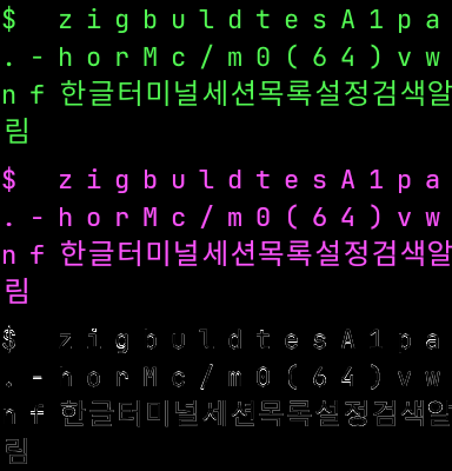

# 모바일 이식 PoC

**"Zig 코어 + chrome 컴포넌트 + 네이티브 GPU"가 iOS/Android 에서 성립하는가**를 실측한다.
설계 논의가 추정 위에서 돌지 않게 하려는 것이고, 제품 코드가 아니다.

```sh
sh tools/mobile-poc/run.sh ios               # 오프스크린 Metal → PNG + 픽셀 판정
sh tools/mobile-poc/run.sh ios-app           # 시뮬레이터 설치·실행 + 스크린샷
sh tools/mobile-poc/run.sh android           # 에뮬레이터 실행 + Vulkan 오프스크린 → PNG
sh tools/mobile-poc/run.sh features-ios      # Metal 로 여섯 기능 판정
sh tools/mobile-poc/run.sh features-android  # Vulkan 으로 같은 여섯 기능 판정
sh tools/mobile-poc/run.sh chrome-ios        # **실제 chrome 컴포넌트**를 시뮬레이터에
sh tools/mobile-poc/run.sh chrome-android    # 같은 draw-list 를 Vulkan 으로(오프스크린)
sh tools/mobile-poc/run.sh chrome-android-app # **에뮬레이터 화면에** NativeActivity+swapchain
sh tools/mobile-poc/run.sh present-ios       # present 페이싱을 표시 클럭으로 실측
#
# 입력 확인: adb shell input text "echo maru" (Android)
# 생명주기 확인: adb shell input keyevent KEYCODE_HOME 뒤 am start 재실행
```

## 무엇을 판정하는가

**화면이 뜨는 것으로는 부족하다.** 픽셀을 읽어 "실제로 그려졌다"를 확인한다 — 새
경로를 만들고 통과만 보는 것은 그 경로가 동작한다는 증거가 아니다.

## 결과

| 단계 | iOS | Android |
|---|---|---|
| 15개 모듈 컴파일 | OK | OK |
| 정적 라이브러리 | OK (arm64 Mach-O) | OK (ELF PIE) |
| 코어 실행 | OK | OK |
| 렌더 → 픽셀 검증 | OK (Metal) | OK (Vulkan) |
| **실제 chrome 컴포넌트 렌더** | **OK** | **OK** |
| 화면 표시 | OK (시뮬레이터) | **OK (에뮬레이터)** |

### 여섯 기능 — maru 가 Metal 세부를 파고들어 얻은 것들

| | iOS (Metal) | Android (Vulkan) |
|---|---|---|
| 1. per-cell clip (ABI v169) | **PASS** | **PASS** |
| 2. blink opacity uniform | **PASS** | **PASS** |
| 3. per-draw blend (premul↔straight) | **PASS** | **PASS** |
| 4. 아틀라스 부분 업데이트 | **PASS** | **PASS** |
| 5. 자연폭 quad | **PASS** | **PASS** |
| 6. present 페이싱 | **PASS** | **PASS** |

여섯 항목이 모두 채워졌다.

**두 백엔드가 픽셀 단위로 같은 값을 낸다** — opacity `G=64,128,191,255`, 자연폭 구간
`26,64,39,90px` 가 동일하다. 6번은 스왑체인이 있어야 존재하는 항목이라 오프스크린으로는
못 봤고, 두 플랫폼을 실제 창에 띄운 뒤 아래처럼 **간격을 재서** 판정했다.

### present 페이싱 실측 (PoC 8)

**요청은 근거가 아니다.** "30Hz 로 설정했다"가 아니라 표시 간격의 중앙값이 판정 기준이다.

| | iOS (`present-ios`) | Android (`chrome-android-app`) |
|---|---|---|
| 계측 시계 | `CADisplayLink.timestamp`(직전 vsync) | `CLOCK_MONOTONIC` present 간격 |
| 자유 실행 | **16.67 ms** (60Hz) | **16.66 ms** (FIFO=vsync) |
| 30Hz 요청 | **33.33 ms** | **33.29~33.31 ms**(AChoreographer) |
| 판정 | **PASS** | **PASS**(vsync 잠금) |

**iOS 의 페이싱 API 는 macOS 와 다르다.** `presentAfterMinimumDuration:`·`presentedTime`·
`addPresentedHandler:` 는 **iOS SDK 에 없다** — iPhoneSimulator26.2.sdk 의 `MTLDrawable` 에는
`present`/`presentAtTime:` 둘뿐이다(실측). iOS 에서 주기를 정하는 것은 `CADisplayLink` 의
`preferredFrameRateRange` 이고, Metal 쪽 수단은 `presentDrawable:atTime:` 와
`CAMetalLayer.maximumDrawableCount`(큐 깊이)다. maru 의 30Hz present(comfort)는 이 경로로 선다.

**Android 하위 주기는 앱이 만든다.** Vulkan present mode(FIFO/MAILBOX/IMMEDIATE)는 전부
"언제 내보낼까"지 "얼마나 자주"가 아니라 30Hz 를 고르는 칸이 없다. `AChoreographer` 로
vsync 를 받아 한 번 걸러 present 하면 33.3ms 가 나온다 — iOS 의 `preferredFrameRateRange`
에 대응하는 자리다.

### chrome 컴포넌트 + 텍스트 + 아이콘 (PoC 6)

`chrome_probe.zig` 가 `chrome.ui.tree` 로 탭 바·사이드바·본문·상태바를 조립하고
`tree.build` → `paint` 로 ChromeDraw 를 얻은 뒤, 플랫폼이 그 op 만 그린다.
**플랫폼은 배치를 모른다** — 화면 크기만 넘기고 quad 목록을 받는다.

| | iOS (Metal) | Android (Vulkan) |
|---|---|---|
| chrome 레이아웃 | OK | OK |
| **한글·영어 글리프** | OK | OK |
| **SVG 아이콘 6종** | OK (6/6) | OK (6/6) |
| safe area | 반영(`safeAreaInsets`) | 반영(`getRootWindowInsets`) |

**아이콘은 Zig 가 만든다.** `renderer/icon_glyph.fillCoverage` 가 등록된 SVG 자산을
coverage 로 펴고 플랫폼은 텍스처로 올려 샘플링만 한다 — **자산이 플랫폼 코드 0줄로
이식된다**는 증거다.

**텍스트 아틀라스는 이제 각 기기가 굽는다**(PoC 10). 호스트 아틀라스(`make_atlas.m`)는
두 백엔드를 1:1 로 대조할 때 쓰던 것이고, 기기 래스터가 실패할 때의 폴백으로만 남는다.
한글 폭은 EAW 규칙대로 2셀이다.

### 두 시뮬레이터 화면 (PoC 7)

Android 도 `NativeActivity` + Vulkan swapchain 으로 **에뮬레이터 화면에** 그린다. Java/Kotlin
코드는 0줄이다 — 매니페스트의 `hasCode="false"` + `android.app.lib_name` 이 전부다.

| | iOS 시뮬레이터 | Android 에뮬레이터 |
|---|---|---|
| 물리 해상도 | 1206×2622 | 1080×2400 |
| 논리 크기 | 402×874 | 411×841 |
| 스케일 출처 | `UIScreen.scale` (3.0) | `AConfiguration_getDensity` (420dpi → 2.625) |
| quad 수 | 148 | 148 |

**스케일을 상수로 박으면 안 된다.** 처음에 2.0 으로 두었더니 논리 크기가 540×1200 이 되어
레이아웃이 화면 위쪽만 채웠다. 기기 density 를 쓰자 iOS 와 거의 같은 논리 크기가 나오고
두 화면이 겹쳐 보인다 — **같은 Zig 코드가 같은 배치를 낸다**는 뜻이다.

**해상도가 다른 것 자체는 결함이 아니다.** 기기가 다르면 물리 픽셀이 다르고, 논리 좌표계로
그리면 결과가 같다. 앞 단계에서 Android 가 540×1140 이었던 것은 기기와 무관하게 내가 정한
오프스크린 캔버스 크기였다.

### 본문은 진짜 터미널 코어다 (PoC 9)

앞 단계 본문은 하드코딩 문자열이었다. 이제 `TerminalCore` 에 VT 바이트를 실제로 먹이고
그 격자를 그린다 — 화면의 색과 폭이 **코어가 계산한 것**이다.

| 화면에 보이는 것 | 어디서 왔나 |
|---|---|
| `All 11 passed.` 초록 | SGR 32 |
| ` M ` 노랑 | SGR 33 |
| `0.1.0` 청록 | SGR 36 |
| `한글 터미널` 자홍 | SGR 35 |
| 한글이 2셀 | 코어의 EAW 판정(`cell.width == 2`) |

색표도 새로 만들지 않았다 — `color.xterm256` 을 그대로 쓴다. 화면 크기가 바뀌면 코어를
그 cols/rows 로 다시 세우므로 **반응형이 코어까지 간다**.

### 각 플랫폼 자체 폰트 래스터 (PoC 10)

호스트 아틀라스를 읽지 않고 **기기에서 굽는다**. 두 플랫폼 모두 외부 라이브러리 없이 섰다.

| | iOS | Android |
|---|---|---|
| 래스터 | CoreText | `android.graphics.Paint`/`Canvas`/`Bitmap` (JNI) |
| 결과 | `atlas_ondevice=384x128 glyphs=49` | `atlas_ondevice=384x128 glyphs=49` |
| 폰트 | **동봉 Jetendard**(OFL) | **동봉 Jetendard**(같은 파일) |
| 한글 폴백 | 불필요(한 파일에 있음) | 불필요 |

**NDK 에는 폰트 래스터가 없다.** 있는 것은 폰트 *탐색*(`AFontMatcher`)뿐이라 FreeType 을
넣어야 하는 줄 알기 쉬운데, JNI 로 `Paint` 를 부르면 안드로이드 자체 폰트 스택으로 굽는다
— `-ljnigraphics` 의 `AndroidBitmap_lockPixels` 로 픽셀을 그대로 읽어 온다.

**폰트는 시스템 것이 아니라 동봉한 것을 쓴다.** maru 는 이미 `assets/fonts/` 에 OFL 폰트를
싣고 있고 그중 **Jetendard** 는 영문과 한글을 한 파일에 담아 폴백이 필요 없다. 시스템 폰트
(Menlo·AppleSDGothicNeo)를 쓰면 플랫폼마다 글자가 갈리는 데다, 그 폰트들은 라이선스 때문에
옮길 수도 없다. iOS 는 번들 리소스, Android 는 `/data/local/tmp` 의 **같은 파일**을 읽는다.

### 같은 폰트일 때 남는 픽셀 차이 (PoC 13)

두 플랫폼이 **같은 ttf** 로 구운 아틀라스를 그대로 꺼내 바이트 대조했다
(`atlas_diff.py`). 남는 것은 순수한 **래스터라이저 차이**(CoreText/CoreGraphics vs Skia)다.

| 항목 | 값 | 뜻 |
|---|---|---|
| 무게중심 0.5px 초과로 밀린 셀 | **0/64** (최대 0.28px) | **글자 위치·크기가 같다** — 격자가 안 밀린다 |
| 값이 다른 칸 | 4904 (ink 의 77.4%) | 대부분 가장자리 |
| 평균 \|Δ\| | **17.5 / 255** (6.9%) | AA 커버리지 차이 |
| 눈에 띄는 차이(\|Δ\|>32) | 656 (ink 의 10.4%) | 획 경계 한두 픽셀 |



위=iOS(초록), 가운데=Android(자홍), 아래=차이를 **3배 증폭**한 것. 증폭했는데도 차이가
**글자 테두리에만** 있고 획 안쪽은 검다.

**판단**: 폰트를 동봉하는 것만으로 실질적 문제(폴백이 갈리는 것)가 사라진다. 남는 것은
안티에일리어싱뿐이라, "래스터까지 우리가 가져와야 하는가"의 답은 **골든 픽셀 테스트를 OS
넘어 공유하고 싶을 때만 그렇다**이다. 화면 품질 때문은 아니다.

### 입력 (PoC 11)

플랫폼이 키를 **바이트로** 코어에 넘긴다. 코어는 그것을 PTY 에서 온 것과 구분하지 않는다.

| | iOS | Android |
|---|---|---|
| 수신 | `UIKeyInput.insertText:` | `AInputEvent`(NativeActivity) |
| 앱이 입력 대상인가 | **OK** — `first_responder=1`, iOS 가 소프트 키보드를 띄웠다 | **OK** |
| OS→코어 왕복 | **OK** — `idb ui text` 로 넣은 키가 본문에 그려졌다 | **OK** — `adb shell input text` 로 넣은 `echo maru test` 가 본문에 그려졌다 |

**`idb` 로 iOS 도 확인했다.** `System Events` 로는 Simulator 창을 못 잡아 못 넣는 줄 알았는데,
`idb`(Facebook 의 iOS Development Bridge)가 깔려 있었다. `idb ui text` 로 넣은 키가
`insertText:` → 코어 → 화면까지 닿는다. `idb ui tap` 으로 터치도 확인했다.

한 가지 덤: macOS 입력기가 한글이라 HID 키가 **한글 IME 를 거쳐** 조합된 글자로 들어온다 —
IME 경로가 서 있다는 뜻이다(다만 preedit/marked text 는 다루지 않았다).

### 터치 → 셀 (PoC 14)

| | iOS | Android |
|---|---|---|
| 수신 | `touchesBegan:` | 미배선 |
| 셀 변환 | **OK** — `idb ui tap 200 300` → 논리 (200,238) → **셀 (12,8)** | — |

**배치를 아는 쪽이 답한다.** 플랫폼은 점만 넘기고 `maru_hit_cell` 이 본문 rect·셀 크기로
푼다 — 그 값은 렌더가 쓴 것과 **같은 변수**다(따로 두면 렌더와 판정이 갈린다).

### 아틀라스는 자란다 (PoC 15)

고정 49자였다. **입력을 넣었더니 코어엔 들어왔는데 화면이 그대로였다** — 그릴 글리프가
없어 조용히 안 그려진 것이다. 이제 Zig 가 못 찾은 코드포인트를 모으고 플랫폼이 그 슬롯만
구워 올린다(아틀라스 부분 업데이트 = 여섯 기능 4번을 그대로 쓴다).

만들면서 실측으로 드러난 것: **아틀라스가 서기 전에 build 가 한 번 돈다.** 그때 모든 글자가
"없음"으로 기록돼, 나중에 이미 있는 'z' 같은 ASCII 를 슬롯만 축내며 다시 굽고 있었다
(`grew=15 first_missing=U+007A`). `maru_atlas_add` 가 등록 시 목록에서 빼도록 고쳤다.

### 백그라운드 생명주기 (PoC 12)

| | iOS | Android |
|---|---|---|
| 나갈 때 | `applicationDidEnterBackground` | `APP_CMD_TERM_WINDOW` → **스왑체인 파괴** |
| 돌아올 때 | `willEnterForeground`, tick 재개 | `APP_CMD_INIT_WINDOW` → 재생성, `quads=148` |
| 결과 | **OK** | **OK**(크래시 없음) |

**Android 는 창 자체가 사라져서 처리가 필수다.** 스왑체인을 들고 있으면 죽은 surface 로
present 하게 된다. iOS 는 UIKit 이 레이어를 살려 둬 그 파괴가 필요 없다 — 같은 "생명주기"라도
플랫폼이 요구하는 일이 다르다.

### 실기기

**못 했다.** 연결된 실기기가 없다(`adb devices` 는 에뮬레이터뿐, `devicectl` 은 "No devices
found"). 시뮬레이터/에뮬레이터로 확인한 것들 중 실기기에서 달라질 수 있는 것은 GPU 드라이버
(에뮬레이터는 `llvmpipe` 소프트웨어 래스터다)와 실제 vsync 다.

## 실측으로 드러난 제약

**Zig 가 iOS 용 `libSystem` 을 링크하지 못한다.** Zig 는 `.a` 까지만 만들고 링크는
clang/NDK 가 맡는다 — 실제 앱에서도 이 구조가 된다.

**ReleaseSafe 는 panic 핸들러를 갈아야 링크된다.** 기본 핸들러가
`_dyld_get_image_header_containing_address` 를 부르는데 시뮬레이터 SDK 에 없다.
`pub const panic = std.debug.simple_panic;` 한 줄로 해결된다 — **안전 검사는 그대로 살고**
스택 트레이스만 빠진다.

**Android 는 PIE 가 필수라 `-fPIC` 가 필요하다.**

**Vulkan 은 NDC 의 Y 가 아래로 향한다**(Metal 은 위로). 같은 rect·UV 로 텍스처가 상하
반전된다 — 아틀라스 패치가 화면 반대편에 나와 잡았다.

**Metal 셰이더 구조체와 C 구조체의 정렬이 다르다.** `float2` 가 8바이트 정렬을 요구해
필드가 밀리고 NDC 변환이 깨졌다 — quad 26개가 생성되는데 화면은 검은 상태였다.
**전부 `float4` 로 맞춰 해결했다.** draw-list 를 C ABI 로 넘기는 구조에서 반복될 종류다.

**자식 노드 슬라이스의 수명을 놓치기 쉽다.** `&.{tree.text(...)}` 는 임시 배열의 주소라
루프를 벗어나면 dangling 이고, `build` 가 그 쓰레기를 읽어 **`DuplicateIdentity` 로**
튄다 — 증상이 원인을 안 가리키는 종류라 값을 찍어 보고서야 알았다.

**`ui.paint` 는 텍스트 op 을 내지 않는다.** `resolveText` 결과를 버리고 typography/lowering
이 따로 맡는 구조다. PoC 는 레이아웃 트리의 text entry rect 를 읽어 그 자리에 글리프를 그린다.

**아이콘 coverage 는 RGBA8 버퍼를 요구한다.** `glyph_pixels.slotFits` 가
`bytes_per_row >= width*4` 를 검사하는데, 단일 채널을 주면 **조용히 0을 돌려준다** —
`filled=0/6` 이 나와도 오류가 아니라 성공처럼 보인다. 셰이더는 alpha 를 coverage 로 읽는다.

**모듈 루트는 `maru.zig` 하나여야 한다.** `chrome` 과 `renderer` 를 따로 주면 둘 다
`icons.zig` 를 상대 경로로 끌어와 "file exists in two modules" 로 깨진다.

**글리프 폭은 셀이 아니라 폰트 advance 로 정한다.** 셀 폭(24px)을 진행 폭으로 쓰면 영문이
그 칸에 갇혀 **자간이 벌어진다**. quad 크기도 셀 종횡비(24:32)를 지켜야 글자가 안 늘어난다.

**폭을 늘릴 때는 `.fill` 이 아니라 `flex.grow` 다.** `card` 의 기본 `direction` 은 `column`
이라 자기 기준으로 width 가 **cross axis** 가 되고, `.fill` 은 main axis 전용이라
`FillOnCrossAxis` 로 거부된다. 부모(row)가 폭을 나눠 주게 하려면 grow 를 쓴다.

**아이콘 크기는 자산마다 다르다.** `fillCoverage` 는 모두 같은 슬롯에 중앙 배치하지만 SVG
여백이 달라 시각 크기가 갈린다. maru 는 이걸 `icons.Fit`(standard/tight)으로 다루고
`search-tight` 같은 별도 자산이 그 증거다 — 모바일에서도 같은 축이 필요하다.

**iOS 는 safe area 를 반영해야 한다.** 창 전체에 그리면 상태바·다이내믹 아일랜드 밑으로
UI 가 들어간다. 데스크톱에서 타이틀바 inset 을 다루는 것과 같은 종류이고, 실제 이식에서는
이 inset 을 L1 DTO 로 chrome 에 전달해야 한다.

## 범위 밖

**실기기**(연결된 기기가 없다), **셸/PTY 연결**(iOS 는 샌드박스가 프로세스 생성을 막아
원격 세션만 가능하다 — 구조를 가르는 질문이라 별도 판단이 필요하다), **Android 터치**,
**IME preedit**(조합 중 표시), 스크롤·선택·복사, 보조 키바, 회전·태블릿, 성능 예산,
아틀라스 축출(지금은 꽉 차면 멈춘다), build.zig·CI 통합.

에뮬레이터 GPU 가 `llvmpipe`(소프트웨어)라 **실제 Android 드라이버에서 같은 결과가
나오는지는 실기기로 확인해야 한다.**
